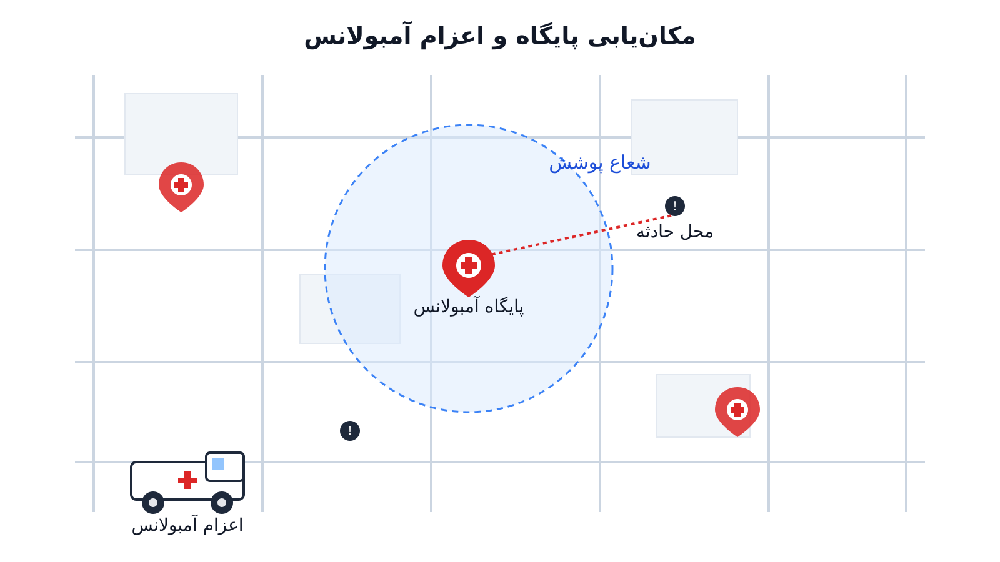

چند دقیقه تأخیر در رسیدن آمبولانس به محل یک ایست قلبی می‌تواند فاصله‌ی بین زندگی و مرگ باشد. همین موضوع ساده، مسئله‌ی مکان‌یابی و اعزام آمبولانس را به یکی از حساس‌ترین کاربردهای بهینه‌سازی در حوزه‌ی سلامت تبدیل کرده است. سؤال ظاهراً ساده‌ای که هر سازمان اورژانس پیش‌بیمارستانی با آن روبه‌روست این است: چند پایگاه آمبولانس نیاز داریم؟

هرکدام را کجا مستقر کنیم و وقتی تماسی می‌رسد، کدام آمبولانس را اعزام کنیم؟ هدف این است که بیشترین جمعیت شهر در کمترین زمان ممکن پوشش داده شود. پاسخ به این سؤال، برخلاف ظاهرش، یک مسئله‌ی بهینه‌سازی ترکیبیاتی جدی است. این مدل، علاوه‌بر هندسه‌ی شهر، باید عدم‌قطعیت تقاضا را هم در نظر بگیرد. همچنین باید در دسترس‌نبودن گاه‌به‌گاه آمبولانس‌ها را در نظر بگیرد، چون ممکن است مشغول مأموریت دیگری باشند.

### چرا مکان‌یابی ساده کافی نیست

اولین راه‌حلی که به ذهن می‌رسد این است. پایگاه‌ها را طوری بچینیم که هر نقطه‌ی شهر در شعاع زمانی مشخصی (مثلاً هشت دقیقه) از حداقل یک پایگاه باشد. این همان مسئله‌ی کلاسیک پوشش مکانی (Location Set Covering Problem) است. اما مشکل اینجاست که در دنیای واقعی، همیشه همه‌ی آمبولانس‌ها در پایگاه خود آماده نیستند. ممکن است در حال انتقال بیمار به بیمارستان باشند یا در حال بازگشت از یک مأموریت دیگر باشند. اگر مدل فرض کند هر پایگاه همیشه یک آمبولانس آزاد دارد، در ساعات پرترافیک شهر با کمبود واقعی پوشش روبه‌رو می‌شویم. مدل اما متوجه این کمبود نمی‌شود.

برای حل این مشکل، پژوهشگران مدل‌های پوشش احتمالاتی را توسعه دادند. مدل حداکثرسازی پوشش (Maximal Covering Location Problem یا MCLP) با تعداد محدودی پایگاه، بیشترین جمعیت را پوشش می‌دهد. این مدل لزوماً به دنبال پوشش کامل همه‌ی نواحی نیست:

$$ \max \sum_{i \in I} d_i z_i $$

$$ \text{s.t.} \quad \sum_{j \in N_i} x_j \geq z_i \quad \forall i \in I $$

$$ \sum_{j \in J} x_j \leq p $$

$$ x_j, z_i \in \{0,1\} $$

در این فرمول‌بندی، $d_i$ تقاضای ناحیه‌ی $i$ است. $x_j$ متغیر باینری استقرار پایگاه در مکان $j$ است. $N_i$ نیز مجموعه‌ی مکان‌هایی است که ناحیه‌ی $i$ را در بازه‌ی زمانی قابل قبول پوشش می‌دهند. اما این مدل هم فرض می‌کند هر پایگاهی که در محدوده باشد، همیشه آمبولانس آزاد دارد؛ فرضی که در عمل نادرست است. برای بررسی مدل حداکثرسازی پوشش و کاربردهای آن در مکان‌یابی آمبولانس، می‌توانید یادداشت [مدل‌های مکان‌یابی و MCLP برای آمبولانس](/notes/ambulance-location-mclp/) را مطالعه کنید.

اینجاست که مدل‌های پیشرفته‌تری مثل MEXCLP (Maximum Expected Covering Location Problem) وارد میدان می‌شوند. این مدل‌ها با معرفی نرخ اشغال یا احتمال مشغول‌بودن $q$ برای هر آمبولانس، پوشش مورد انتظار را حداکثر می‌کنند. به این ترتیب، پوشش قطعی جای خود را به پوشش مورد انتظار می‌دهد. احتمال اینکه حداقل یک آمبولانس از میان $k$ پایگاه پوشش‌دهنده‌ی یک ناحیه در دسترس باشد، برابر است با $1-q^k$. به همین دلیل، این خانواده از مدل‌ها دقیقاً در قلب حوزه‌ی مدل‌سازی عدم‌قطعیت قرار می‌گیرند. چون به‌جای فرض یک دنیای قطعی، احتمال در دسترس‌بودن منابع را صریحاً وارد تابع هدف می‌کنند.

### سمت دیگر مسئله: اعزام لحظه‌ای

مکان‌یابی پایگاه‌ها یک تصمیم بلندمدت (تاکتیکی) است. اما وقتی تماس اورژانس واقعی می‌رسد، یک تصمیم لحظه‌ای و عملیاتی هم باید گرفته شود. کدام آمبولانس آزاد باید اعزام شود؟ نزدیک‌ترین آمبولانس همیشه بهترین انتخاب نیست. اگر آن را برای یک مورد کم‌اهمیت‌تر بفرستیم، ممکن است ناحیه‌ای که آن آمبولانس پوشش می‌داد، برای چند دقیقه بدون پوشش بماند. اگر در همان بازه یک تماس اورژانسی‌تر از همان ناحیه برسد، هزینه‌ی این تصمیم بسیار بالا خواهد بود. به همین دلیل، بسیاری از سیستم‌های واقعی از سیاست‌های اعزام هدفمند (compliance table) یا حتی بازآرایی پویا (dynamic relocation) استفاده می‌کنند. وقتی یک آمبولانس اعزام می‌شود، آمبولانس‌های دیگر برای جبران خلأ پوششی، به‌طور موقت جابه‌جا می‌شوند.

### اهمیت این موضوع در دنیای واقعی

سازمان‌های اورژانس پیش‌بیمارستانی در سراسر دنیا مستقیماً با این مسئله دست‌وپنجه نرم می‌کنند. شرکتی مثل فالک (Falck) در دانمارک و چند کشور اروپایی خدمات آمبولانس و اورژانس پیش‌بیمارستانی ارائه می‌دهد. این شرکت باید همزمان با محدودیت بودجه و انتظار شهروندان برای پاسخ سریع کنار بیاید. باید تصمیم بگیرد چند آمبولانس در هر منطقه مستقر کند. همچنین باید تصمیم بگیرد آن‌ها را چطور در طول شبانه‌روز جابه‌جا کند. الگوی تماس‌ها در ساعات مختلف شبانه‌روز بسیار متفاوت است.

در شهرهای بزرگ، حتی چند درصد بهبود در زمان پاسخ می‌تواند به معنای نجات جان چند بیمار در سال باشد. همین موضوع باعث شده مدل‌های پوشش احتمالاتی از یک تمرین دانشگاهی به ابزاری عملیاتی در مراکز فرماندهی اورژانس تبدیل شوند. علاوه‌بر بعد انسانی، بعد اقتصادی هم جدی است. هر پایگاه و هر آمبولانس اضافه هزینه‌ی ثابت و متغیر قابل‌توجهی دارد. پس تصمیم درباره‌ی تعداد و محل بهینه‌ی پایگاه‌ها مستقیماً روی بودجه‌ی سلامت عمومی اثر می‌گذارد.

### ظرفیت کار آکادمیک و پژوهشی

این حوزه یکی از پرثمرترین زمینه‌های پژوهشی در تقاطع تحقیق در عملیات و سلامت عمومی است. مدل‌های صف احتمالاتی مثل مدل ابرمکعب (Hypercube Queueing Model) رفتار پویای چند سرور را مدل می‌کنند. این مدل‌ها دقیق‌تر از فرمول‌های ساده‌ی $q$ ثابت عمل می‌کنند و همچنان موضوع پایان‌نامه‌ها و مقالات متعددند.

مسیرهای پژوهشی باز دیگر شامل ترکیب پیش‌بینی تقاضا با یادگیری ماشین برای تخمین الگوی مکانی-زمانی تماس‌های اورژانسی است. مسیر دیگر مدل‌های بازآرایی پویای آمبولانس تحت عدم‌قطعیت است. همچنین بهینه‌سازی چندهدفه‌ای مطرح است که هم‌زمان کارایی (میانگین زمان پاسخ) و عدالت را در نظر می‌گیرد. منظور از عدالت، توزیع یکسان کیفیت خدمت بین مناطق شهری و حاشیه‌ای یا کم‌برخوردار است. تلاقی این مسئله با بهینه‌سازی تصادفی و برنامه‌ریزی پویا نیز مسیرهای متعددی برای کار پژوهشی جدی باز نگه داشته است.

### پیاده‌سازی با پایتون

خبر خوب این است که این دسته از مدل‌ها را می‌توان کاملاً با ابزارهای متن‌باز و رایگان پایتون پیاده‌سازی کرد. برای این کار به هیچ نرم‌افزار یا سالور تجاری گران‌قیمت نیازی نیست. برای مدل‌های پوشش مکانی مثل LSCP و MCLP که ساختار برنامه‌ریزی خطی عدد صحیح دارند، کتابخانه‌ای مثل [PuLP](https://coin-or.github.io/pulp/) گزینه‌ی خوبی است. این کتابخانه به همراه سالورهای متن‌باز مثل [CBC](https://github.com/coin-or/Cbc) یا [HiGHS](https://highs.dev/) به‌خوبی جواب می‌دهد.

وقتی مسئله پیچیده‌تر می‌شود و محدودیت‌های منطقی و ترکیبیاتی بیشتری (مثل قوانین اعزام یا پوشش چندلایه) لازم است. [OR-Tools](https://developers.google.com/optimization) گوگل و به‌خصوص ماژول CP-SAT آن، برای برنامه‌ریزی محدودیت گزینه‌ی بسیار قدرتمندی است. برای تحلیل شبکه‌ی معابر شهری و محاسبه‌ی زمان دسترسی واقعی (نه فاصله‌ی مستقیم)، می‌توان از کتابخانه‌ی [NetworkX](https://networkx.org/) استفاده کرد. این کتابخانه به همراه داده‌های شبکه‌ی راه می‌تواند فاصله‌های زمانی واقعی‌تری نسبت به فاصله‌ی اقلیدسی محاسبه کند.

در عمل، داده‌های ورودی مسئله را می‌توان از یک فایل اکسل یا CSV خواند. این فایل شامل ستون‌هایی مثل شناسه‌ی ناحیه‌ی تقاضا، جمعیت یا تعداد تماس تاریخی است. همچنین شامل مختصات مکان‌های کاندید پایگاه و ماتریس زمان دسترسی بین نواحی و پایگاه‌ها می‌شود. این داده‌ها را می‌توان مستقیماً به مدل تغذیه کرد. همین سادگی در آماده‌سازی داده باعث می‌شود این مدل‌ها برای شهرداری‌ها و سازمان‌های اورژانس با بودجه‌ی محدود هم در دسترس باشند.

### سوالات متداول

<h3>تفاوت مدل حداکثرسازی پوشش با مدل پوشش احتمالاتی چیست؟</h3>

مدل حداکثرسازی پوشش ساده (MCLP) فرض می‌کند هر پایگاهی که در محدوده‌ی زمانی قرار دارد، همیشه یک آمبولانس آزاد دارد. مدل‌های پوشش احتمالاتی مثل MEXCLP این فرض را کنار می‌گذارند. این مدل‌ها با در نظر گرفتن احتمال مشغول‌بودن هر آمبولانس، تخمین واقع‌بینانه‌تری از پوشش مورد انتظار ارائه می‌دهند. به همین دلیل این مدل‌ها به مدل‌سازی عدم‌قطعیت نزدیک‌ترند.

<h3>آیا این مدل‌ها فقط برای شهرهای بزرگ کاربرد دارند؟</h3>

خیر. حتی در مناطق روستایی یا شهرهای کوچک‌تر که تعداد آمبولانس محدودتر است، تصمیم درباره‌ی محل استقرار چند پایگاه اهمیت بیشتری پیدا می‌کند. چون امکان جبران با تعداد بالای آمبولانس وجود ندارد. اگر می‌خواهید مبانی این نوع مدل‌سازی را با OR-Tools و CP-SAT یاد بگیرید، ده‌ها مسئله در حوزه‌ی سلامت پروژه‌محور آموزش داده می‌شود. دوره‌ی <a href="/courses/health-opt/" style="color:#2563EB; font-weight:bold;">بهینه‌سازی سیستم‌های سلامت با پایتون</a> برای همین منظور طراحی شده است.

<h3>اگر داده‌های سازمان ما با مدل‌های استاندارد مقاله‌ها جور درنمی‌آید، چه کار کنیم؟</h3>

این موضوع کاملاً طبیعی است. هر شهر و هر سازمان اورژانس الگوی تماس، شبکه‌ی معابر و محدودیت بودجه‌ی خاص خودش را دارد. به همین دلیل، مدل‌های استاندارد معمولاً باید متناسب‌سازی شوند. برای این‌گونه پیاده‌سازی‌های اختصاصی و متناسب با داده‌های واقعی سازمان شما، می‌توانید از خدمات <a href="/consultation/" style="color:#2563EB; font-weight:bold;">مشاوره</a> استفاده کنید.

