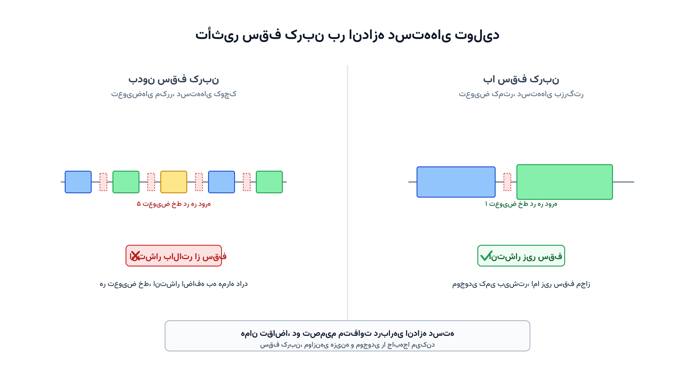

تصور کنید مدیر تولید یک کارخانه‌ی محصولات لبنی هستید. روی یک خط پرکنی مشترک، چند نوع ماست و دوغ تولید می‌شود. هر بار تعویض محصول، هم زمان می‌برد و هم انرژی مصرف می‌کند. تا چند سال پیش، تنها دغدغه‌ی شما هزینه بود؛ هزینه‌ی تعویض خط در برابر هزینه‌ی نگهداری موجودی. اما امروز یک محدودیت تازه هم وارد میدان شده: سقف انتشار کربن.

بسیاری از شرکت‌های تولیدی حالا زیر نظام‌های تجارت کربن مثل سامانه‌ی اتحادیه اروپا (EU ETS) فعالیت می‌کنند. این یعنی هر تن کربنی که از تولید منتشر می‌شود، هزینه یا سقف مشخصی دارد. سوال قدیمیِ «چقدر و کِی تولید کنیم» حالا بُعد تازه‌ای گرفته است. باید این تصمیم را زیر یک سقف انتشار کربن هم بهینه کرد. این دقیقاً همان چیزی است که به آن «اندازه انباشته تولید تحت محدودیت کربن» یا Carbon-Constrained Lot Sizing Problem می‌گویند.

### چرا این مسئله با مدل‌های کلاسیک فرق دارد؟

مدل‌های کلاسیک اندازه انباشته، مثل مقدار سفارش اقتصادی یا زمان‌بندی اقتصادی تولید چندمحصولی، فقط هزینه را کمینه می‌کنند. کربن در آن‌ها اصلاً دیده نمی‌شود. طراحی شبکه زنجیره تأمین سبز هم مسئله‌ی متفاوتی است. آن یک تصمیم راهبردی درباره‌ی مکان کارخانه و انبار است، نه برنامه‌ریزی روزانه‌ی تولید.

مسئله‌ی اندازه انباشته سبز در سطح عملیاتی‌تری قرار دارد. هر بار تعویض خط، هر واحد تولیدشده و حتی هر واحد موجودی نگه‌داشته‌شده، ردپای کربن خودش را دارد. تعویض خط معمولاً یعنی روشن و خاموش شدن تجهیزات، که خودش مصرف انرژی لحظه‌ای بالایی دارد. نگهداری موجودی هم، به‌خصوص برای محصولات سردخانه‌ای، انرژی سرمایش مصرف می‌کند. مدل باید همه‌ی این‌ها را هم‌زمان ببیند.

### فرمول‌بندی ریاضی

فرض کنید افق برنامه‌ریزی به دوره‌های $t \in T$ تقسیم شده و محصولات را با $i \in I$ نشان می‌دهیم. تقاضای هر محصول در هر دوره $d_{i,t}$ است. متغیر تصمیم $x_{i,t} \ge 0$ مقدار تولید محصول $i$ در دوره $t$ است. متغیر باینری $y_{i,t}$ برابر یک است اگر خط برای محصول $i$ در دوره $t$ تعویض و راه‌اندازی شود. موجودی پایان دوره هم با $I_{i,t} \ge 0$ نشان داده می‌شود.

هدف مدل، کمینه‌کردن هزینه‌ی کل تولید، تعویض خط و نگهداری موجودی است:

$$
\min \sum_{t \in T} \sum_{i \in I} \left( c_i x_{i,t} + s_i y_{i,t} + h_i I_{i,t} \right)
$$

موازنه‌ی موجودی در هر دوره باید برقرار بماند:

$$
I_{i,t-1} + x_{i,t} = d_{i,t} + I_{i,t} \qquad \forall i \in I, t \in T
$$

تولید فقط زمانی مجاز است که تعویض خط انجام شده باشد:

$$
x_{i,t} \le M_i \, y_{i,t} \qquad \forall i \in I, t \in T
$$

و ظرفیت خط در هر دوره باید رعایت شود:

$$
\sum_{i \in I} \left( a_i x_{i,t} + \tau_i y_{i,t} \right) \le C_t \qquad \forall t \in T
$$

قید تازه‌ای که این مدل را از اندازه انباشته کلاسیک متمایز می‌کند، سقف کربن است. هر واحد تولید انتشار $e_i$ دارد و هر تعویض خط هم انتشار $\varepsilon_i$ ثابت دارد:

$$
\sum_{i \in I} \left( e_i x_{i,t} + \varepsilon_i y_{i,t} \right) \le E_t \qquad \forall t \in T
$$

این نوع قید در واقع نسخه‌ای از [تکنیک اپسیلون محدود](/notes/epsilon-constraint-bi-objective/) است. به‌جای دو هدف متعارض هزینه و انتشار، یکی از آن‌ها به‌صورت یک سقف ثابت در قید می‌آید. نکته‌ی جالب این قید این است که رفتار مدل را کاملاً عوض می‌کند. بدون سقف کربن، مدل ممکن است تعویض‌های مکرر و دسته‌های کوچک را انتخاب کند تا موجودی پایین بماند. با سقف کربن، چون هر تعویض هم انتشار دارد، رفتار مدل تغییر می‌کند. مدل گاهی ترجیح می‌دهد دسته‌های بزرگ‌تر بسازد و موجودی بیشتری نگه دارد، حتی اگر هزینه‌ی نگهداری کمی بالاتر برود.



### اهمیت این موضوع در دنیای واقعی

مقررات کربن دیگر یک بحث نظری نیست. شرکتی مثل نستله (Nestlé) ده‌ها خط تولید غذایی و لبنی در کشورهای مختلف اداره می‌کند. این شرکت رسماً هدف کاهش انتشار کربن اعلام کرده است. برای چنین شرکتی، برنامه‌ریزی روزانه‌ی تولید دیگر فقط درباره‌ی هزینه نیست؛ باید همزمان زیر سقف‌های انتشار تعیین‌شده هم بماند.

از منظر اقتصادی هم، قیمت هر تن کربن در بازارهایی مثل EU ETS دائم نوسان می‌کند. مدلی که رابطه‌ی هزینه و انتشار را همزمان ببیند، مزیت رقابتی واقعی ایجاد می‌کند. شرکتی که بتواند تولید را با هزینه‌ی کمتر و انتشار پایین‌تر برنامه‌ریزی کند، برنده‌ی واقعی است. این شرکت هم در بازار محصول و هم در بازار کربن جلو می‌افتد. صنایع پرمصرف انرژی مثل غذا، شیمیایی و بسته‌بندی، بیشترین فشار را برای چنین بازنگری‌ای حس می‌کنند.

نکته‌ی مهم دیگر این است که مشتریان بزرگ زنجیره تأمین هم، مثل خرده‌فروشی‌های زنجیره‌ای، از تأمین‌کنندگان خود گزارش ردپای کربن محصول می‌خواهند. برنامه‌ریزی تولید سبز، دیگر فقط یک انتخاب داوطلبانه نیست؛ بخشی از شرط ورود به بسیاری از زنجیره‌های تأمین بزرگ شده است.

### ظرفیت کار آکادمیک و پژوهشی

اندازه انباشته تحت محدودیت کربن حوزه‌ای نسبتاً جوان و بسیار فعال در پژوهش عملیاتی است. یک مسیر پژوهشی رایج، مقایسه‌ی سیاست‌های مختلف تنظیم کربن است. سقف ثابت، سقف قابل‌تجارت (Cap-and-Trade) و مالیات کربن، هرکدام رفتار متفاوتی از مدل بیرون می‌کشند. مسیر دیگر، گسترش مدل به چند سطح زنجیره تأمین است. یعنی هم‌زمان تولید، انبارداری و توزیع را زیر یک سقف کربن مشترک بهینه کرد.

جهت سوم، ترکیب این مسئله با عدم‌قطعیت در ضریب انتشار یا قیمت کربن است. ضریب انتشار واقعی هر فرآیند همیشه دقیق دانسته نمی‌شود و قیمت کربن هم در بازار نوسان می‌کند. بهینه‌سازی استوار یا تصادفی برای این مسئله هنوز جای کار پژوهشی زیادی دارد. جهت چهارم، پیوند اندازه انباشته سبز با در دسترس‌بودن انرژی تجدیدپذیر است. یعنی تولید را به ساعاتی منتقل کرد که برق تجدیدپذیر ارزان‌تر یا در دسترس‌تر است. این نوع «زمان‌بندی سبز» یکی از موضوعات داغ سال‌های اخیر است.

### پیاده‌سازی با پایتون

خبر خوب این است که این مدل را می‌توان بدون هیچ نرم‌افزار تجاری گران‌قیمتی حل کرد. ساختار مسئله یک برنامه‌ریزی عدد صحیح مختلط چندمتغیره است. برای این ساختار، کتابخانه‌ی متن‌باز [PuLP](https://coin-or.github.io/pulp/) همراه با سالورهایی مثل [CBC](https://github.com/coin-or/Cbc) یا [HiGHS](https://highs.dev/) گزینه‌ی مناسبی است. برای نسخه‌های بزرگ‌تر با چند سطح زنجیره تأمین، [Pyomo](http://www.pyomo.org/) هم انعطاف بیشتری برای مدل‌سازی قیدهای پیچیده‌تر فراهم می‌کند.

داده‌های ورودی معمولاً از یک فایل CSV خوانده می‌شوند. این فایل تقاضای هر محصول در هر دوره و هزینه‌های تعویض و نگهداری را شامل می‌شود. ضریب انتشار هر واحد تولید و هر تعویض هم در همان فایل می‌آید. کد زیر یک نسخه‌ی ساده‌شده با دو محصول و سه دوره را با PuLP حل می‌کند:

```python
import pulp

items = ["A", "B"]
periods = [1, 2, 3]
demand = {("A", 1): 50, ("A", 2): 60, ("A", 3): 55,
          ("B", 1): 40, ("B", 2): 45, ("B", 3): 50}
setup_cost = {"A": 300, "B": 250}
hold_cost = {"A": 2, "B": 2.5}
setup_emission = {"A": 40, "B": 35}
unit_emission = {"A": 0.8, "B": 1.1}
carbon_cap = 140  # سقف انتشار مجاز در هر دوره

model = pulp.LpProblem("carbon_constrained_lot_sizing", pulp.LpMinimize)
x = pulp.LpVariable.dicts("x", (items, periods), lowBound=0)
y = pulp.LpVariable.dicts("y", (items, periods), cat="Binary")
inv = pulp.LpVariable.dicts("inv", (items, periods), lowBound=0)

model += pulp.lpSum(setup_cost[i] * y[i][t] + hold_cost[i] * inv[i][t]
                     for i in items for t in periods)

for i in items:
    prev_inv = 0
    for t in periods:
        model += prev_inv + x[i][t] == demand[(i, t)] + inv[i][t]
        model += x[i][t] <= 1000 * y[i][t]
        prev_inv = inv[i][t]

for t in periods:
    model += pulp.lpSum(unit_emission[i] * x[i][t] + setup_emission[i] * y[i][t]
                         for i in items) <= carbon_cap

model.solve(pulp.PULP_CBC_CMD(msg=False))

for t in periods:
    for i in items:
        print(f"دوره {t}, محصول {i}: تولید={x[i][t].value()}, تعویض={int(y[i][t].value())}")
```

اگر سالور جوابی برنگرداند یا هزینه به‌شدت بالا رفت، معمولاً یعنی سقف کربن با ظرفیت خط سازگار نیست. در این حالت باید سقف را با تیم پایداری شرکت بازبینی کرد یا سرمایه‌گذاری روی تجهیزات کم‌انتشارتر را در نظر گرفت. برای مسائل بزرگ‌تر با ده‌ها محصول، همین ساختار مدل بدون تغییر مفهومی، فقط با داده‌ی بیشتر، قابل استفاده است. دوره [مسیریابی وسایل نقلیه با پایتون](/courses/vrp-python/) پایه‌ی خوبی برای این مسیر است. آشنایی با مدل‌سازی موجودی چندسطحی و زنجیره تأمین، گسترش این مدل به مسائل واقعی را ساده‌تر می‌کند.

### سوالات متداول

<h3>آیا این مدل فقط برای شرکت‌هایی که مشمول قوانین رسمی کربن هستند کاربرد دارد؟</h3>
<p>نه؛ حتی بدون الزام قانونی، بسیاری از شرکت‌ها برای گزارش‌دهی پایداری یا تعهدات داوطلبانه‌ی زیست‌محیطی به چنین مدلی نیاز دارند. سقف کربن می‌تواند یک هدف داخلی شرکت هم باشد، نه فقط یک الزام بیرونی.</p>

<h3>این نوع مسائل کنترل موجودی و زنجیره تأمین سبز را کجا می‌توان پروژه‌محور یاد گرفت؟</h3>
<p>دوره <a href="/courses/vrp-python/" style="color:#2563EB; font-weight:bold;">مسیریابی وسایل نقلیه با پایتون</a> پایه‌ی مدل‌سازی و حل مسائل موجودی و زنجیره تأمین با ابزارهای متن‌باز پایتون را پوشش می‌دهد.</p>

<h3>برای پیاده‌سازی این مدل روی داده‌های واقعی خط تولید یا زنجیره تأمین خودمان چه باید کرد؟</h3>
<p>ضریب انتشار، ظرفیت خط و ساختار هزینه در هر کارخانه متفاوت است. بهتر است مدل با داده‌های واقعی همان خط تولید طراحی شود. از طریق <a href="/consultation/" style="color:#2563EB; font-weight:bold;">مشاوره</a> می‌توانید جزئیات پروژه را مطرح کنید.</p>
