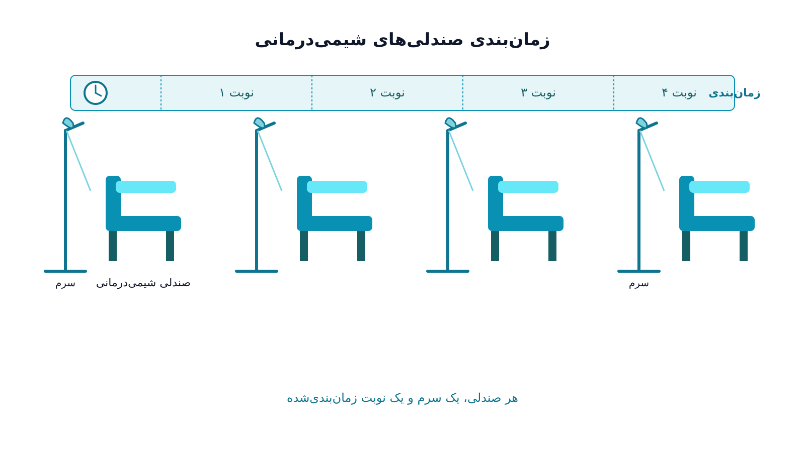

بخش شیمی‌درمانی سرپایی یک بیمارستان را تصور کنید. ردیفی از صندلی‌های راحتی وجود دارد. هرکدام به یک پمپ انفوزیون و کیسه سرم وصل است. بیماران برای دریافت داروی خود ساعت‌ها روی همین صندلی‌ها می‌نشینند.

برخلاف اتاق عمل، هر جراحی یک بلوک زمانی مشخص دارد. اما اینجا هر بیمار چند مرحله را طی می‌کند. ابتدا نوبت آزمایش خون و مشاوره با پزشک است. سپس داروی اختصاصی در داروخانه آماده می‌شود؛ این کار گاهی دو تا سه ساعت طول می‌کشد. در نهایت بیمار روی صندلی می‌نشیند تا انفوزیون دریافت کند. مدت این انفوزیون از نیم ساعت تا هشت ساعت متغیر است.

مدیر بخش باید هم‌زمان چند تصمیم بگیرد. باید مشخص کند کدام بیمار در کدام صندلی و چه ساعتی بنشیند. همچنین باید تعیین کند کدام پرستار مسئول کدام گروه از صندلی‌هاست. علاوه بر این، باید این زنجیره را با زمان آماده‌سازی داروخانه هماهنگ کند. همه این‌ها در حالی رخ می‌دهد که تعداد صندلی‌ها و پرستاران بخش ثابت و محدود است.

این وضعیت در ادبیات پژوهش در عملیات سلامت نامی خاص دارد. به آن زمان‌بندی صندلی شیمی‌درمانی یا Chemotherapy Chair Scheduling می‌گویند. این مسئله شباهت ظاهری به زمان‌بندی اتاق عمل دارد، اما ماهیت آن متفاوت است. در اینجا «صندلی» به‌جای «اتاق» منبع محدودکننده است. همچنین زمان آماده‌سازی دارو یک قید پیش‌نیازی اضافه به کل مسئله تحمیل می‌کند. برای درک بهتر پایه‌های ریاضی این نوع مدل‌سازی، می‌توان به مباحث [بهینه‌سازی سیستم‌های سلامت](/courses/health-opt/) به‌عنوان زمینه‌ای مفید مراجعه کرد.

آنچه این مسئله را واقعاً پیچیده می‌کند، وابستگی زنجیره‌ای بین منابع مختلف است. اگر داروخانه دیرتر از موعد دارو را آماده کند، بیمار نمی‌تواند سر ساعت روی صندلی بنشیند. این اتفاق حتی زمانی رخ می‌دهد که صندلی خالی باشد. برعکس، اگر صندلی به‌موقع آزاد نشود، دارو بلااستفاده می‌ماند. این دارو با هزینه بالا و عمر مفید کوتاه آماده شده است. به همین دلیل، یک زمان‌بندی خوب باید سه لایه منبع را هم‌زمان در نظر بگیرد. این سه لایه شامل زمان آماده‌سازی داروخانه، ظرفیت صندلی‌های انفوزیون، و در دسترس‌بودن پرستاران آموزش‌دیده است. این پرستاران باید مجاز به تجویز داروهای شیمی‌درمانی باشند.

### اهمیت این موضوع

بخش‌های شیمی‌درمانی سرپایی معمولاً از پرتقاضاترین بخش‌های هر مرکز سرطان‌شناسی هستند. این بخش‌ها هم‌زمان از محدودترین بخش‌ها نیز به‌شمار می‌روند. افزودن یک صندلی جدید نیازمند فضای فیزیکی و تجهیزات جدید است. همچنین نیروی پرستاری آموزش‌دیده لازم دارد که هزینه سرمایه‌گذاری بالایی دارد. در همین حال، تقاضا برای درمان سرطان در بسیاری از کشورها هر سال رشد می‌کند.

زمان‌بندی ضعیف در این بخش به دو شکل خودش را نشان می‌دهد. از یک طرف، صندلی‌های خالی در بخشی از روز ظرفیت گران‌قیمت بخش را هدر می‌دهند. از طرف دیگر، بیمارانی با ضعف جسمی ناشی از بیماری ساعت‌ها در اتاق انتظار می‌مانند تا نوبتشان برسد. این تأخیر برای بیمار سرطانی نه فقط ناراحت‌کننده، بلکه گاهی از نظر بالینی هم مضر است. علت این است که برخی پروتکل‌های درمانی به فاصله زمانی دقیق بین جلسات حساس‌اند.

مراکز جامع درمان سرطان بزرگی مانند MD Anderson Cancer Center در آمریکا سال‌هاست تیم‌های تحلیل عملیات اختصاصی دارند. این تیم‌ها روی بهینه‌سازی جریان بیماران در بخش انفوزیون کار می‌کنند. دلیل این کار روشن است: کاهش چند دقیقه‌ای در میانگین زمان انتظار هر بیمار اهمیت زیادی دارد. این تأثیر در مقیاس هزاران جلسه درمانی در سال، هم به معنای رضایت و سلامت روانی بیشتر بیماران است. هم امکان درمان تعداد بیشتری بیمار در همان زیرساخت موجود را فراهم می‌کند، بدون نیاز به هزینه اضافه برای گسترش فیزیکی بخش.

### فرمول‌بندی ریاضی مسئله

برای مدل‌سازی این مسئله، جلسه درمانی بیمار $i$ را می‌توان با یک متغیر فاصله‌ای (Interval Variable) نشان داد. این متغیر روی یکی از صندلی‌ها تعریف می‌شود. فرض کنید $c_i$ زمان آماده‌سازی داروی بیمار $i$ در داروخانه باشد. همچنین $s_i$ زمان شروع نشستن روی صندلی و $p_i$ مدت‌زمان انفوزیون باشد. اولین قید مهم این است که صندلی نمی‌تواند زودتر از آماده‌شدن دارو اشغال شود:

$$s_i \ge c_i$$

هر صندلی در هر لحظه فقط باید به یک بیمار اختصاص یابد. برای این منظور، از محدودیت عدم همپوشانی بین هر دو بیمار $i$ و $j$ استفاده می‌شود. این دو بیمار روی یک صندلی $k$ قرار گرفته‌اند:

$$x_{ik} = x_{jk} = 1 \Rightarrow s_i + p_i \le s_j \ \text{or} \ s_j + p_j \le s_i$$

هر پرستار می‌تواند هم‌زمان مسئول چند صندلی باشد. اما این مسئولیت تا سقف مشخصی از بیماران فعال محدود است. به همین دلیل، یک محدودیت ظرفیت پرستاری هم به‌صورت زیر اضافه می‌شود:

$$\sum_{i \in A(t)} y_{in} \le N_n \quad \forall n, \forall t$$

در این رابطه، $A(t)$ مجموعه بیمارانی است که در لحظه $t$ در حال دریافت درمان‌اند. همچنین $N_n$ حداکثر ظرفیت هم‌زمان پرستار $n$ است. تابع هدف معمولاً ترکیبی از حداقل‌کردن زمان انتظار کل بیماران و حداکثرکردن استفاده از صندلی‌ها در طول ساعات کاری بخش است:

$$\min \sum_{i} w_i (s_i - r_i) + \beta \sum_{k} \text{IdleTime}_k$$

که در آن $r_i$ زمان آماده و حاضر بودن بیمار برای شروع درمان و $w_i$ وزن اولویت بالینی اوست. در عمل، این مسئله ماهیت زنجیره‌ای دارد و شامل چند نوع منبع هم‌زمان است: دارو، صندلی و پرستار. به همین دلیل، این مسئله را معمولاً با متغیرهای فاصله‌ای و محدودیت‌های تجمعی (Cumulative Constraints) در چارچوب برنامه‌ریزی محدودیت مدل می‌کنند. دلیل این انتخاب آن است که فرمول‌بندی خطی کلاسیک برای این نوع وابستگی زنجیره‌ای پیچیده و کند می‌شود.

### ظرفیت کار آکادمیک و پژوهشی

زمان‌بندی صندلی شیمی‌درمانی نسبت به زمان‌بندی اتاق عمل یا زمان‌بندی پرستاران حوزه‌ای جوان‌تر است. این حوزه اما به‌شدت رو به رشد در ادبیات پژوهش در عملیات سلامت است. همچنان جای کار پژوهشی زیادی در این زمینه وجود دارد. یک مسیر پژوهشی فعال، مدل‌سازی عدم‌قطعیت مدت‌زمان انفوزیون است. واکنش هر بیمار به دارو از پیش دقیقاً معلوم نیست. همچنین احتمال بروز عوارض جانبی حین درمان از قبل مشخص نیست. رویکردهایی مانند برنامه‌ریزی تصادفی یا بهینه‌سازی استوار می‌توانند زمان‌بندی را در برابر این نااطمینانی مقاوم‌تر کنند. مسیر پژوهشی دیگر، هماهنگی هم‌زمان زنجیره داروخانه-صندلی-پرستار است. این هماهنگی هنوز در بسیاری از مقالات به‌صورت جداگانه بررسی می‌شود، نه یکپارچه. در عمل، اما این سه منبع به‌شدت به هم وابسته‌اند.

همچنین موضوعاتی دیگر می‌توانند مبنای خوبی برای پژوهش باشند. یک نمونه، زمان‌بندی عادلانه بین بیماران با اولویت‌های بالینی متفاوت است. نمونه دیگر، برنامه‌ریزی چندروزه برای بیمارانی است که پروتکل درمانی‌شان چند هفته طول می‌کشد. در این حالت باید فاصله دقیق بین جلسات رعایت شود. این موضوعات می‌توانند مبنای یک پایان‌نامه کارشناسی ارشد یا مقاله پژوهشی باشند. این حوزه در تقاطع پژوهش در عملیات و مدیریت خدمات سلامت قرار دارد.

### پیاده‌سازی با پایتون

برای حل این مسئله نیازی به نرم‌افزار تجاری گران‌قیمت نیست. کتابخانه متن‌باز [OR-Tools](https://developers.google.com/optimization) گوگل برای این کار بسیار مناسب است. به‌ویژه ماژول CP-SAT آن ابزاری قدرتمند محسوب می‌شود. مفهوم متغیرهای فاصله‌ای و محدودیت تجمعی (Cumulative) دقیقاً برای این نوع مسئله طراحی شده است. این ابزار مدل‌سازی هم‌زمان صندلی، پرستار و پیش‌نیاز آماده‌سازی دارو را ساده می‌کند. داده‌های ورودی شامل فهرست بیماران، مدت‌زمان تخمینی انفوزیون هر پروتکل، و زمان آماده‌سازی داروخانه است.

این داده‌ها را می‌توان از یک فایل اکسل یا CSV خواند. این فایل باید ستون‌های شناسه بیمار، نوع پروتکل، مدت‌زمان و ساعت آماده‌بودن دارو را داشته باشد. سپس این داده‌ها مستقیماً به مدل داده می‌شوند. برای مراکزی که مسئله را با نگاه هزینه‌ای و خطی‌تر می‌بینند، گزینه دیگری هم وجود دارد. ترکیب [Pyomo](https://www.pyomo.org/) یا [PuLP](https://coin-or.github.io/pulp/) با سالورهای متن‌باز مانند [HiGHS](https://highs.dev/) یا [CBC](https://github.com/coin-or/Cbc) قابل‌اجراست. نکته کلیدی این است که حتی یک بخش شیمی‌درمانی کوچک در یک بیمارستان دولتی هم می‌تواند از این ابزارها استفاده کند. این بخش شاید بودجه‌ای برای نرم‌افزارهای تجاری زمان‌بندی بیمارستانی نداشته باشد. با این حال، می‌تواند با همین ابزارهای متن‌باز پایتون یک سیستم زمان‌بندی کاربردی و رایگان برای خودش بسازد.

### سوالات متداول

<h3>چه تفاوتی بین زمان‌بندی صندلی شیمی‌درمانی و زمان‌بندی اتاق عمل وجود دارد؟</h3>

در زمان‌بندی اتاق عمل، منبع اصلی «اتاق» و «جراح» است. اما در بخش شیمی‌درمانی، منبع اصلی «صندلی» و «پرستار» است. علاوه بر این، یک قید پیش‌نیازی اضافه هم به مسئله اضافه می‌شود: آماده‌سازی دارو در داروخانه. این قید وابستگی زنجیره‌ای خاص خودش را ایجاد می‌کند.

<h3>برای یادگیری مدل‌سازی این‌گونه مسائل بهینه‌سازی در حوزه سلامت از کجا شروع کنم؟</h3>

دوره <a href="/courses/health-opt/" style="color:#2563EB; font-weight:bold;">بهینه‌سازی سیستم‌های سلامت با پایتون</a> به‌صورت پروژه‌محور همین نوع مسائل را پوشش می‌دهد. این دوره زمان‌بندی و تخصیص منابع در محیط بیمارستانی را با OR-Tools آموزش می‌دهد و نقطه شروع مناسبی است.

<h3>اگر مرکز درمانی من نیاز به یک سیستم زمان‌بندی اختصاصی برای بخش انفوزیون یا شیمی‌درمانی دارد چه کنم؟</h3>

هر مرکز درمانی محدودیت‌های خاص خودش را از نظر تعداد صندلی، تعداد پرستار و پروتکل‌های دارویی دارد. مدل‌سازی دقیق این محدودیت‌ها نیاز به بررسی اختصاصی دارد. می‌توانید از طریق صفحه <a href="/consultation/" style="color:#2563EB; font-weight:bold;">مشاوره</a> جزئیات مسئله خودتان را در میان بگذارید.

