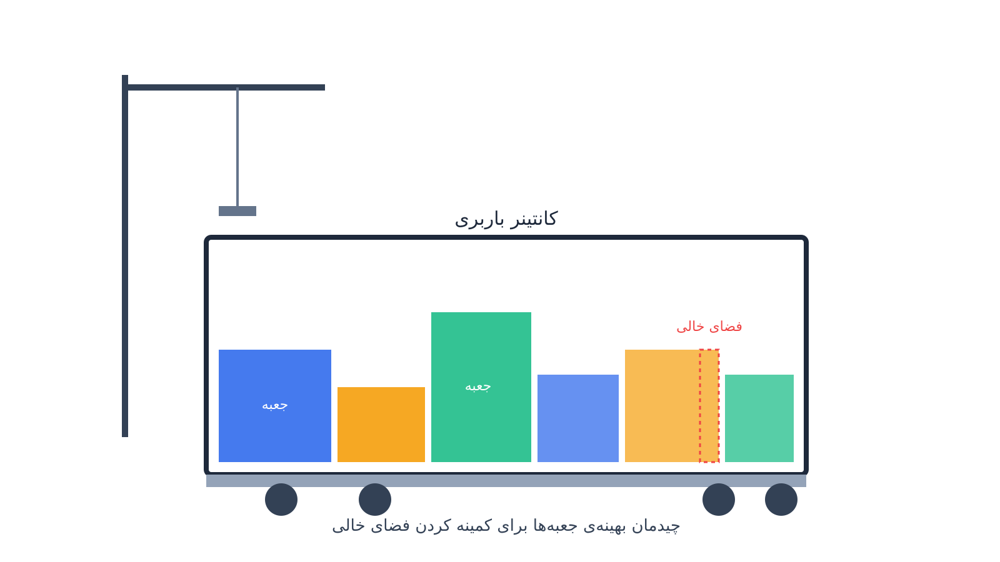

هر بار که یک انبار کالاهایش را برای صادرات آماده می‌کند، یک سوال ساده مطرح می‌شود. این جعبه‌ها و پالت‌ها را چطور داخل کانتینر بچینیم؟ هدف این است که کمترین فضای خالی باقی بماند و کمترین تعداد کانتینر لازم شود.

اگر پاسخ این سوال را به تجربه‌ی انباردار یا نرم‌افزارهای ابتدایی بسپاریم، نتیجه معمولاً ضعیف است. در این حالت بین ده تا سی درصد از فضای کانتینر بلااستفاده می‌ماند. این فضای خالی مستقیماً به معنای هزینه‌ی حمل بیشتر است. برای یک شرکت بزرگ، این هزینه می‌تواند میلیون‌ها دلار در سال باشد. این مسئله در ادبیات بهینه‌سازی «مسئله بارگیری کانتینر» یا Container Loading Problem (به‌اختصار CLP) نام دارد. این مسئله یکی از شاخه‌های جذاب و کاربردی خانواده‌ی مسائل بسته‌بندی (Bin Packing) است.

برخلاف تصور اول، CLP فقط یک پازل هندسی ساده نیست. جعبه‌ها معمولاً ابعاد نامتقارن و وزن‌های متفاوت دارند. بعضی‌شان قابل چرخش در همه‌ی جهات نیستند؛ مثلاً روی برچسب «این‌طرف بالا» نوشته شده است. بعضی‌ها را هم نمی‌توان زیر جعبه‌های سنگین‌تر قرار داد. توزیع وزن هم باید طوری باشد که مرکز ثقل کانتینر حین حمل جابه‌جا نشود. به همین دلیل، مسئله همزمان دو بخش دارد: یک بخش هندسی سه‌بعدی و یک بخش تخصیص ترکیبیاتی. باید هم تصمیم بگیریم کدام جعبه در کدام کانتینر برود. هم باید مشخص کنیم دقیقاً کجای آن کانتینر و با چه چرخشی قرار بگیرد.

## مدل‌سازی ریاضی مسئله

فرض کنید $n$ جعبه با ابعاد $(l_i, w_i, h_i)$ و وزن $m_i$ داریم. می‌خواهیم آن‌ها را در تعدادی کانتینر با ابعاد ثابت $(L, W, H)$ و ظرفیت وزنی $M$ جای دهیم. متغیر باینری $a_{ik}$ برابر یک است اگر جعبه‌ی $i$ در کانتینر $k$ قرار گیرد. متغیرهای پیوسته $x_i, y_i, z_i$ هم موقعیت گوشه‌ی جعبه‌ی $i$ را در دستگاه مختصات کانتینرش نشان می‌دهند. هدف معمول، کمینه کردن تعداد کانتینرهای استفاده‌شده است:

$$
\min K = \sum_{k=1}^{n} u_k, \qquad u_k \in \{0,1\}
$$

$$
\sum_{k=1}^{n} a_{ik} = 1 \quad \forall i, \qquad a_{ik} \le u_k \quad \forall i,k
$$

برای اینکه دو جعبه‌ی $i$ و $j$ در یک کانتینر همپوشانی فیزیکی نداشته باشند، یک شرط لازم است. باید حداقل یکی از شش حالت جداکنندگی در سه محور برقرار باشد. برای مثال، جعبه‌ی $i$ می‌تواند کاملاً در سمت چپ، راست، جلو، عقب، پایین یا بالای $j$ باشد. این شرط با شش متغیر باینری $b^1_{ij}, \dots, b^6_{ij}$ کنترل می‌شود. برای محور $x$ داریم:

$$
x_i + l_i \le x_j + M_{big}\,(1 - b^1_{ij}), \qquad
x_j + l_j \le x_i + M_{big}\,(1 - b^2_{ij})
$$

$$
b^1_{ij} + b^2_{ij} + b^3_{ij} + b^4_{ij} + b^5_{ij} + b^6_{ij} \ge a_{ik} + a_{jk} - 1 \quad \forall i \ne j, k
$$

و قیدهای مرزی و وزنی به‌صورت زیر بیان می‌شوند:

$$
0 \le x_i \le L - l_i, \quad 0 \le y_i \le W - w_i, \quad 0 \le z_i \le H - h_i, \qquad
\sum_i m_i\, a_{ik} \le M \quad \forall k
$$

در عمل، اغلب پیاده‌سازی‌ها به‌جای متغیرهای پیوسته برای موقعیت، فضای کانتینر را به شبکه‌ای گسسته تقسیم می‌کنند. سپس از قیدهای «بدون همپوشانی» سه‌بعدی سالورهای برنامه‌ریزی محدودیت استفاده می‌کنند. این رویکرد هم سریع‌تر حل می‌شود. این رویکرد هم افزودن قیدهای واقعی مثل «توزیع وزن» یا «ترتیب چیدمان برای تخلیه‌ی راحت‌تر» را ساده‌تر می‌کند.

## چرا این موضوع اهمیت دارد

بهینه‌سازی بارگیری کانتینر مستقیماً روی سه هزینه‌ی بزرگ زنجیره‌ی تأمین اثر می‌گذارد. این سه هزینه شامل تعداد کانتینرهای اجاره‌شده، هزینه‌ی سوخت حمل، و ردپای کربن است. شرکتی مثل ایکیا سالانه میلیون‌ها کالای بسته‌بندی‌شده را جابه‌جا می‌کند. این کالاها اغلب به‌شکل تخت و مستطیلی بین کارخانه‌ها، انبارها و فروشگاه‌های این شرکت در سطح جهان منتقل می‌شوند. ایکیا از دیرباز طراحی بسته‌بندی محصولاتش را هم‌زمان با چیدمان کارآمد در کامیون و کانتینر در نظر گرفته است. همین توجه به بارگیری بهینه یکی از دلایلی است که هزینه‌ی حمل‌ونقل این شرکت نسبت به رقبا پایین‌تر مانده است.

در مقیاس بزرگ‌تر، خطوط کشتیرانی کانتینری هم با نسخه‌ای مرتبط از این مسئله روبه‌رو هستند. آن‌ها تصمیم می‌گیرند کدام کانتینر در کدام بخش از عرشه‌ی کشتی قرار بگیرد. این تصمیم برای حفظ پایداری کشتی گرفته می‌شود. نرخ کرایه‌ی کانتینر در سال‌های اخیر افزایش یافته است. همچنین فشار روی شرکت‌ها برای کاهش انتشار کربن هم بیشتر شده است. در این شرایط، حتی چند درصد بهبود در بهره‌وری بارگیری اهمیت زیادی دارد. این بهبود می‌تواند برای یک شرکت صادراتی متوسط، صدها هزار دلار در سال صرفه‌جویی به همراه داشته باشد. این رقم به‌سختی با روش‌های دستی و تجربی به‌دست می‌آید.

## ظرفیت پژوهشی و آکادمیک

مسئله بارگیری کانتینر یکی از قدیمی‌ترین شاخه‌های پژوهشی بهینه‌سازی ترکیبیاتی است. این شاخه هنوز هم بسیار فعال است. نسخه‌های پیچیده‌تر آن هنوز جای کار زیادی دارند. یک نمونه، بارگیری چندکانتینری با اولویت‌بندی سفارش‌ها است (Multi-Container Loading with Priorities). نمونه‌ی دیگر، در نظر گرفتن ترتیب تخلیه در مسیرهای چند-توقفی است (Loading with Unloading Sequence). پایداری دینامیکی محموله در برابر تکان‌های حمل هم موضوع مهمی است، نه فقط پایداری استاتیک. ترکیب CLP با مسیریابی وسایل نقلیه هم یک نمونه‌ی دیگر است. در ادبیات به این ترکیب ۳L-CVRP یا Three-Dimensional Loading CVRP گفته می‌شود.

کاربرد یادگیری تقویتی هم مسیر پژوهشی رو به رشدی است. این روش برای یادگیری سیاست‌های چیدمان سریع استفاده می‌شود، به‌جای حل دقیق MILP که برای تعداد جعبه‌ی زیاد کند می‌شود. این مسئله NP-hard است. نسخه‌ی صنعتی آن هم معمولاً قیدهای خاص هر شرکت را دارد. به همین دلیل، فرصت خوبی برای پایان‌نامه یا مقاله فراهم می‌کند. چنین کاری هم پایه‌ی نظری قوی دارد و هم مستقیماً روی داده‌های واقعی یک انبار یا شرکت حمل‌ونقل قابل آزمایش است.

## پیاده‌سازی با پایتون

خوشبختانه برای حل CLP نیازی به نرم‌افزارهای تجاری تخصصی و گران‌قیمت لجستیک نیست. نسخه‌ی گسسته‌شده‌ی مسئله را می‌توان به‌خوبی با [OR-Tools](https://developers.google.com/optimization) مدل کرد. به‌ویژه ماژول CP-SAT آن برای این کار مناسب است. این سالور به‌طور بومی از قیدهای «بدون همپوشانی» چندبعدی پشتیبانی می‌کند (No-Overlap 2D و مشابه آن برای سه بعد). این ویژگی اجازه می‌دهد هر جعبه به‌صورت یک متغیر بازه‌ای (Interval Variable) در هر یک از سه محور تعریف شود. تجربه‌ی مدل‌سازی با CP-SAT در این مسئله شباهت زیادی به مسائل زمان‌بندی ترتیبی دارد. برای آشنایی بیشتر با این نوع مدل‌سازی می‌توانید یادداشت [زمان‌بندی جاب‌شاپ با CP-SAT](/notes/job-shop-scheduling-cp-sat/) را هم ببینید.

برای مسائل بزرگ‌تر که تعداد جعبه از چند صد عدد بیشتر می‌شود، رویکرد ترکیبی بهتر عمل می‌کند. ابتدا یک الگوریتم ابتکاری اولیه، مثل چیدن لایه‌به‌لایه بر اساس حجم، اجرا می‌شود. سپس یک مرحله‌ی بهینه‌سازی محلی روی نتیجه اعمال می‌شود. این ترکیب معمولاً نتیجه‌ی عملی بهتری نسبت به حل کامل مدل می‌دهد. داده‌های ورودی هم می‌تواند به‌سادگی از یک فایل اکسل یا CSV خوانده شود. این فایل شامل ستون‌های طول، عرض، ارتفاع، وزن و محدودیت‌های چرخش هر جعبه است. خروجی مدل هم مختصات دقیق و چرخش هر جعبه در هر کانتینر است. این خروجی را می‌توان مستقیماً به‌عنوان دستورالعمل چیدمان به تیم انباردار داد.

<h3>سوالات متداول</h3>

آیا این مدل فقط برای کانتینرهای دریایی کاربرد دارد؟

خیر. همین منطق برای بارگیری کامیون، واگن باری، یا حتی قفسه‌های انبار هم قابل استفاده است. در هر مورد فقط ابعاد فضای بارگیری تغییر می‌کند. قیدهای خاص هم ممکن است تغییر کنند، مثل محدودیت وزن محور کامیون.

برای یاد گرفتن مدل‌سازی این نوع مسائل چیدمان و مسیریابی از کجا شروع کنم؟

دوره <a href="/courses/vrp-python/" style="color:#2563EB; font-weight:bold;">مسیریابی و زمان‌بندی با پایتون</a> پایه‌ی خوبی برای آشنایی با CP-SAT و مدل‌سازی این‌گونه قیدهای ترکیبیاتی فضایی است.

اگر بخواهم این مدل را برای انبار یا ناوگان صادراتی خودم پیاده‌سازی کنم چه کار کنم؟

می‌توانید از طریق صفحه <a href="/consultation/" style="color:#2563EB; font-weight:bold;">مشاوره</a> ابعاد کالاها و محدودیت‌های واقعی‌تان را در میان بگذارید تا مدل بارگیری متناسب با نیاز شما طراحی شود.

