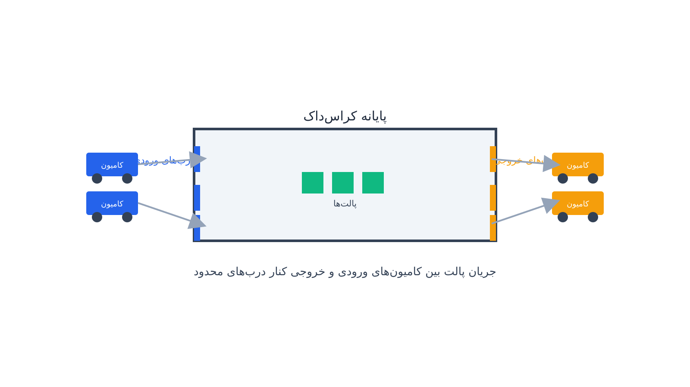

اگر تا حالا از کنار یک انبار توزیع بزرگ رد شده باشید، شاید صحنه‌ای آشنا دیده باشید. ردیفی از کامیون‌ها که پشت به دیوارهای پر از درب پارک کرده‌اند. به احتمال زیاد یک پایانه کراس‌داک (Cross-Dock) دیده‌اید. ایده کراس‌داکینگ در ظاهر بسیار ساده است. به‌جای این‌که کالا وارد انبار شود و روی قفسه بنشیند، مسیر دیگری طی می‌شود. کامیون‌های ورودی محموله‌های بزرگ و مخلوط را می‌آورند. این محموله‌ها همان‌جا، در عرض چند ساعت، بر اساس مقصد نهایی‌شان دوباره دسته‌بندی می‌شوند. سپس مستقیماً روی کامیون‌های خروجی بارگیری می‌شوند. کالا حتی یک شب هم در انبار نمی‌ماند و دوباره راه می‌افتد.

این مدل هزینه نگهداری موجودی را تقریباً حذف می‌کند. زمان کل چرخه توزیع را هم به‌شدت کوتاه می‌کند. اما یک قیمت پنهان هم دارد. تمام این هماهنگی ظریف باید در یک بازه زمانی بسیار کوتاه اتفاق بیفتد. تعداد درب‌های بارگیری هم محدود است. اگر این هماهنگی به‌هم بریزد، کل مزیت کراس‌داکینگ از بین می‌رود.

مسئله‌ای که پشت این هماهنگی پنهان است، نام مشخصی در ادبیات پژوهش در عملیات دارد. به آن زمان‌بندی کامیون و درب در پایانه کراس‌داک گفته می‌شود؛ یا به انگلیسی Truck Scheduling / Dock Door Assignment Problem. برخلاف مسئله‌های مسیریابی که پیش‌تر در این سایت بررسی شده‌اند، این مسئله فرق دارد. در آن مسئله‌ها یک وسیله نقلیه بین نقاط جغرافیایی حرکت می‌کند. اینجا همه‌چیز داخل یک پایانه ثابت اتفاق می‌افتد. آنچه باید زمان‌بندی شود، ترتیب و محل توقف کامیون‌ها کنار درب‌های محدود پایانه است.

هر کامیون ورودی باید کنار یک درب پارک کند. سپس پالت‌هایش تخلیه و بر اساس مقصد دسته‌بندی می‌شود. هر کامیون خروجی هم باید کنار درب دیگری پارک کند. این کامیون باید منتظر بماند تا پالت‌های مربوط به مقصدش از کامیون‌های ورودی مختلف به آن منتقل شوند. اگر درب اشتباهی به کامیون اشتباهی اختصاص یابد، مشکل ایجاد می‌شود. مشکل مشابهی هم رخ می‌دهد اگر یک کامیون خروجی زودتر از رسیدن همه پالت‌هایش آماده حرکت شود. در این حالت‌ها کل زنجیره تأخیر می‌افتد. صف کامیون‌های منتظر در پارکینگ بیرون پایانه هم طولانی‌تر می‌شود.

آنچه این مسئله را از یک زمان‌بندی معمولی متمایز می‌کند، وجود دو نوع «کار» با یک وابستگی جریان مادی بین آن‌هاست. کامیون‌های ورودی و کامیون‌های خروجی از یکدیگر مستقل نیستند. این دو گروه از طریق پالت‌هایی که باید از یکی به دیگری منتقل شوند به‌هم قفل شده‌اند. این ترکیب، مسئله را به چیزی شبیه [زمان‌بندی تولید کارگاهی](/notes/job-shop-scheduling-cp-sat/) نزدیک می‌کند. با این تفاوت که در اینجا «ماشین‌ها» همان درب‌های محدود پایانه‌اند. «پیش‌نیاز» بین عملیات‌ها هم از قوانین فنی یک خط تولید نمی‌آید. این پیش‌نیاز از مقصد فیزیکی هر پالت کالا سرچشمه می‌گیرد.

## فرمول‌بندی ریاضی مسئله

فرض کنید مجموعه کامیون‌های ورودی را با $I$ نشان دهیم. مجموعه کامیون‌های خروجی را هم با $O$ نشان می‌دهیم. $D$ هم مجموعه درب‌های موجود در پایانه است. برای هر کامیون $t$ (چه ورودی چه خروجی) یک متغیر باینری تخصیص درب $y_{t,d}$ داریم. این متغیر اگر کامیون $t$ به درب $d$ اختصاص یابد، برابر یک می‌شود. یک متغیر پیوسته $s_t$ هم داریم که زمان شروع پردازش آن کامیون کنار درب را نشان می‌دهد. مدت‌زمان پردازش هر کامیون $p_t$ (تخلیه یا بارگیری) از قبل تخمین‌پذیر است. برای این‌که هر کامیون دقیقاً یک درب داشته باشد:

$$ \sum_{d \in D} y_{t,d} = 1 \qquad \forall t \in I \cup O $$

برای این‌که دو کامیونی که به یک درب اختصاص یافته‌اند در زمان با هم تداخل نکنند، یک شرط لازم است. باید یکی کاملاً قبل از دیگری تمام شود. این قید معمولاً با متغیرهای باینری ترتیب $z_{tt'}$ و یک عدد بزرگ $M$ به‌صورت خطی نوشته می‌شود:

$$ s_t + p_t \le s_{t'} + M \big(1 - z_{tt'} + 2 - y_{t,d} - y_{t',d}\big) \qquad \forall t \ne t', \; d \in D $$

اما قلب واقعی مسئله، قید پیش‌نیازی جریان کالاست. فرض کنید مقداری از پالت‌های کامیون ورودی $i$ باید به کامیون خروجی $o$ منتقل شود. این رابطه را با $f_{i,o} > 0$ نشان می‌دهیم. در این حالت، کامیون خروجی نمی‌تواند حرکت کند. این کامیون باید صبر کند تا تخلیه کامیون ورودی مربوطه کامل شود:

$$ s_o \ge s_i + p_i \qquad \forall (i,o):\; f_{i,o} > 0 $$

تابع هدف معمولاً ترکیبی از حداکثر زمان تکمیل کل عملیات (Makespan) و جریمه تأخیر کامیون‌های خروجی نسبت به پنجره زمانی حرکت مجازشان است:

$$ \min \sum_{o \in O} w_o \max\big(0,\; s_o + p_o - d_o\big) $$

که در آن $d_o$ ددلاین حرکت کامیون خروجی $o$ است. $w_o$ هم وزن اهمیت آن کامیون است، مثلاً کامیون‌هایی که محموله فسادپذیر یا سفارش مشتری با اولویت بالا حمل می‌کنند. در عمل، تعداد درب‌های پایانه معمولاً بین ده تا چند صد است. اما تعداد کامیون‌هایی که باید در یک بازه چند ساعته سرویس بگیرند، می‌تواند به چند برابر آن برسد. همین موضوع باعث می‌شود فضای جست‌وجوی مسئله حتی برای پایانه‌های متوسط بسیار بزرگ شود.

## اهمیت این موضوع

کراس‌داکینگ یکی از ستون‌های اصلی لجستیک مدرن پرحجم و کم‌مارجین است. در این صنعت، هر ساعت اضافی توقف کالا در مسیر مستقیماً روی هزینه و رضایت مشتری اثر می‌گذارد. شرکتی مثل والمارت از دهه‌ی هشتاد میلادی پیشگام استفاده گسترده از کراس‌داکینگ بوده است. این شرکت با چنین مسئله‌ای در مقیاس روزانه و در ده‌ها پایانه توزیع مواجه است. تصمیم درباره این‌که کدام کامیون کنار کدام درب و در چه ترتیبی سرویس بگیرد، اهمیت زیادی دارد. این تصمیم مستقیماً روی به‌موقع رسیدن محموله‌های فروشگاه‌ها اثر می‌گذارد.

در صنعت تجارت الکترونیک هم سرعت تحویل به یک مزیت رقابتی حیاتی تبدیل شده است. مراکز توزیع بزرگ به‌طور فزاینده از مدل کراس‌داکینگ یا نسخه‌های ترکیبی آن استفاده می‌کنند. هدف این است که کالا با کمترین توقف از انبار تأمین‌کننده به دست مشتری برسد. یک زمان‌بندی ضعیف درب و کامیون چند اثر منفی دارد. اول، باعث تأخیر تک‌تک محموله‌ها می‌شود. دوم، صف کامیون‌های منتظر در پارکینگ بیرون پایانه را طولانی می‌کند. سوم، هزینه‌ی دستمزد اضافه‌کاری نیروی انسانی بارگیری را بالا می‌برد. در نهایت، ظرفیت مؤثر کل پایانه را کاهش می‌دهد؛ حتی اگر تعداد درب‌های فیزیکی تغییری نکرده باشد. به همین دلیل، بهبود چند درصدی در بهره‌وری زمان‌بندی کراس‌داک اهمیت زیادی دارد. در مقیاس یک شبکه توزیع ملی، این بهبود می‌تواند معادل میلیون‌ها دلار صرفه‌جویی سالانه باشد. این صرفه‌جویی هم در هزینه حمل‌ونقل و هم در هزینه نیروی انسانی رخ می‌دهد.

## ظرفیت کار آکادمیک/پژوهشی

زمان‌بندی کراس‌داکینگ همچنان یک حوزه فعال پژوهشی در تقاطع تحقیق در عملیات و مدیریت زنجیره تأمین است. یک مسیر پژوهشی طبیعی، مدل‌سازی عدم‌قطعیت در زمان ورود کامیون‌های ورودی است. در دنیای واقعی، ترافیک یا تأخیر در بارگیری مبدأ باعث می‌شود زمان ورود دقیق کامیون‌ها از قبل کاملاً معلوم نباشد. مدل‌های زمان‌بندی مقاوم (Robust) یا تصادفی (Stochastic) می‌توانند این عدم‌قطعیت را به‌طور صریح در تصمیم تخصیص درب لحاظ کنند. مسیر دیگر، یکپارچه‌سازی زمان‌بندی کامیون با تخصیص نیروی کار بارگیری است. در بسیاری از پایانه‌ها، محدودیت واقعی نه تعداد درب‌ها، بلکه تعداد کارگران است. این کارگران باید هم‌زمان چند درب را سرویس دهند.

همچنین، انتخاب چیدمان بهینه درب‌ها (Door Layout) یک مسیر پژوهشی دیگر است. این چیدمان بر اساس الگوی جریان کالا بین مبداها و مقصدها تعیین می‌شود. هدف این است که کدام درب‌ها به کدام مناطق جغرافیایی نزدیک‌تر باشند. این چیدمان فاصله حرکت داخلی فورکلیفت را کمینه می‌کند. این یک مسئله طراحی تسهیلات مکمل است که می‌تواند با زمان‌بندی ترکیب شود. یکپارچه‌سازی این مسئله با تصمیمات بالادستی مسیریابی ناوگان هم یک مسیر دیگر است. این تصمیمات مشخص می‌کنند کدام کامیون در چه ساعتی به پایانه برسد. این مسیر پژوهشی نوظهور Cross-Dock Vehicle Routing نام دارد. در نهایت، یادگیری ماشین هم کاربرد دارد. این روش می‌تواند زمان ورود واقعی کامیون‌ها و مدت‌زمان واقعی تخلیه یا بارگیری را دقیق‌تر پیش‌بینی کند. این پیش‌بینی‌ها می‌توانند به یک مدل زمان‌بندی مجدد آنی (Real-Time Rescheduling) تغذیه شوند. این ترکیب فرصت پژوهشی جذابی برای پایان‌نامه‌های بهینه‌سازی و علم داده است.



## پیاده‌سازی با پایتون

خبر خوب این است که برای مدل‌سازی و حل این مسئله نیازی به هیچ نرم‌افزار تجاری گران‌قیمت لجستیکی نیست. ماهیت زمان‌بندی کراس‌داکینگ بسیار شبیه زمان‌بندی تولید کارگاهی است. تعدادی «کار» یعنی کامیون باید روی تعدادی «ماشین» یعنی درب زمان‌بندی شوند، آن هم با قیدهای پیش‌نیازی. به همین دلیل، ماژول CP-SAT کتابخانه [OR-Tools](https://developers.google.com/optimization) گزینه‌ای بسیار طبیعی و کارآمد برای این مسئله است. برای هر کامیون کنار هر درب، یک متغیر Interval تعریف می‌شود. با این متغیرها می‌توان قید عدم هم‌پوشانی زمانی روی هر درب را با یک محدودیت NoOverlap بیان کرد. قید پیش‌نیازی جریان پالت بین کامیون‌های ورودی و خروجی هم با یک محدودیت ساده‌ی ترتیب زمانی بیان می‌شود.

شبکه جریان پالت بین کامیون‌های ورودی و خروجی هم باید مدل‌سازی و اعتبارسنجی شود. این شبکه نشان می‌دهد کدام کامیون ورودی چه مقدار کالا برای کدام کامیون خروجی آورده است. کتابخانه [NetworkX](https://networkx.org/) ابزار مناسبی برای این کار است. می‌توان این جریان را به‌صورت یک گراف دوبخشی (Bipartite Graph) مدل کرد. پیش از فراخوانی سالور، باید سازگاری داده هم بررسی شود؛ مثلاً این‌که مجموع پالت‌های خروجی هر کامیون خروجی با آنچه از کامیون‌های ورودی می‌رسد برابر باشد.

در عمل، فایل ورودی این مدل معمولاً یک فایل CSV است. این فایل شامل ستون‌هایی مثل شناسه کامیون، نوع کامیون، زمان ورود تخمینی و مدت‌زمان پردازش است. مقصد یا مبدأ هر گروه از پالت‌ها هم در این فایل ثبت می‌شود. ساختار پایه یک مدل CP-SAT برای این مسئله می‌تواند چیزی شبیه این باشد:

```python
from ortools.sat.python import cp_model

model = cp_model.CpModel()
horizon = 480  # افق زمان‌بندی به دقیقه

# برای هر کامیون یک متغیر Interval روی درب انتخاب‌شده تعریف می‌کنیم
truck_intervals = {}
for t in trucks:
    start = model.NewIntVar(0, horizon, f"start_{t.id}")
    end = model.NewIntVar(0, horizon, f"end_{t.id}")
    interval = model.NewIntervalVar(start, t.duration, end, f"interval_{t.id}")
    truck_intervals[t.id] = (start, end, interval)

# قید عدم هم‌پوشانی روی هر درب
for d in doors:
    intervals_on_door = [truck_intervals[t.id][2] for t in trucks if t.assigned_door == d]
    model.AddNoOverlap(intervals_on_door)

# قید پیش‌نیازی جریان پالت: کامیون خروجی زودتر از کامیون‌های ورودی مرتبط شروع نشود
for (inbound_id, outbound_id) in flow_pairs:
    _, inbound_end, _ = truck_intervals[inbound_id]
    outbound_start, _, _ = truck_intervals[outbound_id]
    model.Add(outbound_start >= inbound_end)

# هدف: کمینه‌کردن حداکثر زمان تکمیل (Makespan)
makespan = model.NewIntVar(0, horizon, "makespan")
model.AddMaxEquality(makespan, [end for _, end, _ in truck_intervals.values()])
model.Minimize(makespan)

solver = cp_model.CpSolver()
status = solver.Solve(model)
```

این یک اسکلت ساده‌شده است. در یک پیاده‌سازی واقعی، تخصیص درب هم باید به‌صورت متغیر تصمیم مدل شود، نه ورودی ثابت. جریمه تأخیر هم باید به تابع هدف اضافه شود. نکته‌ی مهم این است که همین سالور رایگان و متن‌باز کافی است. برای پایانه‌هایی با چند ده کامیون و چند ده درب، معمولاً در عرض چند ثانیه تا چند دقیقه جواب بهینه یا نزدیک به بهینه می‌دهد. این سرعت برای بازنشانی برنامه در طول یک شیفت کاری کاملاً کافی است؛ مثلاً وقتی یک کامیون دیر یا زود می‌رسد.

## سوالات متداول

<h3>تفاوت زمان‌بندی کراس‌داکینگ با زمان‌بندی تولید کارگاهی که پیش‌تر در سایت بررسی شد چیست؟</h3>
<p>ساختار ریاضی دو مسئله بسیار شبیه هم است. اما منشأ قید پیش‌نیازی فرق دارد. در زمان‌بندی تولید، پیش‌نیاز از توالی فنی عملیات روی یک قطعه می‌آید. در کراس‌داکینگ، پیش‌نیاز از واقعیت دیگری می‌آید: یک پالت فیزیکی باید از کامیون ورودی به کامیون خروجی منتقل شود. اگر می‌خواهید این نوع مسائل زمان‌بندی ترکیبیاتی را از پایه یاد بگیرید، دوره <a href="/courses/vrp-python/" style="color:#2563EB; font-weight:bold;">مسیریابی و زمان‌بندی با پایتون</a> پایه‌ی مناسبی برای آن است.</p>

<h3>آیا این مدل می‌تواند با تأخیر واقعی کامیون‌ها هم کار کند؟</h3>
<p>مدل پایه یک زمان‌بندی قطعی است. اما در عمل معمولاً یک لایه بازنشانی آنی (Rolling-Horizon Rescheduling) به آن اضافه می‌شود. هر بار یک کامیون با تأخیر یا زودتر از موعد می‌رسد، مدل با اطلاعات به‌روز دوباره حل می‌شود. سالور CP-SAT در این مقیاس بسیار سریع است. به همین دلیل، این بازنشانی مکرر در عمل کاملاً قابل اجراست.</p>

<h3>اگر بخواهم این مدل را برای پایانه توزیع یا انبار خودم پیاده‌سازی کنم چه کار کنم؟</h3>
<p>می‌توانید از طریق صفحه <a href="/consultation/" style="color:#2563EB; font-weight:bold;">مشاوره</a> جزئیات پایانه، تعداد درب‌ها، و الگوی جریان کالای خودتان را در میان بگذارید تا مدلی متناسب با محدودیت‌های عملیاتی واقعی‌تان طراحی شود.</p>
