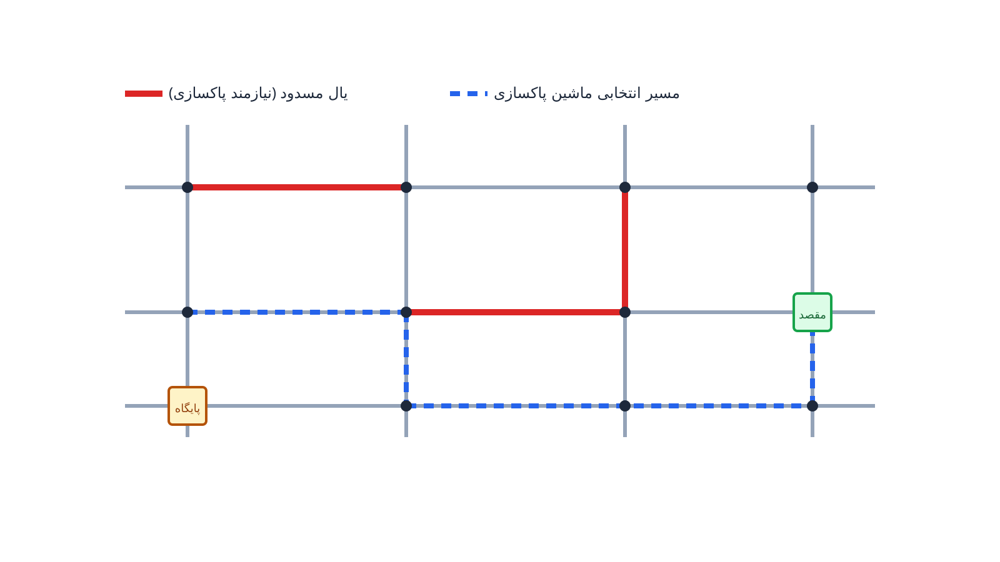

بعد از یک زلزله یا سیل بزرگ، مشکل شهر فقط پل‌های شکسته نیست. بخش بزرگی از خیابان‌ها هم زیر آوار، درخت افتاده یا لاشه‌ی ساختمان مانده است. این آوار باید جمع‌آوری شود تا کامیون‌های امدادی اصلاً بتوانند رد شوند. حالا سوال این است: کامیون‌های لودر و بیل مکانیکی با چه ترتیبی خیابان‌ها را پاک‌سازی کنند؟ این سوال ساده به نظر می‌رسد، اما از نظر ریاضی با اکثر مسائل مسیریابی که می‌شناسیم فرق دارد.

در مسیریابی معمول، مثل توزیع کمک بین اردوگاه‌ها، «مشتری» یک نقطه است؛ یک نقطه که باید به آن سر زد. اما در پاکسازی آوار، مشتری خودِ خیابان است، نه یک نقطه روی آن. یعنی باید کل طول یک کوچه یا خیابان پیمایش و پاک‌سازی شود. این تفاوت، مسئله را از دسته‌ی «مسیریابی گرهی» (Node Routing) به دسته‌ی «مسیریابی کمانی» (Arc Routing) می‌برد. این یک زیرشاخه‌ی کمترشناخته‌شده اما بسیار کاربردی از بهینه‌سازی حمل‌ونقل است.

## چرا این تفاوت اهمیت دارد

فرض کنید یک شهرداری یا سازمان امداد بخواهد مسئله را با یک مدل مسیریابی معمولی حل کند. در این حالت باید هر خیابان را به یک نقطه‌ی نمادین تبدیل کند و بعد فاصله‌ها را حدس بزند. این کار هم دقت را از بین می‌برد و هم اطلاعات مهمی مثل طول واقعی هر خیابان را نادیده می‌گیرد. مدل مسیریابی کمانی، برعکس، مستقیماً روی خودِ یال‌های گراف کار می‌کند. این یعنی جواب نهایی هم دقیق‌تر است و هم واقعی‌تر.

این مسئله در دنیای غیر از بحران هم زیاد دیده می‌شود. شرکت‌هایی مثل ویولیا (Veolia) در جمع‌آوری زباله شهری، یا شهرداری‌هایی که مسئول برف‌روبی خیابان‌ها هستند، دقیقاً با همین ساختار روبه‌رو می‌شوند. در حالت عادی هدف کمینه‌کردن هزینه‌ی سوخت است. اما در حالت بحران، هدف کمینه‌کردن زمان تا باز شدن مسیرهای حیاتی می‌شود. زمانی که آمبولانس یا کامیون آب و غذا باید به یک محله برسد، هر دقیقه تأخیر در پاکسازی جاده اهمیت مستقیم دارد.

از نظر عملیاتی، این مسئله شبیه به یک بسته‌بندی هوشمند منابع محدود است. سازمان‌هایی مثل سازمان مدیریت بحران کشورها یا نهادهای محلی امداد، معمولاً چند ماشین‌آلات سنگین محدود دارند. باید این ماشین‌آلات را طوری بین ده‌ها خیابان مسدود تقسیم کنند که مهم‌ترین مسیرها زودتر باز شوند. تصمیم غلط در همین تخصیص، می‌تواند ساعت‌ها تأخیر غیرضروری در رسیدن کمک ایجاد کند.

## فرمول‌بندی ریاضی مسئله

شبکه‌ی خیابان‌های شهر را با یک گراف $G=(V,E)$ نشان می‌دهیم. رأس‌ها تقاطع‌ها هستند و یال‌ها همان خیابان‌ها. زیرمجموعه‌ای از یال‌ها، یعنی $R \subseteq E$، بعد از بلایا مسدود و نیازمند پاکسازی‌اند. هر یال مسدود $e \in R$ یک بار پاکسازی $q_e$ دارد که متناسب با حجم آوار است. هر ماشین‌آلات پاکسازی هم یک ظرفیت کاری $Q$ دارد، مثلاً حداکثر ساعت کار روزانه. هدف، پیدا کردن مسیر برای هر ماشین است طوری که همه‌ی یال‌های مسدود پاکسازی شوند و هزینه‌ی کل کمینه بماند.

این ساختار همان چیزی است که در ادبیات بهینه‌سازی «مسئله‌ی مسیریابی کمانی ظرفیت‌دار» (Capacitated Arc Routing Problem) نامیده می‌شود. فرمول ساده‌شده‌ی آن به این صورت است:

$$\min \sum_{k \in K} \sum_{e \in E} c_e \, x_e^k$$

$$\sum_{k \in K} z_e^k = 1 \quad \forall e \in R$$

$$\sum_{e \in R} q_e \, z_e^k \leq Q \quad \forall k \in K$$

$$x_e^k \geq z_e^k \quad \forall e \in R,\ \forall k \in K$$

در این مدل، $z_e^k$ متغیر دودویی است و نشان می‌دهد آیا ماشین $k$ مسئول پاکسازی یال $e$ است. متغیر $x_e^k$ هم مشخص می‌کند آیا ماشین $k$ اصلاً از یال $e$ عبور می‌کند، چه برای پاکسازی و چه فقط برای رد شدن. عبور بدون پاکسازی را در ادبیات این حوزه «دِدهد» (deadheading) می‌نامند. قید اول تضمین می‌کند هر خیابان مسدود دقیقاً یک بار پاکسازی شود. قید دوم ظرفیت هر ماشین را رعایت می‌کند. در عمل، قیدهای اتصال مسیر و حذف زیرتور هم لازم است تا هر مسیر واقعاً یک تور پیوسته از پایگاه باشد.

## ظرفیت کار آکادمیک و پژوهشی

مسئله‌ی مسیریابی کمانی، برخلاف مسیریابی گرهی کلاسیک مثل VRP، هنوز به همان اندازه کاوش نشده است. این خلأ، فرصت خوبی برای پژوهش در حوزه‌ی مدیریت بحران است. یک مسیر پژوهشی، ترکیب مسیریابی کمانی با عدم‌قطعیت در زمان پاکسازی هر خیابان است، چون میزان واقعی آوار تا قبل از رسیدن ماشین مشخص نیست.

مسیر دوم، ترکیب هم‌زمان مسیریابی کمانی برای پاکسازی و مسیریابی گرهی برای توزیع کمک است. در عمل این دو مسئله به‌هم وابسته‌اند، چون کامیون کمک‌رسانی فقط بعد از باز شدن خیابان می‌تواند حرکت کند. مسیر سوم، طراحی الگوریتم‌های ابتکاری سریع برای شرایطی است که داده‌ی آسیب هنوز کامل نیست. در ساعات اول بعد از بلایا، تصمیم‌گیرها فرصت اجرای مدل‌های دقیق و کند را ندارند.

## پیاده‌سازی با پایتون

خبر خوب این است که مسیریابی کمانی هم مثل بقیه‌ی مسائل این حوزه، کاملاً با ابزارهای متن‌باز پایتون قابل حل است. نیازی به سالورهای تجاری گران‌قیمت نیست. ساختار گراف شهر و یال‌های مسدود را می‌توان با [NetworkX](https://networkx.org/) ساخت و مدیریت کرد. برای فرمول‌بندی و حل مدل تخصیص و ظرفیت، از [OR-Tools](https://developers.google.com/optimization) و به‌ویژه ماژول CP-SAT آن استفاده می‌شود، دقیقاً همان ابزاری که در دوره‌ی [بهینه‌سازی زنجیره تأمین و حمل‌ونقل با پایتون](/courses/vrp-python/) برای مسائل مشابه آموزش داده می‌شود.

روش کار معمولاً به این صورت است: ابتدا مسیرهای کوتاه بین یال‌های مسدود با NetworkX محاسبه می‌شود. سپس تخصیص یال‌ها به ماشین‌ها و رعایت ظرفیت با CP-SAT مدل می‌شود. برای مسائل کوچک‌تر، حتی می‌توان از سالورهای MILP مثل CBC یا HiGHS هم استفاده کرد. داده‌های ورودی این مدل را می‌توان از یک فایل اکسل یا CSV ساده خواند. این فایل باید شامل ستون‌هایی مثل شناسه‌ی خیابان مسدود، طول آن، و حجم تخمینی آوار باشد.

برای مسائل با چند ده خیابان مسدود، این سالورهای متن‌باز معمولاً در چند ثانیه تا چند دقیقه پاسخ می‌دهند. این سرعت دقیقاً همان چیزی است که در ساعات بحرانی اول بعد از یک فاجعه لازم است.

## سوالات متداول

<h3>آیا مسیریابی کمانی فقط مخصوص بلایای طبیعی است؟</h3>

نه. همان ساختار در جمع‌آوری زباله شهری، برف‌روبی، و بازرسی خطوط لوله یا برق هم دیده می‌شود. هرجا که خودِ یال گراف (خیابان، خط لوله، کابل) نیاز به سرویس داشته باشد، نه یک نقطه‌ی مشخص، مسیریابی کمانی مطرح می‌شود.

<h3>تفاوت این مدل با مسئله‌ی بازسازی شبکه جاده‌ای چیست؟</h3>

در بازسازی شبکه، هدف ترتیب تعمیر یال‌های آسیب‌دیده برای بازگرداندن اتصال است. در پاکسازی آوار، هدف عبورپذیر کردن خیابان‌هاست، نه لزوماً تعمیر کامل آن‌ها. این دو مسئله می‌توانند مکمل هم باشند، ولی ساختار ریاضی‌شان متفاوت است.

<h3>برای یادگیری عملی این نوع مدل‌سازی از کجا شروع کنم؟</h3>

در دوره‌ی <a href="/courses/vrp-python/" style="color:#2563EB; font-weight:bold;">بهینه‌سازی زنجیره تأمین و حمل‌ونقل با پایتون</a> مدل‌های مسیریابی و تخصیص مشابه با OR-Tools و CP-SAT آموزش داده می‌شود. این پایه‌ی خوبی برای ساخت مدل‌های اختصاصی‌تر مثل مسیریابی کمانی خواهد بود.

<h3>اگر بخواهم این مدل را برای شهر یا سازمان خودم پیاده‌سازی کنم چه کار کنم؟</h3>

داده‌های واقعی هر شهر با هم فرق دارد؛ مثلاً تعداد ماشین‌آلات، نقشه‌ی خیابان‌ها و اولویت‌های محلی متفاوت است. برای تنظیم مدل روی همین شرایط خاص می‌توانید از <a href="/consultation/" style="color:#2563EB; font-weight:bold;">مشاوره</a> استفاده کنید.

