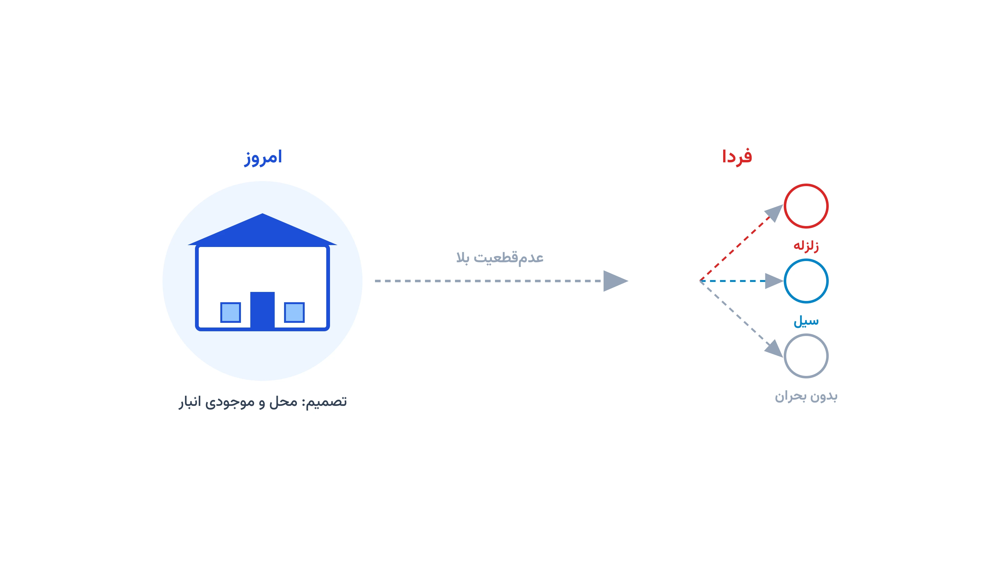

وقتی زلزله یا سیل اتفاق می‌افتد، ساعت‌های اول از همه مهم‌ترند. اگر کامیون امدادی تازه در همان لحظه راه بیفتد، معمولاً دیر شده است. برای همین بسیاری از سازمان‌های امدادی از قبل تصمیم می‌گیرند کجا انبار بزنند و چقدر کالا ذخیره کنند. این تصمیم باید پیش از وقوع بلا گرفته شود، نه بعد از آن. به این مسئله در ادبیات بهینه‌سازی می‌گویند «پیش‌جایگذاری ذخایر امدادی».

تفاوت این مسئله با اغلب مطالب لجستیک بشردوستانه در همین نکته است. آن مدل‌ها معمولاً فرض می‌کنند بلا رخ داده و حالا باید مسیر امداد را طراحی کرد. اینجا اما تصمیم اصلی، پیش از وقوع بلا و زیر عدم‌قطعیت کامل گرفته می‌شود. محل بلای بعدی و شدت آن از قبل معلوم نیست.

## مسئله را دقیق‌تر ببینیم

فرض کنید یک سازمان امدادی باید چند انبار راه‌اندازی کند. هر انبار هزینه‌ی ثابت ساخت و نگهداری دارد. همچنین باید مشخص شود هر انبار چقدر کالای امدادی مثل آب، غذا و دارو ذخیره کند. این دو تصمیم، یعنی محل انبار و میزان موجودی، باید همین امروز گرفته شوند.

مشکل اینجاست که محل و شدت بلای بعدی از پیش معلوم نیست. ممکن است زلزله در شمال رخ دهد یا سیل در جنوب. شاید هم اصلاً بحران جدی‌ای پیش نیاید. برای همین مدل باید چند سناریوی ممکن از بلا را هم‌زمان در نظر بگیرد. هر سناریو میزان آسیب و تقاضای کمک در هر منطقه را مشخص می‌کند.

بعد از وقوع بلا در هر سناریو، سازمان باید کالا را از انبارهای بازشده به مناطق آسیب‌دیده برساند. اگر موجودی یک انبار کافی نباشد، بخشی از تقاضا بی‌پاسخ می‌ماند. مدل باید بین هزینه‌ی نگهداری ذخیره‌ی اضافی و ریسک کمبود در روز حادثه تعادل برقرار کند. این دقیقاً همان تنشی است که در تصویر بالا بین سه سناریوی زلزله، سیل و آرامش دیده می‌شود.

## مدل ریاضی مسئله

این مسئله را می‌توان به‌صورت یک مدل بهینه‌سازی دومرحله‌ای تصادفی نوشت. مرحله‌ی اول، یعنی پیش از بلا، شامل انتخاب محل انبار و تعیین موجودی است. مرحله‌ی دوم، یعنی پس از بلا و در هر سناریو، شامل تصمیم توزیع و محاسبه‌ی کمبود است.

فرض کنید $J$ مجموعه‌ی مکان‌های کاندید انبار باشد و $I$ مجموعه‌ی مناطق نیازمند کمک باشد. مجموعه‌ی سناریوهای بلا را هم $S$ می‌نامیم، با احتمال وقوع $p_s$ برای هر سناریو. متغیر $y_j$ تصمیم می‌گیرد آیا انبار $j$ باز شود یا نه. متغیر $Q_j$ میزان موجودی ذخیره‌شده در انبار $j$ است. متغیر $x_{ijs}$ میزان کالای ارسالی از انبار $j$ به منطقه $i$ در سناریو $s$ را نشان می‌دهد. متغیر $u_{is}$ هم کمبود پاسخ‌داده‌نشده در منطقه $i$ تحت سناریو $s$ است.

تابع هدف، مجموع هزینه‌ی قطعی امروز و میانگین وزنی هزینه‌ی فرداست:

$$\min \sum_{j \in J} f_j y_j + \sum_{j \in J} c_j Q_j + \sum_{s \in S} p_s \left( \sum_{i \in I}\sum_{j \in J} t_{ij} x_{ijs} + \sum_{i \in I} \pi_i u_{is} \right)$$

جمله‌ی اول هزینه‌ی ثابت راه‌اندازی انبارهاست. جمله‌ی دوم هزینه‌ی خرید و نگهداری موجودی پیش‌جایگذاری‌شده است. جمله‌ی سوم میانگین وزنی هزینه‌ی حمل و جریمه‌ی کمبود در همه‌ی سناریوهاست.

$$\sum_{j \in J} x_{ijs} + u_{is} = d_{is} \qquad \forall i \in I,\ s \in S$$

این قید می‌گوید مجموع کالای رسیده به هر منطقه، به‌علاوه‌ی کمبود آن، باید برابر تقاضای واقعی همان سناریو باشد.

$$\sum_{i \in I} x_{ijs} \le Q_j \qquad \forall j \in J,\ s \in S$$

این قید اجازه نمی‌دهد از هیچ انباری بیش از موجودی واقعی‌اش کالا ارسال شود.

$$Q_j \le M\, y_j \qquad \forall j \in J$$

این قید هم تضمین می‌کند فقط انبارهای بازشده بتوانند موجودی داشته باشند. در نهایت $y_j$ باینری است و بقیه‌ی متغیرها نامنفی هستند.

## اهمیت این موضوع در دنیای واقعی

این مدل فقط یک تمرین دانشگاهی نیست. بسیاری از سازمان‌های بزرگ امدادی هرساله باید همین تصمیم را بگیرند. بودجه همیشه محدود است و نمی‌توان در همه‌جا انبار پر از کالا نگه داشت.

شرکتی مثل DHL، از طریق تیم واکنش اضطراری خودش، سال‌هاست در لجستیک بشردوستانه بین‌المللی فعالیت می‌کند. چنین شرکت‌هایی باید از پیش تصمیم بگیرند کدام فرودگاه یا انبار منطقه‌ای برای ذخیره‌ی کالای امدادی مناسب‌تر است. تصمیم اشتباه یعنی یا هزینه‌ی اضافی غیرضروری، یا کمبود کالا درست در روز بحران.

همین منطق برای سازمان‌های دولتی مدیریت بحران هم صادق است. بودجه‌ی محدود باید بین مناطق پرریسک به‌درستی تقسیم شود. یک مدل بهینه‌سازی دقیق، به‌جای حدس و تجربه‌ی شخصی، این تصمیم را شفاف و قابل دفاع می‌کند. همین رویکرد در دوره‌ی [بهینه‌سازی زنجیره تأمین و حمل‌ونقل با پایتون](/courses/vrp-python/) هم با مثال‌های عملی دنبال می‌شود.

## ظرفیت کار آکادمیک و پژوهشی

پیش‌جایگذاری ذخایر امدادی یکی از حوزه‌های فعال پژوهش در بهینه‌سازی تصادفی است. ترکیب مکان‌یابی تسهیلات با مدیریت موجودی زیر عدم‌قطعیت، خودش یک مسئله‌ی چندوجهی و غنی است. این موضوع می‌تواند پایه‌ی خوبی برای پایان‌نامه‌ی کارشناسی ارشد یا دکتری باشد.

یک مسیر پژوهشی جذاب، اضافه‌کردن ریسک‌گریزی به مدل است. به‌جای کمینه‌کردن فقط هزینه‌ی مورد انتظار، می‌توان بدترین سناریوی ممکن را هم کنترل کرد؛ مثلاً با مدل‌های CVaR یا بهینه‌سازی استوار. مسیر دیگر، در نظر گرفتن چندمرحله‌ای‌بودن بلایاست، مثل زلزله و پس‌لرزه‌های پیاپی آن.

می‌توان کیفیت جاده‌های باقی‌مانده پس از بلا را هم به مدل اضافه کرد. این تعمیم، موضوع را به یادداشت [پاکسازی آوار و بازگشایی مسیر پس از بلایا](/notes/debris-clearance-arc-routing/) هم پیوند می‌دهد. همچنین می‌توان رفتار واقعی تأمین‌کنندگان یا کامیون‌های اجاره‌ای پس از بحران را به مدل افزود. این نوع تعمیم‌ها فضای کافی برای چند مقاله‌ی علمی جدی دارند.

## پیاده‌سازی با پایتون

خبر خوب این است که چنین مدلی را می‌توان کاملاً با ابزارهای متن‌باز پایتون پیاده‌سازی کرد. نیازی به سالور تجاری گران‌قیمت نیست. [PuLP](https://coin-or.github.io/pulp/) یک کتابخانه‌ی سبک برای نوشتن مدل‌های خطی و عدد صحیح در پایتون است.

سالور متن‌باز [CBC](https://github.com/coin-or/Cbc) به‌صورت پیش‌فرض همراه PuLP نصب می‌شود و برای این اندازه از مسئله کاملاً کافی است. برای مسئله‌های بزرگ‌تر، سالور [HiGHS](https://highs.dev/) معمولاً سریع‌تر عمل می‌کند. هر دو این سالورها کاملاً رایگان و متن‌باز هستند.

داده‌های ورودی را می‌توان از یک فایل اکسل یا CSV خواند. این فایل باید شامل مکان‌های کاندید انبار، مناطق نیازمند، هزینه‌ی حمل بین هرکدام، و فهرست سناریوهای بلا با تقاضای هر سناریو باشد. با pandas این داده‌ها به‌سادگی به دیکشنری یا دیتافریم تبدیل می‌شوند.

ساخت مدل در PuLP هم ساده است. یک متغیر باینری برای هر انبار لازم است و یک متغیر پیوسته برای موجودی هر انبار. علاوه بر این، یک متغیر پیوسته هم برای جریان کالا و کمبود در هر سناریو تعریف می‌شود. تابع هدف و قیدها هم دقیقاً مطابق فرمول‌های بالا نوشته می‌شوند.

وقتی تعداد سناریوهای ممکن خیلی زیاد باشد، مدل به‌سرعت بزرگ و کند می‌شود. در این حالت می‌توان با تکنیک نمونه‌گیری میانگین، یا همان SAA، فقط چند صد سناریوی نماینده را وارد مدل کرد. این کار حجم مدل را مدیریت‌پذیر نگه می‌دارد، بدون آنکه دقت جواب به‌شدت افت کند.

اگر بخشی از مسئله بیشتر به مسیریابی و تخصیص گسسته نزدیک باشد، می‌توان از [OR-Tools](https://developers.google.com/optimization) و ماژول CP-SAT آن هم کمک گرفت. برای مدل‌سازی شبکه‌ی جاده‌ای بین انبارها و مناطق، کتابخانه‌ی [NetworkX](https://networkx.org/) هم در محاسبه‌ی کوتاه‌ترین مسیر و هزینه‌ی حمل مفید است.

## سوالات متداول

<h3>تفاوت پیش‌جایگذاری ذخایر امدادی با مسیریابی امداد معمولی چیست؟</h3>

مسیریابی امداد معمولی بعد از وقوع بلا اجرا می‌شود و فرض می‌کند انبارها از قبل وجود دارند. پیش‌جایگذاری اما تصمیمی استراتژیک و پیش از بلاست؛ محل و موجودی انبار را زیر عدم‌قطعیت تعیین می‌کند. دوره‌ی <a href="/courses/vrp-python/" style="color:#2563EB; font-weight:bold;">بهینه‌سازی زنجیره تأمین و حمل‌ونقل با پایتون</a> هر دو نوع مسئله را با مثال عملی پوشش می‌دهد.

<h3>برای یک مدل قابل‌اعتماد به چند سناریوی بلا نیاز داریم؟</h3>

عدد ثابتی برای این کار وجود ندارد و به پراکندگی داده‌های واقعی بستگی دارد. معمولاً سناریوها را افزایش می‌دهیم تا جایی که جواب مدل دیگر تغییر محسوسی نکند. دوره‌ی <a href="/courses/uncertainty-modeling/" style="color:#2563EB; font-weight:bold;">مدل‌سازی عدم‌قطعیت در بهینه‌سازی</a> دقیقاً همین تکنیک‌های تولید و کاهش سناریو را آموزش می‌دهد.

<h3>آیا این مدل را می‌توان برای یک سازمان واقعی یا پایان‌نامه پیاده‌سازی کرد؟</h3>

بله، این مدل کاملاً قابل تطبیق با داده‌های واقعی یک سازمان امدادی یا یک پروژه‌ی پژوهشی است. اگر به پیاده‌سازی اختصاصی یا سفارشی‌سازی مدل برای داده‌های خودتان نیاز دارید، می‌توانید از <a href="/consultation/" style="color:#2563EB; font-weight:bold;">مشاوره</a> کمک بگیرید.

