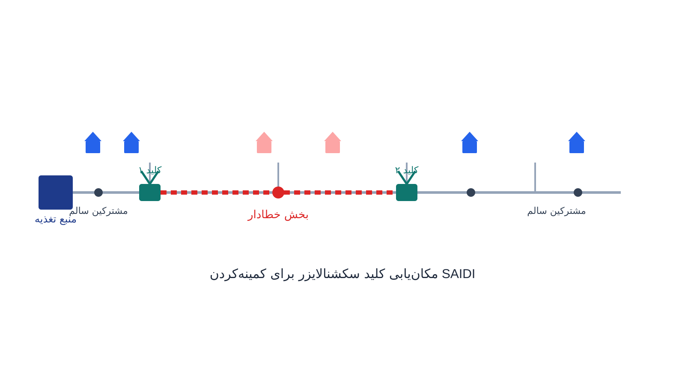

هر بار که یک خط توزیع برق دچار خطا می‌شود، دلیل آن می‌تواند برخورد شاخه درخت، خرابی تجهیز یا آب‌وهوای بد باشد. سوال اول اپراتور شبکه این نیست که «چطور این خطا را برطرف کنیم». سوال او این است که «چطور اثر این خطا را روی کمترین تعداد مشترک نگه داریم». اگر یک فیدر توزیع طولانی هیچ کلید میانی‌ای نداشته باشد، یک خطای کوچک می‌تواند صدها یا هزاران مشترک را بی‌برق کند. این وضعیت تا زمان تعمیر کامل ادامه می‌یابد.

اما اگر همان فیدر با چند کلید سکشنالایزر به بخش‌های کوچک‌تر تقسیم شده باشد، وضعیت فرق می‌کند. با قطع فقط یک یا دو کلید می‌توان بخش خطادار را از بقیه فیدر جدا کرد. برق بخش‌های سالم در عرض چند دقیقه برمی‌گردد. این دقیقاً همان چیزی است که در مهندسی قابلیت اطمینان شبکه توزیع، مسئله مکان‌یابی کلید یا Switch Placement Problem نامیده می‌شود. این مسئله مستقیماً با شاخص‌های استاندارد قابلیت اطمینان -- SAIFI، SAIDI و CAIDI -- سنجیده می‌شود. برای آشنایی بیشتر با تصمیم‌های مشابه روی توپولوژی شبکه توزیع، یادداشت [بازآرایی شبکه توزیع](/notes/dist-reconfiguration/) هم می‌تواند مفید باشد.

آنچه این مسئله را از مباحث معمول بازآرایی شبکه توزیع (Distribution Network Reconfiguration) متمایز می‌کند، هدف متفاوت آن است. در بازآرایی، هدف کمینه‌کردن تلفات یا بهبود پروفیل ولتاژ در حالت عادی شبکه است. اما اینجا هدف کاملاً چیز دیگری است: کمینه‌کردن ارزش مورد انتظار خاموشی مشترکین در طول یک سال. این کار با احتساب نرخ خطای هر بخش از شبکه و تعداد مشترکینی که هر بخش تغذیه می‌کند انجام می‌شود. به بیان دیگر، این مسئله درباره جریان برق در حالت عادی نیست. این مسئله درباره طراحی شبکه برای بدترین روزهای سال است.

ارزیابی قابلیت اطمینان سیستم قدرت معمولاً در سه سطح مجزا انجام می‌شود: قابلیت اطمینان ظرفیت تولید، قابلیت اطمینان سیستم مرکب تولید-انتقال، و قابلیت اطمینان شبکه توزیع که موضوع این مطلب است. سطح تولید با شاخص‌هایی مثل احتمال از دست رفتن بار یا Loss of Load Probability و انرژی تأمین‌نشده مورد انتظار سنجیده می‌شود. تفاوت مهم سطح توزیع با دو سطح قبلی این است که در تولید و انتقال، محاسبه شاخص‌ها معمولاً نیازمند مدل‌سازی احتمالاتی پیچیده است. شاخص‌های سطح توزیع -- SAIFI، SAIDI و CAIDI -- اما مستقیماً از آمار تاریخی خاموشی در نقاط بار مشترکین محاسبه می‌شوند. این شاخص‌ها طبق استاندارد [IEEE 1366](https://standards.ieee.org/ieee/1366/6110/) تعریف شده‌اند.

## فرمول‌بندی ریاضی مسئله

پیش از فرمول‌بندی بهینه‌سازی، باید شاخص‌های استاندارد قابلیت اطمینان را تعریف کنیم. برای هر بخش $i$ از فیدر (بین دو کلید یا نقطه انشعاب متوالی)، نرخ خطای سالانه $\lambda_i$ و تعداد مشترکین تغذیه‌شده از آن بخش $N_i$ مشخص است. اگر بخش $i$ دچار خطا شود، مدت زمان قطعی هر مشترک پایین‌دست به موقعیت نزدیک‌ترین کلیدها بستگی دارد؛ این زمان را $r_i$ می‌نامیم. با این تعاریف، دو شاخص اصلی صنعت برق -- که در گزارش‌های سالانه شرکت‌های توزیع و آمار رسمی [اداره اطلاعات انرژی آمریکا (EIA)](https://www.eia.gov/) منتشر می‌شوند -- به این صورت محاسبه می‌شوند:

$$
SAIFI = \frac{\sum_i \lambda_i N_i}{\sum_i N_i}, \qquad
SAIDI = \frac{\sum_i \lambda_i N_i r_i}{\sum_{i} N_i}
$$

SAIFI میانگین تعداد قطعی سالانه هر مشترک را نشان می‌دهد. SAIDI میانگین مدت زمان قطعی سالانه هر مشترک را نشان می‌دهد؛ این عدد معمولاً بر حسب دقیقه-مشترک در سال گزارش می‌شود. شاخص سوم، CAIDI، از تقسیم این دو به دست می‌آید ($\text{CAIDI} = \text{SAIDI} / \text{SAIFI}$) و میانگین مدت هر قطعی را نشان می‌دهد؛ یعنی زمان متوسط لازم برای بازگرداندن برق پس از هر رخداد. نکته‌ای که در عمل زیاد نادیده گرفته می‌شود این است که SAIFI پایین به‌تنهایی نشانه شبکه قابل‌اطمینان نیست. ممکن است شبکه‌ای خطای کمی داشته باشد، اما چون کلید کافی برای ایزوله‌سازی سریع ندارد، هر بار که خطا رخ می‌دهد SAIDI بسیار بالایی تجربه کند.

حالا مسئله بهینه‌سازی این است: با بودجه محدودی که فقط اجازه نصب $K$ کلید سکشنالایزر جدید روی فیدر را می‌دهد، این کلیدها را در کجای فیدر قرار دهیم که SAIDI کل شبکه کمینه شود؟ فرض کنید متغیر دودویی $x_j$ نشان دهد که آیا در نقطه کاندید $j$ کلید نصب می‌شود یا نه. فرض کنید $r_i(x)$ زمان ایزوله‌سازی بخش $i$ باشد که به موقعیت نزدیک‌ترین کلیدهای فعال بستگی دارد. مسئله به این صورت نوشته می‌شود:

$$
\min_{x} \; \sum_{i} \lambda_i N_i \, r_i(x) \qquad \text{s.t.} \qquad \sum_{j} x_j \leq K, \quad x_j \in \{0, 1\}
$$



نکته ظریف اینجاست که $r_i(x)$ خودش تابعی غیرخطی از موقعیت کلیدهاست، چون بستگی دارد کدام کلیدها «فعال» باشند تا بخش خطادار را از دو طرف ببندند. در عمل این مسئله معمولاً با گسسته‌سازی نقاط کاندید نصب کلید روی توپولوژی فیدر (که یک گراف درختی است) حل می‌شود. برای هر بخش، متغیرهای کمکی تعیین می‌کنند که آن بخش بین کدام دو کلید فعال قرار می‌گیرد. با این کار، مسئله به یک مدل برنامه‌ریزی عدد صحیح مختلط قابل‌حل تبدیل می‌شود.

## چرا این موضوع مهم است

شرکت‌های توزیع برق در سراسر دنیا -- از جمله شرکت‌هایی مثل پی‌جی‌اند‌ای (PG&E) در کالیفرنیا که هرساله گزارش عمومی شاخص‌های SAIFI و SAIDI خود را منتشر می‌کنند -- تحت فشار مستقیم تنظیم‌گران بازار برق برای بهبود این شاخص‌ها هستند. این فشار وجود دارد چون معمولاً جریمه یا پاداش مالی شرکت توزیع مستقیماً به عملکرد سالانه این شاخص‌ها گره خورده است. این یعنی هر کلید سکشنالایزری که در نقطه درست نصب شود، نه‌فقط رضایت مشترکین را بالا می‌برد بلکه اثر مالی مستقیم و قابل‌اندازه‌گیری روی شرکت توزیع دارد.

ارزش این مسئله وقتی بیشتر آشکار می‌شود که بدانیم بودجه نصب کلید همیشه محدود است. هر کلید سکشنالایزر هزینه خرید، نصب و نگهداری دارد. نصب تصادفی یا صرفاً بر اساس تجربه اپراتور، معمولاً از بهینه بسیار دور است. یک مدل بهینه‌سازی درست می‌تواند نشان دهد که مثلاً نصب دو کلید در نقاط مشخص، تاثیری معادل نصب پنج کلید در نقاط دلبخواهی روی SAIDI کل شبکه دارد. این یعنی صرفه‌جویی مستقیم در هزینه سرمایه‌ای شرکت توزیع، بدون کوچک‌ترین افت در سطح قابلیت اطمینان.

## ظرفیت پژوهشی و آکادمیک

مکان‌یابی کلید در شبکه توزیع یکی از حوزه‌های فعال پژوهش در مهندسی قابلیت اطمینان سیستم قدرت است. هرچه شبکه‌های توزیع هوشمندتر و پرتعدادتر می‌شوند، تصمیمات آن هم پیچیده‌تر می‌شود. نسخه‌های ترکیبی که هم‌زمان مکان‌یابی کلید و مکان‌یابی منابع تولید پراکنده را برای تغذیه جزیره‌ای بخش‌های ایزوله‌شده در نظر می‌گیرند، یک مسیر پژوهشی فعال هستند. مدل‌سازی کلیدهای خودکار هوشمند (Automatic Reclosers) با زمان عملکرد متفاوت از کلیدهای دستی هم مسیر دیگری است. ترکیب این مسئله با عدم‌قطعیت نرخ خطا در شرایط آب‌وهوایی حدی مثل توفان یا گرمای شدید، مسیر پرمقاله سومی است.

مسیر جدیدتری که این روزها در مجلات معتبر قابلیت اطمینان قدرت دیده می‌شود، ترکیب این مسئله با تاب‌آوری شبکه (Resilience) است. این ترکیب در برابر رخدادهای فاجعه‌بار کم‌رخداد اما پرآسیب معنا پیدا می‌کند، برخلاف قابلیت اطمینان سنتی که روی خطاهای معمول و پرتکرار تمرکز دارد. سازمان‌های استاندارد آمریکای شمالی مثل [NERC](https://www.nerc.com/) هم این تفکیک را رسمیت داده‌اند: کفایت منابع، قابلیت اطمینان عملیاتی و تاب‌آوری هر یک چارچوب پژوهشی جداگانه‌ای دارند. مسئله مکان‌یابی کلید دقیقاً در تقاطع دو مورد آخر قرار می‌گیرد. جالب اینجاست که در بسیاری از این چارچوب‌ها، قابلیت اطمینان شبکه توزیع به‌عنوان یک لایه کاملاً مجزا از شبکه فرادست دیده می‌شود؛ دقیقاً به همین دلیل که ماهیت مسائل آن با مسائل کفایت تولید و انتقال تفاوت بنیادی دارد.

برای دانشجویانی که به دنبال موضوعی در تقاطع بهینه‌سازی ترکیبیاتی و مهندسی قدرت کاربردی هستند، این حوزه گزینه‌ای بسیار مناسب است. با داده‌های واقعی در دسترس از شرکت‌های توزیع، این حوزه نسبت به مسائل رایج‌تر جریان بار کمتر اشباع‌شده است.

## پیاده‌سازی با پایتون

خبر خوب این است که برای مدل‌سازی و حل مسئله مکان‌یابی کلید نیازی به نرم‌افزار تجاری تخصصی قابلیت اطمینان نیست. توپولوژی فیدر توزیع را می‌توان به‌راحتی با کتابخانه متن‌باز [NetworkX](https://networkx.org/) به‌صورت یک گراف درختی مدل کرد. سپس می‌توان مسئله انتخاب بهینه موقعیت کلیدها را با [PuLP](https://coin-or.github.io/pulp/) و سالورهای متن‌باز مثل [CBC](https://github.com/coin-or/Cbc) یا [HiGHS](https://highs.dev/) حل کرد. برای مسائل بزرگ‌تر با شرایط ترکیبیاتی پیچیده‌تر، [OR-Tools](https://developers.google.com/optimization) هم گزینه مناسبی است. برای مدل‌سازی دقیق‌تر شبکه توزیع و بررسی جریان بار همراه با سناریوهای خطا، کتابخانه [pandapower](https://www.pandapower.org/) هم می‌تواند مکمل خوبی باشد.

فرض کنید داده‌های یک فیدر -- شامل بخش‌های متوالی آن، نرخ خطای هر بخش و تعداد مشترکین هر بخش -- را از یک فایل اکسل یا CSV خوانده‌اید. کد زیر با استفاده از [PuLP](https://coin-or.github.io/pulp/) مکان بهینه نصب دو کلید جدید روی فیدر را طوری تعیین می‌کند که SAIDI کل فیدر کمینه شود:

```python
import pulp

# بخش‌های فیدر به ترتیب از منبع تغذیه تا انتهای فیدر
sections = list(range(1, 9))
failure_rate = {1: 0.10, 2: 0.15, 3: 0.20, 4: 0.12,
                 5: 0.18, 6: 0.22, 7: 0.14, 8: 0.16}
customers = {1: 40, 2: 60, 3: 90, 4: 70,
             5: 120, 6: 80, 7: 50, 8: 30}

candidate_switches = [2, 3, 4, 5, 6, 7]  # نقاط کاندید نصب کلید
max_switches = 2
repair_time = 4.0     # زمان تعمیر کامل خطا (ساعت) در نبود کلید نزدیک
isolation_time = 0.5  # زمان ایزوله‌سازی سریع در صورت وجود کلید نزدیک

model = pulp.LpProblem("Switch_Placement", pulp.LpMinimize)
x = {j: pulp.LpVariable(f"x_{j}", cat="Binary") for j in candidate_switches}

# متغیر کمکی: آیا بخش i حداقل یک کلید فعال در بالادست خودش دارد
covered = {i: pulp.LpVariable(f"covered_{i}", cat="Binary") for i in sections}
for i in sections:
    upstream_switches = [j for j in candidate_switches if j <= i]
    if upstream_switches:
        model += covered[i] <= pulp.lpSum(x[j] for j in upstream_switches)
    else:
        model += covered[i] == 0

model += pulp.lpSum(x[j] for j in candidate_switches) <= max_switches

# هزینه انتظاری خاموشی: اگر بخش ایزوله شود زمان کوتاه، وگرنه زمان کامل تعمیر
model += pulp.lpSum(
    failure_rate[i] * customers[i] *
    (repair_time - covered[i] * (repair_time - isolation_time))
    for i in sections
)

model.solve(pulp.PULP_CBC_CMD(msg=False))

chosen = [j for j in candidate_switches if x[j].value() == 1]
print("بهترین نقاط نصب کلید سکشنالایزر:", chosen)
```

اجرای این مدل روی داده‌های واقعی فیدر معمولاً نشان می‌دهد که بهترین نقاط کلید لزوماً وسط‌چین یا با فاصله‌های مساوی روی فیدر نیستند. این نقاط دقیقاً کنار بخش‌هایی قرار می‌گیرند که هم نرخ خطای بالایی دارند و هم تعداد زیادی مشترک پایین‌دست خودشان را تغذیه می‌کنند. این نتیجه‌ای است که به‌سختی می‌توان بدون یک مدل بهینه‌سازی صریح به آن رسید.

## سوالات متداول

<h3>تفاوت SAIFI و SAIDI در چیست و کدام یک مهم‌تر است؟</h3>
<p>SAIFI تعداد دفعات قطعی متوسط هر مشترک در سال را نشان می‌دهد و SAIDI مدت‌زمان کل قطعی متوسط هر مشترک در سال (طبق استاندارد [IEEE 1366](https://standards.ieee.org/ieee/1366/6110/) معمولاً بر حسب دقیقه) را. هیچ‌کدام ذاتاً مهم‌تر نیست؛ یک شرکت توزیع ممکن است SAIFI پایینی داشته باشد (خطای کم) اما چون کلید کافی برای ایزوله‌سازی سریع ندارد، SAIDI بالایی داشته باشد. به همین دلیل معمولاً هر دو شاخص در کنار هم و همراه با CAIDI بررسی می‌شوند -- شاخصی که مستقیماً نشان می‌دهد وقتی خاموشی رخ می‌دهد، برق به‌طور متوسط پس از چه مدت برمی‌گردد.</p>

<h3>برای یادگیری مدل‌سازی این نوع مسائل شبکه توزیع با پایتون از کجا شروع کنم؟</h3>
<p>چون این مسئله ترکیبی از مدل‌سازی توپولوژی شبکه به‌صورت گراف و برنامه‌ریزی عدد صحیح دودویی است، آشنایی با فرمول‌بندی محدودیت‌های شبکه توزیع پیش‌نیاز خوبی است. دوره <a href="/courses/advanced-power-system/" style="color:#2563EB; font-weight:bold;">بهینه‌سازی پیشرفته سیستم قدرت</a> دقیقاً همین نوع مسائل شبکه توزیع و انتقال را با پایتون پوشش می‌دهد.</p>

<h3>آیا این مدل فقط برای شبکه‌های بزرگ کاربرد دارد؟</h3>
<p>نه؛ حتی یک فیدر روستایی کوچک با چند ده مشترک هم می‌تواند از این تحلیل بهره ببرد، چون منطق اصلی -- ایزوله‌سازی سریع بخش خطادار از بقیه شبکه -- مستقل از مقیاس است. اگر می‌خواهید این مدل را روی داده واقعی فیدرهای شرکت توزیع یا پروژه دانشگاهی خودتان پیاده‌سازی کنید، می‌توانید از طریق صفحه <a href="/consultation/" style="color:#2563EB; font-weight:bold;">مشاوره</a> با ما در ارتباط باشید.</p>
