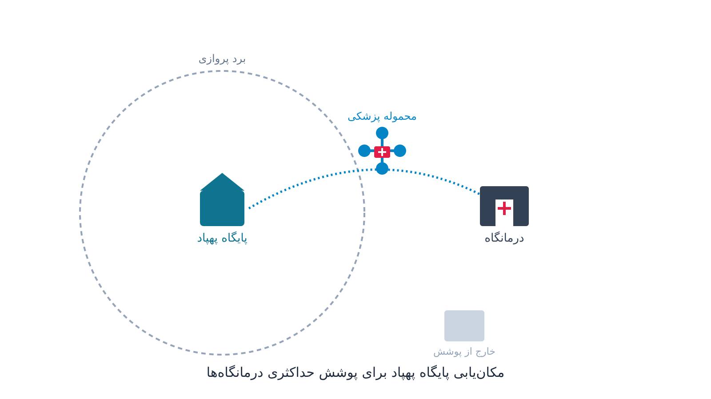

در بسیاری از مناطق روستایی و کوهستانی، رساندن یک کیسه خون یا یک محموله واکسن به یک درمانگاه دورافتاده می‌تواند ساعت‌ها طول بکشد. جاده خاکی، فصل بارندگی، یا مسافت زیاد تا نزدیک‌ترین مرکز درمانی بزرگ، همه باعث می‌شوند بیمار دیرتر از موقع به داروی حیاتی برسد. در سال‌های اخیر، پهپادهای باربر به‌عنوان یک راه‌حل واقعی برای همین مسئله وارد میدان شده‌اند. به‌جای یک کامیون که باید کیلومترها جاده پرپیچ‌وخم را طی کند، یک پهپاد مستقیم و در خط هوایی به سمت درمانگاه پرواز می‌کند و محموله را در چند دقیقه تحویل می‌دهد.

اما پیش از آنکه حتی یک پهپاد به هوا برخیزد، یک سؤال بهینه‌سازی اساسی باید پاسخ داده شود. پایگاه‌های پرواز پهپاد را کجا بزنیم؟ هر درمانگاه را به کدام پایگاه وصل کنیم؟ باید طوری تصمیم بگیریم که هم برد پروازی پهپادها کافی باشد، هم هزینه ساخت پایگاه‌ها معقول بماند، و هم بیشترین جمعیت ممکن تحت پوشش این شبکه هوایی قرار بگیرد.

این دقیقاً همان مسئله‌ای است که شرکتی مثل Zipline در مقیاس واقعی با آن دست‌وپنجه نرم می‌کند؛ این شرکت در روآندا و غنا شبکه‌ای از پایگاه‌های پهپادی برای توزیع خون و واکسن راه‌انداخته است. طراحی چنین شبکه‌ای صرفاً یک تصمیم مهندسی پرواز نیست. این کار ترکیبی است از مسئله کلاسیک مکان‌یابی تسهیلات (Facility Location) و مسئله پوشش (Covering Location) در پژوهش عملیاتی. به این‌ها باید محدودیت‌های خاص خودِ پرواز پهپاد را هم اضافه کرد، مثل برد باتری، ظرفیت بار، و محدودیت تعداد پروازهای روزانه هر پایگاه. این چارچوب ریاضی دقیقاً همان چیزی است که در مسئله [مکان‌یابی پایگاه‌های آمبولانس](/notes/ambulance-location-mclp/) هم برای پوشش اورژانسی جمعیت دیده می‌شود.

## چرا این مسئله اهمیت دارد

نظام سلامت در بسیاری از کشورهای در حال توسعه با یک تناقض کلاسیک روبه‌رو است. مراکز درمانی بزرگ و مجهز معمولاً در شهرهای بزرگ متمرکزند. در حالی‌که بخش زیادی از جمعیت در روستاها و مناطق کم‌تراکم زندگی می‌کنند. نگهداری موجودی کامل از انواع واکسن، فرآورده خونی و داروهای اورژانسی در هر درمانگاه کوچک هم از نظر هزینه و هم از نظر مدیریت زنجیره سرد (Cold Chain) عملاً غیرممکن است. راه‌حل معمول، ارسال بر اساس تقاضا از یک انبار مرکزی است. اما وقتی وسیله حمل جاده‌ای است، تأخیر می‌تواند به قیمت جان بیمار تمام شود؛ مثلاً برای یک زایمان پرخطر یا یک مورد گزش مار که به پادزهر فوری نیاز دارد.

شبکه پهپادی این معادله را عوض می‌کند. به‌جای انبار کردن همه‌چیز در همه‌جا، یک یا چند پایگاه مرکزی با موجودی متمرکز و زنجیره سرد قابل کنترل ساخته می‌شود. پهپادها محموله‌های کوچک و فوری را در عرض چند دقیقه به مقصد می‌رسانند. اما ارزش این مدل کاملاً به تصمیم مکان‌یابی گره خورده است. اگر پایگاه در نقطه نامناسبی ساخته شود، بخشی از درمانگاه‌ها خارج از برد پروازی می‌مانند و سرمایه‌گذاری روی پهپاد عملاً بی‌فایده می‌شود. از این جهت، این مسئله دقیقاً در تقاطع بهینه‌سازی زنجیره تأمین سلامت و لجستیک بشردوستانه قرار می‌گیرد. برای هر سازمانی که مسئول پوشش درمانی مناطق کم‌دسترسی است، این مسئله ارزشی مستقیم و قابل‌اندازه‌گیری دارد.

## فرمول‌بندی ریاضی مسئله

مسئله را می‌توان به‌صورت یک مدل پوشش حداکثری (Maximal Covering Location Problem) با محدودیت ظرفیت پایگاه فرمول‌بندی کرد. فرض کنید مجموعه $J$ نامزدهای مکان پایگاه پهپاد و مجموعه $I$ درمانگاه‌های نیازمند پوشش باشند. برای هر درمانگاه $i$ وزنی $w_i$ (مثلاً جمعیت تحت پوشش یا اولویت درمانی) تعریف می‌شود. برای هر جفت $(i,j)$ هم فاصله رفت‌وبرگشت پروازی $d_{ij}$ تعریف می‌شود. متغیر تصمیم $x_j$ برابر یک است اگر پایگاه در مکان $j$ ساخته شود. متغیر $y_{ij}$ برابر یک است اگر درمانگاه $i$ توسط پایگاه $j$ پوشش داده شود.

$$
\max \sum_{i \in I} w_i \sum_{j \in J} y_{ij}
$$

$$
\text{s.t.} \quad y_{ij} \le x_j \quad \forall i \in I, j \in J
$$

$$
y_{ij} = 0 \quad \text{اگر } d_{ij} > R
$$

$$
\sum_{j \in J} y_{ij} \le 1 \quad \forall i \in I
$$

$$
\sum_{i \in I} y_{ij} \le C_j \, x_j \quad \forall j \in J
$$

$$
\sum_{j \in J} x_j \le p, \qquad x_j, y_{ij} \in \{0,1\}
$$

در این فرمول‌بندی، $R$ حداکثر برد رفت‌وبرگشت پهپاد بر اساس ظرفیت باتری است. $C_j$ حداکثر تعداد درمانگاهی است که پایگاه $j$ از نظر ظرفیت ناوگان می‌تواند پوشش دهد. $p$ هم بودجه‌ای است که تعداد پایگاه‌های قابل ساخت را محدود می‌کند. تابع هدف، مجموع وزنی جمعیت تحت پوشش را حداکثر می‌کند.

یک نسخه جایگزین از همین مدل، به‌جای حداکثرسازی پوشش با تعداد ثابت پایگاه، هزینه ساخت پایگاه‌ها را به تابع هدف اضافه می‌کند. این نسخه به‌دنبال کمینه‌سازی مجموع هزینه ثابت پایگاه‌سازی به‌علاوه جریمه درمانگاه‌های پوشش‌داده‌نشده است. انتخاب بین این دو رویکرد بستگی دارد به این‌که آیا بودجه محدودکننده اصلی است یا سطح پوشش خدمت.

پس از حل این مسئله مکان‌یابی، یک لایه دوم تصمیم باقی می‌ماند: زمان‌بندی روزانه پروازها بین هر پایگاه و درمانگاه‌های متصل به آن. باید محدودیت شارژ باتری بین پروازها و اولویت محموله‌های فوری هم در نظر گرفته شود؛ مثلاً یک درخواست اورژانسی خون باید زودتر از یک تحویل معمول واکسن پرواز کند. این بخش را می‌توان به‌عنوان یک مسئله زمان‌بندی با اولویت (Priority Scheduling) و محدودیت منابع تکرارشونده مدل کرد. این نوع مسئله طبیعتاً با برنامه‌ریزی محدودیت قابل حل است.

## ظرفیت کار آکادمیک و پژوهشی

این حوزه هنوز نسبتاً جوان است و فضای پژوهشی قابل‌توجهی دارد. یکی از مسیرهای باز، مکان‌یابی تصادفی و مقاوم (Robust/Stochastic Facility Location) است. تقاضای درمانگاه‌ها در طول سال ثابت نیست؛ مثلاً در فصل شیوع بیماری‌های خاص یا بعد از یک بلای طبیعی به‌شدت افزایش می‌یابد. شرایط جوی هم می‌تواند برخی روزها پرواز پهپاد را کاملاً غیرممکن کند. مدل‌سازی این عدم‌قطعیت در تصمیم مکان‌یابی، یک مسئله پژوهشی جذاب است.

مسیر دیگر، مسئله ترکیبی مکان‌یابی-مسیریابی (Location-Routing) است. در این مسیر به‌جای فرض یک پرواز مستقیم پایگاه به درمانگاه، امکان توقف میانی یا هماهنگی بین چند پهپاد و یک وسیله نقلیه زمینی (مدل‌های هیبریدی کامیون-پهپاد) هم بررسی می‌شود. همچنین مسئله بهینه‌سازی مسیر پرواز با در نظر گرفتن افت تدریجی ظرفیت باتری در طول عمر پهپاد جای کار زیادی دارد. مسئله زمان‌بندی چند‌هدفه که هم‌زمان زمان تحویل، مصرف انرژی و عدالت پوشش بین مناطق را بهینه می‌کند نیز موضوع خوبی برای پایان‌نامه یا مقاله است. از منظر داده هم، انتشار عمومی برخی گزارش‌های عملیاتی شرکت‌های فعال در این حوزه، امکان کالیبراسیون مدل با داده‌های نسبتاً واقعی را فراهم کرده است.

## پیاده‌سازی با پایتون

خبر خوب این است که برای حل این مسئله نیازی به هیچ نرم‌افزار یا سالور تجاری گران‌قیمت نیست. مدل پوشش حداکثری بالا یک مسئله برنامه‌ریزی خطی عدد صحیح مختلط (MILP) استاندارد است. این مدل با کتابخانه [PuLP](https://coin-or.github.io/pulp/) در پایتون قابل مدل‌سازی است. با سالورهای متن‌باز مثل [CBC](https://github.com/coin-or/Cbc) یا [HiGHS](https://highs.dev/) هم در عرض چند ثانیه تا چند دقیقه حل می‌شود، بسته به تعداد نامزدهای پایگاه و درمانگاه‌ها. برای مسائل با ابعاد بزرگ‌تر یا وقتی محدودیت‌های منطقی پیچیده‌تری مثل اولویت‌بندی محموله‌ها اضافه می‌شود، ماژول CP-SAT از کتابخانه [OR-Tools](https://developers.google.com/optimization) گوگل گزینه بسیار قدرتمندی است. این ماژول هم برنامه‌ریزی محدودیت را پشتیبانی می‌کند و هم رایگان و متن‌باز است.

در عمل، جریان کار به این شکل است: مختصات جغرافیایی درمانگاه‌ها و نامزدهای مکان پایگاه را از یک فایل اکسل یا CSV می‌خوانید که شامل ستون‌های شناسه، عرض و طول جغرافیایی و جمعیت تحت پوشش است. سپس فاصله رفت‌وبرگشت هوایی بین هر جفت را (مثلاً با فرمول هاورساین) محاسبه می‌کنید. هر جفتی که فاصله‌اش از برد مجاز پهپاد بیشتر باشد را از پیش از مدل حذف می‌کنید تا تعداد متغیرهای $y_{ij}$ کاهش یابد. سپس مدل بالا را با PuLP تعریف کرده و به CBC یا HiGHS می‌سپارید.

برای لایه دوم، یعنی زمان‌بندی روزانه پروازهای هر پایگاه، می‌توانید از [OR-Tools](https://developers.google.com/optimization) CP-SAT استفاده کنید. این ابزار می‌تواند محدودیت‌های زمان شارژ باتری، اولویت محموله فوری و ظرفیت ناوگان پهپاد هر پایگاه را هم‌زمان در نظر بگیرد. اگر تحلیل شبکه یا محاسبه اتصال بین پایگاه‌ها و مناطق پوشش نیاز باشد، کتابخانه [NetworkX](https://networkx.org/) هم برای رسم و تحلیل گراف پوشش بسیار کاربردی است.

## سوالات متداول

<h3>آیا این نوع بهینه‌سازی فقط برای شرکت‌های بزرگ حمل‌ونقل هوایی کاربرد دارد؟</h3>

خیر، اصلاً. مسئله مکان‌یابی و پوشش پایگاه پهپادی همان چارچوب ریاضی مکان‌یابی تسهیلات را دارد که در بسیاری از مسائل بهینه‌سازی سلامت مثل مکان‌یابی مراکز واکسیناسیون، پایگاه‌های آمبولانس یا انبارهای دارویی هم استفاده می‌شود. اگر می‌خواهید این خانواده از مسائل را با پروژه‌های عملی و کد پایتون قدم‌به‌قدم یاد بگیرید، دوره <a href="/courses/health-opt/" style="color:#2563EB; font-weight:bold;">بهینه‌سازی سیستم‌های سلامت با پایتون</a> دقیقاً برای همین طراحی شده است.

<h3>آیا حل این مدل حتماً نیاز به سالور تجاری مثل گوروبی دارد؟</h3>

نه. برای اکثر نمونه‌های واقعی این مسئله (چند ده تا چند صد نامزد مکان و درمانگاه)، سالورهای متن‌باز و رایگان مثل CBC یا HiGHS از طریق PuLP، یا CP-SAT از OR-Tools، کاملاً کافی هستند و زمان حل قابل‌قبولی دارند.

<h3>اگر بخواهم این مدل را دقیقاً برای منطقه جغرافیایی و ناوگان پهپادی سازمان خودم پیاده‌سازی کنم چه کار باید بکنم؟</h3>

چون پارامترهایی مثل برد واقعی پهپاد، ظرفیت باتری، تعداد و محل نامزدهای پایگاه و اولویت‌های درمانی از سازمانی به سازمان دیگر کاملاً متفاوت است، بهتر است مدل بر اساس داده و محدودیت‌های خاص شما تنظیم شود. برای این نوع پیاده‌سازی اختصاصی می‌توانید از خدمات <a href="/consultation/" style="color:#2563EB; font-weight:bold;">مشاوره</a> استفاده کنید.

