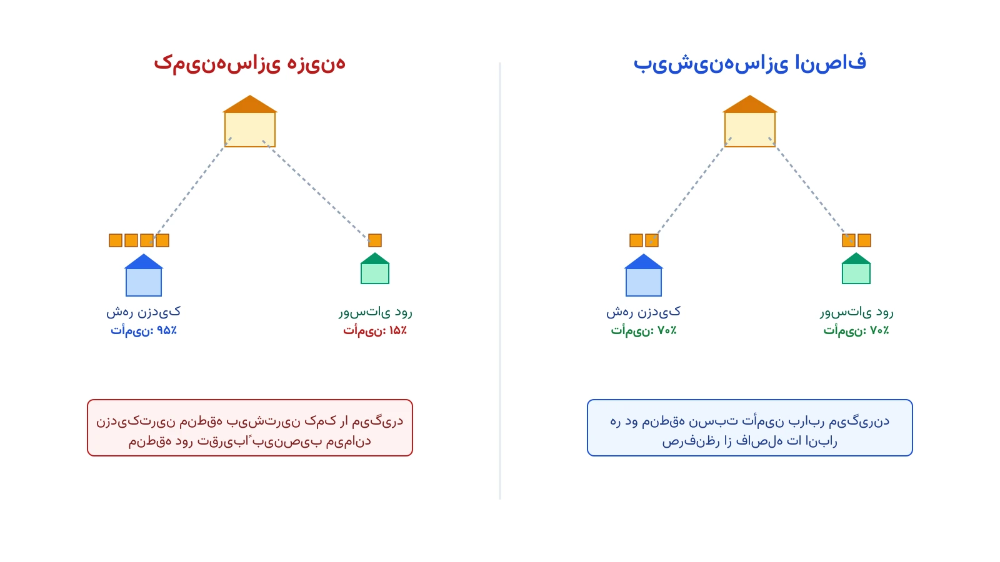

یک زلزله بزرگ رخ داده است. انبار امدادی شهر فقط هزار بسته غذایی در اختیار دارد. سه منطقه آسیب‌دیده هرکدام جمعیت و میزان خسارت متفاوتی دارند. اگر هدف مدل فقط کمینه‌کردن هزینه حمل‌ونقل باشد، بیشتر بسته‌ها به نزدیک‌ترین و راحت‌ترین منطقه می‌رود. منطقه دورافتاده، حتی با نیاز فوری‌تر، ممکن است تقریباً چیزی دریافت نکند.

این دقیقاً جایی است که بهینه‌سازی کلاسیک هزینه‌محور با واقعیت لجستیک بشردوستانه تصادم پیدا می‌کند. در زنجیره تأمین تجاری، کمینه‌کردن هزینه کل معیاری منطقی و پذیرفته‌شده است. اما در امداد پس از بلایا، نادیده‌گرفتن یک منطقه به‌خاطر دوربودنش، هزینه انسانی سنگینی دارد. به همین دلیل، بسیاری از مدل‌های امدادی به‌جای «کمینه‌کردن هزینه»، «بیشینه‌کردن انصاف» را هدف اصلی می‌گذارند.

## فرمول‌بندی ریاضی مسئله

فرض کنید مجموعه مناطق آسیب‌دیده را با $J$ نشان دهیم. هر منطقه $j$ نیاز مشخصی به نام $d_j$ دارد؛ مثلاً تن غذا یا تعداد بسته دارو. کل موجودی قابل‌ارسال از انبار، مقدار ثابت $S$ است. متغیر تصمیم $y_j$ نشان می‌دهد چه مقداری از این موجودی به منطقه $j$ اختصاص می‌یابد.

نسبت تأمین هر منطقه را این‌گونه تعریف می‌کنیم:

$$
r_j = \frac{y_j}{d_j}
$$

هدف مدل بیشینه-کمینه، بالابردن کمترین نسبت تأمین در میان همه مناطق است. یک متغیر کمکی $z$ نقش «گلوگاه» را بازی می‌کند:

$$
\max z \quad \text{s.t.} \quad z \le \frac{y_j}{d_j} \quad \forall j \in J
$$

$$
\sum_{j \in J} y_j \le S \,, \qquad 0 \le y_j \le d_j \quad \forall j \in J
$$

چون $d_j$ یک عدد ثابت است، قید اول کاملاً خطی می‌ماند: کافی است طرفین در $d_j$ ضرب شوند. این مدل، یک برنامه‌ریزی خطی ساده است، نه یک مسئله غیرخطی پیچیده.

یک نکته ظریف اینجا وجود دارد. مدل بالا فقط کمترین نسبت را بیشینه می‌کند، نه همه نسبت‌ها را. ممکن است بعد از رسیدن به بهترین $z$، هنوز مقداری از موجودی $S$ باقی بماند. دلیلش این است که برخی مناطق به سقف نیاز خودشان، یعنی $y_j=d_j$، رسیده‌اند و دیگر نمی‌توانند بیشتر بگیرند. راه‌حل درست، تکرار همین بهینه‌سازی به‌صورت لغت‌نامه‌ای یا لکسیکوگرافیک است. در هر دور، مناطق اشباع‌شده کنار گذاشته می‌شوند و موجودی باقی‌مانده دوباره میان بقیه مناطق، با همان هدف بیشینه-کمینه، توزیع می‌شود.

## اهمیت این موضوع

عدالت در توزیع امداد صرفاً یک بحث نظری نیست. سازمانی مانند برنامه جهانی غذای سازمان ملل (WFP) هرساله میلیون‌ها نفر را در مناطق بحران‌زده پوشش می‌دهد. چنین سازمان‌هایی هر روز با همین مصالحه بین کارایی و انصاف روبه‌رو هستند. وقتی موجودی کافی نیست، هر تصمیم تخصیص، به‌طور مستقیم روی زندگی انسان‌ها اثر می‌گذارد.

مدل‌های صرفاً هزینه‌محور، به‌طور سیستماتیک به مناطق پرجمعیت و نزدیک‌تر به انبار امتیاز می‌دهند. این الگو می‌تواند مناطق روستایی یا کم‌جمعیت را به حاشیه براند. پژوهش‌های میدانی در حوزه لجستیک بشردوستانه بارها نشان داده‌اند که این شکاف، در بلایای واقعی تکرار می‌شود. مدل بیشینه-کمینه، ابزاری ساده و شفاف برای کاهش این نابرابری ساختاری فراهم می‌کند. دوره [مسیریابی و بهینه‌سازی با پایتون](/courses/vrp-python/) دقیقاً همین نوع مدل‌های تخصیص و مسیریابی را با مثال‌های عملی پوشش می‌دهد.

## ظرفیت پژوهشی و آکادمیک

عدالت در بهینه‌سازی یکی از حوزه‌های رو به رشد پژوهش عملیاتی است. مسیر اول، مقایسه معیارهای مختلف انصاف است: بیشینه-کمینه، انصاف متناسب، و ضریب جینی هرکدام نتیجه متفاوتی می‌دهند. مسیر دوم، مصالحه دوهدفه بین کارایی و انصاف است. روش اپسیلون-محدودیت، که در [یادداشت بهینه‌سازی دوهدفه با روش اپسیلون-محدودیت](/notes/epsilon-constraint-bi-objective/) توضیح داده شده، ابزاری مناسب برای ترسیم این مصالحه است.

مسیر سوم، گسترش مدل به حالت چندکالایی است. این حالت وقتی رخ می‌دهد که همزمان غذا، آب و دارو باید توزیع شوند. مسیر چهارم، عدالت بین‌دوره‌ای در بحران‌های طولانی است. اگر منطقه‌ای امروز کم‌تر گرفت، باید در تخصیص فردا جبران شود. مسیر پنجم، مدل‌سازی تصادفی وقتی میزان دقیق نیاز هر منطقه هنوز نامعلوم است. هرکدام از این مسیرها، ظرفیت خوبی برای پایان‌نامه یا مقاله علمی دارند.



## پیاده‌سازی با پایتون

خبر خوب این است که حل این مدل، نیازی به نرم‌افزار گران‌قیمت ندارد. ماژول برنامه‌ریزی خطی کتابخانه متن‌باز [OR-Tools](https://developers.google.com/optimization) این کار را به‌سادگی انجام می‌دهد. سالورهای رایگان مثل [GLOP](https://developers.google.com/optimization/lp/glop) یا [HiGHS](https://highs.dev/) برای این نوع مدل خطی کاملاً کافی‌اند. داده واقعی هر منطقه را می‌توان از یک فایل ساده اکسل یا CSV خواند. این فایل فقط باید شامل ستون‌های نام منطقه، جمعیت و میزان نیاز باشد.

```python
from ortools.linear_solver import pywraplp

demand = {"A": 300, "B": 450, "C": 250}
supply = 700

solver = pywraplp.Solver.CreateSolver("GLOP")
y = {j: solver.NumVar(0, demand[j], f"y_{j}") for j in demand}
z = solver.NumVar(0, 1, "z")

for j in demand:
    solver.Add(z * demand[j] <= y[j])

solver.Add(solver.Sum(y[j] for j in demand) <= supply)
solver.Maximize(z)
solver.Solve()

for j in demand:
    ratio = y[j].solution_value() / demand[j]
    print(f"منطقه {j}: تخصیص {y[j].solution_value():.0f} از {demand[j]} (نسبت {ratio:.2f})")
```

روی این مثال سه‌منطقه‌ای، سالور موجودی را طوری تقسیم می‌کند که هر سه منطقه تقریباً نسبت تأمین یکسانی بگیرند. این دقیقاً برعکس نتیجه مدلی است که فقط هزینه یا فاصله را کمینه می‌کند. برای اعمال دور دوم لکسیکوگرافیک، مناطقی با $y_j=d_j$ باید ثابت شوند. سپس مدل با موجودی باقی‌مانده دوباره روی بقیه مناطق اجرا می‌شود.

## سوالات متداول

<h3>آیا مدل بیشینه-کمینه همیشه بهترین انتخاب است؟</h3>
<p>نه همیشه. این مدل گاهی باعث می‌شود موجودی در دست یک منطقه کم‌نیاز بماند تا نسبت‌ها برابر شوند. در عمل، ترکیب آن با یک سقف منطقی روی نسبت تأمین یا حرکت به سمت انصاف متناسب، جواب متعادل‌تری می‌دهد.</p>

<h3>آیا برای استفاده از این مدل باید مهندس صنایع باشیم؟</h3>
<p>دانش پایه برنامه‌ریزی خطی کافی است. دوره <a href="/courses/vrp-python/" style="color:#2563EB; font-weight:bold;">مسیریابی و بهینه‌سازی با پایتون</a> همین نوع مدل‌های تخصیص و مسیریابی امدادی را قدم‌به‌قدم آموزش می‌دهد.</p>

<h3>اگر سازمان ما چند انبار و چند نوع کالای امدادی داشته باشد چه؟</h3>
<p>مدل قابل‌گسترش به چند انبار، چند کالا و چند دوره زمانی است. برای طراحی دقیق مدل متناسب با ساختار سازمان شما، از طریق <a href="/consultation/" style="color:#2563EB; font-weight:bold;">مشاوره</a> می‌توانیم جزئیات را بررسی کنیم.</p>
