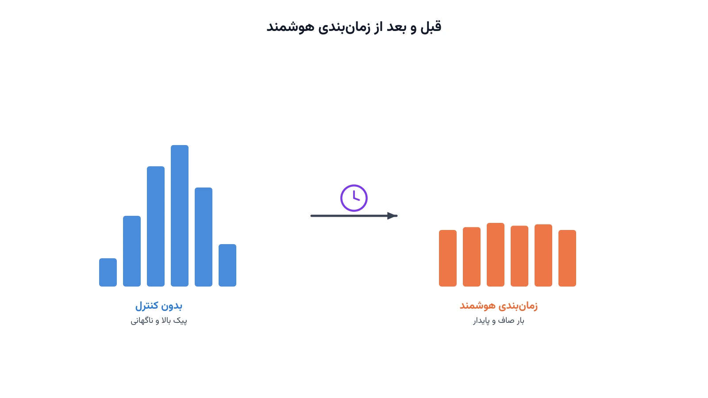
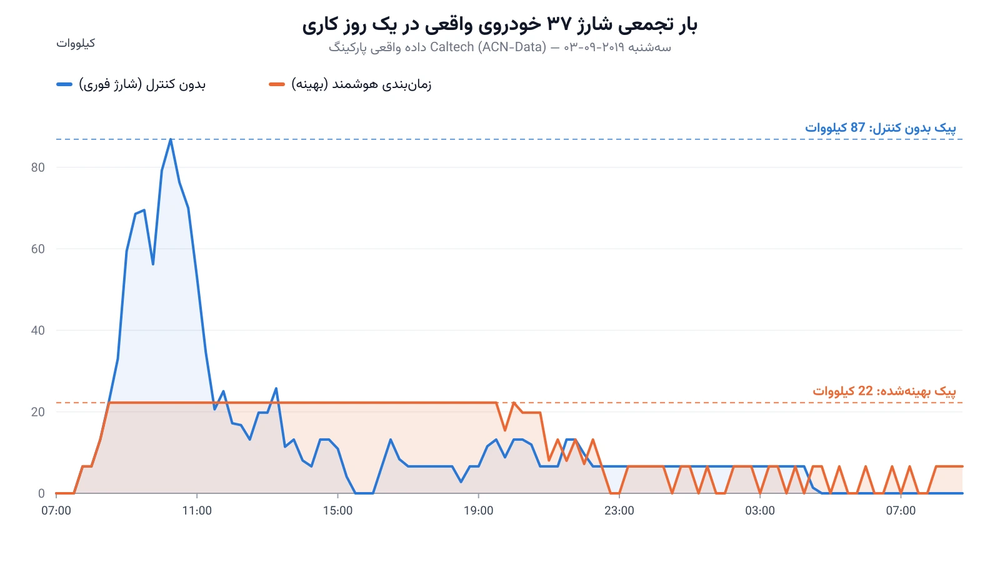

در بیشتر پارکینگ‌های شارژ خودروی برقی، هر راننده به محض رسیدن، دوشاخه را وصل می‌کند. شارژر هم بلافاصله با حداکثر توان شروع به کار می‌کند. این رفتار طبیعی به نظر می‌رسد، اما وقتی ده‌ها خودرو هم‌زمان این کار را انجام دهند، پیک بار به‌شدت بالا می‌رود. این پیک، دقیقاً همان چیزی است که ترانسفورماتور و شبکه توزیع محلی را تحت فشار می‌گذارد.

سؤال جالب این است: آیا واقعاً لازم است همه هم‌زمان با حداکثر سرعت شارژ شوند؟ در بیشتر موارد، هر راننده ساعت‌ها زمان دارد تا خودرویش کاملاً شارژ شود. اگر بشود توان شارژ هر خودرو را در طول همین بازه زمانی جابه‌جا کرد، پیک کلی به‌شدت کاهش می‌یابد. این دقیقاً همان ایده «زمان‌بندی هوشمند شارژ» یا Smart EV Charging Scheduling است.

### داده واقعی پشت این مطلب

معمولاً چنین مطالبی با یک مثال ساختگی نوشته می‌شوند. این‌بار می‌خواهیم از داده واقعی استفاده کنیم. این تحلیل بر پایه مجموعه‌ای از جلسات شارژ واقعی است که در قالب یک پژوهش دانشگاهی داوری‌شده منتشر شده‌اند (Amara-Ouali و همکاران، ۲۰۲۱، مجله Energies).

در این مطلب، از بخش ACN Data استفاده می‌کنیم. این داده از پارکینگ شارژ دانشگاه Caltech در کالیفرنیا جمع‌آوری شده است. برای هر جلسه شارژ، زمان ورود، زمان خروج و مقدار انرژی تحویل‌داده‌شده به‌صورت واقعی ثبت شده است. یک روز کاری واقعی را انتخاب کردیم که در آن ۳۷ خودرو به‌طور هم‌زمان یا پی‌درپی شارژ شده‌اند.

### فرمول‌بندی ریاضی

افق زمانی روز را به بازه‌های ۱۵ دقیقه‌ای تقسیم می‌کنیم و آن‌ها را با $t \in T$ نشان می‌دهیم. هر خودرو $e \in E$ یک بازه حضور مشخص دارد: از لحظه اتصال تا لحظه جدا شدن. متغیر تصمیم $p_{e,t} \ge 0$ توان شارژ خودرو $e$ در بازه $t$ است، با سقف $R_{max}$ کیلووات. انرژی موردنیاز واقعی هر خودرو را با $D_e$ نشان می‌دهیم.

هدف مدل، کمینه‌کردن بالاترین توان هم‌زمان شبکه در طول روز است:

$$
\min \; P_{max}
$$

با این محدودیت برای هر بازه زمانی:

$$
\sum_{e \in E} p_{e,t} \le P_{max} \qquad \forall t \in T
$$

و این محدودیت تضمین می‌کند هر خودرو دقیقاً همان انرژی واقعی‌اش را در بازه حضورش دریافت کند:

$$
\sum_{t \in T_e} p_{e,t} \cdot \Delta t = D_e \qquad \forall e \in E
$$

که $T_e$ زیرمجموعه‌ای از بازه‌هاست که خودرو $e$ در آن‌ها متصل است، و $\Delta t$ طول هر بازه (ربع ساعت) است. سقف نرخ شارژ هم رعایت می‌شود:

$$
0 \le p_{e,t} \le R_{max} \qquad \forall e, t
$$

نکته جالب این است که این مدل یک برنامه‌ریزی خطی ساده است، نه عدد صحیح مختلط. چون توان شارژ می‌تواند هر مقدار پیوسته‌ای بین صفر و سقف مجاز باشد. هیچ متغیر باینری‌ای برای تصمیم روشن یا خاموش بودن شارژر لازم نیست.



### اهمیت این موضوع در دنیای واقعی

رشد فروش خودروهای برقی، فشار تازه‌ای به شبکه توزیع برق وارد کرده است. این موضوع دقیقاً بخشی از حوزه بزرگ‌تر [بهینه‌سازی شبکه هوشمند](/notes/smart-grid-optimization/) است. بسیاری از پارکینگ‌ها و محله‌های مسکونی، زیرساخت برقشان برای این حجم از شارژ همزمان طراحی نشده بود. شرکتی مثل PG&E (Pacific Gas & Electric) در کالیفرنیا، صدها ترانسفورماتور محلی را به‌خاطر پیک شارژ خودرو ارتقا می‌دهد. زمان‌بندی هوشمند شارژ، جایگزین ارزان‌تری برای این ارتقای گران زیرساخت است.

از منظر بهره‌بردار پارکینگ هم، این مدل ارزش اقتصادی مستقیم دارد. بسیاری از قراردادهای برق صنعتی و تجاری، بر اساس بالاترین پیک مصرف ماهانه قیمت‌گذاری می‌شوند. کاهش ۷۴ درصدی پیک، همان‌طور که در داده واقعی این مطلب دیدیم، مستقیماً به کاهش صورت‌حساب برق منجر می‌شود. این یعنی زمان‌بندی هوشمند، هم به شبکه کمک می‌کند و هم هزینه بهره‌بردار را کم می‌کند.

### ظرفیت کار آکادمیک و پژوهشی

زمان‌بندی هوشمند شارژ خودروی برقی یکی از فعال‌ترین حوزه‌های پژوهشی سیستم قدرت است. همین دانشگاه Caltech، یک زیرساخت واقعی به‌نام ACN (Adaptive Charging Network) ساخته تا الگوریتم‌های زمان‌بندی را روی خودروهای واقعی آزمایش کند. این یعنی مدل‌های این حوزه، برخلاف بسیاری از مسائل دیگر بهینه‌سازی، مستقیماً روی سخت‌افزار واقعی هم آزمون می‌شوند.

مسیر پژوهشی اول، افزودن عدم‌قطعیت در زمان ورود و خروج خودروهای آینده است. مدل ما فرض کرد همه اطلاعات از قبل معلوم است، اما در عمل باید پیش‌بینی شود. مسیر دوم، شارژ دوطرفه یا Vehicle-to-Grid است. یعنی خودرو بتواند در ساعت پیک، انرژی را به شبکه پس بدهد. مسیر سوم، هماهنگی هم‌زمان چند پارکینگ یا چند ساختمان زیر یک سقف مشترک شبکه توزیع است. این نوع مسائل هماهنگی توزیع‌شده، زمینه خوبی برای پایان‌نامه یا مقاله علمی است.

### پیاده‌سازی با پایتون

خبر خوب این است که این مدل یک برنامه‌ریزی خطی ساده است. برای حل آن نیازی به سالورهای تجاری گران‌قیمت نیست. کتابخانه متن‌باز [PuLP](https://coin-or.github.io/pulp/) به‌همراه سالور رایگان [CBC](https://github.com/coin-or/Cbc) برای این ابعاد کاملاً کافی است. برای شبکه‌هایی با صدها خودرو، [HiGHS](https://highs.dev/) گزینه سریع‌تری است.

داده خام این مطلب، فایل JSON واقعی پارکینگ Caltech از همان مجموعه‌داده باز است. با پانداس، زمان اتصال، زمان جدایی و انرژی تحویل‌شده هر جلسه واقعی را می‌خوانیم. کد زیر مدل زمان‌بندی هوشمند را برای یک روز واقعی با ۳۷ خودرو حل می‌کند:

```python
import json
import pandas as pd
import pulp

RATE_MAX = 6.6       # کیلووات، سقف شارژر سطح ۲
SLOT_MIN = 15
SLOT_H = SLOT_MIN / 60

with open("acn_caltech_sessions.json", encoding="utf-8") as f:
    raw = json.load(f)["_items"]

df = pd.DataFrame(raw)
df["connectionTime"] = pd.to_datetime(df["connectionTime"], utc=True).dt.tz_convert("America/Los_Angeles")
df["disconnectTime"] = pd.to_datetime(df["disconnectTime"], utc=True).dt.tz_convert("America/Los_Angeles")

day = df[df["connectionTime"].dt.date.astype(str) == "2019-09-03"].reset_index(drop=True)

t0 = day["connectionTime"].min().floor("h")
t1 = day["disconnectTime"].max().ceil("h")
n_slots = int((t1 - t0).total_seconds() / 60 / SLOT_MIN)

model = pulp.LpProblem("ev_smart_charging_peak_shaving", pulp.LpMinimize)
Pmax = pulp.LpVariable("Pmax", lowBound=0)
p = {}

for e, row in day.iterrows():
    active_slots = [
        k for k in range(n_slots)
        if row["connectionTime"] < t0 + pd.Timedelta(minutes=SLOT_MIN * (k + 1))
        and row["disconnectTime"] > t0 + pd.Timedelta(minutes=SLOT_MIN * k)
    ]
    for k in active_slots:
        p[e, k] = pulp.LpVariable(f"p_{e}_{k}", lowBound=0, upBound=RATE_MAX)
    model += pulp.lpSum(p[e, k] for k in active_slots) * SLOT_H == row["kWhDelivered"]

for k in range(n_slots):
    model += pulp.lpSum(p[e, k] for (e, kk) in p if kk == k) <= Pmax

model += Pmax
model.solve(pulp.PULP_CBC_CMD(msg=False))

print(f"پیک بهینه‌شده: {Pmax.value():.1f} کیلووات")
```



نتیجه روی همین روز واقعی چشمگیر است. بدون هیچ کنترلی، پیک بار به ۸۷ کیلووات می‌رسید. با زمان‌بندی هوشمند، همان پیک به ۲۲ کیلووات کاهش پیدا کرد. یعنی حدود ۷۴ درصد کاهش پیک، بدون این‌که حتی یک خودرو دیرتر از زمان واقعی خروجش شارژ کامل شود. دوره [بهینه‌سازی پیشرفته سیستم قدرت](/courses/advanced-power-system/) دقیقاً همین نوع مسائل زمان‌بندی و پاسخگویی بار را با جزئیات بیشتر پوشش می‌دهد.

### سوالات متداول

<h3>چرا این مدل به‌جای MILP، فقط یک برنامه‌ریزی خطی است؟</h3>
<p>چون در این مسئله فقط باید تصمیم بگیریم هر خودرو در هر بازه چقدر توان بگیرد. تصمیم روشن یا خاموش بودن شارژر اینجا مطرح نیست. اگر بخواهیم حداقل نرخ شارژ یا محدودیت تعداد شارژر فعال هم اضافه کنیم، مدل به یک MILP تبدیل می‌شود.</p>

<h3>این نوع مسائل زمان‌بندی و پاسخگویی بار سیستم قدرت را کجا می‌توان پروژه‌محور یاد گرفت؟</h3>
<p>دوره <a href="/courses/advanced-power-system/" style="color:#2563EB; font-weight:bold;">بهینه‌سازی پیشرفته سیستم قدرت</a> مدل‌سازی و حل این نوع مسائل زمان‌بندی و پاسخگویی بار را با ابزارهای متن‌باز پایتون پوشش می‌دهد.</p>

<h3>آیا می‌توان این مدل را روی داده واقعی پارکینگ یا ساختمان خودمان اجرا کرد؟</h3>
<p>بله. تنها چیزی که لازم است، ثبت زمان اتصال، زمان جدایی و انرژی موردنیاز هر خودرو است. همین ساختار داده‌ای است که در این مطلب دیدیم. برای پیاده‌سازی این مدل روی داده واقعی پارکینگ یا شرکت خودتان می‌توانید از طریق صفحه <a href="/consultation/" style="color:#2563EB; font-weight:bold;">مشاوره</a> با ما در ارتباط باشید.</p>
