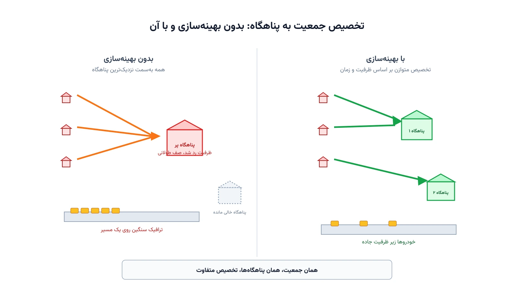

طوفانی بزرگ در حال نزدیک‌شدن به یک منطقه ساحلی است. مقامات محلی فقط چند ساعت وقت دارند. کدام پناهگاه‌ها باید باز شوند؟ کدام محله باید به کدام پناهگاه برود؟ برخلاف بیشتر مسائل لجستیک، اینجا کالا جابه‌جا نمی‌شود؛ انسان جابه‌جا می‌شود. زمان هم یک منبع تمام‌شدنی است، نه فقط یک هزینه. اگر تخلیه دیر شروع شود یا مسیرها اشتباه انتخاب شوند، جاده‌ها بن‌بست می‌شوند و بخشی از جمعیت به‌موقع به پناهگاه نمی‌رسد.

این مسئله با لجستیک امداد معمولی فرق اساسی دارد. در لجستیک امداد، کمک از یک انبار به‌سمت مناطق آسیب‌دیده حرکت می‌کند. در تخلیه اضطراری، جهت جریان برعکس است؛ جمعیت از مناطق پرخطر به‌سمت پناهگاه‌های امن حرکت می‌کند. ظرفیت جاده هم یک قید سخت است، نه فقط یک هزینه. اگر جمعیت زیادی هم‌زمان وارد یک مسیر شوند، خودِ جاده به یک گلوگاه تبدیل می‌شود.

## فرمول‌بندی ریاضی مسئله

فرض کنید $Z$ مجموعه مناطق مسکونی در معرض خطر باشد که هرکدام جمعیت $p_z$ دارند. مجموعه $S$ هم پناهگاه‌های کاندید است؛ هر پناهگاه $s$ ظرفیت $C_s$ و هزینه فعال‌سازی $f_s$ دارد. متغیر $y_s \in \{0,1\}$ نشان می‌دهد پناهگاه $s$ باز می‌شود یا نه. متغیر $x_{zs} \ge 0$ تعداد نفراتی است که از منطقه $z$ به پناهگاه $s$ اعزام می‌شوند.

هدف مدل، کمینه‌کردن مجموع هزینه فعال‌سازی پناهگاه‌ها و هزینه کل جابه‌جایی جمعیت است:

$$
\min \sum_{s \in S} f_s\, y_s + \sum_{z \in Z}\sum_{s \in S} c_{zs}\, x_{zs}
$$

که در آن $c_{zs}$ ترکیبی از زمان سفر و ریسک مسیر بین منطقه $z$ و پناهگاه $s$ است. محدودیت‌های اصلی مدل چنین‌اند:

$$
\sum_{s \in S} x_{zs} = p_z \qquad \forall z \in Z
$$

$$
x_{zs} \le p_z\, y_s \qquad \forall z \in Z,\ s \in S
$$

$$
\sum_{z \in Z} x_{zs} \le C_s\, y_s \qquad \forall s \in S
$$

قید اول تضمین می‌کند کل جمعیت هر منطقه تخلیه شود، نه فقط بخشی از آن. قید دوم اجازه تخصیص به پناهگاه بسته را نمی‌دهد. قید سوم ظرفیت هر پناهگاه باز را رعایت می‌کند. سقف زمانی $T_{max}$ هم معمولاً به‌شکل یک قید اضافه نمی‌آید. به‌جای آن، هر جفت $(z,s)$ که زمان سفرش $t_{zs}$ از $T_{max}$ بیشتر باشد، از ابتدا از مجموعه متغیرهای مدل حذف می‌شود.

نسخه ساده بالا، ظرفیت جاده‌ها را نادیده می‌گیرد و فقط ظرفیت پناهگاه را می‌بیند. در عمل، خودِ جاده هم یک منبع محدود است. نسخه پیشرفته‌تر این مسئله، به‌جای یک تخصیص ساده، یک شبکه جریان بسط‌یافته در زمان می‌سازد. در چنین شبکه‌ای، هر گره جاده در هر بازه زمانی یک نسخه جداگانه دارد و ظرفیت هر کمان محدود است. این ساختار اجازه می‌دهد ازدحام و گلوگاه جاده هم در مدل دیده شود، نه فقط ظرفیت پناهگاه.

## اهمیت این موضوع

برنامه‌ریزی تخلیه یکی از حیاتی‌ترین تصمیم‌های مدیریت بحران است. یک برنامه ضعیف می‌تواند جان صدها نفر را به خطر بیندازد. تجربه طوفان کاترینا در نیواورلئان نشان داد نبود یک برنامه تخلیه شفاف چه هزینه‌ای دارد. بسیاری از خودروها روی جاده‌های خروجی گیر کردند، درست در ساعاتی که طوفان نزدیک‌تر می‌شد.

شرکت‌های مهندسی زیرساخت و ترافیک مانند AECOM در طراحی برنامه‌های تخلیه شهری و شبیه‌سازی شبکه جاده‌ای از چنین رویکردهایی بهره می‌برند. این نوع مدل‌سازی به مقامات محلی کمک می‌کند از قبل بدانند کدام مسیرها گلوگاه می‌شوند. همین آگاهی زودهنگام، فرصت اصلاح برنامه پیش از وقوع بحران واقعی را فراهم می‌کند.

همین چارچوب برای تخلیه پیش از آتش‌سوزی جنگلی، سیل، یا حتی نشت شیمیایی صنعتی هم کاربرد دارد. تنها چیزی که تغییر می‌کند، پارامترهای زمان و جغرافیای خطر است. ساختار ریاضی مسئله تقریباً یکسان می‌ماند.

## ظرفیت پژوهشی و آکادمیک

مسئله مکان‌یابی-تخلیه یکی از زمینه‌های فعال پژوهش در تحقیق در عملیات است. یک مسیر رایج، مدل‌سازی عدم‌قطعیت مسیر بلا است. مسیری که امروز باز است، ممکن است ساعتی بعد به‌خاطر رانش زمین یا آتش بسته شود. بهینه‌سازی استوار یا دومرحله‌ای می‌تواند این عدم‌قطعیت را در تصمیم مکان‌یابی پیشینی لحاظ کند.

مسیر پژوهشی دیگر، بازگردانی جهت جاده یا Contraflow است. در این تکنیک، جهت حرکت در برخی خطوط جاده به‌صورت موقت معکوس می‌شود تا ظرفیت خروج شهر افزایش یابد. این‌که کدام جاده و در چه بازه زمانی معکوس شود، خودش یک زیرمسئله بهینه‌سازی جالب است.

مسیر سوم، ترکیب این مدل با رفتار واقعی جمعیت است. همه ساکنان فرمان تخلیه را فوری اجرا نمی‌کنند. برخی دیرتر حرکت می‌کنند یا مسیر دیگری انتخاب می‌کنند. پیوند مدل‌های بهینه‌سازی با داده‌های رفتاری، یکی از مرزهای فعال این حوزه است. عدالت در دسترسی به پناهگاه هم فرصت خوبی برای پایان‌نامه و مقاله است.



## پیاده‌سازی با پایتون

این کلاس از مسائل نیازی به نرم‌افزار تجاری گران‌قیمت ندارد. برای بخش تخصیص جمعیت به پناهگاه، کتابخانه متن‌باز [PuLP](https://coin-or.github.io/pulp/) همراه سالورهایی مثل [CBC](https://github.com/coin-or/Cbc) یا [HiGHS](https://highs.dev/) کاملاً کافی است. برای بخش شبکه جاده و محاسبه کوتاه‌ترین مسیر یا جریان بیشینه، کتابخانه [NetworkX](https://networkx.org/) ابزار طبیعی است.

ساختار پایه این مدل، همان مسئله کلاسیک مکان‌یابی تسهیلات است که در یادداشت [مسئله مکان‌یابی تسهیلات](/notes/facility-location-problem/) به‌طور مفصل بررسی شده. تفاوت اصلی اینجا، اضافه‌شدن یک سقف زمانی سخت‌گیرانه برای رسیدن هر منطقه به پناهگاه است. داده‌های ورودی را می‌توان از یک فایل CSV خواند. این فایل نام هر منطقه، جمعیت آن، و زمان سفر تخمینی تا هر پناهگاه کاندید را در بر می‌گیرد.

کد زیر با PuLP یک سناریوی ساده را حل می‌کند: چهار منطقه، سه پناهگاه کاندید، و یک سقف زمانی مشخص. خروجی نشان می‌دهد کدام پناهگاه‌ها باز شوند و هر منطقه به کدام پناهگاه اعزام شود:

```python
import pulp

zones = ["منطقه_ساحلی_۱", "منطقه_ساحلی_۲", "منطقه_ساحلی_۳", "منطقه_داخلی"]
population = {"منطقه_ساحلی_۱": 1200, "منطقه_ساحلی_۲": 900, "منطقه_ساحلی_۳": 1500, "منطقه_داخلی": 600}

shelters = ["مدرسه_الف", "ورزشگاه_ب", "مرکز_ج"]
capacity = {"مدرسه_الف": 1800, "ورزشگاه_ب": 2200, "مرکز_ج": 1400}
open_cost = {"مدرسه_الف": 500, "ورزشگاه_ب": 900, "مرکز_ج": 400}

# زمان سفر تخمینی به دقیقه از هر منطقه به هر پناهگاه
travel_time = {
    ("منطقه_ساحلی_۱", "مدرسه_الف"): 25, ("منطقه_ساحلی_۱", "ورزشگاه_ب"): 40, ("منطقه_ساحلی_۱", "مرکز_ج"): 55,
    ("منطقه_ساحلی_۲", "مدرسه_الف"): 35, ("منطقه_ساحلی_۲", "ورزشگاه_ب"): 20, ("منطقه_ساحلی_۲", "مرکز_ج"): 45,
    ("منطقه_ساحلی_۳", "مدرسه_الف"): 50, ("منطقه_ساحلی_۳", "ورزشگاه_ب"): 30, ("منطقه_ساحلی_۳", "مرکز_ج"): 15,
    ("منطقه_داخلی", "مدرسه_الف"): 10, ("منطقه_داخلی", "ورزشگاه_ب"): 25, ("منطقه_داخلی", "مرکز_ج"): 20,
}

max_time = 45  # سقف زمانی مجاز تخلیه، به دقیقه

model = pulp.LpProblem("evacuation_shelter", pulp.LpMinimize)

open_shelter = pulp.LpVariable.dicts("open", shelters, cat="Binary")
pairs = [(z, s) for z in zones for s in shelters if travel_time[(z, s)] <= max_time]
assign = pulp.LpVariable.dicts("assign", pairs, lowBound=0)

model += (
    pulp.lpSum(open_cost[s] * open_shelter[s] for s in shelters)
    + pulp.lpSum(travel_time[(z, s)] * assign[(z, s)] / 1000 for (z, s) in pairs)
)

for z in zones:
    model += pulp.lpSum(assign[(z, s)] for s in shelters if (z, s) in pairs) == population[z]

for s in shelters:
    model += (
        pulp.lpSum(assign[(z, s)] for z in zones if (z, s) in pairs)
        <= capacity[s] * open_shelter[s]
    )

model.solve(pulp.PULP_CBC_CMD(msg=False))

for s in shelters:
    if open_shelter[s].value() == 1:
        print(f"پناهگاه {s} باز می‌شود")
for (z, s) in pairs:
    if assign[(z, s)].value() and assign[(z, s)].value() > 0:
        print(f"  {z} -> {s}: {assign[(z, s)].value():.0f} نفر")
```

اگر سالور جواب موجه پیدا نکند، معمولاً یعنی سقف زمانی $T_{max}$ با ظرفیت مجموع پناهگاه‌های قابل‌دسترس ناسازگار است. در این حالت باید یا یک پناهگاه موقت اضافه شود، یا سقف زمانی با تمهیداتی مثل Contraflow افزایش یابد. در عمل، این مدل پیش از فصل بحران به‌صورت آفلاین اجرا می‌شود تا برنامه پایه از قبل آماده باشد. در لحظه بحران واقعی، فقط پارامترها به‌روزرسانی می‌شوند.

## سوالات متداول

<h3>این مدل با مسائل لجستیک امداد که قبلاً معرفی شده چه فرقی دارد؟</h3>
<p>در لجستیک امداد، جهت جریان از انبار به‌سمت مناطق آسیب‌دیده است. در تخلیه اضطراری، جهت جریان برعکس است؛ جمعیت از منطقه پرخطر به‌سمت پناهگاه امن حرکت می‌کند و ظرفیت جاده یک قید سخت محسوب می‌شود، نه فقط یک هزینه.</p>

<h3>برای یادگیری این نوع مدل‌سازی مسیریابی و تخصیص از کجا شروع کنیم؟</h3>
<p>دوره <a href="/courses/vrp-python/" style="color:#2563EB; font-weight:bold;">مسیریابی و بهینه‌سازی با پایتون</a> پایه لازم برای کار با OR-Tools، PuLP و مدل‌سازی مسائل تخصیص و مسیریابی از این جنس را می‌سازد.</p>

<h3>آیا می‌توان این مدل را برای یک شهر یا منطقه خاص با داده‌های واقعی پیاده‌سازی کرد؟</h3>
<p>بله. جمعیت هر منطقه، ظرفیت واقعی پناهگاه‌ها و زمان سفر واقعی جاده‌ها باید جایگزین داده نمونه شوند. از طریق <a href="/consultation/" style="color:#2563EB; font-weight:bold;">مشاوره</a> می‌توانید جزئیات پروژه و داده‌های در دسترس‌تان را مطرح کنید.</p>
