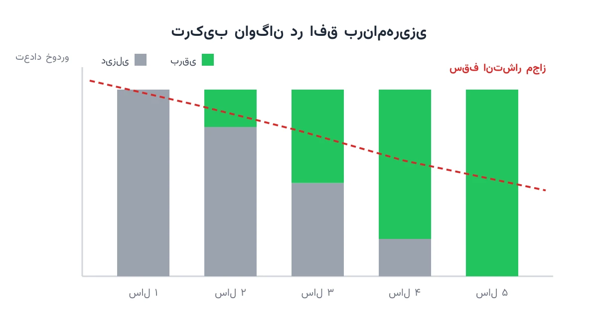

یک شرکت حمل‌ونقل صد کامیون دیزلی در ناوگان خود دارد. هر سال این کامیون‌ها کمی پیرتر و هزینه تعمیرشان کمی بیشتر می‌شود. هم‌زمان بسیاری از شهرها و دولت‌ها سقف انتشار آلاینده ناوگان را هر سال پایین‌تر می‌آورند. مدیر این ناوگان باید هر سال تصمیم بگیرد کدام کامیون بازنشسته شود. او باید انتخاب کند که آن کامیون با دیزلی نو جایگزین شود یا با برقی. این تصمیم ساده به نظر می‌رسد، اما وقتی صد کامیون و پنج سال بودجه درگیر باشد، به‌سرعت پیچیده می‌شود.

این مسئله را نمی‌توان با یک قاعده ساده حل کرد. اگر یک کامیون را زود عوض کنیم، هزینه سرمایه‌ای بالا می‌رود. اگر دیر عوض کنیم، هزینه تعمیر و جریمه انتشار بالا می‌رود. علاوه بر این، بودجه هر سال محدود است و نمی‌توان همه کامیون‌ها را یک‌جا عوض کرد. سقف انتشار هم روی کل ناوگان اعمال می‌شود، نه فقط یک کامیون. به همین دلیل، تصمیم درباره هر کامیون به تصمیم درباره بقیه کامیون‌ها گره می‌خورد. این همان چیزی است که مسئله را از یک محاسبه ساده به یک مسئله بهینه‌سازی ترکیبیاتی تبدیل می‌کند.

## چرا این موضوع اهمیت دارد

این مسئله فقط یک تمرین دانشگاهی نیست. بسیاری از شهرهای اروپا مناطق کم‌انتشار (Low Emission Zone) ایجاد کرده‌اند. کامیون‌های دیزلی قدیمی اجازه ورود به این مناطق را ندارند. شرکتی مثل DHL بخش بزرگی از ناوگان توزیع شهری خود را به خودروهای الکتریکی تبدیل کرده است. این تبدیل نیازمند یک برنامه چندساله است، نه یک تصمیم یک‌شبه. هر سال که این برنامه دیرتر اجرا شود، هم هزینه جریمه بیشتر می‌شود و هم ریسک ممنوعیت تردد بالاتر می‌رود.

از منظر مالی هم این تصمیم حیاتی است. خرید یک کامیون برقی هنوز گران‌تر از یک دیزلی مشابه است. اما هزینه انرژی و تعمیر و نگهداری آن معمولاً کمتر است. اگر زمان جایگزینی درست انتخاب نشود، شرکت یا سرمایه را زودتر از لازم خرج می‌کند، یا جریمه‌های سنگین انتشار را متحمل می‌شود. یک برنامه بهینه، این دو هزینه را در کنار بودجه محدود سالانه، هم‌زمان در نظر می‌گیرد.

## فرمول‌بندی ریاضی مسئله

ناوگان را با مجموعه‌ای از وسایل نقلیه $i \in I$ در نظر بگیرید. افق برنامه‌ریزی شامل سال‌های $t \in T$ است. متغیر دودویی $x_{i,t}$ برابر یک است اگر وسیله $i$ در سال $t$ هنوز دیزلی و فعال باشد. متغیر دودویی $r_{i,t}$ برابر یک است اگر وسیله $i$ درست در سال $t$ با یک کامیون برقی جایگزین شود. هزینه نگهداری هر وسیله دیزلی با افزایش سنش بیشتر می‌شود. آن را با تابع $m_i(a)$ نشان می‌دهیم که در آن $a$ سن وسیله است.

تابع هدف، مجموع هزینه نگهداری کامیون‌های دیزلی باقی‌مانده و هزینه خرید کامیون‌های جدید را کمینه می‌کند.

$$\min \sum_{i \in I}\sum_{t \in T} \Big( m_i(a_{i,t})\, x_{i,t} + C^{EV}\, r_{i,t} \Big)$$

قید بودجه تضمین می‌کند هزینه خرید در هر سال از سقف بودجه همان سال فراتر نرود.

$$\sum_{i \in I} r_{i,t}\, C^{EV} \;\leq\; B_t \qquad \forall t \in T$$

قید انتشار هم آلایندگی کل ناوگان را در هر سال زیر سقف مجاز همان سال نگه می‌دارد.

$$\sum_{i \in I} \Big(x_{i,t}\, e^{diesel} + (1-x_{i,t})\, e^{EV}\Big) \;\leq\; E_t \qquad \forall t \in T$$

قید آخر هم وضعیت هر کامیون را میان سال‌های پیاپی پیوند می‌دهد. وقتی کامیونی یک‌بار جایگزین شد، دیگر نمی‌تواند به حالت دیزلی برگردد.

$$x_{i,t} = x_{i,t-1} - r_{i,t} \qquad \forall i \in I,\ \forall t \in T$$

این مدل، ترکیبی از مسئله کلاسیک جایگزینی تجهیزات (Equipment Replacement) و یک قید سرپوش مشترک روی کل ناوگان است. مسئله جایگزینی برای تنها یک کامیون، با برنامه‌نویسی پویا به‌راحتی حل می‌شود. اما وقتی قید بودجه و قید انتشار بین همه کامیون‌ها مشترک باشد، تصمیم‌ها دیگر مستقل نیستند. تصمیم برای کامیون شماره ده، روی فضای تصمیم کامیون شماره یازده هم اثر می‌گذارد. به همین دلیل باید کل ناوگان را هم‌زمان و به‌صورت یک مسئله برنامه‌ریزی عدد صحیح حل کرد.

## ظرفیت کار آکادمیک و پژوهشی

این حوزه ظرفیت پژوهشی قابل‌توجهی دارد و هنوز به‌اندازه مسیریابی کلاسیک کاوش نشده است. یک مسیر باز، مدل‌سازی عدم قطعیت قیمت سوخت و قیمت برق در آینده است. مسیر دوم، در نظر گرفتن ارزش فروش دست دوم کامیون دیزلی است که با عمر آن تغییر می‌کند. مسیر سوم، ترکیب این تصمیم با مکان‌یابی ایستگاه‌های شارژ برای ناوگان است. مسیر چهارم، مقایسه سیاست‌های مختلف تنظیم‌گر مثل یارانه خرید یا جریمه کربن است. این موضوع در تقاطع اقتصاد، انرژی و بهینه‌سازی عدد صحیح قرار دارد. به همین دلیل ظرفیت خوبی برای مقاله و پایان‌نامه در مجلات زنجیره تأمین سبز دارد.

## پیاده‌سازی با پایتون

خبر خوب این است که این مدل را می‌توان کاملاً با ابزارهای متن‌باز و رایگان پایتون حل کرد. هیچ نیازی به نرم‌افزار یا سالور تجاری گران‌قیمت نیست. چون همه متغیرهای تصمیم دودویی هستند، ماژول CP-SAT از [OR-Tools](https://developers.google.com/optimization) گزینه بسیار مناسبی است. هر وسیله نقلیه در هر سال، یک متغیر دودویی جایگزینی می‌گیرد. قید بودجه و قید انتشار هم به‌سادگی با قیدهای خطی روی مجموع همین متغیرها نوشته می‌شوند. برای ناوگانی با چند صد کامیون و یک افق ده‌ساله، سالورهای متن‌باز مثل CP-SAT و [HiGHS](https://highs.dev/) معمولاً سریع پاسخ می‌دهند. آن‌ها در چند ثانیه به جواب بهینه می‌رسند.

این نوع مدل‌سازی عدد صحیح، شباهت زیادی به فرمول‌بندی [مسئله مکان‌یابی تسهیلات](/notes/facility-location-problem/) دارد. در هر دو مسئله، یک تصمیم سرمایه‌ای گسسته به یک قید منبع مشترک گره می‌خورد.

داده ورودی این مدل را می‌توان از یک فایل اکسل یا CSV ساده خواند. این فایل شامل ستون‌هایی مثل شناسه کامیون، سن فعلی، هزینه تعمیر سالانه و میزان انتشار است. تیم برنامه‌ریزی ناوگان می‌تواند هر سال این داده را به‌روز کند و مدل را دوباره اجرا کند. در عرض چند ثانیه، یک برنامه جایگزینی جدید برای کل افق به دست می‌آید.

## سوالات متداول

<h3>آیا این مدل فقط برای کامیون‌های باری کاربرد دارد؟</h3>

نه. هر ناوگانی با وسایل نقلیه در حال فرسودگی و قید انتشار یا بودجه، همین ساختار را دارد. این شامل اتوبوس‌های شهری، تاکسی‌ها و حتی ماشین‌آلات معدنی هم می‌شود. فقط پارامترهای هزینه و انتشار در هر مورد تغییر می‌کنند.

<h3>برای یادگیری عملی مدل‌سازی این‌گونه مسائل با پایتون از کجا شروع کنم؟</h3>

در دوره‌ی <a href="/courses/vrp-python/" style="color:#2563EB; font-weight:bold;">بهینه‌سازی زنجیره تأمین و حمل‌ونقل با پایتون</a> مدل‌های مشابه برنامه‌ریزی و تخصیص منابع با OR-Tools آموزش داده می‌شود. این دوره پروژه‌محور است و پایه خوبی برای ساخت مدل‌های اختصاصی‌تر مثل نوسازی ناوگان خواهد بود.

<h3>اگر بخواهم همین مدل را برای ناوگان واقعی شرکت خودم پیاده‌سازی کنم چه کار کنم؟</h3>

داده واقعی هر ناوگان با ناوگان دیگر فرق دارد؛ تعداد کامیون‌ها، سیاست‌های محلی انتشار و بودجه هرکدام متفاوت است. به همین دلیل بهتر است مدل برای شرایط خاص شما تنظیم شود. می‌توانید برای این تنظیم‌سازی از <a href="/consultation/" style="color:#2563EB; font-weight:bold;">مشاوره</a> استفاده کنید.

