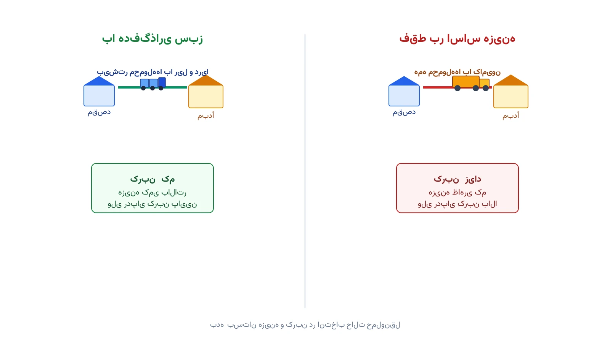

یک شرکت تولید لوازم خانگی در اروپا، هرماه هزاران محموله به مقصد مشتریان ارسال می‌کند. تا همین چند سال پیش، تنها سوال این بود: کامیون بفرستیم یا نه؟ امروز گزینه‌های بیشتری روی میز است. قطار باری، کشتی کانتینری و ترکیبی از این دو با کامیون، هرکدام مسیر متفاوتی پیشنهاد می‌دهند. هرکدام هم هزینه متفاوت دارد، هم زمان تحویل، و هم ردپای کربن.

این دقیقاً مسئله‌ی انتخاب حالت حمل‌ونقل سبز است؛ یا به انگلیسی Green Modal Choice Problem. سوال اصلی این نیست که کدام حالت به‌تنهایی بهتر است. سوال این است: برای هر محموله با مبدأ، مقصد، حجم و مهلت تحویل مشخص، کدام مسیر بهینه است؟ این مسئله دقیقاً جایی قرار می‌گیرد که بهینه‌سازی شبکه حمل‌ونقل با هدف‌گذاری زیست‌محیطی تلاقی می‌کند.

## فرمول‌بندی ریاضی مسئله

فرض کنید مجموعه محموله‌ها را با $K$ نشان دهیم. هر محموله $k$ حجمی به اندازه $q_k$ دارد و باید تا مهلت $\tau_k$ تحویل شود. برای هر محموله، چند مسیر کاندید وجود دارد. هر مسیر می‌تواند ترکیبی از جاده، ریل و دریا باشد؛ مثلاً کامیون تا بندر، سپس کشتی، سپس دوباره کامیون تا مقصد نهایی. مجموعه این مسیرهای کاندید برای محموله $k$ را با $P_k$ نشان می‌دهیم.

هر مسیر $p \in P_k$ سه ویژگی عددی دارد: هزینه $c_p$، زمان تحویل $t_p$ و میزان انتشار کربن $e_p$. متغیر تصمیم $x_p$ باینری است و نشان می‌دهد آیا مسیر $p$ برای محموله مربوطه انتخاب می‌شود. هدف مدل، کمینه‌کردن مجموع وزنی هزینه و انتشار کربن است:

$$
\min \sum_{k \in K} \sum_{p \in P_k} \left( c_p + \theta \, e_p \right) x_p
$$

در این فرمول، $\theta$ ضریبی است که اهمیت نسبی کربن نسبت به هزینه را تنظیم می‌کند. هر محموله باید دقیقاً روی یک مسیر فرستاده شود:

$$
\sum_{p \in P_k} x_p = 1 \qquad \forall k \in K
$$

مهلت تحویل هم باید رعایت شود:

$$
t_p \le \tau_k \qquad \forall k \in K,\ p \in P_k : x_p = 1
$$

یک قید مهم دیگر، ظرفیت محدود هر یال ریلی یا دریایی است. هر قطار یا کشتی، گنجایش مشخصی در هر هفته دارد. اگر $a$ یک یال ریلی یا دریایی و $Cap_a$ ظرفیت آن باشد، باید داشته باشیم:

$$
\sum_{k \in K} \sum_{p \in P_k : a \in p} q_k \, x_p \le Cap_a \qquad \forall a
$$

این قید باعث می‌شود مدل نتواند همه محموله‌ها را روی ارزان‌ترین یال ریلی بریزد. در عمل، وقتی ظرفیت ریل پر شود، بخشی از بار باید روی جاده یا دریا جابه‌جا شود.

## اهمیت این موضوع

این مسئله فقط یک تمرین دانشگاهی نیست. شرکتی مثل مرسک (Maersk)، یکی از بزرگ‌ترین شرکت‌های کشتیرانی کانتینری جهان، سال‌هاست روی ترکیب حمل دریایی و ریلی سرمایه‌گذاری می‌کند. هدف این نوع سرمایه‌گذاری، کاهش وابستگی به جاده برای مسیرهای طولانی است. کامیون در ازای هر تن-کیلومتر، معمولاً کربن بیشتری نسبت به قطار یا کشتی منتشر می‌کند.

مقررات اتحادیه اروپا درباره کاهش انتشار حمل‌ونقل، فشار بیشتری هم به این سمت وارد کرده است. بسیاری از خرده‌فروشی‌های بزرگ هم از تأمین‌کنندگان خود گزارش کربن زنجیره تأمین می‌خواهند. برای چنین شرکت‌هایی، انتخاب حالت حمل‌ونقل دیگر یک تصمیم ساده نیست. باید همزمان هزینه، زمان تحویل و کربن را در کنار هم دید. این دقیقاً جایی است که یک مدل بهینه‌سازی چندهدفه کمک می‌کند. رویکرد [تکنیک اپسیلون-محدودیت](/notes/epsilon-constraint-bi-objective/) ابزاری مناسب برای رسم این مصالحه هزینه-کربن است.

## ظرفیت کار آکادمیک و پژوهشی

انتخاب حالت حمل‌ونقل سبز، حوزه‌ای فعال و رو به رشد در پژوهش عملیاتی است. یک مسیر پژوهشی، مقایسه رویکردهای قطعی و تصادفی برای عدم‌قطعیت زمان سفر است. زمان حرکت کشتی یا قطار، برخلاف کامیون، معمولاً ثابت‌تر است اما همیشه قابل پیش‌بینی نیست.

مسیر دوم، گسترش مدل به حالت چندکالایی و چنددوره‌ای است. مسیر سوم، ترکیب انتخاب حالت حمل‌ونقل با مکان‌یابی هاب‌های انتقال بار است. این پرسش شباهت زیادی به مسئله کلاسیک [مکان‌یابی تسهیلات](/notes/facility-location-problem/) دارد. تنها تفاوت، یک لایه تصمیم اضافه است: انتخاب حالت حمل‌ونقل بین هر جفت هاب. مسیر چهارم، مدل‌سازی رفتار استراتژیک شرکت‌های حمل‌ونقل ریلی و دریایی در تعیین قیمت است. هرکدام از این مسیرها، ظرفیت خوبی برای پایان‌نامه یا مقاله علمی دارند.



## پیاده‌سازی با پایتون

خبر خوب این است که این مدل را می‌توان کاملاً با ابزارهای متن‌باز پایتون حل کرد. چون ساختار مسئله یک برنامه‌ریزی عدد صحیح با متغیرهای باینری است، کتابخانه [PuLP](https://coin-or.github.io/pulp/) یا [Pyomo](http://www.pyomo.org/) گزینه مناسبی است. سالورهای رایگان مثل [CBC](https://github.com/coin-or/Cbc) یا [HiGHS](https://highs.dev/) برای مسائل با چند صد محموله و مسیر کاندید، به‌خوبی عمل می‌کنند. برای مسائلی که ساختار شبکه‌ای پررنگ‌تری دارند، کتابخانه [NetworkX](https://networkx.org/) هم می‌تواند برای تولید مسیرهای کاندید هر محموله کمک کند.

داده‌های ورودی معمولاً شامل فهرست محموله‌ها، حجم و مهلت هرکدام، و فهرست مسیرهای کاندید با هزینه، زمان و انتشار هر مسیر است. این داده‌ها را می‌توان از یک فایل اکسل یا CSV ساده خواند. کد زیر یک نسخه ساده‌شده با سه محموله و چند مسیر کاندید را با PuLP حل می‌کند:

```python
import pulp

shipments = ["S1", "S2", "S3"]
routes = {
    "S1": [("road", 1200, 2.0, 0.9), ("rail", 850, 3.5, 0.3), ("sea", 600, 6.0, 0.15)],
    "S2": [("road", 900, 1.5, 0.7), ("rail", 650, 3.0, 0.25)],
    "S3": [("road", 1500, 2.5, 1.1), ("sea", 800, 7.0, 0.2)],
}
deadline = {"S1": 5.0, "S2": 4.0, "S3": 8.0}
theta = 200  # وزن نسبی کربن در برابر هزینه

model = pulp.LpProblem("green_modal_choice", pulp.LpMinimize)
x = {(k, i): pulp.LpVariable(f"x_{k}_{i}", cat="Binary")
     for k in shipments for i in range(len(routes[k]))}

cost_terms = []
for k in shipments:
    valid = [i for i, (mode, cost, time, emis) in enumerate(routes[k]) if time <= deadline[k]]
    model += pulp.lpSum(x[(k, i)] for i in valid) == 1
    for i in valid:
        mode, cost, time, emis = routes[k][i]
        cost_terms.append((cost + theta * emis) * x[(k, i)])

model += pulp.lpSum(cost_terms)
model.solve(pulp.PULP_CBC_CMD(msg=False))

for k in shipments:
    for i, (mode, cost, time, emis) in enumerate(routes[k]):
        if x[(k, i)].value() == 1:
            print(f"محموله {k}: حالت {mode}, هزینه {cost}, انتشار {emis}")
```

اگر سالور نتوانست جوابی برای یک محموله پیدا کند، معمولاً یعنی هیچ مسیر کاندیدی مهلت تحویل را رعایت نمی‌کند. در این حالت باید یا مهلت تحویل با مشتری بازبینی شود، یا مسیرهای تندتر و گران‌تر هم به فهرست کاندید اضافه شوند. دوره [مسیریابی وسایل نقلیه با پایتون](/courses/vrp-python/) پایه خوبی برای یادگیری این نوع مدل‌های شبکه‌ای و تخصیص است.

## سوالات متداول

<h3>آیا این مدل فقط برای شرکت‌های حمل‌ونقل بزرگ کاربرد دارد؟</h3>
<p>نه. هر شرکتی که به‌طور منظم محموله بین چند مبدأ و مقصد ارسال می‌کند، می‌تواند از این مدل استفاده کند. حتی با چند مسیر کاندید ساده، تصمیم‌گیری شفاف‌تر می‌شود.</p>

<h3>این نوع مدل‌های حمل‌ونقل و زنجیره تأمین را کجا می‌توان پروژه‌محور یاد گرفت؟</h3>
<p>دوره <a href="/courses/vrp-python/" style="color:#2563EB; font-weight:bold;">مسیریابی وسایل نقلیه با پایتون</a> پایه مدل‌سازی و حل مسائل شبکه حمل‌ونقل و زنجیره تأمین را با ابزارهای متن‌باز پایتون پوشش می‌دهد.</p>

<h3>برای پیاده‌سازی این مدل روی شبکه واقعی شرکت خودمان چه باید کرد؟</h3>
<p>تعداد مسیرهای کاندید، ظرفیت هر یال و ضریب انتشار هرکدام باید با داده واقعی شرکت تنظیم شود. از طریق <a href="/consultation/" style="color:#2563EB; font-weight:bold;">مشاوره</a> می‌توانیم جزئیات پروژه شما را بررسی کنیم.</p>
