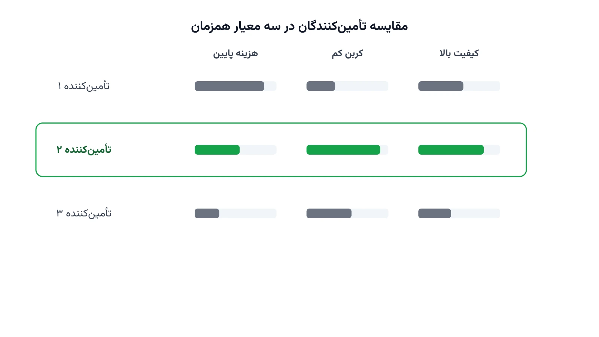

یک شرکت تولیدی بزرگ معمولاً برای هر قطعه چند تأمین‌کننده بالقوه دارد. تفاوت این تأمین‌کنندگان فقط در قیمت نیست. یکی شاید ارزان‌تر باشد ولی کیفیت پایین‌تری بدهد. دیگری گران‌تر است اما ردپای کربنی بسیار کمتری دارد. سوم شاید کیفیت عالی داشته باشد ولی ظرفیت تحویلش محدود باشد.

تا چند سال پیش، پاسخ ساده بود: ارزان‌ترین گزینه را انتخاب کن. اما امروز قوانین محیط‌زیستی و گزارش‌دهی کربن این معادله را پیچیده‌تر کرده‌اند. بسیاری از برندهای بزرگ اکنون باید ردپای کربن زنجیره تأمین خود را هم گزارش کنند. این یعنی انتخاب تأمین‌کننده دیگر یک تصمیم تک‌بعدی نیست. این دقیقاً همان‌جایی است که «انتخاب تأمین‌کننده سبز و تخصیص سفارش» وارد میدان می‌شود.

### تفاوت این مسئله با انتخاب تأمین‌کننده کلاسیک

مدل‌های کلاسیک انتخاب تأمین‌کننده معمولاً فقط هزینه و کیفیت را می‌بینند. هدف ساده است: کدام ترکیب از تأمین‌کنندگان، ارزان‌ترین و باکیفیت‌ترین سفارش را تضمین می‌کند. مدل سبز یک لایه دیگر هم اضافه می‌کند: ردپای کربن هر واحد کالای خریداری‌شده. این ردپا شامل تولید، بسته‌بندی و حمل کالا تا کارخانه خریدار است. در عمل، این یعنی مسئله از یک بهینه‌سازی تک‌هدفه به یک مسئله چندهدفه تبدیل می‌شود.

نکته مهم این است که این سه معیار اغلب با هم در تضادند. تأمین‌کننده‌ای که کربن کمتری دارد، ممکن است گران‌تر باشد یا ظرفیت کمتری داشته باشد. مدل ریاضی باید این مصالحه را به‌جای قضاوت شهودی مدیر خرید، به‌صورت کمّی حل کند.

### فرمول‌بندی ریاضی

فرض کنید مجموعه تأمین‌کنندگان کاندید را با $S$ نشان می‌دهیم. تقاضای کل شرکت برای این قطعه در دوره برنامه‌ریزی برابر $D$ است. هر تأمین‌کننده $s$ ظرفیت عرضه $Q_s$، هزینه واحد $c_s$، ضریب انتشار کربن $e_s$ و امتیاز کیفیت/ESG برابر $q_s$ دارد. متغیر تصمیم $x_s \ge 0$ مقدار سفارش تخصیص‌یافته به تأمین‌کننده $s$ است. متغیر باینری $y_s$ نشان می‌دهد آیا تأمین‌کننده $s$ اصلاً انتخاب می‌شود یا نه.

تابع هدف اصلی، کمینه‌کردن هزینه کل خرید به‌علاوه هزینه ضمنی کربن است:

$$
\min \; \sum_{s \in S} \left( c_s + p \, e_s \right) x_s
$$

که در آن $p$ قیمت فرضی هر واحد کربن (Carbon Shadow Price) است. تقاضای کل باید کامل تأمین شود:

$$
\sum_{s \in S} x_s = D
$$

سفارش هر تأمین‌کننده فقط زمانی مجاز است که آن تأمین‌کننده انتخاب شده باشد، و از ظرفیتش هم بیشتر نمی‌شود:

$$
0 \le x_s \le Q_s \, y_s \qquad \forall s \in S
$$

میانگین وزن‌دار امتیاز کیفیت کل سفارش هم نباید از یک آستانه پایین‌تر بیفتد:

$$
\sum_{s \in S} q_s x_s \ge \theta \, D
$$

که $\theta$ حداقل میانگین امتیاز کیفیت قابل‌قبول برای کل سفارش است. به‌جای وارد‌کردن کربن در تابع هدف با قیمت $p$، می‌توان یک سقف مطلق هم برایش گذاشت:

$$
\sum_{s \in S} e_s x_s \le E_{max}
$$

این ایده همان [تکنیک اپسیلون-محدود](/notes/epsilon-constraint-bi-objective/) است که برای مسائل دوهدفه به کار می‌رود. با حل مدل برای چند مقدار مختلف $E_{max}$، می‌توان منحنی مبادله هزینه-انتشار را رسم کرد. این منحنی نشان می‌دهد کاهش هر واحد کربن چقدر هزینه دارد.



### اهمیت این موضوع در دنیای واقعی

فشار برای انتخاب تأمین‌کننده سبز دیگر یک دغدغه صرفاً اخلاقی نیست. بسیاری از مقررات جدید اتحادیه اروپا، شرکت‌ها را ملزم به گزارش انتشار کربن زنجیره تأمین می‌کنند. این گزارش‌دهی شامل انتشار غیرمستقیم ناشی از تأمین‌کنندگان هم می‌شود، نه فقط کارخانه خود شرکت. شرکتی مثل یونیلیور (Unilever) سال‌هاست از تأمین‌کنندگان خود امتیاز پایداری و گزارش کربن می‌خواهد. این امتیاز مستقیماً در تصمیم تخصیص سفارش این شرکت به تأمین‌کنندگان مختلف اثر می‌گذارد.

از منظر اقتصادی هم، مشتریان بزرگ خرده‌فروشی از برندها گزارش کربن محصول نهایی می‌خواهند. برندی که نتواند این گزارش را ارائه دهد، ممکن است از فهرست تأمین‌کنندگان مورد تأیید حذف شود. در چنین فضایی، مدل تخصیص سفارش که هم‌زمان هزینه، کیفیت و کربن را می‌بیند، یک مزیت رقابتی واقعی است. شرکتی که این تصمیم را با داده و مدل ریاضی بگیرد، به‌جای حدس مدیر خرید، ریسک آینده را هم کاهش می‌دهد.

### ظرفیت کار آکادمیک و پژوهشی

انتخاب تأمین‌کننده سبز و تخصیص سفارش یکی از پرمقاله‌ترین موضوعات تحقیق در عملیات دهه اخیر است. بخش زیادی از این ادبیات، روش‌های تصمیم‌گیری چندمعیاره مثل AHP یا TOPSIS را با برنامه‌ریزی ریاضی ترکیب می‌کند. ابتدا امتیاز کیفی هر تأمین‌کننده با روش‌های چندمعیاره محاسبه می‌شود. سپس این امتیاز وارد مدل تخصیص سفارش می‌شود. این ترکیب دو مرحله‌ای، یکی از رایج‌ترین چارچوب‌های پژوهشی این حوزه است.

مسیر پژوهشی دیگر، ترکیب سبزبودن با تاب‌آوری در برابر اختلال تأمین‌کننده است. در دنیای واقعی، تأمین‌کننده‌ای که کربن کمی دارد، ممکن است ریسک تحویل بالایی هم داشته باشد. مدلی که هم‌زمان کربن، هزینه و ریسک اختلال را ببیند، هنوز جای کار پژوهشی زیادی دارد. جهت سوم، عدم‌قطعیت در امتیاز ESG و ضریب انتشار هر تأمین‌کننده است. این امتیازها معمولاً بر پایه خوداظهاری یا ممیزی‌های محدود ساخته می‌شوند و دقیق نیستند. بهینه‌سازی استوار یا فازی برای این نوع عدم‌قطعیت، زمینه خوبی برای پایان‌نامه است.

### پیاده‌سازی با پایتون

خبر خوب این است که این مدل هم یک برنامه‌ریزی عدد صحیح مختلط ساده است. برای حل آن نیازی به سالورهای تجاری گران‌قیمت نیست. کتابخانه متن‌باز [PuLP](https://coin-or.github.io/pulp/) برای نوشتن مدل و سالورهای رایگان مثل [CBC](https://github.com/coin-or/Cbc) یا [HiGHS](https://highs.dev/) برای حل آن کاملاً کافی است. برای مسائل با تعداد زیاد تأمین‌کننده و چند سناریوی کربن، [OR-Tools](https://developers.google.com/optimization) هم گزینه مناسبی است.

داده‌های ورودی معمولاً از یک فایل CSV خوانده می‌شوند. این فایل برای هر تأمین‌کننده، هزینه واحد، ظرفیت، ضریب انتشار کربن و امتیاز کیفیت را نگه می‌دارد. کد زیر یک نسخه ساده‌شده با سه تأمین‌کننده را با PuLP حل می‌کند:

```python
import pulp

suppliers = ["S1", "S2", "S3"]
capacity = {"S1": 400, "S2": 500, "S3": 300}
unit_cost = {"S1": 8, "S2": 11, "S3": 9}
emission = {"S1": 3.2, "S2": 1.1, "S3": 2.4}    # کیلوگرم CO2 به ازای هر واحد
quality = {"S1": 0.72, "S2": 0.93, "S3": 0.68}  # امتیاز کیفیت/ESG بین صفر و یک

demand = 700
carbon_price = 25      # هزینه فرضی هر کیلوگرم کربن
min_quality = 0.80     # حداقل میانگین امتیاز کیفیت قابل‌قبول سفارش

model = pulp.LpProblem("green_supplier_selection", pulp.LpMinimize)

x = {s: pulp.LpVariable(f"x_{s}", lowBound=0) for s in suppliers}
y = {s: pulp.LpVariable(f"y_{s}", cat="Binary") for s in suppliers}

model += pulp.lpSum((unit_cost[s] + carbon_price * emission[s]) * x[s] for s in suppliers)

model += pulp.lpSum(x[s] for s in suppliers) == demand

for s in suppliers:
    model += x[s] <= capacity[s] * y[s]

model += pulp.lpSum(quality[s] * x[s] for s in suppliers) >= min_quality * demand

model.solve(pulp.PULP_CBC_CMD(msg=False))

for s in suppliers:
    if x[s].value() and x[s].value() > 0:
        print(f"تأمین‌کننده {s}: {x[s].value()} واحد سفارش")
```

اگر مدل جوابی برنگرداند، معمولاً یعنی حداقل امتیاز کیفیت با ظرفیت تأمین‌کنندگان ارزان سازگار نیست. در این حالت باید یا آستانه کیفیت را بازبینی کرد یا تأمین‌کننده جدیدی به فهرست اضافه کرد. با تغییر `carbon_price`، می‌توان دید چطور تخصیص بهینه بین تأمین‌کنندگان با افزایش اهمیت کربن جابه‌جا می‌شود. دوره [مسیریابی وسایل نقلیه با پایتون](/courses/vrp-python/) پایه‌ی خوبی برای گسترش این مدل به شبکه‌های تأمین بزرگ‌تر است.

### سوالات متداول

<h3>چرا نمی‌شود فقط ارزان‌ترین تأمین‌کننده را انتخاب کرد؟</h3>
<p>چون در بسیاری از صنایع، ارزان‌ترین گزینه اغلب بیشترین ردپای کربن یا پایین‌ترین امتیاز کیفیت را دارد. مدل تخصیص سفارش این سه معیار را هم‌زمان می‌بیند، به‌جای این‌که فقط به قیمت واحد نگاه کند.</p>

<h3>این نوع مسائل انتخاب تأمین‌کننده و زنجیره تأمین را کجا می‌توان پروژه‌محور یاد گرفت؟</h3>
<p>دوره <a href="/courses/vrp-python/" style="color:#2563EB; font-weight:bold;">مسیریابی وسایل نقلیه با پایتون</a> مدل‌سازی و حل مسائل تخصیص و شبکه زنجیره تأمین را با ابزارهای متن‌باز پایتون پوشش می‌دهد.</p>

<h3>آیا این مدل برای شرکت‌های متوسط هم قابل استفاده است؟</h3>
<p>بله، چون PuLP و CBC رایگان و متن‌باز هستند. حتی یک شرکت متوسط با چند تأمین‌کننده هم می‌تواند بدون هزینه لایسنس از این مدل استفاده کند. این مدل هزینه، کیفیت و کربن را هم‌زمان در تصمیم خرید لحاظ می‌کند. برای پیاده‌سازی این مدل روی داده واقعی زنجیره تأمین شرکت خودتان می‌توانید از طریق صفحه <a href="/consultation/" style="color:#2563EB; font-weight:bold;">مشاوره</a> با ما در ارتباط باشید.</p>
