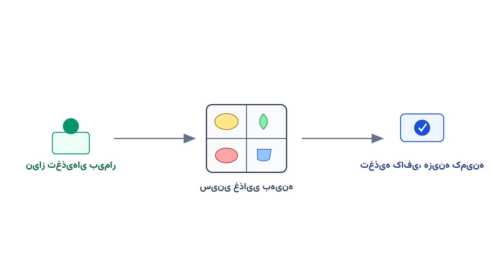

مدیر تغذیه‌ی یک بیمارستان بزرگ را تصور کنید. هر روز باید منوی چند وعده غذایی برای صدها بیمار طراحی شود. برخی بیماران رژیم دیابتی دارند، برخی کم‌نمک و برخی نیاز به کالری بالا دارند. هر رژیم، کف و سقف مشخصی برای کالری، پروتئین، سدیم و سایر مواد مغذی دارد. بودجه‌ی روزانه هم محدود است و نمی‌توان آن را نادیده گرفت.

این دقیقاً همان مسئله‌ای است که با نام «مسئله رژیم غذایی» یا Diet Problem در تاریخ بهینه‌سازی شناخته می‌شود. نسخه‌ی کلاسیک آن ساده بود؛ فقط هزینه را کمینه می‌کرد. نسخه‌ی بیمارستانی آن اما چندبعدی‌تر است. باید هم‌زمان چند نوع رژیم درمانی، چند روز برنامه‌ریزی و قید تنوع غذایی را با هم دید.

### چرا نسخه‌ی بیمارستانی این مسئله فرق دارد؟

مسئله‌ی رژیم غذایی کلاسیک را جرج استیگلر (George Stigler) در دهه‌ی ۱۹۴۰ برای ارتش آمریکا مطرح کرد. هدف او پیدا کردن ارزان‌ترین ترکیب غذایی بود که نیازهای مغذی سربازان را برآورده کند. آن مدل یک نوع رژیم را برای یک نفر بهینه می‌کرد. نسخه‌ی بیمارستانی امروز باید چند رژیم درمانی متفاوت را هم‌زمان و برای چند روز پشت سر هم طراحی کند.

تفاوت دوم، قید تنوع غذایی است. مدل کلاسیک ممکن است هر روز فقط لوبیا و کلم پیشنهاد دهد، چون ارزان‌ترین گزینه است. بیمار واقعی چنین منویی را نمی‌خورد. مدل بیمارستانی باید تضمین کند که یک قلم غذا بیش از حد مشخصی در هفته تکرار نشود. تفاوت سوم هم ایمنی غذایی است؛ آلرژی‌ها و ممنوعیت‌های دارویی-غذایی باید به‌صورت قید سخت در مدل بیایند.

### فرمول‌بندی ریاضی

فرض کنید $F$ مجموعه‌ی اقلام غذایی، $D$ مجموعه‌ی روزهای افق برنامه‌ریزی و $K$ مجموعه‌ی انواع رژیم درمانی باشد. متغیر تصمیم $x_{f,d,k} \ge 0$ مقدار قلم غذایی $f$ در روز $d$ برای رژیم $k$ است. هزینه‌ی هر واحد از قلم غذایی $f$ را با $c_f$ نشان می‌دهیم.

هدف مدل، کمینه‌کردن هزینه‌ی کل تغذیه در کل افق برنامه‌ریزی است:

$$
\min \sum_{k \in K} \sum_{d \in D} \sum_{f \in F} c_f \, x_{f,d,k}
$$

هر ماده‌ی مغذی $n$ برای هر رژیم $k$ یک کف $L_{k,n}$ و یک سقف $U_{k,n}$ دارد. اگر $a_{f,n}$ مقدار ماده‌ی مغذی $n$ در هر واحد غذای $f$ باشد، این قید برقرار می‌ماند:

$$
L_{k,n} \le \sum_{f \in F} a_{f,n} \, x_{f,d,k} \le U_{k,n} \qquad \forall d \in D,\ k \in K,\ n
$$

بودجه‌ی روزانه‌ی هر رژیم هم یک قید جداگانه است:

$$
\sum_{f \in F} c_f \, x_{f,d,k} \le B_k \qquad \forall d \in D,\ k \in K
$$

برای جلوگیری از تکرار بیش‌ازحد یک غذا، می‌توان متغیر باینری $y_{f,d,k}$ اضافه کرد. این متغیر مصرف قلم $f$ در روز $d$ را نشان می‌دهد. سپس مجموع این متغیر روی یک بازه‌ی هفتگی محدود می‌شود. این افزونه، مدل را از یک برنامه‌ریزی خطی ساده به یک مدل عدد صحیح مختلط تبدیل می‌کند.

این شباهت به تاریخ مدل‌سازی ریاضی البته تصادفی نیست. مسئله‌ی رژیم غذایی یکی از نخستین کاربردهای عملی برنامه‌ریزی خطی در دهه‌ی ۱۹۴۰ بود. در یادداشت [هنر مدل‌سازی ریاضی](/notes/mathematical-modeling-art/) می‌توانید بیشتر درباره‌ی این نوع مدل‌های کلاسیک بخوانید.

### اهمیت این موضوع در دنیای واقعی

سوءتغذیه در بیمارستان یک مشکل بالینی جدی و مستند است. بیمارانی که تغذیه‌ی کافی دریافت نمی‌کنند، دیرتر بهبود می‌یابند و بیشتر در بیمارستان می‌مانند. از طرف دیگر، دورریز غذا در بیمارستان‌ها هم هزینه‌ی قابل‌توجهی دارد. بخش تغذیه باید بین این دو فشار، یعنی کیفیت درمانی و کنترل هزینه، تعادل برقرار کند.

شرکت‌های بزرگ خدمات غذایی مثل سودکسو (Sodexo) بخش بزرگی از کسب‌وکارشان را به تغذیه‌ی بیمارستانی اختصاص داده‌اند. چنین شرکت‌هایی باید هزاران رژیم شخصی‌سازی‌شده را در مقیاس بزرگ و با هزینه‌ی کنترل‌شده تحویل دهند. مدل بهینه‌سازی، ابزار طبیعی برای این نوع تصمیم‌گیری تکرارشونده است.

از منظر مدیریتی هم، یک مدل شفاف و قابل‌توضیح، اعتماد تیم بالینی را جلب می‌کند. متخصص تغذیه می‌تواند قیدهای بالینی را در مدل ببیند و اصلاح کند. این شفافیت، در حوزه‌ای که خطای تغذیه‌ای می‌تواند پیامد بالینی داشته باشد، اهمیت زیادی دارد.



### ظرفیت کار آکادمیک و پژوهشی

این حوزه، با وجود قدمت مسئله‌ی پایه، هنوز جای پژوهش فراوان دارد. یک مسیر رایج، بهینه‌سازی چندهدفه است. هزینه، تنوع غذایی و رضایت بیمار سه هدف اغلب متعارض هستند. تکنیک‌هایی مثل اپسیلون محدود یا برنامه‌ریزی آرمانی می‌توانند این تعارض را مدیریت کنند.

مسیر دوم، مدل‌سازی تصادفی تعداد و ترکیب بیماران است. تعداد بیماران هر نوع رژیم از روز به روز تغییر می‌کند و از قبل دقیق معلوم نیست. بهینه‌سازی استوار یا دومرحله‌ای می‌تواند این عدم‌قطعیت را پوشش دهد. مسیر سوم، پیوند این مدل با زنجیره تأمین مواد غذایی فسادپذیر بیمارستان است. کمبود یک قلم غذایی می‌تواند کل منوی هفتگی را تحت تأثیر قرار دهد.

مسیر چهارم هم جالب توجه است: تغذیه‌ی دقیق و شخصی‌سازی‌شده. داده‌های بالینی هر بیمار روزبه‌روز در دسترس‌تر می‌شوند. مدل می‌تواند رژیم را نه فقط بر اساس دسته‌بندی کلی بیماری، بلکه بر اساس وضعیت فردی هر بیمار تنظیم کند.

### پیاده‌سازی با پایتون

خبر خوب این است که این مدل هیچ نیازی به نرم‌افزار تجاری گران‌قیمت ندارد. این حکم چه در حالت برنامه‌ریزی خطی ساده و چه با متغیرهای باینری تنوع، برقرار است. کتابخانه‌ی متن‌باز [PuLP](https://coin-or.github.io/pulp/) به همراه سالورهایی مثل [CBC](https://github.com/coin-or/Cbc)، [HiGHS](https://highs.dev/) یا [GLPK](https://www.gnu.org/software/glpk/) برای این ساختار کاملاً کافی است. برای مدل‌های بزرگ‌تر با چند بیمارستان یا چند بخش، [Pyomo](http://www.pyomo.org/) هم انعطاف بیشتری در مدیریت مجموعه‌های تودرتو می‌دهد.

داده‌های ورودی را می‌توان از یک فایل اکسل یا CSV خواند. این فایل نام اقلام غذایی، هزینه هر واحد و ترکیب مواد مغذی هر قلم را در بر می‌گیرد. کد زیر یک نسخه‌ی ساده‌شده با چند قلم غذایی و یک رژیم را با PuLP حل می‌کند:

```python
import pulp

foods = ["rice", "chicken", "lentil", "yogurt"]
cost = {"rice": 8, "chicken": 35, "lentil": 12, "yogurt": 10}
calorie = {"rice": 130, "chicken": 165, "lentil": 116, "yogurt": 60}
protein = {"rice": 2.7, "chicken": 31, "lentil": 9, "yogurt": 3.5}
sodium = {"rice": 1, "chicken": 74, "lentil": 2, "yogurt": 45}

model = pulp.LpProblem("hospital_diet", pulp.LpMinimize)
x = pulp.LpVariable.dicts("x", foods, lowBound=0, upBound=6)

model += pulp.lpSum(cost[f] * x[f] for f in foods)

model += pulp.lpSum(calorie[f] * x[f] for f in foods) >= 550
model += pulp.lpSum(protein[f] * x[f] for f in foods) >= 25
model += pulp.lpSum(sodium[f] * x[f] for f in foods) <= 400

model.solve(pulp.PULP_CBC_CMD(msg=False))

for f in foods:
    print(f"{f}: {x[f].value()} واحد")
print("هزینه کل وعده:", pulp.value(model.objective))
```

اگر سالور جواب موجه پیدا نکند، معمولاً یعنی سقف سدیم یا بودجه با کف کالری و پروتئین ناسازگار است. در این حالت باید با متخصص تغذیه، یکی از این کف‌وسقف‌ها را بازبینی کرد. برای آشنایی با نحوه‌ی نصب و پیکربندی سالورهای مختلف در پایتون، یادداشت [تنظیم سالورها در پایتون](/notes/pyomo-solvers/) هم می‌تواند مفید باشد. دوره [بهینه‌سازی سیستم‌های سلامت با پایتون](/courses/health-opt/) این مسئله را در کنار نوزده مسئله دیگر حوزه سلامت پوشش می‌دهد. رویکرد آن پروژه‌محور و مبتنی بر CP-SAT و OR-Tools است.

### سوالات متداول

<h3>آیا این مدل همان مسئله‌ی کلاسیک رژیم غذایی است؟</h3>
<p>ریشه‌ی ریاضی مشابه است اما نسخه‌ی بیمارستانی چند رژیم درمانی، چند روز و قید تنوع غذایی را هم‌زمان اضافه می‌کند. این تفاوت‌ها مدل را از حالت درسی به یک ابزار عملیاتی واقعی نزدیک می‌کند.</p>

<h3>برای یادگیری پروژه‌محور این نوع مسائل بهینه‌سازی در حوزه سلامت از کجا شروع کنیم؟</h3>
<p>دوره <a href="/courses/health-opt/" style="color:#2563EB; font-weight:bold;">بهینه‌سازی سیستم‌های سلامت با پایتون</a> دقیقاً بیست زیرموضوع از این جنس را با ابزارهای متن‌باز پوشش می‌دهد.</p>

<h3>برای پیاده‌سازی این مدل روی داده‌های واقعی بیمارستان خودمان چه باید کرد؟</h3>
<p>ترکیب غذایی، قیمت‌های محلی و پروتکل‌های بالینی در هر بیمارستان متفاوت است. از طریق <a href="/consultation/" style="color:#2563EB; font-weight:bold;">مشاوره</a> می‌توانید جزئیات داده و رژیم‌های موردنیاز را مطرح کنید.</p>
