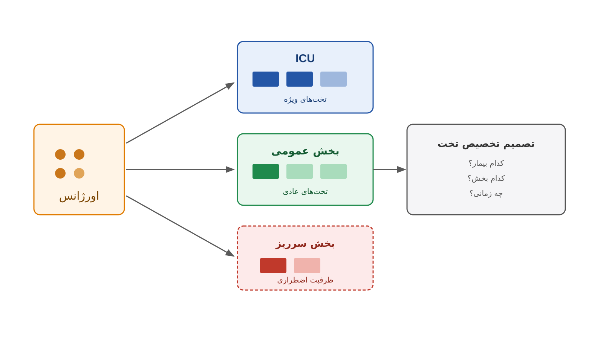

فرض کنید مدیر تخت یک بیمارستان بزرگ هستید. ساعت هشت شب است. اورژانس پر از بیمار جدید است و بخش عمومی تقریباً تکمیل ظرفیت شده است. تلفن هم مدام زنگ می‌زند. پزشک اورژانس می‌گوید یک بیمار قلبی نیاز به بستری فوری دارد. سرپرستار بخش داخلی می‌گوید دو تخت خالی دارد، ولی یکی از آن‌ها باید برای بیمار پس از عمل جراحی نگه داشته شود. مسئول ICU هم اعلام می‌کند ظرفیتشان تکمیل است، مگر اینکه یکی از بیماران فعلی به بخش عادی منتقل شود.

شما باید همین الان تصمیم بگیرید. کدام بیمار به کدام بخش برود؟ کدام بیمار باید منتظر بماند؟ اگر همه بخش‌ها پر شدند چه باید کرد؟ آیا بیمار را به بیمارستان دیگری منتقل کنید یا در همان اورژانس نگه دارید تا تخت خالی شود؟ این دقیقاً همان چیزی است که در ادبیات پژوهش در عملیات سلامت به آن مدیریت جریان بیمار و تخصیص ظرفیت تخت می‌گویند. به انگلیسی این مفهوم را Patient Flow and Bed Allocation می‌نامند. این مسئله برخلاف بسیاری از مسائل زمان‌بندی کلاسیک است؛ هر ساعت و هر شب در هر بیمارستان دنیا به‌صورت زنده در حال رخ‌دادن است.

آنچه این مسئله را جالب و در عین حال دشوار می‌کند، ترکیب چند لایه از عدم‌قطعیت و محدودیت هم‌زمان است. تعداد بیمارانی که فردا به اورژانس مراجعه می‌کنند از قبل دقیقاً معلوم نیست. مدت اقامت هر بیمار در هر بخش هم متغیر و تصادفی است. ظرفیت هر بخش هم ثابت نیست، چون گاهی به دلیل کمبود پرستار یا تعمیرات، تعدادی از تخت‌ها موقتاً از مدار خارج می‌شوند.

وقتی این عدم‌قطعیت‌ها را کنار قوانین بالینی می‌گذاریم، مثلاً اینکه فلان نوع بیمار حتماً باید در ICU بستری شود، و کنار قوانین اداری مثل محدودیت تعداد بیماران هر پرستار، به یک مسئله بهینه‌سازی چندبعدی می‌رسیم. تصمیم غلط در این مسئله مستقیماً روی کیفیت درمان و حتی جان بیمار اثر می‌گذارد؛ نه فقط روی یک شاخص هزینه در گزارش مالی.

### اهمیت این موضوع

پرشدن ظرفیت بیمارستان و طولانی‌شدن زمان انتظار بیمار در اورژانس تا رسیدن به تخت بخش، پدیده‌ای است که در ادبیات پزشکی به آن Emergency Department Boarding می‌گویند. این پدیده یکی از شاخص‌های اصلی کیفیت مراقبت در هر نظام سلامت است. تحقیقات نشان داده‌اند هر ساعت اضافی که یک بیمار در اورژانس منتظر تخت بماند، احتمال بروز عوارض ناخواسته و حتی مرگ‌ومیر را افزایش می‌دهد. از طرف دیگر، خالی‌ماندن تخت‌ها به دلیل تخصیص ناکارآمد به معنای هدررفت یکی از گران‌ترین منابع بیمارستان است.

به همین دلیل، بسیاری از شبکه‌های درمانی بزرگ دنیا سال‌هاست روی این موضوع سرمایه‌گذاری می‌کنند. مراکزی مثل کلینیک کلیولند (Cleveland Clinic) در آمریکا یا شبکه NHS در بریتانیا نمونه‌های شناخته‌شده‌ای هستند. آن‌ها روی سامانه‌های به‌اصطلاح Bed Management و Capacity Command Center سرمایه‌گذاری می‌کنند تا با پیش‌بینی تقاضا و بهینه‌سازی تخصیص تخت، هم زمان انتظار بیمار را کاهش دهند و هم از انتقال‌های اضطراری و پرهزینه بین بیمارستانی جلوگیری کنند. اگر علاقه‌مند به یادگیری اصول این نوع مدل‌سازی هستید، دوره [بهینه‌سازی سیستم‌های سلامت با پایتون](/courses/health-opt/) نقطه شروع مناسبی است. در کشورهایی که نظام سلامت با کمبود مزمن تخت روبه‌روست، به‌ویژه در بخش‌های ویژه، حتی چند درصد بهبود در بهره‌وری تخصیص تخت می‌تواند معادل ساخت چند بخش جدید بدون هزینه ساخت‌وساز باشد.

### فرمول‌بندی ریاضی مسئله

یک شکل ساده‌شده از این مسئله را می‌توان به‌صورت یک مدل تخصیص چندپریودی نوشت. فرض کنید $I$ مجموعه گروه‌های بیمار باشد، بر اساس نوع بیماری و بخش مورد نیاز. همچنین $t$ اندیس روز یا شیفت است، و $\ell_i$ میانگین طول اقامت گروه بیمار $i$ است.

متغیر تصمیم $a_{i,t}$ نشان‌دهنده تعداد بیمار از گروه $i$ است که در روز $t$ پذیرش می‌شود. همچنین $O_t$ تعداد بیمارانی است که به دلیل کمبود تخت باید در اورژانس بمانند، یا به بیمارستان دیگری منتقل شوند؛ یعنی سرریز. محدودیت اصلی مسئله، ظرفیت تخت هر بخش در هر روز است. این محدودیت باید اشغال ناشی از بیماران هنوز بستری‌شده‌ی روزهای قبل را هم در نظر بگیرد:

$$
\sum_{i \in I} \sum_{t'=\max(1,\, t-\ell_i+1)}^{t} a_{i,t'} \le C_t
$$

که در آن $C_t$ ظرفیت کل تخت‌های در دسترس در روز $t$ است. تقاضای هر گروه بیمار هم یک سقف بالایی برای پذیرش تعیین می‌کند:

$$
a_{i,t} \le d_{i,t} \quad \forall i, t
$$

و تابع هدف معمولاً ترکیبی از حداکثرکردن تعداد بیماران پذیرفته‌شده و حداقل‌کردن هزینه سرریز و انتظار است:

$$
\min \; \sum_{t} \Big( c^{O} O_t + \sum_{i} c_i^{W} \, q_{i,t} \Big)
$$

که در آن $q_{i,t}$ تعداد بیماران در انتظار از گروه $i$ در روز $t$ است. همچنین $c^{O}$ و $c_i^{W}$ به‌ترتیب هزینه سرریز و هزینه انتظار هستند.

در عمل، این مدل پایه معمولاً با محدودیت‌های اضافی تکمیل می‌شود. نمونه این محدودیت‌ها شامل الزام بالینی بستری در بخش خاص و محدودیت نسبت پرستار به بیمار است. امکان انتقال موقت بیمار سبک‌تر به بخش دیگر برای آزادکردن تخت هم می‌تواند اضافه شود. اغلب این مدل به‌صورت یک مدل برنامه‌ریزی تصادفی یا استوار بازنویسی می‌شود، تا عدم‌قطعیت تقاضای روزانه را هم پوشش دهد.

### ظرفیت کار آکادمیک و پژوهشی

مدیریت جریان بیمار و تخصیص ظرفیت تخت یکی از فعال‌ترین حوزه‌های پژوهش در عملیات سلامت در دنیاست. به دلیل ماهیت پویا و عدم‌قطعیت بالای آن، هنوز جای کار پژوهشی زیادی دارد. یک مسیر پژوهشی مهم، ترکیب پیش‌بینی تقاضا با تصمیم‌گیری بهینه‌سازی است؛ پیش‌بینی می‌تواند با مدل‌های سری زمانی یا یادگیری ماشین انجام شود. یعنی به‌جای فرض قطعی‌بودن تقاضای هر روز، از توزیع احتمال پیش‌بینی‌شده در مدل بهینه‌سازی استوار یا تصادفی استفاده می‌شود.

مسیر دیگر، مدل‌سازی هم‌زمان چند بخش به‌عنوان یک شبکه است، به‌جای مدل‌سازی واحدهای مستقل. مثلاً وقتی بیمار سبک‌تری از ICU به بخش عادی منتقل می‌شود تا تخت آزاد شود، این تصمیم روی کل زنجیره جریان بیمار در بیمارستان اثر می‌گذارد. مدل‌سازی این اثرات زنجیره‌ای خودش یک مسئله باز است.

همچنین موضوعاتی مانند عدالت در اولویت‌دهی بین بیماران با شرایط بالینی مشابه از زمینه‌های مناسب پژوهشی است. هماهنگی تخصیص تخت بین چند بیمارستان یک منطقه در زمان بحران، مثل اپیدمی یا حادثه گسترده، هم موضوع مهمی است. این‌ها زمینه‌های بسیار مناسبی برای پایان‌نامه کارشناسی ارشد یا دکتری در تحقیق در عملیات و مهندسی صنایع سلامت هستند.

### پیاده‌سازی با پایتون

خبر خوب این است که برای ساخت یک نمونه‌اولیه کاربردی از سیستم تخصیص تخت، نیازی به نرم‌افزار یا سالور تجاری گران‌قیمت نیست. کتابخانه متن‌باز [OR-Tools](https://developers.google.com/optimization) گوگل برای این کار بسیار مناسب است. به‌ویژه ماژول CP-SAT آن که برای برنامه‌ریزی محدودیت (Constraint Programming) طراحی شده، برای مدل‌سازی این مسئله کاربرد خوبی دارد؛ چون امکان تعریف محدودیت‌های ظرفیت زمانی، الزامات بالینی، و منابع محدود مثل پرستار، تخت و تجهیزات را به‌سادگی فراهم می‌کند.

برای بخش‌هایی از مسئله که ماهیت خطی‌تری دارند، مثل مدل تخصیص پایه‌ای که در بالا دیدیم، ابزار دیگری هم وجود دارد. می‌توان از [Pyomo](https://www.pyomo.org/) یا [PuLP](https://coin-or.github.io/pulp/) به همراه سالورهای متن‌باز مانند [CBC](https://github.com/coin-or/Cbc) یا [HiGHS](https://highs.dev/) استفاده کرد. داده‌های ورودی معمولاً شامل پیش‌بینی روزانه تقاضای هر گروه بیمار، ظرفیت هر بخش، و میانگین طول اقامت هستند. می‌توان آن‌ها را از یک فایل اکسل یا CSV خواند و مستقیماً به مدل بهینه‌سازی داد. نکته مهم این است که حتی یک بیمارستان کوچک با بودجه محدود هم می‌تواند یک داشبورد ساده تصمیم‌یاری بسازد. این کار با همین ابزارهای رایگان و متن‌باز پایتون ممکن است، بدون نیاز به لایسنس نرم‌افزارهای گران‌قیمت تجاری.

### سوالات متداول

<h3>آیا این نوع مدل‌سازی فقط برای بیمارستان‌های خیلی بزرگ کاربرد دارد؟</h3>

خیر؛ حتی یک بیمارستان یا کلینیک با چند بخش محدود هم می‌تواند از یک مدل ساده‌شده تخصیص تخت بهره‌مند شود. همان تعارض بین ظرفیت، تقاضا و اولویت بالینی در مقیاس کوچک‌تر هم وجود دارد. کاهش زمان انتظار بیمار مستقیماً روی کیفیت خدمت اثر می‌گذارد.

<h3>برای یادگیری مدل‌سازی این نوع مسائل بهینه‌سازی سلامت از کجا شروع کنم؟</h3>

اگر می‌خواهید مدل‌سازی و حل مسائل بهینه‌سازی حوزه سلامت را با ابزارهای متن‌باز پایتون مانند OR-Tools از پایه یاد بگیرید، دوره <a href="/courses/health-opt/" style="color:#2563EB; font-weight:bold;">بهینه‌سازی سیستم‌های سلامت با پایتون</a> نقطه شروع خوبی است.

<h3>اگر بیمارستان یا مرکز درمانی من نیاز به یک سیستم تخصیص تخت اختصاصی دارد چه کنم؟</h3>

هر مرکز درمانی قوانین بالینی و اداری خاص خودش را دارد و مدل‌سازی دقیق آن‌ها نیاز به بررسی موردی دارد. می‌توانید از طریق صفحه <a href="/consultation/" style="color:#2563EB; font-weight:bold;">مشاوره</a> جزئیات مسئله خودتان را در میان بگذارید.

