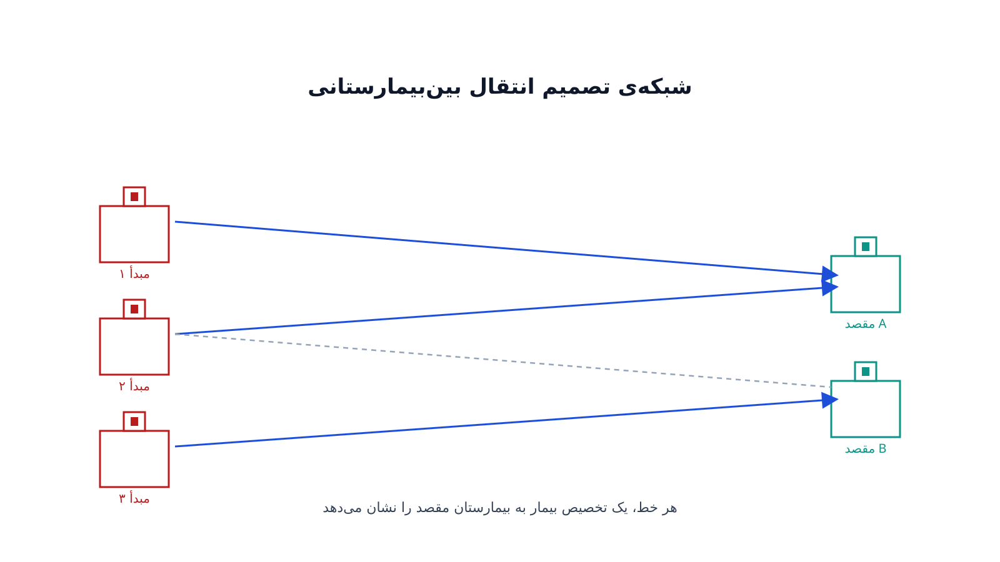

نیمه‌شب است و بخش اورژانس یک بیمارستان شهرستانی پر شده. یک بیمار نیاز به جراحی مغز و اعصاب فوری دارد. این بیمارستان نه متخصص مربوطه را دارد و نه اتاق عمل آماده. باید بیمار را به مرکزی دیگر منتقل کرد، اما کدام مرکز؟ نزدیک‌ترین بیمارستان شاید تخت خالی نداشته باشد. مرکز تخصصی بعدی هم شاید یک ساعت با آمبولانس فاصله داشته باشد. شاید هم‌زمان چند بیمار دیگر در بیمارستان‌های اطراف منتظر همین تصمیم باشند.

این دقیقاً مسئله‌ی «انتقال بین‌بیمارستانی» یا Interhospital Patient Transfer است. کنترل پذیرش تخت ICU درباره‌ی رد یا قبول بیمار در همان بیمارستان تصمیم می‌گیرد. اینجا اما سوال فرق دارد: از میان چند بیمارستان مقصد ممکن، کدام یک برای هر بیمار بهترین انتخاب است؟ این تصمیم باید هم‌زمان ظرفیت مقصد، تطبیق تخصص پزشکی، زمان انتقال و در دسترس‌بودن وسیله نقلیه را در نظر بگیرد.

### چرا این مسئله با تصمیمات مشابه فرق دارد؟

در نگاه اول، انتقال بین‌بیمارستانی شبیه اعزام آمبولانس یا کنترل پذیرش تخت به نظر می‌رسد. اما تفاوت اساسی دارد. اعزام آمبولانس درباره‌ی مکان‌یابی پایگاه‌هاست تا زمان پاسخ به حادثه کم شود. کنترل پذیرش درباره‌ی رد یا قبول در یک بیمارستان واحد است. انتقال بین‌بیمارستانی اما یک مسئله‌ی تخصیص چندبه‌چند است. چند بیمار در چند بیمارستان مبدأ داریم، و چند بیمارستان مقصد با ظرفیت و تخصص متفاوت.

پیچیدگی دیگر این است که تصمیم برای یک بیمار روی بیماران دیگر اثر می‌گذارد. اگر نزدیک‌ترین مرکز تخصصی را به یک بیمار بدهیم، شاید برای بیمار بعدی چیزی نماند. آن بیمار بعدی ممکن است وضعیت اورژانسی‌تری هم داشته باشد. به همین دلیل این مسئله را نمی‌توان بیمار به بیمار و جدا از هم حل کرد. باید همه‌ی درخواست‌های فعال را یک‌جا، به‌صورت یک مسئله‌ی تخصیص بهینه، دید.

### فرمول‌بندی ریاضی

فرض کنید مجموعه‌ی بیماران نیازمند انتقال $i \in I$ و مجموعه‌ی بیمارستان‌های مقصد $j \in J$ داریم. هر بیمار نیاز پزشکی مشخصی دارد که فقط زیرمجموعه‌ای از بیمارستان‌ها می‌توانند پاسخ دهند. این تطبیق با پارامتر $M_{ij} \in \{0,1\}$ نشان داده می‌شود. اگر بیمارستان $j$ تخصص لازم برای بیمار $i$ را داشته باشد، این پارامتر برابر یک است.

هر بیمارستان مقصد ظرفیت پذیرش $C_j$ دارد. زمان انتقال بیمار $i$ به بیمارستان $j$ برابر $T_{ij}$ است. هر بیمار هم وزن اورژانسی $w_i$ دارد؛ هرچه وضعیتش وخیم‌تر باشد، این وزن بزرگ‌تر است. متغیر تصمیم $x_{ij} \in \{0,1\}$ برابر یک است اگر بیمار $i$ به بیمارستان $j$ منتقل شود.

هدف مدل، کمینه‌کردن مجموع وزن‌دار زمان انتقال است. این‌طور بیماران وخیم‌تر اولویت رسیدن سریع‌تر پیدا می‌کنند:

$$
\min \sum_{i \in I} \sum_{j \in J} w_i \, T_{ij} \, x_{ij}
$$

با قید اینکه هر بیمار دقیقاً به یک مقصد منتقل شود:

$$
\sum_{j \in J} x_{ij} = 1 \qquad \forall i \in I
$$

با قید تطبیق تخصص، که تنها به مراکز واجد شرایط اجازه‌ی پذیرش می‌دهد:

$$
x_{ij} \le M_{ij} \qquad \forall i \in I,\ \forall j \in J
$$

و قید ظرفیت هر بیمارستان مقصد:

$$
\sum_{i \in I} x_{ij} \le C_j \qquad \forall j \in J
$$

اگر تعداد آمبولانس یا بالگرد در دسترس هم محدود باشد، یک قید دیگر لازم است. این قید روی مجموع انتقال‌های هم‌زمان در هر بازه‌ی زمانی اثر می‌گذارد. این نسخه‌ی ساده یک مسئله‌ی تخصیص تعمیم‌یافته (Generalized Assignment Problem) است. نسخه‌های واقعی‌تر معمولاً عدم‌قطعیت زمان سفر و ورود بیماران جدید حین حل را هم اضافه می‌کنند. این کار مدل را به یک تصمیم بازبینی‌شونده و پویا تبدیل می‌کند.

### اهمیت این موضوع در دنیای واقعی

هماهنگی انتقال بین‌بیمارستانی یک تصمیم روزمره و پرتکرار در هر سیستم سلامت است، نه یک سناریوی نادر. در مناطق روستایی، بیمارستان‌های کوچک به‌طور مداوم به مراکز تخصصی بزرگ‌تر وابسته‌اند. هر تأخیر در این تصمیم می‌تواند پیامد بالینی جدی داشته باشد. سازمان‌هایی مثل ADAC Luftrettung در آلمان، که ناوگان بالگرد امدادی بزرگی برای انتقال بین‌بیمارستانی اداره می‌کند، دقیقاً با همین چالش روبه‌رو هستند: کدام بیمار، با کدام وسیله، به کدام مرکز.

بسیاری از سیستم‌های سلامت بزرگ امروز مراکز فرماندهی متمرکزی راه‌اندازی کرده‌اند. این مراکز وضعیت تخت و تخصص همه‌ی بیمارستان‌های شبکه را همزمان می‌بینند. هدف آن‌ها دقیقاً همان چیزی است که مدل بالا حل می‌کند: تصمیم‌گیری هماهنگ، نه تصمیم جداگانه‌ی هر بیمارستان بدون دید کامل از ظرفیت بقیه. وقتی این هماهنگی نباشد، معمولاً بیمارستان‌های نزدیک‌تر بیش از حد پر می‌شوند. در همین حال، ظرفیت خالی در جای دیگری از شبکه هدر می‌رود.

از نگاه اقتصاد سلامت هم این مسئله اهمیت دارد. هر انتقال ناموفق یا دیرهنگام هزینه‌ی مضاعف دارد: هزینه‌ی حمل، بستری طولانی‌تر و ریسک بالینی افزایش‌یافته. مدل بهینه‌سازی می‌تواند این هزینه‌ها را به‌طور همزمان و شفاف در نظر بگیرد. این بهتر از آن است که تصمیم صرفاً به تجربه‌ی فردی هماهنگ‌کننده‌ی شیفت واگذار شود.

### ظرفیت کار آکادمیک و پژوهشی

این حوزه ظرفیت پژوهشی قابل‌توجهی دارد، به‌ویژه چون داده‌های واقعی سیستم‌های سلامت به‌تدریج در دسترس پژوهشگران قرار می‌گیرد. یک مسیر پژوهشی، گسترش مدل تخصیص ایستا به یک مدل پویا و آنلاین است. این مدل با ورود بیماران جدید، تصمیم قبلی را بازبینی می‌کند؛ مشابه مسائل تخصیص آنلاین در نظریه‌ی الگوریتم. مسیر دیگر، مدل‌سازی عدم‌قطعیت در زمان سفر و ظرفیت آینده با بهینه‌سازی تصادفی یا مقاوم است.

جهت سوم، ترکیب این مسئله با عدالت در دسترسی به خدمات سلامت است. یعنی اطمینان از اینکه بیماران مناطق کم‌برخوردار انتقال‌های طولانی‌تر یا کندتر دریافت نمی‌کنند. این تقاطع بهینه‌سازی و عدالت سلامت هنوز مقالات نسبتاً کمی دارد. این موضوع فضای باز زیادی برای کار تازه فراهم می‌کند. مسیر چهارم هم استفاده از یادگیری ماشین برای پیش‌بینی زمان واقعی سفر و ترکیب آن با مدل بهینه‌سازی است.

### پیاده‌سازی با پایتون

خبر خوب این است که این مدل تخصیص را می‌توان بدون هیچ نرم‌افزار تجاری گران‌قیمتی پیاده‌سازی کرد. چون متغیرها دودویی هستند و قیدها ساختار منطقی روشنی دارند، [OR-Tools](https://developers.google.com/optimization) گوگل گزینه‌ی طبیعی است، به‌ویژه ماژول CP-SAT آن. برای مقیاس‌های بزرگ‌تر با هزاران بیمار و بیمارستان، سالورهای متن‌باز مثل [CBC](https://github.com/coin-or/Cbc) یا [HiGHS](https://highs.dev/) هم مناسب‌اند. این سالورها معمولاً از طریق [PuLP](https://coin-or.github.io/pulp/) فراخوانی می‌شوند و این مسئله‌ی تخصیص را در زمان کوتاه حل می‌کنند.

داده‌های ورودی معمولاً از یک فایل CSV خوانده می‌شوند. این فایل شامل ستون‌های بیمار، بیمارستان مبدأ، نوع نیاز پزشکی، زمان تخمینی انتقال به هر مقصد و ظرفیت فعلی هر بیمارستان است. پس از حل مدل، خروجی را می‌توان به‌صورت یک جدول تخصیص ساده به هماهنگ‌کننده‌ی انتقال نمایش داد. برای تحلیل و تجسم ساختار شبکه‌ی بیمارستان‌ها، آشنایی با [کتابخانه‌ی NetworkX](https://networkx.org/) هم مفید است. در بسیاری از پروژه‌های مشابه، از جمله در [مکان‌یابی و اعزام آمبولانس](/notes/ambulance-location-mclp/)، همین ترکیب OR-Tools و داده‌ی واقعی شبکه است که مدل را از یک تمرین تئوری به ابزار عملیاتی تبدیل می‌کند.

### سوالات متداول

<h3>آیا این مدل فقط برای انتقال‌های اورژانسی کاربرد دارد؟</h3>

نه، همین چارچوب برای انتقال‌های برنامه‌ریزی‌شده هم کاربرد دارد. مثال آن وقتی است که بیمار برای درمان تخصصی از یک بیمارستان کوچک به مرکز بزرگ‌تر فرستاده می‌شود. تفاوت اصلی در وزن اورژانسی و افق زمانی تصمیم‌گیری است.

<h3>این نوع مسائل بهینه‌سازی سلامت را کجا می‌توان پروژه‌محور یاد گرفت؟</h3>

دوره <a href="/courses/health-opt/" style="color:#2563EB; font-weight:bold;">بهینه‌سازی سیستم‌های سلامت با پایتون</a> بیست زیرموضوع مشابه، از تخصیص تخت و پرستار تا اعزام آمبولانس و لجستیک دارو، را با OR-Tools و CP-SAT پوشش می‌دهد.

<h3>برای پیاده‌سازی این مدل روی داده‌های واقعی یک شبکه‌ی بیمارستانی چه باید کرد؟</h3>

چون هر شبکه‌ی بیمارستانی توزیع تخصص، ظرفیت و الگوی جغرافیایی خودش را دارد، بهتر است طراحی مدل با بررسی داده‌های واقعی همان شبکه انجام شود. از طریق <a href="/consultation/" style="color:#2563EB; font-weight:bold;">مشاوره</a> می‌توانید جزئیات پروژه را مطرح کنید.

