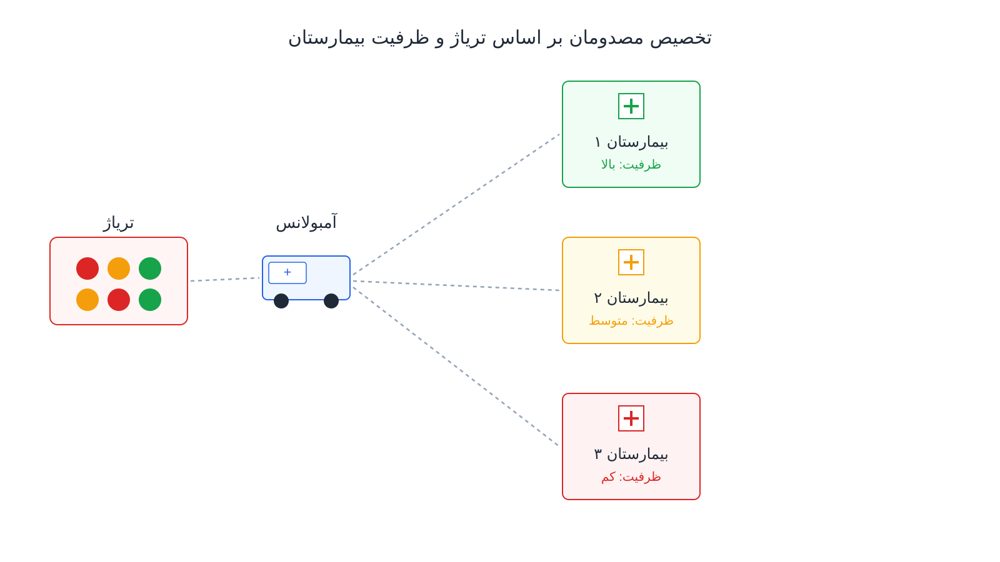

وقتی یک زلزله، انفجار یا تصادف بزرگ چند ده مصدوم را هم‌زمان به سیستم درمانی شهر تحمیل می‌کند، تصمیم فوری لازم است. اولین سؤال این نیست که کدام بیمارستان نزدیک‌تر است. سؤال اصلی این است که کدام بیمار باید به کدام بیمارستان برود تا جان بیشترین افراد نجات یابد. این تصمیم به‌ظاهر ساده است، اما در عمل یکی از پیچیده‌ترین مسائل تخصیص منابع در شرایط بحران محسوب می‌شود. دلیل این پیچیدگی است که مدل باید هم‌زمان شدت آسیب هر بیمار و ظرفیت خالی هر مرکز درمانی را در نظر بگیرد. همچنین باید تخصص موجود در هر مرکز، مثلاً وجود تیم جراحی ترومای سطح یک یا اتاق عمل آزاد، لحاظ شود.

زمان انتقال بیمار به بیمارستان نیز عامل مهم دیگری در این تصمیم است. اگر همه‌ی مصدومان به نزدیک‌ترین بیمارستان فرستاده شوند، همان مرکز به‌سرعت اشباع می‌شود. در این حالت، بیمارانی که می‌توانستند در بیمارستانی چند دقیقه دورتر سریع‌تر ویزیت شوند، پشت صف انتظار می‌مانند. این تأخیر گاهی عواقب جبران‌ناپذیری به همراه دارد.

### چرا «نزدیک‌ترین بیمارستان» جواب درستی نیست

در شرایط عادی، منطقی‌ترین کار این است که هر بیمار اورژانسی به نزدیک‌ترین مرکز درمانی منتقل شود. اما در یک حادثه‌ی انبوه (Mass Casualty Incident یا MCI)، این قاعده به‌سرعت خودش را نقض می‌کند. فرض کنید یک بیمارستان با ظرفیت پذیرش سی مصدوم در ساعت، در نزدیکی محل حادثه قرار دارد. به همین دلیل، این بیمارستان اولین مقصد طبیعی همه‌ی آمبولانس‌ها می‌شود. اگر تعداد مصدومان از این ظرفیت فراتر رود، همان بیمارستان به گلوگاه تبدیل می‌شود. به‌جای اینکه بخشی از راه‌حل باشد، خودش به بخشی از مشکل تبدیل می‌شود. در همین حال، ممکن است بیمارستان دیگری در فاصله‌ی ده دقیقه‌ای ظرفیت آزاد داشته باشد.

این بیمارستان دوم حتی ممکن است تیم تخصصی جراحی عروق یا نورولوژی داشته باشد که برای برخی مصدومان حیاتی‌تر است. مسئله‌ی تخصیص مصدومان دقیقاً همین موازنه را حل می‌کند. به‌جای بهینه‌سازی تصمیم هر بیمار به‌تنهایی، این مدل کل سیستم را یک شبکه با ظرفیت محدود می‌بیند. سپس توزیعی پیدا می‌کند که در سطح کل جامعه، نتیجه‌ی درمانی را بیشینه کند.

### فرمول‌بندی ریاضی مسئله

این مسئله را می‌توان به‌صورت یک مدل برنامه‌ریزی خطی عدد صحیح (MILP) فرمول‌بندی کرد. در این مدل، هر مصدوم باید به دقیقاً یک بیمارستان اختصاص یابد. همچنین باید ظرفیت هر بیمارستان و تناسب تخصصی آن رعایت شود. فرض کنید $x_{ph}$ متغیر باینری تخصیص بیمار $p$ به بیمارستان $h$ باشد. همچنین $c_{ph}$ هزینه‌ی این تخصیص است که ترکیبی از زمان انتقال و ضریب اولویت بالینی بیمار است. $w_p$ نیز وزن شدت آسیب بیمار $p$ را نشان می‌دهد. با این نمادها، فرمول‌بندی پایه‌ی مدل به این شکل است:

$$ \min \sum_{p \in P} \sum_{h \in H} w_p \, c_{ph} \, x_{ph} $$

$$ \text{s.t.} \quad \sum_{h \in H} x_{ph} = 1 \quad \forall p \in P $$

$$ \sum_{p \in P} x_{ph} \leq Q_h \quad \forall h \in H $$

$$ x_{ph} \in \{0,1\} $$

در این فرمول‌بندی، $Q_h$ ظرفیت پذیرش لحظه‌ای بیمارستان $h$ است. محدودیت اول تضمین می‌کند هر مصدوم دقیقاً به یک مرکز فرستاده شود. محدودیت دوم مانع از اشباع‌شدن یک بیمارستان فراتر از ظرفیت واقعی‌اش می‌شود. در نسخه‌های واقعی‌تر، معمولاً یک متغیر کمکی برای «کمبود ظرفیت» به مدل اضافه می‌شود. این متغیر با جریمه‌ی سنگین در تابع هدف همراه است. این کار اجازه می‌دهد مدل در شرایط بحرانی، به‌جای بی‌جواب‌شدن، راه‌حلی با حداقل نقض ظرفیت پیدا کند. در دنیای واقعی، رد‌کردن کامل یک بیمار به دلیل نبود ظرفیت، گزینه‌ی قابل‌قبولی نیست. همچنین می‌توان محدودیت‌های تناسب تخصصی را با حذف متغیرهای $x_{ph}$ برای زوج‌های بیمار-بیمارستانی نامناسب اضافه کرد. این زوج‌ها بیمار و بیمارستانی هستند که تخصص لازم را ندارند. این روش بهتر از جریمه‌کردن آن‌ها با ضریب هزینه‌ی بسیار بالا است.

### اهمیت این موضوع در دنیای واقعی

سیستم‌های سلامت در سراسر دنیا برای همین سناریو برنامه‌ریزی می‌کنند، حتی اگر امیدوار باشند هرگز به آن نیاز پیدا نکنند. شبکه‌ی بیمارستانی HCA Healthcare در آمریکا ده‌ها بیمارستان را در مناطق شهری بزرگ اداره می‌کند. این شبکه باید در پروتکل‌های مدیریت حادثه‌ی خود مشخص کند که در صورت وقوع یک رویداد با تلفات انبوه چه باید کرد. به‌طور خاص، باید مشخص شود ظرفیت پذیرش هر شعبه چگونه به مرکز فرماندهی گزارش می‌شود. این داده باید به‌صورت پویا به‌روزرسانی شود تا تصمیم توزیع مصدومان بر اساس داده‌ی واقعی، نه حدس، گرفته شود.

فراتر از بعد انسانی که در این مسئله بدیهی است، بعد اقتصادی و مدیریتی آن هم جدی است. توزیع نامتوازن بیماران می‌تواند هزینه‌ی درمانی کل سیستم را بالا ببرد و کیفیت مراقبت را در بیمارستان‌های اشباع‌شده کاهش دهد. همچنین می‌تواند زمان بازیابی سیستم درمانی شهر بعد از بحران را طولانی‌تر کند. تجربه‌ی حوادثی مثل زلزله‌ها، حملات تروریستی در شهرهای بزرگ، و موج بیماران کووید-۱۹ نکته‌ی مهمی را نشان داد. نبود یک سازوکار منظم و از‌پیش‌طراحی‌شده برای توزیع بیماران، فشار مضاعفی به سیستم درمانی وارد می‌کند. این فشار با یک مدل تخصیص ساده هم قابل کاهش قابل‌توجه بود.

### ظرفیت کار آکادمیک و پژوهشی

این حوزه در تقاطع تحقیق در عملیات، مدیریت بحران و پزشکی اورژانس قرار دارد و همچنان فضای پژوهشی گسترده‌ای دارد. یکی از مسیرهای فعال، ترکیب این مدل تخصیص با تصمیم‌گیری چندمرحله‌ای است. در واقعیت، مصدومان به‌صورت موج‌های پی‌درپی می‌رسند، نه یک‌جا و با اطلاعات کامل. بنابراین مدل باید تحت عدم‌قطعیت تعداد و شدت موج‌های بعدی تصمیم بگیرد. مسیر دیگر، ترکیب تخصیص بیمار با [مسیریابی و مکان‌یابی هم‌زمان ناوگان آمبولانس](/notes/ambulance-location-mclp/) است. در این حالت، تصمیم «کدام بیمار به کدام بیمارستان برود» و «کدام آمبولانس این انتقال را انجام دهد» باید مشترکاً بهینه شوند.

همچنین بهینه‌سازی چندهدفه نیز موضوع مناسبی برای پایان‌نامه یا مقاله است. چنین مدلی هم‌زمان زمان کل انتقال را کمینه، و تناسب تخصصی را بیشینه می‌کند. همچنین باید عدالت بین مناطق مختلف شهر، به‌ویژه مناطق کم‌برخوردار و دورتر از مراکز تخصصی، رعایت شود. شبیه‌سازی رویداد-محور (discrete-event simulation) نیز در کنار این مدل‌های بهینه‌سازی ابزاری رایج است. این ابزار برای آزمودن مقاومت پروتکل‌های تخصیص در برابر سناریوهای مختلف حادثه به‌کار می‌رود.

### پیاده‌سازی با پایتون

نکته‌ی خوب این است که چنین مدلی را می‌توان کاملاً با ابزارهای متن‌باز و رایگان پایتون پیاده‌سازی کرد. این کار بدون نیاز به هیچ نرم‌افزار یا سالور تجاری گران‌قیمت انجام می‌شود. ساختار این مسئله، یک مسئله‌ی تخصیص تعمیم‌یافته با محدودیت ظرفیت است. این مسئله با ماژول CP-SAT کتابخانه‌ی [OR-Tools](https://developers.google.com/optimization) گوگل به‌راحتی قابل مدل‌سازی و حل است. CP-SAT حتی اجازه می‌دهد محدودیت‌های منطقی تناسب تخصصی، مثلاً «بیمار با آسیب نخاعی فقط به بیمارستان دارای تیم نورولوژی»، به‌سادگی اضافه شوند. برای مدل‌های ساده‌تر با تابع هدف خطی محض، کتابخانه‌هایی مثل [PuLP](https://coin-or.github.io/pulp/) گزینه‌ی مناسبی هستند. این کتابخانه‌ها به همراه سالورهای متن‌باز مثل [CBC](https://github.com/coin-or/Cbc) یا [HiGHS](https://highs.dev/) سبک و سریع عمل می‌کنند.

در عمل، داده‌های ورودی مثل فهرست مصدومان با شدت آسیب و فهرست بیمارستان‌ها با ظرفیت و تخصص موجود لازم است. ماتریس زمان انتقال بین محل حادثه و هر بیمارستان را نیز می‌توان از یک فایل اکسل یا CSV خواند. این داده‌ها مستقیماً به مدل تغذیه می‌شوند. کتابخانه‌ی [NetworkX](https://networkx.org/) هم برای محاسبه‌ی زمان دسترسی واقعی روی شبکه‌ی معابر شهری، به‌جای فاصله‌ی مستقیم هوایی، مفید است. همین سادگی در آماده‌سازی داده باعث می‌شود مراکز فرماندهی اورژانس با بودجه‌ی محدود هم بتوانند چنین ابزاری را از قبل آماده کنند. سپس می‌توانند آن را در تمرین‌های مانور بحران آزمایش کنند.

### سوالات متداول

<h3>آیا این مدل فقط برای زمان وقوع حادثه کاربرد دارد یا در برنامه‌ریزی از پیش هم استفاده می‌شود؟</h3>

هر دو. در لحظه‌ی وقوع حادثه، این مدل به‌عنوان یک ابزار تصمیم‌یاری سریع برای مرکز فرماندهی عمل می‌کند. کاربرد مهم‌تر آن معمولاً در مانورهای آمادگی است. در این مانورها، سناریوهای مختلف حادثه، مثل زلزله با فلان مقیاس یا انفجار در فلان منطقه، شبیه‌سازی می‌شوند. سپس آزموده می‌شود که با ظرفیت فعلی بیمارستان‌های شهر، توزیع بهینه‌ی مصدومان به چه شکلی است. این تحلیل نشان می‌دهد کجای شبکه‌ی درمانی نیاز به تقویت ظرفیت دارد.

<h3>این مسئله چه تفاوتی با مسئله‌ی اعزام و مکان‌یابی آمبولانس دارد؟</h3>

مکان‌یابی و اعزام آمبولانس درباره‌ی این است که کدام خودرو از کدام پایگاه به محل حادثه برود. تخصیص مصدومان یک لایه‌ی بعدی است: وقتی بیمار سوار آمبولانس شد، تصمیم می‌گیرد به کدام بیمارستان منتقل شود. اگر می‌خواهید این نوع مسائل تخصیص و زمان‌بندی سلامت را پروژه‌محور با OR-Tools و CP-SAT یاد بگیرید، این دوره کمک می‌کند. دوره‌ی <a href="/courses/health-opt/" style="color:#2563EB; font-weight:bold;">بهینه‌سازی سیستم‌های سلامت با پایتون</a> دقیقاً برای همین طراحی شده است.

<h3>اگر داده‌های واقعی بیمارستان‌های ما با فرمول استاندارد این مدل جور درنمی‌آید، چه کار کنیم؟</h3>

این کاملاً طبیعی است. هر شهر توزیع جغرافیایی بیمارستان‌ها، تخصص‌های موجود و پروتکل‌های داخلی خودش را دارد. مدل استاندارد باید متناسب با این واقعیت‌ها تنظیم شود. برای پیاده‌سازی اختصاصی و متناسب با داده‌های سازمان یا شبکه‌ی درمانی شما، می‌توانید از خدمات <a href="/consultation/" style="color:#2563EB; font-weight:bold;">مشاوره</a> استفاده کنید.

