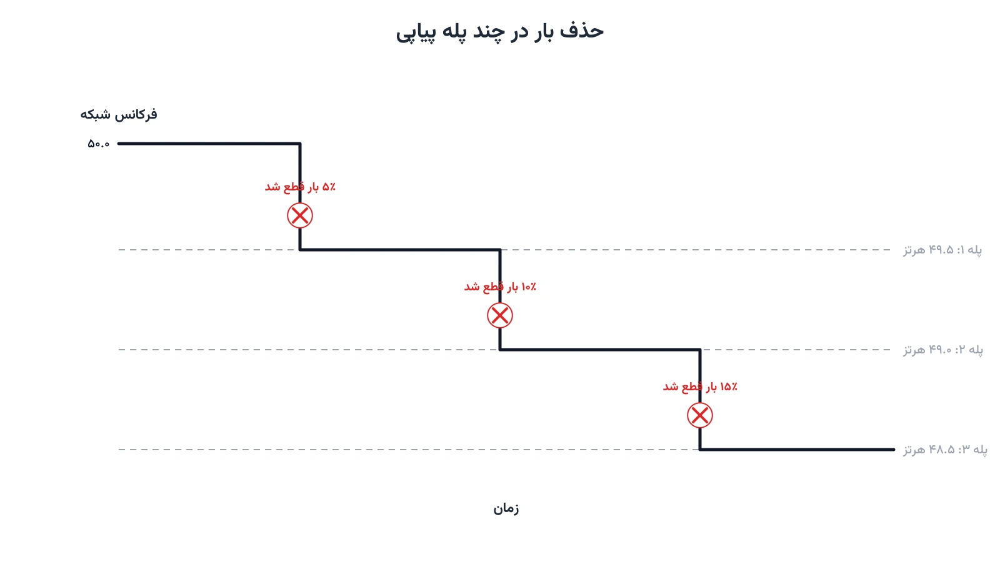

یک نیروگاه بزرگ ناگهان از مدار خارج می‌شود. فرکانس شبکه در کسری از ثانیه افت می‌کند. اپراتور فقط چند ثانیه وقت دارد تا تعادل تولید و مصرف را برگرداند. راه‌حل فوری، قطع بخشی از بار مصرفی است. اما کدام فیدر باید خاموش شود؟ یک بیمارستان را نمی‌توان مثل یک منطقه مسکونی معمولی در نظر گرفت.

این تصمیم را در ادبیات سیستم قدرت «حذف بار» یا Load Shedding می‌نامند. نسخه کلاسیک آن، طرحی ثابت و از پیش‌تعیین‌شده است. هر فیدر به یک پله فرکانسی خاص متصل می‌شود و با عبور فرکانس از آن آستانه قطع می‌شود. این روش ساده و سریع است، اما هوشمند نیست. نسخه بهینه‌شده، با برنامه‌ریزی عدد صحیح، بار لازم را با کمترین آسیب انتخاب می‌کند.

## فرمول‌بندی ریاضی مسئله

فرض کنید مجموعه فیدرهای قابل‌قطع را با $F$ نشان دهیم. هر فیدر $i$ توان مصرفی $P_i$ و وزن اهمیت $w_i$ دارد. وزن بالاتر یعنی فیدر حیاتی‌تر و قطع آن پرهزینه‌تر است. متغیر تصمیم دودویی $x_i$ نشان می‌دهد آیا فیدر $i$ قطع می‌شود یا نه. هدف مدل، کمینه‌کردن هزینه وزنی بار قطع‌شده است:

$$
\min \sum_{i \in F} w_i P_i x_i
$$

قید اصلی، کافی‌بودن بار قطع‌شده برای جبران کمبود تولید $\Delta P$ را تضمین می‌کند:

$$
\sum_{i \in F} P_i x_i \ge \Delta P \,, \qquad x_i \in \{0,1\} \quad \forall i \in F
$$

این فرمول‌بندی، نسخه‌ای از مسئله کلاسیک کوله‌پشتی پوششی یا Covering Knapsack است. تفاوت اصلی با کوله‌پشتی معمول، جهت نامعادله قید است. در کوله‌پشتی استاندارد سقف ظرفیت رعایت می‌شود، اما اینجا باید حداقل مقدار لازم تأمین شود.

در عمل، حذف بار معمولاً یک‌باره و کامل انجام نمی‌شود. شبکه در چند پله پیاپی عمل می‌کند. اگر پله اول کافی نبود، پله دوم با آستانه فرکانسی پایین‌تر فعال می‌شود. برخی مدل‌های پیشرفته‌تر، به‌جای فرکانس از افت ولتاژ هم به‌عنوان محرک استفاده می‌کنند. به این حالت، حذف بار زیر ولتاژ یا UVLS گفته می‌شود. ساختار ریاضی مدل در هر دو حالت تقریباً یکسان می‌ماند، فقط متغیر محرک تغییر می‌کند.

## اهمیت این موضوع

خاموشی برنامه‌ریزی‌نشده شبکه، هزینه اقتصادی و اجتماعی سنگینی دارد. اما خاموشی کامل شبکه، یعنی فروپاشی سراسری یا Blackout، به‌مراتب بدتر است. حذف بار کنترل‌شده، دقیقاً همین فروپاشی را پیشگیری می‌کند. شرکتی مثل Eskom در آفریقای جنوبی سال‌هاست با کمبود مزمن ظرفیت تولید دست‌وپنجه نرم می‌کند. این شرکت به‌طور منظم بخشی از بار مصرفی کشور را به‌صورت نوبتی قطع می‌کند تا از فروپاشی کامل شبکه جلوگیری شود.

تفاوت بین یک طرح حذف بار خوب و یک طرح ضعیف، در انتخاب دقیق فیدرها نهفته است. طرح ضعیف ممکن است بیمارستان، پمپاژ آب شرب یا صنعت حساس را هم‌زمان با مناطق کم‌اهمیت قطع کند. مدل بهینه‌سازی، این اولویت‌بندی را به‌صورت نظام‌مند و قابل‌تکرار انجام می‌دهد. با گسترش شبکه‌های هوشمند و زیرساخت‌های اندازه‌گیری پیشرفته، امکان اجرای چنین مدل‌هایی در لحظه هم فراهم‌تر شده است. یادداشت [بهینه‌سازی شبکه هوشمند](/notes/smart-grid-optimization/) این زیرساخت ارتباطی و محاسباتی را دقیق‌تر توضیح می‌دهد.

## ظرفیت پژوهشی و آکادمیک

حذف بار بهینه، حوزه‌ای فعال و همچنان در حال رشد در پژوهش سیستم قدرت است. مسیر اول، ترکیب حذف بار با منابع انرژی تجدیدپذیر و ذخیره‌ساز است. باتری‌ها می‌توانند بخشی از کمبود را جبران کنند و نیاز به قطع بار را کاهش دهند. مسیر دوم، مدل‌سازی پویا و زمان‌محور است؛ یعنی تصمیم قطع در چند لحظه پیاپی و نه فقط یک لحظه گرفته شود.

مسیر سوم، هماهنگی حذف بار بین چند ناحیه کنترلی مجاور است. وقتی یک ناحیه کمبود دارد، نواحی همسایه هم ممکن است تحت تأثیر قرار گیرند. مسیر چهارم، مدل‌سازی تصادفی حجم و زمان دقیق کمبود تولید است. این کمبود پیش از وقوع، همیشه با قطعیت کامل معلوم نیست. مسیر پنجم، ترکیب حذف بار با قیود پایداری ولتاژ شبکه توزیع. هرکدام از این مسیرها ظرفیت خوبی برای پایان‌نامه یا مقاله دارند.



## پیاده‌سازی با پایتون

خبر خوب این است که حل این مدل، نیازی به نرم‌افزار گران‌قیمت ندارد. مدل پایه فقط یک برنامه‌ریزی عدد صحیح دودویی با یک قید اصلی است. کتابخانه متن‌باز [PuLP](https://coin-or.github.io/pulp/) این مدل را به‌سادگی می‌نویسد. سالورهای رایگان مثل [CBC](https://github.com/coin-or/Cbc) یا [HiGHS](https://highs.dev/) آن را در کسری از ثانیه حل می‌کنند. حتی برای شبکه‌ای با چند صد فیدر، زمان حل عملاً قابل چشم‌پوشی است.

داده هر فیدر، شامل توان مصرفی و وزن اهمیت، معمولاً در یک فایل ساده اکسل یا CSV نگهداری می‌شود. این فایل را می‌توان مستقیماً با کتابخانه pandas خواند و به مدل داد. برای تحلیل‌های پیچیده‌تر روی شبکه توزیع واقعی، کتابخانه [pandapower](https://www.pandapower.org/) امکان شبیه‌سازی پخش‌بار همراه با سناریوی حذف بار را هم فراهم می‌کند.

```python
import pulp

feeders = {
    "hospital": {"load": 4.0, "weight": 50},
    "industrial": {"load": 6.0, "weight": 15},
    "residential_a": {"load": 3.5, "weight": 5},
    "residential_b": {"load": 2.8, "weight": 4},
    "commercial": {"load": 5.2, "weight": 10},
}
deficit = 9.0  # مگاوات کمبود تولید

model = pulp.LpProblem("optimal_load_shedding", pulp.LpMinimize)
shed = pulp.LpVariable.dicts("shed", feeders, cat="Binary")

model += pulp.lpSum(feeders[i]["weight"] * feeders[i]["load"] * shed[i] for i in feeders)
model += pulp.lpSum(feeders[i]["load"] * shed[i] for i in feeders) >= deficit

model.solve(pulp.PULP_CBC_CMD(msg=False))

for i in feeders:
    status = "قطع" if shed[i].value() == 1 else "روشن"
    print(f"{i}: {status}")
```

روی این مثال پنج‌فیدره، سالور معمولاً فیدرهای صنعتی و مسکونی را برای قطع انتخاب می‌کند، نه بیمارستان. وزن بالای فیدر حیاتی عملاً آن را از دایره انتخاب خارج می‌کند، مگر در شرایط کاملاً اضطراری. برای مدل‌سازی چندپله‌ای، کافی است همین مدل چند بار با آستانه‌های فرکانسی متفاوت تکرار شود.

## سوالات متداول

<h3>آیا حذف بار بهینه در لحظه واقعی هم قابل‌اجراست؟</h3>
<p>مدل پایه MILP در کسری از ثانیه حل می‌شود، پس برای اجرای لحظه‌ای کاملاً مناسب است. چالش اصلی، نه سرعت حل مدل، بلکه صحت و به‌روزبودن داده وزن‌دهی فیدرهاست.</p>

<h3>آیا برای استفاده از این مدل باید مهندس برق باشیم؟</h3>
<p>دانش پایه برنامه‌ریزی عدد صحیح کافی است، اما آشنایی با مفاهیم پایداری فرکانس کمک زیادی می‌کند. دوره <a href="/courses/advanced-power-system/" style="color:#2563EB; font-weight:bold;">بهینه‌سازی پیشرفته سیستم قدرت</a> دقیقاً همین نوع مدل‌های کنترل اضطراری شبکه را پوشش می‌دهد.</p>

<h3>اگر شبکه ما چند ناحیه کنترلی مجزا داشته باشد چه؟</h3>
<p>مدل قابل‌گسترش به چند ناحیه، چند سطح اولویت و قیود هماهنگی بین نواحی است. برای طراحی دقیق مدل متناسب با ساختار شبکه شما، از طریق <a href="/consultation/" style="color:#2563EB; font-weight:bold;">مشاوره</a> می‌توانیم جزئیات را بررسی کنیم.</p>
