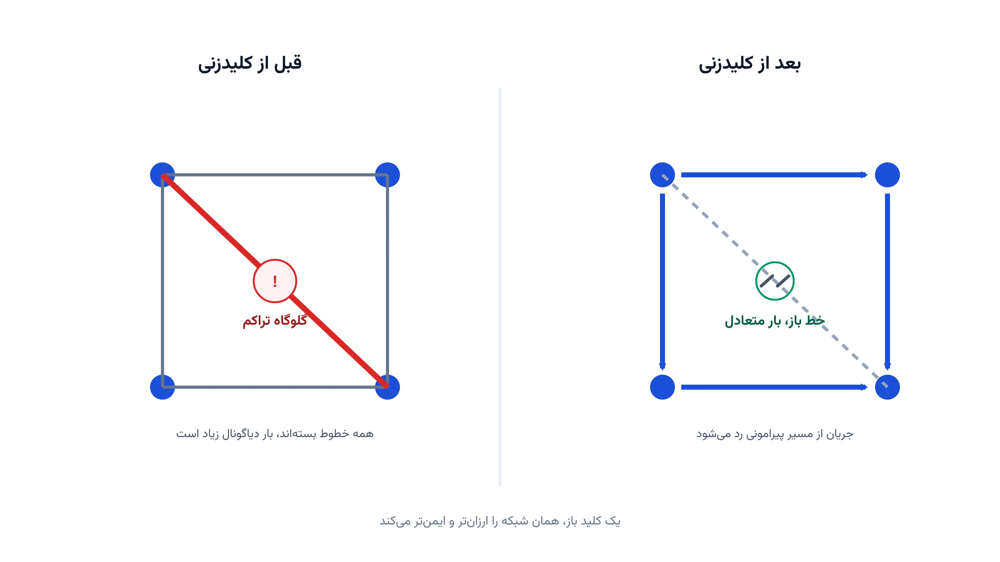

اپراتور شبکه معمولاً فکر می‌کند همه خطوط انتقال باید همیشه روشن بمانند. اما این فرض همیشه درست نیست. گاهی خاموش‌کردن عمدی یک خط، هزینه کل تولید را کاهش می‌دهد. این پدیده عجیب، نتیجه ماهیت غیرشهودی پخش بار در شبکه‌های حلقه‌ای است.

این تصمیم را کلیدزنی بهینه خطوط انتقال یا Optimal Transmission Switching می‌نامند. توپولوژی شبکه، خودش به یک متغیر تصمیم تبدیل می‌شود. اپراتور دیگر فقط تولید و مصرف را بهینه نمی‌کند؛ او انتخاب می‌کند کدام خط باز بماند و کدام بسته.

## فرمول‌بندی ریاضی مسئله

مدل پایه OTS، یک گسترش از پخش‌بار بهینه خطی یا DC-OPF است. برای هر خط $\ell$ بین گره $i$ و $j$، یک متغیر دودویی $z_\ell$ تعریف می‌شود. وقتی $z_\ell=1$ خط در مدار است. وقتی $z_\ell=0$ خط باز است و جریانی از آن عبور نمی‌کند. هدف مدل، کمینه‌کردن هزینه کل تولید نیروگاه‌هاست:

$$
\min \sum_{g \in G} c_g P_g
$$

قید اصلی مدل، رابطه جریان خط با اختلاف زاویه فاز دو سر آن را کنترل می‌کند. وقتی خط بسته است، جریان باید دقیقاً از فرمول استاندارد پخش بار DC پیروی کند. وقتی خط باز است، این رابطه باید کاملاً آزاد شود. این رفتار دوگانه، با یک قید بزرگ-M مدل می‌شود:

$$
-M(1-z_\ell) \le f_\ell - B_\ell(\theta_i - \theta_j) \le M(1-z_\ell)
$$

قید دوم، ظرفیت انتقال خط را فقط وقتی که بسته است فعال می‌کند:

$$
-F_\ell^{\max} z_\ell \le f_\ell \le F_\ell^{\max} z_\ell, \qquad z_\ell \in \{0,1\}
$$

در نهایت، موازنه توان در هر گره باید برقرار باشد. تولید به‌علاوه جریان ورودی، باید دقیقاً با مصرف آن گره برابر شود:

$$
\sum_{g \in G_n} P_g + \sum_{\ell \to n} f_\ell - \sum_{\ell \leftarrow n} f_\ell = D_n \qquad \forall n
$$

این فرمول‌بندی، یک مسئله برنامه‌ریزی عدد صحیح مختلط یا MILP است. بخش عدد صحیح آن، فقط متغیرهای $z_\ell$ هستند. در عمل، اپراتورها معمولاً یک سقف هم روی تعداد خطوط قابل‌قطع می‌گذارند. دلیل این سقف، کاهش ریسک پایداری شبکه است؛ قطع هم‌زمان خطوط زیاد، این ریسک را بالا می‌برد.

## اهمیت این موضوع

تصور رایج این است که شبکه‌ای با خطوط بیشتر، همیشه کاراتر است. اما در شبکه‌های حلقه‌ای، جریان همیشه مسیر فیزیکی بهینه را انتخاب نمی‌کند. این پدیده را گاهی پارادوکس برایس می‌نامند، شبیه ترافیک شهری که بستن یک خیابان، تراکم را کم می‌کند. در شبکه برق، همین منطق می‌تواند سالانه میلیون‌ها دلار صرفه‌جویی ایجاد کند.

اپراتورهایی مثل PJM Interconnection در آمریکا، سال‌هاست کلیدزنی بهینه خطوط انتقال را در مطالعات برنامه‌ریزی بهره‌برداری بررسی می‌کنند. این اپراتور یکی از بزرگ‌ترین بازارهای عمده‌فروشی برق دنیا را اداره می‌کند. حتی کاهش چند درصدی هزینه تولید روزانه، در مقیاس چنین شبکه‌ای، رقمی بسیار بزرگ می‌شود.

فراتر از صرفه هزینه، کلیدزنی خطوط ابزاری برای مدیریت تراکم شبکه هم هست. وقتی یک خط به‌طور مزمن پرتراکم می‌شود، گزینه ساخت خط جدید هم گران است و هم زمان‌بر. کلیدزنی هوشمند، بدون هیچ سرمایه‌گذاری فیزیکی، همان اثر را به‌صورت موقت یا حتی دائمی ایجاد می‌کند. موضوع [بازآرایی شبکه توزیع](/notes/dist-reconfiguration/) هم همین منطق تغییر توپولوژی را، در سطح شبکه توزیع، دنبال می‌کند.

## ظرفیت پژوهشی و آکادمیک

کلیدزنی بهینه خطوط انتقال، یکی از حوزه‌های فعال پژوهش در سیستم قدرت است. مسیر اول، ترکیب آن با تعهد واحدها و برنامه‌ریزی چندساعته است. مسیر دوم، مدل‌سازی آن زیر عدم‌قطعیت تولید تجدیدپذیر و تقاضاست.

مسیر سوم، تحلیل امنیت شبکه زیر سناریوهای حذف ناگهانی تجهیزات، یا N-1 Contingency است. مسیر چهارم، توسعه روش‌های حل سریع‌تر برای شبکه‌های بسیار بزرگ است. مدل پایه MILP برای صدها گره قابل‌حل است، اما شبکه‌های سراسری به روش‌های تجزیه نیاز دارند. هرکدام از این مسیرها، ظرفیت خوبی برای پایان‌نامه کارشناسی ارشد یا مقاله دارند.



## پیاده‌سازی با پایتون

خبر خوب این است که حل این مدل، نیازی به نرم‌افزار گران‌قیمت ندارد. کتابخانه متن‌باز [Pyomo](https://www.pyomo.org/) برای نوشتن مدل‌های ترکیبی از متغیر پیوسته و دودویی بسیار مناسب است. سالورهای رایگان مثل [HiGHS](https://highs.dev/) یا [CBC](https://github.com/coin-or/Cbc) این مدل را برای شبکه‌های متوسط در چند ثانیه حل می‌کنند.

داده هر خط، شامل مقاومت، ظرفیت و دو گره انتهایی آن، معمولاً در یک فایل ساده اکسل یا CSV نگهداری می‌شود. این داده را می‌توان با کتابخانه pandas خواند و مستقیم به مدل Pyomo داد. برای تحلیل‌های دقیق‌تر روی شبکه انتقال واقعی، کتابخانه [pandapower](https://www.pandapower.org/) امکان شبیه‌سازی پخش‌بار همراه با سناریوی کلیدزنی را هم فراهم می‌کند.

```python
import pyomo.environ as pyo

buses = ["A", "B", "C", "D"]
lines = {
    ("A", "B"): {"b": 8.0, "limit": 70},
    ("C", "D"): {"b": 8.0, "limit": 70},
    ("A", "C"): {"b": 6.0, "limit": 60},
    ("B", "D"): {"b": 6.0, "limit": 60},
    ("A", "D"): {"b": 20.0, "limit": 40},  # دیاگونال، کاندیدای کلیدزنی
}
demand = {"A": 0, "B": 40, "C": 0, "D": 60}
gen_cost = {"A": 20, "C": 35}
big_m = 500

model = pyo.ConcreteModel()
model.LINES = pyo.Set(initialize=list(lines.keys()))
model.z = pyo.Var(model.LINES, domain=pyo.Binary)
model.f = pyo.Var(model.LINES, domain=pyo.Reals)
model.theta = pyo.Var(buses, domain=pyo.Reals, bounds=(-50, 50))
model.p = pyo.Var(gen_cost.keys(), domain=pyo.NonNegativeReals)

def flow_upper(m, i, j):
    b = lines[(i, j)]["b"]
    return m.f[i, j] - b * (m.theta[i] - m.theta[j]) <= big_m * (1 - m.z[i, j])
model.flow_upper = pyo.Constraint(model.LINES, rule=flow_upper)

def flow_lower(m, i, j):
    b = lines[(i, j)]["b"]
    return m.f[i, j] - b * (m.theta[i] - m.theta[j]) >= -big_m * (1 - m.z[i, j])
model.flow_lower = pyo.Constraint(model.LINES, rule=flow_lower)

def cap_upper(m, i, j):
    return m.f[i, j] <= lines[(i, j)]["limit"] * m.z[i, j]
model.cap_upper = pyo.Constraint(model.LINES, rule=cap_upper)

def cap_lower(m, i, j):
    return m.f[i, j] >= -lines[(i, j)]["limit"] * m.z[i, j]
model.cap_lower = pyo.Constraint(model.LINES, rule=cap_lower)

def balance(m, n):
    gen = m.p[n] if n in gen_cost else 0
    inflow = sum(m.f[i, j] for (i, j) in m.LINES if j == n)
    outflow = sum(m.f[i, j] for (i, j) in m.LINES if i == n)
    return gen + inflow - outflow == demand[n]
model.balance = pyo.Constraint(buses, rule=balance)

# حداکثر یک خط هم‌زمان مجاز به باز ماندن است
model.max_open = pyo.Constraint(expr=sum(1 - model.z[l] for l in lines) <= 1)

model.obj = pyo.Objective(
    expr=sum(gen_cost[g] * model.p[g] for g in gen_cost), sense=pyo.minimize
)

pyo.SolverFactory("appsi_highs").solve(model)
for l in lines:
    print(l, "باز" if model.z[l].value < 0.5 else "بسته")
```

روی این مثال چهارگرهی، سالور معمولاً خط دیاگونال را برای باز ماندن انتخاب می‌کند. همین نتیجه در تصویر این مطلب هم دیده می‌شود. دلیل آن، کاهش جریان حلقه‌ای است که بدون این خط ایجاد می‌شد. برای شبکه واقعی، کافی است دیکشنری خطوط و بارها از داده واقعی شبکه خوانده شود.

## سوالات متداول

<h3>آیا کلیدزنی بهینه خطوط انتقال، شبکه را ناپایدار نمی‌کند؟</h3>
<p>مدل پایه، قیود پایداری دینامیکی را مستقیم نمی‌بیند. برای همین در عمل، یک سقف روی تعداد خطوط قابل‌قطع اعمال می‌شود. مطالعات امنیت شبکه، پیش از اجرای واقعی، پایداری هر سناریوی پیشنهادی را جداگانه بررسی می‌کنند.</p>

<h3>آیا برای پیاده‌سازی این مدل باید مهندس قدرت باشیم؟</h3>
<p>آشنایی پایه با پخش بار DC و برنامه‌ریزی عدد صحیح کافی است. دوره <a href="/courses/advanced-power-system/" style="color:#2563EB; font-weight:bold;">بهینه‌سازی پیشرفته سیستم قدرت</a> دقیقاً همین نوع مدل‌های MILP شبکه انتقال را با جزئیات کامل آموزش می‌دهد.</p>

<h3>اگر شبکه ما صدها خط و گره داشته باشد چه؟</h3>
<p>مدل بزرگ‌تر معمولاً به تکنیک‌های کراندهی و پیش‌پردازش هوشمندانه نیاز دارد تا زمان حل منطقی بماند. برای طراحی دقیق مدل متناسب با مقیاس شبکه شما، از طریق <a href="/consultation/" style="color:#2563EB; font-weight:bold;">مشاوره</a> می‌توانیم جزئیات فنی را بررسی کنیم.</p>
