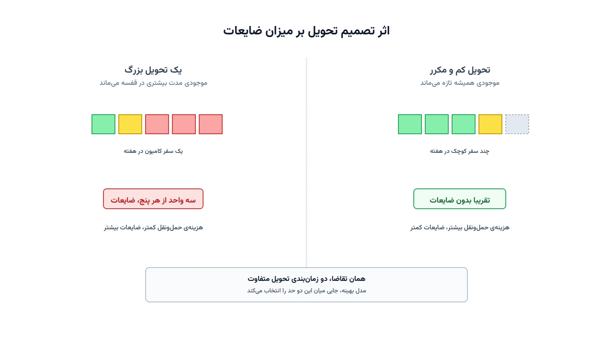

تصور کنید مدیر توزیع محصولات لبنی یک برند شناخته‌شده هستید. هر روز صبح باید ده‌ها فروشگاه را با ماست و شیر تازه پر کنید. اگر کم بفرستید، قفسه خالی می‌ماند و مشتری ناامید می‌شود. اگر زیاد بفرستید، بخشی از محصول قبل از فروش تاریخ انقضایش فرا می‌رسد. این دقیقاً همان چالشی است که «مسیریابی-موجودی فسادپذیر» به آن می‌پردازد.

نام رسمی این مسئله در پژوهش عملیاتی، Perishable Inventory Routing Problem یا به‌اختصار PIRP است. این مسئله سه تصمیم را هم‌زمان می‌گیرد. چه زمانی هر فروشگاه را سر بزنیم؟ چقدر به هر فروشگاه تحویل دهیم؟ کامیون‌ها کدام مسیر را طی کنند؟ تفاوت اصلی این مسئله با نسخه‌ی کلاسیک آن، یک قید تازه است: طول عمر محدود محصول.

### چرا این مسئله از مسیریابی-موجودی معمولی سخت‌تر است؟

در مسیریابی-موجودی معمولی، هدف فقط جلوگیری از خالی‌شدن موجودی است. کمبود، تنها ریسکی است که مدل باید مدیریت کند. اما در نسخه‌ی فسادپذیر، ریسک دوم هم اضافه می‌شود: انباشت بیش‌ازحد. اگر محصول بیش از طول عمر مجازش در قفسه بماند، باید دور ریخته شود. این یعنی مدل باید بین دو خطر متضاد تعادل برقرار کند: کمبود از یک سو، و ضایعات از سوی دیگر.

این تعادل، رفتار تحویل را کاملاً تغییر می‌دهد. یک مدل موجودی-مسیریابی معمولی، معمولاً ترجیح می‌دهد یک‌بار زیاد تحویل دهد. این کار تعداد سفرها و هزینه‌ی حمل‌ونقل را کم می‌کند. اما همین راهبرد برای محصول فسادپذیر خطرناک است. تحویل زیاد یعنی موجودی مدت بیشتری در قفسه می‌ماند. و ماندن بیشتر، یعنی احتمال بیشتر رسیدن به پایان طول عمر. پس مدل باید سفرهای کوتاه‌تر و مکررتر را هم در نظر بگیرد، حتی اگر هزینه‌ی حمل‌ونقل کمی بالاتر برود.

### فرمول‌بندی ریاضی

برای مدل‌سازی، فروشگاه‌ها را با اندیس $i \in I$ نشان می‌دهیم. روزهای افق برنامه‌ریزی با $t \in T$ و کامیون‌ها با $k \in K$ مشخص می‌شوند. طول عمر مجاز محصول را با $L$ روز نشان می‌دهیم. متغیر $q_{i,t} \ge 0$ مقدار تحویلی به فروشگاه $i$ در روز $t$ است. متغیر $I_{i,t} \ge 0$ موجودی پایان روز $t$ در فروشگاه $i$ را نشان می‌دهد. متغیر $w_{i,t} \ge 0$ هم مقدار ضایعات همان روز است.

تابع هدف، مجموع هزینه‌ی مسیر، نگهداری موجودی و ضایعات را کمینه می‌کند:

$$
\min \sum_{t \in T} \sum_{k \in K} \sum_{(i,j)} c_{ij}\, x_{ij,t}^{k} \;+\; \sum_{i \in I}\sum_{t \in T} h_i I_{i,t} \;+\; \sum_{i \in I}\sum_{t \in T} p_i w_{i,t}
$$

که در آن $c_{ij}$ هزینه‌ی سفر بین دو گره، $h_i$ هزینه‌ی نگهداری و $p_i$ جریمه‌ی هر واحد ضایعات است.

موازنه‌ی موجودی هر فروشگاه در هر روز باید برقرار بماند:

$$
I_{i,t} = I_{i,t-1} + q_{i,t} - d_{i,t} - w_{i,t} \qquad \forall i \in I, t \in T
$$

که در آن $d_{i,t}$ تقاضای فروشگاه $i$ در روز $t$ است.

قید اصلی که این مدل را از مسیریابی-موجودی معمولی جدا می‌کند، محدودیت طول عمر است. موجودی پایان هر روز نباید از مجموع تحویل‌های $L$ روز اخیر بیشتر باشد:

$$
I_{i,t} \le \sum_{\tau = t-L+1}^{t} q_{i,\tau} \qquad \forall i \in I, t \in T
$$

این قید یعنی هیچ واحدی نمی‌تواند بیش از $L$ روز در قفسه بماند. اگر مقداری از تحویل قدیمی‌تر مصرف نشود، باید به‌عنوان ضایعات از موجودی خارج شود.

تحویل فقط زمانی مجاز است که کامیونی واقعاً از آن فروشگاه بازدید کند:

$$
q_{i,t} \le M \, z_{i,t} \qquad \forall i \in I, t \in T
$$

که $z_{i,t}$ متغیری باینری است و نشان می‌دهد آیا فروشگاه $i$ در روز $t$ ویزیت شده یا نه. ظرفیت قفسه و ظرفیت کامیون هم مثل مسیریابی-موجودی معمولی رعایت می‌شوند. جزئیات کامل قیدهای مسیریابی، مثل موازنه‌ی جریان و حذف زیرمسیر، در فرمول‌بندی استاندارد این دسته از مسائل هم دیده می‌شود.

### اهمیت این موضوع در دنیای واقعی

ضایعات مواد غذایی یک چالش واقعی و بزرگ در زنجیره تأمین است. سازمان خواروبار جهانی برآورد می‌کند حدود یک‌سوم غذای تولیدشده در جهان هرگز مصرف نمی‌شود. بخش مهمی از این ضایعات، دقیقاً در همین حلقه‌ی توزیع رخ می‌دهد؛ یعنی بین کارخانه و قفسه‌ی فروشگاه. شرکتی مثل دنون فرانسه که روزانه محصولات لبنی تازه را به هزاران فروشگاه می‌رساند، دقیقاً با چنین موازنه‌ای دست‌وپنجه نرم می‌کند.

از منظر اقتصادی هم، هر واحد ضایعات دوبار برای شرکت هزینه دارد. یک بار هزینه‌ی تولید و حمل آن از دست می‌رود. بار دوم، هزینه‌ی دفع یا بازیافت آن محصول فاسدشده پرداخت می‌شود. مدلی که هم‌زمان مسیر، تحویل و طول عمر را ببیند، این دو هزینه را با هم کاهش می‌دهد. همین موضوع، مسیریابی-موجودی فسادپذیر را مستقیماً به هدف‌های زنجیره تأمین سبز هم پیوند می‌زند.

خرده‌فروشی‌های زنجیره‌ای بزرگ هم فشار مضاعفی به تأمین‌کنندگان وارد می‌کنند. آن‌ها هم سطح موجودی بالا در قفسه می‌خواهند، هم درصد ضایعات پایین. توزیع‌کننده‌ای که بتواند این دو خواسته‌ی به‌ظاهر متضاد را با یک مدل بهینه پاسخ دهد، مزیت رقابتی واقعی به دست می‌آورد.



### ظرفیت کار آکادمیک و پژوهشی

مسیریابی-موجودی فسادپذیر یکی از پرکارترین حوزه‌های پژوهش عملیاتی زنجیره تأمین است. یک مسیر پژوهشی رایج، مقایسه‌ی سیاست‌های صف‌بندی FIFO و LIFO در قفسه است. ترتیب برداشت محصول از قفسه، مستقیماً روی میزان ضایعات اثر می‌گذارد.

مسیر دوم، پیوند این مسئله با «تقاضای وابسته به تازگی» است. در بسیاری از فروشگاه‌ها، مشتری محصول تازه‌تر را ترجیح می‌دهد. یعنی تقاضا خودش تابعی از سن محصول روی قفسه می‌شود. این پیوند، مدل را از یک مسئله‌ی قطعی به یک مسئله‌ی پویا و غیرخطی نزدیک می‌کند.

مسیر سوم، عدم‌قطعیت در تقاضا و حتی در طول عمر واقعی محصول است. دمای واقعی کامیون یا سردخانه، طول عمر واقعی را کمی جابه‌جا می‌کند. بهینه‌سازی استوار و برنامه‌ریزی تصادفی، دو ابزار رایج برای این جهت پژوهشی‌اند. مسیر چهارم هم گسترش مدل به چند سطح زنجیره تأمین است؛ از کارخانه تا انبار منطقه‌ای و از آنجا تا فروشگاه.

### پیاده‌سازی با پایتون

خبر خوب این است که این مدل نیازی به سالورهای گران‌قیمت تجاری ندارد. برای بخش مسیریابی، کتابخانه‌ی متن‌باز [OR-Tools](https://developers.google.com/optimization) گزینه‌ی استاندارد است. ماژول CP-SAT آن به‌طور خاص برای مسائل برنامه‌ریزی محدودیت مثل این ترکیب موجودی و مسیر مناسب است. برای نسخه‌های بزرگ‌تر با چند انبار و سطح توزیع، [NetworkX](https://networkx.org/) هم برای مدل‌سازی ساختار شبکه کمک می‌کند.

دوره [مسیریابی وسایل نقلیه با پایتون](/courses/vrp-python/) دقیقاً همین ترکیب موجودی و مسیریابی را با OR-Tools پوشش می‌دهد. کد زیر یک نسخه‌ی بسیار ساده‌شده را با دو فروشگاه، چهار روز و طول عمر دو روزه نشان می‌دهد. این نسخه فقط بخش تحویل و ضایعات را مدل می‌کند، نه مسیریابی کامل.

```python
from ortools.sat.python import cp_model

stores = ["S1", "S2"]
days = [1, 2, 3, 4]
shelf_life = 2  # طول عمر مجاز محصول به روز
demand = {("S1", 1): 30, ("S1", 2): 25, ("S1", 3): 35, ("S1", 4): 28,
          ("S2", 1): 20, ("S2", 2): 22, ("S2", 3): 18, ("S2", 4): 24}
hold_cost = 1
waste_cost = 6
truck_capacity = 60

model = cp_model.CpModel()
q = {(s, t): model.NewIntVar(0, truck_capacity, f"q_{s}_{t}") for s in stores for t in days}
inv = {(s, t): model.NewIntVar(0, 200, f"inv_{s}_{t}") for s in stores for t in days}
waste = {(s, t): model.NewIntVar(0, 200, f"waste_{s}_{t}") for s in stores for t in days}

for s in stores:
    prev_inv = 0
    for t in days:
        model.Add(inv[(s, t)] == prev_inv + q[(s, t)] - demand[(s, t)] - waste[(s, t)])
        window = [q[(s, tau)] for tau in days if t - shelf_life < tau <= t]
        model.Add(inv[(s, t)] <= sum(window))
        prev_inv = inv[(s, t)]

for t in days:
    model.Add(sum(q[(s, t)] for s in stores) <= truck_capacity)

total_cost = sum(hold_cost * inv[(s, t)] + waste_cost * waste[(s, t)] for s in stores for t in days)
model.Minimize(total_cost)

solver = cp_model.CpSolver()
status = solver.Solve(model)
for t in days:
    for s in stores:
        print(f"روز {t}, فروشگاه {s}: تحویل={solver.Value(q[(s, t)])}, ضایعات={solver.Value(waste[(s, t)])}")
```

اگر سالور جواب معقولی برنگرداند، معمولاً یک دلیل ساده دارد. هزینه‌ی ضایعات نسبت به هزینه‌ی نگهداری خیلی پایین تعریف شده است. در این حالت، مدل ترجیح می‌دهد بیشتر بریزد دور تا کمتر جابه‌جا کند. برای مسائل واقعی با ده‌ها فروشگاه، همین ساختار را می‌توان با مسیریابی کامل کامیون‌ها هم ترکیب کرد. داده‌های ورودی معمولاً از یک فایل اکسل یا CSV خوانده می‌شوند؛ شامل تقاضای روزانه‌ی هر فروشگاه، ظرفیت قفسه و فاصله‌ی بین گره‌ها.

### سوالات متداول

<h3>چه تفاوتی بین مسیریابی-موجودی فسادپذیر و مسیریابی-موجودی معمولی وجود دارد؟</h3>
<p>در نسخه‌ی معمولی، تنها ریسک مهم کمبود موجودی است. در نسخه‌ی فسادپذیر، ریسک دومی هم اضافه می‌شود: ماندن بیش‌ازحد محصول در قفسه و رسیدن آن به پایان طول عمرش.</p>

<h3>یادگیری پروژه‌محور این نوع مسائل موجودی و مسیریابی از کجا ممکن است؟</h3>
<p>دوره <a href="/courses/vrp-python/" style="color:#2563EB; font-weight:bold;">مسیریابی وسایل نقلیه با پایتون</a> دقیقاً مدل‌سازی و حل این‌گونه مسائل ترکیبی موجودی و مسیر را با ابزارهای متن‌باز پوشش می‌دهد.</p>

<h3>آیا می‌توان این مدل را برای زنجیره‌ی توزیع واقعی یک شرکت پیاده‌سازی کرد؟</h3>
<p>بله؛ طول عمر محصول، ظرفیت ناوگان و ساختار هزینه در هر شرکت متفاوت است. بهتر است مدل با داده‌های واقعی همان زنجیره طراحی شود. از طریق <a href="/consultation/" style="color:#2563EB; font-weight:bold;">مشاوره</a> می‌توانید جزئیات پروژه را مطرح کنید.</p>
