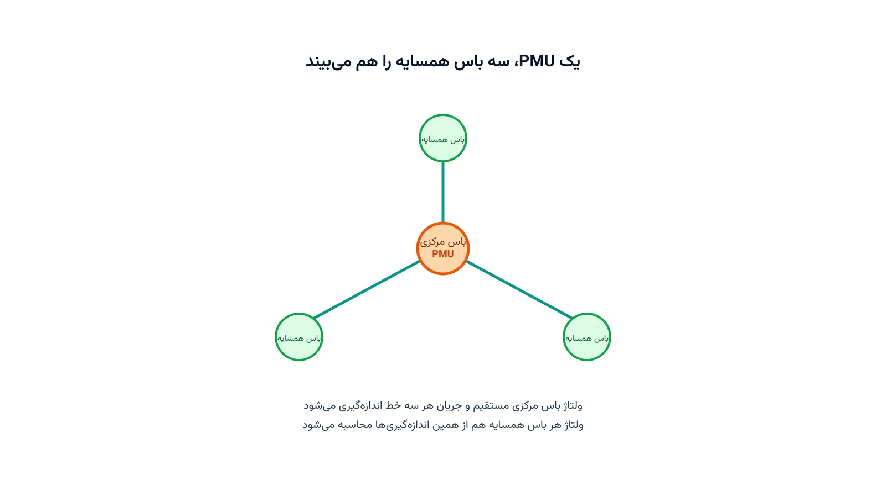

اپراتور شبکه برق شب و روز باید وضعیت لحظه‌ای شبکه را بداند. یک حسگر خاص این کار را ممکن می‌کند: واحد اندازه‌گیری فازوری یا PMU. هر PMU ولتاژ و جریان را با برچسب زمانی GPS ثبت می‌کند. دقت این برچسب زمانی در حد میکروثانیه است. همین دقت، مقایسه لحظه‌ای وضعیت نقاط دور شبکه را ممکن می‌کند. اما نصب PMU روی تک‌تک باس‌های شبکه، هزینه‌ای سنگین دارد. سوال واقعی این است: با کمترین تعداد PMU، چطور کل شبکه دیده شود؟

این پرسش در ادبیات سیستم قدرت، مسئله مکان‌یابی بهینه PMU نام دارد. به‌اختصار آن را OPP می‌نامند. ایده کلیدی این است که هر PMU فقط باس خودش را نمی‌بیند. با اندازه‌گیری جریان روی همه خطوط متصل به آن باس، باس‌های همسایه هم به‌طور غیرمستقیم قابل‌محاسبه می‌شوند. این ویژگی، مسئله را از یک تخصیص ساده به یک مسئله پوششی زیبا تبدیل می‌کند.

## فرمول‌بندی ریاضی مسئله

برای فرمول‌بندی OPP، شبکه را یک گراف می‌بینیم. باس‌ها گره‌اند و خطوط انتقال، یال‌های گراف. متغیر تصمیم $x_i \in \{0,1\}$ نشان می‌دهد آیا در باس $i$ یک PMU نصب می‌شود یا نه. هدف مدل، کمینه‌کردن تعداد کل PMUهای نصب‌شده است:

$$
\min \sum_{i \in N} x_i
$$

$N$ مجموعه همه باس‌های شبکه است. قید اصلی مدل، مشاهده‌پذیری کامل هر باس را تضمین می‌کند. باس $i$ زمانی دیده می‌شود که خودش PMU داشته باشد یا یکی از همسایه‌هایش PMU داشته باشد:

$$
x_i + \sum_{j \in \mathcal{N}(i)} x_j \ge 1 \qquad \forall i \in N
$$

$\mathcal{N}(i)$ مجموعه باس‌های همسایه مستقیم باس $i$ در گراف شبکه است. این فرمول‌بندی، دقیقاً همان مسئله کلاسیک «مجموعه غالب» یا Dominating Set در نظریه گراف است.

در عمل، این مدل پایه معمولاً کامل نیست. برخی باس‌ها هیچ بار یا تولیدی ندارند و باس تزریق-صفر نام دارند. در این باس‌ها، قانون کیرشهف جریان اجازه می‌دهد یک مجهول از روی بقیه محاسبه شود. این ویژگی، تعداد PMU لازم را باز هم کاهش می‌دهد، اما قید بالا را کمی پیچیده‌تر می‌کند.

دو محدودیت واقعی دیگر هم اغلب به مدل اضافه می‌شوند. اول، هر PMU تعداد محدودی کانال جریان دارد و نمی‌تواند همه خطوط یک باس پرشاخه را ببیند. دوم، شبکه باید در برابر از کار افتادن یک PMU هم مقاوم بماند. به این حالت، مشاهده‌پذیری تحت خرابی تک‌واحدی یا N-1 گفته می‌شود. برای تضمین آن، سمت راست قید بالا باید حداقل به دو افزایش یابد، نه یک.

## اهمیت این موضوع

مشاهده‌پذیری کامل شبکه، پایه هر تحلیل لحظه‌ای در اتاق کنترل است. بدون داده فازوری هماهنگ، اپراتور فقط یک عکس تاریخ‌گذشته از شبکه می‌بیند. حالت‌های ناپایدار ولتاژ یا فرکانس ممکن است دقیقه‌ها دیرتر کشف شوند. در شبکه‌های امروزی با نفوذ بالای انرژی خورشیدی و بادی، این تأخیر خطرناک‌تر هم شده. تغییرات سریع تولید تجدیدپذیر، نوسان‌هایی می‌سازد که با پخش‌بار سنتی هر چند دقیقه یک‌بار قابل‌ردیابی نیستند.

بهره‌برداران شبکه‌ای مثل PJM Interconnection در آمریکا، از شبکه گسترده PMU برای پایش لحظه‌ای پایداری و نوسان بین‌ناحیه‌ای استفاده می‌کنند. این داده‌ها به اپراتور کمک می‌کنند نوسان خطرناک را پیش از رسیدن به آستانه بحرانی تشخیص دهد. اما گسترش این شبکه حسگر، بی‌رویه نیست؛ هر PMU نیازمند نصب، ارتباط مخابراتی و نگهداری است. به همین دلیل، انتخاب دقیق محل نصب چند ده PMU در شبکه‌ای با هزاران باس، ارزش اقتصادی مستقیم دارد.

## ظرفیت پژوهشی و آکادمیک

OPP یکی از فعال‌ترین حوزه‌های پژوهشی سیستم قدرت است. پتانسیل خوبی هم برای پایان‌نامه و مقاله دارد. مسیر اول، ترکیب مشاهده‌پذیری توپولوژیک با اندازه‌گیری‌های سنتی SCADA است. به‌جای پوشش کامل با PMU، می‌توان از حسگرهای ارزان‌تر موجود هم کمک گرفت. مسیر دوم، مدل‌سازی مشاهده‌پذیری تحت عدم‌قطعیت توپولوژی شبکه است. این حالت وقتی رخ می‌دهد که برخی خطوط موقتاً از مدار خارج شوند.

مسیر سوم، برنامه‌ریزی مرحله‌ای نصب PMU در افق چندساله است. بودجه هر سال محدود است و باید اولویت باس‌ها تعیین شود. مسیر چهارم، پیوند OPP با جای‌گذاری بهینه مراکز پردازش داده لبه است. این کار تأخیر انتقال حجم بالای داده فازوری را کاهش می‌دهد. سوال دیگر پژوهشی، طراحی الگوریتم‌های تقریبی سریع برای شبکه‌های بسیار بزرگ است، جایی که حل دقیق ILP زمان‌بر می‌شود.



## پیاده‌سازی با پایتون

خبر خوب این است که حل OPP نیازی به نرم‌افزار تجاری گران‌قیمت ندارد. مدل پایه، یک برنامه‌ریزی عدد صحیح دودویی ساده است. کتابخانه متن‌باز [PuLP](https://coin-or.github.io/pulp/) این مدل را می‌نویسد. سالورهای متن‌باز مثل [CBC](https://github.com/coin-or/Cbc) یا [HiGHS](https://highs.dev/) آن را در چند ثانیه حل می‌کنند، حتی برای شبکه‌های با چند صد باس. برای ساخت گراف همسایگی شبکه از روی لیست خطوط، کتابخانه [NetworkX](https://networkx.org/) ابزار طبیعی است. کافی است هر خط انتقال به‌صورت یک یال گراف اضافه شود.

برای تست مدل روی شبکه‌های استاندارد صنعتی، کتابخانه [pandapower](https://www.pandapower.org/) مجموعه‌ای از شبکه‌های آزمون معروف IEEE را آماده در اختیار می‌گذارد. داده‌های توپولوژی این شبکه‌ها را می‌توان مستقیماً به یک لیست همسایگی پایتونی تبدیل کرد. ساختار مدل پایه OPP، از نظر ریاضی به مسئله کلاسیک [مکان‌یابی تسهیلات](/notes/facility-location-problem/) خیلی نزدیک است؛ هر دو یک مسئله پوششی مجموعه‌اند. تفاوت اصلی اینجا، همسایگی مبتنی‌بر گراف شبکه به‌جای فاصله جغرافیایی است.

```python
import pulp
import networkx as nx

# فهرست خطوط انتقال شبکه به‌صورت یال‌های گراف
lines = [(1, 3), (1, 4), (3, 4), (3, 6), (4, 5), (4, 7), (5, 2), (5, 7), (6, 7)]

G = nx.Graph()
G.add_edges_from(lines)
buses = list(G.nodes())

model = pulp.LpProblem("optimal_pmu_placement", pulp.LpMinimize)
install = pulp.LpVariable.dicts("pmu", buses, cat="Binary")

model += pulp.lpSum(install[i] for i in buses)

for i in buses:
    neighbors = list(G.neighbors(i))
    model += install[i] + pulp.lpSum(install[j] for j in neighbors) >= 1

model.solve(pulp.PULP_CBC_CMD(msg=False))

selected = [i for i in buses if install[i].value() == 1]
print(f"تعداد PMU لازم: {len(selected)}")
print(f"باس‌های انتخاب‌شده: {selected}")
```

روی این شبکه هفت‌باسه ساده، سالور معمولاً با فقط دو PMU به مشاهده‌پذیری کامل می‌رسد. در شبکه‌های واقعی با صدها باس، این نسبت تقریباً یک PMU به‌ازای هر سه تا چهار باس است، نه یک به یک. برای اضافه‌کردن قید N-1، کافی است سمت راست هر نامعادله بالا از یک به دو تغییر کند.

## سوالات متداول

<h3>PMU چه فرقی با اندازه‌گیری‌های سنتی SCADA دارد؟</h3>
<p>داده‌های SCADA معمولاً هر چند ثانیه یک‌بار و بدون همگام‌سازی زمانی دقیق جمع‌آوری می‌شوند. PMU با نرخ چند ده تا صد بار در ثانیه و برچسب زمانی GPS کار می‌کند و امکان مقایسه فاز لحظه‌ای بین نقاط دور شبکه را فراهم می‌کند.</p>

<h3>آیا برای مدل‌سازی این نوع مسائل باید مهندس برق باشیم؟</h3>
<p>دانش پایه گراف و برنامه‌ریزی عدد صحیح کافی است، اما آشنایی با مفاهیم شبکه قدرت کمک زیادی می‌کند. دوره <a href="/courses/advanced-power-system/" style="color:#2563EB; font-weight:bold;">بهینه‌سازی پیشرفته سیستم قدرت</a> دقیقاً همین پیوند بین مفاهیم مهندسی برق و مدل‌سازی ریاضی را می‌سازد.</p>

<h3>اگر شبکه واقعی من خیلی بزرگ‌تر از این مثال باشد چه؟</h3>
<p>مدل ILP پایه برای شبکه‌هایی تا چند هزار باس معمولاً در چند ثانیه تا چند دقیقه حل می‌شود. برای مقیاس‌های بزرگ‌تر یا سناریوهای خاص مثل قید N-1 و بودجه‌بندی چندساله، از طریق <a href="/consultation/" style="color:#2563EB; font-weight:bold;">مشاوره</a> می‌توانیم جزئیات شبکه و محدودیت‌های شما را بررسی کنیم.</p>
