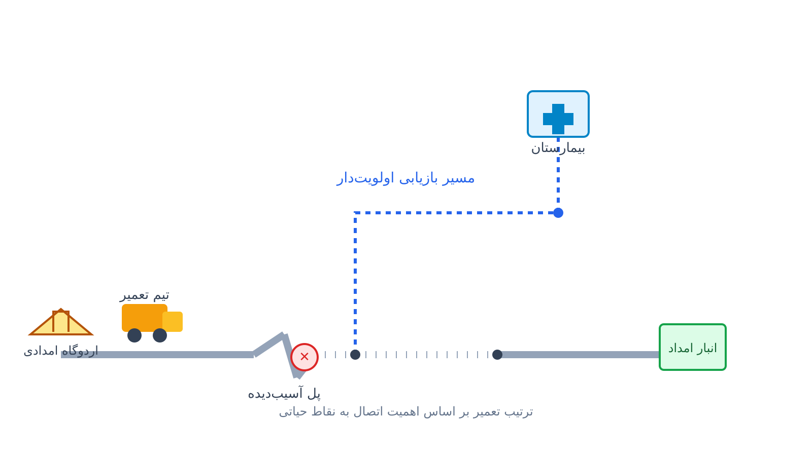

چند ساعت بعد از یک زلزله بزرگ، نقشه‌ی شهر دیگر همان نقشه‌ی همیشگی نیست. چند پل فروریخته و چند جاده‌ی اصلی زیر آوار مانده است. ناگهان شبکه‌ای که تا دیروز همه‌ی نقاط شهر را به هم وصل می‌کرد، به چند جزیره‌ی جدا از هم تبدیل شده است. بیمارستان‌ها هنوز سر جای خودشان هستند، اردوگاه‌های امدادی هم برپا شده‌اند، اما مسیر رسیدن به آن‌ها قطع است. اینجا یک سوال ساده اما حیاتی مطرح می‌شود. تیم‌های تعمیر که تعدادشان محدود است و هر تعمیر ساعت‌ها زمان می‌برد، اول سراغ کدام جاده یا پل بروند؟

این پرسش، با اینکه شبیه بقیه‌ی مسائل لجستیک بحران به نظر می‌رسد، از نظر ساختار ریاضی کاملاً متفاوت است. مسئله‌ی معمول توزیع کمک‌های امدادی درباره‌ی این است که انبار کجا باشد و کامیون‌ها چه مسیری را طی کنند. اما مسئله‌ی بازسازی شبکه درباره‌ی این است که با چه ترتیبی، خودِ زیرساخت آسیب‌دیده را ترمیم کنیم تا اتصال برقرار شود. این یک مسئله‌ی توالی‌بندی روی گراف است، نه فقط یک مسئله‌ی مسیریابی یا مکان‌یابی. همین تفاوت است که آن را به یکی از جالب‌ترین زیرشاخه‌های کمتردیده‌شده‌ی بهینه‌سازی در مدیریت بحران تبدیل می‌کند.

## چرا این موضوع اهمیت دارد

در بیشتر بلایای طبیعی بزرگ، آنچه جان انسان‌ها را نجات می‌دهد صرفاً وجود کمک نیست، بلکه سرعت رسیدن کمک است. اگر یک بیمارستان صحرایی برپا شده باشد ولی جاده‌ی رسیدن به آن سه روز طول بکشد تا باز شود. در این حالت، عملاً آن بیمارستان برای اولین و حیاتی‌ترین ساعات بی‌فایده مانده است. سازمان‌هایی مثل فدراسیون بین‌المللی صلیب سرخ و هلال‌احمر (IFRC) مسئولیت هماهنگی امداد در فاجعه‌های بزرگ را برعهده دارند. این سازمان‌ها همیشه با معمای منابع محدود در برابر تعداد زیاد نقاط آسیب‌دیده روبه‌رو هستند. چند بولدوزر و چند تیم راهسازی در دسترس است، در حالی که ده‌ها قطعه جاده و پل نیاز به بازگشایی دارند.

تصمیم درباره‌ی ترتیب این تعمیرها، چیزی است که معمولاً به‌صورت تجربی و بر پایه‌ی قضاوت میدانی گرفته می‌شود. با این حال، یک مدل بهینه‌سازی ساده می‌تواند این تصمیم را به‌طور قابل‌توجهی بهتر کند.

از منظر اقتصادی هم این مسئله ارزش دارد. هر ساعت تأخیر در اتصال یک منطقه‌ی صنعتی یا یک بندر به شبکه‌ی اصلی، هزینه‌ی مستقیم برای زنجیره‌ی تأمین به همراه دارد. بعد از بلایایی مثل زلزله‌های بزرگ ژاپن یا ترکیه، بخش قابل‌توجهی از هزینه‌ی غیرمستقیم فاجعه از همین قطع ارتباط زیرساختی ناشی می‌شود. این هزینه از خود آسیب اولیه ناشی نمی‌شود، بلکه از قطع همین ارتباط است.

## فرمول‌بندی ریاضی مسئله

شبکه‌ی جاده‌ای را به‌صورت یک گراف در نظر بگیرید. رأس‌های این گراف تقاطع‌ها یا نقاط مهم مثل بیمارستان، انبار امداد و اردوگاه هستند و یال‌ها همان جاده‌ها یا پل‌ها هستند. انتخاب محل همین نقاط حیاتی پیش از بحران، خودش به [مسئله مکان‌یابی تسهیلات](/notes/facility-location-problem/) شباهت دارد. بعد از بلایا، مجموعه‌ای از یال‌ها آسیب‌دیده و غیرقابل‌عبور شده‌اند. برای هر یال آسیب‌دیده‌ی $e$ یک زمان تعمیر $d_e$ مشخص است که به شدت آسیب بستگی دارد. تعدادی تیم تعمیر محدود $K$ نیز در دسترس‌اند که هرکدام در هر لحظه فقط می‌توانند روی یک یال کار کنند.

هدف، پیدا کردن ترتیب تخصیص یال‌ها به تیم‌ها و زمان شروع هر تعمیر است. این کار باید طوری انجام شود که نقاط حیاتی شبکه هرچه زودتر به مبدأ (مثلاً انبار امداد مرکزی) متصل شوند. برای هر نقطه‌ی حیاتی $j$ وزن اهمیت $w_j$ در نظر می‌گیریم که می‌تواند متناسب با جمعیت تحت پوشش یا نوع تسهیلات باشد. زمان اتصال $C_j$ برابر است با آخرین لحظه‌ای که یکی از یال‌های مسیر بازیابی به آن نقطه تمام می‌شود. مسئله را می‌توان به این صورت نوشت:

$$\min \sum_{j \in J} w_j \, C_j$$

$$\text{s.t.} \quad C_j \geq f_e + M(1 - y_{e,j}) \quad \forall e \in P_j,\ \forall j \in J$$

$$f_e = s_e + d_e \quad \forall e \in E$$

$$s_{e'} \geq f_e \ \text{یا} \ s_e \geq f_{e'} \quad \forall e, e' \text{ اختصاص‌یافته به یک تیم}$$

در این قیدها، $s_e$ و $f_e$ به‌ترتیب زمان شروع و پایان تعمیر یال $e$ هستند. $P_j$ مجموعه‌ی یال‌های روی مسیر بازیابیِ انتخاب‌شده برای نقطه‌ی $j$ است. $y_{e,j}$ متغیر دودویی نشان می‌دهد که آیا یال $e$ روی مسیر $j$ قرار دارد. قید سوم همان قید کلاسیک عدم‌همپوشانی دو تعمیر روی یک تیم است که با متغیرهای دودویی ترتیب یا بازه‌های زمانی مدل می‌شود. این ساختار عملاً ترکیبی از یک مسئله‌ی زمان‌بندی ماشین با تکمیل موزون (weighted completion time scheduling) و یک مسئله‌ی اتصال روی گراف است. به همین دلیل نمی‌توان آن را با فرمول‌های استاندارد VRP یا مکان‌یابی تسهیلات حل کرد و به یک مدل اختصاصی نیاز دارد.

## ظرفیت کار آکادمیک و پژوهشی

مسئله‌ی زمان‌بندی بازسازی شبکه (network restoration scheduling) یکی از حوزه‌هایی است که به‌اندازه‌ی مسائل کلاسیک مسیریابی یا مکان‌یابی تسهیلات کاوش نشده است. همین موضوع، آن را به فرصت خوبی برای پایان‌نامه یا مقاله تبدیل کرده است. چند مسیر پژوهشی باز در این حوزه وجود دارد.

یکی مدل‌سازی عدم قطعیت در زمان تعمیر است، چون در عمل مشخص نیست یک پل چقدر واقعاً طول می‌کشد تا تعمیر شود. دیگری هماهنگی چندین سازمان امدادی است که هرکدام تیم تعمیر مستقل دارند و باید تصمیم‌های خود را هماهنگ کنند. مسیر سوم ترکیب این مسئله با تصمیم هم‌زمان توزیع کمک است، یعنی مسیریابی کامیون‌ها روی شبکه‌ای که هنوز در حال بازسازی است. مسیر چهارم طراحی الگوریتم‌های تقریبی سریع است، برای زمانی که در دقایق اول بعد از فاجعه داده‌ها هنوز کامل نیستند. هدف این الگوریتم‌ها تولید یک برنامه‌ی اولیه‌ی قابل‌قبول در همان دقایق اول است.

این مسئله در تقاطع نظریه‌ی گراف، زمان‌بندی و بهینه‌سازی تصادفی قرار دارد. به همین دلیل، ظرفیت خوبی برای انتشار مقاله در مجلات مدیریت بحران و تحقیق در عملیات دارد.

## پیاده‌سازی با پایتون

خبر خوب این است که این مسئله را می‌توان کاملاً با ابزارهای متن‌باز و رایگان پایتون حل کرد. برای این کار هیچ نیازی به نرم‌افزار یا سالور تجاری گران‌قیمت نیست. ساختار شبکه و مسیرهای بازیابی را می‌توان با [NetworkX](https://networkx.org/) ساخت. با همین ابزار، کوتاه‌ترین مسیر باقی‌مانده بین هر نقطه‌ی حیاتی و انبار امداد هم پیدا می‌شود. سپس بخش زمان‌بندی تعمیرات را می‌توان با [OR-Tools](https://developers.google.com/optimization) و به‌ویژه ماژول CP-SAT آن مدل کرد. این ماژول برای همین نوع مسائل برنامه‌ریزی محدودیت بسیار مناسب است.

هر تعمیر یال را می‌توان به‌صورت یک متغیر بازه‌ای (interval variable) تعریف کرد که به یکی از تیم‌های تعمیر اختصاص می‌یابد. قید عدم‌همپوشانی (`AddNoOverlap`) هم برای بازه‌های اختصاص‌یافته به یک تیم اعمال می‌شود. زمان اتصال هر نقطه‌ی حیاتی هم با تابع بیشینه (`AddMaxEquality`) روی زمان پایان یال‌های مسیرش محاسبه می‌شود. تابع هدف هم مجموع موزون همین زمان‌های اتصال است.

داده‌های ورودی این مدل را می‌توان از یک فایل اکسل یا CSV ساده خواند. این فایل شامل ستون‌هایی مثل یال آسیب‌دیده، زمان تخمینی تعمیر، و وزن اهمیت نقاط حیاتی است. همین سادگی ورودی باعث می‌شود تیم‌های امداد میدانی هم بتوانند بدون دانش برنامه‌نویسی عمیق، داده‌های به‌روز را وارد مدل کنند. آن‌ها می‌توانند در چند ثانیه یک برنامه‌ی تعمیر جدید بگیرند. برای مسائل کوچک و متوسط با چند ده یال آسیب‌دیده، سالورهای متن‌باز مثل CP-SAT معمولاً پاسخ سریع می‌دهند. این سالورها در کسری از ثانیه تا چند دقیقه به جواب بهینه یا نزدیک به بهینه می‌رسند. همین سرعت برای تصمیم‌گیری در ساعات اولیه‌ی یک بحران کاملاً کاربردی است.

## سوالات متداول

<h3>آیا این مدل فقط برای زلزله کاربرد دارد؟</h3>

نه. هر بلایایی که شبکه‌ی جاده‌ای، خطوط برق یا خطوط لوله را قطع کند، همین ساختار مسئله را ایجاد می‌کند. این موضوع در بلایایی مثل سیل، طوفان یا رانش زمین هم صادق است. فقط پارامترهای زمان تعمیر و نوع آسیب تغییر می‌کند، ساختار مدل توالی‌بندی همان می‌ماند.

<h3>برای یادگیری عملی این نوع مدل‌سازی با پایتون از کجا شروع کنم؟</h3>

در دوره‌ی <a href="/courses/vrp-python/" style="color:#2563EB; font-weight:bold;">بهینه‌سازی زنجیره تأمین و حمل‌ونقل با پایتون</a> مدل‌های مشابه مسیریابی و زمان‌بندی با OR-Tools و CP-SAT آموزش داده می‌شود. این آموزش به‌صورت پروژه‌محور است و پایه‌ی خوبی برای ساخت مدل‌های اختصاصی‌تری مثل بازسازی شبکه خواهد بود.

<h3>اگر بخواهم همین مدل را برای شبکه یا سازمان خودم پیاده‌سازی کنم چه کار کنم؟</h3>

داده‌های واقعی هر سازمان با هم فرق دارد؛ مثلاً تعداد تیم‌های تعمیر، ساختار شبکه و اولویت‌های محلی متفاوت است. به همین دلیل، بهتر است مدل برای همان شرایط خاص تنظیم شود. می‌توانید برای این تنظیم‌سازی از <a href="/consultation/" style="color:#2563EB; font-weight:bold;">مشاوره</a> استفاده کنید.

