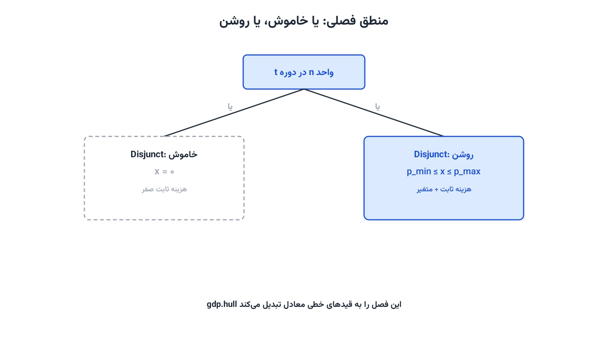

مسئله برنامه‌ریزی روشن-خاموش واحدهای تولید، یا [Unit Commitment](/courses/advanced-power-system/)، یکی از پرکاربردترین مسائل بهینه‌سازی در سیستم قدرت است. در این یادداشت، همین مسئله را با [Pyomo](https://www.pyomo.org/) پیاده‌سازی می‌کنیم؛ یک‌بار با فرمول‌بندی کلاسیک، و یک‌بار با یک تکنیک پیشرفته‌تر به نام برنامه‌ریزی فصلی تعمیم‌یافته یا GDP.

سوال اصلی مسئله ساده است: در هر دوره زمانی، کدام نیروگاه‌ها روشن باشند و هر کدام چقدر تولید کنند؟ هدف، تأمین تقاضای برق با کمترین هزینه ممکن است؛ هم هزینه سوخت متناسب با تولید، و هم هزینه ثابت روشن‌نگه‌داشتن هر واحد.

## صورت مسئله و فرمول‌بندی کلاسیک

مجموعه واحدهای تولید را $N$ و مجموعه دوره‌های زمانی را $T$ می‌نامیم. متغیر $x_{n,t}$ میزان توان تولیدی واحد $n$ در دوره $t$ است. متغیر دودویی $u_{n,t}$ هم نشان می‌دهد آیا آن واحد در آن دوره روشن است یا نه.

تابع هدف، کمینه‌کردن مجموع هزینه متغیر و هزینه ثابت همه واحدها در همه دوره‌هاست:

$$
\min \sum_{n \in N} \sum_{t \in T} \left( a_n x_{n,t} + b_n u_{n,t} \right)
$$

$a_n$ هزینه نهایی تولید هر واحد توان است و $b_n$ هزینه ثابت روشن‌بودن واحد $n$، صرف‌نظر از میزان تولیدش. قید تعادل عرضه و تقاضا، برابری تولید کل با تقاضای همان دوره را تضمین می‌کند:

$$
\sum_{n \in N} x_{n,t} = d_t \qquad \forall t \in T
$$

قید توان کمینه و بیشینه، رفتار نیمه‌پیوسته هر واحد را مدل می‌کند: یا واحد خاموش است و تولیدش صفر، یا روشن است و تولیدش بین یک کف و یک سقف مشخص قرار دارد:

$$
p_n^{min} \, u_{n,t} \le x_{n,t} \le p_n^{max} \, u_{n,t} \qquad \forall n \in N, \; \forall t \in T
$$

این فرمول‌بندی پایه، نسخه ساده‌شده مسئله واقعی است. در عمل، قیدهای مهم دیگری هم اضافه می‌شوند: حداقل زمان روشن‌ماندن و خاموش‌ماندن هر واحد، محدودیت نرخ تغییر توان یا Ramp Rate، و دوره‌های تعمیر برنامه‌ریزی‌شده. این قیدها، بخش فعال و پرکاربرد پژوهش در این حوزه‌اند؛ هرکدام ظرفیت خوبی برای کار دانشگاهی دارند.



## پیاده‌سازی کلاسیک در Pyomo

```python
from pyomo.environ import *
import random

random.seed(2021)
N = 5  # تعداد واحدهای تولید
T = 20  # تعداد دوره‌های زمانی

units = [f"unit_{n}" for n in range(N)]
periods = list(range(T))

demand = {t: random.uniform(100, 200) for t in periods}
a = {n: random.uniform(20, 30) for n in units}
b = {n: random.uniform(100, 500) for n in units}
p_max = {n: 2 * sum(demand.values()) / (T * N) for n in units}
p_min = {n: 0.6 * p_max[n] for n in units}

model = ConcreteModel()
model.x = Var(units, periods, domain=NonNegativeReals)
model.u = Var(units, periods, domain=Binary)

model.cost = Objective(
    expr=sum(a[n] * model.x[n, t] + b[n] * model.u[n, t] for n in units for t in periods),
    sense=minimize,
)

model.demand_con = ConstraintList()
for t in periods:
    model.demand_con.add(sum(model.x[n, t] for n in units) == demand[t])

model.min_power = ConstraintList()
model.max_power = ConstraintList()
for n in units:
    for t in periods:
        model.min_power.add(model.x[n, t] >= p_min[n] * model.u[n, t])
        model.max_power.add(model.x[n, t] <= p_max[n] * model.u[n, t])

solver = SolverFactory('cbc')
solver.solve(model)

print(f"هزینه کل بهینه: {value(model.cost):.1f}")
```

چون متغیر $u_{n,t}$ دودویی است، این دیگر یک مدل خطی ساده نیست؛ یک برنامه‌ریزی خطی عدد صحیح مختلط یا MILP است. سالورهای رایگان مثل [CBC](https://github.com/coin-or/Cbc) و [HiGHS](https://highs.dev/) هر دو از حل مسائل MILP پشتیبانی می‌کنند و برای این مقیاس، در چند ثانیه جواب می‌دهند.

## روش دوم: برنامه‌ریزی فصلی تعمیم‌یافته (GDP)

روش دوم، به‌جای نوشتن مستقیم قیدهای نامعادله با متغیر دودویی، مسئله را با منطق «یا این، یا آن» توصیف می‌کند. واحد تولید یا کاملاً خاموش است (تولید صفر)، یا در بازه مجاز خودش تولید می‌کند. این دقیقاً همان رفتار نیمه‌پیوسته‌ای است که بالاتر توصیف شد، اما این‌بار با یک فصل یا Disjunction بیان می‌شود.

ماژول `pyomo.gdp` دقیقاً برای همین منظور ساخته شده است. هر `Disjunct` یک حالت ممکن را توصیف می‌کند؛ `Disjunction` هم می‌گوید دقیقاً یکی از این حالت‌ها باید برقرار باشد.

```python
from pyomo.environ import *
from pyomo.gdp import Disjunct, Disjunction

model = ConcreteModel()
model.x = Var(units, periods, domain=NonNegativeReals, bounds=(0, max(p_max.values())))

model.off = Disjunct(units, periods)
model.on = Disjunct(units, periods)

for n in units:
    for t in periods:
        model.off[n, t].c = Constraint(expr=model.x[n, t] == 0)
        model.on[n, t].c1 = Constraint(expr=model.x[n, t] >= p_min[n])
        model.on[n, t].c2 = Constraint(expr=model.x[n, t] <= p_max[n])

model.unit_state = Disjunction(
    units, periods,
    rule=lambda m, n, t: [m.off[n, t], m.on[n, t]],
)

model.demand_con = ConstraintList()
for t in periods:
    model.demand_con.add(sum(model.x[n, t] for n in units) == demand[t])

model.cost = Objective(
    expr=sum(a[n] * model.x[n, t] for n in units for t in periods)
    + sum(b[n] * model.on[n, t].indicator_var for n in units for t in periods),
    sense=minimize,
)

TransformationFactory('gdp.hull').apply_to(model)
solver = SolverFactory('cbc')
solver.solve(model)
```

پیش از حل، باید مدل فصلی را به یک مدل معمولی MILP تبدیل کرد. `TransformationFactory('gdp.hull')` دقیقاً همین کار را انجام می‌دهد؛ یعنی هر Disjunction را به مجموعه‌ای از قیدهای خطی معادل تبدیل می‌کند که سالورهای معمولی می‌توانند حلش کنند. گزینه دیگر، `gdp.bigm` است که از روش کلاسیک بیگ-ام استفاده می‌کند.

نکته ظریف اینجا این است که متغیر اندیکاتور هر Disjunct، یعنی `model.on[n, t].indicator_var`، همان نقش متغیر $u_{n,t}$ در فرمول‌بندی کلاسیک را بازی می‌کند. تفاوت اصلی دو روش، در سطح انتزاع است، نه در نتیجه نهایی. روش GDP برای مسائلی با منطق فصلی پیچیده‌تر، مثل چند حالت کارکرد برای هر واحد، خواناتر و قابل‌نگهداری‌تر می‌شود.

## نکات عملی

برای مسائل بزرگ‌تر صنعتی با صدها واحد تولید و هزاران دوره زمانی، تفاوت سرعت بین `gdp.hull` و `gdp.bigm` می‌تواند قابل‌توجه باشد؛ آزمایش هر دو روی داده واقعی توصیه می‌شود. همچنین، اضافه‌کردن قید حداقل زمان روشن‌ماندن معمولاً با یک پنجره لغزان روی متغیر $u_{n,t}$ پیاده می‌شود، نه با یک قید ساده تک‌دوره‌ای.

## جمع‌بندی

Unit Commitment نمونه خوبی است از اینکه چطور یک مسئله واقعی سیستم قدرت، به چند شکل ریاضی متفاوت قابل‌بیان است. اگر می‌خواهید این مهارت را روی مسائل گسترده‌تر سیستم قدرت مثل برنامه‌ریزی توسعه تولید و انتقال تمرین کنید، دوره [بهینه‌سازی پیشرفته سیستم قدرت](/courses/advanced-power-system/) دقیقاً همین مسیر را با پروژه‌های کامل دنبال می‌کند.
