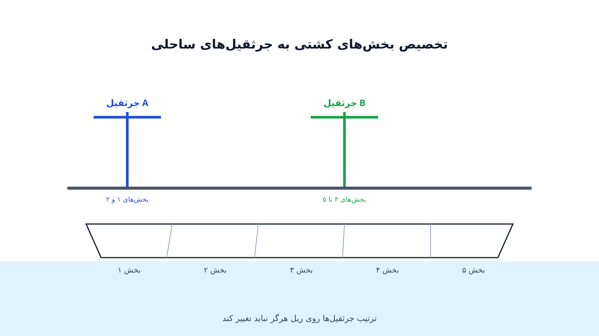

یک کشتی کانتینری بزرگ کنار اسکله لنگر انداخته. چند جرثقیل ساحلی روی همان ریل کنار اسکله حرکت می‌کنند و باید هزاران کانتینر را تخلیه و بارگیری کنند. هر ساعتی که کشتی زودتر اسکله را ترک کند، برای اپراتور بندر و خط کشتیرانی پول واقعی معنا می‌دهد. اما جرثقیل‌ها روی یک ریل مشترک‌اند و نمی‌توانند از کنار هم رد شوند.

این محدودیت ساده، مسئله‌ی «زمان‌بندی جرثقیل اسکله» یا Quay Crane Scheduling را از یک زمان‌بندی معمولی ماشین‌های موازی متفاوت می‌کند. باید تصمیم گرفت کدام بخش از بدنه‌ی کشتی به کدام جرثقیل سپرده شود و با چه ترتیبی کار انجام گیرد، طوری که کل زمان تخلیه و بارگیری کمینه شود.

### چرا این مسئله با زمان‌بندی صنعتی معمولی فرق دارد؟

در بسیاری از مسائل زمان‌بندی کارخانه، ماشین‌ها مستقل از هم کار می‌کنند و محدودیت مکانی خاصی ندارند. جرثقیل‌های ساحلی اما روی یک ریل واحد قرار دارند. اگر جرثقیل شماره دو بخواهد از جرثقیل شماره یک رد شود تا به بخش دیگری از کشتی برسد، این کار فیزیکی ممکن نیست.

به همین دلیل، ترتیب جرثقیل‌ها روی ریل باید همیشه حفظ شود؛ این قید را در ادبیات علمی «قید عدم تقاطع» یا Non-Crossing Constraint می‌نامند. همین یک قید، مسئله را از یک زمان‌بندی ماشین موازی ساده به یک مسئله‌ی ترکیبیاتی پیچیده‌تر تبدیل می‌کند. علاوه بر این، هر جرثقیل باید فاصله‌ی ایمنی مشخصی هم با جرثقیل مجاور حفظ کند.

### فرمول‌بندی ریاضی

فرض کنید بدنه‌ی کشتی به بخش‌های $b \in B$ تقسیم شده؛ هر بخش زمان پردازش $p_b$ دارد که برابر مجموع زمان جابه‌جایی کانتینرهای همان بخش است. مجموعه‌ی جرثقیل‌های در دسترس را $k \in K$ می‌نامیم. متغیر تصمیم $x_{b,k} \in \{0,1\}$ برابر یک است اگر بخش $b$ به جرثقیل $k$ سپرده شود.

هدف مدل، کمینه‌کردن زمان کل تخلیه و بارگیری کشتی است، یعنی زمان اتمام آخرین جرثقیل. این را با متغیر کمکی $T$ نشان می‌دهیم:

$$
\min T
$$

با قید اینکه هر بخش دقیقاً به یک جرثقیل سپرده شود:

$$
\sum_{k \in K} x_{b,k} = 1 \qquad \forall b \in B
$$

با قیدی که $T$ را برابر یا بزرگ‌تر از زمان کاری هر جرثقیل نگه می‌دارد:

$$
T \ge \sum_{b \in B} p_b \, x_{b,k} \qquad \forall k \in K
$$

قید عدم تقاطع به‌صورت ریاضی کمی پیچیده‌تر است. این قید ترتیب بخش‌های اختصاص‌یافته به هر جرثقیل را طوری محدود می‌کند که مسیر جرثقیل‌ها روی ریل هیچ‌گاه از هم عبور نکند. در عمل، این قید معمولاً با متغیرهای ترتیبی اضافه و نامساوی‌های بزرگ‌عدد (Big-M) در مدل عدد صحیح مختلط پیاده می‌شود.

### اهمیت این موضوع در دنیای واقعی

زمان توقف کشتی در بندر یکی از گران‌ترین اقلام هزینه‌ای در حمل‌ونقل دریایی است. اپراتورهای بزرگ بندری مثل DP World، که ده‌ها ترمینال کانتینری در سراسر دنیا اداره می‌کنند، دقیقاً با همین مسئله سروکار دارند. حتی چند دقیقه بهبود در زمان‌بندی جرثقیل، وقتی روی صدها کشتی در سال ضرب شود، صرفه‌جویی قابل‌توجهی ایجاد می‌کند.

از سوی دیگر، خطوط کشتیرانی مثل Maersk هم به شدت به سرعت تخلیه و بارگیری در بنادر مختلف حساس‌اند. تأخیر در یک بندر می‌تواند کل برنامه‌ی زمانی یک مسیر دریایی چندبندری را به هم بریزد. به همین دلیل، بسیاری از قراردادهای بین خطوط کشتیرانی و اپراتورهای بندری، جریمه‌های مالی برای تأخیر در تخلیه دارند.

این فشار اقتصادی باعث شده زمان‌بندی جرثقیل اسکله یکی از پرکاربردترین کاربردهای عملی بهینه‌سازی ترکیبیاتی در صنعت باشد. مدلی که چند دقیقه در روز صرفه‌جویی کند، در طول یک سال میلیون‌ها دلار ارزش ایجاد می‌کند.

### ظرفیت کار آکادمیک و پژوهشی

زمان‌بندی جرثقیل اسکله یکی از حوزه‌های پرمقاله در تلاقی پژوهش عملیاتی و لجستیک بندری است. یک مسیر پژوهشی رایج، طراحی الگوریتم‌های دقیق برای نمونه‌های کوچک و فراابتکاری برای نمونه‌های بزرگ صنعتی است. مسیر دیگر، یکپارچه‌سازی این مسئله با تخصیص اسکله (Berth Allocation) است؛ یعنی تصمیم‌گیری هم‌زمان درباره‌ی محل لنگر کشتی و زمان‌بندی جرثقیل‌ها.

جهت سوم، مدل‌سازی عدم‌قطعیت در زمان پردازش هر بخش است، چون گاهی تجهیزات خراب می‌شوند یا کانتینرها جابه‌جا نیستند. جهت چهارم هم بهینه‌سازی هم‌زمان جرثقیل ساحلی و وسایل نقلیه‌ی داخل بندر است که کانتینرها را به یارد منتقل می‌کنند؛ این ترکیب هنوز فضای پژوهشی باز زیادی دارد.

### پیاده‌سازی با پایتون

خوشبختانه این مدل را می‌توان بدون هیچ نرم‌افزار تجاری گران‌قیمتی پیاده‌سازی کرد. برای نسخه‌ی ساده‌شده با تعداد بخش و جرثقیل محدود، [OR-Tools](https://developers.google.com/optimization) گوگل و ماژول CP-SAT آن به‌خوبی کار می‌کند، چون قید عدم تقاطع را می‌توان با محدودیت‌های ترتیبی طبیعی بیان کرد. برای نسخه‌های عدد صحیح مختلط بزرگ‌تر، سالورهای متن‌باز مثل [CBC](https://github.com/coin-or/Cbc) یا [HiGHS](https://highs.dev/) از طریق [Pyomo](http://www.pyomo.org/) یا [PuLP](https://coin-or.github.io/pulp/) گزینه‌ی مناسبی‌اند.

داده‌های ورودی معمولاً از یک فایل CSV شامل شماره‌ی بخش کشتی، تعداد کانتینر هر بخش و زمان تخمینی پردازش خوانده می‌شود. پس از حل مدل، خروجی یک برنامه‌ی زمانی برای هر جرثقیل است که می‌توان آن را مستقیماً به اپراتورهای بندری تحویل داد. برای تحلیل ساختار مسیر جرثقیل‌ها روی ریل، استفاده از [NetworkX](https://networkx.org/) هم می‌تواند در تجسم توالی و بازه‌های زمانی مفید باشد. اگر علاقه‌مند به مسائل مسیریابی و زمان‌بندی مشابه در زنجیره تأمین هستید، دوره [مسیریابی وسایل نقلیه با پایتون](/courses/vrp-python/) پایه‌ی همین ابزارها را با پروژه‌های عملی آموزش می‌دهد.

### سوالات متداول

<h3>آیا این مدل فقط برای بنادر خیلی بزرگ کاربرد دارد؟</h3>

نه، حتی بنادر متوسط با دو یا سه جرثقیل هم از این مدل سود می‌برند. هرچه تعداد جرثقیل کمتر باشد، هزینه‌ی یک تخصیص ناکارآمد نسبت به کل ظرفیت اسکله بزرگ‌تر می‌شود.

<h3>این نوع مسائل بهینه‌سازی لجستیک و حمل‌ونقل را کجا می‌توان پروژه‌محور یاد گرفت؟</h3>

دوره <a href="/courses/vrp-python/" style="color:#2563EB; font-weight:bold;">مسیریابی وسایل نقلیه با پایتون</a> ابزارها و روش‌های مشابه، از مدل‌سازی تا حل با OR-Tools، را برای مسائل لجستیکی این‌چنینی پوشش می‌دهد.

<h3>برای پیاده‌سازی این مدل روی داده‌های واقعی یک بندر یا ترمینال کانتینری چه باید کرد؟</h3>

چون هر بندر تعداد جرثقیل، سرعت پردازش و محدودیت‌های ایمنی خودش را دارد، بهتر است مدل با بررسی داده‌های واقعی همان ترمینال طراحی شود. از طریق <a href="/consultation/" style="color:#2563EB; font-weight:bold;">مشاوره</a> می‌توانید جزئیات پروژه را مطرح کنید.

