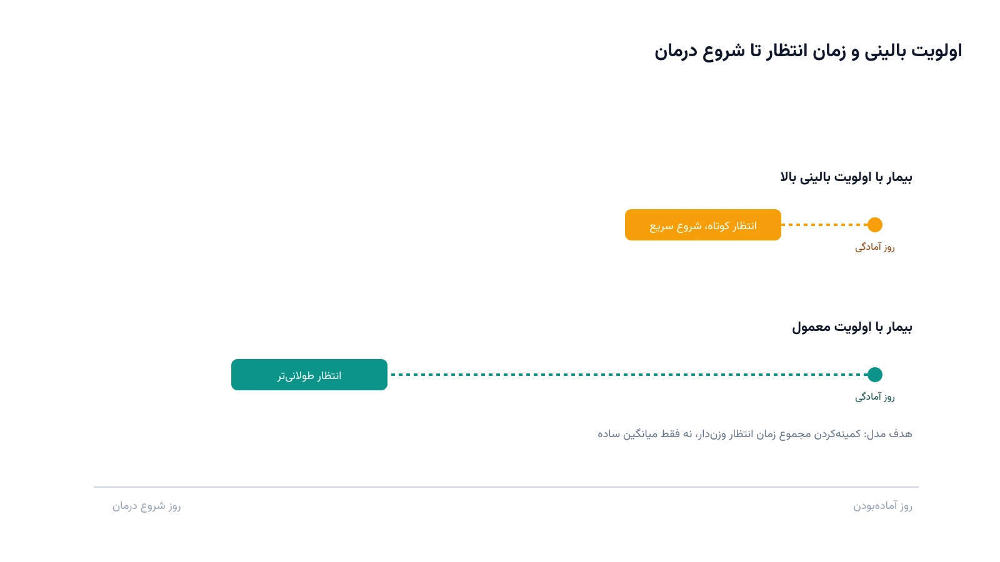

بیماری که تشخیص سرطان می‌گیرد، معمولاً یک سوال فوری دارد. «درمانم از کِی شروع می‌شود؟». پاسخ ساده نیست. هر بیمار یک نوبت تنها نمی‌خواهد. او به یک دوره طولانی از جلسات روزانه پیاپی نیاز دارد. گاهی پانزده جلسه، گاهی سی‌وپنج جلسه. هر روز، روی یک دستگاه شتاب‌دهنده خطی مشخص. این دستگاه‌ها گران، محدود و پرتقاضا هستند. تصمیم اینکه چه کسی زودتر شروع کند، دقیقاً یک مسئله بهینه‌سازی زمان‌بندی است.

نکته‌ای این مسئله را از بقیه مسائل زمان‌بندی سلامت متمایز می‌کند. زمان‌بندی اتاق عمل یا صندلی شیمی‌درمانی درباره یک نوبت مجزا در یک روز تصمیم می‌گیرد. رادیوتراپی برعکس است. وقتی بیمار شروع کرد، تقریباً هر روز کاری تا پایان دوره روی همان دستگاه حاضر می‌شود. این پیوستگی چندهفته‌ای، مسئله را به تخصیص بازه (Interval Scheduling) نزدیک می‌کند، نه تخصیص نوبت ساده. دوره [بهینه‌سازی سیستم‌های سلامت با پایتون](/courses/health-opt/) هر دو نوع مسئله را از این زاویه بررسی می‌کند.

## فرمول‌بندی ریاضی مسئله

مجموعه بیماران $P$ در انتظار شروع درمان هستند. مجموعه دستگاه‌های شتاب‌دهنده خطی هم $M$ نام دارد. هر بیمار $p$ از روز آماده‌بودنش $r_p$ به بعد قابل شروع است. او باید دقیقاً $n_p$ روز کاری پیاپی درمان شود، بدون وقفه. این درمان روی یکی از دستگاه‌های سازگارش $M_p \subseteq M$ انجام می‌شود. هر دستگاه $m$ هم در هر روز $d$ ظرفیت محدود $K_{m,d}$ دارد.

متغیر تصمیم دودویی $x_{p,m,d}$ برابر یک است، اگر بیمار $p$ درمانش را از روز $d$ روی دستگاه $m$ شروع کند. با این تعریف، بیمار روزهای $d$ تا $d+n_p-1$ را روی همان دستگاه اشغال می‌کند. هدف، کمینه‌کردن مجموع زمان انتظار وزن‌دار بیماران تا شروع درمان است. وزن $w_p$ اولویت بالینی هر بیمار را نشان می‌دهد.

$$
\min \; \sum_{p \in P} \sum_{m \in M_p} \sum_{d \geq r_p} w_p \,(d - r_p)\, x_{p,m,d}
$$

هر بیمار باید دقیقاً یک بار شروع شود، روی یک دستگاه سازگار و از یک روز مشخص.

$$
\sum_{m \in M_p} \sum_{d \geq r_p} x_{p,m,d} = 1 \quad \forall p \in P
$$

در هر روز، تعداد بیمارانی که آن روز را در بازه فعال درمانشان دارند، نباید از ظرفیت دستگاه بیشتر شود.

$$
\sum_{p \in P} \sum_{d' = d-n_p+1}^{d} x_{p,m,d'} \leq K_{m,d} \quad \forall m \in M, \; \forall d
$$

این ساختار، همان چیزی است که در ادبیات زمان‌بندی قید تجمعی (Cumulative Constraint) نامیده می‌شود. هر بیمار یک بازه زمانی با طول ثابت اشغال می‌کند. مجموع تقاضا روی هر دستگاه، در هر لحظه، نباید از ظرفیتش عبور کند.

## چرا این موضوع مهم است

تأخیر در شروع رادیوتراپی صرفاً یک مزاحمت اداری نیست. در بسیاری از سرطان‌ها، هر هفته تأخیر اضافه می‌تواند روی نتیجه درمانی بیمار اثر بگذارد. از طرف دیگر، دستگاه شتاب‌دهنده خطی یکی از گران‌ترین تجهیزات یک مرکز رادیوتراپی است. نمی‌توان به‌سادگی ظرفیت را افزایش داد. شرکتی مثل Varian Medical Systems یکی از بزرگ‌ترین تولیدکنندگان جهانی این دستگاه‌هاست. چنین شرکت‌هایی معمولاً نرم‌افزار برنامه‌ریزی درمان را هم کنار خود دستگاه عرضه می‌کنند. تنگنای ظرفیت برای مراکز درمانی همیشه چالش اصلی است.

چالش دوم، ناهمگونی بیماران است. برخی بیماران فقط با یک تکنیک درمانی خاص سازگارند. برخی دیگر باید فوراً و با اولویت بالا شروع شوند. مدل بهینه‌سازی بالا هر دو محدودیت را هم‌زمان لحاظ می‌کند. زمان‌بندی دستی یا اکسل‌محور معمولاً فقط یکی از این ابعاد را می‌بیند. نتیجه عملی این بهینه‌سازی، کاهش میانگین زمان انتظار است. توزیع تأخیر بین بیماران کم‌اولویت‌تر هم عادلانه‌تر می‌شود، بدون هیچ هزینه اضافه روی تجهیزات.

## ظرفیت پژوهشی و آکادمیک

زمان‌بندی رادیوتراپی یکی از حوزه‌های فعال تحقیق در عملیات سلامت است. هم پیچیدگی ترکیبیاتی واقعی دارد و هم داده واقعی مراکز درمانی برای اعتبارسنجی مدل در دسترس است. یک مسیر پژوهشی باز، مدل‌سازی عدم‌قطعیت زمان هر جلسه است. طول واقعی هر نشست درمانی می‌تواند به دلیل وضعیت بیمار کمی تغییر کند و ظرفیت روزانه را به‌هم بزند. مسیر دیگر، ادغام تصمیم زمان‌بندی با تخصیص پرسنل فیزیک پزشکی و تکنسین است. محدودیت نیروی انسانی گاهی به‌اندازه ظرفیت دستگاه تعیین‌کننده است.

جهت سوم، زمان‌بندی پویا و بازبرنامه‌ریزی است. بیماران اورژانسی جدید هرروز وارد سیستم می‌شوند. باید بدون به‌هم‌ریختن کامل برنامه بیماران در حال درمان جا داده شوند. این نسخه پویا از مسئله به الگوریتم‌های آنلاین و بازبهینه‌سازی افقی محدود (Rolling Horizon) نیاز دارد. این ترکیب از بهینه‌سازی ترکیبیاتی و تحقیق در عملیات سلامت، موضوع خوبی برای پایان‌نامه یا مقاله است.

## پیاده‌سازی با پایتون

خبر خوب این است که چنین مدلی، حتی برای چند ده بیمار و چند دستگاه، با ابزارهای متن‌باز و رایگان پایتون کاملاً قابل حل است. نیازی به سالورهای تجاری گران‌قیمت نیست. ماژول CP-SAT از کتابخانه [OR-Tools](https://developers.google.com/optimization) گوگل برای این نوع مسئله بسیار مناسب است. قید تجمعی که در فرمول‌بندی بالا دیدیم، در آن به‌صورت آماده پیاده‌سازی شده است. داده‌های بیماران و ظرفیت روزانه دستگاه‌ها را می‌توان از یک فایل اکسل یا CSV خواند. این فایل شامل ستون‌های روز آمادگی، طول دوره درمان، اولویت بالینی و دستگاه‌های سازگار است.

در عمل، برای هر بیمار به ازای هر دستگاه سازگارش، یک بازه زمانی اختیاری تعریف می‌شود. طول این بازه برابر تعداد جلسات درمانی همان بیمار است. فقط یکی از این بازه‌ها در نهایت فعال می‌ماند.

سپس با یک قید تجمعی آماده در کتابخانه، ظرفیت روزانه هر دستگاه اعمال می‌شود. این دقیقاً مطابق همان قیدی است که در فرمول‌بندی بالا دیدیم. تابع هدف هم مجموع زمان انتظار وزن‌دار همه بیماران تا شروع درمانشان را کمینه می‌کند. سالور CP-SAT در نهایت بهترین ترکیب روز شروع و دستگاه را برای هر بیمار انتخاب می‌کند. برای مسائل واقعی با صدها بیمار، همین ساختار با افزودن قیود نیروی انسانی و بازبرنامه‌ریزی روزانه قابل گسترش است. آشنایی با این تکنیک‌های زمان‌بندی محدودیت در یادداشت [زمان‌بندی کارگاه با CP-SAT](/notes/job-shop-scheduling-cp-sat/) هم با جزئیات بیشتری آمده است.

## سوالات متداول

<h3>چه تفاوتی بین زمان‌بندی رادیوتراپی و زمان‌بندی اتاق عمل یا صندلی شیمی‌درمانی وجود دارد؟</h3>

زمان‌بندی اتاق عمل و صندلی شیمی‌درمانی درباره یک نوبت مجزا در یک روز تصمیم می‌گیرند. رادیوتراپی یک دوره پیوسته چندهفته‌ای است. هر بیمار باید تقریباً هر روز کاری تا پایانش روی همان دستگاه حاضر شود. این تفاوت، مسئله را به زمان‌بندی بازه با قید تجمعی نزدیک‌تر می‌کند. دوره <a href="/courses/health-opt/" style="color:#2563EB; font-weight:bold;">بهینه‌سازی سیستم‌های سلامت با پایتون</a> هر دو نوع مسئله را با جزئیات پوشش می‌دهد.

<h3>آیا می‌توان این مدل را بدون نرم‌افزار تجاری گران‌قیمت پیاده‌سازی کرد؟</h3>

بله. ماژول CP-SAT از OR-Tools کاملاً رایگان و متن‌باز است. قید تجمعی مورد نیاز این مدل، به‌صورت آماده در آن پشتیبانی می‌شود. برای مقیاس یک مرکز رادیوتراپی معمولی هم کاملاً کافی است.

<h3>اگر بخواهیم این مدل را برای مرکز درمانی خودمان با محدودیت‌های واقعی‌تر پیاده‌سازی کنیم چه کار کنیم؟</h3>

هر مرکز درمانی محدودیت‌های خاص خودش را دارد، از نوع دستگاه‌ها تا قوانین نیروی انسانی و اولویت‌بندی بالینی. برای طراحی و پیاده‌سازی اختصاصی چنین مدلی می‌توانید از طریق <a href="/consultation/" style="color:#2563EB; font-weight:bold;">مشاوره</a> وضعیت دقیق مرکز خودتان را مطرح کنید.

