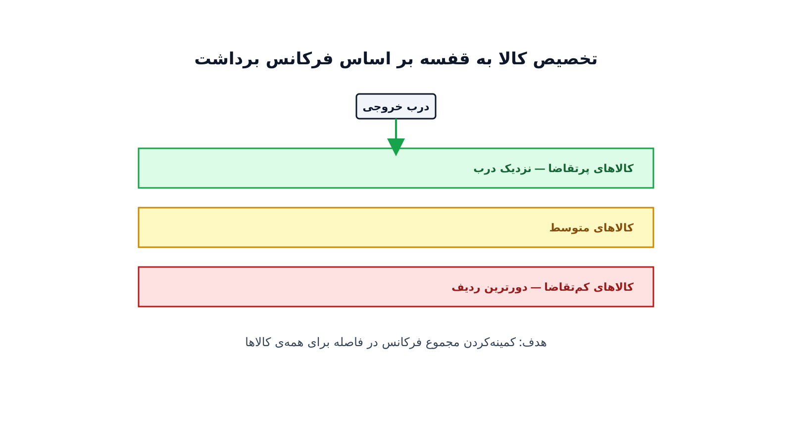

یک انبار پخش بزرگ را تصور کنید که روزانه هزاران سفارش را آماده و ارسال می‌کند. اپراتورهای پیکینگ با گاری بین ردیف‌های قفسه راه می‌روند تا کالای هر سفارش را جمع کنند. اگر پرتقاضاترین کالاها ته انبار و دور از درب خروجی چیده شده باشند، همین رفت‌وآمدهای اضافه هر روز ساعت‌ها زمان تلف می‌کند.

این دقیقاً مسئله‌ای است که در لجستیک انبار به آن «تخصیص مکان قفسه» یا Storage Location Assignment Problem گفته می‌شود. سوال ساده است: کدام کالا در کدام قفسه باشد؟ اما پاسخ درست به این سوال، مستقیماً روی سرعت پیکینگ، هزینه‌ی نیروی انسانی و حتی رضایت مشتری از سرعت ارسال اثر می‌گذارد.

### چرا این مسئله با مکان‌یابی انبار فرق دارد؟

مکان‌یابی تسهیلات درباره‌ی این تصمیم است که خودِ انبار یا مرکز توزیع کجا ساخته شود. این تصمیم در مقیاس شهر یا کشور گرفته می‌شود و به‌ندرت تغییر می‌کند. چیدمان انبار اما درباره‌ی داخل همان انبار است؛ اینکه هر کالا در کدام قفسه‌ی مشخص قرار بگیرد.

تفاوت مهم دیگر، بازه‌ی زمانی تصمیم است. چیدمان انبار می‌تواند هر چند ماه یک بار، حتی هر فصل، بازبینی شود، چون الگوی تقاضای کالاها تغییر می‌کند. کالایی که پارسال پرفروش بود، امسال شاید کم‌تقاضا شده باشد. به همین دلیل این مسئله باید به‌صورت یک مدل تکرارپذیر طراحی شود، نه یک تصمیم یک‌باره.

### فرمول‌بندی ریاضی

فرض کنید مجموعه‌ی کالاها $i \in I$ و مجموعه‌ی مکان‌های قفسه $j \in J$ را داریم. هر کالا فرکانس برداشت $f_i$ دارد؛ یعنی به‌طور میانگین چند بار در روز از انبار برداشته می‌شود. هر مکان قفسه هم فاصله‌ی $d_j$ تا درب خروجی یا ایستگاه بسته‌بندی دارد. متغیر تصمیم $x_{ij} \in \{0,1\}$ برابر یک است اگر کالای $i$ در مکان $j$ چیده شود.

هدف مدل، کمینه‌کردن کل مسافت روزانه‌ی طی‌شده برای پیکینگ است:

$$
\min \sum_{i \in I} \sum_{j \in J} f_i \, d_j \, x_{ij}
$$

با قید اینکه هر کالا دقیقاً به یک مکان قفسه تخصیص یابد:

$$
\sum_{j \in J} x_{ij} = 1 \qquad \forall i \in I
$$

و قید اینکه هر مکان قفسه حداکثر یک کالا را در خود جای دهد:

$$
\sum_{i \in I} x_{ij} \le 1 \qquad \forall j \in J
$$

این فرمول‌بندی ساده، همان مسئله‌ی کلاسیک تخصیص خطی است، اما با یک بینش کلیدی: چون هدف کمینه‌کردن حاصل‌ضرب فرکانس در فاصله است، جواب بهینه همیشه کالاهای پرتقاضا را نزدیک‌ترین قفسه‌ها به درب خروجی می‌نشاند. در عمل، محدودیت‌های واقعی‌تری مثل حجم هر کالا، وزن مجاز هر قفسه و الزامات ایمنی نگهداری هم به مدل اضافه می‌شوند.

### اهمیت این موضوع در دنیای واقعی

هزینه‌ی نیروی انسانی پیکینگ، بخش بزرگی از هزینه‌ی عملیاتی هر مرکز توزیع است. شرکت‌هایی مثل آمازون در مراکز تحقق سفارش خود، و شرکت‌های لجستیکی بزرگ مثل DHL Supply Chain، سال‌هاست روی بهینه‌سازی چیدمان انبار سرمایه‌گذاری می‌کنند. حتی کاهش چند درصدی در مسافت پیکینگ، وقتی روی میلیون‌ها سفارش سالانه ضرب شود، صرفه‌جویی چشمگیری ایجاد می‌کند.

فروشگاه‌های زنجیره‌ای بزرگ هم با همین مسئله روبه‌رو هستند، به‌ویژه در فصل‌هایی که الگوی تقاضا سریع تغییر می‌کند. شرکتی مثل ایکیا، که انبارهای توزیع بزرگی برای پشتیبانی از فروشگاه‌هایش اداره می‌کند، دقیقاً باید به‌طور مداوم چیدمان کالاهای پرفروش فصلی را بازبینی کند.

از منظر رقابتی هم، سرعت ارسال سفارش امروز یکی از مهم‌ترین عوامل رضایت مشتری در تجارت الکترونیک است. انباری که کالا را سریع‌تر پیدا و بسته‌بندی کند، می‌تواند تعهدات تحویل سریع‌تری به مشتری بدهد، بدون آنکه نیروی انسانی بیشتری استخدام کند.

### ظرفیت کار آکادمیک و پژوهشی

تخصیص مکان قفسه یکی از مسائل کلاسیک و در عین حال هنوز فعال در پژوهش عملیاتی لجستیک است. یک مسیر پژوهشی، ترکیب این مدل با مسیریابی داخل انبار (Order Picking Routing) است؛ یعنی نه‌فقط اینکه کالا کجا باشد، بلکه چه مسیری برای جمع‌آوری چند کالای یک سفارش بهینه است. مسیر دیگر، مدل‌سازی پویا و آنلاین چیدمان است که با تغییر الگوی تقاضا، پیشنهاد جابه‌جایی کالاها را خودکار تولید می‌کند.

جهت سوم، در نظر گرفتن هم‌بستگی سفارش‌ها (Order Correlation) است؛ یعنی کالاهایی که معمولاً با هم سفارش داده می‌شوند، نزدیک هم چیده شوند تا مسیر پیکینگ کوتاه‌تر شود. این جهت پیوند نزدیکی با تحلیل داده و یادگیری ماشین هم دارد، چون الگوی هم‌بستگی باید از داده‌های تاریخی سفارش استخراج شود.

### پیاده‌سازی با پایتون

خبر خوب این است که این مدل تخصیص را می‌توان بدون هیچ نرم‌افزار تجاری گران‌قیمتی پیاده‌سازی کرد. چون ساختار مسئله یک تخصیص خطی کلاسیک است، هم [OR-Tools](https://developers.google.com/optimization) گوگل و هم سالورهای متن‌باز مثل [CBC](https://github.com/coin-or/Cbc) از طریق [PuLP](https://coin-or.github.io/pulp/) به‌سرعت آن را حل می‌کنند. برای انبارهای بزرگ با ده‌ها هزار کالا، الگوریتم مجارستانی (Hungarian Algorithm) هم گزینه‌ی سریع و دقیقی است.

داده‌های ورودی معمولاً از یک فایل CSV شامل کد کالا، فرکانس برداشت روزانه و مشخصات فیزیکی هر کالا خوانده می‌شوند. فاصله‌ی هر مکان قفسه تا درب خروجی هم از نقشه‌ی انبار قابل استخراج است. برای تحلیل و مصورسازی مسیرهای پیکینگ، استفاده از [کتابخانه‌ی NetworkX](https://networkx.org/) می‌تواند در بررسی ساختار راهروهای انبار مفید باشد. اگر به مسائل مشابه در مسیریابی و زنجیره‌ی تأمین علاقه دارید، دوره [مسیریابی وسایل نقلیه با پایتون](/courses/vrp-python/) پایه‌ی همین ابزارهای بهینه‌سازی را با پروژه‌های عملی آموزش می‌دهد.

### سوالات متداول

<h3>آیا این مدل فقط برای انبارهای خیلی بزرگ کاربرد دارد؟</h3>

نه، حتی انبارهای کوچک‌تر با چند صد قلم کالا هم از این مدل سود می‌برند. هرچه تعداد سفارش روزانه بیشتر باشد، اثر تجمعی یک چیدمان بهتر هم بزرگ‌تر می‌شود.

<h3>این نوع مسائل بهینه‌سازی زنجیره‌ی تأمین را کجا می‌توان پروژه‌محور یاد گرفت؟</h3>

دوره <a href="/courses/vrp-python/" style="color:#2563EB; font-weight:bold;">مسیریابی وسایل نقلیه با پایتون</a> ابزارها و روش‌های مشابه، از مدل‌سازی تا حل با OR-Tools، را برای مسائل لجستیکی این‌چنینی پوشش می‌دهد.

<h3>برای پیاده‌سازی این مدل روی داده‌های واقعی یک انبار یا مرکز توزیع چه باید کرد؟</h3>

چون هر انبار طرح‌بندی، حجم کالا و الگوی تقاضای خودش را دارد، بهتر است مدل با بررسی داده‌های واقعی همان انبار طراحی شود. از طریق <a href="/consultation/" style="color:#2563EB; font-weight:bold;">مشاوره</a> می‌توانید جزئیات پروژه را مطرح کنید.

