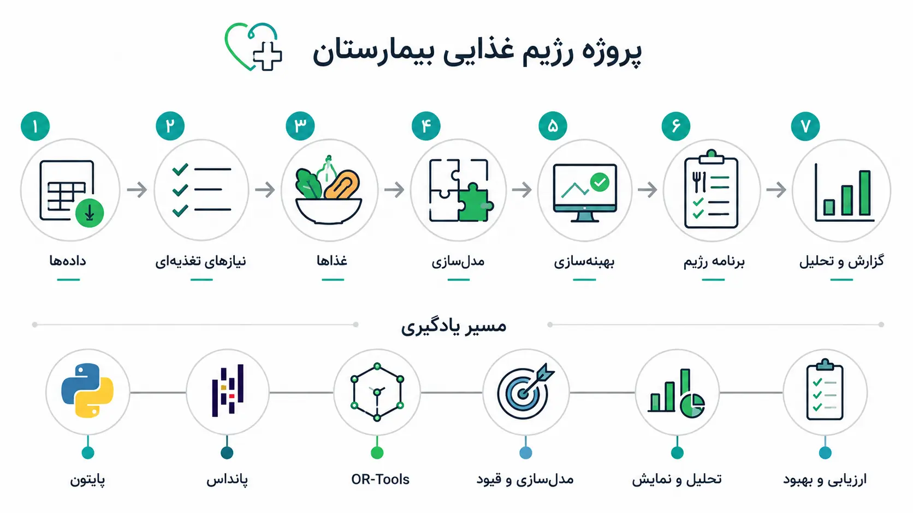
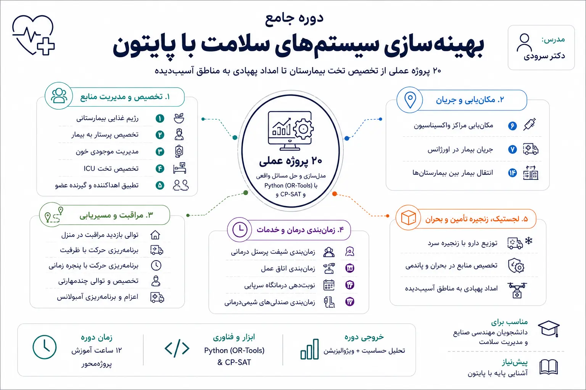

---
# === متغیرهای اصلی و سئو ===
title: "دوره جامع بهینه‌سازی سیستم‌های سلامت با پایتون"
description: "دوره جامع و پروژه‌محور بهینه‌سازی در حوزه سلامت و درمان با Python و OR-Tools؛ ۲۰ پروژه عملی از تخصیص تخت بیمارستان تا امداد پهپادی به مناطق آسیب‌دیده."
pubDate: 2026-08-15
minimalImage: "./health-opt-mini.webp"
minimalImageAlt: "تصویر مینیمال آیکون بهینه‌سازی سلامت"
image: "./health-opt-cover.webp"
imageAlt: "کاور دوره آموزشی بهینه‌سازی سیستم‌های سلامت با پایتون"
# === متغیرهای اختصاصی دوره ===
duration: "۱۲ ساعت"
level: "مقدماتی تا پیشرفته"
environment: "Python (OR-Tools)"
prerequisite: "آشنایی پایه با زبان برنامه‌نویسی پایتون"
sessions: "۲۰ پروژه عملی"
instructor: "dr-soroudi"
# === ارتباطات و ساختار سایت ===
relatedCourses: ["vrp-python", "optimization-modeling", "uncertainty-modeling"]
relatedNotes: ["mathematical-modeling-art", "google-colab", "excel-python-io"]
tags: ["بهینه‌سازی سلامت", "Python", "OR-Tools", "بهینه‌سازی ترکیبی", "مدیریت بیمارستان"]
---

<!-- بخش اول: معرفی دوره -->
<section id="intro" class="scroll-mt-28">

## معرفی دوره

این دوره یک مسیر آموزشی **پروژه‌محور** برای یادگیری مدل‌سازی و پیاده‌سازی مسائل بهینه‌سازی در حوزه‌ی سلامت و درمان با Python است. دوره شامل **۲۰ پروژه‌ی عملی** و حدود **۱۲ ساعت ویدیوی آموزشی** است. همه‌ی پروژه‌ها با کتابخانه‌ی **OR-Tools** و سالور **CP-SAT** پیاده‌سازی شده‌اند و از سطح مقدماتی (تخصیص و موجودی) آغاز می‌شوند و به‌تدریج وارد مسائل ترکیبی‌تر برنامه‌ریزی حرکت پرسنل، زمان‌بندی منابع درمانی، و در نهایت یک پروژه‌ی جمع‌بندی با محوریت امداد پهپادی می‌شوند.

**هر پروژه شامل پنج بخش ثابت است** که در همه‌ی ۲۰ درس تکرار می‌شود:

1. **چرا مهم است** — کاربرد واقعی مسئله در نظام سلامت
2. **چه یاد می‌گیرید** — مفهوم مدل‌سازی و ابزار CP-SAT مرتبط
3. **توضیح خط‌به‌خط کد** — کد کامل پروژه با تفسیر هر بخش
4. **تحلیل حساسیت** — بررسی اینکه تغییر پارامترهای کلیدی (ظرفیت، بودجه، تعداد پرسنل و ...) چطور روی جواب بهینه اثر می‌گذارد
5. **ویژوالیزیشن + ورودی/خروجی اکسل** — خواندن داده از فایل Excel، حل مسئله، و نوشتن/رسم نتایج (نمودار، نقشه، گانت — بسته به نوع پروژه)

</section>

---

<!-- بخش دوم: سرفصل‌های دوره -->
<section id="syllabus" class="scroll-mt-28">

## پروژه‌های دوره

### بخش اول — ۸ پروژه‌ی پایه (مفاهیم بنیادی در بستر سلامت)

این بخش پایه‌ی مدل‌سازی مسائل ترکیبی را با مثال‌های واقعی از دنیای درمان می‌سازد.

### <i class="fa-solid fa-utensils"></i> پروژه ۱ — رژیم غذایی بیمارستانی (Diet Problem)

**چرا مهم است —** هزینه‌ی غذای بیمارستانی سرشکن روی هزاران وعده در سال است؛ حتی صرفه‌جویی جزئی روزانه، در مقیاس سالانه رقم بزرگی می‌شود.

**چه یاد می‌گیرید —** یکی از قدیمی‌ترین و آموزنده‌ترین مسائل LP (همان مسئله‌ای که سیمپلکس را معروف کرد): انتخاب مقدار هر ماده‌ی غذایی به‌گونه‌ای که همه‌ی نیازهای تغذیه‌ای (کالری، پروتئین، ویتامین) پوشش داده شود و هزینه‌ی کل کمینه شود.

- توضیح خط‌به‌خط تعریف متغیرهای پیوسته و قیود تغذیه‌ای در CP-SAT/LP
- تحلیل حساسیت: اگر قیمت یک ماده‌ی غذایی ۲۰٪ گران شود، رژیم بهینه چقدر تغییر می‌کند؟
- ویژوالیزیشن: نمودار میله‌ای ترکیب رژیم غذایی پیشنهادی در برابر نیاز روزانه
- ورودی از اکسل: جدول مواد غذایی (قیمت، ارزش غذایی)؛ خروجی: برگه‌ی رژیم پیشنهادی

### <i class="fa-solid fa-user-nurse"></i> پروژه ۲ — تخصیص پرستار به بیمار (Nurse-Patient Assignment)

**چرا مهم است —** تخصیص نامناسب پرستار به بیمار (مثلاً پرستار بدون مهارت مراقبت ویژه برای بیمار ICU) مستقیماً روی کیفیت و ایمنی مراقبت اثر می‌گذارد.

**چه یاد می‌گیرید —** مسئله‌ی تخصیص کلاسیک با قید تطابق مهارت: هر بیمار باید به پرستاری با مهارت کافی برسد و بار کاری هر پرستار متعادل بماند.

- توضیح خط‌به‌خط `AddExactlyOne` و `AtMostOne` برای تخصیص
- تحلیل حساسیت: افزودن یک پرستار کم‌تجربه‌تر چه اثری روی امکان‌پذیری کلی دارد؟
- ویژوالیزیشن: نمودار حرارتی (heatmap) تخصیص پرستار-بیمار
- ورودی/خروجی اکسل: ماتریس مهارت پرستاران و لیست بیماران از یک فایل xlsx

### <i class="fa-solid fa-droplet"></i> پروژه ۳ — مدیریت موجودی خون (Blood Bank Inventory)

**چرا مهم است —** کیسه‌ی خون یک کالای فسادپذیر و گاهی کمیاب است؛ مدیریت ضعیف موجودی یعنی یا کمبود در بحران یا دورریز پرهزینه.

**چه یاد می‌گیرید —** مدل‌سازی موجودی با تاریخ انقضا و سیاست FIFO (اول واردشده، اول مصرف‌شده) برای کمینه‌کردن دورریز و کمبود هم‌زمان.

- توضیح خط‌به‌خط قیود موجودی چنددوره‌ای و اولویت مصرف بر اساس تاریخ انقضا
- تحلیل حساسیت: افزایش تقاضای اهدای خون ۱۰٪ چه تأثیری روی نرخ دورریز دارد؟
- ویژوالیزیشن: نمودار سطح موجودی در طول زمان به‌تفکیک گروه خونی
- ورودی/خروجی اکسل: ثبت روزانه‌ی اهدا و مصرف در فایل اکسل

### <i class="fa-solid fa-bed-pulse"></i> پروژه ۴ — تخصیص تخت ICU (ICU Bed Allocation)

**چرا مهم است —** در روزهای پرفشار، تخصیص عادلانه و اولویت‌بندی‌شده‌ی تخت‌های محدود ICU می‌تواند تفاوت میان زندگی و مرگ باشد.

**چه یاد می‌گیرید —** نسخه‌ی اولویت‌دار مسئله‌ی کوله‌پشتی: به‌جای «ارزش»، از شاخص شدت بیماری (مثلاً APACHE score) استفاده می‌کنیم.

- توضیح خط‌به‌خط تابع هدف وزن‌دار بر اساس اولویت بالینی
- تحلیل حساسیت: اضافه‌شدن دو تخت موقت چقدر لیست انتظار را کوتاه می‌کند؟
- ویژوالیزیشن: نمودار اشغال تخت‌ها به تفکیک اولویت
- ورودی/خروجی اکسل: لیست بیماران در انتظار با شدت بیماری از اکسل

### <i class="fa-solid fa-syringe"></i> پروژه ۵ — مکان‌یابی مراکز واکسیناسیون (Vaccination Site Location)

**چرا مهم است —** انتخاب بد مکان مراکز واکسیناسیون یعنی برخی مناطق پوشش کافی نمی‌گیرند و منابع هدر می‌رود.

**چه یاد می‌گیرید —** مسئله‌ی کلاسیک Facility Location: کدام مراکز باز شوند تا با کمترین هزینه، بیشترین جمعیت پوشش داده شود.

- توضیح خط‌به‌خط مدل باز/بسته‌بودن مکان + تخصیص جمعیت به نزدیک‌ترین مرکز باز
- تحلیل حساسیت: اگر بودجه‌ی باز کردن یک مرکز جدید نصف شود، پوشش جمعیتی چقدر افت می‌کند؟
- ویژوالیزیشن: نقشه‌ی نقاط پوشش‌داده‌شده و مراکز انتخابی
- ورودی/خروجی اکسل: مختصات مناطق و جمعیت هرکدام از فایل اکسل

### <i class="fa-solid fa-diagram-project"></i> پروژه ۶ — جریان بیمار در اورژانس (ED Patient Flow)

**چرا مهم است —** ازدحام اورژانس یکی از رایج‌ترین علل نارضایتی بیمار و تأخیر درمان است؛ شناخت گلوگاه‌های جریان، اولین قدم رفع آن است.

**چه یاد می‌گیرید —** مدل‌سازی مسیر بیمار از پذیرش تا ترخیص به‌صورت شبکه‌ی جریان با قید بقای جریان (nodal balance) در هر ایستگاه.

- توضیح خط‌به‌خط قید بقا در هر گره (تریاژ، معاینه، تصویربرداری، بستری/ترخیص)
- تحلیل حساسیت: افزودن یک تخت تصویربرداری اضافه، گلوگاه را کجا جابه‌جا می‌کند؟
- ویژوالیزیشن: نمودار جریان (Sankey) بیماران بین ایستگاه‌های اورژانس
- ورودی/خروجی اکسل: ظرفیت هر ایستگاه و نرخ ورود بیمار از اکسل

### <i class="fa-solid fa-hand-holding-heart"></i> پروژه ۷ — تطبیق اهداکننده-گیرنده‌ی عضو (Organ Matching)

**چرا مهم است —** تطبیق درست اهداکننده و گیرنده‌ی عضو، هم شانس موفقیت پیوند را بالا می‌برد و هم لیست انتظار را منصفانه‌تر مدیریت می‌کند.

**چه یاد می‌گیرید —** Matching با قیود سازگاری (گروه خونی، بافتی) — پایه‌ی الگوریتم‌های واقعی تخصیص عضو در دنیا.

- توضیح خط‌به‌خط قیود سازگاری و اولویت‌بندی بر اساس مدت انتظار
- تحلیل حساسیت: افزودن یک اهداکننده‌ی جدید با گروه خونی نادر، چند گیرنده‌ی بیشتر را پوشش می‌دهد؟
- ویژوالیزیشن: نمودار شبکه‌ی تطبیق‌های ممکن و انتخاب‌شده
- ورودی/خروجی اکسل: لیست اهداکنندگان و گیرندگان با مشخصات سازگاری

### <i class="fa-solid fa-calendar-days"></i> پروژه ۸ — زمان‌بندی شیفت پرسنل درمانی (Staff Shift Scheduling)

**چرا مهم است —** شیفت‌بندی ناعادلانه یا پوشش ناکافی مستقیماً به فرسودگی پرسنل و افت کیفیت مراقبت منجر می‌شود.

**چه یاد می‌گیرید —** استفاده از متغیرهای بازه‌ای (Interval Variables) و قید عدم هم‌پوشانی برای طراحی شیفت‌های ۸/۱۲ ساعته با رعایت حداقل استراحت.

- توضیح خط‌به‌خط `AddNoOverlap` برای جلوگیری از تداخل شیفت‌ها
- تحلیل حساسیت: کاهش یک نفر از تیم پرستاری، کمبود پوشش را در کدام شیفت‌ها ایجاد می‌کند؟
- ویژوالیزیشن: نمودار گانت شیفت‌های هفتگی
- ورودی/خروجی اکسل: ترجیحات و محدودیت‌های هر پرسنل از فایل اکسل

---

### بخش دوم — ۱۲ پروژه‌ی تخصصی (برنامه‌ریزی حرکت و زمان‌بندی درمانی)

### <i class="fa-solid fa-house-chimney-medical"></i> پروژه ۹ — توالی بازدید پایه‌ی مراقبت در منزل (Home Healthcare Sequencing)

**چرا مهم است —** یک پرستار مراقبت در منزل هرچه توالی بهتری برای بازدیدهای روزانه‌اش داشته باشد، ویزیت‌های بیشتری در همان زمان انجام می‌دهد.

**چه یاد می‌گیرید —** تعیین بهترین ترتیب بازدید از چند بیمار برای کمینه‌کردن زمان کل رفت‌وآمد.

- توضیح خط‌به‌خط مدل `AddCircuit` برای یافتن بهترین توالی
- تحلیل حساسیت: اضافه‌شدن یک بیمار جدید به لیست، زمان کل را چقدر افزایش می‌دهد؟
- ویژوالیزیشن: نقشه‌ی توالی بازدید روی مختصات جغرافیایی
- ورودی/خروجی اکسل: آدرس/مختصات بیماران روزانه از اکسل

### <i class="fa-solid fa-weight-hanging"></i> پروژه ۱۰ — برنامه‌ریزی حرکت با ظرفیت (Capacitated Home Care Planning)

**چرا مهم است —** هر پرستار در یک روز کاری، ظرفیت محدودی از تعداد ویزیت یا زمان دارد؛ نادیده‌گرفتن این محدودیت یعنی برنامه‌ی غیرقابل‌اجرا.

**چه یاد می‌گیرید —** توسعه‌ی پروژه‌ی قبل با افزودن قید ظرفیت (سقف ساعت کاری یا تعداد بیمار) برای چند پرستار هم‌زمان.

- توضیح خط‌به‌خط تقسیم بیماران بین چند پرستار با رعایت سقف ظرفیت هرکدام
- تحلیل حساسیت: کاهش ظرفیت هر پرستار به یک ویزیت کمتر، چند پرستار اضافه لازم دارد؟
- ویژوالیزیشن: نقشه‌ی رنگی مسیرهای هر پرستار
- ورودی/خروجی اکسل: ظرفیت هر پرستار و لیست بیماران روزانه

### <i class="fa-solid fa-hourglass-half"></i> پروژه ۱۱ — برنامه‌ریزی حرکت با پنجره‌ی زمانی (Home Care with Time Windows)

**چرا مهم است —** بسیاری از بیماران فقط در بازه‌ی زمانی مشخصی (مثلاً قبل از کار یا بعد از مدرسه‌ی فرزندشان) در دسترس‌اند.

**چه یاد می‌گیرید —** افزودن قید بازه‌ی زمانی مجاز برای هر بیمار به مدل توالی.

- توضیح خط‌به‌خط انتشار زمان رسیدن بین توقف‌ها با `OnlyEnforceIf`
- تحلیل حساسیت: تنگ‌کردن پنجره‌ی زمانی یک بیمار خاص، برنامه‌ی کل روز را چقدر به‌هم می‌ریزد؟
- ویژوالیزیشن: نمودار خط زمانی بازدیدها به همراه بازه‌ی مجاز هر بیمار
- ورودی/خروجی اکسل: پنجره‌ی زمانی هر بیمار از ستون‌های اکسل

### <i class="fa-solid fa-people-arrows"></i> پروژه ۱۲ — تخصیص و توالی چندمهارتی (Multi-Skill Home Care)

**چرا مهم است —** برخی بیماران نیاز به مهارت خاص (مثل تعویض پانسمان پیچیده) دارند که فقط بخشی از پرستاران آن را دارند.

**چه یاد می‌گیرید —** ترکیب هم‌زمان تخصیص (بر اساس مهارت) و توالی بازدید در یک مدل واحد.

- توضیح خط‌به‌خط قید تطابق مهارت به‌همراه قید توالی
- تحلیل حساسیت: آموزش یک مهارت جدید به یک پرستار، چند بیمار بیشتر پوشش می‌دهد؟
- ویژوالیزیشن: نمودار ترکیبی تخصیص + توالی
- ورودی/خروجی اکسل: ماتریس مهارت پرستاران و نیاز مهارتی بیماران

### <i class="fa-solid fa-truck-medical"></i> پروژه ۱۳ — اعزام و برنامه‌ریزی حرکت آمبولانس (Ambulance Dispatch)

**چرا مهم است —** در اورژانس، هر دقیقه‌ی تأخیر می‌تواند روی نتیجه‌ی درمانی اثر بگذارد؛ اعزام بهینه یعنی نجات جان.

**چه یاد می‌گیرید —** اولویت‌بندی و تخصیص آمبولانس‌ها به تماس‌های اورژانسی برای کمینه‌کردن زمان پاسخ کل.

- توضیح خط‌به‌خط تابع هدف کمینه‌سازی بیشینه‌ی زمان پاسخ (min-max)
- تحلیل حساسیت: افزودن یک آمبولانس در یک منطقه‌ی خاص، میانگین زمان پاسخ را چقدر بهتر می‌کند؟
- ویژوالیزیشن: نقشه‌ی زمان پاسخ به تفکیک منطقه
- ورودی/خروجی اکسل: موقعیت آمبولانس‌ها و تماس‌های ثبت‌شده

### <i class="fa-solid fa-right-left"></i> پروژه ۱۴ — انتقال بیمار بین بیمارستان‌ها (Inter-Hospital Transfer)

**چرا مهم است —** وقتی یک بیمارستان ظرفیت ندارد، انتقال سریع و درست بیمار به بیمارستان دیگر حیاتی است.

**چه یاد می‌گیرید —** مدل چندمبدأ: تصمیم اینکه هر انتقال از کدام بیمارستان مبدأ و به کدام مقصد انجام شود.

- توضیح خط‌به‌خط مدل چندمبدأ با محدودیت ظرفیت پذیرش مقصد
- تحلیل حساسیت: پر شدن ظرفیت نزدیک‌ترین بیمارستان، مسیر جایگزین را چگونه تغییر می‌دهد؟
- ویژوالیزیشن: نمودار شبکه‌ی انتقال بین بیمارستان‌ها
- ورودی/خروجی اکسل: ظرفیت و فاصله‌ی بیمارستان‌ها از فایل اکسل

### <i class="fa-solid fa-kit-medical"></i> پروژه ۱۵ — زمان‌بندی اتاق عمل (Operating Room Scheduling)

**چرا مهم است —** اتاق عمل یکی از گران‌ترین منابع بیمارستان است؛ هر دقیقه خالی‌ماندن آن، هزینه‌ی فرصت بالایی دارد.

**چه یاد می‌گیرید —** زمان‌بندی توالی جراحی‌ها روی چند اتاق عمل با رعایت مدت‌زمان متغیر هر جراحی و زمان آماده‌سازی بین دو عمل.

- توضیح خط‌به‌خط `AddNoOverlap` روی هر اتاق + قید زمان آماده‌سازی
- تحلیل حساسیت: کاهش زمان آماده‌سازی بین دو عمل ۱۰ دقیقه، چند جراحی بیشتر در روز جا می‌گیرد؟
- ویژوالیزیشن: نمودار گانت اتاق‌های عمل
- ورودی/خروجی اکسل: لیست جراحی‌های برنامه‌ریزی‌شده و مدت‌زمان تخمینی هرکدام

### <i class="fa-solid fa-calendar-check"></i> پروژه ۱۶ — نوبت‌دهی درمانگاه سرپایی (Outpatient Appointment Scheduling)

**چرا مهم است —** نوبت‌دهی نامناسب یا باعث انتظار طولانی بیمار می‌شود یا باعث خالی‌ماندن وقت پزشک.

**چه یاد می‌گیرید —** زمان‌بندی نوبت‌ها با در نظر گرفتن احتمال عدم‌حضور بیمار (no-show) — یک تکنیک واقعی صنعت درمان برای موازنه‌ی ریسک.

- توضیح خط‌به‌خط مدل‌سازی نرخ no-show در قید ظرفیت مؤثر
- تحلیل حساسیت: اگر نرخ no-show ۵٪ کمتر از پیش‌بینی باشد، صف انتظار چقدر طولانی‌تر می‌شود؟
- ویژوالیزیشن: نمودار اشغال وقت پزشک در طول روز
- ورودی/خروجی اکسل: لیست نوبت‌های درخواستی و نرخ تاریخی no-show هر بیمار

### <i class="fa-solid fa-chair"></i> پروژه ۱۷ — زمان‌بندی صندلی‌های شیمی‌درمانی (Chemo Chair Scheduling)

**چرا مهم است —** بخش شیمی‌درمانی معمولاً تعداد صندلی محدود دارد و هر جلسه‌ی درمان مدت‌زمان متفاوتی می‌برد؛ برنامه‌ریزی بد یعنی انتظار طولانی برای بیماران آسیب‌پذیر.

**چه یاد می‌گیرید —** زمان‌بندی منابع محدود (صندلی) با مدت‌زمان درمان متغیر بین بیماران.

- توضیح خط‌به‌خط قید ظرفیت هم‌زمان صندلی‌ها در طول روز
- تحلیل حساسیت: افزودن یک صندلی جدید، زمان انتظار متوسط بیماران را چقدر کاهش می‌دهد؟
- ویژوالیزیشن: نمودار گانت اشغال صندلی‌ها
- ورودی/خروجی اکسل: لیست بیماران و مدت‌زمان تخمینی جلسه‌ی هرکدام

### <i class="fa-solid fa-temperature-low"></i> پروژه ۱۸ — توزیع دارو با زنجیره‌ی سرد (Cold-Chain Distribution)

**چرا مهم است —** برخی داروها و واکسن‌ها باید در محدوده‌ی دمایی مشخص نگه‌داری شوند؛ نقض این زنجیره یعنی از دست رفتن کل محموله.

**چه یاد می‌گیرید —** برنامه‌ریزی حرکت توزیع دارو با قید زمانی-حرارتی (مدت‌زمان مجاز خارج از یخچال).

- توضیح خط‌به‌خط قید سقف زمانی مجاز بین بارگیری و تحویل هر محموله
- تحلیل حساسیت: افزایش دمای مجاز (و در نتیجه زمان مجاز) ۱۵ دقیقه، چند تحویل بیشتر در یک سفر جا می‌گیرد؟
- ویژوالیزیشن: نمودار زمان باقی‌مانده‌ی زنجیره‌ی سرد برای هر توقف
- ورودی/خروجی اکسل: لیست محموله‌ها و محدودیت دمایی/زمانی هرکدام

### <i class="fa-solid fa-virus"></i> پروژه ۱۹ — تخصیص منابع در بحران/پاندمی (Pandemic Resource Allocation)

**چرا مهم است —** در بحران‌های بزرگ (پاندمی، بلایا)، تخصیص روزانه‌ی تخت/اکسیژن/واکسن بین چند منطقه باید سریع و منصفانه انجام شود.

**چه یاد می‌گیرید —** بهینه‌سازی چنددوره‌ای: تصمیم تخصیص منابع در طول چند روز/هفته با در نظر گرفتن روند تقاضا.

- توضیح خط‌به‌خط مدل چنددوره‌ای و قید عدم کمبود در هر دوره
- تحلیل حساسیت: اگر تقاضای یک منطقه ۲۰٪ سریع‌تر از پیش‌بینی رشد کند، کمبود کِی شروع می‌شود؟
- ویژوالیزیشن: نمودار روند تخصیص منابع بین مناطق در طول زمان
- ورودی/خروجی اکسل: پیش‌بینی تقاضای روزانه‌ی هر منطقه از اکسل

### <i class="fa-solid fa-helicopter"></i> پروژه ۲۰ — امداد پهپادی به مناطق آسیب‌دیده (Disaster-Relief Drone Dispatch)

**چرا مهم است —** بعد از زلزله یا سیل، جاده‌ها اغلب مسدودند؛ پهپاد می‌تواند سریع‌تر و بدون وابستگی به زیرساخت، محموله‌ی پزشکی به مناطق قطع‌شده برساند.

**چه یاد می‌گیرید —** پروژه‌ی جمع‌بندی دوره: ترکیب تخصیص (کدام پهپاد به کدام منطقه)، توالی پرواز (با چه ترتیبی مناطق پوشش داده شوند)، و قید برد باتری در یک مدل واحد — بدون نیاز به هیچ تکنیک پیشرفته‌ی جدید، فقط با ترکیب ابزارهایی که در کل دوره یاد گرفتید.

- توضیح خط‌به‌خط مدل تخصیص + توالی + قید سطح باتری (شبیه پروژه‌ی خودروی برقی)
- تحلیل حساسیت: کاهش برد باتری ۱۰٪ (مثلاً به‌خاطر باد مخالف)، چند منطقه از پوشش خارج می‌شوند؟
- ویژوالیزیشن: نقشه‌ی پروازهای هر پهپاد و سطح باتری باقی‌مانده در طول مسیر
- ورودی/خروجی اکسل: مختصات مناطق آسیب‌دیده، اولویت هرکدام، و مشخصات ناوگان پهپاد از فایل اکسل

</section>

---

## مسیر پیشنهادی یادگیری

| گام | موضوع | مفهوم کلیدی |
|-----|-------|-------------|
| ۱ | تخصیص و موجودی پایه | LP، متغیر باینری، موجودی فسادپذیر |
| ۲ | مکان‌یابی و شبکه | Facility Location، بقای جریان |
| ۳ | برنامه‌ریزی حرکت پایه تا پیشرفته | توالی ساده ← ظرفیت‌دار ← پنجره‌ی زمانی |
| ۴ | زمان‌بندی منابع درمانی | Interval Variables، `AddNoOverlap` |
| ۵ | تخصیص منابع چنددوره‌ای | برنامه‌ریزی پویا در طول زمان |
| ۶ | پروژه‌ی جمع‌بندی | ترکیب همه‌ی ابزارها در یک سناریوی امداد |

---

## دریافتی‌های دوره

- ویدیوهای آموزشی گام‌به‌گام (حدود ۱۲ ساعت)
- کد کامل و قابل‌اجرای هر ۲۰ پروژه
- قالب آماده‌ی اکسل برای ورودی/خروجی هر پروژه
- تحلیل حساسیت و ویژوالیزیشن آماده برای هر مسئله
- ساختاری تمیز و قابل‌توسعه برای پروژه‌های واقعی خودتان در حوزه‌ی سلامت

## این دوره برای چه کسانی است؟

- دانشجویان و پژوهشگران مهندسی صنایع، سلامت و مدیریت خدمات درمانی
- مدیران بیمارستان، برنامه‌ریزان و کارشناسان بهبود فرایند در نظام سلامت
- علاقه‌مندان به بهینه‌سازی که می‌خواهند با مسائل واقعی و ملموس یاد بگیرند

## پیش‌نیازها

آشنایی پایه با Python کافی است. آشنایی قبلی با مدل‌سازی مسائل بهینه‌سازی یا گذراندن دوره‌ی <a href="/courses/vrp-python/" style="color:#2563EB; font-weight:bold;">مسیریابی و زمان‌بندی با پایتون</a> توصیه می‌شود اما الزامی نیست.

---

## سوالات متداول درباره دوره

<h3>پیش‌نیاز این دوره چیست؟</h3>

آشنایی پایه با Python کافی است. آشنایی قبلی با مدل‌سازی مسائل بهینه‌سازی توصیه می‌شود اما الزامی نیست.

<h3>دوره شامل چه چیزهایی است؟</h3>

۲۰ پروژه عملی (۸ پروژه پایه و ۱۲ پروژه تخصصی حوزه سلامت)، حدود ۱۲ ساعت ویدیو، کد کامل، قالب اکسل آماده، تحلیل حساسیت و ویژوالیزیشن هر پروژه.

<h3>آیا برای فعالیت در حوزه سلامت لازم است زمینه پزشکی داشته باشم؟</h3>

خیر. تمام مفاهیم پزشکی مسائل به‌سادگی توضیح داده می‌شود؛ تمرکز دوره روی مدل‌سازی و بهینه‌سازی است، نه دانش بالینی.

<h3>خروجی نهایی دوره چیست؟</h3>

مجموعه‌ای از پروژه‌های آماده و قابل‌توسعه با ورودی/خروجی اکسل که پایه‌ای برای پروژه‌های واقعی مدیریت بیمارستان، زنجیره تأمین دارو و امداد است.

