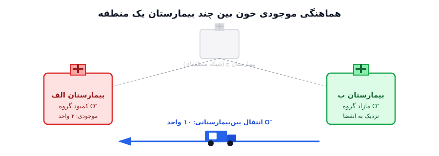

هر روز صبح، مسئول بانک خون یک بیمارستان بزرگ با یک صفحه‌گسترده روبه‌رو می‌شود که تعداد کیسه‌های خون موجود را به تفکیک گروه خونی و سن کیسه نشان می‌دهد. کیسه‌ای که دیروز اهدا شده با کیسه‌ای که سه هفته پیش وارد شده، از نظر پزشکی یکسان نیستند؛ گلبول قرمز معمولاً حدود ۴۲ روز عمر مفید دارد و بعد از آن باید دور ریخته شود. مسئول بانک خون باید هر روز تصمیم بگیرد چقدر اهدای تازه جذب کند، کدام کیسه‌ها را زودتر مصرف کند تا کمتر دور بریزد، و در عین حال مطمئن شود که برای یک تصادف رانندگی نیمه‌شب یا یک عمل جراحی اورژانسی، ذخیره کافی از هر گروه خونی در دسترس است. این کشمکش همیشگی بین «کمبود» در یک سو و «دورریز به‌خاطر انقضا» در سوی دیگر، دقیقاً همان چیزی است که در ادبیات تحقیق در عملیات به آن مدیریت موجودی فرآورده‌های فسادپذیر (Perishable Inventory Management) می‌گویند؛ و بانک خون یکی از پرمخاطره‌ترین و در عین حال کمتر شناخته‌شده‌ترین کاربردهای آن در حوزه سلامت است.

برخلاف کالای معمولی در یک انبار که فرض می‌شود تا ابد قابل نگهداری است، خون یک محصول با ساعت شمارش‌شده است. اگر موجودی خیلی کم نگه دارید، هر بیمار اورژانسی که به گروه خونی نادری نیاز داشته باشد می‌تواند جانش را از دست بدهد؛ چون خون -- برخلاف بسیاری کالاهای دیگر -- را نمی‌شود یک‌شبه از تأمین‌کننده دیگری سفارش داد. اگر هم خیلی زیاد ذخیره کنید، بخش بزرگی از کیسه‌ها به تاریخ انقضا می‌رسند و باید امحا شوند؛ اتفاقی که هم هزینه مالی دارد و هم از نظر اخلاقی، چون هر کیسه دورریخته‌شده به‌معنای یک اهدای داوطلبانه است که به هدر رفته. مسئله‌ای که مسئول بانک خون هر روز حل می‌کند، در واقع یک مسئله بهینه‌سازی چندهدفه است: کمینه‌کردن هم‌زمان احتمال کمبود و میزان دورریز، آن‌هم در شرایطی که تقاضای فردا از قبل دقیقاً معلوم نیست.

## اهمیت این موضوع در دنیای واقعی

سازمان جهانی بهداشت تخمین می‌زند که میلیون‌ها واحد خون در سراسر دنیا هر سال صرفاً به‌دلیل مدیریت ناکارآمد موجودی -- نه کمبود اهداکننده -- دور ریخته می‌شوند. در بسیاری از بیمارستان‌ها و سازمان‌های انتقال خون، تصمیم روزانه «امروز چقدر اهدا جذب کنیم و کدام کیسه‌ها را اول مصرف کنیم» هنوز بر پایه تجربه شخصی مسئول انبار و قواعد سرانگشتی گرفته می‌شود، نه یک مدل بهینه‌سازی رسمی. این موضوع وقتی جدی‌تر می‌شود که به گروه‌های خونی کمیاب فکر کنیم، یا به بحران‌هایی مثل پاندمی که هم‌زمان اهدای خون کاهش می‌یابد و تقاضای جراحی نوسان می‌کند. یک مدل بهینه موجودی خون می‌تواند مستقیماً روی دو شاخص حیاتی اثر بگذارد: نرخ دورریز خون (که در برخی مطالعات میدانی تا ۲۰-۳۰ درصد گزارش شده) و نرخ کمبود در لحظات اورژانسی. کاهش چند درصدی در هرکدام از این دو، هم به‌معنای صرفه‌جویی مالی برای نظام سلامت است و هم، مهم‌تر از آن، نجات جانی که در غیر این‌صورت به‌خاطر نبود خون مناسب در لحظه مناسب از دست می‌رفت. از این زاویه، این یکی از معدود مسائل بهینه‌سازی است که ارزش آن را نمی‌توان فقط با عدد و ریال سنجید.

سازمانی مثل کانادین بلاد سرویسز (Canadian Blood Services)، که تأمین خون بیشتر بیمارستان‌های کانادا را برعهده دارد، برای همین مصالحه یک چارچوب عملیاتی ساده اما مؤثر تعریف کرده است: هر بیمارستان داده مصرف روزانه خود را گزارش می‌دهد و از آن، تقاضای متوسط روزانه گلبول قرمز یا Average Daily Red cell Demand (به‌اختصار ADRD) محاسبه می‌شود -- مجموع واحدهای تزریق‌شده، دورریخته‌شده و امحاشده، تقسیم بر تعداد روز. سپس یک شاخص عملیاتی به نام شاخص موجودی یا Inventory Index (II) تعریف می‌شود که از تقسیم موجودی فعلی بر همین ADRD به دست می‌آید و به مسئول بانک خون می‌گوید موجودی فعلی معادل چند روز مصرف است. توصیه رایج این است که موجودی گلبول قرمز معادل ۴ تا ۶ روز و موجودی پلاکت معادل حدود ۲ روز مصرف متوسط نگه داشته شود -- یک قاعده سرانگشتی ساده که همان مصالحه بین کمبود و دورریز را، بدون نیاز به حل صریح یک مدل بهینه‌سازی، تقریب می‌زند. مدل برنامه‌ریزی خطی که در ادامه معرفی می‌شود، دقیقاً همین مصالحه را به‌جای یک آستانه ثابت و یکسان برای همه روزها، به‌صورت یک تصمیم بهینه و پویا درمی‌آورد که هم‌زمان چند رده سنی کیسه را می‌بیند و به شرایط واقعی هر روز حساس است.

## فرمول‌بندی ریاضی مسئله

ساده‌ترین و در عین حال کاربردی‌ترین شکل این مسئله را می‌توان به‌صورت یک برنامه‌ریزی خطی (یا خطی عدد صحیح مختلط) چندپریودی مدل کرد. فرض کنید افق برنامه‌ریزی شامل $T$ روز است، کیسه‌های خون بر اساس سن‌شان در $L$ رده سنی دسته‌بندی می‌شوند (سن یک روزه، دو روزه، ... تا حداکثر عمر مفید)، خون به تفکیک $G$ گروه استاندارد ABO/Rh دیده می‌شود، و در نسخه شبکه‌ای مسئله، $H$ بیمارستان در یک منطقه با هم در ارتباط‌اند. پیش از نوشتن معادلات، بهتر است دقیقاً مشخص کنیم هرکدام از متغیرهای تصمیم چه چیزی را نشان می‌دهند و از چه جنسی هستند:

$x_{g,t}$ مقدار خون تازه گروه $g$ است که در روز $t$ جذب می‌شود. چون هر واحد اهدایی یک کیسه فیزیکی و غیرقابل‌تقسیم است، این متغیر ذاتاً عدد صحیح غیرمنفی (Integer) است؛ در عمل، وقتی مقیاس مسئله بزرگ باشد (چند ده تا چند صد واحد در روز)، بسیاری از پیاده‌سازی‌ها آن را به‌صورت متغیر پیوسته یا حقیقی (Continuous/Real) در نظر می‌گیرند تا مسئله به‌جای برنامه‌ریزی عدد صحیح مختلط (MILP)، یک برنامه‌ریزی خطی (LP) ساده و بسیار سریع‌تر برای حل باقی بماند؛ خطای گرد کردن حاصل از این تقریب معمولاً ناچیز است.

$I_{g,a,t}$ موجودی کیسه‌های گروه $g$ و سن $a$ در پایان روز $t$ را نشان می‌دهد، و $w_{g,a,t}$ نشان می‌دهد چه مقدار از همین کیسه‌ها در روز $t$ برای تأمین تقاضا مصرف شده‌اند. هر دو، مثل $x_{g,t}$، از جنس عدد صحیح غیرمنفی هستند (یا در عمل، پیوسته/حقیقی غیرمنفی برای سادگی محاسباتی).

$y_{g,t}$ مقدار خون گروه $g$ است که در روز $t$ چون به حداکثر عمر مفید رسیده، دور ریخته می‌شود، و $u_{g,t}$ مقدار تقاضای تأمین‌نشده (کمبود) همان گروه در همان روز است. این دو هم عدد صحیح غیرمنفی هستند (یا پیوسته/حقیقی در تقریب LP).

$\tau_{g,h,h',t}$ متغیر انتقال بین‌بیمارستانی است: مقدار خون گروه $g$ که در روز $t$ از بیمارستان $h$ به بیمارستان $h'$ فرستاده می‌شود. این متغیر هم عدد صحیح غیرمنفی است (یا پیوسته/حقیقی در تقریب LP)، دقیقاً مثل بقیه متغیرهای جریان خون در مدل.

$z_{h,h',t}$ اما از جنس دیگری است: یک متغیر باینری (Binary) که فقط مقدار ۰ یا ۱ می‌گیرد و نشان می‌دهد آیا اصلاً یک محموله انتقالی بین بیمارستان $h$ و $h'$ در روز $t$ فعال می‌شود یا نه. چون هر بار حمل خون بین دو بیمارستان یک هزینه ثابت لجستیکی (رانندگی، بسته‌بندی زنجیره سرد، مستندسازی) دارد که مستقل از حجم محموله است، این هزینه فقط باید یک‌بار در نظر گرفته شود -- دقیقاً همان نقشی که یک متغیر باینری در مدل‌های برنامه‌ریزی عدد صحیح مختلط ایفا می‌کند.

با این تعاریف، تابع هدف مدل پایه (تک‌بیمارستانی، بدون بعد گروه خونی برای سادگی نماد) چنین است:

$$
\min \quad \sum_{t=1}^{T} \Big( c_h \sum_{a} I_{a,t} + c_o \, y_t + c_s \, u_t \Big)
$$

جمله اول، $c_h \sum_a I_{a,t}$، هزینه نگهداری کل موجودی (جمع روی همه رده‌های سنی) در روز $t$ است؛ هرچه کیسه بیشتری نگه دارید، هزینه سردخانه و نظارت بیشتر می‌شود. جمله دوم، $c_o \, y_t$، هزینه (یا جریمه اخلاقی/مالی) دورریز کیسه‌های منقضی‌شده در همان روز است. جمله سوم، $c_s \, u_t$، هزینه یا جریمه کمبود تأمین‌نشده تقاضا در همان روز است -- معمولاً $c_s$ بسیار بزرگ‌تر از $c_h$ و $c_o$ انتخاب می‌شود چون پیامد کمبود خون (به‌خصوص در اورژانس) با هیچ هزینه مالی معمولی قابل مقایسه نیست. جمع این سه هزینه روی کل افق زمانی $T$ روز، دقیقاً همان مصالحه‌ای است که مسئول بانک خون هر روز به‌صورت شهودی انجام می‌دهد، اما اینجا به‌صورت یک عدد واحد و قابل کمینه‌سازی درآمده است.

محدودیت اول مدل، موازنه موجودی بین روزهای متوالی برای هر رده سنی است -- یعنی موجودی امروز با سن $a$، همان موجودی دیروز با سن یک‌روز کمتر است، منهای آنچه از آن مصرف شده:

$$
I_{a,t} = I_{a-1,t-1} - w_{a-1,t} \quad \forall a>1,\; t
$$

این معادله عملاً «سن‌گذری» کیسه‌ها را روز به روز شبیه‌سازی می‌کند: کیسه‌ای که دیروز سن سه روزه داشت، اگر مصرف نشده باشد، امروز سن چهار روزه دارد. اما این معادله به‌تنهایی نمی‌گوید موجودی تازه از کجا می‌آید؛ برای رده سنی اول ($a=1$) باید یک معادله جداگانه نوشت که موجودی را مستقیماً به همان متغیر ورودی $x_t$ وصل می‌کند:

$$
I_{1,t} = x_t - w_{1,t} \quad \forall t
$$

یعنی موجودی یک‌روزه در پایان روز $t$، دقیقاً برابر است با خونی که همان روز جذب شده ($x_t$) منهای همان مقداری که از همین کیسه‌های تازه بلافاصله مصرف شده ($w_{1,t}$). این دو معادله با هم -- یکی برای $a=1$ که ورودی را به موجودی متصل می‌کند، و دیگری برای $a>1$ که سن‌گذری روزانه را انجام می‌دهد -- کل زنجیره موجودی را از لحظه ورود خون تا لحظه مصرف یا دورریز آن، بدون هیچ حلقه گمشده‌ای، مدل می‌کنند. محدودیت دوم، قاعده تخصیص تقاضا (FIFO) است:

$$
\sum_{a} w_{a,t} = d_t - u_t \quad \forall t
$$

این معادله می‌گوید مجموع آنچه از همه رده‌های سنی مصرف شده باید دقیقاً برابر تقاضای روز $t$ منهای کمبود همان روز باشد؛ و برای این‌که مصرف واقعاً از قدیمی‌ترین کیسه‌ها شروع شود (نه به‌صورت دلخواه)، در پیاده‌سازی معمولاً یک اولویت یا هزینه نگهداری تصاعدی روی رده‌های سنی بالاتر گذاشته می‌شود تا سالور خودش کیسه‌های مسن‌تر را زودتر انتخاب کند. کیسه‌هایی که به رده سنی حداکثر ($a=L$) برسند و مصرف نشوند، به‌طور خودکار وارد متغیر دورریز $y_t$ می‌شوند.

نکته‌ای که تا اینجا ساده‌سازی شده، این است که متغیر ورودی $x_{g,t}$ نباید بدون هیچ سقفی هر مقداری بخواهد بپذیرد؛ چون آنچه در روز $t$ می‌تواند وارد سیستم شود، محدود به خونی است که واقعاً اهدا شده یا قرار است اهدا شود. این محدودیت با یک قید ساده وارد مدل می‌شود:

$$
x_{g,t} \leq s_{g,t} \quad \forall g,t
$$

که در آن $s_{g,t}$ ظرفیت واقعی عرضه -- یعنی مقدار خون گروه $g$ است که در روز $t$ در دسترس بانک خون قرار می‌گیرد -- خودش یک پارامتر ورودی مدل است که از قبل معلوم فرض می‌شود، درست مثل تقاضای $d_t$؛ یعنی مدل بهینه‌سازی این عدد را پیش‌بینی نمی‌کند، بلکه آن را به‌عنوان داده ورودی ثابت هر روز دریافت می‌کند و صرفاً تصمیم می‌گیرد چه مقدار از همین عرضه معلوم را بپذیرد، کدام کیسه‌ها مصرف شوند، و کجا کمبود یا دورریز رخ می‌دهد.

نکته مهمی که در فرمول‌بندی بالا ساده‌سازی شده، این است که در دنیای واقعی موجودی و تقاضا هر دو باید به تفکیک گروه خونی هم دیده شوند، نه فقط سن کیسه؛ یعنی همان متغیرهای بالا با اندیس اضافه $g$ نوشته شوند: $I_{g,a,t}$، $w_{g,a,t}$، $y_{g,t}$، $u_{g,t}$ و تقاضای $d_{g,t}$، که در آن‌ها $g$ یکی از هشت گروه ABO/Rh استاندارد (مثل O منفی، A مثبت، AB منفی و غیره) است. این تفکیک اهمیت زیادی دارد چون گروه‌های خونی از نظر سازگاری با هم یکسان نیستند -- مثلاً O منفی به‌عنوان اهداکننده همگانی می‌تواند در شرایط اورژانسی به هر گروهی تزریق شود، اما عرضه آن معمولاً محدودتر از تقاضایش است -- و هر گروه، منحنی تقاضا و ریسک کمبود/دورریز مخصوص به خود را دارد.

وقتی موجودی و تقاضا به این شکل به تفکیک گروه خونی دیده شود، امکان یک توسعه طبیعی و بسیار کاربردی باز می‌شود: هماهنگی بین چند بیمارستان به‌جای مدل‌سازی هر بیمارستان به‌تنهایی. تصور کنید بیمارستان اول در یک روز از گروه O منفی کمبود دارد در حالی‌که بیمارستان دوم -- در همان شهر یا منطقه -- همان روز موجودی مازاد از همان گروه در حال نزدیک‌شدن به تاریخ انقضا دارد. با متغیرهای $\tau_{g,h,h',t}$ و $z_{h,h',t}$ که بالاتر تعریف شدند، این وضعیت مستقیماً قابل مدل‌سازی است: مقدار انتقالی $\tau$ به موازنه موجودی هر دو بیمارستان اضافه می‌شود (خروج از $h$، ورود به $h'$)، و قید پیوندی زیر تضمین می‌کند که انتقال فقط وقتی مجاز است که متغیر باینری فعال‌سازی هم روشن باشد:

$$
\tau_{g,h,h',t} \leq M \, z_{h,h',t} \quad \forall g,h,h',t
$$

که در آن $M$ یک عدد بزرگ ثابت (کران بالای منطقی حجم هر محموله) است. این نوع قید -- که در آن یک متغیر پیوسته/صحیح فقط در صورت فعال بودن یک متغیر باینری مقدار غیرصفر می‌گیرد -- یکی از پرکاربردترین الگوهای مدل‌سازی در برنامه‌ریزی عدد صحیح مختلط است، و اینجا دقیقاً همان نقشی را ایفا می‌کند که در دنیای واقعی هم وجود دارد: هزینه ثابت راه‌اندازی هر سفر انتقال خون، مستقل از این‌که چند واحد در آن سفر جابه‌جا شود. این دقیقاً همان منطقی است که پشت سامانه‌های ملی اشتراک‌گذاری موجودی خون (مثل چارچوب استفاده‌شده در کانادین بلاد سرویسز که در بالا اشاره شد) قرار دارد: نمایش هم‌زمان موجودی همه بیمارستان‌های یک شبکه به تفکیک گروه خونی، تا مازاد یک نقطه بتواند کمبود نقطه دیگر را قبل از رسیدن به بحران یا دورریز جبران کند. از نظر ریاضی، این توسعه مسئله را از یک مدل موجودی تک‌مکانی به یک مدل ترکیبی موجودی-انتقال (Inventory-Transshipment) روی یک شبکه از بیمارستان‌ها تبدیل می‌کند که هم بعد سنی، هم بعد گروه خونی، و هم بعد مکانی را هم‌زمان در نظر می‌گیرد -- و برخلاف مدل پایه که یک برنامه‌ریزی خطی خالص بود، حالا به‌خاطر متغیر باینری $z$، یک مدل برنامه‌ریزی خطی عدد صحیح مختلط (MILP) است.

## پیاده‌سازی با پایتون

خبر خوب این است که برای حل این مدل، به هیچ نرم‌افزار تجاری گران‌قیمتی نیاز نیست. این مسئله در مقیاس یک بیمارستان یا حتی یک شبکه منطقه‌ای انتقال خون، یک برنامه‌ریزی خطی (یا خطی عدد صحیح مختلط، اگر بخواهیم دفعات سفارش را هم گسسته کنیم) با ابعاد کاملاً قابل مدیریت است که کتابخانه‌های متن‌باز پایتون به‌راحتی از پس آن برمی‌آیند. می‌توان مدل را با [Pyomo](https://www.pyomo.org/) یا [PuLP](https://coin-or.github.io/pulp/) نوشت و با سالورهای رایگان مثل [HiGHS](https://highs.dev/) یا [CBC](https://github.com/coin-or/Cbc) حل کرد؛ همان ابزارهایی که در بسیاری از مسائل بهینه‌سازی خطی و عدد صحیح این سایت استفاده شده‌اند. برای نسخه‌های تصادفی مسئله -- یعنی وقتی تقاضای روزانه قطعی نیست -- می‌توان با شبیه‌سازی مونت‌کارلو روی چند سناریوی تقاضا، یا با برنامه‌ریزی تصادفی دومرحله‌ای، مدل را به سمت واقعیت نزدیک‌تر کرد. نکته جالب اینجاست که چون تعداد متغیرها (رده‌های سنی محدود × افق زمانی نسبتاً کوتاه) کوچک است، حتی سالورهای رایگان روی یک لپ‌تاپ معمولی می‌توانند این مدل را در کسری از ثانیه حل کنند؛ یعنی هر بیمارستان کوچک یا متوسط، بدون بودجه‌ای برای نرم‌افزارهای تجاری، می‌تواند از فردا این مدل را پیاده کند.

## ظرفیت کار آکادمیک و پژوهشی

مدیریت موجودی خون یکی از حوزه‌هایی است که هنوز به‌اندازه کافی کاوش نشده و برای پایان‌نامه یا مقاله جای کار فراوان دارد. یک مسیر پژوهشی جذاب، تلفیق این مدل با عدم‌قطعیت تقاضا و عرضه است -- استفاده از برنامه‌ریزی تصادفی یا بهینه‌سازی مقاوم (Robust Optimization) برای مواقعی که هم اهدای خون (مثلاً در تعطیلات یا بحران‌ها) و هم تقاضای جراحی نوسان زیادی دارند. مسیر دیگر، گسترش مدل از سطح یک بیمارستان به سطح یک شبکه منطقه‌ای از چند بیمارستان و پایگاه انتقال خون است که در آن باید تصمیم جابه‌جایی کیسه‌های در حال نزدیک‌شدن به انقضا بین بیمارستان‌ها هم به مدل اضافه شود -- ترکیبی از مسئله موجودی و مسئله مسیریابی. همچنین می‌توان مدل‌های یادگیری ماشین برای پیش‌بینی تقاضای روزانه بر اساس تقویم (تعطیلات، فصل تصادفات جاده‌ای) را با این مدل بهینه‌سازی ترکیب کرد تا یک سیستم تصمیم‌یار کامل برای بانک‌های خون شکل بگیرد. با توجه به این‌که این حوزه هم بار پژوهشی نظری (مدل‌سازی ریاضی موجودی فسادپذیر) و هم کاربرد عملی روشن (نجات جان و کاهش هدررفت) دارد، برای پژوهشگرانی که به دنبال موضوعی با تأثیر اجتماعی مستقیم هستند، گزینه بسیار مناسبی است.

بُعد دیگری که این مسئله را از یک مدل ساده موجودی فسادپذیر پیچیده‌تر و در عین حال عملی‌تر می‌کند، نیاز به تفکیک موجودی بر اساس ویژگی‌های آنتی‌ژنی خون است، نه فقط سن کیسه. برای مثال، بیمارستان‌ها معمولاً باید بخشی از موجودی گروه O منفی -- و به‌طور کلی خون آنتی‌ژن‌منفی نظیر K منفی -- را برای بیمارانی با نیاز مکرر (مثل زنان در سنین باروری یا بیماران با آنتی‌بادی‌های خاص) جداگانه و به‌صورت سهمیه‌بندی‌شده نگه دارند. این یعنی مدل موجودی دیگر فقط یک بعد (سن کیسه) ندارد، بلکه باید هم‌زمان رده سنی و دسته آنتی‌ژنی را با هم مدل کند -- یک بعد تصمیم اضافه که کمتر در ادبیات دانشگاهی موجودی فسادپذیر پوشش داده شده. مسیر پژوهشی دیگر، جایگزینی فرض تقاضای کاملاً تصادفی با پیش‌بینی مبتنی بر برنامه‌های ازپیش‌تعیین‌شده جراحی (شبیه به آنچه در قالب حداکثر برنامه سفارش خون جراحی یا Maximum Surgical Blood Order Schedule در بیمارستان‌ها استفاده می‌شود) به‌عنوان ورودی $d_t$ مدل است. حتی جزئیاتی به‌ظاهر کوچک -- مثل پرهیز از تحویل تعداد زیادی کیسه با تاریخ انقضای یکسان به یک بیمارستان، که مدیریت هم‌زمان آن‌ها را در عمل دشوار می‌کند -- می‌تواند به‌صورت یک قید تنوع در تاریخ انقضا وارد فرمول‌بندی شود؛ نمونه خوبی از این‌که جزئیات عملیاتی واقعیِ زنجیره تأمین خون چطور می‌توانند یک مدل ریاضی نسبتاً ساده را به سمت کاربرد صنعتی واقعی‌تر سوق دهند.

## سوالات متداول

<h3>آیا این مدل فقط برای خون کاربرد دارد؟</h3>

خیر. همین چارچوب موجودی فسادپذیر با تغییرات جزئی برای واکسن‌ها (به‌خصوص در زنجیره سرد)، پلاکت خون که عمر مفید آن حتی کوتاه‌تر از گلبول قرمز است، داروهای با تاریخ انقضای نزدیک، و حتی مواد غذایی فسادپذیر در زنجیره تأمین قابل استفاده است.

<h3>آیا بیمارستان‌ها همین امروز هم به‌نوعی این تعادل را مدیریت می‌کنند؟</h3>

بله، بسیاری از بیمارستان‌ها همین حالا هم از شاخصی ساده به نام شاخص موجودی (Inventory Index) -- یعنی موجودی فعلی تقسیم بر تقاضای متوسط روزانه -- به‌عنوان یک قاعده سرانگشتی برای تصمیم «امروز چقدر سفارش بدهیم» استفاده می‌کنند. مدل بهینه‌سازی معرفی‌شده در این مطلب، همان منطق را به‌جای یک آستانه ثابت و یکسان برای هر روز، به‌صورت یک تصمیم دقیق و به‌روز درمی‌آورد که هم‌زمان چند رده سنی کیسه و چند محدودیت واقعی را با هم می‌بیند.

<h3>برای یادگیری مدل‌سازی این نوع مسائل از کجا شروع کنم؟</h3>

اگر می‌خواهید مبانی مدل‌سازی ریاضی و برنامه‌ریزی خطی را از پایه و با مثال‌های کاربردی یاد بگیرید، دوره <a href="/courses/optimization-modeling/" style="color:#2563EB; font-weight:bold;">مدل‌سازی بهینه‌سازی</a> نقطه شروع مناسبی است.

<h3>چطور می‌توان عدم‌قطعیت تقاضا را وارد این مدل کرد؟</h3>

بخش عدم‌قطعیت تقاضا و عرضه در چنین مسائلی معمولاً با برنامه‌ریزی تصادفی یا سناریوسازی مدل می‌شود؛ اگر به یادگیری این تکنیک‌ها علاقه دارید، دوره <a href="/courses/health-opt/" style="color:#2563EB; font-weight:bold;">بهینه سازی سیستم های سلامت با پایتون</a> را ببینید. برای پیاده‌سازی اختصاصی این مدل برای سازمان یا بیمارستان خودتان هم می‌توانید از طریق صفحه <a href="/consultation/" style="color:#2563EB; font-weight:bold;">مشاوره</a> با ما در ارتباط باشید.

