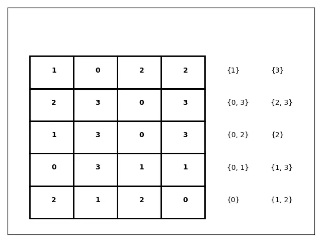
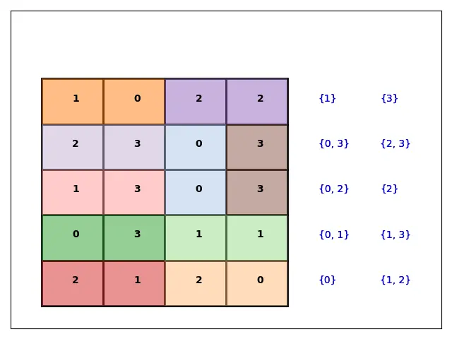

یکی‌بود یکی‌نبود، دو مجموعه‌ی {۰,۱,۲,۳} و {۰,۱,۲,۳} کنار هم قرار گرفتند و تمام ترکیب‌های دوتایی *یکتا* را از خودشان ساختند. بیایید اسم این مجموعه ترکیب‌ها را $S$ بگذاریم:

$$
S = \{\,\{0,0\},\{0,1\},\{0,2\},\{0,3\},\{1,1\},\{1,2\},\{1,3\},\{2,2\},\{2,3\},\{3,3\}\,\}
$$

این ترکیب‌ها از قبل در دل یک شبکه (grid)، بین خانه‌های همسایه جای گرفته بودند. سپس **OR-Tools** به‌عنوان یک واسطه وارد ماجرا شد تا برای هر ترکیب، دقیقاً همان دو خانه‌ی همسایه‌ی درست را پیدا کند؛ به‌گونه‌ای که هر ترکیب **دقیقاً یک‌بار** با شریک خودش «ملاقات» کند.

این پازل از رقابت [lpcp-contest-2024](https://github.com/lpcp-contest/lpcp-contest-2024/tree/main) برداشته شده است.

## شرح مسئله

یک شبکه‌ی مستطیلی داریم که در هر خانه‌ی آن یک عدد از بازه‌ی $\{0,1,2,3\}$ نوشته شده است. باید تمام جفت‌خانه‌های همسایه (همسایگی از نوع اشتراک یک ضلع؛ یعنی افقی یا عمودی، نه قطری) را پیدا کنیم که:

- مقدار دو خانه‌شان دقیقاً برابر یکی از ترکیب‌های مجموعه‌ی $S$ باشد؛
- هر ترکیب $s \in S$ دقیقاً یک‌بار انتخاب شود؛
- هیچ خانه‌ای در بیش از یک جفتِ انتخاب‌شده حضور نداشته باشد.

به‌عبارت دیگر، باید یک **تطبیق کامل و بدون همپوشانی (Perfect Non-overlapping Matching)** بین خانه‌های همسایه پیدا کنیم که همه‌ی ترکیب‌های لازم را دقیقاً یک‌بار پوشش دهد.




## فرمول‌بندی مسئله

مثل همیشه، بخش کلیدی کار، آماده‌سازی درست داده‌هاست، پیش از آن‌که حتی یک خط از مدل بهینه‌سازی نوشته شود.

### آماده‌سازی داده

1. هر خانه‌ی شبکه به‌صورت سه‌تایی $(r, c, v)$ نمایش داده می‌شود؛ که در آن $r$ سطر، $c$ ستون و $v$ مقدار عدد درون آن خانه است.
2. تمام ترکیب‌های دوتایی *یکتا* از مقادیر ممکن (اینجا $\{0,1,2,3\}$) ساخته می‌شوند؛ یعنی مجموعه‌ی $S$ بالا.
3. به هر خانه یک شناسه‌ی گره (Node ID) یکتا نسبت داده می‌شود؛ یعنی $i \in \{1, \dots, N\}$ که $N$ تعداد کل خانه‌های شبکه است.
4. همسایگی معتبر با فاصله‌ی منهتن (Manhattan Distance) تشخیص داده می‌شود: دو خانه‌ی $i$ و $j$ همسایه‌اند اگر و فقط اگر

$$
|r_i - r_j| + |c_i - c_j| = 1
$$

یعنی فقط خانه‌هایی که یک ضلع مشترک دارند (بالا/پایین/چپ/راست)، نه خانه‌های قطری.

### مجموعه‌ها و پارامترها

| نماد | تعریف |
|---|---|
| $N$ | مجموعه‌ی خانه‌های شبکه (گره‌ها) |
| $v_i$ | مقدار عددی درون خانه‌ی $i$ |
| $E$ | مجموعه‌ی جفت‌خانه‌های همسایه: $E = \{(i,j) \mid i,j \in N,\ i > j,\ \lvert r_i-r_j\rvert+\lvert c_i-c_j\rvert = 1\}$ |
| $S$ | مجموعه‌ی ترکیب‌های دوتایی یکتا از مقادیر ممکن |

### متغیر تصمیم

برای هر جفت همسایه‌ی $(i,j) \in E$ و هر ترکیب $s \in S$ که مقادیر آن دو خانه دقیقاً با $s$ مطابقت دارد (یعنی $\{v_i, v_j\} = s$)، یک متغیر تصمیم باینری تعریف می‌شود:

$$
u_{i,j,s} =
\begin{cases}
1 & (i,j,s) \text{ selected} \\
0 & \text{otherwise}
\end{cases}
$$

یعنی $u_{i,j,s}=1$ اگر جفت همسایه‌ی $(i,j)$ برای پوشش ترکیب $s$ انتخاب شود، و در غیر این صورت $u_{i,j,s}=0$.

نکته‌ی مهم: این متغیر فقط برای جفت‌هایی ساخته می‌شود که **هم همسایه باشند و هم** مقدارشان با ترکیب مدنظر مطابقت داشته باشد؛ یعنی از ابتدا فضای جست‌وجو به‌شدت کوچک نگه داشته می‌شود (این دقیقاً همان چیزی است که در کد پایتون خط زیر انجام می‌دهد):

```python
u = {(i, j, s): model.new_bool_var(f"u_{i}_{j}_{s}") for (i, j) in neighbours
     for s, set_vals in s_dic.items() if {nodes[i][2], nodes[j][2]} == set_vals}
```

### قیدها

**قید ۱ — هر ترکیب باید دقیقاً یک‌بار پوشش داده شود:**

$$
\sum_{(i,j)\, :\, (i,j,s) \in u} u_{i,j,s} = 1 \qquad \forall\, s \in S
$$

در کد، این قید با `add_exactly_one` پیاده‌سازی می‌شود:

```python
for s in s_dic:
    expr = [u[i, j, s] for (i, j) in neighbours if (i, j, s) in u]
    model.add_exactly_one(expr)
```

**قید ۲ — هر خانه فقط می‌تواند در یک ترکیب انتخاب‌شده حضور داشته باشد:**

برای هر دو متغیر $u_{i,j,s_1}$ و $u_{i',j',s_2}$ که خانه‌ی مشترکی دارند (یعنی $\{i,j\} \cap \{i',j'\} \neq \emptyset$) ولی مجموعه‌ی خانه‌هایشان یکسان نیست، باید:

$$
u_{i,j,s_1} + u_{i',j',s_2} \le 1
$$

در کد:

```python
for (i, j, s1), v1 in u.items():
    for (ii, jj, s2), v2 in u.items():
        A = {i, j}
        B = {ii, jj}
        if A & B and A != B:
            model.add_at_most_one([v1, v2])
```

به زبان ساده: اگر سه خانه‌ی متوالی ۵–۶–۷ را در نظر بگیرید، OR-Tools می‌تواند جفت (۵,۶) را انتخاب کند یا جفت (۶,۷) را، اما هرگز هر دو را با هم؛ چون خانه‌ی ۶ نمی‌تواند همزمان در دو ترکیب مختلف شرکت کند.

### مدل کامل بهینه‌سازی

مسئله را می‌توان به‌صورت خلاصه این‌طور نوشت (این یک مسئله‌ی **ارضای محدودیت** است، نه بهینه‌سازی؛ یعنی تابع هدفی برای کمینه/بیشینه کردن نداریم، فقط باید یک پاسخ *ممکن* پیدا شود):

$$
\begin{aligned}
\text{find} \quad & u_{i,j,s} \in \{0,1\} \\
\text{s.t.} \quad & \sum_{(i,j)\,:\,(i,j,s)\in u} u_{i,j,s} = 1 & \forall\, s \in S \\
& u_{i,j,s_1} + u_{i',j',s_2} \le 1 & \forall\, (i,j,s_1),(i',j',s_2) \in u,\ \{i,j\}\cap\{i',j'\}\neq\emptyset,\ \{i,j\}\neq\{i',j'\}
\end{aligned}
$$

چون مقادیر خانه‌ها روی شبکه ثابت و از قبل معلوم‌اند (جابه‌جا نمی‌شوند)، تنها کاری که مدل باید انجام دهد، *انتخاب* جفت‌های درست از میان گزینه‌های از پیش تعیین‌شده است — نه جای‌گذاری یا چیدمان اعداد.

## کد کامل پایتون

```python
from ortools.sat.python import cp_model

cells = [
    (1, 1, 2), (1, 2, 0), (1, 3, 1), (1, 4, 2), (1, 5, 1),
    (2, 1, 1), (2, 2, 3), (2, 3, 3), (2, 4, 3), (2, 5, 0),
    (3, 1, 2), (3, 2, 1), (3, 3, 0), (3, 4, 0), (3, 5, 2),
    (4, 1, 0), (4, 2, 1), (4, 3, 3), (4, 4, 3), (4, 5, 2),
]

# ساخت مجموعه‌ی ترکیب‌های یکتا از مقادیر ۰ تا ۳
values = range(4)
s_vals = []
s_dic = {}
s = 0
for i in values:
    for j in values:
        if (i, j) not in s_vals and (j, i) not in s_vals:
            s_vals.append((i, j))
            s += 1
            s_dic[s] = {i, j}

# هر خانه یک شناسه‌ی گره می‌گیرد
nodes = {i: cells[i] for i in range(len(cells))}

# تشخیص همسایه‌ها با فاصله‌ی منهتن
neighbours = [(i, j) for i in nodes for j in nodes if
              i > j and abs(nodes[i][0] - nodes[j][0]) + abs(nodes[i][1] - nodes[j][1]) == 1]

model = cp_model.CpModel()

# متغیر تصمیم: فقط برای جفت‌های همسایه‌ای که با یک ترکیب مطابقت دارند
u = {(i, j, s): model.new_bool_var(f"u_{i}_{j}_{s}") for (i, j) in neighbours
     for s, set_vals in s_dic.items() if {nodes[i][2], nodes[j][2]} == set_vals}

# قید ۱: هر ترکیب دقیقاً یک‌بار پوشش داده شود
for s in s_dic:
    expr = [u[i, j, s] for (i, j) in neighbours if (i, j, s) in u]
    model.add_exactly_one(expr)

# قید ۲: هیچ خانه‌ای در دو ترکیب مختلف حضور نداشته باشد
for (i, j, s1), v1 in u.items():
    for (ii, jj, s2), v2 in u.items():
        A = {i, j}
        B = {ii, jj}
        if A & B and A != B:
            model.add_at_most_one([v1, v2])

solver = cp_model.CpSolver()
status = solver.solve(model)
print(f"Status = {solver.status_name(status)}")

for (i, j, s), v in u.items():
    if solver.value(v) > 0:
        print(f"ترکیب {s_dic[s]} → خانه‌های {nodes[i]} و {nodes[j]}")
```

## چرا برنامه‌ریزی محدودیتی (CP) مناسب این مسئله است؟

این مسئله در ظاهر شبیه یک جست‌وجوی ساده به نظر می‌رسد، اما با بزرگ‌تر شدن شبکه، تعداد حالت‌های ممکن برای تخصیص جفت‌ها بسیار سریع رشد می‌کند و بررسی کامل همه‌ی حالات (Brute Force) عملاً غیرممکن می‌شود. **CP-SAT** در OR-Tools دقیقاً برای چنین مسائلی طراحی شده است: قیدهای مسئله (اینجا `add_exactly_one` و `add_at_most_one`) مستقیماً به مدل داده می‌شوند و حل‌کننده با هوشمندی، شاخه‌های نامعتبر را بدون بررسی کامل کنار می‌گذارد.
## جواب مسئله



## ویژوالایزیشن: کد رسم شبکه چطور کار می‌کند؟

بعد از حل مدل، بخش دوم کد (با Matplotlib) نتیجه را روی شبکه رسم می‌کند. این بخش سه مرحله دارد:

### مرحله ۱ — رسم شبکه‌ی خام (بدون رنگ)

```python
plt.figure()
for i in nodes:
    (x0, y0, v0) = nodes[i]
    rect = Rectangle((x0 - 0.5, y0 - 0.5), 1, 1, fill=False, linewidth=2)
    plt.gca().add_patch(rect)
    plt.text(x0, y0, s=str(nodes[i][2]), zorder=2, fontsize=10, fontweight="bold")
```

برای هر خانه‌ی $i$ در `nodes`، یک مستطیل ۱×۱ **بدون رنگ** (`fill=False`) دقیقاً روی مختصات $(x_0, y_0)$ آن خانه رسم می‌شود، و عدد داخل آن خانه (`nodes[i][2]`) وسط مستطیل چاپ می‌شود. نتیجه‌ی این مرحله، همان شکل خام شبکه با اعداد اصلی است — دقیقاً شبیه صورت مسئله، پیش از حل.

### مرحله ۲ — چاپ فهرست ترکیب‌ها (Legend) در کنار شبکه

```python
for s in s_dic:
    set_list = s_dic[s]
    f = lambda s: (s if s <= 5 else s - 5, 0 if s <= 5 else 1)
    p, m = f(s)
    plt.text(m + 5, p, s=str(set_list))
```

چون ۱۰ ترکیب داریم ($s=1$ تا $s=10$)، این تابع لامبدا آن‌ها را به دو ستون تقسیم می‌کند: ترکیب‌های $1$ تا $5$ در ستون اول ($m=0$) و ترکیب‌های $6$ تا $10$ در ستون دوم ($m=1$)، و $p$ هم موقعیت ردیف را می‌دهد. حاصل جمع `m + 5` باعث می‌شود این متن‌ها **در سمت راست شبکه‌ی اصلی** (که فقط تا $x=5$ ادامه دارد) و نه روی خودِ شبکه چاپ شوند — یعنی یک لیست/راهنمای کوچک از تمام ترکیب‌های مورد نیاز، کنار شبکه.

در پایان این دو مرحله، `plt.savefig("Tiling_0.png")` یک تصویر از شبکه‌ی خام به‌همراه فهرست ترکیب‌ها ذخیره می‌کند — این همان تصویر «صورت مسئله» است.

### مرحله ۳ — رنگ‌آمیزی تدریجی هر ترکیب حل‌شده

```python
for ss in range(1, 11):
    for (i, j, s), v in u.items():
        if solver.value(v) > 0 and s == ss:
            ...
            rect1 = Rectangle(..., fill=True, facecolor=KOLORS[s], alpha=0.5)
            rect2 = Rectangle(..., fill=True, facecolor=KOLORS[s], alpha=0.5)
            plt.gca().add_patch(rect1)
            plt.gca().add_patch(rect2)
            ...
            plt.savefig(f"Tiling_{s}.png")
```

این حلقه از ترکیب $1$ تا $10$ پیش می‌رود. برای هر ترکیب `ss`، در میان تمام متغیرهای `u` دنبال متغیری می‌گردد که هم متعلق به همین ترکیب باشد (`s == ss`) و هم در پاسخ نهایی انتخاب شده باشد (`solver.value(v) > 0`؛ یعنی مقدار آن در پاسخ حل‌کننده برابر ۱ است، نه فقط تعریف شده باشد). وقتی چنین متغیری پیدا شد، دو خانه‌ی متناظرش ($i$ و $j$) با رنگی از پالت `KOLORS` (که هر ترکیب رنگ مخصوص خودش را دارد) به‌صورت نیمه‌شفاف (`alpha=0.5`) روی شبکه رنگ می‌شوند.

نکته‌ی مهم و ظریف این بخش: چون `plt.gca()` هربار همان *یک* شکل (figure) قبلی را برمی‌گرداند و بین تکرارها پاک نمی‌شود، هر بار که `plt.savefig(f"Tiling_{s}.png")` صدا زده می‌شود، مستطیل‌های رنگی *تمام ترکیب‌های قبلی* هم روی تصویر باقی هستند. یعنی:

- `Tiling_1.png` → فقط ترکیب اول رنگ شده
- `Tiling_2.png` → ترکیب اول و دوم با هم رنگ شده‌اند
- ...
- `Tiling_10.png` → کل شبکه، با تمام ۱۰ ترکیب رنگ‌آمیزی‌شده

پس این کد در واقع یک **دنباله‌ی تصویری گام‌به‌گام** تولید می‌کند که می‌توان از آن برای ساخت گیف آموزشی یا نمایش «حل‌شدن پازل جلوی چشم کاربر» استفاده کرد؛ هر فریم دقیقاً یک ترکیب جدید نسبت به فریم قبلی اضافه دارد. در پایان، `plt.show()` هم آخرین حالت (شبکه‌ی کامل رنگ‌شده) را در یک پنجره نمایش می‌دهد.


## کاربردهای عملی این الگو

این الگوی «تطبیق دوبه‌دو بدون همپوشانی روی یک گراف همسایگی» فقط یک پازل سرگرم‌کننده نیست؛ ساختار ریاضی آن دقیقاً همان چیزی است که در بسیاری از مسائل واقعی تخصیص و زمان‌بندی دیده می‌شود:

- تخصیص کارگران به وظایف، وقتی هر کارگر فقط یک تخصیص می‌تواند بگیرد
- جفت‌کردن دانشجویان با هم‌تیمی پروژه بر اساس قوانین سازگاری
- زمان‌بندی و جفت‌کردن پرسنل یا شیفت‌ها، وقتی یک فرد نمی‌تواند هم‌زمان در دو شیفت باشد
- تخصیص سفارش‌های تحویل به خودروهای موجود
- تخصیص بیماران به نوبت‌های ویزیت
- جفت‌کردن ماشین‌ها با کارهای تولیدی
- تخصیص سفارش‌های انبار به منابع چیدن کالا (Picking)
- انتخاب اتصالات بدون همپوشانی در مسیریابی شبکه یا مخابرات
- جفت‌کردن تیم‌ها یا بازیکن‌های ورزشی در هر دور، بدون تکرار حضور یک نفر
- جفت‌کردن اهداکننده و گیرنده تحت قیود سازگاری (مثلاً پیوند عضو)
- تخصیص هم‌اتاقی‌ها بر اساس ترجیحات و محدودیت‌ها
- تخصیص هواپیماها به گیت‌ها یا جایگاه‌های پارک
- تخصیص جایگاه‌های شارژ به خودروهای الکتریکی
- جفت‌کردن قطعات در خطوط تولید یا مونتاژ
- انتخاب یال‌های سازگار در یک گراف، مانند طراحی شبکه یا زمان‌بندی

در همه‌ی این مثال‌ها، هسته‌ی مشترک همان دو قید ساده‌ای است که در این پازل دیدیم: **هر نیاز باید دقیقاً یک‌بار برطرف شود** و **هیچ منبعی نباید در دو تخصیص مختلف هم‌زمان استفاده شود**.
