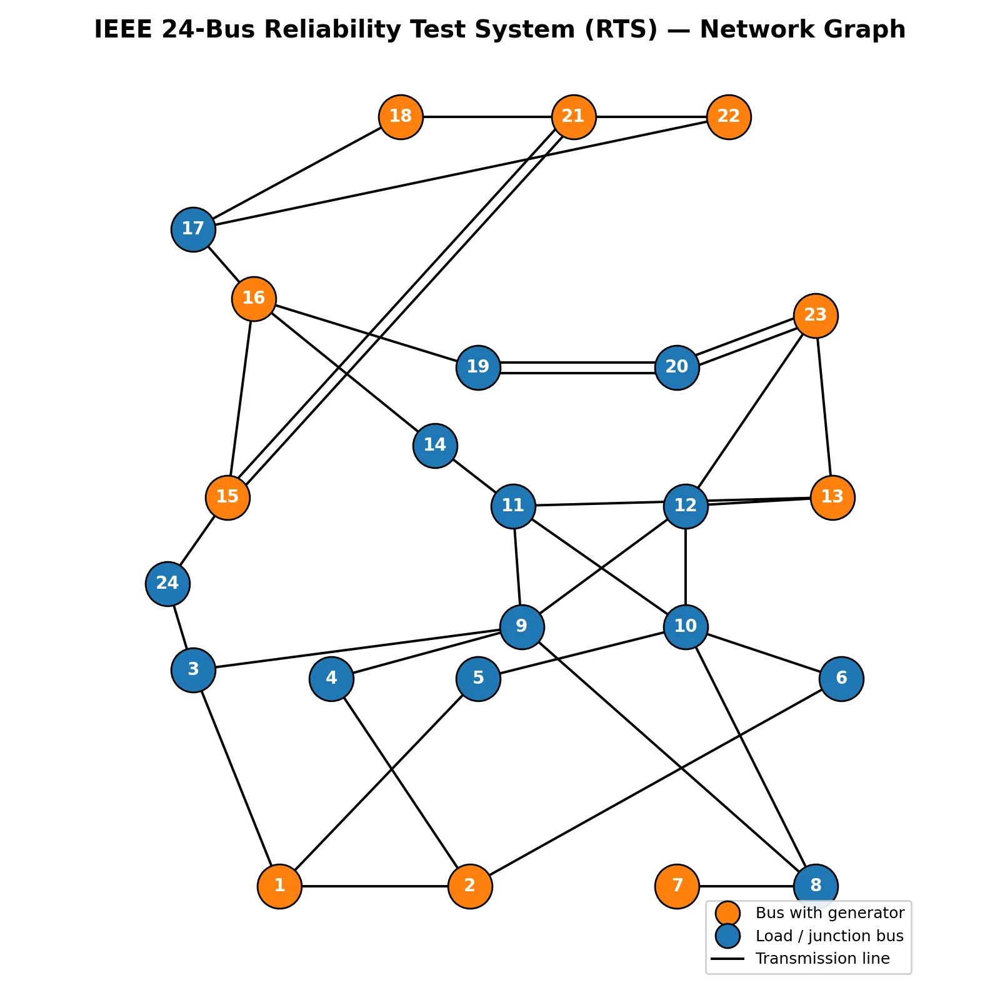
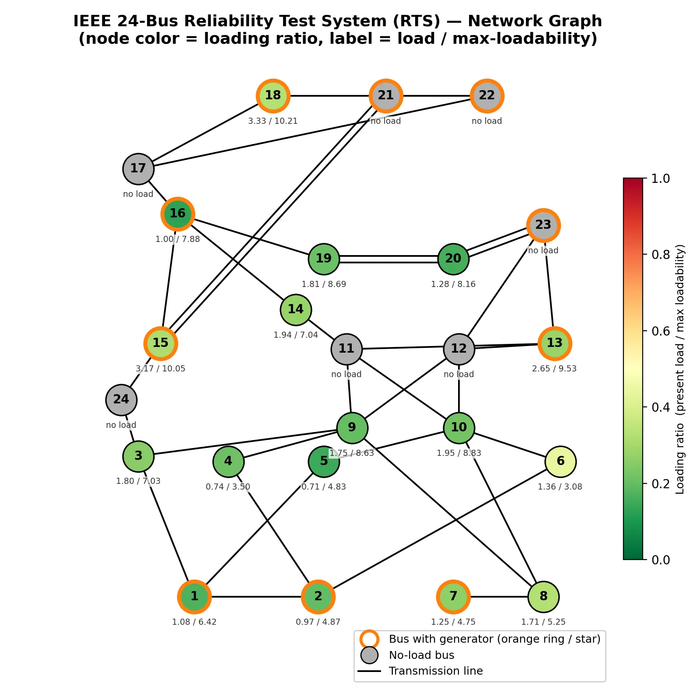

## مقدمه

با گسترش سریع بارهای جدید در شبکه‌های توزیع و انتقال — به‌ویژه بار ناشی از شارژ خودروهای برقی، پمپ‌های حرارتی و
الکتریکی‌سازی بخش‌های صنعتی — این پرسش برای بهره‌بردار شبکه اهمیت روزافزونی پیدا کرده که «هر باس از شبکه، تا چه سقفی
توان تحمل بار اضافه را دارد؟». این سقف را در ادبیات فنی «ظرفیت بارپذیری» یا Hosting Capacity می‌نامند و منظور از آن
حداکثر باری است که یک باس مشخص می‌تواند بدون نقض محدودیت‌های فنی شبکه — از جمله ظرفیت حرارتی خطوط، محدودیت تولید
نیروگاه‌ها و توازن توان در کل سیستم — از خود عبور دهد.

پروژه‌ای که در ادامه معرفی می‌شود، دقیقاً به این سؤال برای شبکه استاندارد ۲۴ باس (IEEE RTS-24) پاسخ می‌دهد. با تکیه بر
یک مدل پخش بار بهینه جریان مستقیم (DC Optimal Power Flow)، ظرفیت بارپذیری هر باس به‌صورت جداگانه محاسبه و با ظرفیت پایه
(بار اولیه) آن مقایسه می‌شود تا تصویر روشنی از میزان «فضای خالی» هر نقطه از شبکه برای پذیرش بار جدید به‌دست آید.

## چرا دانستن حداکثر ظرفیت بارپذیری هر باس اهمیت دارد ؟

شناخت دقیق سقف بارپذیری هر باس، ابزاری کلیدی در دست برنامه‌ریزان و بهره‌برداران شبکه است و به چند دلیل اصلی اهمیت پیدا
می‌کند.

**نخست**، تصمیم‌گیری برای توسعه زیرساخت شارژ خودروهای برقی یا اتصال بارهای صنعتی جدید بدون دانستن این سقف، عملاً یک ریسک
مهندسی است. اگر بار جدید در باسی نصب شود که ظرفیت بارپذیری پایینی دارد، احتمال اضافه‌بار خطوط، افت ولتاژ شدید یا حتی
خاموشی موضعی به‌شدت بالا می‌رود. برعکس، شناسایی باس‌هایی با ظرفیت بارپذیری بالا می‌تواند مسیر توسعه شبکه را به سمت
مناطقی هدایت کند که سرمایه‌گذاری در آن‌ها کم‌ریسک‌تر و کم‌هزینه‌تر است.

**دوم**، این تحلیل به شرکت‌های برق کمک می‌کند تا سرمایه‌گذاری در تقویت شبکه (مانند افزایش ظرفیت خطوط یا احداث پست جدید)
را در اولویت درست‌تری قرار دهند؛ به‌جای تقویت گسترده و پرهزینه کل شبکه، فقط باس‌ها و خطوطی که واقعاً گلوگاه محسوب
می‌شوند شناسایی و هدفمند تقویت می‌شوند.

**سوم**، تصویرسازی این ظرفیت‌ها روی نقشه شبکه (به‌جای ارائه صرف یک جدول عددی) درک شهودی و سریع‌تری از وضعیت شبکه به
مدیران، مهندسان طراحی و حتی ذی‌نفعان غیرفنی می‌دهد. یک نمودار رنگی که نسبت بار فعلی به سقف بارپذیری هر باس را نشان
می‌دهد، در یک نگاه مشخص می‌کند کدام نقاط شبکه در آستانه اشباع هستند و کدام نقاط هنوز ظرفیت قابل‌توجهی برای رشد دارند.

در نهایت، این نوع تحلیل پایه‌ای برای مطالعات آینده‌نگرتر است، از جمله برنامه‌ریزی محل بهینه نصب منابع تولید پراکنده،
تعیین محل بهینه ذخیره‌سازهای انرژی و ارزیابی تاب‌آوری شبکه در برابر رشد بار پیش‌بینی‌نشده.

## روش تحلیل: پخش بار بهینه DC برای برآورد سقف بارپذیری هر باس

رویکرد به‌کاررفته در این پروژه بر پایه یک مدل پخش بار بهینه جریان مستقیم (DC-OPF) برای شبکه ۲۴ باس IEEE بنا شده است.
منطق کلی مدل به این صورت است: به‌ازای هر باس که در حالت پایه دارای بار غیرصفر است، مدل به‌صورت جداگانه اجرا می‌شود، تابع
هدف تنها بیشینه‌سازی بار مجاز همان یک باس تعریف می‌شود، و بار سایر باس‌ها در آن اجرای مشخص ثابت در نظر گرفته می‌شود. به
این ترتیب، برای هر باس یک «سناریوی ایزوله» ساخته می‌شود که در آن تمام ظرفیت آزاد شبکه (تولید نیروگاه‌ها، تولید بادی و
خورشیدی در ساعت مورد بررسی، و ظرفیت خالی خطوط انتقال) صرفاً برای تغذیه همان یک باس به‌کار گرفته می‌شود.

این بهینه‌سازی تحت مجموعه‌ای از قیدهای فیزیکی و عملیاتی شبکه انجام می‌شود: توازن توان تولید و مصرف در هر باس، معادلات
پخش بار جریان مستقیم که رابطه میان توان عبوری از هر خط و اختلاف زاویه ولتاژ دو سر آن را مشخص می‌کند، محدودیت ظرفیت
حرارتی هر خط انتقال، محدودیت توان مینیمم و ماکزیمم واحدهای تولید حرارتی، و سقف تولید منابع تجدیدپذیر بادی و خورشیدی که
بر اساس پروفایل ساعتی تولید آن‌ها تعیین می‌شود. باس مرجع (Slack) نیز به‌عنوان مرجع زاویه فاز صفر در نظر گرفته شده است.

خروجی نهایی این فرایند، برای هر باس یک عدد است: حداکثر بار مجازی که آن باس — با فرض عدم تغییر سایر باس‌ها — می‌تواند از
شبکه دریافت کند. مقایسه این عدد با بار پایه همان باس، نسبت بارگذاری فعلی به سقف نظری را نشان می‌دهد و مبنای تصویرسازی
گرافیکی شبکه قرار می‌گیرد.

لازم به ذکر است که این عدد یک «سقف نظری در حالت ایزوله» است، نه لزوماً ظرفیت واقعی و هم‌زمان همه باس‌ها؛ به همین دلیل
تفسیر آن باید همراه با درک عوامل مؤثر بر آن باشد که در بخش بعد شرح داده می‌شود.

### شکل ۱ — نمای شبکه و توزیع بار پیش از محاسبه ظرفیت بارپذیری

<!-- اینجا شکل «قبل از محاسبه» (مثلاً نمودار شبکه با بار پایه هر باس) قرار می‌گیرد -->

### شکل ۲ — نمای شبکه و توزیع ظرفیت بارپذیری پس از محاسبه

<!-- اینجا شکل «بعد از محاسبه» (مثلاً نمودار شبکه با نسبت بار به حداکثر ظرفیت هر باس) قرار می‌گیرد -->

## عوامل مؤثر بر ظرفیت بارپذیری هر باس

ظرفیت بارپذیری محاسبه‌شده برای هر باس، حاصل برهم‌کنش چند عامل ساختاری و عملیاتی شبکه است.

توپولوژی شبکه و ظرفیت حرارتی خطوط متصل به هر باس، مهم‌ترین محدودکننده مستقیم هستند؛ باسی که تنها از طریق یک یا دو خط
کم‌ظرفیت به شبکه متصل است، طبیعتاً سقف پایین‌تری نسبت به باسی دارد که از چند خط پرظرفیت تغذیه می‌شود. فاصله الکتریکی باس
مورد نظر از واحدهای تولید نیز اهمیت دارد؛ باس‌هایی که نزدیک به نیروگاه‌های بزرگ یا باس مرجع قرار دارند معمولاً می‌توانند
توان بیشتری را بدون عبور از خطوط پرباد دریافت کنند.

ظرفیت و پراکندگی جغرافیایی واحدهای تولید حرارتی نیز نقش تعیین‌کننده دارد؛ اگر مجموع ظرفیت تولید در دسترس محدود باشد، حتی
باسی با اتصال قوی به شبکه نیز نمی‌تواند فراتر از مجموع توان تولیدی موجود بار بگیرد. در همین راستا، منابع تجدیدپذیر بادی
و خورشیدی به دلیل ماهیت متغیر و وابسته به ساعت شبانه‌روز خود، سقف بارپذیری را به یک متغیر «زمان‌محور» تبدیل می‌کنند؛
ظرفیت بارپذیری یک باس در ساعتی که تولید خورشیدی در اوج است، می‌تواند به‌طور محسوسی متفاوت از همان باس در ساعت شب باشد.

انتخاب باس مرجع (Slack) و الگوی توزیع زاویه فاز در سراسر شبکه نیز بر جریان توان محاسبه‌شده در هر خط اثر می‌گذارد و
به‌تبع آن بر عددی که به‌عنوان سقف بارپذیری به‌دست می‌آید. علاوه بر این، در دنیای واقعی، بار هم‌زمان سایر باس‌ها با بار
باس مورد بررسی رقابت می‌کند؛ در حالی‌که مدل ایزوله‌ای که در این پروژه استفاده شده، بار سایر باس‌ها را در لحظه محاسبه
ثابت فرض می‌کند تا سقف نظری خالص هر باس به‌دست آید. در نهایت، محدودیت‌های ولتاژ و توان راکتیو که در مدل جریان مستقیم
(DC) نادیده گرفته می‌شوند، در عمل می‌توانند سقف واقعی بارپذیری را پایین‌تر از عدد به‌دست‌آمده در این تحلیل قرار دهند.

## نقش ذخیره‌سازهای انرژی (باتری) در ظرفیت بارپذیری

یکی از پرسش‌های مهمی که در ادامه این تحلیل مطرح می‌شود این است که افزودن ذخیره‌ساز انرژی (باتری) به شبکه چه اثری بر سقف
بارپذیری باس‌ها می‌گذارد. پاسخ به این پرسش یک‌سویه نیست و باتری می‌تواند بسته به نحوه جانمایی، اندازه و راهبرد
بهره‌برداری، هم بهبوددهنده و هم بدترکننده وضعیت باشد.

از جنبه مثبت، باتری این امکان را فراهم می‌کند که انرژی در ساعاتی که تولید تجدیدپذیر زیاد یا بار شبکه کم است ذخیره شود و
در ساعات اوج مصرف تخلیه گردد؛ این جابه‌جایی زمانی بار (Time-Shifting) می‌تواند فشار بر خطوط پرترافیک را در ساعات پیک
کاهش داده و درنتیجه فضای بیشتری برای بار جدید در همان باس یا باس‌های مجاور آزاد کند. همچنین، نصب باتری در نزدیکی باسی که
از نظر اتصال شبکه ضعیف است می‌تواند به‌طور موضعی مانند یک منبع تولید کوچک عمل کند و سقف بارپذیری همان باس را به‌صورت
مستقیم افزایش دهد، بدون آنکه نیاز به تقویت خط انتقال باشد.

اما همین ابزار می‌تواند اثر معکوس نیز داشته باشد. اگر باتری در زمان یا مکان نامناسبی شارژ یا دشارژ شود — برای مثال اگر
شارژ آن هم‌زمان با اوج بار طبیعی شبکه رخ دهد یا دشارژ آن دقیقاً از مسیر خطی صورت گیرد که از قبل نزدیک به ظرفیت حرارتی
خود کار می‌کند — می‌تواند خود به یک گلوگاه جدید تبدیل شده و ظرفیت بارپذیری را نسبت به حالت بدون باتری کاهش دهد. اندازه
نامناسب باتری (خیلی کوچک برای اثرگذاری واقعی یا خیلی بزرگ به‌طوری‌که شارژ آن خود یک بار سنگین جدید ایجاد کند) نیز
می‌تواند نتیجه را ناکارآمد یا حتی زیان‌بار کند. به همین ترتیب راهبرد کنترلی باتری — اینکه بر چه اساسی (قیمت، بار شبکه،
تولید تجدیدپذیر) تصمیم به شارژ یا دشارژ می‌گیرد — تعیین‌کننده است؛ یک راهبرد هماهنگ با وضعیت شبکه می‌تواند سود
قابل‌توجهی ایجاد کند، در حالی‌که یک راهبرد صرفاً اقتصادی و بی‌توجه به قیود شبکه ممکن است بی‌اثر یا مضر باشد.

به بیان خلاصه، باتری نه به‌خودی‌خود «راه‌حل» و نه «مشکل» ظرفیت بارپذیری است؛ اثر نهایی آن کاملاً به سه عامل جانمایی،
اندازه و راهبرد بهره‌برداری وابسته است و ارزیابی دقیق این اثر، خود نیازمند تکرار همین تحلیل ظرفیت بارپذیری، این‌بار با
درنظرگرفتن باتری در مدل، خواهد بود.

## جمع‌بندی

محاسبه و تصویرسازی حداکثر ظرفیت بارپذیری باس‌های شبکه، ابزاری ارزشمند برای برنامه‌ریزی توسعه شبکه، اولویت‌بندی
سرمایه‌گذاری، و ارزیابی آمادگی شبکه برای پذیرش بارهای جدید مانند خودروهای برقی است. این ظرفیت، مقداری ثابت و ذاتی هر باس
نیست، بلکه تابعی از توپولوژی شبکه، ظرفیت و مکان تولید، رفتار منابع تجدیدپذیر، و به‌طور بالقوه حضور و راهبرد بهره‌برداری
ذخیره‌سازهای انرژی است. به همین دلیل، این تحلیل باید نه به‌عنوان یک عدد ثابت و نهایی، بلکه به‌عنوان مبنایی برای بررسی
سناریوهای مختلف توسعه شبکه در نظر گرفته شود.

## دریافتی‌های این پروژه برای شما

پس از تحویل این پروژه، مجموعه‌ای از خروجی‌های آماده و مستقیماً قابل‌استفاده در اختیار خواهید داشت: کد کامل و مستند
پایتون (Pyomo) که مدل پخش بار بهینه DC و منطق محاسبه جداگانه سقف بارپذیری هر باس را پیاده‌سازی می‌کند، داده‌های آماده
شبکه ۲۴ باس IEEE RTS به همراه پروفایل ساعتی بار و تولید تجدیدپذیر، جدول عددی ظرفیت بارپذیری هر باس در کنار بار پایه و
نسبت بارگذاری آن، و دو نمودار تصویری شبکه — پیش و پس از محاسبه — که نسبت بار فعلی به سقف بارپذیری را به‌صورت رنگی و
شهودی روی نقشه شبکه نشان می‌دهند (همان دو شکلی که در بخش «روش تحلیل» جای آن‌ها مشخص شده است). این مجموعه به‌طور مستقیم
برای پایان‌نامه، مقاله علمی و مطالعات صنعتی برنامه‌ریزی توسعه شبکه توزیع و انتقال، ازجمله ارزیابی محل اتصال بارهای بزرگ
جدید مانند ایستگاه‌های شارژ خودروی برقی، قابل استفاده است.

علاوه بر این، یک گزارش تحلیل حساسیت (Sensitivity Analysis) نیز بخشی از تحویل پروژه است که نشان می‌دهد ظرفیت بارپذیری هر
باس در برابر تغییر پارامترهای کلیدی — از جمله سطح نفوذ تولید تجدیدپذیر، ظرفیت خطوط انتقال و سناریوهای مختلف باس مرجع —
چگونه تغییر می‌کند؛ این تحلیل مشخص می‌کند نتیجه تا چه حد به فرض‌های اولیه مدل حساس است و کدام پارامترها بیشترین اثر را
بر سقف بارپذیری دارند. در کنار آن، بخش اعتبارسنجی (Validation) نتایج را از دو زاویه بررسی می‌کند: نخست تطبیق نتایج مدل
با محدودیت‌های شناخته‌شده شبکه (مانند عدم نقض ظرفیت خطوط و محدوده تولید ژنراتورها در تمام سناریوها)، و دوم مقایسه ظرفیت
بارپذیری محاسبه‌شده با بار پایه و ظرفیت اسمی هر باس برای اطمینان از معقول و قابل‌دفاع‌بودن اعداد به‌دست‌آمده پیش از
استفاده در تصمیم‌های واقعی برنامه‌ریزی شبکه.

## سوالات متداول

<h3>پیش‌نیاز اجرای پروژه چیست؟</h3>

آشنایی مقدماتی با پایتون و مفاهیم پایه پخش بار در سیستم قدرت کافی است. کد با Pyomo نوشته شده و با solverهای رایگان قابل اجراست.

<h3>خروجی نهایی چیست؟</h3>

کد کامل و مستند، داده‌های آماده شبکه ۲۴ باس IEEE، جدول عددی ظرفیت بارپذیری هر باس، دو نمودار تصویری شبکه (پیش و پس از محاسبه) و یک گزارش تحلیل حساسیت نسبت به پارامترهای کلیدی (سطح نفوذ تجدیدپذیر، ظرفیت خطوط و باس مرجع) که مستقیماً برای پایان‌نامه یا مطالعه صنعتی قابل استفاده است.

<h3>این پروژه به چه مباحثی مرتبط است؟</h3>

این پروژه بخشی از مجموعه مطالعات عملی سیستم قدرت با پایتون است و مستقیماً به دوره <a href="/courses/advanced-power-system/" class="content-link">بهینه‌سازی پیشرفته سیستم قدرت</a> مرتبط است؛ جایی که مباحث پخش بار بهینه (OPF)، ارزیابی ظرفیت شبکه و جایابی ذخیره‌ساز انرژی به‌صورت پروژه‌محور و قدم‌به‌قدم آموزش داده می‌شود. این تحلیل هم‌چنین با پروژه‌های جایابی بهینه ذخیره‌ساز انرژی برای کاهش هدررفت تجدیدپذیرها و <a href="https://optexpert.org/projects/ev-solar/" class="content-link">هماهنگی خودرو الکتریکی، پنل خورشیدی و پاسخگویی بار در شبکه توزیع</a> پیوند مستقیم دارد، چون هر سه بر پایه‌ی یک مدل پخش بار بهینه از شبکه برق بنا شده‌اند و می‌توان آن‌ها را در ادامه‌ی هم مطالعه کرد.

اگر می‌خواهید مدل‌سازی و حل کامل مسائل پخش بار بهینه و ارزیابی ظرفیت شبکه را در Python با Pyomo قدم‌به‌قدم یاد بگیرید،
این موضوع در <a href="/courses/advanced-power-system/" class="content-link">دوره بهینه‌سازی پیشرفته
سیستم قدرت</a> به‌صورت پروژه‌محور پوشش داده شده است.
