---
# === متغیرهای اصلی و سئو ===
title: "دوره جامع بهینه‌سازی سیستم‌های سلامت با پایتون"
description: "دوره جامع و پروژه‌محور بهینه‌سازی در حوزه سلامت و درمان با Python و OR-Tools؛ ۲۰ پروژه عملی از تخصیص تخت بیمارستان تا امداد پهپادی به مناطق آسیب‌دیده."
pubDate: 2026-08-15
minimalImage: "./health-opt-mini.webp"
minimalImageAlt: "تصویر مینیمال آیکون بهینه‌سازی سلامت"
image: "./health-opt-cover.webp"
imageAlt: "کاور دوره آموزشی بهینه‌سازی سیستم‌های سلامت با پایتون"
# === متغیرهای اختصاصی دوره ===
duration: "۲۵ ساعت"
level: "مقدماتی تا پیشرفته"
environment: "Python (OR-Tools)"
prerequisite: "آشنایی پایه با زبان برنامه‌نویسی پایتون"
sessions: "۲۰ پروژه عملی"
instructor: "dr-soroudi"
# === ارتباطات و ساختار سایت ===
relatedCourses: [ "vrp-python", "optimization-modeling", "uncertainty-modeling" ]
relatedNotes: [ "mathematical-modeling-art", "google-colab", "excel-python-io" ]
tags: [ "بهینه‌سازی سلامت", "Python", "OR-Tools", "بهینه‌سازی ترکیبی", "مدیریت بیمارستان" ]
---

<!-* بخش اول: معرفی دوره -->
<section id="intro" class="scroll-mt-28">

## معرفی دوره

این دوره یک مسیر آموزشی **پروژه‌محور** برای یادگیری مدل‌سازی و پیاده‌سازی مسائل بهینه‌سازی در حوزه‌ی سلامت و درمان با
Python است. دوره شامل **۲۰ پروژه‌ی عملی** و حدود **۲۵ ساعت ویدیوی آموزشی** است. همه‌ی پروژه‌ها با کتابخانه‌ی
**OR-Tools** و سالور **CP-SAT** پیاده‌سازی شده‌اند و از سطح مقدماتی (تخصیص و موجودی) آغاز می‌شوند و به‌تدریج وارد مسائل
ترکیبی‌تر مسیریابی پرسنل، زمان‌بندی منابع درمانی، و در نهایت یک پروژه‌ی جمع‌بندی با محوریت امداد پهپادی می‌شوند.
اگر با مبانی مدل‌سازی ریاضی مسائل بهینه‌سازی آشنا نیستید،
دوره [مدل‌سازی مسائل بهینه‌سازی](/courses/optimization-modeling/) پیش‌زمینه‌ی خوبی است، و
یادداشت [مدل‌سازی ریاضی و اهمیت آن](/notes/mathematical-modeling-art/) هم مروری مفهومی می‌دهد.

**هر پروژه شامل پنج بخش ثابت است** که در همه‌ی ۲۰ پروژه تکرار می‌شود:

1. **دقیقاً چه مسئله‌ای قرار است حل شود** — تعریف دقیق ورودی‌ها، تصمیم‌ها و هدف مسئله
2. **چه یاد می‌گیرید** — مفهوم مدل‌سازی و ابزار CP-SAT مرتبط
3. **توضیح خط‌به‌خط کد** — کد کامل پروژه با تفسیر هر بخش
4. **تحلیل حساسیت** — بررسی اینکه تغییر پارامترهای کلیدی (ظرفیت، بودجه، تعداد پرسنل و ...) چطور روی جواب بهینه اثر
   می‌گذارد
5. **ویژوالیزیشن + ورودی/خروجی اکسل** — خواندن داده از فایل Excel، حل مسئله، و نوشتن/رسم نتایج (نمودار، نقشه، گانت —
   بسته به نوع پروژه)

</section>

---

<!-- بخش دوم: سرفصل‌های دوره -->
<section id="syllabus" class="scroll-mt-28">

## پروژه‌های دوره

### بخش اول — ۹ پروژه‌ی پایه (مفاهیم بنیادی در بستر سلامت)

این بخش پایه‌ی مدل‌سازی مسائل ترکیبی را با مثال‌های واقعی از دنیای درمان می‌سازد.

### <i class="fa-solid fa-utensils"></i> پروژه ۱ — رژیم غذایی بیمارستانی (Diet Problem)

**دقیقاً چه مسئله‌ای قرار است حل شود —** چند ماده‌ی غذایی با قیمت و ارزش غذایی مشخص در دسترس است و مجموعه‌ای از نیازهای
تغذیه‌ای روزانه (کالری، پروتئین، ویتامین و ...) باید تأمین شود. باید مشخص شود از هر ماده‌ی غذایی چه مقدار در رژیم قرار
گیرد، طوری‌که همه‌ی نیازهای تغذیه‌ای پوشش داده شود و هزینه‌ی کل رژیم کمینه شود.

**چه یاد می‌گیرید —** یکی از قدیمی‌ترین و آموزنده‌ترین مسائل LP (همان مسئله‌ای که سیمپلکس را معروف کرد): انتخاب مقدار هر
ماده‌ی غذایی به‌گونه‌ای که همه‌ی نیازهای تغذیه‌ای (کالری، پروتئین، ویتامین) پوشش داده شود و هزینه‌ی کل کمینه شود.

* توضیح خط‌به‌خط تعریف متغیرهای پیوسته و قیود تغذیه‌ای در CP-SAT/LP
* تحلیل حساسیت: اگر قیمت یک ماده‌ی غذایی ۲۰٪ گران شود، رژیم بهینه چقدر تغییر می‌کند؟
* ویژوالیزیشن: نمودار میله‌ای ترکیب رژیم غذایی پیشنهادی در برابر نیاز روزانه
* ورودی از اکسل: جدول مواد غذایی (قیمت، ارزش غذایی)؛ خروجی: برگه‌ی رژیم پیشنهادی

### <i class="fa-solid fa-user-nurse"></i> پروژه ۲ — تخصیص پرستار به بیمار (Nurse-Patient Assignment)

**دقیقاً چه مسئله‌ای قرار است حل شود —** مجموعه‌ای از پرستاران (هرکدام با سطح مهارت مشخص) و بیماران (هرکدام نیازمند
حداقل سطح مهارت معین) داریم. باید مشخص شود کدام پرستار به کدام بیمار اختصاص یابد، طوری‌که نیاز مهارتی هر بیمار پوشش
داده شود و بار کاری بین پرستاران تا حد ممکن متعادل بماند.

**چه یاد می‌گیرید —** مسئله‌ی تخصیص کلاسیک با قید تطابق مهارت: هر بیمار باید به پرستاری با مهارت کافی برسد و بار کاری هر
پرستار متعادل بماند.

* توضیح خط‌به‌خط `AddExactlyOne` و `AtMostOne` برای تخصیص
* تحلیل حساسیت: افزودن یک پرستار کم‌تجربه‌تر چه اثری روی امکان‌پذیری کلی دارد؟
* ویژوالیزیشن: نمودار تخصیص پرستار-بیمار
* ورودی/خروجی اکسل: ماتریس مهارت پرستاران و لیست بیماران از یک فایل xlsx

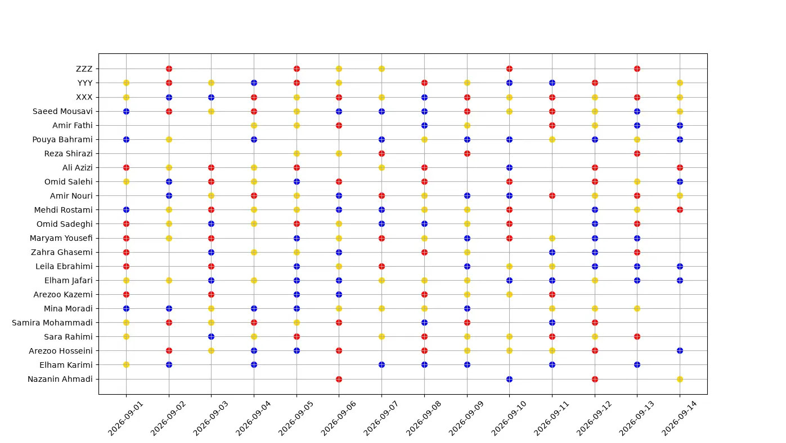

### <i class="fa-solid fa-droplet"></i> پروژه ۳ — مدیریت موجودی خون (Blood Bank Inventory)

**دقیقاً چه مسئله‌ای قرار است حل شود —** موجودی کیسه‌های خون با تاریخ انقضای مشخص و تقاضای مصرف روزانه داریم. باید
مشخص شود در هر روز چه مقدار خون از کدام تاریخ انقضا مصرف شود (به ترتیب FIFO)، طوری‌که هم کمبود برای تقاضای هر روز پیش
نیاید و هم دورریز ناشی از انقضا کمینه شود.

**چه یاد می‌گیرید —** مدل‌سازی موجودی با تاریخ انقضا و سیاست FIFO (اول واردشده، اول مصرف‌شده) برای کمینه‌کردن دورریز و
کمبود هم‌زمان.

* توضیح خط‌به‌خط قیود موجودی چنددوره‌ای و اولویت مصرف بر اساس تاریخ انقضا
* تحلیل حساسیت: افزایش تقاضای اهدای خون ۱۰٪ چه تأثیری روی نرخ دورریز دارد؟
* ویژوالیزیشن: نمودار سطح موجودی در طول زمان به‌تفکیک گروه خونی
* ورودی/خروجی اکسل: ثبت روزانه‌ی اهدا و مصرف در فایل اکسل

🎥 [مشاهده ویدیوی معرفی این پروژه](https://www.aparat.com/v/fwvblk2)

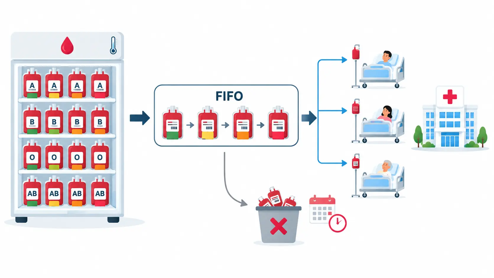

### <i class="fa-solid fa-bed-pulse"></i> پروژه ۴ — تخصیص تخت ICU (ICU Bed Allocation)

**دقیقاً چه مسئله‌ای قرار است حل شود —** تعداد تخت ICU محدود و لیستی از بیماران در انتظار با شدت بیماری متفاوت داریم.
باید مشخص شود کدام بیماران تخت دریافت کنند، طوری‌که مجموع اولویت بالینی (بر اساس شاخص شدت بیماری) بیماران پذیرفته‌شده
بیشینه شود.

**چه یاد می‌گیرید —** نسخه‌ی اولویت‌دار مسئله‌ی کوله‌پشتی: به‌جای «ارزش»، از شاخص شدت بیماری (مثلاً APACHE score)
استفاده می‌کنیم.

* توضیح خط‌به‌خط تابع هدف وزن‌دار بر اساس اولویت بالینی
* تحلیل حساسیت: اضافه‌شدن دو تخت موقت چقدر لیست انتظار را کوتاه می‌کند؟
* ویژوالیزیشن: نمودار اشغال تخت‌ها به تفکیک اولویت
* ورودی/خروجی اکسل: لیست بیماران در انتظار با شدت بیماری از اکسل
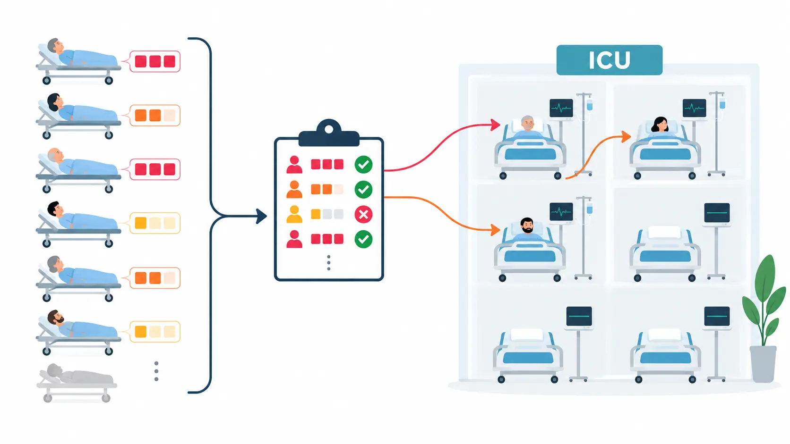

### <i class="fa-solid fa-syringe"></i> پروژه ۵ — مکان‌یابی مراکز واکسیناسیون (Vaccination Site Location)

**دقیقاً چه مسئله‌ای قرار است حل شود —** چند نقطه‌ی کاندید برای احداث مرکز واکسیناسیون و چند منطقه با جمعیت مشخص
داریم. باید مشخص شود کدام مراکز باز شوند و هر منطقه به کدام مرکز باز تخصیص یابد، طوری‌که با بودجه‌ی محدود برای باز
کردن مراکز، بیشترین جمعیت ممکن پوشش داده شود.

**چه یاد می‌گیرید —** مسئله‌ی کلاسیک مکان‌یابی-تخصیص: کدام مراکز باز شوند و هر منطقه به کدام مرکز باز تخصیص یابد تا با
کمترین هزینه، بیشترین جمعیت پوشش داده شود.

* توضیح خط‌به‌خط مدل باز/بسته‌بودن مکان + تخصیص جمعیت به نزدیک‌ترین مرکز باز
* تحلیل حساسیت: اگر بودجه‌ی باز کردن یک مرکز جدید نصف شود، پوشش جمعیتی چقدر افت می‌کند؟
* ویژوالیزیشن: نقشه‌ی نقاط پوشش‌داده‌شده و مراکز انتخابی
* ورودی/خروجی اکسل: مختصات مناطق و جمعیت هرکدام از فایل اکسل

### <i class="fa-solid fa-diagram-project"></i> پروژه ۶ — جریان بیمار در اورژانس (ED Patient Flow)

**دقیقاً چه مسئله‌ای قرار است حل شود —** هر بیمار باید به‌ترتیب از ایستگاه‌های تریاژ، معاینه و انتقال عبور کند و در
هر ایستگاه به یکی از منابع اختصاصی همان ایستگاه نیاز دارد؛ زمان ورود و مدت هر مرحله از پیش معلوم است. باید زمان شروع
هر مرحله و تخصیص منبع هر بیمار مشخص شود، طوری‌که تأخیر وزن‌دار بر اساس شدت بیمار (ESI) کمینه شود.

**چه یاد می‌گیرید —** مدل‌سازی مسیر بیمار از پذیرش تا انتقال به‌صورت یک زمان‌بندی چند-مرحله‌ای قطعی (deterministic
flow-shop) با CP-SAT؛ هر بیمار به‌ترتیب از ایستگاه‌های تریاژ، معاینه و انتقال عبور می‌کند و در هر ایستگاه به یکی از
منابع اختصاصی همان ایستگاه (پزشک تریاژ، پزشک معاینه، یا تخت/تجهیزات انتقال) تخصیص می‌یابد.

* تعریف بازه‌های زمانی اختیاری (optional interval) برای هر ترکیب بیمار-ایستگاه-منبع و قید عدم همپوشانی (no-overlap) روی
  هر منبع
* قید توالی بین ایستگاه‌ها: هر مرحله فقط پس از پایان مرحله‌ی قبلی همان بیمار شروع می‌شود
* تابع هدف وزن‌دار بر اساس شدت بیمار (ESI): هرچه ESI پایین‌تر و بیمار بحرانی‌تر، وزن تأخیرش در تابع هدف بیشتر می‌شود
* بدون صف یا عدم قطعیت — زمان ورود و مدت هر مرحله از پیش معلوم است؛ تمرکز پروژه فقط روی زمان‌بندی و تخصیص منبع است
* ویژوالیزیشن با matplotlib: نمودار گانت زمان‌بندی هر بیمار در طول ایستگاه‌ها، به‌همراه نمودار گانت اشغال هر منبع
* ورودی از اکسل: فهرست بیماران (ESI، زمان ورود، مدت هر مرحله) و تعداد منابع هر ایستگاه

🎥 [مشاهده ویدیوی معرفی این پروژه](https://www.aparat.com/v/afo3m92)

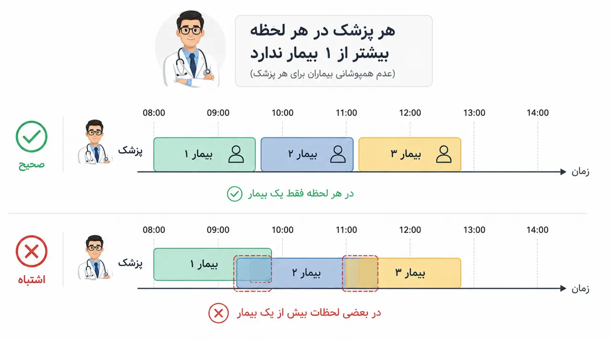

### <i class="fa-solid fa-hand-holding-heart"></i> پروژه ۷ — تطبیق اهداکننده-گیرنده‌ی عضو (Organ Matching)

**دقیقاً چه مسئله‌ای قرار است حل شود —** مجموعه‌ای از بیماران داریم که هرکدام هم می‌توانند اهداکننده باشند هم گیرنده‌ی
عضو، و سازگاری هر جفت بر اساس گروه خونی و بافتی مشخص است. باید بیماران در گروه‌های تبادل کوچک دسته‌بندی شوند و درون هر
گروه چرخه‌های اهدای سازگار شکل بگیرد، طوری‌که هر بیمار حداکثر یک‌بار اهداکننده و یک‌بار گیرنده باشد و مجموع وزن
تطبیق‌های موفق بیشینه شود.

**چه یاد می‌گیرید —** تطبیق با قیود سازگاری (گروه خونی، بافتی) به‌صورت چرخه‌های تبادل عضو — پایه‌ی الگوریتم‌های واقعی
تخصیص عضو در دنیا.

* توضیح خط‌به‌خط مدل بهینه‌سازی محدودیتی: متغیرهای تخصیص هر بیمار به یک گروه، و متغیرهای فعال‌سازی یال اهدا بین دو بیمار
  درون یک گروه، به همراه قید موازنه‌ای که هر بیمار را دقیقاً یک‌بار اهداکننده و یک‌بار گیرنده می‌کند
* محدودیت اندازه‌ی هر گروه و شکستن تقارن بین گروه‌ها؛ تحلیل اینکه با بیست بیمار و پنج گروه با ظرفیت سه‌نفره، حداقل چند
  بیمار به‌صورت ساختاری بدون تطبیق باقی می‌مانند
* ورودی/خروجی مدل: ماتریس مجاورتِ وزن‌دار میان بیماران (شبیه‌سازی‌شده از گروه خونی و بافتی) به‌عنوان ورودی؛ خروجی شامل
  فهرست یال‌های فعال هر گروه، مجموع وزن بهینه، و فهرست بیماران تخصیص‌نیافته

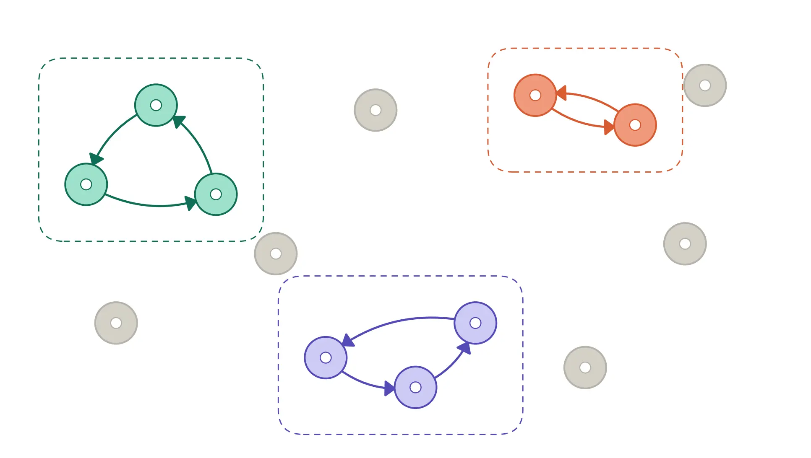

### <i class="fa-solid fa-calendar-days"></i> پروژه ۸ — زمان‌بندی اتاق عمل (Operating Room Scheduling)

**دقیقاً چه مسئله‌ای قرار است حل شود —** مجموعه‌ای از جراحی‌ها، اتاق‌های عمل و جراحان با ساعات کاری و در دسترس‌بودن
مشخص داریم. باید مشخص شود کدام جراحی‌ها امروز پذیرفته شوند و هرکدام به کدام اتاق و کدام جراح در چه بازه‌ی زمانی
تخصیص یابد، طوری‌که هیچ دو جراحی در یک اتاق یا برای یک جراح هم‌پوشانی نداشته باشند و مجموع وزنی جراحی‌های پذیرفته‌شده
(بر اساس اولویت پزشکی) بیشینه شود.

**چه یاد می‌گیرید —** استفاده از متغیرهای بازه‌ای اختیاری برای تخصیص هم‌زمان هر جراحی به یک اتاق و یک جراح، با قید عدم
هم‌پوشانی جداگانه روی هر منبع، در مدلی که می‌تواند برخی جراحی‌ها را عقب بیندازد (نه یک زمان‌بندی اجباری برای همه).

* هر جراحی یک متغیر تصمیم دارد که مشخص می‌کند آیا اصلاً امروز پذیرفته و زمان‌بندی می‌شود یا نه؛ قیدهای مدل تضمین می‌کنند
  که جراحی پذیرفته‌شده دقیقاً یک اتاق و یک جراح بگیرد، و جراحی رد‌شده هیچ‌کدام را
* دو قید عدم هم‌پوشانی مجزا تعریف شده: یکی روی بازه‌های اشغال هر **اتاق**، دیگری روی بازه‌های اشغال هر **جراح** — بازه‌ی
  مربوط به جراح کمی بزرگ‌تر از بازه‌ی مربوط به اتاق در نظر گرفته شده تا استراحت بین دو عمل متوالی همان جراح رعایت شود،
  حتی اگر در اتاق‌های مختلف باشند
* بازه‌های زمانی‌ای که یک اتاق یا جراح از پیش در دسترس نیست، به‌صورت بازه‌های ثابت در همان مجموعه‌ی قید عدم هم‌پوشانی
  وارد شده‌اند، نه با قید جداگانه
* محدودشدن هر جراحی به ساعات کاری جراحش فقط وقتی اعمال می‌شود که آن جراح واقعاً به آن عمل تخصیص یافته باشد
* تابع هدف: بیشینه‌سازی مجموع وزنی جراحی‌های پذیرفته‌شده بر اساس اولویت پزشکی‌شان — نه کمینه‌سازی تأخیر
* ویژوالیزیشن: نمودار گانت با محور عمودی اتاق‌ها، محور افقی زمان، رنگ هر خط بر اساس جراح تخصیص‌یافته، و فهرست جراحی‌های
  عقب‌افتاده در خروجی کنسول
* ورودی/خروجی اکسل: خواندن داده‌ی جراحی‌ها، جراحان و اتاق‌ها از یک فایل اکسل ورودی
  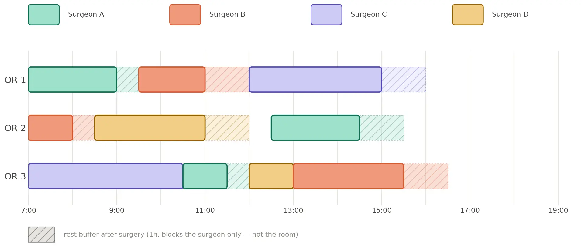

### <i class="fa-solid fa-scale-balanced"></i> پروژه ۹ — برنامه‌ریزی عادلانه‌ی شیفت پرستاران با قید پنجره‌ی غلتان

**دقیقاً چه مسئله‌ای قرار است حل شود —** برای هر پرستار در هر روز باید مشخص شود که آیا شیفت شب دارد یا تعطیل است، با
رعایت سقف شیفت شب در هر پنجره‌ی پنج‌روزه و حداقل تعداد تعطیلی در هر پنجره‌ی هفت‌روزه. باید این تخصیص طوری تعیین شود که
بیشترین تعداد شیفت شب بین همه‌ی پرستاران (نه مجموع کل) کمینه شود، یعنی بار شبانه به‌صورت عادلانه توزیع شود.

**چه یاد می‌گیرید —** ترکیب سه قید مکمل: یک قید پنجره‌ی غلتان کوتاه که مجموع شیفت‌های شب را در هر پنج روز متوالی محدود
می‌کند؛ یک قید پنجره‌ی غلتان بلندتر که حداقل تعداد تعطیلی را در هر هفت روز متوالی تضمین می‌کند؛ یعنی هدف از «بیشینه‌کردن
پوشش» به «توازن عادلانه‌ی بار» تغییر می‌کند.

* توضیح خط‌به‌خط: بولین‌سازی شیفت شب و تعطیلی برای هر پرستار در هر روز، قید پنجره‌ی پنج‌روزه (حداکثر دو شب)، قید پنجره‌ی
  هفت‌روزه (حداقل دو تعطیلی)، و قید هدف (بیشترین تعداد شب بین همه‌ی پرستارها کمینه می‌شود)
* تحلیل حساسیت: طول پنجره‌ها یا سقف/کف مجاز را تغییر دهید — بیشترین بار شبانه و امکان‌پذیری کلی مسئله چقدر تغییر می‌کند؟
* ویژوالیزیشن: نمودار میله‌ای تعداد کل شیفت‌های شب هر پرستار + یک نمای شیفت روزانه برای بررسی بصری هر دو پنجره 
* ورودی/خروجی اکسل: پرستاران، بیماران، دسترسی‌ها + چهار پارامتر قابل‌تنظیم: طول هر پنجره و سقف/کف مجاز آن

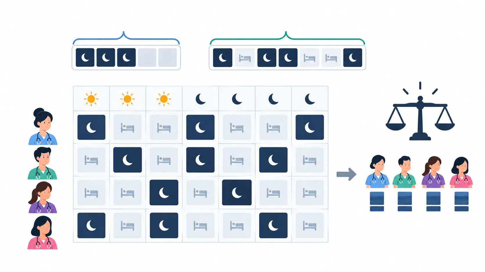

### <i class="fa-solid fa-house-chimney-medical"></i> پروژه ۱۰ — توالی بازدید پایه‌ی مراقبت در منزل (Home Healthcare Sequencing)

**دقیقاً چه مسئله‌ای قرار است حل شود —** یک پرستار مراقبت در منزل و تعدادی بیمار مشخص در موقعیت‌های مختلف داریم که همگی
باید در یک روز بازدید شوند. باید بهترین توالی بازدید پیدا شود — پرستار از بیمارستان محل خدمتش شروع می‌کند، سر همه‌ی
بیماران می‌رود و در پایان به همان بیمارستان برمی‌گردد — طوری‌که مجموع زمان کل رفت‌وآمد کمینه شود.

**چه یاد می‌گیرید —** تعیین بهترین ترتیب بازدید از چند بیمار برای کمینه‌کردن زمان کل رفت‌وآمد.

* توضیح خط‌به‌خط مدل `AddCircuit` برای یافتن بهترین توالی
* تحلیل حساسیت: اضافه‌شدن یک بیمار جدید به لیست، زمان کل را چقدر افزایش می‌دهد؟
* ویژوالیزیشن: نقشه‌ی توالی بازدید روی مختصات جغرافیایی
* ورودی/خروجی اکسل: آدرس/مختصات بیماران روزانه از اکسل
  

### <i class="fa-solid fa-hourglass-half"></i> پروژه ۱۱ — مسیریابی مراقبت در منزل با پنجره‌ی زمانی

**دقیقاً چه مسئله‌ای قرار است حل شود —** علاوه بر تعیین توالی بازدید، هر بیمار فقط در یک بازه‌ی زمانی مشخص در دسترس
است (مثلاً قبل از کار یا بعد از مدرسه‌ی فرزندش). باید توالی‌ای پیدا شود که هم مجموع زمان کل رفت‌وآمد را کمینه کند و هم
به هر بیمار فقط داخل بازه‌ی زمانی مجازش سر زده شود.

**چه یاد می‌گیرید —** افزودن قید بازه‌ی زمانی مجاز برای هر بیمار به مدل توالی.

* تحلیل حساسیت: تنگ‌کردن پنجره‌ی زمانی یک بیمار خاص، برنامه‌ی کل روز را چقدر به‌هم می‌ریزد؟
* خروجی: زمان ورود واقعی به هر بیمار و میزان توقف/انتظار پیش از شروع خدمت محاسبه و گزارش می‌شود
* ویژوالیزیشن: نقشه‌ی توالی بازدید روی مختصات جغرافیایی بیماران و بیمارستان
* ورودی/خروجی اکسل: مختصات و پنجره‌ی زمانی (شروع/پایان) هر بیمار از فایل اکسل

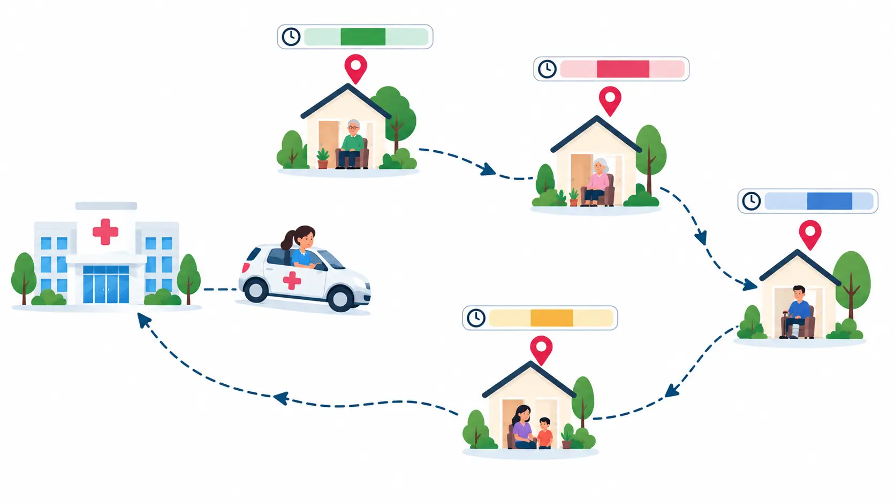

### <i class="fa-solid fa-star-half-stroke"></i> پروژه ۱۲ — انتخاب و توالی بازدید با بودجه‌ی زمانی محدود (Home Care Visit Selection)

**دقیقاً چه مسئله‌ای قرار است حل شود —** تعداد بیماران نیازمند بازدید بیشتر از بودجه‌ی زمانی روزانه‌ی پرستار است، پس
همه‌ی بیماران قابل پوشش نیستند. باید مشخص شود کدام زیرمجموعه از بیماران (بر اساس امتیاز اولویت) انتخاب و با چه توالی‌ای
بازدید شوند، طوری‌که در بودجه‌ی زمانی روزانه جا بگیرند و مجموع امتیاز اولویت پوشش‌داده‌شده بیشینه شود. برخلاف پروژه‌های
توالی قبلی، اینجا پرستار لازم نیست در پایان روز به بیمارستان برگردد.

**چه یاد می‌گیرید —** نسخه‌ای از مسئله‌ی مسیریابی با انتخاب هم‌زمان (شبیه Team Orienteering Problem): برخلاف پروژه‌های
قبلی که همه‌ی بیماران باید پوشش داده شوند، اینجا مدل هم تصمیم می‌گیرد کدام بیماران در بودجه‌ی زمانی روزانه جا می‌گیرند و
هم بهترین توالی بازدید همان بیماران انتخاب‌شده را می‌یابد؛ تابع هدف بیشینه‌سازی امتیاز اولویت کل پوشش‌داده‌شده است.

* توضیح خط‌به‌خط متغیر انتخاب/عدم‌انتخاب هر بیمار در کنار قید تامین جزئی که توالی را فقط بین بیماران
  انتخاب‌شده می‌بندد
* تحلیل حساسیت: افزایش بودجه‌ی زمانی روزانه ۳۰ دقیقه، چند بیمار بیشتر پوشش می‌گیرد و کدام بیماران کم‌اولویت از لیست خارج
  می‌مانند؟
* ویژوالیزیشن: نقشه‌ی بیماران پوشش‌داده‌شده در برابر پوشش‌نیافته، رنگ‌بندی‌شده بر اساس امتیاز اولویت
* ورودی/خروجی اکسل: امتیاز اولویت هر بیمار، مختصات، و بودجه‌ی زمانی روزانه‌ی پرستار

### <i class="fa-solid fa-weight-hanging"></i> پروژه ۱۳ — مسیریابی ظرفیت‌دار مراقبت در منزل

**دقیقاً چه مسئله‌ای قرار است حل شود —** چند پرستار به‌طور هم‌زمان و مجموعه‌ای از بیماران داریم؛ هر پرستار سقف مشخصی از
تعداد ویزیت یا ساعت کاری دارد و مسیرش را از بیمارستان محل خدمتش شروع می‌کند و در پایان به همان بیمارستان برمی‌گردد.
باید مشخص شود کدام بیمار به کدام پرستار تعلق بگیرد و توالی بازدید هر پرستار چه باشد، طوری‌که سقف ظرفیت هیچ‌کدام رد نشود
و مجموع زمان کار همه‌ی پرستاران کمینه شود.

**چه یاد می‌گیرید —** تقسیم بیماران بین چند پرستار هم‌زمان با رعایت سقف ظرفیت هرکدام (سقف ساعت کاری یا تعداد بیمار) در مدل توالی.

* توضیح خط‌به‌خط تقسیم بیماران بین چند پرستار با رعایت سقف ظرفیت هرکدام
* تحلیل حساسیت: کاهش ظرفیت هر پرستار به یک ویزیت کمتر، چند پرستار اضافه لازم دارد؟
* ویژوالیزیشن: نقشه‌ی رنگی مسیرهای هر پرستار
* ورودی/خروجی اکسل: ظرفیت هر پرستار و لیست بیماران روزانه

### <i class="fa-solid fa-truck-medical"></i> پروژه ۱۴ — اعزام آمبولانس چندپایگاهی و انتخاب بیمارستان مقصد (Multi-Depot Ambulance-to-Hospital Assignment)

**دقیقاً چه مسئله‌ای قرار است حل شود —** ۲ پایگاه آمبولانس، ۷ آمبولانس (هرکدام مستقر در یکی از ۲ پایگاه)، ۳ بیمارستان
(هرکدام با سقف پذیرش مشخص) و ۱۲ بیمار در موقعیت‌های مختلف داریم. باید مشخص شود کدام آمبولانس به سراغ کدام بیمار برود و
همان بیمار را به کدام بیمارستان منتقل کند، طوری‌که سقف پذیرش هیچ بیمارستانی رد نشود و آمبولانس پس از تحویل بیمار به
پایگاه خودش (نه هر پایگاهی) بازگردد؛ یعنی مسیر هر آمبولانس یک رفت‌وبرگشت کامل پایگاه ← بیمار ← بیمارستان ← همان پایگاه
است، و هدف کمینه‌کردن مجموع زمان این رفت‌وبرگشت‌ها روی هر ۱۲ بیمار است.

**چه یاد می‌گیرید —** یک مسئله‌ی تخصیص سه‌طرفه: سه تصمیم به هم زنجیر می‌شوند — کدام آمبولانس (با پایگاه مبدأ معلومش) به
کدام بیمار برود، و همان بیمار به کدام بیمارستان منتقل شود؛ با قید ظرفیت پذیرش هر بیمارستان که تخصیص مقصد را محدود می‌کند.
پس از تحویل بیمار، آمبولانس باید به پایگاه خودش بازگردد، پس مسیر هر آمبولانس یک رفت‌وبرگشت کامل است: پایگاه ← بیمار ←
بیمارستان ← همان پایگاه.

* توضیح خط‌به‌خط دو گروه متغیر باینری زنجیرشده: تخصیص آمبولانس↔بیمار (با فاصله‌ی هر آمبولانس از پایگاه مبدأش) و تخصیص
  بیمار↔بیمارستان، به‌همراه قید پیوندی که مقصد را فقط برای بیمارانِ تخصیص‌یافته فعال می‌کند
* قید سقف پذیرش هر بیمارستان در همان نوبت اعزام
* تابع هدف: کمینه‌سازی مجموع زمان کل رفت‌وبرگشت (پایگاه تا بیمار + بیمار تا بیمارستان + بیمارستان تا همان پایگاه) روی
  هر ۱۲ بیمار
* تحلیل حساسیت: پر شدن ظرفیت نزدیک‌ترین بیمارستان به یک خوشه از بیماران، چقدر به زمان کل و طول مسیر آمبولانس‌های آن
  منطقه اضافه می‌کند؟
* ویژوالیزیشن: نقشه‌ای با ۲ پایگاه، ۷ آمبولانس، ۱۲ بیمار و ۳ بیمارستان، با خطوط رنگی برای مسیر رفت‌وبرگشت کامل هر
  آمبولانس (پایگاه ← بیمار ← بیمارستان ← پایگاه)
* ورودی/خروجی اکسل: مختصات ۲ پایگاه و ۳ بیمارستان (با ظرفیت پذیرش هرکدام)، لیست ۱۲ بیمار و موقعیتشان، ماتریس فاصله
  (Haversine)
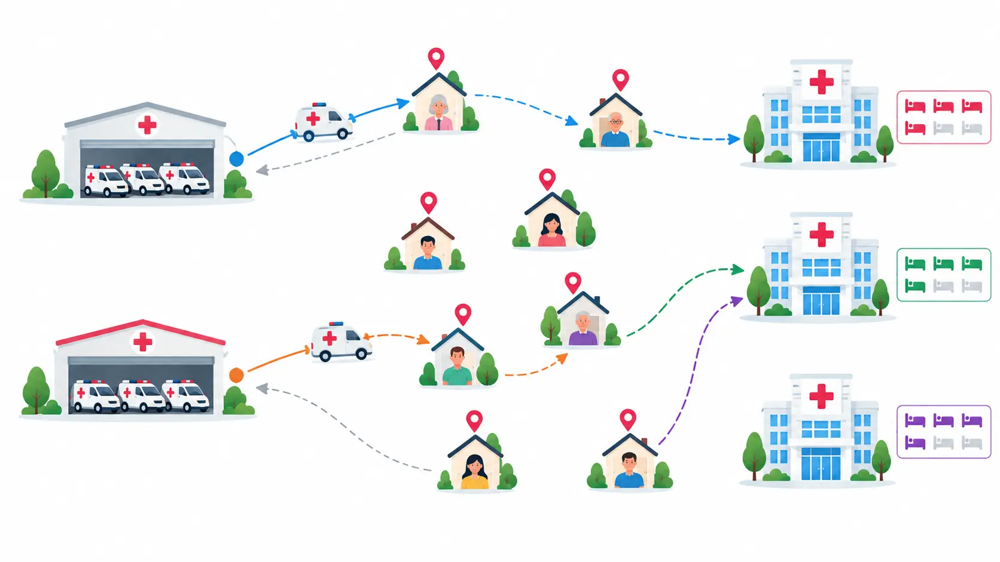

### <i class="fa-solid fa-truck-medical"></i> پروژه ۱۵ — جابجایی داروی کمیاب بین بیمارستان‌ها با ناوگان محدود (Scarce Medicine Transfer)

**دقیقاً چه مسئله‌ای قرار است حل شود —** تعدادی سفارش جابجایی داروی کمیاب داریم که هرکدام بیمارستان مبدأ، بیمارستان
مقصد و مقدار داروی مشخصی دارند (مبدأ و مقصد هر سفارش از پیش معلوم است). تعداد ماشین‌های حمل دارو محدود است و هر ماشین
می‌تواند در طول روز چند سفارش را پشت‌سرهم انجام دهد. باید مشخص شود کدام ماشین کدام سفارش‌ها را انجام دهد و با چه
ترتیبی، طوری‌که زمان کاری هیچ ماشینی از بودجه‌ی روزانه‌اش بیشتر نشود و مجموع (یا بیشینه‌ی) زمان کاری ماشین‌ها کمینه شود.

**چه یاد می‌گیرید —** تخصیص و توالی سفارش‌های حمل به یک ناوگان محدود از ماشین‌ها، با قید سقف زمانی روزانه‌ی هر ماشین؛
برخلاف پروژه‌های توالی بازدید که مبدأ و مقصد هر توقف یکسان بود، اینجا هر سفارش خودش یک مسیر مبدأ→مقصد ثابت است که باید
در توالی کاری یک ماشین جای بگیرد.

* توضیح خط‌به‌خط متغیر تخصیص هر سفارش به یک ماشین به‌همراه قید توالی سفارش‌های تخصیص‌یافته به همان ماشین و قید سقف
  زمانی روزانه
* تحلیل حساسیت: اضافه‌شدن یک ماشین جدید به ناوگان، مجموع زمان کاری کل و بیشینه‌ی بار کاری یک ماشین را چقدر کاهش
  می‌دهد؟
* ویژوالیزیشن: نقشه‌ی مسیر مبدأ→مقصد هر سفارش، رنگ‌بندی‌شده بر اساس ماشینی که آن را انجام می‌دهد
* ورودی/خروجی اکسل: لیست سفارش‌ها (بیمارستان مبدأ، بیمارستان مقصد، مقدار دارو) و بودجه‌ی زمانی روزانه‌ی هر ماشین
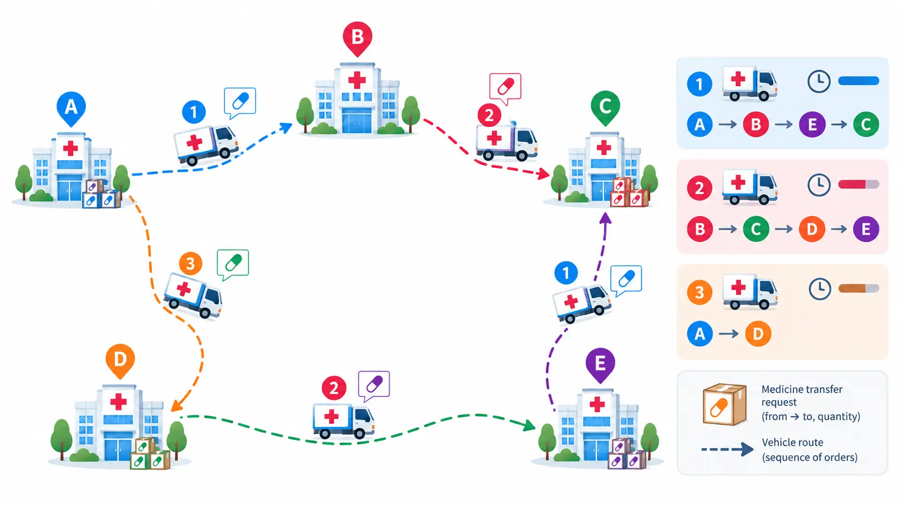

### <i class="fa-solid fa-boxes-packing"></i> پروژه ۱۶ — توزیع دارو به درمانگاه‌های سرپایی با تحویل تقسیم‌پذیر (Split Delivery to Outpatient Clinics)

**دقیقاً چه مسئله‌ای قرار است حل شود —** چند درمانگاه سرپایی داریم که هرکدام به مقدار مشخصی دارو/واکسن نیاز دارند؛
تقاضای برخی درمانگاه‌ها از ظرفیت یک ماشین بیشتر است. تعداد محدودی ماشین توزیع با ظرفیت مشخص داریم. باید مسیر هر ماشین
و مقدار تحویلی در هر توقف تعیین شود، طوری‌که هر درمانگاه بتواند طی بیش از یک بازدید (حتی توسط ماشین‌های مختلف) تا سقف
تقاضایش دارو دریافت کند، و مجموع مسافت طی‌شده‌ی همه‌ی ماشین‌ها کمینه شود.

**چه یاد می‌گیرید —** مسئله‌ی مسیریابی با تحویل تقسیم‌پذیر (Split Delivery VRP): برخلاف مسیریابی معمولی که هر توقف
دقیقاً یک‌بار و توسط یک ماشین بازدید می‌شود، اینجا تقاضای یک درمانگاه می‌تواند بین چند بازدید تقسیم شود؛ تصمیم دیگر
صرفاً باینریِ «بازدید یا نه» نیست، بلکه شامل مقدار تحویلی در هر بازدید هم هست.

* توضیح خط‌به‌خط متغیر پیوسته‌ی مقدار تحویل در هر ترکیب ماشین-توقف، به‌همراه قید تأمین کامل تقاضا از مجموع تحویل‌های
  همان درمانگاه در طول همه‌ی مسیرها
* قید ظرفیت هر ماشین در هر مسیر و امکان بازدید تکراری از یک درمانگاه در مسیرهای مختلف
* تحلیل حساسیت: کاهش ظرفیت هر ماشین ۲۰٪، چند بازدید تکراری اضافه به مسیرها اضافه می‌شود؟
* ویژوالیزیشن: نقشه‌ی مسیر هر ماشین با نمایش مقدار تحویلی در هر توقف (حتی توقف‌های تکراری روی یک درمانگاه)
* ورودی/خروجی اکسل: تقاضای هر درمانگاه، ظرفیت هر ماشین، و مختصات همه‌ی نقاط از فایل اکسل
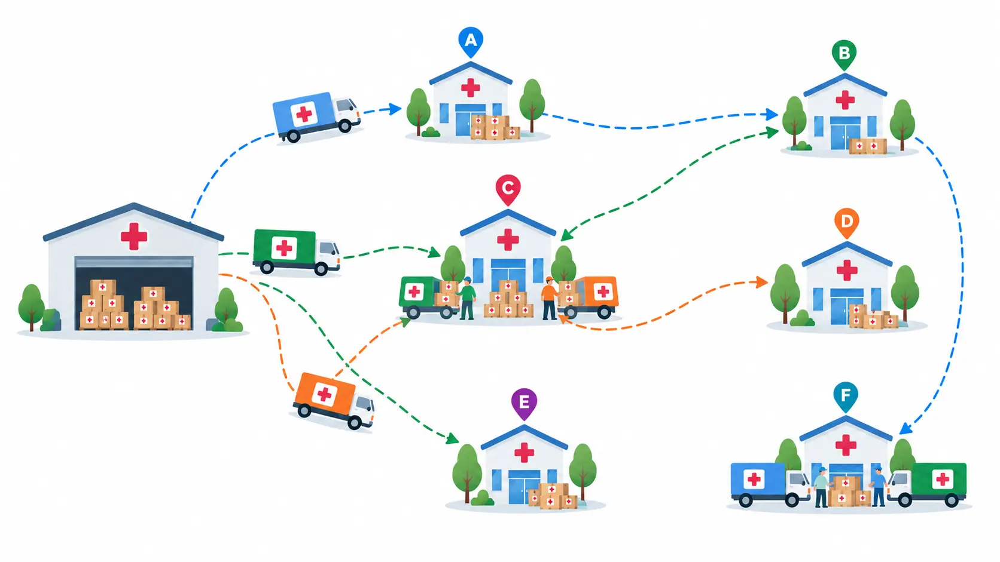

### <i class="fa-solid fa-charging-station"></i> پروژه ۱۷ — مسیریابی ماشین‌های برقی تیم شیمی‌درمانی سیار با ایستگاه شارژ (Electric VRP with Charging Stations)

**دقیقاً چه مسئله‌ای قرار است حل شود —** یک ناوگان از ماشین‌های برقی برای اعزام تیم شیمی‌درمانی سیار به منزل بیماران
داریم؛ هر ماشین برد باتری محدودی دارد و چند ایستگاه شارژ ثابت هم در سطح شهر وجود دارد. هر بازدید بیمار مدت‌زمان
سرویس مشخصی طول می‌کشد و هر توقف شارژ هم بسته به مقدار شارژ موردنیاز مدتی زمان می‌برد. باید مسیر هر ماشین بین بیماران
تعیین شود و در صورت نیاز، توقف در یکی از ایستگاه‌های شارژ هم در همان مسیر جای بگیرد، طوری‌که باتری هیچ ماشینی در
میانه‌ی مسیر تمام نشود و مجموع زمان کل (رفت‌وآمد + سرویس بیماران + شارژ) کمینه شود.

**چه یاد می‌گیرید —** مسیریابی وسایل نقلیه‌ی برقی با ایستگاه شارژ (Electric VRP with Charging Stations): برخلاف یک
قید ساده‌ی برد باتری، اینجا ماشین می‌تواند با توقف در یک ایستگاه شارژ، باتری‌اش را در میانه‌ی مسیر شارژ کند و برد
سفرش را افزایش دهد؛ مدل هم ترتیب بازدید بیماران را تعیین می‌کند و هم اینکه کدام ایستگاه شارژ (و در چه نقطه‌ای از
مسیر) بازدید شود — با احتساب مدت‌زمان واقعی هر بازدید و هر توقف شارژ در محاسبه‌ی زمان کل مسیر.

* توضیح خط‌به‌خط متغیر سطح باتری در طول مسیر و قید عدم
  منفی‌شدن باتری در هیچ نقطه‌ای از مسیر
* درج اختیاری هر ایستگاه شارژ در مسیر با زمان توقف متناسب با مقدار شارژ دریافتی، به‌همراه
  مدت‌زمان سرویس ثابت هر بیمار که به زمان کل هر توقف اضافه می‌شود
* تحلیل حساسیت: کاهش برد باتری ۱۵٪ (مثلاً به‌خاطر هوای سرد)، چند توقف شارژ اضافه به مسیرها اضافه می‌شود و زمان کل
  روز چقدر افزایش می‌یابد؟
* ویژوالیزیشن: نقشه‌ی مسیر هر ماشین با علامت‌گذاری توقف‌های شارژ و سطح باتری در طول مسیر، به‌همراه نمودار زمانی
  ترکیب سفر/سرویس/شارژ هر ماشین
* ورودی/خروجی اکسل: مختصات بیماران و ایستگاه‌های شارژ، برد باتری و نرخ شارژ هر ماشین، مدت‌زمان سرویس هر بیمار

### <i class="fa-solid fa-temperature-low"></i> پروژه ۱۸ — توزیع دارو با زنجیره‌ی سرد و بارگیری چندمبدأ (Cold-Chain Pickup-and-Delivery)

**دقیقاً چه مسئله‌ای قرار است حل شود —** برخلاف بارگیری از یک دپوی مشترک، هر محموله‌ی دارویی/واکسن نقطه‌ی بارگیری خودش
(مثلاً یک انبار دارویی) و نقطه‌ی تحویل خودش (یک درمانگاه) را دارد. سقف زمانی مجاز خارج از یخچال هم برای هر محموله
متفاوت است — مثلاً یک واکسن حساس ممکن است سقفی به‌مراتب کوتاه‌تر از یک داروی دیگر داشته باشد. باید توالی بازدید یک
ماشین از همه‌ی نقاط بارگیری و تحویل تعیین شود، طوری‌که نقطه‌ی بارگیری هر محموله پیش از نقطه‌ی تحویل همان محموله در
مسیر بیاید، و فاصله‌ی زمانی واقعی بین لحظه‌ی بارگیری و لحظه‌ی تحویل هر محموله — که خودش نتیجه‌ی توالی انتخابی مسیر
است، نه یک بازه‌ی از پیش تعیین‌شده — از سقف مجاز مخصوص همان محموله بیشتر نشود.

**چه یاد می‌گیرید —** مسئله‌ی بارگیری-تحویل با سقف زمان جابجایی ناهمگن: برخلاف پنجره‌ی زمانی ثابت که مستقل از مسیر
تعیین می‌شود، اینجا سقف زمانی هر محموله هم به لحظه‌ی بارگیری واقعی‌اش (خروجی تصمیم توالی مسیر) نسبت داده می‌شود و هم
مقدارش از محموله‌ای به محموله‌ی دیگر فرق می‌کند؛ به‌همراه قید تقدم که هر بارگیری باید پیش از تحویل همان محموله در مسیر
قرار گیرد. این همان ساختار «سقف زمان سواری» است که در ادبیات مسیریابی برای جابجایی مسافر هم به‌کار می‌رود، با این تفاوت
که اینجا به‌جای مسافر، محموله جابجا می‌شود.

* توضیح خط‌به‌خط قید تقدم بارگیری-تحویل هر محموله (بارگیری باید در توالی مدار پیش از تحویل همان محموله بیاید)
* قید سقف زمانی نسبی و ناهمگن: تفاضل لحظه‌ی تحویل و لحظه‌ی بارگیری هر محموله نباید از حد مجاز مخصوص همان محموله
  بیشتر شود
* تحلیل حساسیت: افزایش سقف مجاز فقط یک نوع دارو خاص (نه همه) ۱۰ دقیقه، چند ترتیب مسیر جدید (و چند محموله‌ی بیشتر)
  امکان‌پذیر می‌شود؟
* ویژوالیزیشن: نقشه‌ی مسیر با فلش‌های جداگانه برای هر جفت بارگیری→تحویل، رنگ‌بندی‌شده بر اساس محموله
* ورودی/خروجی اکسل: مختصات هر نقطه‌ی بارگیری و تحویل، و سقف زمانی مجاز مخصوص هر محموله
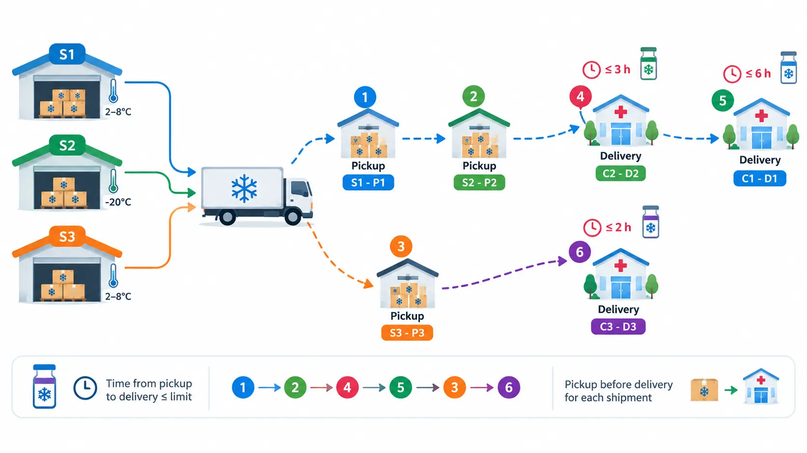

### <i class="fa-solid fa-virus"></i> پروژه ۱۹ — تخصیص منابع در بحران/پاندمی (Pandemic Resource Allocation)

**دقیقاً چه مسئله‌ای قرار است حل شود —** در طول چند دوره‌ی زمانی (روز/هفته)، مقدار مشخصی منبع (تخت، اکسیژن، واکسن)
داریم که باید بین چند منطقه با روند تقاضای متفاوت توزیع شود. باید مشخص شود در هر دوره چه مقدار منبع به کدام منطقه
اختصاص یابد، طوری‌که در هیچ دوره‌ای هیچ منطقه‌ای دچار کمبود نشود.

**چه یاد می‌گیرید —** بهینه‌سازی چنددوره‌ای: تصمیم تخصیص منابع در طول چند روز/هفته با در نظر گرفتن روند تقاضا. اگر
می‌خواهید فراتر از یک پیش‌بینی قطعی بروید و عدم‌قطعیت رشد تقاضا را هم صریح در مدل وارد کنید،
دوره [مدل‌سازی عدم‌قطعیت](/courses/uncertainty-modeling/) ابزارهای لازم را می‌دهد.

* توضیح خط‌به‌خط مدل چنددوره‌ای و قید عدم کمبود در هر دوره
* تحلیل حساسیت: اگر تقاضای یک منطقه ۲۰٪ سریع‌تر از پیش‌بینی رشد کند، کمبود کِی شروع می‌شود؟
* ویژوالیزیشن: نمودار روند تخصیص منابع بین مناطق در طول زمان
* ورودی/خروجی اکسل: پیش‌بینی تقاضای روزانه‌ی هر منطقه از اکسل

### <i class="fa-solid fa-helicopter"></i> پروژه ۲۰ — امداد پهپادی به مناطق آسیب‌دیده (Disaster-Relief Drone Dispatch)

**دقیقاً چه مسئله‌ای قرار است حل شود —** چند پهپاد با برد باتری محدود و چند منطقه‌ی آسیب‌دیده با اولویت مشخص داریم.
باید مشخص شود کدام پهپاد به کدام مناطق برود و با چه توالی پروازی آن‌ها را پوشش دهد، طوری‌که برد باتری هیچ پهپادی تمام
نشود و مجموع اولویت مناطق پوشش‌داده‌شده بیشینه شود.

**چه یاد می‌گیرید —** پروژه‌ی جمع‌بندی دوره: ترکیب تخصیص (کدام پهپاد به کدام منطقه)، توالی پرواز (با چه ترتیبی مناطق
پوشش داده شوند)، و قید برد باتری در یک مدل واحد — بدون نیاز به هیچ تکنیک پیشرفته‌ی جدید، فقط با ترکیب ابزارهایی که در کل
دوره یاد گرفتید.

* توضیح خط‌به‌خط مدل تخصیص + توالی + قید سطح باتری (شبیه پروژه‌ی خودروی برقی)
* تحلیل حساسیت: کاهش برد باتری ۱۰٪ (مثلاً به‌خاطر باد مخالف)، چند منطقه از پوشش خارج می‌شوند؟
* ویژوالیزیشن: نقشه‌ی پروازهای هر پهپاد و سطح باتری باقی‌مانده در طول مسیر
* ورودی/خروجی اکسل: مختصات مناطق آسیب‌دیده، اولویت هرکدام، و مشخصات ناوگان پهپاد از فایل اکسل

</section>

---

## مسیر پیشنهادی یادگیری

| گام | موضوع                           | مفهوم کلیدی                            |
|-----|---------------------------------|----------------------------------------|
| ۱   | تخصیص و موجودی پایه             | LP، متغیر باینری، موجودی فسادپذیر      |
| ۲   | مکان‌یابی و شبکه                 | مکان‌یابی-تخصیص، بقای جریان             |
| ۳   | مسیریابی پایه تا پیشرفته        | توالی ساده ← ظرفیت‌دار ← پنجره‌ی زمانی   |
| ۴   | زمان‌بندی منابع درمانی           | Interval Variables، `AddNoOverlap`     |
| ۵   | تخصیص منابع چنددوره‌ای           | برنامه‌ریزی پویا در طول زمان            |
| ۶   | پروژه‌ی جمع‌بندی                  | ترکیب همه‌ی ابزارها در یک سناریوی امداد |

---

## دریافتی‌های دوره

* ویدیوهای آموزشی گام‌به‌گام (حدود ۲۵ ساعت)
* کد کامل و قابل‌اجرای هر ۲۰ پروژه
* قالب آماده‌ی اکسل برای ورودی/خروجی هر پروژه
* اعتبارسنجی و ویژوالیزیشن آماده برای هر مسئله
* ساختاری تمیز و قابل‌توسعه برای پروژه‌های واقعی خودتان در حوزه‌ی سلامت

## این دوره برای چه کسانی است؟

* دانشجویان و پژوهشگران مهندسی صنایع، سلامت و مدیریت خدمات درمانی
* مدیران بیمارستان، برنامه‌ریزان و کارشناسان بهبود فرایند در نظام سلامت
* علاقه‌مندان به بهینه‌سازی که می‌خواهند با مسائل واقعی و ملموس یاد بگیرند

## پیش‌نیازها

آشنایی پایه با Python کافی است. آشنایی قبلی با مدل‌سازی مسائل بهینه‌سازی یا گذراندن
دوره‌ی [مسیریابی و زمان‌بندی با پایتون](/courses/vrp-python/) توصیه می‌شود اما الزامی نیست.

---

## سوالات متداول درباره دوره

<h3>پیش‌نیاز این دوره چیست؟</h3>

آشنایی پایه با Python کافی است. آشنایی قبلی با مدل‌سازی مسائل بهینه‌سازی توصیه می‌شود اما الزامی نیست.

<h3>دوره شامل چه چیزهایی است؟</h3>

۲۰ پروژه عملی (۸ پروژه پایه و ۱۲ پروژه تخصصی حوزه سلامت)، حدود ۲۵ ساعت ویدیو، کد کامل، قالب اکسل آماده، تحلیل حساسیت و ویژوالیزیشن هر پروژه.

<h3>آیا برای فعالیت در حوزه سلامت لازم است زمینه پزشکی داشته باشم؟</h3>

خیر. تمام مفاهیم پزشکی مسائل به‌سادگی توضیح داده می‌شود؛ تمرکز دوره روی مدل‌سازی و بهینه‌سازی است، نه دانش بالینی.

<h3>خروجی نهایی دوره چیست؟</h3>

مجموعه‌ای از پروژه‌های آماده و قابل‌توسعه با ورودی/خروجی اکسل که پایه‌ای برای پروژه‌های واقعی مدیریت بیمارستان، زنجیره تأمین دارو و امداد است.

