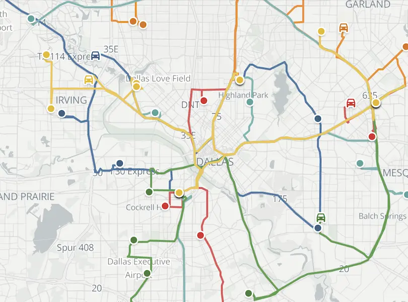

تصور کنید مدیر عملیات اورژانس یک شهر هستید و باید تصمیم بگیرید ایستگاه‌های آمبولانس را در کدام نقاط شهر مستقر کنید. بودجه شما فقط اجازه راه‌اندازی تعداد محدودی ایستگاه را می‌دهد، اما شهر ده‌ها محله دارد که هر کدام با نرخ متفاوتی تماس اورژانسی ثبت می‌کنند. اگر ایستگاه‌ها را اشتباه بچینید، ممکن است در محله‌ای پرتقاضا، آمبولانس در عرض استاندارد زمانی (مثلاً ۸ دقیقه) نرسد و این تأخیر می‌تواند مرگ‌ومیر ایجاد کند. این دقیقاً همان مسئله‌ای است که در تحقیق در عملیات به آن مکان‌یابی پوششی حداکثری یا Maximum Covering Location Problem (MCLP) می‌گویند: با تعداد محدودی تسهیلات، چگونه بیشترین جمعیت یا تقاضا را در محدوده زمانی پاسخ قابل‌قبول پوشش دهیم؟

نکته‌ای که MCLP را از مسئله کلاسیک [مکان‌یابی تسهیلات](/notes/facility-location-problem/) (Facility Location) متمایز می‌کند این است که در آنجا هدف کمینه کردن مجموع هزینه ساخت و حمل بود، اما اینجا اصلاً هزینه حمل در تابع هدف نیست. به‌جای آن، یک آستانه سخت زمانی یا فاصله‌ای تعریف می‌شود («پوشیده‌شده» یا «پوشیده‌نشده») و هدف این است که با منابع محدود، بیشترین تقاضا را داخل این آستانه نگه داریم. این تفاوت مفهومی باعث می‌شود مدل ریاضی و کاربردهای آن کاملاً متفاوت از مکان‌یابی معمول تسهیلات باشد، هرچند هر دو در خانواده مسائل مکان‌یابی جای می‌گیرند.

## فرمول‌بندی ریاضی مسئله

فرض کنید مجموعه‌ای از مناطق تقاضا (مثلاً محله‌ها یا بلوک‌های شهری) با اندیس $I$ داریم که هرکدام وزن تقاضای $w_i$ دارند (مثلاً میانگین تعداد تماس اورژانسی در ماه)، و مجموعه‌ای از مکان‌های کاندید برای ایستگاه آمبولانس با اندیس $J$. برای هر منطقه تقاضای $i$، مجموعه $N_i$ را تعریف می‌کنیم که شامل تمام مکان‌های کاندیدی است که فاصله یا زمان سفرشان تا $i$ کمتر از آستانه پاسخ استاندارد $r$ باشد. متغیر دودویی $x_j$ نشان می‌دهد آیا ایستگاه $j$ باز می‌شود یا نه، و متغیر دودویی $y_i$ نشان می‌دهد آیا منطقه $i$ پوشش داده می‌شود یا نه. با محدودیت اینکه فقط $p$ ایستگاه می‌توانیم باز کنیم، مدل به این شکل نوشته می‌شود:

$$
\max \; \sum_{i \in I} w_i y_i
$$

با محدودیت‌های زیر:

$$
\sum_{j \in N_i} x_j \geq y_i \quad \forall i \in I
$$

$$
\sum_{j \in J} x_j = p
$$

$$
x_j, y_i \in \{0, 1\}
$$

محدودیت اول می‌گوید منطقه $i$ فقط زمانی می‌تواند پوشیده‌شده در نظر گرفته شود ($y_i=1$) که حداقل یکی از ایستگاه‌های داخل شعاع پاسخش باز شده باشد؛ محدودیت دوم هم سقف بودجه یا تعداد ایستگاه‌های مجاز را تحمیل می‌کند. چون تابع هدف در جهت بیشینه‌سازی $y_i$ حرکت می‌کند و ضریب هر $y_i$ مثبت است، سالور خودبه‌خود این متغیرها را تا جایی که محدودیت‌ها اجازه دهند به یک نزدیک می‌کند، بدون این‌که نیاز باشد صریحاً آن‌ها را دودویی تعریف کنیم (در عمل می‌توان $y_i$ را پیوسته بین صفر و یک هم گذاشت و همان جواب صحیح به‌دست می‌آید).

## چرا این موضوع مهم است

در بسیاری از کشورها، استانداردهای ملی اورژانس زمان پاسخ مشخصی تعیین می‌کنند (مثلاً رسیدن به ۹۰ درصد تماس‌های بحرانی در کمتر از ۸ دقیقه)، و شهرداری‌ها یا سازمان‌های اورژانس موظف‌اند نشان دهند چیدمان ایستگاه‌هایشان این استاندارد را برآورده می‌کند. مدل MCLP دقیقاً همین سوال را به زبان ریاضی ترجمه می‌کند و به مدیران اجازه می‌دهد پیش از هر تصمیم پرهزینه (مثل خرید زمین یا استخدام نیرو) نشان دهند کدام چیدمان ایستگاه‌ها بیشترین جمعیت را در زمان استاندارد پوشش می‌دهد.

همین چارچوب فراتر از آمبولانس هم کاربرد دارد: مکان‌یابی ایستگاه آتش‌نشانی، مکان‌یابی پایگاه‌های امداد پس از زلزله یا سیل، استقرار پهپادهای امدادی، و حتی تعیین محل دوربین‌های نظارتی یا نقاط شارژ اضطراری، همگی نسخه‌های گوناگونی از همین مسئله پوشش حداکثری هستند. در نتیجه سرمایه‌گذاری روی درک درست این مدل، برای هر کسی که در حوزه سلامت، ایمنی شهری یا مدیریت بحران کار می‌کند، بازدهی بالایی دارد.

نکته مهم دیگر این است که مدل ساده MCLP فرض می‌کند وقتی آمبولانس در محدوده پوشش قرار دارد، همیشه در دسترس است؛ اما در واقعیت آمبولانس‌ها ممکن است در حال سرویس‌دهی به تماس دیگری باشند. این محدودیت باعث شده نسخه‌های پیشرفته‌تری از این مدل در عمل استفاده شوند که به آن‌ها اشاره می‌کنیم.

از سوی دیگر، مکان پایگاه آمبولانس‌ها تأثیر مستقیم بر هزینه و زمان سرویس‌دهی آن‌ها خواهد داشت، همان‌طور که در شکل زیر مشاهده می‌فرمایید:



پس از تعیین محل ایستگاه‌ها، تصمیم بعدی این است که هر آمبولانس در چه ترتیب و زمانی به تماس‌ها سرویس بدهد؛ این دقیقاً همان چیزی است که در یادداشت [مسئله مسیریابی وابسته به زمان](/notes/time-dependent-vrp/) و دوره آموزشی <a href="/courses/vrp-python/" style="color:#2563EB; font-weight:bold;">مسیریابی و زمان‌بندی با پایتون</a> به‌طور دقیق بررسی شده است.

## ظرفیت پژوهشی و آکادمیک

مکان‌یابی پوششی یکی از فعال‌ترین زیرشاخه‌های تحقیق و بهینه سازی در عملیات کاربردی در حوزه سلامت است. مدل پایه MCLP فرض ساده‌ای دارد (اگر آمبولانس در محدوده باشد، همیشه در دسترس است)، اما نسخه‌های پیشرفته‌تر مانند مدل پوشش مورد انتظار حداکثری (Maximum Expected Covering Location Problem یا MEXCLP) احتمال مشغول بودن هر آمبولانس را هم لحاظ می‌کنند و پوشش «قابل‌اطمینان» را بهینه می‌کنند؛ این‌ها معمولاً به مدل‌های برنامه‌ریزی عدد صحیح غیرخطی یا برنامه‌ریزی تصادفی (Stochastic Programming) منجر می‌شوند که هنوز جای کار پژوهشی زیادی دارند.

مسیر پژوهشی دیگر، مکان‌یابی پویا و بازآرایی آمبولانس‌ها در طول روز است (Dynamic Ambulance Relocation)، که در آن باید متناسب با تغییر الگوی تماس‌ها در ساعات مختلف، آمبولانس‌ها را جابه‌جا کرد؛ این مسئله معمولاً با یادگیری تقویتی یا بهینه‌سازی چندمرحله‌ای ترکیب می‌شود.
برای دانشجویانی که به مدل‌سازی تصادفی، عدم‌قطعیت، یا ترکیب بهینه‌سازی با شبیه‌سازی علاقه دارند، این حوزه گزینه‌ای غنی و کاملاً به‌روز برای پایان‌نامه یا مقاله است، به‌ویژه چون داده‌های واقعی مراکز اورژانس در بسیاری از کشورها (از جمله ایران) هنوز به‌خوبی از این زاویه تحلیل نشده‌اند.

## پیاده‌سازی با پایتون

خبر خوب این است که برای حل مسئله MCLP، حتی در ابعاد شهری با صدها منطقه تقاضا و ده‌ها مکان کاندید، نیازی به نرم‌افزار تجاری گران‌قیمت نیست. کتابخانه [OR-Tools](https://developers.google.com/optimization) گوگل (به‌ویژه ماژول CP-SAT آن) و کتابخانه [PuLP](https://coin-or.github.io/pulp/) به همراه سالور رایگان [CBC](https://github.com/coin-or/Cbc) یا [HiGHS](https://highs.dev/) به‌راحتی از پس این مدل‌های دودویی برمی‌آیند. برای محاسبه فاصله یا زمان سفر واقعی بین مناطق و مکان‌های کاندید (به‌جای فاصله مستقیم روی نقشه)، کتابخانه [NetworkX](https://networkx.org/) روی گراف شبکه معابر شهر ابزار مناسبی است.

برای این‌که موضوع ملموس شود، مثالی کوچک می‌سازیم: شهرداری می‌خواهد از میان چهار مکان کاندید برای ایستگاه آمبولانس (مرکز، شمال، جنوب، شرق) فقط دو ایستگاه را باز کند تا پوشش پنج منطقه تقاضا با وزن‌های مختلف حداکثر شود. جدول زیر آمده، وزن تقاضای هر منطقه و مکان‌های کاندیدی که در شعاع پاسخ آن قرار دارند را نشان می‌دهد:

| demand_zone | weight | candidates_in_range |
|---|---|---|
| Zone1 | 120 | Center, North |
| Zone2 | 80 | North, East |
| Zone3 | 150 | Center, South |
| Zone4 | 60 | South |
| Zone5 | 90 | East |

کد زیر با [PuLP](https://coin-or.github.io/pulp/) این مسئله را مدل‌سازی و حل می‌کند تا مشخص شود کدام دو ایستگاه باید باز شوند تا بیشترین تقاضا پوشش داده شود:

```python
import pulp

demand = {"Zone1": 120, "Zone2": 80, "Zone3": 150, "Zone4": 60, "Zone5": 90}
coverage = {
    "Zone1": ["Center", "North"],
    "Zone2": ["North", "East"],
    "Zone3": ["Center", "South"],
    "Zone4": ["South"],
    "Zone5": ["East"],
}
candidates = ["Center", "North", "South", "East"]
p = 2  # تعداد ایستگاه‌های مجاز

model = pulp.LpProblem("Ambulance_MCLP", pulp.LpMaximize)

x = {j: pulp.LpVariable(f"open_{j}", cat="Binary") for j in candidates}
y = {i: pulp.LpVariable(f"covered_{i}", cat="Binary") for i in demand}

# تابع هدف: بیشینه‌سازی تقاضای پوشش‌داده‌شده
model += pulp.lpSum(demand[i] * y[i] for i in demand)

# هر منطقه فقط وقتی پوشیده است که حداقل یک ایستگاه در شعاعش باز باشد
for i in demand:
    model += y[i] <= pulp.lpSum(x[j] for j in coverage[i])

# سقف تعداد ایستگاه‌های مجاز
model += pulp.lpSum(x[j] for j in candidates) == p

model.solve(pulp.PULP_CBC_CMD(msg=False))

for j in candidates:
    if x[j].value() == 1:
        print(f"ایستگاه {j} باز می‌شود.")
```

با اجرای این کد، سالور [CBC](https://github.com/coin-or/Cbc) در کسری از ثانیه بهترین ترکیب دو ایستگاه را پیدا می‌کند؛ همان تصمیمی که در دنیای واقعی می‌تواند به معنای چند دقیقه صرفه‌جویی در زمان رسیدن آمبولانس و در نتیجه نجات جان انسان‌ها باشد.

## سوالات متداول

<h3>تفاوت مکان‌یابی پوششی (MCLP) با مکان‌یابی تسهیلات معمولی چیست؟</h3>
<p>در مکان‌یابی تسهیلات معمولی، هدف کمینه کردن مجموع هزینه ثابت باز کردن تسهیلات و هزینه حمل است. در MCLP اصلاً هزینه حمل در تابع هدف نیست؛ به‌جای آن یک آستانه سخت زمانی یا فاصله‌ای تعریف می‌شود و هدف بیشینه کردن جمعیتی است که داخل این آستانه پوشش داده می‌شود.</p>

<h3>آیا این مدل فقط برای آمبولانس کاربرد دارد؟</h3>
<p>خیر. همین چارچوب برای مکان‌یابی ایستگاه آتش‌نشانی، پایگاه‌های امداد پس از بلایای طبیعی، پهپادهای امدادی، و هر سناریویی که در آن «زمان پاسخ» مهم‌تر از «هزینه حمل» است، قابل استفاده است.</p>

<h3>برای یادگیری مدل‌سازی این نوع مسائل با پایتون از کجا شروع کنم؟</h3>
<p>اگر با مفاهیم پایه برنامه‌ریزی خطی عدد صحیح و مدل‌سازی مسائل مکان‌یابی و مسیریابی در پایتون آشنا شوید، مدل‌سازی مسائل پوششی مثل MCLP بسیار ساده خواهد بود. دوره <a href="/courses/health-opt/" style="color:#2563EB; font-weight:bold;">بهینه سازی حوزه سلامت با پایتون</a> پایه محکمی برای کار با این نوع مسائل شبکه‌ای و مکان‌یابی فراهم می‌کند. اگر برای پیاده‌سازی این مدل روی داده واقعی شهر یا سازمان‌تان به راهنمایی نیاز دارید، می‌توانید از طریق صفحه <a href="/consultation/" style="color:#2563EB; font-weight:bold;">مشاوره</a> با ما در ارتباط باشید.</p>
