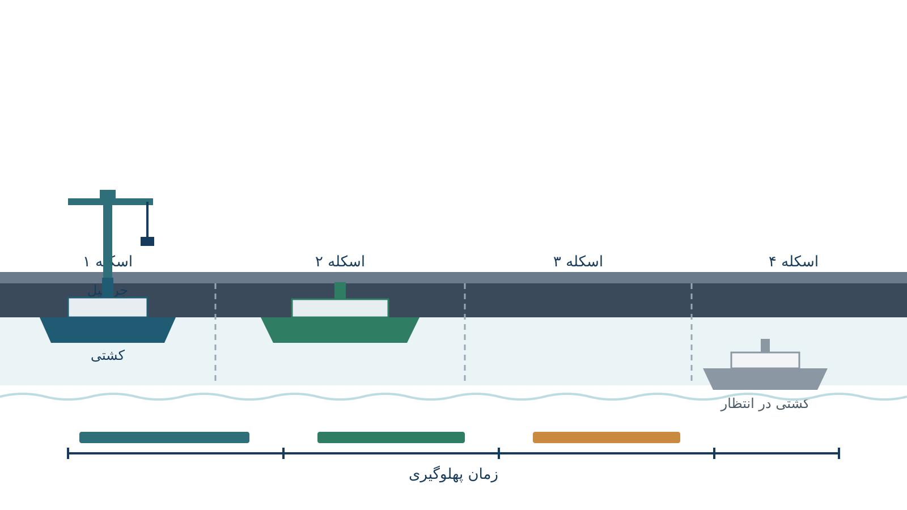

هر بار که یک کشتی کانتینربر بزرگ نزدیک بندر می‌شود، یک تصمیم به‌ظاهر ساده ولی پرهزینه در انتظار مدیر بندر است. این کشتی کجای اسکله پهلو بگیرد و از چه ساعتی؟ اگر جواب اشتباه باشد، کشتی ساعت‌ها یا حتی روزها در آب‌های ساحلی معطل می‌ماند. جرثقیل‌های تخلیه بی‌کار می‌ایستند یا برعکس، ازدحام می‌کنند. صف کشتی‌های بعدی هم به‌هم می‌ریزد. این مسئله در ادبیات بهینه‌سازی با نام «مسئله تخصیص اسکله» یا Berth Allocation Problem (به‌اختصار BAP) شناخته می‌شود. این مسئله یکی از هسته‌های اصلی برنامه‌ریزی عملیات بندری در سراسر دنیاست.

BAP را می‌توان این‌طور تصور کرد. طول اسکله یک بندر کانتینری، منبعی محدود و پیوسته است. این طول درست مثل نواری از فضا است که باید در طول زمان بین کشتی‌های مختلف تقسیم شود. هر کشتی یک بازه‌ی طولی مشخص دارد (طول بدنه‌اش). هر کشتی همچنین یک بازه‌ی زمانی دارد که باید در آن پهلو بگیرد (بین ورود به آب‌های بندر و ددلاین تحویل بار). علاوه‌بر این، هر کشتی یک زمان سرویس‌دهی هم دارد که به موقعیت پهلوگیری‌اش بستگی دارد، چون فاصله تا جرثقیل‌های مناسب فرق می‌کند. هدف، پیدا کردن یک زمان‌بندی و مکان‌یابی هم‌زمان است. این زمان‌بندی باید مجموع زمان انتظار کشتی‌ها، تأخیر نسبت به ددلاین، و هزینه‌های عملیاتی جرثقیل‌ها را کمینه کند.

## فرمول‌بندی ریاضی مسئله

نسخه‌ی پیوسته‌ی BAP (Continuous BAP) را می‌توان به‌صورت یک مسئله برنامه‌ریزی خطی عدد صحیح مختلط (MILP) نوشت. فرض کنید $n$ کشتی داریم و طول اسکله برابر $L$ است. کشتی $i$ طولی برابر $l_i$ و زمان پردازش $p_i$ دارد. همچنین $x_i$ موقعیت پهلوگیری (روی محور اسکله) و $t_i$ زمان شروع سرویس‌دهی آن است. برای جلوگیری از هم‌پوشانی فضایی-زمانی بین هر دو کشتی $i$ و $j$، باید حداقل یکی از چهار شرط زیر برقرار باشد. کشتی $i$ کاملاً قبل از $j$ تخلیه شود، یا بعد از آن شروع کند. یا کشتی $i$ کاملاً در فضای اسکله پایین‌تر از $j$ باشد، یا بالاتر. این شرط با متغیرهای باینری $z^1_{ij}, z^2_{ij}, z^3_{ij}, z^4_{ij}$ کنترل می‌شود:

$$
t_i + p_i \le t_j + M(1 - z^1_{ij}), \quad
x_i + l_i \le x_j + M(1 - z^3_{ij})
$$

$$
z^1_{ij} + z^2_{ij} + z^3_{ij} + z^4_{ij} \ge 1 \quad \forall i \ne j
$$

$$
0 \le x_i \le L - l_i, \qquad t_i \ge a_i
$$

$a_i$ زمان ورود کشتی $i$ به بندر است. $M$ نیز یک عدد بزرگ کافی است برای غیرفعال کردن قید، در حالتی که آن ترتیب خاص انتخاب نشده. تابع هدف معمولاً ترکیبی از زمان انتظار و جریمه تأخیر است:

$$
\min \sum_{i=1}^{n} w_i \Big( (t_i - a_i) + \max(0, t_i + p_i - d_i) \Big)
$$

$d_i$ ددلاین تحویل کشتی $i$ است و $w_i$ وزن اولویت آن است. این وزن مثلاً برای کشتی‌های حامل کالای فسادپذیر یا خطوط کشتیرانی با قرارداد اولویت‌دار بالاتر است. در نسخه‌های واقعی‌تر، $p_i$ خودش تابعی از $x_i$ می‌شود. این وابستگی از این‌جا می‌آید که هرچه کشتی نزدیک‌تر به جرثقیل‌های سریع‌تر پهلو بگیرد، تخلیه‌اش زودتر تمام می‌شود. این وابستگی مسئله را غیرخطی و پیچیده‌تر می‌کند. این نوع مسئله معمولاً با گسسته‌سازی موقعیت‌ها (Discrete BAP) یا تقریب خطی حل می‌شود.

## چرا این موضوع اهمیت دارد

تجارت جهانی به‌شدت به حمل‌ونقل دریایی وابسته است. برآوردها نشان می‌دهد بیش از ۸۰ درصد حجم تجارت بین‌المللی از طریق کشتی جابه‌جا می‌شود. هر ساعت اضافی که یک کانتینربر در صف انتظار پهلوگیری می‌ماند، هزینه‌ی مستقیم سوخت و اجاره کشتی به همراه دارد. همچنین هزینه‌ی غیرمستقیم تأخیر در زنجیره تأمین مشتریان نهایی، و حتی جریمه‌های قراردادی را هم به همراه دارد. شرکتی مثل Maersk ناوگان بزرگی از کانتینربرها را در مسیرهای بین‌قاره‌ای اداره می‌کند. این شرکت دقیقاً با همین نوع تصمیم روزانه در ده‌ها بندر دنیا روبه‌روست. هر ساعت تأخیر پهلوگیری، مستقیماً روی برنامه‌ریزی کل زنجیره‌ی حمل‌ونقلش اثر می‌گذارد.

بنادر بزرگ مثل روتردام، سنگاپور یا شانگهای روزانه ده‌ها کشتی را مدیریت می‌کنند. حتی بهبود چند درصدی در بهره‌وری تخصیص اسکله می‌تواند میلیون‌ها دلار در سال صرفه‌جویی ایجاد کند. از طرف دیگر، کشتی‌های غول‌پیکر (Ultra Large Container Vessels) در حال رشدند و طول بدنه‌شان به بیش از ۴۰۰ متر می‌رسد. به همین دلیل، فضای اسکله به منبعی به‌مراتب کمیاب‌تر تبدیل شده است. تصمیم‌گیری دستی یا مبتنی بر تجربه دیگر کافی نیست. BAP دقیقاً همان نقطه‌ای است که بهینه‌سازی ریاضی، ارزش اقتصادی ملموس و قابل اندازه‌گیری تولید می‌کند.

## ظرفیت پژوهشی و آکادمیک

مسئله تخصیص اسکله یکی از حوزه‌های بسیار فعال پژوهشی در تقاطع تحقیق در عملیات و لجستیک دریایی است. نسخه‌های گوناگونی از این مسئله همچنان جای کار باز دارند. یک نمونه، تخصیص هم‌زمان اسکله و جرثقیل است (Berth Allocation and Quay Crane Assignment Problem). نمونه‌ی دیگر، در نظر گرفتن عدم‌قطعیت در زمان ورود کشتی‌ها است، به‌دلیل شرایط جوی یا تأخیر در مسیر دریایی. مدل‌های پویا نیز مطرح‌اند، که در آن‌ها اطلاعات کشتی‌های جدید به‌تدریج در طول روز به سیستم اضافه می‌شود. یکپارچه‌سازی BAP با برنامه‌ریزی حمل‌ونقل زمینی داخل بندر (کامیون و قطار) نیز برای هماهنگی کامل زنجیره لجستیک بندری اهمیت دارد.

علاوه‌بر این، مقایسه‌ی روش‌های دقیق (MILP، Constraint Programming) با فراابتکاری‌ها (الگوریتم ژنتیک، شبیه‌سازی تبرید) موضوع دیگری است. این مقایسه به‌خصوص برای بنادر با صدها کشتی در روز اهمیت دارد. کاربرد یادگیری ماشین برای پیش‌بینی زمان پردازش واقعی کشتی‌ها هم مسیر پژوهشی مناسبی است. این مسیرها برای پایان‌نامه یا مقاله بسیار مناسب هستند. این حوزه هنوز به بلوغ کامل نرسیده است. به‌خصوص در بنادر منطقه‌ای و کوچک‌تر که داده و ابزار تحلیلی کمتری دارند، فرصت پژوهش کاربردی فراوان است.

## پیاده‌سازی با پایتون

خبر خوب این است که برای حل BAP نیازی به نرم‌افزار تجاری گران‌قیمت بندری نیست. نسخه‌ی گسسته‌ی مسئله (که در آن اسکله به چند بخش ثابت تقسیم می‌شود) به‌خوبی با [OR-Tools](https://developers.google.com/optimization) قابل مدل‌سازی است. به‌ویژه ماژول CP-SAT این ابزار برای این کار مناسب است. دلیل این تناسب آن است که ماهیت مسئله بسیار شبیه زمان‌بندی کارگاهی است. هر کشتی یک «کار» است که باید در یک «ماشین» (بخشی از اسکله) در یک بازه زمانی مشخص پردازش شود.

قیدهای عدم هم‌پوشانی هم با متغیرهای Interval در CP-SAT به‌سادگی بیان می‌شوند. پیش از ورود به این مدل‌سازی، مروری بر مبانی زمان‌بندی و بهینه‌سازی با پایتون مفید است. دوره [مسیریابی و زمان‌بندی با پایتون](/courses/vrp-python/) دقیقاً همین پایه را فراهم می‌کند. برای نسخه‌ی پیوسته که در آن موقعیت پهلوگیری یک متغیر پیوسته است، مدل MILP بالا را می‌توان با [Pyomo](http://www.pyomo.org/) نوشت. این مدل را می‌توان با سالورهای متن‌باز مثل [CBC](https://github.com/coin-or/Cbc) یا [HiGHS](https://highs.dev/) حل کرد. برای بنادر کوچک‌تر تا حدود چند ده کشتی در روز، این سالورها در عرض چند ثانیه تا چند دقیقه جواب می‌دهند. این جواب معمولاً بهینه یا نزدیک به بهینه است.

مزیت این رویکرد این است که یک تیم لجستیک بندری می‌تواند بدون خرید مجوز نرم‌افزار تخصصی، مدل خودش را بسازد. این تیم می‌تواند محدودیت‌های واقعی بندرش را هم اضافه کند، مثل عمق آب در قسمت‌های مختلف اسکله یا محدودیت دسترسی جرثقیل. در صورت نیاز، می‌توان این مدل را به سامانه‌های موجود بندر هم متصل کرد.

<h3>سوالات متداول</h3>

آیا مسئله تخصیص اسکله فقط برای بنادر بزرگ کاربرد دارد؟

خیر. حتی بنادر متوسط و کوچک هم با تعداد محدودی اسکله و چند کشتی در روز از بهینه‌سازی زمان‌بندی و مکان‌یابی سود می‌برند. در مقیاس کوچک‌تر، حتی یک مدل ساده‌ی MILP می‌تواند به‌طور محسوسی زمان انتظار میانگین کشتی‌ها را کاهش دهد.

برای یادگیری مدل‌سازی این نوع مسائل زمان‌بندی و مسیریابی از کجا شروع کنم؟

دوره <a href="/courses/vrp-python/" style="color:#2563EB; font-weight:bold;">مسیریابی و زمان‌بندی با پایتون</a> دقیقاً همین نوع مسائل ترکیبی فضا-زمان را با OR-Tools و CP-SAT پوشش می‌دهد و پایه‌ی خوبی برای ورود به این حوزه است.

اگر بخواهم این مدل را برای بندر یا ناوگان خودم پیاده‌سازی کنم چه کار کنم؟

می‌توانید از طریق صفحه <a href="/consultation/" style="color:#2563EB; font-weight:bold;">مشاوره</a> جزئیات مسئله و داده‌های واقعی‌تان را در میان بگذارید تا مدل متناسب با محدودیت‌های عملیاتی بندر شما طراحی شود.

