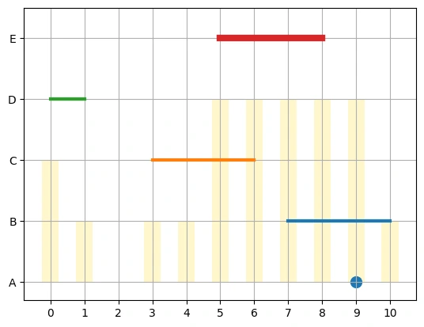

فرض کنید یک کارخانه‌ی آجرپزی چند سفارش تولید دارد. هر سفارش باید چند روز **پیاپی** کوره را اشغال کند — نه یک روز پراکنده اینجا و یک روز آنجا — و هر روزی که فعال است، بخشی از ظرفیت روزانه‌ی کوره را مصرف می‌کند. تا اینجا شبیه خیلی از مسائل زمان‌بندی کلاسیک است. اما یک پیچیدگی واقعی اضافه می‌شود: ظرفیت کوره **هر روز فرق دارد**. یک روز ممکن است به‌خاطر تعمیرات، ظرفیتش صفر باشد؛ روز دیگر به‌خاطر کمبود نیرو، ظرفیتش کم باشد. سوال این است: هر سفارش کِی شروع شود، طوری‌که هیچ روزی از ظرفیت همان روز رد نشویم؟

## چرا این مسئله با زمان‌بندی معمول فرق دارد

در بسیاری از مسائل زمان‌بندی کلاسیک، هر کار یک بار منبع (مثلاً یک ماشین) می‌گیرد و تمام. اینجا دو لایه‌ی هم‌زمان وجود دارد: هم باید تصمیم بگیریم **کِی** هر سفارش شروع شود، و هم باید در نظر بگیریم که در طول اجرا، هر روز یک «نرخ مصرف» ثابت از ظرفیت آن روز کم می‌کند. جمع این نرخ‌ها روی همه‌ی سفارش‌های فعال در یک روز، نباید از ظرفیت همان روز رد شود. این ساختار در ادبیات بهینه‌سازی به مسئله‌ی **زمان‌بندی با منابع محدود** (Resource-Constrained Scheduling) نزدیک است، با یک تفاوت مهم: ظرفیت منبع، ثابت نیست و در طول افق زمانی تغییر می‌کند.

این تفاوت کوچک، پیامد بزرگی دارد: نمی‌توان مسئله را با یک قید ظرفیت ساده (مثل «حداکثر ۲ سفارش هم‌زمان») حل کرد. باید برای **هر روز** جداگانه بررسی کرد کدام سفارش‌ها آن روز فعال‌اند و مجموع مصرفشان را با ظرفیت همان روز مقایسه کرد. این دقیقاً همان الگویی است که در زمان‌بندی خطوط تولید با نگهداری دوره‌ای، برنامه‌ریزی نیروگاه‌ها (که برخی روزها برای تعمیرات از مدار خارج‌اند)، یا حتی زمان‌بندی اتاق عمل بیمارستان (که ظرفیت پرستار در شیفت‌های مختلف فرق دارد) هم دیده می‌شود.

## فرمول‌بندی ریاضی مسئله

افق زمانی را با روزهای $d \in \{0, 1, \dots, H-1\}$ نشان می‌دهیم. مجموعه‌ی سفارش‌ها $O$ است؛ هر سفارش $o \in O$ یک نرخ مصرف روزانه $r_o$ و یک مدت اجرای ثابت $\ell_o$ دارد (چند روز پیاپی باید اجرا شود). ظرفیت هر روز هم با پارامتر $c_d$ داده شده است.

دو دسته متغیر دودویی تعریف می‌کنیم:

$$\text{start}_{o,d} \in \{0,1\} \quad \text{(سفارش } o \text{ در روز } d \text{ شروع می‌شود)}$$
$$\text{occupy}_{o,d} \in \{0,1\} \quad \text{(سفارش } o \text{ در روز } d \text{ فعال است)}$$

**قید اول — هر سفارش دقیقاً یک روز شروع دارد:**

$$\sum_{d} \text{start}_{o,d} = 1 \quad \forall o \in O$$

**قید دوم — اتصال شروع به اشغال:** اگر سفارش $o$ در روز $d$ شروع شود، باید در تمام $\ell_o$ روز بعدی هم اشغال ثبت شود:

$$\text{occupy}_{o,d'} \geq \text{start}_{o,d} \quad \forall d \leq d' \leq d+\ell_o-1$$

**قید سوم — طول واقعی اجرا:** مجموع روزهای اشغال‌شده باید دقیقاً برابر مدت سفارش باشد:

$$\sum_{d} \text{occupy}_{o,d} = \ell_o \quad \forall o \in O$$

**قید چهارم — ظرفیت روزانه:** در هر روز، مجموع نرخ مصرف سفارش‌های فعال از ظرفیت همان روز نباید رد شود:

$$\sum_{o \in O} r_o \cdot \text{occupy}_{o,d} \leq c_d \quad \forall d$$

این چهار دسته قید، دقیقاً همان چیزی است که در کد Python/CP-SAT پیاده‌سازی می‌شود.

## دام رایج این مدل‌سازی

رایج‌ترین اشتباهی که در پیاده‌سازی این مدل رخ می‌دهد، فیلتر کردن نادرست متغیر `occupy` است. وسوسه‌ی طبیعی این است که فکر کنیم چون `start_{o,d}` فقط برای روزهایی معنا دارد که سفارش می‌تواند در آن‌ها شروع شود (یعنی $d + \ell_o - 1 \leq H-1$)، پس `occupy` هم باید با همین شرط فیلتر شود. این اشتباه است. متغیر `occupy_{o,d}` باید برای **تمام** روزهای افق، برای هر سفارش، تعریف شود — چون یک سفارش که دیر شروع می‌شود ممکن است تا روزهای پایانی افق هم فعال بماند، حتی اگر خودِ آن روز پایانی «روز شروع معتبر» نباشد.

اگر این فیلتر اشتباه اعمال شود، وقتی کد به دنبال `occupy[(o, d2)]` برای روزهای انتهایی می‌گردد و پیدا نمی‌کند، معمولاً با یک مقدار پیش‌فرض صفر جایگزین می‌شود. نتیجه‌ی این جایگزینی، قیدی مثل $0 \geq \text{start}_{o,d}$ است که بی‌سروصدا هر سفارش با مدت طولانی را از شروع در روزهای میانه به بعد منع می‌کند — و وقتی روزهای اولیه‌ی افق هم به‌خاطر ظرفیت کم یا صفر در دسترس نباشند، کل مدل **بدون هیچ دلیل واقعی، ناشدنی (Infeasible)** اعلام می‌شود. این نوع باگ خصوصاً موذی است چون در ظاهر، مدل و قیدها کاملاً منطقی به نظر می‌رسند.

## پیاده‌سازی با پایتون و رسم نمودار زمان‌بندی

مدل کامل با OR-Tools CP-SAT:

```python
from ortools.sat.python import cp_model
import matplotlib.pyplot as plt

H = 11
orders = {
    "A": (2, 1),  # (daily consumption rate, duration in days)
    "B": (1, 4),
    "C": (1, 4),
    "D": (1, 2),
    "E": (2, 4),
}
capacity = [2, 1, 0, 1, 1, 3, 3, 3, 3, 3, 1]

model = cp_model.CpModel()
days = list(range(H))

start = {(o, d): model.NewBoolVar(f"start_{o}_{d}")
         for o in orders for d in days if H - d >= orders[o][1]}
occupy = {(o, d): model.NewBoolVar(f"occupy_{o}_{d}")
          for o in orders for d in days}  # no incorrect filter — defined for all days

for (o, d), v in start.items():
    for d2 in days:
        if d <= d2 <= d + orders[o][1] - 1:
            model.Add(occupy[(o, d2)] >= v)

for d in days:
    expr = [orders[o][0] * occupy[(o, d)] for o in orders]
    model.Add(sum(expr) <= capacity[d])

for o in orders:
    model.Add(sum(occupy[(o, d)] for d in days) == orders[o][1])
    model.AddExactlyOne(start[(o, d)] for d in days if (o, d) in start)

solver = cp_model.CpSolver()
solver.parameters.max_time_in_seconds = 20
status = solver.Solve(model)
print(solver.StatusName(status))
```

خروجی این مدل، برای هر سفارش، دقیقاً یک روز شروع و بازه‌ی اشغال متناظرش را می‌دهد. برای نمایش بصری، یک نمودار گانت ساده با matplotlib رسم می‌کنیم: محور افقی روزها، محور عمودی سفارش‌ها، و یک نوار کم‌رنگ در پس‌زمینه که ظرفیت هر روز را نشان می‌دهد — این‌طور می‌توان به‌سرعت دید کدام روزها به ظرفیت کامل رسیده‌اند (و در نتیجه هیچ سفارش دیگری در آن روز جا نمی‌شود).

البته پیاده‌سازی این مدل منحصر به OR-Tools/CP-SAT نیست؛ همین مدل را با **Pyomo** هم می‌توان نوشت — با همان چهار دسته قید، فقط در قالب `ConstraintList` و `Var` به‌جای `NewBoolVar`:

```python
from pyomo.environ import (
    ConcreteModel, Set, Param, Var, Binary, Objective,
    ConstraintList, Constraint, SolverFactory, value
)

H = 11
orders = {
    "A": (2, 1),
    "B": (1, 4),
    "C": (1, 4),
    "D": (1, 2),
    "E": (2, 4),
}
capacity = [2, 1, 0, 1, 1, 3, 3, 3, 3, 3, 1]
days = list(range(H))

m = ConcreteModel()
m.O = Set(initialize=orders.keys())
m.D = Set(initialize=days)

# only days where a start is actually feasible
valid_start = [(o, d) for o in orders for d in days if H - d >= orders[o][1]]

m.start = Var(valid_start, domain=Binary)
m.occupy = Var(m.O, m.D, domain=Binary)  # no filter — for all days (the common pitfall above)

m.link = ConstraintList()
for (o, d) in valid_start:
    for d2 in days:
        if d <= d2 <= d + orders[o][1] - 1:
            m.link.add(m.occupy[o, d2] >= m.start[o, d])

m.duration = ConstraintList()
for o in orders:
    m.duration.add(sum(m.occupy[o, d] for d in days) == orders[o][1])

m.capacity_con = ConstraintList()
for d in days:
    m.capacity_con.add(
        sum(orders[o][0] * m.occupy[o, d] for o in orders) <= capacity[d]
    )

m.one_start = ConstraintList()
for o in orders:
    m.one_start.add(sum(m.start[o, d] for d in days if (o, d) in valid_start) == 1)

m.obj = Objective(expr=0)  # feasibility-only problem

solver = SolverFactory("cbc")
result = solver.solve(m, tee=False)

for o in orders:
    st = [d for d in days if (o, d) in valid_start and value(m.start[o, d]) > 0.5]
    occ = [d for d in days if value(m.occupy[o, d]) > 0.5]
    print(o, "start:", st, "occupy:", occ)
```

منطق دقیقاً همان چهار قید فرمول‌بندی بالاست؛ تنها تفاوت، نحوه‌ی تعریف متغیر و قید در Pyomo (`ConstraintList`) در برابر افزودن مستقیم قید در CP-SAT (`model.Add`) است. انتخاب بین این دو معمولاً به سالور مدنظرتان بستگی دارد: CP-SAT برای این نوع مسائل ترکیبیاتی معمولاً سریع‌تر است، ولی Pyomo انعطاف بیشتری برای سوییچ بین سالورهای مختلف (CBC، HiGHS، Gurobi) بدون تغییر مدل می‌دهد.

```python
plt.bar(days, capacity, width=0.5, alpha=0.2, color="gold", zorder=-1)
for i, o in enumerate(orders):
    occ = [d for d in days if solver.Value(occupy[(o, d)]) > 0]
    plt.plot([min(occ), max(occ)], [i, i], lw=3 * orders[o][0])
plt.yticks(range(len(orders)), orders.keys())
plt.grid()
plt.show()
```

خروجی واقعی این کد را می‌بینید — نوارهای کم‌رنگ زرد در پس‌زمینه، ظرفیت هر روز را نشان می‌دهند؛ خط‌های رنگی، بازه‌ی اشغال هر سفارش را:



## همین مدل، در GAMS

اگر با GAMS هم کار می‌کنید یا فقط می‌خواهید ساختار مدل را در قالبی دیگر ببینید، همین چهار دسته قید و همان منطق را می‌توان در یک بلاک GAMS هم نوشت:

```gams
Sets
  o      'orders'  / A, B, C, D, E /
  d      'days'    / d0*d10 /;
Alias (d,d2);

Parameter dnum(d); dnum(d) = ord(d) - 1;

Parameters
  rate(o) 'daily consumption rate' / A 2, B 1, C 1, D 1, E 2 /
  dur(o)  'duration in days'       / A 1, B 4, C 4, D 2, E 4 /
  cap(d)  'daily capacity'
          / d0 2, d1 1, d2 0, d3 1, d4 1, d5 3, d6 3, d7 3, d8 3, d9 3, d10 1 /;

Binary Variables
  start(o,d)    'order o starts on day d'
  occupy(o,d)   'order o is running on day d';
Variable dummy;

start.fx(o,d)$(dnum(d) + dur(o) > card(d)) = 0;

Equations
  eq_link(o,d,d2)
  eq_duration(o)
  eq_capacity(d)
  eq_onestart(o)
  eq_obj;

eq_link(o,d,d2)$(dnum(d2) >= dnum(d) and dnum(d2) <= dnum(d) + dur(o) - 1)..
    occupy(o,d2) =g= start(o,d);

eq_duration(o)..
    sum(d, occupy(o,d)) =e= dur(o);

eq_capacity(d)..
    sum(o, rate(o)*occupy(o,d)) =l= cap(d);

eq_onestart(o)..
    sum(d, start(o,d)) =e= 1;

eq_obj.. dummy =e= 0;

Model brickSchedule / all /;
Solve brickSchedule using MIP minimizing dummy;

Parameter startDay(o);
startDay(o) = sum(d, dnum(d)*start.l(o,d));
display startDay, occupy.l;
```

با این حال، اگر تازه دارید این مسیر را شروع می‌کنید، توصیه‌ی ما یادگیری پایتون است، نه GAMS. پایتون رایگان و متن‌باز است، جامعه‌ی بسیار بزرگ‌تری دارد، و همان مدل را با کتابخانه‌هایی مثل OR-Tools یا Pyomo — بدون نگرانی از لایسنس — می‌توان نوشت و روی هر سیستمی اجرا کرد. اگر می‌خواهید از صفر و قدم‌به‌قدم همین نوع مدل‌سازی را در پایتون یاد بگیرید، دوره‌ی [مدل‌سازی مسائل بهینه‌سازی](/courses/optimization-modeling/) دقیقاً برای همین طراحی شده است.

## سوالات متداول

<h3>چرا از دو دسته متغیر (start و occupy) استفاده می‌کنیم، به‌جای یک متغیر بازه‌ای (Interval Variable) آماده‌ی CP-SAT؟</h3>
<p>OR-Tools ابزار بومی <code>NewIntervalVar</code> و قید <code>AddCumulative</code> را برای این نوع مسائل دارد، و برای ظرفیت ثابت، ساده‌ترین راه همان است. اما وقتی ظرفیت هر روز فرق دارد (مثل این مثال)، تعریف صریح متغیرهای start/occupy روز به روز، کنترل و خوانایی بیشتری می‌دهد و افزودن قیدهای سفارشی دیگر (مثل اولویت بین سفارش‌ها) را ساده‌تر می‌کند.</p>

<h3>اگر مدل «ناشدنی» (Infeasible) اعلام شد، از کجا شروع کنم؟</h3>
<p>اول بررسی کنید آیا متغیر occupy برای تمام روزهای افق تعریف شده یا به‌اشتباه فیلتر شده — رایج‌ترین علت است. بعد، جمع کل نیاز منابع (نرخ × مدت هر سفارش) را با جمع کل ظرفیت افق مقایسه کنید؛ اگر خیلی نزدیک یا بیشتر از ظرفیت کل باشد، مدل ممکن است واقعاً در مرز شدنی بودن باشد.</p>

<h3>آیا می‌توان به این مدل هدف (Objective) هم اضافه کرد؟</h3>
<p>بله؛ نسخه‌ی فعلی صرفاً شدنی‌یابی (feasibility) است، اما می‌توان هدفی مثل کمینه‌کردن آخرین روز اتمام (Makespan) یا بیشینه‌کردن استفاده از ظرفیت خالی اضافه کرد. اگر بیش از یک هدف هم‌زمان مهم باشد (مثلاً هم Makespan کم و هم بار متعادل روی روزها)، تکنیک <a href="/notes/epsilon-constraint-bi-objective/" style="color:#2563EB; font-weight:bold;">اپسیلون محدود</a> دقیقاً همان ابزاری است که برای ترسیم مرز پارتوی این دو هدف لازم دارید.</p>

<h3>برای یادگیری این نوع مدل‌سازی از کجا شروع کنم؟</h3>
<p>در دوره‌ی <a href="/courses/optimization-modeling/" style="color:#2563EB; font-weight:bold;">مدل‌سازی مسائل بهینه‌سازی</a> ساخت این نوع مدل‌های زمان‌بندی و تخصیص با OR-Tools از پایه آموزش داده می‌شود.</p>
