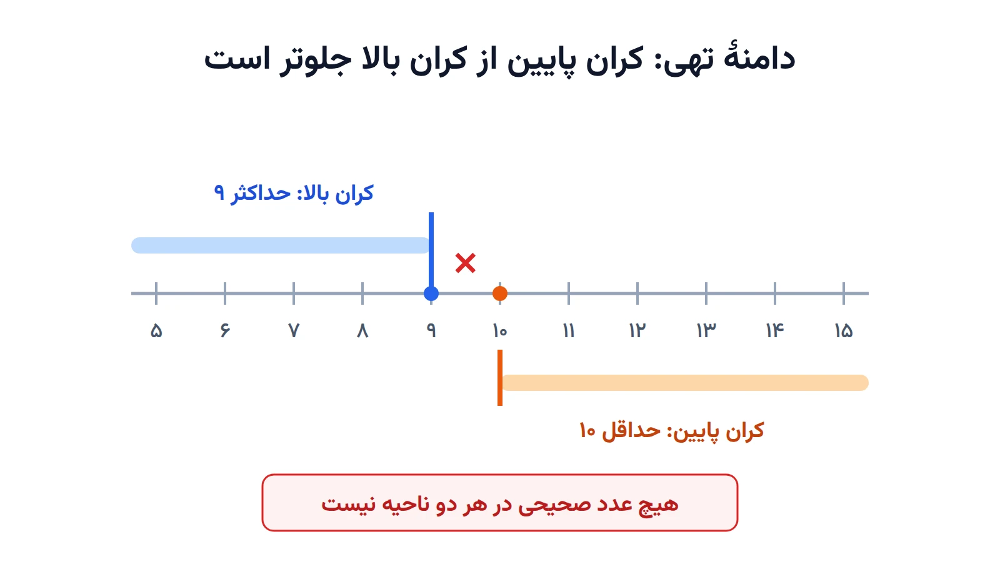

کد را اجرا می‌کنید. هیچ خطای پایتونی نمی‌بینید، هیچ traceback قرمزی ظاهر نمی‌شود، ولی خروجی فقط یک خط است:

```text
Status: MODEL_INVALID
```

نه جوابی، نه توضیحی. این یادداشت دقیقاً همین لحظه را بازسازی می‌کند: یک مدل زمان‌بندی کوچک با یک باگ پنهان می‌نویسیم، خطا را می‌گیریم، و بعد با فعال کردن لاگ سالور نشان می‌دهیم که CP-SAT از همان اول دقیقاً می‌دانست مشکل کجاست. فقط باید از او می‌پرسیدیم.

همه‌ی خروجی‌های این یادداشت واقعی هستند و با OR-Tools نسخه‌ی 9.15 گرفته شده‌اند.

## کد اشتباه

یک کارگاه چهار کار دارد: برش، جوشکاری، رنگ‌آمیزی و بسته‌بندی. هر کار زمان آزادسازی دارد، یعنی زودتر از آن نمی‌تواند شروع شود، یک سررسید دارد که باید قبل از آن تمام شود، و یک مدت زمان انجام. همه‌ی کارها روی یک ایستگاه انجام می‌شوند، پس نباید با هم هم‌پوشانی داشته باشند. هدف، کمینه کردن زمان اتمام آخرین کار است.

قبل از اینکه ادامه بدهید، به کد نگاه کنید. می‌توانید باگ را پیدا کنید؟

```python
from ortools.sat.python import cp_model

# Job data: (name, release_time, deadline, duration)
jobs = [
    ("cutting",   0, 20, 5),
    ("welding",   3, 25, 8),
    ("painting", 10, 18, 9),
    ("packing",   5, 30, 4),
]

model = cp_model.CpModel()
intervals = []
starts = {}
for name, release, deadline, duration in jobs:
    start = model.new_int_var(release, deadline - duration, f"start_{name}")
    end = model.new_int_var(release + duration, deadline, f"end_{name}")
    interval = model.new_interval_var(start, duration, end, f"interval_{name}")
    starts[name] = start
    intervals.append(interval)

model.add_no_overlap(intervals)
makespan = model.new_int_var(0, 100, "makespan")
model.add_max_equality(makespan, [iv.end_expr() for iv in intervals])
model.minimize(makespan)

solver = cp_model.CpSolver()
status = solver.solve(model)
print("Status:", solver.status_name(status))
```

منطق کد درست به نظر می‌رسد. زمان شروع هر کار بین زمان آزادسازی و «سررسید منهای مدت» است، که یعنی دیرترین زمان شروع ممکن. زمان پایان هم به همین ترتیب محدود شده است. خروجی اما این است:

```text
Status: MODEL_INVALID
```

## MODEL_INVALID یعنی چه؟

اولین قدم، فهمیدن معنای دقیق وضعیت است. CP-SAT چند وضعیت پایانی دارد و هر کدام مسیر عیب‌یابی کاملاً متفاوتی دارد:

| وضعیت | معنا | کجا را بگردیم |
|---|---|---|
| `MODEL_INVALID` | مدل از نظر ساختاری خراب است و سالور اصلاً شروع به حل نکرده | تعریف متغیرها و قیدها، معمولاً داده |
| `INFEASIBLE` | مدل سالم است، ولی سالور ثابت کرده هیچ جوابی وجود ندارد | قیدهای متناقض |
| `UNKNOWN` | زمان تمام شده، بدون جواب و بدون اثبات | زمان حل یا اندازه‌ی مدل |
| `FEASIBLE` | جوابی پیدا شده، ولی بهینه بودنش ثابت نشده | معمولاً مشکلی نیست |
| `OPTIMAL` | جواب بهینه پیدا و اثبات شده | — |

تفاوت `MODEL_INVALID` و `INFEASIBLE` بسیار مهم است. `INFEASIBLE` یعنی سالور مسئله را فهمیده، حل کرده و به نتیجه رسیده که جوابی نیست. `MODEL_INVALID` یعنی سالور حتی نتوانسته مسئله را بخواند. مثل فرمی است که قبل از بررسی، به‌خاطر خانه‌ی خالی برگشت خورده باشد. پس در این حالت دنبال قید متناقض نگردید؛ دنبال چیزی بگردید که از اساس بد تعریف شده است.

## قدم اول: لاگ سالور را روشن کنید

فقط یک خط به کد اضافه می‌کنیم، درست بعد از ساختن سالور:

```python
solver = cp_model.CpSolver()
solver.parameters.log_search_progress = True
status = solver.solve(model)
```

حالا خروجی کامل این است:

```text
Starting CP-SAT solver v9.15.6755
Parameters: log_search_progress: true
Setting number of workers to 1
Invalid model: var #4 has no domain(): name: "start_painting"
CpSolverResponse summary:
status: MODEL_INVALID
objective: 0
best_bound: 0
integers: 0
booleans: 0
conflicts: 0
branches: 0
propagations: 0
integer_propagations: 0
restarts: 0
lp_iterations: 0
walltime: 0.00176607
usertime: 0.00176613
deterministic_time: 0
gap_integral: 0
```

## تفسیر لاگ، خط‌به‌خط

**سه خط اول** اطلاعات محیط اجرا هستند: نسخه‌ی سالور، پارامترهایی که تنظیم کرده‌اید، و تعداد workerها. تعداد workerها به تعداد هسته‌های پردازنده‌ی شما بستگی دارد و روی سیستم شما احتمالاً عدد بزرگ‌تری می‌بینید. وقتی از کسی کمک می‌گیرید، همیشه نسخه‌ی سالور را هم بگویید، چون پیام‌های خطا بین نسخه‌ها کمی تغییر می‌کنند.

**خط چهارم همان جواب است:**

```text
Invalid model: var #4 has no domain(): name: "start_painting"
```

این خط سه چیز را می‌گوید:

- `var #4`: پنجمین متغیری که ساخته‌اید. شماره‌گذاری از صفر و به ترتیب ساخته شدن متغیرهاست. در کد ما، برای هر کار دو متغیر ساخته می‌شود، پس متغیرهای ۰ و ۱ مال برش‌اند، ۲ و ۳ مال جوشکاری، و ۴ اولین متغیر رنگ‌آمیزی است.
- `has no domain()`: دامنه‌ی این متغیر تهی است. هیچ عدد صحیحی وجود ندارد که این متغیر بتواند بپذیرد.
- `name: "start_painting"`: نامی که خودتان به متغیر داده‌اید. این مفیدترین بخش پیام است.

**بقیه‌ی لاگ**، یعنی بلوک `CpSolverResponse summary`، در این حالت تقریباً معنایی ندارد. مقدار `objective: 0` به این معنا نیست که جوابی با هزینه‌ی صفر پیدا شده؛ فقط مقدار پیش‌فرض است. همه‌ی شمارنده‌ها مثل `branches` و `conflicts` صفرند، چون جست‌وجو هرگز شروع نشده است. `walltime` هم فقط حدود دو میلی‌ثانیه است: زمانی که طول کشیده تا سالور مدل را بخواند و رد کند.

یک نکته‌ی ظریف دیگر: در لاگ یک اجرای سالم، بعد از خطوط اول، خلاصه‌ی مدل با عنوان `#Variables` و بعد مرحله‌ی `Starting presolve` می‌آید. در لاگ ما هیچ‌کدام نیست. نبودن این بخش‌ها خودش تأیید می‌کند که مدل قبل از presolve، در مرحله‌ی اعتبارسنجی، رد شده است.

## ریشه‌ی مشکل: کران پایین از کران بالا بزرگ‌تر است

حالا که می‌دانیم مشکل از متغیر `start_painting` است، سراغ خطی می‌رویم که آن را می‌سازد:

```python
start = model.new_int_var(release, deadline - duration, f"start_{name}")
```

برای رنگ‌آمیزی، `release = 10`، `deadline = 18` و `duration = 9` است. پس این خط در عمل می‌شود:

```python
start = model.new_int_var(10, 9, "start_painting")
```

کران پایین ۱۰ و کران بالا ۹ است. هیچ عدد صحیحی نیست که هم بزرگ‌تر یا مساوی ۱۰ باشد و هم کوچک‌تر یا مساوی ۹. دامنه تهی است.



به زبان ریاضی، دامنه‌ی زمان شروع کار $j$ بازه‌ی $[r_j,\; d_j - p_j]$ است و این بازه فقط وقتی تهی نیست که

$$
r_j + p_j \le d_j
$$

یعنی کار حتی اگر در اولین لحظه‌ی ممکن شروع شود، باید بتواند تا سررسیدش تمام شود. برای رنگ‌آمیزی $10 + 9 = 19$ است که از سررسید ۱۸ بیشتر است. باگ در کد نیست؛ در داده است. کد فقط آن را منتقل کرده است.

این دقیقاً همان چیزی است که این باگ را خطرناک می‌کند. کد برای سه کار از چهار کار کاملاً درست کار می‌کند. اگر داده از یک فایل اکسل یا پایگاه‌داده خوانده شود، کافی است یک سفارش با سررسید غیرواقعی وارد سیستم شود تا کل برنامه‌ریزی بدون هیچ خطای پایتونی متوقف شود.

## چرا نام‌گذاری متغیرها حیاتی است

`new_int_var` نام را اجباری می‌گیرد، ولی خیلی‌ها برای راحتی رشته‌ی خالی `""` می‌دهند. ببینیم در آن صورت لاگ چه می‌گوید:

```text
Invalid model: var #4 has no domain(): 
```

فقط یک شماره. در یک مدل واقعی با ده‌ها هزار متغیر، پیدا کردن «متغیر شماره‌ی ۴۸۳۱۷» یعنی باید دقیقاً ترتیب ساخته شدن همه‌ی متغیرها را بازسازی کنید. نام‌گذاری معنادار مثل `start_painting` یا `x_truck3_customer17` هزینه‌ای ندارد و ساعت‌ها در عیب‌یابی صرفه‌جویی می‌کند.

## لاگ فقط اولین خطا را نشان می‌دهد

دوباره به داده نگاه کنید. متغیر پایان رنگ‌آمیزی هم با کران‌های `release + duration = 19` و `deadline = 18` ساخته شده، پس آن هم دامنه‌ی تهی دارد. اما لاگ فقط `var #4` را گزارش کرد. اعتبارسنجی CP-SAT با اولین خطا متوقف می‌شود.

اگر فقط همان یک خطا را اصلاح کنید، دوباره اجرا کنید و خطای بعدی را بگیرید، در یک مدل بزرگ ممکن است ده‌ها بار این چرخه را تکرار کنید. راه سریع‌تر این است که همه‌ی متغیرهای با دامنه‌ی تهی را یک‌جا پیدا کنید. مدل در واقع یک ساختار داده‌ی protobuf است که می‌توانید مستقیم بخوانید:

```python
for index, var in enumerate(model.proto.variables):
    if not var.domain:
        print(index, var.name)
```

خروجی:

```text
4 start_painting
5 end_painting
```

## اعتبارسنجی بدون حل کردن

لازم نیست برای دیدن این خطا حتماً سالور را اجرا کنید. متد `validate` همان پیام را برمی‌گرداند:

```python
print(repr(model.validate()))
```

```text
'var #4 has no domain(): name: "start_painting"'
```

اگر مدل سالم باشد، خروجی یک رشته‌ی خالی است. این برای تست‌های خودکار عالی است: در یک تست واحد، مدل را با داده‌ی نمونه بسازید و بررسی کنید که `validate` رشته‌ی خالی برمی‌گرداند.

## پیشگیری: داده را قبل از ساخت مدل بررسی کنید

بهترین جای گرفتن این باگ، قبل از رسیدن به سالور است. یک تابع کوچک که داده را بررسی می‌کند و پیام خطایی قابل فهم برای کاربر نهایی می‌سازد:

```python
def check_jobs(jobs):
    """Raise a clear error before building the model if any job window is impossible."""
    problems = []
    for name, release, deadline, duration in jobs:
        latest_start = deadline - duration
        if release > latest_start:
            problems.append(
                f"{name}: release={release} but latest start={latest_start} "
                f"(deadline {deadline} - duration {duration})"
            )
    if problems:
        raise ValueError("Impossible time windows:\n  " + "\n  ".join(problems))
```

خروجی روی داده‌ی ما:

```text
ValueError: Impossible time windows:
  painting: release=10 but latest start=9 (deadline 18 - duration 9)
```

این پیام را مدیر تولید هم می‌فهمد. `var #4 has no domain()` را فقط برنامه‌نویس می‌فهمد.

## اصلاح و اجرای دوباره

فرض کنید با واحد فروش صحبت کرده‌ایم و سررسید رنگ‌آمیزی در واقع ۲۲ بوده است. داده را اصلاح می‌کنیم و دوباره اجرا می‌کنیم:

```text
Status: OPTIMAL
cutting   starts at 0
welding   starts at 5
painting  starts at 13
packing   starts at 22
makespan = 26
```

مدل حالا سالم است و سالور برنامه‌ی بهینه را با زمان اتمام ۲۶ پیدا کرده است.

## مقایسه: وقتی مدل سالم است ولی جواب ندارد

برای اینکه تفاوت را کامل ببینید، این بار داده‌ای می‌سازیم که همه‌ی دامنه‌ها در آن معتبرند ولی با هم جور نمی‌شوند. سررسید بسته‌بندی را به ۱۲ کاهش می‌دهیم. دامنه‌ی هر متغیر به‌تنهایی معتبر است، ولی حالا دیرترین سررسید بین همه‌ی کارها ۲۵ است، در حالی که مجموع مدت چهار کار روی یک ایستگاه ۲۶ واحد است. هیچ ترتیبی نمی‌تواند ۲۶ واحد کار را در بازه‌ی صفر تا ۲۵ جا بدهد. بخشی از لاگ:

```text
#Variables: 9 (#ints: 1 in objective) (8 primary variables)
...
Starting presolve at 0.00s
...
INFEASIBLE: 'during probing initial propagation'
...
Problem closed by presolve.
CpSolverResponse summary:
status: INFEASIBLE
objective: NA
```

تفاوت‌ها واضح است. این بار خلاصه‌ی مدل با `#Variables` چاپ شده، پس مدل اعتبارسنجی را گذرانده است. مرحله‌ی presolve اجرا شده و در همان مرحله تناقض پیدا شده است. `objective` هم به‌جای صفر، `NA` است. برای این حالت، روش پیدا کردن قید مقصر در یادداشت [مدل غیرقابل‌اجرا: چطور قید مقصر را پیدا کنیم؟](/notes/infeasible-model-diagnosis/) توضیح داده شده است.

## علت‌های رایج دیگر MODEL_INVALID

دامنه‌ی تهی رایج‌ترین علت است، ولی تنها علت نیست. چند مورد دیگر را هم روی همین نسخه آزمودیم:

- **بازه با طول منفی:** اگر مدت یک کار در `new_interval_var` منفی باشد، مثلاً به‌خاطر اشتباه در تفریق دو زمان، پیام `The size of a performed interval must be >= 0` را همراه با نام بازه می‌گیرید.
- **کران‌های بیش از حد بزرگ:** کران‌هایی نزدیک به بزرگ‌ترین عدد ۶۴بیتی، مثلاً وقتی به‌جای «بی‌نهایت» یک عدد خیلی بزرگ می‌گذارید، پیام `domain do not fall in [-kint64max / 2, kint64max / 2]` می‌دهند. به‌جای عدد بزرگ دلخواه، یک کران واقعی مثل طول افق برنامه‌ریزی بگذارید.

یک خطای مشابه هم هست که اصلاً به `MODEL_INVALID` نمی‌رسد: ضریب اعشاری در قید. نوشتن `0.5 * x <= 3` همان لحظه‌ی ساخت قید یک `TypeError` می‌دهد، چون CP-SAT فقط ضرایب صحیح می‌پذیرد. راه‌حل، ضرب کل قید در یک عدد مناسب است؛ اینجا یعنی `x <= 6`.

## تمرین برای شما

این تکه کد برای تخصیص بار به کامیون‌ها نوشته شده و روی بعضی داده‌ها `MODEL_INVALID` می‌دهد:

```python
# capacity[t]: capacity of truck t, min_load[t]: contractual minimum load
for t in trucks:
    free_space = model.new_int_var(0, capacity[t] - min_load[t], f"free_{t}")
```

بدون اجرای کد، بگویید روی چه داده‌ای خراب می‌شود، لاگ دقیقاً چه پیامی می‌دهد، و تابع بررسی داده‌ی آن را بنویسید. جواب خود را در تلگرام برای ما بفرستید.

## ادامه‌ی مسیر

این یادداشت بخشی از [راهنمای جامع آموزش OR-Tools](/ortools/) است. اگر تازه با CP-SAT شروع کرده‌اید، یادداشت [حل همه جواب‌ها با OR-Tools](/notes/cp-intro/) نقطه‌ی شروع خوبی است، و یادداشت [زمان‌بندی تحویل با CP-SAT](/notes/job-shop-scheduling-cp-sat/) همین نوع مدل زمان‌بندی را در مقیاس بزرگ‌تر نشان می‌دهد.

اگر مدل CP-SAT سازمان‌تان خطا می‌دهد یا بیش از حد کند حل می‌شود و می‌خواهید یک متخصص آن را بررسی کند، از صفحه‌ی [مشاوره تخصصی](/consultation/) با ما در ارتباط باشید.

## سوالات متداول

**فرق MODEL_INVALID با INFEASIBLE چیست؟**
`MODEL_INVALID` یعنی مدل از نظر ساختاری خراب است و سالور حتی شروع به حل نکرده، مثلاً متغیری با دامنه‌ی تهی دارید. `INFEASIBLE` یعنی مدل سالم است ولی سالور ثابت کرده هیچ جوابی همه‌ی قیدها را برآورده نمی‌کند.

**چرا CP-SAT برای کران پایین بزرگ‌تر از کران بالا خطای پایتون نمی‌دهد؟**
چون ساخت متغیر فقط آن را در مدل ثبت می‌کند و اعتبارسنجی کامل، هنگام حل یا با فراخوانی `validate` انجام می‌شود. برای همین بهترین کار، بررسی داده قبل از ساخت مدل است.

**شماره‌ی var در پیام خطا از کجا می‌آید؟**
ترتیب ساخته شدن متغیرها در مدل، از صفر. با پیمایش `model.proto.variables` می‌توانید شماره را به نام متغیر تبدیل کنید، به شرطی که هنگام ساخت برای متغیرها نام معنادار گذاشته باشید.

**آیا لاگ همه‌ی خطاها را با هم نشان می‌دهد؟**
نه. اعتبارسنجی با اولین خطا متوقف می‌شود. برای پیدا کردن همه‌ی متغیرهای با دامنه‌ی تهی، همه‌ی متغیرهای `model.proto.variables` را پیمایش کنید.
