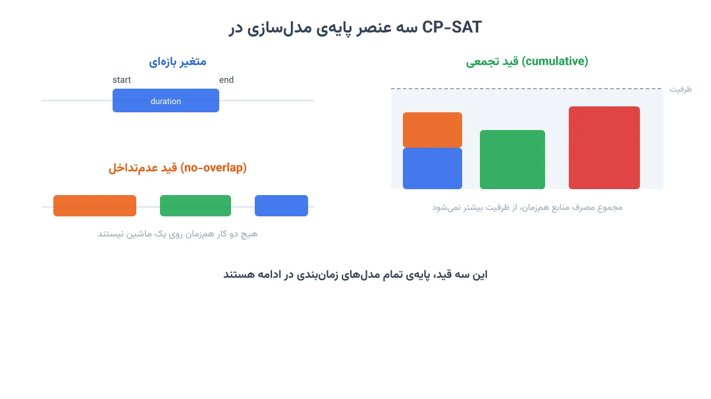
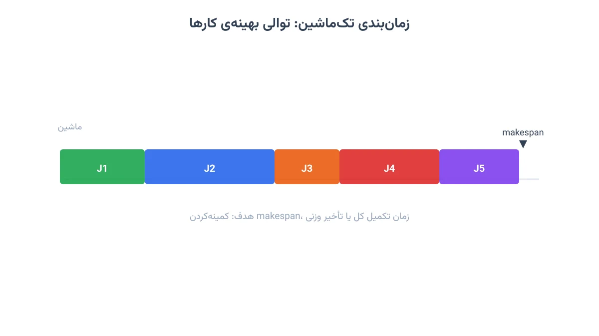
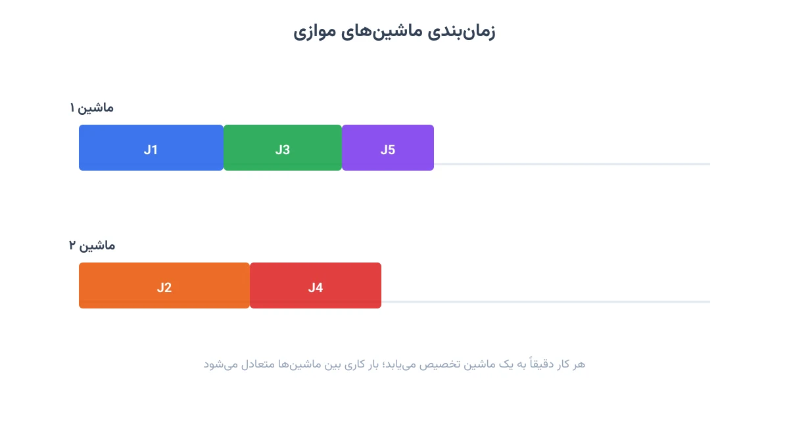
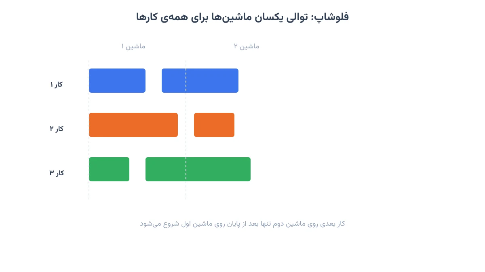
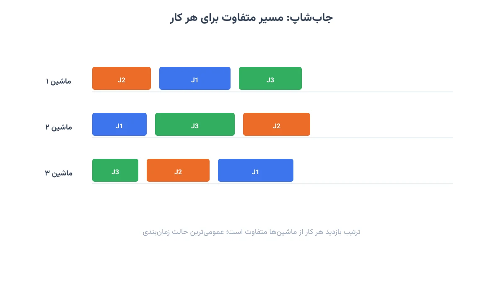
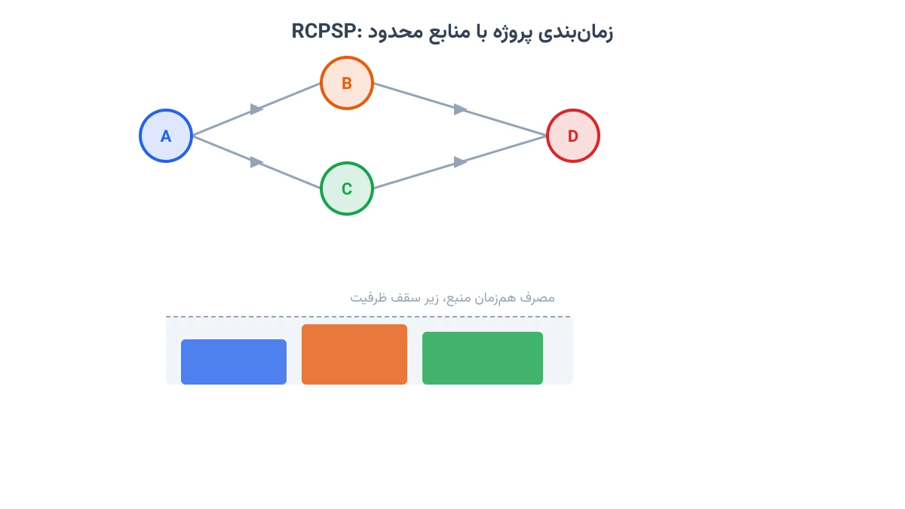
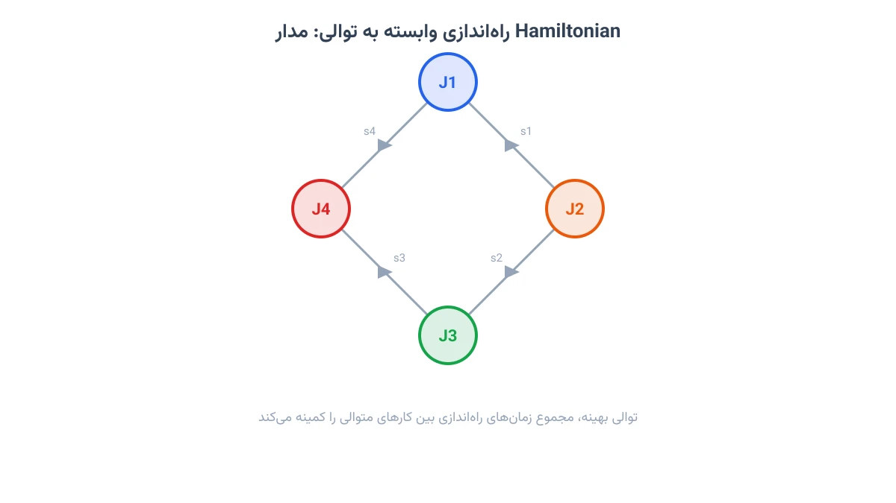
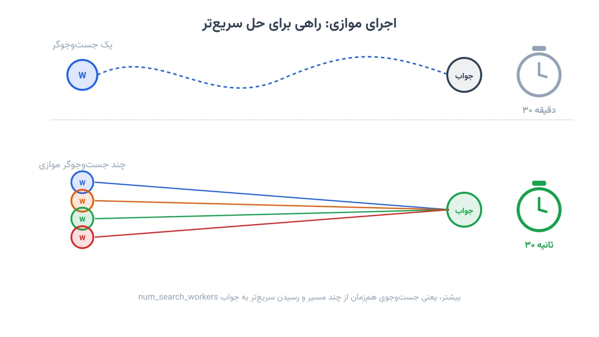

این یادداشت، مرجع فارسی‌زبان شما برای یادگیری سالور CP-SAT از OR-Tools است. CP-SAT ابزاری متن‌باز و رایگان برای حل مسائل زمان‌بندی و بهینه‌سازی گسسته است. این ماژول بخشی از OR-Tools گوگل است.

همین تکنیک‌ها پایه‌ی بسیاری از مسئله‌های واقعی زنجیره تأمین و حمل‌ونقل هستند. دوره‌ی [بهینه‌سازی زنجیره تأمین و حمل‌ونقل با پایتون](/courses/vrp-python/) این مسائل را با پیاده‌سازی کامل آموزش می‌دهد.

در حوزه‌ی سلامت هم، زمان‌بندی پرستار و اتاق عمل دقیقاً با همین ابزار حل می‌شود. این دقیقاً موضوع دوره‌ی [بهینه‌سازی سیستم‌های سلامت با پایتون](/courses/health-opt/) است.

## مقدمه


نصب پکیج تنها با یک دستور انجام میشود:

```bash
pip install ortools
```

هر مدل با دو object اصلی شروع می‌شود. `CpModel` محل تعریف متغیرها و قیدهاست و `CpSolver` مسئول حل مدل است.

```python
from ortools.sat.python import cp_model

model  = cp_model.CpModel()
solver = cp_model.CpSolver()
```

ایده‌ی کلی این است که یک برنامه‌ی زمانی معتبر را با متغیر و قید توصیف می‌کنیم. سپس مشخص می‌کنیم کدام برنامه بهتر است. سالور هم یا جواب بهینه را پیدا می‌کند، یا بهترین جواب ممکن در زمان محدود را برمی‌گرداند.

## سه عنصر پایه‌ی مدل‌سازی



هر مدل زمان‌بندی در CP-SAT روی سه عنصر پایه ساخته می‌شود: متغیر بازه‌ای، قید عدم‌تداخل، و قید تجمعی.

**متغیر بازه‌ای (Interval Variable)**: هر کار را با زمان شروع، مدت، و زمان پایان نشان می‌دهد. سالور خودش جای دقیق آن را روی خط زمان پیدا می‌کند.

```python
horizon = 30
start    = model.new_int_var(0, horizon, 'start')
end      = model.new_int_var(0, horizon, 'end')
duration = 8
interval = model.new_interval_var(start, duration, end, 'job_a')
```

**قید عدم‌تداخل (No-Overlap)**: این قید تضمین می‌کند هیچ دو بازه روی یک ماشین هم‌زمان اجرا نشوند. برای منابع منحصربه‌فرد مثل یک ماشین کاربرد دارد.

```python
intervals = []
for i, duration in enumerate([6, 8, 5]):
    s  = model.new_int_var(0, horizon, f's{i}')
    e  = model.new_int_var(0, horizon, f'e{i}')
    iv = model.new_interval_var(s, duration, e, f'iv{i}')
    intervals.append(iv)

model.add_no_overlap(intervals)
```

**قید تجمعی (Cumulative)**: وقتی چند کار بتوانند هم‌زمان از یک منبع با ظرفیت محدود استفاده کنند کاربرد دارد. مشابه منابع تجدیدپذیر، مانند تعداد محدود کارگر یا ظرفیت دستگاه.

```python
tasks   = [{'duration': 6, 'demand': 2},
           {'duration': 6, 'demand': 2},
           {'duration': 6, 'demand': 3}]
capacity = 4

intervals = []
demands   = []
for i, t in enumerate(tasks):
    s  = model.new_int_var(0, horizon, f's{i}')
    e  = model.new_int_var(0, horizon, f'e{i}')
    iv = model.new_interval_var(s, t['duration'], e, f'iv{i}')
    intervals.append(iv)
    demands.append(t['demand'])

model.add_cumulative(intervals, demands, capacity)
```

با همین سه قید، بیشتر مسائل زمان‌بندی قابل مدل‌سازی هستند.

## زمان‌بندی تک‌ماشین



در ساده‌ترین حالت، چند کار باید روی یک ماشین ترتیب شوند. سه هدف مختلف برای این مسئله مرسوم است.

**کمینه‌کردن makespan** (زمان پایان آخرین کار):

```python
from ortools.sat.python import cp_model

model  = cp_model.CpModel()
solver = cp_model.CpSolver()

durations = [5, 8, 3, 6, 4]
horizon   = sum(durations)

starts    = [model.new_int_var(0, horizon, f's{i}') for i in range(len(durations))]
ends      = [model.new_int_var(0, horizon, f'e{i}') for i in range(len(durations))]
intervals = [
    model.new_interval_var(starts[i], durations[i], ends[i], f'iv{i}')
    for i in range(len(durations))
]

model.add_no_overlap(intervals)

makespan = model.new_int_var(0, horizon, 'makespan')
model.add_max_equality(makespan, ends)
model.minimize(makespan)

status = solver.solve(model)
if status in (cp_model.OPTIMAL, cp_model.FEASIBLE):
    print(f'Makespan: {solver.value(makespan)}')
    for i in range(len(durations)):
        print(f'  Job {i}: [{solver.value(starts[i])}, {solver.value(ends[i])})')
```

**کمینه‌کردن زمان تکمیل کل** (قاعده‌ی SPT بهینه است):

```python
model.add_no_overlap(intervals)
model.minimize(sum(ends))

status = solver.solve(model)
if status in (cp_model.OPTIMAL, cp_model.FEASIBLE):
    order = sorted(range(len(durations)), key=lambda i: solver.value(starts[i]))
    print('SPT order:', order)
```

قاعده‌ی SPT یعنی شروع از کوتاه‌ترین کار. این ترتیب، مجموع زمان تکمیل همه‌ی کارها را کمینه می‌کند.

**کمینه‌کردن تأخیر وزنی**: هر کار یک مهلت تحویل و یک وزن اهمیت دارد.

```python
due_dates  = [7, 12, 5, 18, 10]
weights    = [3, 1, 2, 1, 2]

tardiness = []
for i in range(len(durations)):
    t = model.new_int_var(0, horizon, f'tard{i}')
    model.add_max_equality(t, [ends[i] - due_dates[i], 0])
    tardiness.append(weights[i] * t)

model.minimize(sum(tardiness))
```

`add_max_equality` تأخیر هر کار را به صفر محدود می‌کند. تابع هدف، مجموع وزنی این تأخیرها را کم می‌کند.

## زمان‌بندی ماشین‌های موازی



وقتی چند ماشین یکسان در دسترس هستند، هر کار باید به دقیقاً یکی از آن‌ها تخصیص یابد. این نیاز با متغیر بازه‌ای اختیاری حل می‌شود.

برای هر جفت و هر ماشین، یک متغیر بازه‌ای اختیاری تعریف می‌شود که فقط با انتخاب آن ماشین فعال می‌شود. قید `add_exactly_one` تضمین می‌کند هر کار دقیقاً روی یک ماشین برود.

```python
num_jobs     = 5
num_machines = 2
durations    = [8, 6, 5, 4, 3]
horizon      = sum(durations)

starts = [model.new_int_var(0, horizon, f's{j}') for j in range(num_jobs)]
ends   = [model.new_int_var(0, horizon, f'e{j}') for j in range(num_jobs)]

machine_intervals = [[] for _ in range(num_machines)]
presences        = [[None] * num_machines for _ in range(num_jobs)]

for j in range(num_jobs):
    for m in range(num_machines):
        is_present = model.new_bool_var(f'p{j}_{m}')
        iv = model.new_optional_interval_var(
            starts[j], durations[j], ends[j], is_present, f'iv{j}_{m}'
        )
        machine_intervals[m].append(iv)
        presences[j][m] = is_present

    model.add_exactly_one(presences[j])

for m in range(num_machines):
    model.add_no_overlap(machine_intervals[m])

makespan = model.new_int_var(0, horizon, 'makespan')
model.add_max_equality(makespan, ends)
model.minimize(makespan)

status = solver.solve(model)
if status in (cp_model.OPTIMAL, cp_model.FEASIBLE):
    for j in range(num_jobs):
        m = next(m for m in range(num_machines) if solver.value(presences[j][m]))
        print(f'  Job {j}: machine={m}  [{solver.value(starts[j])}, {solver.value(ends[j])})')
```

نکته‌ی مهم، `new_optional_interval_var` است. این بازه فقط وقتی در قید `no_overlap` شرکت می‌کند که متغیر حضورش برابر یک باشد.

## فلوشاپ (Flow Shop)



در فلوشاپ، همه‌ی کارها باید از یک توالی یکسان ماشین عبور کنند. این محدودیت با یک قید تقدم ساده اعمال می‌شود.

```python
proc = [
    [3, 4],
    [5, 2],
    [2, 6],
]
num_jobs     = len(proc)
num_machines = len(proc[0])
horizon      = sum(sum(row) for row in proc)

starts    = [[None]*num_machines for _ in range(num_jobs)]
ends      = [[None]*num_machines for _ in range(num_jobs)]
intervals = [[None]*num_machines for _ in range(num_jobs)]

for j in range(num_jobs):
    for m in range(num_machines):
        s  = model.new_int_var(0, horizon, f's{j}_{m}')
        e  = model.new_int_var(0, horizon, f'e{j}_{m}')
        iv = model.new_interval_var(s, proc[j][m], e, f'iv{j}_{m}')
        starts[j][m] = s; ends[j][m] = e; intervals[j][m] = iv

for m in range(num_machines):
    model.add_no_overlap([intervals[j][m] for j in range(num_jobs)])

for j in range(num_jobs):
    for m in range(num_machines - 1):
        model.add(starts[j][m + 1] >= ends[j][m])

makespan = model.new_int_var(0, horizon, 'makespan')
model.add_max_equality(makespan, [ends[j][num_machines-1] for j in range(num_jobs)])
model.minimize(makespan)

status = solver.solve(model)
if status in (cp_model.OPTIMAL, cp_model.FEASIBLE):
    print(f'Makespan: {solver.value(makespan)}')
    for j in range(num_jobs):
        row = '  '.join(
            f'M{m}:[{solver.value(starts[j][m])},{solver.value(ends[j][m])})'
            for m in range(num_machines)
        )
        print(f'  Job {j}: {row}')
```

ماتریس `proc` زمان پردازش هر کار روی هر ماشین را نشان می‌دهد. قید دوم تضمین می‌کند کار بعدی در ماشین بعد، تنها پس از پایان ماشین قبلی شروع شود.

## جاب‌شاپ (Job Shop)



جاب‌شاپ عمومی‌ترین و پرکاوش‌ترین حالت زمان‌بندی ماشین است. هر کار مسیر خاص خودش را بین ماشین‌ها دارد.

```python
jobs_data = [
    [(0, 3), (1, 2), (2, 2)],
    [(1, 3), (0, 2), (2, 3)],
    [(2, 2), (0, 3), (1, 2)],
]
num_machines = 3
horizon      = sum(d for job in jobs_data for _, d in job)

all_tasks            = {}
machine_to_intervals = {}

for j, job in enumerate(jobs_data):
    for task_id, (m, dur) in enumerate(job):
        s  = model.new_int_var(0, horizon, f's{j}_{task_id}')
        e  = model.new_int_var(0, horizon, f'e{j}_{task_id}')
        iv = model.new_interval_var(s, dur, e, f'iv{j}_{task_id}')
        all_tasks[(j, task_id)] = (s, e, iv)
        machine_to_intervals.setdefault(m, []).append(iv)

for m, ivs in machine_to_intervals.items():
    model.add_no_overlap(ivs)

for j, job in enumerate(jobs_data):
    for task_id in range(len(job) - 1):
        model.add(
            all_tasks[(j, task_id + 1)][0] >= all_tasks[(j, task_id)][1]
        )

makespan = model.new_int_var(0, horizon, 'makespan')
model.add_max_equality(
    makespan,
    [all_tasks[(j, len(job)-1)][1] for j, job in enumerate(jobs_data)]
)
model.minimize(makespan)

status = solver.solve(model)
if status in (cp_model.OPTIMAL, cp_model.FEASIBLE):
    print(f'Optimal makespan: {solver.value(makespan)}')
    for j, job in enumerate(jobs_data):
        for task_id, (m, _) in enumerate(job):
            s, e, _ = all_tasks[(j, task_id)]
            print(f'  Job {j} on M{m}: [{solver.value(s)}, {solver.value(e)})')
```

هر عنصر تاپل `jobs_data`، یک زوج (شماره‌ی ماشین، مدت) است. ترتیب این تاپل‌ها در هر ردیف، مسیر آن ردیف را مشخص می‌کند.

این دقیقاً همان مسئله‌ای است که در صنایع تولیدی و زنجیره تأمین واقعی دیده می‌شود. دوره‌ی [بهینه‌سازی زنجیره تأمین و حمل‌ونقل با پایتون](/courses/vrp-python/) چند پروژه‌ی مشابه را با داده‌ی واقعی حل می‌کند.

## RCPSP: زمان‌بندی پروژه با منابع محدود



در این مسئله، فعالیت‌ها هم به روابط تقدم نیاز دارند و هم منبع مشترک مصرف می‌کنند. قید cumulative با قید تقدم ترکیب می‌شود.

```python
tasks = [
    {'duration': 3, 'demand': 2},
    {'duration': 5, 'demand': 3},
    {'duration': 2, 'demand': 1},
    {'duration': 4, 'demand': 2},
]
precedences = [(0, 1), (0, 2), (1, 3), (2, 3)]
capacity    = 4

horizon     = sum(t['duration'] for t in tasks)

starts    = [model.new_int_var(0, horizon, f's{i}') for i in range(len(tasks))]
ends      = [model.new_int_var(0, horizon, f'e{i}') for i in range(len(tasks))]
intervals = [
    model.new_interval_var(starts[i], tasks[i]['duration'], ends[i], f'iv{i}')
    for i in range(len(tasks))
]

for i, j in precedences:
    model.add(starts[j] >= ends[i])

demands = [t['demand'] for t in tasks]
model.add_cumulative(intervals, demands, capacity)

makespan = model.new_int_var(0, horizon, 'makespan')
model.add_max_equality(makespan, ends)
model.minimize(makespan)

status = solver.solve(model)
if status in (cp_model.OPTIMAL, cp_model.FEASIBLE):
    print(f'Project duration: {solver.value(makespan)}')
    for i, task in enumerate(tasks):
        print(f'  Task {i} (demand={task["demand"]}): '
              f'[{solver.value(starts[i])}, {solver.value(ends[i])})')
```

لیست `precedences` مشخص می‌کند کدام فعالیت باید پیش از دیگری تمام شود. ظرفیت کل هم‌زمان هم محدود به یک مقدار ثابت است.

مدل RCPSP پایه‌ی بسیاری از مسائل زمان‌بندی بیمارستانی هم هست. مثلاً تخصیص اتاق عمل یا پرستار به بیمار از همین خانواده است. دوره‌ی [بهینه‌سازی سیستم‌های سلامت با پایتون](/courses/health-opt/) دقیقاً همین نوع مسئله را با پایتون پیاده‌سازی می‌کند.

## راه‌اندازی وابسته به توالی



برخی ماشین‌آلات بین دو کار متوالی به زمان تنظیم نیاز دارند. این زمان به ترتیب اجرای کارها بستگی دارد. `add_circuit` این توالی را مدل می‌کند.

```python
durations = [3, 5, 2, 4]
setup = [
    [0, 2, 3, 1],
    [2, 0, 1, 4],
    [3, 1, 0, 2],
    [1, 4, 2, 0],
]
n       = len(durations)
horizon = sum(durations) + sum(max(row) for row in setup)

starts    = [model.new_int_var(0, horizon, f's{i}') for i in range(n)]
ends      = [model.new_int_var(0, horizon, f'e{i}') for i in range(n)]
intervals = [
    model.new_interval_var(starts[i], durations[i], ends[i], f'iv{i}')
    for i in range(n)
]

arcs = []
for i in range(n):
    arcs.append((n, i, model.new_bool_var(f'first_{i}')))
    arcs.append((i, n, model.new_bool_var(f'last_{i}')))
    for j in range(n):
        if i == j:
            continue
        lit = model.new_bool_var(f'succ_{i}_{j}')
        arcs.append((i, j, lit))
        model.add(starts[j] >= ends[i] + setup[i][j]).only_enforce_if(lit)

model.add_circuit(arcs)
model.add_no_overlap(intervals)

makespan = model.new_int_var(0, horizon, 'makespan')
model.add_max_equality(makespan, ends)
model.minimize(makespan)

status = solver.solve(model)
if status in (cp_model.OPTIMAL, cp_model.FEASIBLE):
    order = sorted(range(n), key=lambda i: solver.value(starts[i]))
    print('Sequence:', ' → '.join(f'J{i}' for i in order))
```

گره `n` در لیست یال‌ها، گره مجازی است. این روش، اولین و آخرین کار توالی را مشخص می‌کند. ماتریس setup زمان تغییر از کار i به j را نشان می‌دهد.

## الگوهای پیشرفته


چهار الگوی رایج و پرکاربرد برای نزدیک‌ کردن مدل به شرایط واقعی وجود دارد.

**تاریخ آزادسازی**: هر کار زودتر از یک زمان مشخص قابل شروع نیست.

```python
release_dates = [0, 4, 2, 7, 1]
for i in range(num_jobs):
    model.add(starts[i] >= release_dates[i])
```

**ددلاین سخت**: هر کار باید پیش از یک سقف زمانی مشخص تمام شود.

```python
deadlines = [20, 26, 10, 26, 15]
for i in range(num_jobs):
    model.add(ends[i] <= deadlines[i])
```

**تعطیلی ماشین**: یک بازه‌ی ثابت به‌عنوان تعطیلی به لیست بازه‌های قید عدم‌تداخل اضافه می‌شود.

```python
break_start    = model.new_constant(10)
break_end      = model.new_constant(14)
break_interval = model.new_fixed_size_interval_var(break_start, 4, 'break')

all_machine_intervals = intervals + [break_interval]
model.add_no_overlap(all_machine_intervals)
```

**کارهای اختیاری با ارزش**: وقتی همه‌ی کارها قابل انجام نیستند، هر کدام یک ارزش دارد و باید بهترین زیرمجموعه انتخاب شود.

```python
values    = [10, 25, 8, 15, 20]
durations = [3,   8, 2,  5,  6]
horizon   = 15

intervals  = []
presences  = []

for i, (dur, val) in enumerate(zip(durations, values)):
    is_sched = model.new_bool_var(f'scheduled_{i}')
    s  = model.new_int_var(0, horizon, f's{i}')
    e  = model.new_int_var(0, horizon, f'e{i}')
    iv = model.new_optional_interval_var(s, dur, e, is_sched, f'iv{i}')
    intervals.append(iv)
    presences.append(is_sched)

model.add_no_overlap(intervals)
model.maximize(sum(values[i] * presences[i] for i in range(len(values))))
```

اینجا هدف، کمینه‌کردن زمان نیست. هدف بیشینه‌کردن ارزش کل کارهای انتخاب‌شده است.

## بهینه‌سازی عملکرد حل



برای مسائل بزرگ‌تر، چند تکنیک ساده سرعت حل را بهبود می‌دهند: تنگ‌کردن افق زمانی (کران‌تر کردن مرزهای متغیرها)، شروع گرم (warm-start) از یک جواب شناخته‌شده، اجرای موازی با چند هسته، و محدودیت زمانی. کال‌بک جواب هم اجازه می‌دهد جواب‌های بهبودیابنده را همین حین چاپ کرد.

```python
class SolutionPrinter(cp_model.CpSolverSolutionCallback):
    def __init__(self, makespan_var):
        super().__init__()
        self._makespan = makespan_var
        self._count    = 0

    def on_solution_callback(self):
        self._count += 1
        print(f'  Solution {self._count}: makespan = {self.value(self._makespan)}')

solver.parameters.max_time_in_seconds   = 30.0
solver.parameters.num_search_workers    = 8
solver.parameters.log_search_progress   = True

cb     = SolutionPrinter(makespan)
status = solver.solve(model, cb)
print(f'Status: {solver.status_name(status)}')
```

`num_search_workers` تعداد رشته‌های موازی جست‌جو را مشخص می‌کند. این گزینه روی مسائل بزرگ‌تر، تفاوت چشم‌گیری دارد.

## جمع‌بندی

CP-SAT ابزاری قدرتمند و رایگان برای زمان‌بندی و بهینه‌سازی گسسته است. این یادداشت نقطه‌ی شروع مسیر یادگیری OR-Tools به فارسی خواهد بود.

اگر مسئله‌ی شما به زنجیره تأمین، مسیریابی یا لجستیک مربوط است، دوره‌ی [بهینه‌سازی زنجیره تأمین و حمل‌ونقل با پایتون](/courses/vrp-python/) را ببینید. این دوره از همین تکنیک‌های CP-SAT برای حل پروژه‌های واقعی استفاده می‌کند.

اگر حوزه‌ی کاری شما سلامت و درمان است، دوره‌ی [بهینه‌سازی سیستم‌های سلامت با پایتون](/courses/health-opt/) را پیشنهاد می‌کنیم. بیست پروژه‌ی واقعی بیمارستانی، با همین سالور، در این دوره حل می‌شوند.

