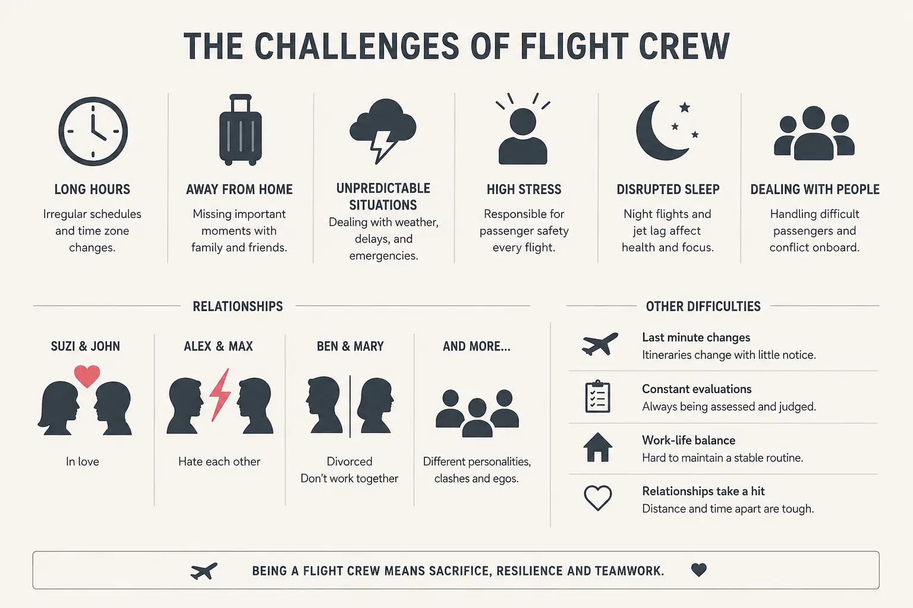

هر خط هواپیمایی هر روز صدها یا هزاران پرواز را در سراسر دنیا اجرا می‌کند، و پشت هر یک از این پروازها یک خلبان و چند مهماندار ایستاده‌اند که باید سر ساعت درست، در فرودگاه درست، و با ساعات کاری قانونی حاضر باشند.

تخصیص این افراد به پروازها به‌ظاهر یک مسئله‌ی زمان‌بندی ساده به نظر می‌رسد. اما وقتی قوانین ایمنی پروازی (حداکثر ساعت پرواز روزانه، حداقل زمان استراحت بین دو نوبت، بازگشت اجباری خدمه به پایگاه اصلی هر چند روز یک‌بار) وارد بازی می‌شوند، این مسئله به یکی از سخت‌ترین و پرهزینه‌ترین مسائل بهینه‌سازی در صنعت هوانوردی تبدیل می‌شود؛ مسئله‌ای که در ادبیات تحقیق در عملیات با نام Crew Pairing Problem شناخته می‌شود.

ایده‌ی اصلی این است که به‌جای تخصیص مستقیم افراد به تک‌تک پروازها، ابتدا یک واحد بزرگ‌تر به نام «جفت» یا Pairing ساخته می‌شود. این جفت، یک زنجیره‌ی چندروزه از پروازهاست که از یک پایگاه شروع می‌شود، خدمه را در چند شهر مختلف جابه‌جا می‌کند، و در نهایت او را به همان پایگاه بازمی‌گرداند؛ درحالی‌که تمام قیدهای قانونی و ایمنی در طول مسیر رعایت شده باشند.

هدف نهایی، انتخاب مجموعه‌ای از این جفت‌ها از میان میلیون‌ها گزینه‌ی ممکن است. باید هر پرواز دقیقاً یک‌بار پوشش داده شود و هزینه‌ی کل کمینه شود؛ هزینه‌ای که شامل حقوق، هزینه‌ی اقامت شبانه در شهرهای مقصد، و ساعات مرده‌ی بین دو پرواز است.

## فرمول‌بندی ریاضی مسئله

ساختار کلاسیک این مسئله، مدل پوشش/افراز مجموعه (Set Partitioning/Covering Problem) است. فرض کنید $F$ مجموعه‌ی تمام پروازهایی باشد که باید در بازه‌ی زمانی برنامه‌ریزی (مثلاً یک ماه) پوشش داده شوند، و $P$ مجموعه‌ی تمام جفت‌های قانونی ممکن باشد (هر جفت زیرمجموعه‌ای از پروازهاست که به‌ترتیب زمانی و مکانی به هم متصل‌اند و قیدهای قانونی را رعایت می‌کنند). متغیر تصمیم $x_p$ برابر یک است اگر جفت $p$ انتخاب شود و در غیر این صورت صفر خواهد بود. مدل ریاضی به این صورت نوشته می‌شود:

$$
\min \sum_{p \in P} c_p \, x_p
$$

$$
\sum_{p \in P \,:\, f \in p} x_p = 1 \qquad \forall f \in F
$$

$$
x_p \in \{0,1\} \qquad \forall p \in P
$$

که در آن $c_p$ هزینه‌ی کل جفت $p$ است؛ شامل حقوق پایه، هزینه‌ی اقامت شبانه، و جریمه‌ی ساعات معطلی. قید دوم تضمین می‌کند هر پرواز دقیقاً توسط یک جفت پوشش داده شود. چالش اصلی این‌جاست که مجموعه‌ی $P$ عملاً می‌تواند میلیون‌ها عضو داشته باشد، چون تعداد ترکیب‌های قانونی پروازها به‌صورت نمایی رشد می‌کند.

به همین دلیل این جفت‌ها معمولاً از پیش تولید نمی‌شوند. به‌جای آن، با روش تولید ستون (Column Generation) به‌تدریج و فقط در صورت نیاز ساخته می‌شوند. یک مسئله‌ی زیرمسئله (اغلب یک مسئله‌ی کوتاه‌ترین مسیر با قید منابع محدود، Resource Constrained Shortest Path) جفت‌های جدید و بالقوه سودمند را پیدا می‌کند و به مسئله‌ی اصلی اضافه می‌کند تا جواب بهبود یابد.

## چرا این موضوع اهمیت دارد

هزینه‌ی نیروی انسانی پروازی یکی از بزرگ‌ترین اقلام هزینه‌ی عملیاتی خطوط هوایی پس از سوخت است. حتی بهبود چند درصدی در کارایی زمان‌بندی خدمه می‌تواند سالانه ده‌ها میلیون دلار صرفه‌جویی به همراه داشته باشد.

خطوط هوایی‌ای مثل لوفت‌هانزا که شبکه‌ی پروازی گسترده‌ای در اروپا و مسیرهای بین‌قاره‌ای دارند، هر روز با این چالش روبه‌رو هستند: چگونه خدمه‌ی پروازی را طوری زمان‌بندی کنند که هم قوانین سخت‌گیرانه‌ی ایمنی هوانوردی (مثل مقررات FTL یا Flight Time Limitations) رعایت شود، هم رضایت شغلی خدمه حفظ شود، و هم هزینه‌ی کل شرکت کمینه بماند.

علاوه‌بر بعد اقتصادی، این مسئله بعد ایمنی هم دارد. خستگی خدمه پروازی یکی از عوامل شناخته‌شده در بروز خطاهای انسانی است، و مدل‌سازی دقیق قیدهای استراحت و ساعت کاری، مستقیماً روی ایمنی پرواز اثر می‌گذارد.

از طرف دیگر، هر اختلال غیرمنتظره (طوفان، تأخیر فنی، بیماری ناگهانی یک عضو خدمه) نیازمند بازآرایی سریع زمان‌بندی است. همین موضوع، این مسئله را به یک مسئله‌ی بهینه‌سازی پویا و بلادرنگ هم تبدیل می‌کند.

## ظرفیت پژوهشی و آکادمیک

Crew Pairing Problem و مسئله‌ی مرتبط آن یعنی Crew Rostering از پرکارترین حوزه‌های پژوهشی در تقاطع تحقیق در عملیات و علوم حمل‌ونقل هوایی هستند. Crew Rostering یعنی تخصیص جفت‌های نهایی‌شده به افراد مشخص، با در نظر گرفتن ترجیحات، مرخصی، و سابقه‌ی کاری.

مسیرهای پژوهشی باز شامل بهبود الگوریتم‌های تولید ستون برای مقیاس‌های بزرگ‌تر، مدل‌سازی عدم‌قطعیت در تأخیر پروازها، و طراحی جفت‌های «مقاوم» (Robust Pairings) است که در برابر اختلال کمتر به‌هم می‌ریزند. مسیرهای دیگر شامل یکپارچه‌سازی هم‌زمان زمان‌بندی هواپیما و خدمه (که معمولاً به‌صورت جداگانه حل می‌شوند ولی وابستگی متقابل دارند)، و کاربرد یادگیری ماشین برای پیش‌بینی احتمال اختلال است.

علاوه‌بر این، بازآرایی بلادرنگ زمان‌بندی خدمه در روز عملیات (Crew Recovery) پس از یک اختلال، خودش یک زیرحوزه‌ی کامل و پویا برای پایان‌نامه یا مقاله است، به‌خصوص با رشد داده‌های عملیاتی در دسترس شرکت‌های هواپیمایی که امکان استفاده از روش‌های داده‌محور در کنار مدل‌های ریاضی کلاسیک را فراهم کرده است.

## پیاده‌سازی با پایتون

نسخه‌های کوچک و متوسط این مسئله را می‌توان کاملاً با ابزارهای متن‌باز پایتون مدل‌سازی و حل کرد، بدون نیاز به نرم‌افزارهای تخصصی و بسیار گران‌قیمت زمان‌بندی خطوط هوایی. برای مسئله‌ی نهایی تخصیص جفت‌های ازپیش‌تعریف‌شده به‌صورت پوشش مجموعه، می‌توان از [PuLP](https://coin-or.github.io/pulp/) یا [Pyomo](http://www.pyomo.org/) برای نوشتن مدل و از سالورهای متن‌باز مثل [CBC](https://github.com/coin-or/Cbc) یا [HiGHS](https://highs.dev/) برای حل آن استفاده کرد.

برای تولید خودِ جفت‌های قانونی (که شامل قیدهای ترتیبی، زمانی و قانونی پیچیده است)، ماژول CP-SAT کتابخانه‌ی [OR-Tools](https://developers.google.com/optimization) گزینه‌ی بسیار مناسبی است. این ماژول امکان بیان قیدهایی مثل حداکثر ساعت پرواز پیوسته، حداقل استراحت بین دو نوبت، و بازگشت اجباری به پایگاه را با متغیرهای Interval و قیدهای منطقی به‌سادگی فراهم می‌کند؛ همین رویکرد در مسائل مشابه مثل شیفت‌بندی پرستاران هم به‌کار می‌رود. 

داده‌های ورودی معمولاً شامل یک فایل CSV یا اکسل با ستون‌های شماره پرواز، فرودگاه مبدأ و مقصد، ساعت پرواز، و مدت‌زمان پرواز است که به‌راحتی با [pandas](https://pandas.pydata.org/) خوانده و پیش‌پردازش می‌شود. برای شرکت‌های کوچک‌تر هواپیمایی یا اپراتورهای چارتری با چند ده پرواز در روز، این ابزارهای رایگان می‌توانند جایگزین کاملاً کاربردی نرم‌افزارهای تجاری زمان‌بندی خدمه باشند.

موضوعات مشابه این موضوع در 
[دوره بهینه‌سازی OR-Tools](/courses/vrp-python/)
 به‌صورت پروژه‌محور پوشش داده شده است.

<h3>سوالات متداول</h3>

آیا این مدل فقط برای خطوط هوایی بزرگ کاربرد دارد؟

نه لزوماً. حتی اپراتورهای چارتری و شرکت‌های هواپیمایی منطقه‌ای با تعداد پرواز محدودتر هم می‌توانند از مدل ساده‌شده‌ی پوشش مجموعه برای زمان‌بندی خدمه استفاده کنند و در هزینه‌ی اقامت و ساعات معطلی صرفه‌جویی کنند.

برای یادگیری مدل‌سازی این نوع مسائل زمان‌بندی و تخصیص چگونه شروع کنم؟

دوره <a href="/courses/vrp-python/" style="color:#2563EB; font-weight:bold;">مسیریابی و زمان‌بندی با پایتون</a> مبانی مدل‌سازی مسائل پوشش/افراز مجموعه و زمان‌بندی با قید را با OR-Tools و CP-SAT پوشش می‌دهد و پایه‌ی خوبی برای ورود به این حوزه است.

اگر بخواهم این مدل را برای شرکت یا ناوگان خودم پیاده‌سازی کنم چه کار کنم؟

می‌توانید از طریق صفحه <a href="/consultation/" style="color:#2563EB; font-weight:bold;">مشاوره</a> جزئیات عملیاتی و قیدهای خاص سازمان‌تان را مطرح کنید تا مدل زمان‌بندی متناسب با آن طراحی شود.

