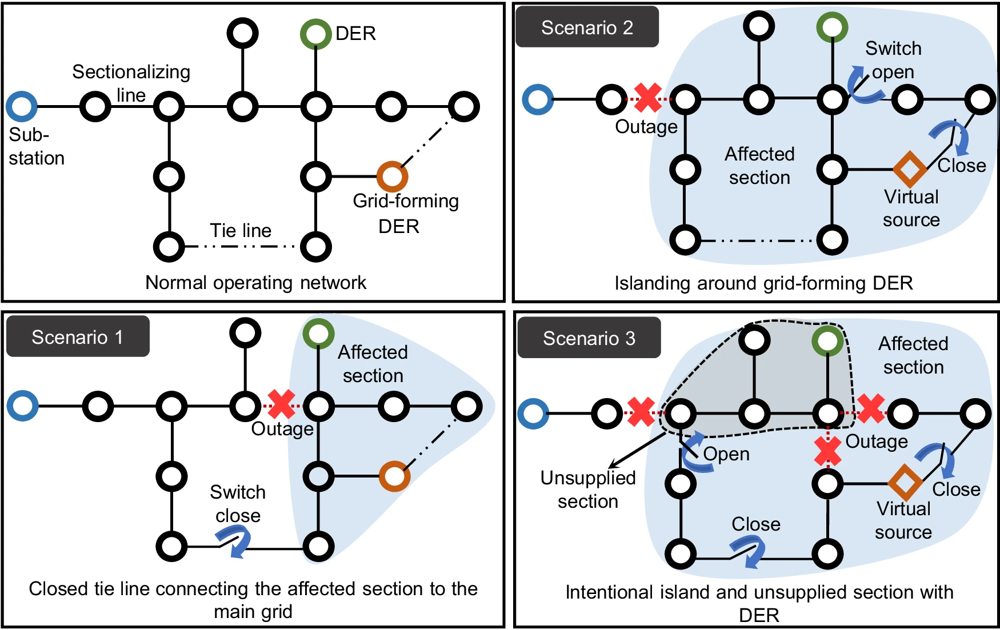

اگر تا به حال به نقشه یک شبکه توزیع برق نگاه کرده باشید، احتمالاً چیزی شبیه یک تار عنکبوت پیچیده دیده‌اید. فیدرها و ساب‌فیدرهای زیادی به هم متصل‌اند، اما در عمل شبکه به‌صورت شعاعی بهره‌برداری می‌شود. یعنی از میان تمام مسیرهای ممکن، تنها یک مسیر برای رساندن برق به هر مصرف‌کننده فعال است و بقیه کلیدها باز می‌مانند.

این تصمیم که کدام کلیدها باز و کدام‌ها بسته باشند، به‌ظاهر ساده است. اما از نظر ریاضی یکی از سخت‌ترین و جذاب‌ترین مسائل بهینه‌سازی ترکیبیاتی در سیستم قدرت است؛ مسئله‌ای که به آن بازآرایی شبکه توزیع یا Distribution Network Reconfiguration می‌گویند.

## چرا اصلاً شبکه را بازآرایی می‌کنیم؟

هر شبکه توزیع مجهز به دو نوع کلید است. کلیدهای بخش‌کننده (Sectionalizing Switches) در حالت عادی بسته‌اند و ستون فقرات هر فیدر را تشکیل می‌دهند. کلیدهای رابط (Tie Switches) معمولاً باز می‌مانند و دو فیدر مجاور را در مواقع لزوم به هم متصل می‌کنند. با تغییر وضعیت این کلیدها -بستن چند تای رابط و باز کردن چند تای بخش‌کننده- توپولوژی شبکه عوض می‌شود، بی‌آنکه ساختار شعاعی آن از بین برود.

نتیجه این جابه‌جایی ساده می‌تواند شگفت‌انگیز باشد. توزیع بار میان فیدرها متعادل‌تر می‌شود. تلفات توان اهمی که در کابل‌ها و ترانسفورماتورها به گرما تبدیل می‌شود کاهش می‌یابد. افت ولتاژ در انتهای فیدرهای طولانی جبران می‌شود. در صورت خرابی یک بخش از شبکه هم، امکان تغذیه مجدد مشترکان از مسیر دیگر فراهم می‌شود.

برای یک شرکت توزیع برق، این تغییرات معنای مالی مستقیم دارند. بسیاری از شرکت‌ها سالانه درصد قابل‌توجهی از انرژی تولیدی را به‌صورت تلفات فنی از دست می‌دهند. حتی چند درصد کاهش تلفات با بازآرایی هوشمندانه، به معنای صرفه‌جویی مالی چشمگیر است؛ بدون نیاز به سرمایه‌گذاری در تجهیزات جدید.

Ref : https://www.nature.com/articles/s41467-024-49207-y

## فرمول‌بندی ریاضی مسئله

هدف اصلی در بیشتر مطالعات، کمینه‌کردن تلفات توان اکتیو در کل شبکه است. اگر شبکه را با مجموعه‌ای از شاخه‌ها (خطوط) در نظر بگیریم که هر کدام مقاومت مشخصی دارند، تابع هدف به این صورت نوشته می‌شود:

$$
\min \; P_{loss} = \sum_{ij \in E} u_{ij} \cdot R_{ij} \cdot \frac{P_{ij}^2 + Q_{ij}^2}{V_i^2}
$$

در این رابطه، $u_{ij}$ یک متغیر باینری است. این متغیر وضعیت کلید روی شاخه بین شین $i$ و $j$ را نشان می‌دهد؛ یک برای بسته و صفر برای باز. $R_{ij}$ مقاومت شاخه است. $P_{ij}$ و $Q_{ij}$ به‌ترتیب توان اکتیو و راکتیو عبوری از آن شاخه هستند. آنچه این مسئله را از یک پخش‌بار معمولی متمایز می‌کند، مجموعه قیدهایی است که باید هم‌زمان برقرار بمانند:

$$
\sum_{j} P_{ij} - \sum_{k} P_{jk} = P_j^{load}, \qquad \sum_{ij \in E} u_{ij} = n_{bus} - 1
$$

قید اول همان تعادل توان در هر شین است. قید دوم، شرط درخت فراگیر (Spanning Tree) را تحمیل می‌کند. یعنی تعداد شاخه‌های فعال باید دقیقاً برابر با تعداد شین‌ها منهای یک باشد؛ تا شبکه بدون حلقه و کاملاً متصل بماند. علاوه بر این، محدودیت‌های ولتاژ مجاز در هر شین ($V_{min} \le V_i \le V_{max}$) و ظرفیت حرارتی هر فیدر نیز باید رعایت شوند. ترکیب این قید ترکیبیاتیِ رادیال‌بودن با معادلات غیرخطی پخش‌بار، همان چیزی است که مسئله را NP-سخت می‌کند. فضای جواب به‌ازای هر شبکه واقعی آن‌قدر بزرگ است که بررسی همه حالت‌ها عملاً غیرممکن است.

## چگونه این مسئله را حل می‌کنند؟

تاریخچه حل این مسئله را می‌توان در سه نسل خلاصه کرد. نسل اول، روش‌های هیوریستیک کلاسیک مانند الگوریتم تبادل شاخه (Branch Exchange) هستند. این روش‌ها از حالت اولیه شبکه شروع می‌کنند. در هر گام یک کلید باز را می‌بندند و یکی از کلیدهای بسته را در همان حلقه باز می‌کنند، به شرطی که تلفات کاهش یابد. این روش سریع است اما تضمینی برای رسیدن به جواب بهینه سراسری نمی‌دهد و اغلب در یک بهینه محلی گیر می‌افتد.

نسل دوم به سراغ متاهیوریستیک‌ها رفت: الگوریتم ژنتیک، بهینه‌سازی ازدحام ذرات، رقابت استعماری و مشابه آن‌ها. این روش‌ها فضای جواب را با نمایش هر توپولوژی به‌صورت یک رشته باینری یا مجموعه‌ای از کلیدهای باز جست‌وجو می‌کنند. انعطاف بیشتری دارند و می‌توانند اهداف چندگانه (تلفات، پروفیل ولتاژ، قابلیت اطمینان) را هم‌زمان در نظر بگیرند. اما زمان اجرا و حساسیت به تنظیم پارامترها همچنان چالش‌برانگیز است.

نسل سوم و مدرن‌تر، فرمول‌بندی مسئله به‌صورت یک برنامه‌ریزی خطی مختلط عدد صحیح (MILP) است. این کار با استفاده از تقریب‌های خطی‌سازی‌شده پخش‌بار انجام می‌شود، مانند مدل DistFlow خطی‌شده. برای دیدن مثال‌های دیگری از این نوع خطی‌سازی، یادداشت [مطالعات پخش بار AC](/notes/ac-studies/) را ببینید. مزیت بزرگ این رویکرد آن است که با سالورهای تجاری می‌توان به جواب بهینه یا بسیار نزدیک به بهینه با ضمانت ریاضی دست یافت. این مزیت به‌ویژه وقتی مهم است که مسئله باید در کنار تخصیص منابع تولید پراکنده، جایابی ذخیره‌سازهای انرژی یا برنامه‌ریزی بازیابی پس از خاموشی حل شود.

امروزه با نفوذ روزافزون تولیدات خورشیدی پشت‌بامی در فیدرهای توزیع، بازآرایی دیگر صرفاً یک ابزار کاهش تلفات نیست، بلکه به بخشی جدایی‌ناپذیر از مدیریت بار دوطرفه و کنترل ولتاژ در شبکه‌های توزیع فعال (Active Distribution Networks) تبدیل شده است.

## چرا این موضوع اهمیت دارد؟

اهمیت بازآرایی شبکه توزیع را باید در دو سطح دید. در سطح عملیاتی و اقتصادی، شرکت‌های توزیع برق در بسیاری از کشورها، از جمله ایران، با تلفات فنی قابل‌توجهی روبه‌رو هستند. بخش عمده این تلفات ناشی از توپولوژی غیربهینه فیدرها و توزیع نامتوازن بار است. بازآرایی، برخلاف بسیاری از راهکارهای دیگر کاهش تلفات، تقریباً بدون هزینه سرمایه‌ای اجرا می‌شود. چون زیرساخت کلیدزنی از قبل در شبکه وجود دارد و تنها کافی است الگوریتم بهینه‌سازی به ما بگوید کدام کلیدها باید عوض شوند.

در سطح راهبردی‌تر، تولیدات پراکنده خورشیدی و بادی در حال گسترش‌اند. شارژ خودروهای برقی و ذخیره‌سازهای انرژی هم به سطح توزیع اضافه می‌شوند. شبکه‌ای که تا دیروز جریان توان یک‌طرفه داشت، امروز باید جریان دوطرفه و متغیر را مدیریت کند. بازآرایی پویا و لحظه‌ای شبکه، یکی از ابزارهای کلیدی برای سازگاری با این تحول است. به همین دلیل، این حوزه از یک موضوع صرفاً دانشگاهی به یکی از اولویت‌های واقعی صنعت برق تبدیل شده است.

## آیا این حوزه جای کار آکادمیک دارد؟

بله، و در واقع بازآرایی شبکه توزیع یکی از پویاترین حوزه‌های پژوهشی در مهندسی سیستم قدرت است. با اینکه فرمول‌بندی پایه این مسئله سال‌هاست شناخته‌شده، هنوز مسیرهای باز و بکر زیادی برای پژوهش وجود دارد.

این مسیرها شامل چند جهت است: بازآرایی هم‌زمان با جایابی و اندازه‌گذاری منابع تولید پراکنده و ذخیره‌سازهای انرژی؛ مدل‌سازی عدم‌قطعیت تولید خورشیدی و بادی با رویکردهایی مانند بهینه‌سازی استوار (Robust) یا تصادفی (Stochastic)؛ توسعه روش‌های حل مقیاس‌پذیر برای شبکه‌های واقعی با هزاران شین، که در آن‌ها فرمول‌بندی‌های دقیق MILP کند می‌شوند؛ بازآرایی بلادرنگ برای بازیابی سریع پس از حوادث طبیعی؛ و ترکیب یادگیری ماشین با بهینه‌سازی کلاسیک برای تصمیم‌گیری سریع‌تر در شبکه‌های هوشمند.

برای دانشجویان تحصیلات تکمیلی که به دنبال موضوع پایان‌نامه یا مقاله هستند، این زمینه ترکیبی از عمق ریاضی و کاربرد صنعتی مستقیم ارائه می‌دهد. این ترکیب باعث می‌شود نتایج پژوهشی هم به‌سادگی در مجلات معتبر قابل انتشار باشند و هم در پروژه‌های واقعی قابل استفاده.

## پیاده‌سازی با پایتون و ابزارهای متن‌باز

یکی از نکاتی که یادگیری این حوزه را برای دانشجویان و مهندسان بسیار در دسترس‌تر می‌کند، این است که دیگر نیازی به سالورهای تجاری گران‌قیمت نیست. با پایتون و کتابخانه‌هایی کاملاً متن‌باز و رایگان می‌توان کل زنجیره مدل‌سازی تا حل مسئله بازآرایی را پیاده کرد. کتابخانه‌هایی مانند [Pyomo](https://www.pyomo.org/) یا [PuLP](https://coin-or.github.io/pulp/) برای فرمول‌بندی ریاضی مسئله به‌صورت MILP استفاده می‌شوند. سالورهای متن‌باز مانند [HiGHS](https://highs.dev/)، [CBC](https://github.com/coin-or/Cbc) یا [GLPK](https://www.gnu.org/software/glpk/) هم برای حل آن به‌کار می‌روند، بدون پرداخت هیچ هزینه‌ای برای لایسنس. برای مروری بر روش‌های مختلف فراخوانی این سالورها در Pyomo، یادداشت [سه روش عملی استفاده از سالورها](/notes/pyomo-solvers/) مفید است.

در کنار این‌ها، ابزارهایی مانند [pandapower](https://www.pandapower.org/) و [PyPSA](https://pypsa.org/) به‌طور اختصاصی برای مدل‌سازی شبکه‌های توزیع و انتقال ساخته شده‌اند. این ابزارها امکان محاسبه پخش‌بار، بررسی قیدهای ولتاژ و پیاده‌سازی سناریوهای بازآرایی را به‌شکل آماده در اختیار می‌گذارند.

این در دسترس‌بودن رایگان اهمیت زیادی دارد. یادگیری و تحقیق در این حوزه دیگر در انحصار افرادی نیست که به نرم‌افزارهای تجاری گران‌قیمتی مانند Gurobi یا CPLEX دسترسی دارند. هر کسی با یک لپ‌تاپ معمولی می‌تواند مسائل واقعی را مدل‌سازی و حل کند. پیش از ورود به این فرمول‌بندی‌ها، مرور یادداشت [مدل‌سازی ریاضی و اهمیت آن](/notes/mathematical-modeling-art/) هم می‌تواند دید کلی خوبی بدهد.
## سوالات متداول

<h3>آیا بازآرایی شبکه توزیع فقط برای کاهش تلفات استفاده می‌شود؟</h3>

خیر. اگرچه کاهش تلفات رایج‌ترین هدف است، از همین مسئله برای اهداف دیگر هم استفاده می‌شود؛ بهبود پروفیل ولتاژ، متعادل‌سازی بار میان فیدرها، افزایش شاخص‌های قابلیت اطمینان مانند SAIDI و SAIFI، و حتی بازیابی سریع تغذیه پس از وقوع خطا. در بسیاری از پژوهش‌های جدید، این اهداف به‌صورت چندهدفه و هم‌زمان با تخصیص منابع تولید پراکنده بررسی می‌شوند.

<h3>چرا نمی‌توان همه کلیدها را بسته و شبکه را به‌صورت حلقوی بهره‌برداری کرد؟</h3>

از نظر فنی ممکن است تلفات در برخی حالات حلقوی کمتر شود. اما بهره‌برداری شعاعی به دلایل حفاظتی انتخاب می‌شود. هماهنگی رله‌ها و فیوزها در ساختار شعاعی بسیار ساده‌تر است و جریان اتصال کوتاه در هر نقطه قابل پیش‌بینی و کنترل می‌ماند. به همین دلیل، قید درخت فراگیر (رادیال‌بودن) در تمام فرمول‌بندی‌های عملیاتی این مسئله حفظ می‌شود.

<h3>برای یادگیری فرمول‌بندی دقیق و پیاده‌سازی این مسائل از کجا شروع کنم؟</h3>

اگر می‌خواهید مدل‌سازی ریاضی این‌گونه مسائل را قدم‌به‌قدم و کاربردی یاد بگیرید، دوره <a href="/courses/advanced-power-system/" style="color:#2563EB; font-weight:bold;">سیستم قدرت پیشرفته</a> مسیر مناسبی است؛ این دوره فرمول‌بندی پخش‌بار و پیاده‌سازی عملی در نرم‌افزارهای بهینه‌سازی را پوشش می‌دهد. اگر روی یک پروژه واقعی بازآرایی کار می‌کنید و به راهنمایی تخصصی نیاز دارید، می‌توانید از طریق صفحه <a href="/consultation/" style="color:#2563EB; font-weight:bold;">مشاوره</a> با ما در ارتباط باشید.

