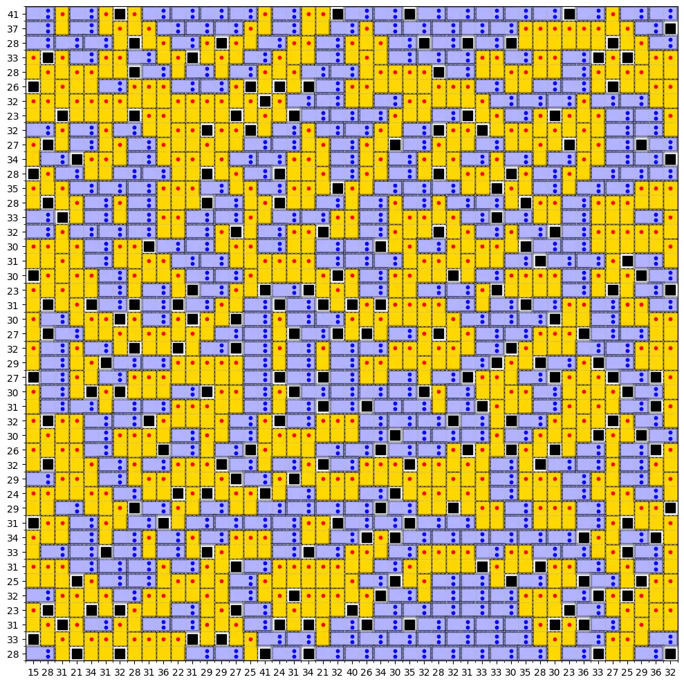

پازل **Domino Fit** یک مسئله‌ی جذاب جایابی است که در آن باید دومینوها را روی یک شبکه‌ی ثابت قرار دهیم؛ به‌طوری‌که هم تمام خانه‌های مجاز پوشانده شوند و هم مجموع اعداد هر سطر و ستون با مقادیر داده‌شده برابر باشد.

در این پازل دو نوع قطعه داریم:

- **دومینوی عمودی**: به‌صورت عمودی روی دو خانه‌ی متوالی قرار می‌گیرد و مقدار آن برابر با ۱ است.
- **دومینوی افقی**: روی دو خانه‌ی مجاور در یک سطر قرار می‌گیرد و مقدار آن برابر با ۲ است.

برخی خانه‌های شبکه نیز مسدود هستند و هیچ دومینویی نمی‌تواند آن‌ها را بپوشاند.

در کنار هر سطر و ستون، مجموع مورد انتظار نوشته شده است. هدف این است که آرایشی از دومینوها پیدا کنیم که تمام این محدودیت‌ها را هم‌زمان ارضا کند.

---

## چرا برنامه‌ریزی محدودیت؟

در نگاه اول ممکن است این مسئله شبیه یک جست‌وجوی ساده به نظر برسد، اما تعداد حالت‌های ممکن با افزایش ابعاد شبکه به‌سرعت رشد می‌کند.

برای مثال، در یک شبکه‌ی $25 \times 25$، بررسی تمام حالت‌های ممکن به روش brute force عملاً امکان‌پذیر نیست.
**برنامه‌ریزی محدودیت** یا Constraint Programming برای چنین مسائلی بسیار مناسب است؛ زیرا می‌توانیم قواعد مسئله را مستقیماً به مدل بدهیم و حل‌کننده، آرایش‌های نامعتبر را بدون بررسی کامل کنار بگذارد.

در این مطلب از حل‌کننده‌ی **CP-SAT** در کتابخانه‌ی OR-Tools استفاده می‌کنیم.

---

## گام صفر: شناخت داده‌های مسئله

برای تعریف هر نمونه از پازل، به اطلاعات زیر نیاز داریم:

1. تعداد سطرها و ستون‌های شبکه
2. محل خانه‌های مسدود
3. مجموع مورد انتظار برای هر سطر
4. مجموع مورد انتظار برای هر ستون

برای مثال:

```python
n_rows = 5
n_cols = 5

blocked_cells = {
    (0, 2),
    (2, 1),
    (4, 3),
}

row_targets = [6, 7, 5, 8, 4]
col_targets = [5, 7, 6, 4, 8]
```

اندیس‌گذاری خانه‌ها را به‌صورت $(i,j)$ در نظر می‌گیریم؛ به‌طوری‌که:

- i: شماره‌ی سطر
- j: شماره‌ی ستون

---

## گام اول: تعریف متغیرهای تصمیم

باید مشخص کنیم هر دومینو در کدام موقعیت قرار می‌گیرد.

دو مجموعه متغیر باینری تعریف می‌کنیم.

### متغیر دومینوی عمودی

متغیر $U^v_{i,j} \in \{0,1\}$ یک متغیر باینری است.

اگر مقدار این متغیر برابر با یک باشد، یک دومینوی عمودی از خانه‌ی $(i,j)$ شروع می‌شود و خانه‌های زیر را می‌پوشاند:

$$
(i,j),\qquad (i+1,j)
$$

### متغیر دومینوی افقی

$$
U^h_{i,j} \in \{0,1\}
$$

اگر مقدار این متغیر برابر با یک باشد، یک دومینوی افقی از خانه‌ی $(i,j)$ شروع می‌شود و خانه‌های زیر را می‌پوشاند:

$$
(i,j),\qquad (i,j+1)
$$

---

## اندازه‌ی متغیرها اهمیت دارد

در یک شبکه‌ی $25 \times 25$، در نگاه اول ممکن است تصور کنیم به ۲۵ متغیر عمودی و ۲۵ متغیر افقی نیاز داریم.

اما بسیاری از این متغیرها از ابتدا نامعتبر هستند.

برای مثال، دومینوی افقی نمی‌تواند:

- از آخرین ستون شروع شود؛
- روی یک خانه‌ی مسدود قرار گیرد؛
- خانه‌ای را بپوشاند که همسایه‌ی سمت راست آن مسدود است.

به همین ترتیب، دومینوی عمودی نمی‌تواند:

- از آخرین سطر شروع شود؛
- روی خانه‌ی مسدود قرار گیرد؛
- خانه‌ای را بپوشاند که همسایه‌ی پایین آن مسدود است.

بنابراین بهتر است فقط برای موقعیت‌های واقعاً مجاز متغیر بسازیم.

```python
vertical_positions = []

for i in range(n_rows - 1):
    for j in range(n_cols):
        if (
            (i, j) not in blocked_cells
            and (i + 1, j) not in blocked_cells
        ):
            vertical_positions.append((i, j))
```

برای دومینوهای افقی:

```python
horizontal_positions = []

for i in range(n_rows):
    for j in range(n_cols - 1):
        if (
            (i, j) not in blocked_cells
            and (i, j + 1) not in blocked_cells
        ):
            horizontal_positions.append((i, j))
```

حذف متغیرهای غیرضروری باعث می‌شود مدل کوچک‌تر و حل آن سریع‌تر شود.

در یک نمونه‌ی $25 \times 25$، ممکن است پس از حذف موقعیت‌های غیرمجاز تنها متغیرهای زیر باقی بمانند:

$$
|U^v|=10
$$

$$
|U^h|=9
$$

این کاهش در شبکه‌های بزرگ‌تر بسیار مهم‌تر خواهد بود.

---

## گام دوم: محدودیت پوشش خانه‌ها

هر خانه‌ی غیرمسدود باید دقیقاً توسط یک دومینو پوشانده شود.

برای هر خانه‌ی مجاز $(i,j)$، باید تمام دومینوهایی را پیدا کنیم که می‌توانند آن خانه را بپوشانند.

یک خانه ممکن است توسط حداکثر چهار حالت پوشانده شود:

1. دومینوی افقی که از همان خانه شروع می‌شود؛
2. دومینوی افقی که از خانه‌ی سمت چپ شروع می‌شود؛
3. دومینوی عمودی که از همان خانه شروع می‌شود؛
4. دومینوی عمودی که از خانه‌ی بالایی شروع می‌شود.

بنابراین محدودیت پوشش خانه $(i,j)$ به‌صورت زیر نوشته می‌شود:

$$
U^h_{i,j}
+
U^h_{i,j-1}
+
U^v_{i,j}
+
U^v_{i-1,j}
=1
$$

البته فقط متغیرهایی در این رابطه قرار می‌گیرند که واقعاً تعریف شده باشند.

این محدودیت دو کار انجام می‌دهد:

- اجازه نمی‌دهد یک خانه بدون پوشش باقی بماند؛
- اجازه نمی‌دهد دو دومینو روی یک خانه هم‌پوشانی داشته باشند.

---

## گام سوم: محدودیت مجموع سطرها

در هر سطر، مجموع مقادیر خانه‌ها باید با عدد داده‌شده برابر باشد.

با فرض اینکه خانه‌های پوشیده‌شده توسط دومینوی عمودی مقدار ۱ و خانه‌های پوشیده‌شده توسط دومینوی افقی مقدار ۲ دارند، برای هر سطر $i$ می‌نویسیم:

$$
\sum_{j} \text{Value}_{i,j}
=
R_i
$$

که $R_i$ مجموع هدف سطر $i$ است.
برای ساخت این رابطه، باید سهم تمام دومینوهایی را که خانه‌های سطر موردنظر را می‌پوشانند محاسبه کنیم.

---

## گام چهارم: محدودیت مجموع ستون‌ها

برای هر ستون $j$ نیز داریم:

$$
\sum_i \text{Value}_{i,j} = C_j
$$

که $C_j$ مجموع هدف ستون $j$ است.
این محدودیت‌ها باعث می‌شوند صرفاً پوشاندن شبکه کافی نباشد؛ نوع و جهت دومینوها نیز باید با اعداد اطراف شبکه سازگار باشد.

---

## پیاده‌سازی مدل با OR-Tools

ابتدا کتابخانه را نصب می‌کنیم:

```bash
pip install ortools
```

سپس مدل CP-SAT را می‌سازیم.

```python
from ortools.sat.python import cp_model


def solve_domino_fit(
    n_rows,
    n_cols,
    blocked_cells,
    row_targets,
    col_targets,
):
    model = cp_model.CpModel()

    blocked_cells = set(blocked_cells)

    # -----------------------------
    # Feasible starting positions
    # -----------------------------

    vertical_positions = [
        (i, j)
        for i in range(n_rows - 1)
        for j in range(n_cols)
        if (
            (i, j) not in blocked_cells
            and (i + 1, j) not in blocked_cells
        )
    ]

    horizontal_positions = [
        (i, j)
        for i in range(n_rows)
        for j in range(n_cols - 1)
        if (
            (i, j) not in blocked_cells
            and (i, j + 1) not in blocked_cells
        )
    ]

    # -----------------------------
    # Decision variables
    # -----------------------------

    uv = {
        position: model.new_bool_var(
            f"uv_{position[0]}_{position[1]}"
        )
        for position in vertical_positions
    }

    uh = {
        position: model.new_bool_var(
            f"uh_{position[0]}_{position[1]}"
        )
        for position in horizontal_positions
    }

    # -----------------------------
    # Variables representing
    # the value of each cell
    # -----------------------------

    cell_value = {}

    for i in range(n_rows):
        for j in range(n_cols):
            if (i, j) in blocked_cells:
                continue

            cell_value[i, j] = model.new_int_var(
                1,
                2,
                f"value_{i}_{j}",
            )

    # -----------------------------
    # Coverage constraints
    # -----------------------------

    for i in range(n_rows):
        for j in range(n_cols):
            if (i, j) in blocked_cells:
                continue

            covering_variables = []
            vertical_covering = []
            horizontal_covering = []

            if (i, j) in uv:
                covering_variables.append(uv[i, j])
                vertical_covering.append(uv[i, j])

            if (i - 1, j) in uv:
                covering_variables.append(uv[i - 1, j])
                vertical_covering.append(uv[i - 1, j])

            if (i, j) in uh:
                covering_variables.append(uh[i, j])
                horizontal_covering.append(uh[i, j])

            if (i, j - 1) in uh:
                covering_variables.append(uh[i, j - 1])
                horizontal_covering.append(uh[i, j - 1])

            model.add(sum(covering_variables) == 1)

            model.add(
                cell_value[i, j]
                == sum(vertical_covering)
                + 2 * sum(horizontal_covering)
            )

    # -----------------------------
    # Row totals
    # -----------------------------

    for i in range(n_rows):
        row_cells = [
            cell_value[i, j]
            for j in range(n_cols)
            if (i, j) not in blocked_cells
        ]

        model.add(sum(row_cells) == row_targets[i])

    # -----------------------------
    # Column totals
    # -----------------------------

    for j in range(n_cols):
        column_cells = [
            cell_value[i, j]
            for i in range(n_rows)
            if (i, j) not in blocked_cells
        ]

        model.add(sum(column_cells) == col_targets[j])

    # -----------------------------
    # Solve
    # -----------------------------

    solver = cp_model.CpSolver()
    status = solver.solve(model)

    if status not in (
        cp_model.OPTIMAL,
        cp_model.FEASIBLE,
    ):
        print("No feasible solution was found.")
        return None

    selected_vertical = [
        position
        for position, variable in uv.items()
        if solver.value(variable) == 1
    ]

    selected_horizontal = [
        position
        for position, variable in uh.items()
        if solver.value(variable) == 1
    ]

    return {
        "vertical": selected_vertical,
        "horizontal": selected_horizontal,
        "cell_values": {
            position: solver.value(variable)
            for position, variable in cell_value.items()
        },
    }
```

---

## نمایش جواب

پس از حل مدل، می‌توان شبکه را به شکل متنی نمایش داد.

در کد زیر:

- `V` نشان‌دهنده‌ی دومینوی عمودی است؛
- `H` نشان‌دهنده‌ی دومینوی افقی است؛
- `#` نشان‌دهنده‌ی خانه‌ی مسدود است.

```python
def print_solution(
    n_rows,
    n_cols,
    blocked_cells,
    solution,
):
    grid = [
        ["." for _ in range(n_cols)]
        for _ in range(n_rows)
    ]

    for i, j in blocked_cells:
        grid[i][j] = "#"

    for i, j in solution["vertical"]:
        grid[i][j] = "V"
        grid[i + 1][j] = "V"

    for i, j in solution["horizontal"]:
        grid[i][j] = "H"
        grid[i][j + 1] = "H"

    for row in grid:
        print(" ".join(row))
```

استفاده:

```python
solution = solve_domino_fit(
    n_rows=n_rows,
    n_cols=n_cols,
    blocked_cells=blocked_cells,
    row_targets=row_targets,
    col_targets=col_targets,
)

if solution is not None:
    print_solution(
        n_rows,
        n_cols,
        blocked_cells,
        solution,
    )
```

---

## حل شبکه‌های بزرگ‌تر

مزیت این مدل آن است که ساختار آن به اندازه‌ی خاصی وابسته نیست.

همان کد را می‌توان برای شبکه‌های زیر نیز استفاده کرد:

- $45 \times 45$


تنها کافی است ابعاد شبکه، خانه‌های مسدود و مجموع سطرها و ستون‌ها تغییر کنند.

البته زمان حل به عوامل مختلفی وابسته است:

- تعداد خانه‌های آزاد
- تعداد خانه‌های مسدود
- میزان سخت‌گیری مجموع سطرها و ستون‌ها
- تعداد جواب‌های ممکن
- وجود یا نبود تابع هدف

---

## اضافه‌کردن تابع هدف

تا اینجا هدف فقط یافتن یک جواب معتبر بود.

اما برنامه‌ریزی محدودیت فقط برای مسائل امکان‌پذیری نیست. می‌توان یک تابع هدف نیز به مدل اضافه کرد.

### بیشینه‌کردن تعداد دومینوهای عمودی

```python
model.maximize(sum(uv.values()))
```

با این هدف، حل‌کننده در میان تمام جواب‌های معتبر، آرایشی را انتخاب می‌کند که بیشترین تعداد دومینوی عمودی را داشته باشد.

### بیشینه‌کردن تعداد دومینوهای افقی

```python
model.maximize(sum(uh.values()))
```

در این حالت، جواب نهایی تا حد امکان شامل دومینوهای افقی خواهد بود؛ درحالی‌که محدودیت‌های پوشش و مجموع سطرها و ستون‌ها همچنان رعایت می‌شوند.

### هدف ترکیبی

می‌توان برای جهت‌های مختلف وزن متفاوتی در نظر گرفت:

```python
model.maximize(
    3 * sum(uv.values())
    + 2 * sum(uh.values())
)
```

یا هزینه‌ی هر موقعیت را جداگانه تعریف کرد:

```python
model.minimize(
    sum(
        vertical_cost[position] * variable
        for position, variable in uv.items()
    )
    +
    sum(
        horizontal_cost[position] * variable
        for position, variable in uh.items()
    )
)
```

---

## ارتباط Domino Fit با مسائل لجستیک

این پازل تنها یک سرگرمی ریاضی نیست. ساختار آن شباهت زیادی به مسائل واقعی لجستیک و برنامه‌ریزی بار دارد.

می‌توان شبکه را مشابه نمای دوبعدی عرشه‌ی کشتی در نظر گرفت:

- خانه‌های شبکه: موقعیت‌های قابل استفاده روی عرشه
- خانه‌های مسدود: تجهیزات ثابت یا نواحی غیرقابل بارگیری
- دومینوها: کانتینرها یا محموله‌ها
- مجموع سطرها و ستون‌ها: محدودیت وزن، تعادل یا ترتیب تخلیه

با توسعه‌ی مدل می‌توان قواعد عملیاتی دیگری را نیز اضافه کرد.

### برنامه‌ریزی بار ناوگان

هر قطعه می‌تواند نماینده‌ی یک محموله باشد و مدل تصمیم بگیرد که هر محموله روی کدام وسیله‌ی نقلیه یا در کدام موقعیت قرار گیرد.

### توزیع وزن روی عرشه

می‌توان برای هر ناحیه محدودیت وزن تعریف کرد تا تعادل کشتی حفظ شود.

### جانمایی انبار در فصل اوج تقاضا

خانه‌های شبکه می‌توانند موقعیت‌های انبار و قطعات، پالت‌ها یا سفارش‌ها باشند.

### قراردادن محموله‌های خاص نزدیک لبه

برای تخلیه‌ی سریع‌تر، می‌توان بعضی کانتینرها را مجبور کرد در نزدیکی یک لبه یا خروجی قرار گیرند.

برای مثال:

```python
preferred_variables = [
    variable
    for (i, j), variable in uh.items()
    if j >= n_cols - 2
]

model.maximize(sum(preferred_variables))
```

### جلوگیری از مجاورت محموله‌های ناسازگار

اگر دو نوع بار نباید در کنار یکدیگر باشند، می‌توان محدودیت عدم مجاورت تعریف کرد.

### رعایت ترتیب تخلیه

محموله‌هایی که زودتر تحویل داده می‌شوند می‌توانند نزدیک‌تر به خروجی قرار گیرند.

---

## جمع‌بندی

پازل Domino Fit نمونه‌ی کوچکی از یک مسئله‌ی بزرگ‌تر در تصمیم‌گیری است:

- تعدادی موقعیت داریم؛
- تعدادی قطعه باید در آن‌ها قرار گیرند؛
- هم‌پوشانی مجاز نیست؛
- همه‌ی نواحی باید پوشانده شوند؛
- مجموع‌های سطری و ستونی باید رعایت شوند؛
- و ممکن است بخواهیم یک معیار را نیز بهینه کنیم.

برنامه‌ریزی محدودیت به ما اجازه می‌دهد تمام این قواعد را در یک مدل واحد ترکیب کنیم.

**یک مدل، چندین قاعده و یک یا چند جواب معتبر.**

همین ساختار را می‌توان از یک پازل ریاضی تا مسائل واقعی جانمایی، بارگیری، انبارداری و زمان‌بندی توسعه داد.

اگر می‌خواهید مدل‌سازی و حل کامل را در Python با OR-Tools قدم‌به‌قدم یاد بگیرید، این موضوع در <a href="/courses/vrp-python/" class="content-link">دوره بهینه‌سازی حمل و نقل </a> به‌صورت پروژه‌محور پوشش داده شده است.
