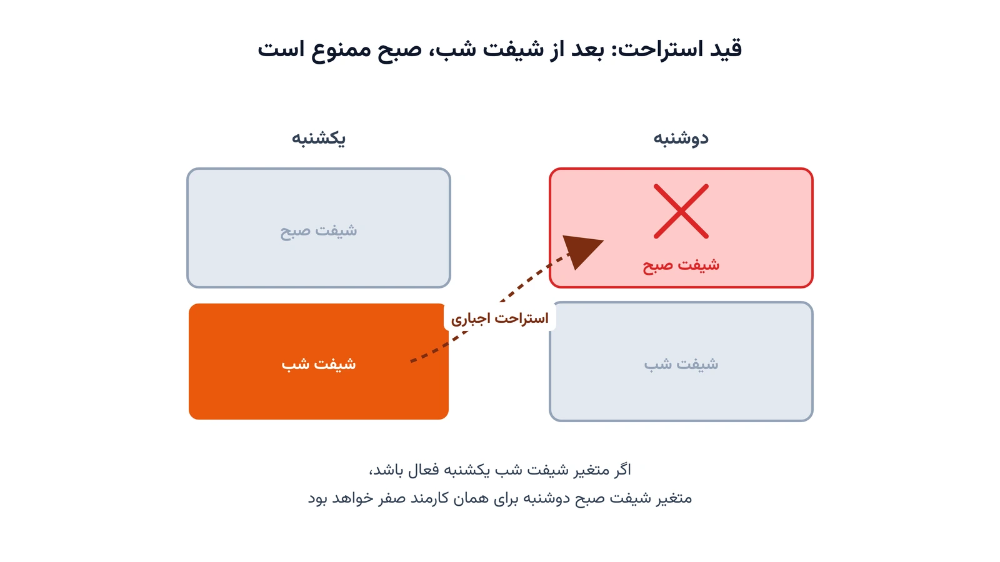

مدیر یک کلینیک کوچک هر یکشنبه صبح، حدود دو ساعت از وقتش را صرف چیدن جدول شیفت هفتهٔ بعد پرستارها می‌کرد. هر بار دست‌کم یک نفر با شیفت شب و صبح پشت سر هم مواجه می‌شد، بدون استراحت کافی بین آن دو. وقتی یکی از پرستارها برای روز تولدش درخواست مرخصی داد، مدیر کل جدول را از اول چید و باز هم یک نفر دیگر شاکی ماند.

این دقیقاً همان مسئله‌ای است که در تحقیق در عملیات به آن زمان‌بندی شیفت کارکنان یا Employee Scheduling می‌گویند؛ در ادبیات دانشگاهی و در بیمارستان‌ها اغلب با نام دقیق‌تر Nurse Rostering Problem هم شناخته می‌شود. خبر خوب این‌جاست: ماژول CP-SAT در OR-Tools می‌تواند چنین جدولی را در کسری از ثانیه و بدون خطای انسانی بچیند، آن هم با رعایت هم‌زمان چند قید واقعی: پوشش کافی هر شیفت، استراحت لازم بین شیفت شب و شیفت صبح روز بعد، و تا حد امکان برآورده‌کردن درخواست‌های مرخصی. این یکی از پرکاربردترین و پرجست‌وجوترین موضوعات در [آموزش OR-Tools](/ortools/) است، چون تقریباً هر کسب‌وکاری با کارکنان شیفتی، دیر یا زود با همین مسئله روبه‌رو می‌شود؛ از داروخانه و کلینیک گرفته تا مرکز تماس، فروشگاه زنجیره‌ای، انبار و خط تولید کارخانه.

تا همین چند سال پیش، بیشتر مدیران همین مسیر کلینیک بالا را طی می‌کردند: یک فایل اکسل، کمی حدس و آزمون‌وخطا، و در بهترین حالت یک فرمول ساده برای شمردن تعداد شیفت هر نفر. مشکل این روش این نیست که کند است؛ مشکل این است که وقتی تعداد کارکنان و قیود بیشتر می‌شود، تعداد حالت‌های ممکن به‌قدری زیاد می‌شود که هیچ انسانی نمی‌تواند مطمئن شود جدولش واقعاً بهترین حالت ممکن است، یا حتی همهٔ قیود قانونی را رعایت می‌کند.

## فرمول‌بندی ریاضی مسئله

فرض کنید مجموعه‌ای از کارکنان $E$، مجموعه‌ای از روزها $D$ در بازهٔ برنامه‌ریزی، و سه شیفت در هر روز داریم: صبح، عصر و شب؛ یعنی $S = \{m, e, n\}$. متغیر تصمیم دودویی $x_{k,d,s}$ برابر یک است اگر کارمند $k$ در روز $d$ شیفت $s$ را کار کند، و در غیر این صورت صفر است.

اولین قید، محدودکردن هر کارمند به حداکثر یک شیفت در روز است:

$$
\sum_{s \in S} x_{k,d,s} \le 1 \qquad \forall k \in E,\ d \in D
$$

قید دوم، پوشش نیروی لازم برای هر شیفت را تضمین می‌کند. اگر $r_{d,s}$ تعداد نفرات مورد نیاز در روز $d$ و شیفت $s$ باشد:

$$
\sum_{k \in E} x_{k,d,s} \ge r_{d,s} \qquad \forall d \in D,\ s \in S
$$

قید سوم، قلب واقع‌گرایانهٔ مدل است: هیچ کارمندی نباید شب کار کند و صبح روز بعد هم سر کار باشد. این قید را می‌توان به‌صورت یک نامعادلهٔ ساده نوشت:

$$
x_{k,d,n} + x_{k,d+1,m} \le 1 \qquad \forall k \in E,\ d \in D \setminus \{|D|\}
$$

در نهایت، برای رعایت عدالت، سقفی روی تعداد کل شیفت‌های هر کارمند در کل بازه می‌گذاریم تا بار کاری بین همه به‌طور نسبتاً یکنواخت تقسیم شود:

$$
\sum_{d \in D}\sum_{s \in S} x_{k,d,s} \le M \qquad \forall k \in E
$$

تابع هدف مدل، بیشینه‌کردن تعداد درخواست‌های مرخصی برآورده‌شده است. اگر $R$ مجموعهٔ سه‌تایی‌های (کارمند، روز، شیفت) باشد که آن کارمند برای مرخصی درخواست داده:

$$
\max \sum_{(k,d,s) \in R} \left(1 - x_{k,d,s}\right)
$$

نکتهٔ مهم این‌جاست که چرا نمی‌شود این مسئله را ساده با آزمون‌وخطا حل کرد. حتی برای یک تیم کوچک هشت‌نفره در یک بازهٔ دوهفته‌ای، تعداد حالت‌های ممکنِ تخصیص شیفت به کارکنان به‌سرعت به میلیون‌ها حالت می‌رسد؛ چون هر کارمند در هر روز چهار انتخاب دارد (سه شیفت یا مرخصی)، و این انتخاب‌ها برای همهٔ کارکنان و همهٔ روزها باید هم‌زمان با هم سازگار باشند. این دقیقاً همان ویژگی مسائل ترکیبیاتی (Combinatorial) است که جست‌وجوی کور را بی‌فایده و یک سالور هوشمند مثل CP-SAT را ضروری می‌کند.

## پیاده‌سازی

نکتهٔ خوب دربارهٔ این مدل این است که برای حل آن هیچ نیازی به سالور تجاری گران‌قیمتی نیست؛ کتابخانهٔ متن‌باز [OR-Tools](https://developers.google.com/optimization) گوگل و ماژول CP-SAT آن دقیقاً برای همین دسته از مسائل ترکیبیاتی گسسته ساخته شده‌اند. پیاده‌سازی با ساخت یک شیء `CpModel` شروع می‌شود؛ سپس برای هر سه‌تایی کارمند-روز-شیفت یک متغیر بولی با تابع `new_bool_var` تعریف می‌کنیم.

قید «حداکثر یک شیفت در روز» را می‌توان مستقیماً با تابع کمکی `add_at_most_one` نوشت، بدون این‌که خودمان نامعادله را دستی بسازیم. قید پوشش هر شیفت هم یک محدودیت خطی سادهٔ `model.add(sum(...) >= r)` است. اما قید جالب‌تر، قید استراحت بین شیفت شب و صبح روز بعد است؛ این قید را می‌توان با `add_implication` به شکل «اگر شیفت شب فعال بود، شیفت صبح روز بعد فعال نباشد» نوشت. این همان الگوی شرطی‌ای است که در OR-Tools معمولاً با `OnlyEnforceIf` هم دیده می‌شود و جایگزین تمیزتری برای فرمول‌بندی‌های سنتی Big-M است.

سقف تعداد شیفت هر کارمند هم یک محدودیت خطی روی مجموع متغیرهای همان کارمند است. تابع هدف با `model.maximize` تعریف می‌شود و روی مجموع متغیرهای مربوط به درخواست‌های مرخصی (به‌صورت نقیض‌شده) اعمال می‌گردد. برای حل مدل، یک شیء `CpSolver` ساخته و متد `solve` را روی مدل صدا می‌زنیم؛ برای مسائل بزرگ‌تر، تنظیم پارامتر `num_search_workers` روی چند هسته و سقف زمانی با `max_time_in_seconds` باعث می‌شود سالور از جست‌وجوی موازی هم بهره ببرد. اگر با مفاهیم پایهٔ CP-SAT در OR-Tools آشنا نیستید، یادداشت [حل همه جواب‌ها با OR-Tools](/notes/cp-intro/) نقطهٔ شروع خوبی پیش از این مدل است.

یک نکتهٔ عملی دیگر این است که تابع هدف همیشه لازم نیست فقط روی برآورده‌کردن درخواست مرخصی تمرکز کند. در پروژه‌های واقعی، گاهی هدف کمینه‌کردن هزینهٔ اضافه‌کاری است، گاهی بیشینه‌کردن رضایت کارکنان بر اساس شیفت‌های ترجیحی‌شان، و گاهی ترکیبی وزن‌دار از چند معیار با هم. ساختار قیود پایه (پوشش، استراحت، سقف عدالت) در همهٔ این حالت‌ها ثابت می‌ماند و فقط تابع هدف عوض می‌شود؛ همین ماژولار بودن مدل، یکی از دلایل محبوبیت CP-SAT برای این خانواده از مسائل است.

## نتیجه

برای آزمایش این مدل، یک سناریوی واقعی‌نما ساختیم: هشت کارمند، یک بازهٔ دوهفته‌ای (۱۴ روز)، و سه شیفت در روز. نیاز نیروی هر شیفت در روزهای هفته با آخر هفته فرق دارد؛ روزهای کاری به سه، دو و یک نفر در شیفت صبح، عصر و شب نیاز دارند، و در تعطیلات آخر هفته این عدد کمی پایین‌تر است. هشت درخواست مرخصی پراکنده هم در طول این بازه ثبت شده بود.

با اجرای واقعی این مدل روی OR-Tools نسخهٔ ۹.۱۵، سالور CP-SAT در حدود ۰.۰۲ ثانیه به جواب بهینه (OPTIMAL) رسید؛ یعنی عملاً آنی. هر هشت درخواست مرخصی به‌طور کامل برآورده شدند و در مجموع ۷۸ خانه از جدول شیفت (از میان ۱۴ روز و سه شیفت) پر شد. جالب‌تر این‌که توزیع بار کاری هم متعادل درآمد: کم‌کارترین کارمند نه شیفت و پرکارترین ده شیفت در کل بازهٔ دوهفته‌ای داشت، بدون این‌که تابع هدف مستقیماً روی این تعادل تمرکز کرده باشد؛ سقف تعداد شیفت به‌تنهایی برای این توازن کافی بود.

نکتهٔ آموزنده این‌جاست: قید سادهٔ استراحت بین شب و صبح، به‌تنهایی توانست از خستگی انباشته جلوگیری کند، بدون این‌که مدل را پیچیده‌تر کند. این همان تعادلی است که در بیشتر مسائل زمان‌بندی نیروی کار واقعی دنبال می‌شود: قیود ساده و قابل‌فهم، به‌جای فرمول‌بندی‌های سنگین و کند.

سرعت حل این مدل هم نکتهٔ قابل‌توجهی است. حتی اگر تعداد کارکنان را به بیست یا سی نفر و بازهٔ زمانی را به یک ماه کامل افزایش دهیم، فضای جست‌وجو بسیار بزرگ‌تر می‌شود، اما CP-SAT همچنان معمولاً در عرض چند ثانیه به جواب بهینه یا نزدیک به بهینه می‌رسد؛ چون ساختار قیود (پوشش، استراحت، سقف شیفت) کاملاً محلی و قابل انتشار سریع در فرایند جست‌وجوی محدودیت است. این یعنی همان مدل، بدون تغییر ساختاری، برای یک فروشگاه ده‌نفره یا یک مرکز تماس صدنفره هم قابل استفاده است؛ فقط داده‌های ورودی (تعداد کارکنان، نیاز هر شیفت، درخواست‌ها) عوض می‌شوند.

## اشتباهات رایج

اولین اشتباه رایج، فراموش‌کردن قید «حداکثر یک شیفت در روز» است. بدون این قید، سالور می‌تواند به یک کارمند هم‌زمان دو یا سه شیفت در یک روز بدهد، چون از نگاه ریاضی مدل هیچ منعی برای آن وجود ندارد.

دومین اشتباه، فرمول‌بندی قید استراحت با روش‌های سنگین Big-M به‌جای `add_implication` یا `OnlyEnforceIf` است. فرمول‌بندی Big-M نه‌تنها خواناتر نیست، بلکه اگر مقدار M درست انتخاب نشود، می‌تواند سرعت حل را به‌شدت کاهش دهد یا حتی به جواب نادرست منجر شود.

سومین اشتباه، ناسازگاری بین نیاز نیروی تعریف‌شده و تعداد واقعی کارکنان است؛ مثلاً وقتی نیاز هر شیفت جمعاً بیشتر از ظرفیت واقعی تیم باشد، مدل هیچ جواب موجهی پیدا نمی‌کند و سالور وضعیت INFEASIBLE برمی‌گرداند. اگر به چنین وضعیتی برخوردید، یادداشت [راهنمای عیب‌یابی مدل غیرقابل‌اجرا](/notes/infeasible-model-diagnosis/) مسیر عیب‌یابی قدم‌به‌قدم را نشان می‌دهد.

چهارمین اشتباه، نادیده‌گرفتن عدالت در تابع هدف است. اگر تابع هدف فقط روی یک معیار مثل تعداد درخواست‌های برآورده‌شده تمرکز کند و هیچ سقفی روی تعداد شیفت هر کارمند نباشد، سالور ممکن است بار کاری را به‌شدت نامتوازن بین کارکنان توزیع کند؛ دقیقاً همان مشکلی که در [زمان‌بندی خدمهٔ پرواز](/notes/crew-pairing-problem/) هم با رویکردی مشابه حل می‌شود.

## تمرین برای خواننده

این مدل را کمی واقعی‌تر کنید: قیدی اضافه کنید که هیچ کارمندی بیش از سه روز کاری متوالی نداشته باشد، و هر کارمند دست‌کم یک روز تعطیل کامل در هر هفته داشته باشد. این دقیقاً همان محدودیتی است که در بسیاری از قوانین کار واقعی هم وجود دارد.

اگر مدل خودتان را نوشتید یا حتی فقط ایده‌تان برای فرمول‌بندی این قید جدید را دارید، برایمان در تلگرام به آیدی @pypyid بفرستید؛ خوشحال می‌شویم جواب‌های مختلف خوانندگان را ببینیم و بهترین‌ها را در به‌روزرسانی‌های بعدی همین یادداشت معرفی کنیم.

## سوالات متداول

<h3>تفاوت این مسئله با زمان‌بندی خدمهٔ پرواز (Crew Pairing) چیست؟</h3>

در زمان‌بندی شیفت کارکنان، واحد اصلی تصمیم یک شیفت ثابت در یک مکان است، مثل صبح یا شب در یک کلینیک. در <a href="/notes/crew-pairing-problem/">زمان‌بندی خدمهٔ پرواز</a>، واحد تصمیم یک زنجیرهٔ چندروزهٔ پرواز در چند شهر مختلف است. ساختار ریاضی هر دو مسئله پوشش/تخصیص است، اما مقیاس و پیچیدگی جغرافیایی آن‌ها متفاوت است.

<h3>آیا CP-SAT برای صدها کارمند و افق یک‌سالهٔ کامل هم مناسب است؟</h3>

برای مقیاس‌های بزرگ‌تر، معمولاً بهتر است بازهٔ برنامه‌ریزی به قطعات کوچک‌تر (مثلاً ماهانه) تقسیم شود و جواب هر قطعه به قطعهٔ بعدی منتقل شود. تنظیم درست پارامترهایی مثل تعداد Worker موازی سالور هم در این مقیاس‌ها تأثیر زیادی روی سرعت حل دارد.

<h3>برای یادگیری این نوع مدل‌سازی از کجا شروع کنم؟</h3>

دورهٔ <a href="/courses/vrp-python/" style="color:#2563EB; font-weight:bold;">مسیریابی و بهینه‌سازی با پایتون</a> از همان مفاهیم پایهٔ متغیر تصمیم، تابع هدف و قید شروع می‌کند و در طول ۲۰ پروژهٔ عملی با OR-Tools و CP-SAT، از جمله پروژه‌ای در همین حال‌وهوای برنامه‌ریزی تقویم، مهارت مدل‌سازی مسائل تخصیص و زمان‌بندی از این جنس را می‌سازد.

<h3>آیا این مدل درخواست‌های مرخصی متناقض را هم مدیریت می‌کند؟</h3>

بله، چون تابع هدف فقط تلاش می‌کند تا حد ممکن درخواست‌ها را برآورده کند، نه این‌که همهٔ آن‌ها را قید سخت (Hard Constraint) بگیرد. اگر دو درخواست با هم در تضاد باشند یا با قید پوشش شیفت ناسازگار شوند، مدل هم‌چنان جواب موجه می‌دهد و فقط برخی درخواست‌ها را نادیده می‌گیرد.

