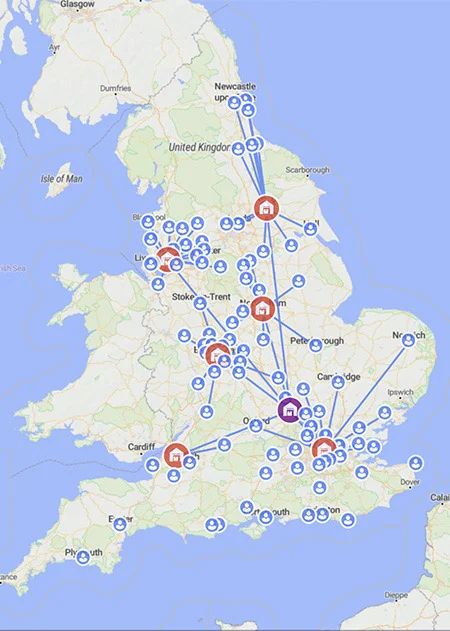

فرض کنید مدیر زنجیره تأمین شرکت دنت فرانسه (Danone France) هستید و باید تصمیم بگیرید انبارهای منطقه‌ای‌تان را کجا بسازید. ده‌ها شهر کاندید برای احداث انبار دارید، هر کدام با هزینه ساخت و نگهداری متفاوت، و صدها فروشگاه در سراسر کشور که باید هر روز از یکی از این انبارها کالا دریافت کنند.

اگر انبار کم بسازید، هزینه حمل‌ونقل روزانه به فروشگاه‌های دور سرسام‌آور می‌شود؛ اگر هم در هر شهر انبار بزنید، هزینه ثابت ساخت و نگهداری چند برابر می‌شود بدون این‌که لزوماً صرفه‌ای در حمل‌ونقل ایجاد شود.

این کشمکش بین «هزینه ثابت باز کردن یک تسهیلات» و «هزینه متغیر حمل کالا تا مشتری»، دقیقاً همان چیزی است که در ادبیات تحقیق در عملیات به آن مسئله مکان‌یابی تسهیلات یا Facility Location Problem می‌گویند.



این مسئله شاید در نگاه اول ساده به‌نظر برسد -- فقط باید چند نقطه روی نقشه انتخاب کنید -- اما وقتی تعداد مکان‌های کاندید و تعداد مشتریان زیاد می‌شود، تعداد حالت‌های ممکن به‌سرعت انفجاری رشد می‌کند. برای بیست مکان کاندید، بیش از یک میلیون زیرمجموعه ممکن برای باز یا بسته بودن انبارها وجود دارد، و برای هر زیرمجموعه هم باید بهترین تخصیص مشتریان به انبارهای باز را پیدا کرد. به همین دلیل، مکان‌یابی تسهیلات یکی از مسائل کلاسیک و در عین حال هنوز چالش‌برانگیز در طراحی شبکه زنجیره تأمین است.

## فرمول‌بندی ریاضی مسئله

نسخه استاندارد و پرکاربرد این مسئله، مکان‌یابی تسهیلات ظرفیت‌دار (Capacitated Facility Location) نام دارد. فرض کنید مجموعه‌ای از مشتریان $I$ با تقاضای مشخص $d_i$ داریم و مجموعه‌ای از مکان‌های کاندید برای انبار $J$، که هر کدام هزینه ثابت $f_j$ برای باز شدن و ظرفیت حداکثری $Q_j$ دارند. متغیر دودویی $y_j$ نشان می‌دهد آیا انبار $j$ باز می‌شود یا نه، و متغیر پیوسته $x_{ij}$ میزان کالایی است که از انبار $j$ به مشتری $i$ ارسال می‌شود. هزینه حمل هر واحد کالا از $j$ به $i$ را هم با $c_{ij}$ نشان می‌دهیم. مسئله را می‌توان این‌طور نوشت:

$$
\min \; \sum_{j \in J} f_j y_j + \sum_{i \in I} \sum_{j \in J} c_{ij} x_{ij}
$$

با محدودیت‌های زیر:

$$
\sum_{j \in J} x_{ij} = d_i \quad \forall i \in I
$$

$$
\sum_{i \in I} x_{ij} \leq Q_j y_j \quad \forall j \in J
$$

$$
x_{ij} \geq 0, \quad y_j \in \{0, 1\}
$$

محدودیت اول تضمین می‌کند تقاضای هر مشتری کامل تأمین شود، و محدودیت دوم دو کار هم‌زمان انجام می‌دهد: هم سقف ظرفیت هر انبار را رعایت می‌کند و هم اگر انبار $j$ اصلاً باز نشده باشد ($y_j = 0$)، اجازه نمی‌دهد هیچ کالایی از آن ارسال شود. همین برهم‌کنش بین متغیرهای دودویی (تصمیم باز کردن) و متغیرهای پیوسته (تصمیم تخصیص) است که مسئله را از یک برنامه‌ریزی خطی ساده به یک مسئله برنامه‌ریزی خطی عدد صحیح مختلط (MILP) و از نظر محاسباتی سخت‌تر تبدیل می‌کند.

## چرا این موضوع مهم است

طراحی شبکه انبارها و مراکز توزیع یکی از تصمیم‌های استراتژیک هر شرکتی است که مستقیم روی هزینه‌های عملیاتی سال‌های آینده اثر می‌گذارد؛ برخلاف تصمیمات روزانه مثل زمان‌بندی حمل، این تصمیمات معمولاً برای چند سال ثابت می‌مانند و اشتباه در آن‌ها به‌سادگی قابل جبران نیست. شرکت‌های بزرگ پخش، زنجیره‌های فروشگاهی، و حتی شرکت‌های تجارت الکترونیک که باید انبارهای تحویل سریع (Fulfillment Center) نزدیک مشتریان داشته باشند، هر چند سال یک‌بار همین مسئله را از نو حل می‌کنند تا با تغییر الگوی تقاضا و رشد بازار همگام بمانند.

جالب است بدانید همین چارچوب ریاضی، فراتر از انبار و کالا هم کاربرد دارد: مکان‌یابی ایستگاه‌های شارژ خودروهای برقی، مکان‌یابی بیمارستان‌ها و مراکز اورژانس، تعیین محل بهینه دکل‌های مخابراتی، و حتی مکان‌یابی مراکز داده در شبکه‌های ابری، همگی نسخه‌های متفاوتی از همین مسئله مکان‌یابی تسهیلات هستند. این تنوع کاربرد باعث شده مکان‌یابی تسهیلات یکی از پرکاربردترین مدل‌های تحقیق در عملیات در صنعت باقی بماند.

## ظرفیت پژوهشی و آکادمیک

مکان‌یابی تسهیلات یکی از قدیمی‌ترین مسائل تحقیق در عملیات است، اما همچنان زمینه فعالی برای پژوهش محسوب می‌شود، چون نسخه‌های واقعی‌تر آن هنوز به‌طور کامل حل‌نشده باقی مانده‌اند. مکان‌یابی چند سطحی (Multi-Echelon Facility Location) که در آن باید هم‌زمان محل کارخانه، انبار مرکزی، و مرکز توزیع منطقه‌ای تعیین شود، مکان‌یابی پویا (Dynamic Facility Location) که تصمیم‌ها را در طول چند دوره زمانی مدل می‌کند، و مکان‌یابی مقاوم (Robust Facility Location) که عدم‌قطعیت در تقاضای آینده یا هزینه‌های حمل را لحاظ می‌کند، هر کدام موضوعاتی جدی برای پایان‌نامه یا مقاله علمی هستند.

مسیر پژوهشی دیگری که این روزها بسیار مورد توجه است، ترکیب مکان‌یابی تسهیلات با مسائل مسیریابی وسایل نقلیه است؛ یعنی هم‌زمان تصمیم بگیریم انبار را کجا بسازیم و چطور از آن به مشتریان سرویس بدهیم (این ترکیب را Location-Routing Problem می‌نامند). اگر بعد از تعیین محل انبارها، زمان دقیق تحویل کالا هم برایتان مهم است، یادداشت [مسیریابی وابسته به زمان](/notes/time-dependent-vrp/) نگاه دقیق‌تری به این بُعد از مسئله دارد. برای دانشجویانی که به دنبال موضوعی با ریشه ریاضی محکم، کاربرد صنعتی روشن، و امکان استفاده از داده‌های واقعی جغرافیایی هستند، این حوزه گزینه بسیار غنی‌ای است.

## پیاده‌سازی با پایتون

مسئله مکان‌یابی تسهیلات معمولاً با برنامه‌ریزی خطی عدد صحیح مختلط (MILP) حل می‌شود، اما همین مسئله را می‌توان با رویکرد برنامه‌ریزی محدودیت (Constraint Programming) هم مدل‌سازی کرد؛ رویکردی که برای مسائل ترکیبیاتی با محدودیت‌های منطقی و غیرخطی، گاهی مدل‌سازی ساده‌تر و شهودی‌تری ارائه می‌دهد (نمونه دیگری از این رویکرد را می‌توانید در یادداشت [زمان‌بندی کارگاهی با CP-SAT](/notes/job-shop-scheduling-cp-sat/) ببینید). کتابخانه متن‌باز [OR-Tools](https://developers.google.com/optimization) گوگل و سالور [CP-SAT](https://developers.google.com/optimization/cp/cp_solver) آن، یکی از قوی‌ترین ابزارهای رایگان برای این کار است. اگر تحلیل شبکه توزیع بعد از حل مسئله هم مدنظرتان است (مثلاً بررسی طول مسیرهای تخصیص‌یافته یا رسم گراف شبکه)، کتابخانه [NetworkX](https://networkx.org/) ابزار خوبی برای این کار است.

برای این‌که موضوع ملموس شود، مثالی کوچک از شرکت دنت فرانسه می‌سازیم: این شرکت سه شهر کاندید برای احداث انبار در فرانسه دارد (پاریس، لیون و مارسی) و باید به چهار شهر مشتری (لیل، تولوز، نیس و استراسبورگ) کالا برساند. جدول زیر هزینه ثابت و ظرفیت هر انبار کاندید و هزینه حمل هر واحد کالا از هر انبار به هر مشتری را نشان می‌دهد:

| candidate_warehouse | fixed_cost | capacity |
|---|---|---|
| Paris | 5000 | 800 |
| Lyon | 3500 | 500 |
| Marseille | 4000 | 600 |

| customer | demand |
|---|---|
| Lille | 300 |
| Toulouse | 250 |
| Nice | 200 |
| Strasbourg | 150 |

کد زیر با [OR-Tools CP-SAT](https://developers.google.com/optimization/cp/cp_solver) این مسئله را مدل‌سازی و حل می‌کند تا مشخص شود کدام انبارها باید باز شوند و هر مشتری از کدام انبار سرویس بگیرد. چون CP-SAT با اعداد صحیح کار می‌کند، هزینه حمل واحد کالا را به‌جای متغیر پیوسته، به‌صورت مقدار صحیح تخصیص‌یافته به هر مشتری مدل می‌کنیم:

```python
from ortools.sat.python import cp_model

warehouses = {"Paris": (5000, 800), "Lyon": (3500, 500), "Marseille": (4000, 600)}
customers = {"Lille": 300, "Toulouse": 250, "Nice": 200, "Strasbourg": 150}

# هزینه حمل هر واحد کالا از هر انبار به هر مشتری
cost = {
    ("Paris", "Lille"): 2, ("Paris", "Toulouse"): 6, ("Paris", "Nice"): 8, ("Paris", "Strasbourg"): 4,
    ("Lyon", "Lille"): 7, ("Lyon", "Toulouse"): 4, ("Lyon", "Nice"): 3, ("Lyon", "Strasbourg"): 6,
    ("Marseille", "Lille"): 9, ("Marseille", "Toulouse"): 3, ("Marseille", "Nice"): 2, ("Marseille", "Strasbourg"): 8,
}

model = cp_model.CpModel()

# y[w] = ۱ اگر انبار w باز شود
y = {w: model.NewBoolVar(f"open_{w}") for w in warehouses}
# x[w, c] = میزان کالای ارسالی از انبار w به مشتری c
x = {
    (w, c): model.NewIntVar(0, min(warehouses[w][1], customers[c]), f"ship_{w}_{c}")
    for w in warehouses for c in customers
}

# تقاضای هر مشتری باید کامل تأمین شود
for c, d in customers.items():
    model.Add(sum(x[w, c] for w in warehouses) == d)

# ظرفیت هر انبار، و ارسال کالا فقط از انبارهای باز
for w in warehouses:
    model.Add(sum(x[w, c] for c in customers) <= warehouses[w][1]).OnlyEnforceIf(y[w])
    model.Add(sum(x[w, c] for c in customers) == 0).OnlyEnforceIf(y[w].Not())

# تابع هدف: هزینه ثابت باز کردن انبارها + هزینه حمل کالا
model.Minimize(
    sum(warehouses[w][0] * y[w] for w in warehouses)
    + sum(cost[w, c] * x[w, c] for w in warehouses for c in customers)
)

solver = cp_model.CpSolver()
status = solver.Solve(model)

if status in (cp_model.OPTIMAL, cp_model.FEASIBLE):
    for w in warehouses:
        if solver.Value(y[w]) == 1:
            print(f"انبار {w} باز می‌شود.")
```

با اجرای این کد، سالور [CP-SAT](https://developers.google.com/optimization/cp/cp_solver) در کسری از ثانیه بهترین ترکیب از انبارهای باز و تخصیص مشتریان را پیدا می‌کند؛ همان تصمیمی که در دنیای واقعی می‌تواند میلیون‌ها یورو در هزینه‌های سالانه شرکتی مثل دنت فرانسه صرفه‌جویی کند.

> **نکته:** اگر می‌خواهید همین مدل را با رویکرد برنامه‌ریزی خطی عدد صحیح (MILP) هم ببینید، می‌توانید از کتابخانه [PuLP](https://coin-or.github.io/pulp/) و سالور [CBC](https://github.com/coin-or/Cbc) استفاده کنید؛ منطق مدل یکسان است، فقط نحوه تعریف متغیرها و محدودیت‌ها در چارچوب برنامه‌ریزی محدودیت کمی متفاوت می‌شود.

اگر همین حالا حس می‌کنید مدل‌سازی با CP-SAT و برنامه‌ریزی محدودیت برایتان جذاب است، دوره <a href="/courses/vrp-python/" style="color:#2563EB; font-weight:bold;">مسیریابی و بهینه‌سازی با پایتون</a> دقیقاً همین رویکرد را از پایه آموزش می‌دهد و می‌تواند نقطه شروع خوبی برای تسلط روی این نوع مسائل شبکه‌ای در زنجیره تأمین باشد.

## سوالات متداول

<h3>مکان‌یابی تسهیلات با مسیریابی وسایل نقلیه چه فرقی دارد؟</h3>
<p>مکان‌یابی تسهیلات درباره تصمیم استراتژیک «کجا انبار بسازیم» است، در حالی‌که مسیریابی وسایل نقلیه (VRP) درباره تصمیم عملیاتی «چطور با وسایل نقلیه موجود به مشتریان سرویس بدهیم» است. در عمل این دو مسئله اغلب به هم وابسته‌اند و گاهی به‌صورت ترکیبی (Location-Routing) هم مدل می‌شوند.</p>

<h3>آیا این مساله را بجای دنت می توان برای کشکسابی آرمین و شرکا هم حل کرد؟</h3>
<p>مکان‌یابی تسهیلات بیان شده در این یادداشت به نام شرکت وابسته نیست. چنانچه بیزینس مورد نظر شما قید خاصی به مساله اضافه میکند باید آن را به صورت ریاضی بیان کنید و به مدل اضافه نمایید.</p>

<h3>برای یادگیری مدل‌سازی این نوع مسائل با پایتون از کجا شروع کنم؟</h3>
<p>اگر با مفاهیم پایه برنامه‌ریزی محدودیت (Constraint Programming) و مدل‌سازی مسائل شبکه‌ای در پایتون آشنا شوید، مدل‌سازی مکان‌یابی تسهیلات بسیار ساده خواهد بود. دوره <a href="/courses/vrp-python/" style="color:#2563EB; font-weight:bold;">مسیریابی و بهینه‌سازی با پایتون</a> پایه محکمی برای کار با این نوع مسائل شبکه‌ای زنجیره تأمین فراهم می‌کند.</p>

<h3>آیا این مدل برای شرکت‌های کوچک هم به‌صرفه است؟</h3>
<p>بله. چون ابزارهایی مثل <a href="https://developers.google.com/optimization">OR-Tools</a> و سالور CP-SAT آن، یا در رویکرد جایگزین <a href="https://coin-or.github.io/pulp/">PuLP</a> و <a href="https://github.com/coin-or/Cbc">CBC</a> کاملاً رایگان و متن‌باز هستند، حتی یک شرکت پخش کوچک با چند شهر کاندید هم می‌تواند بدون هزینه لایسنس، تصمیم مکان‌یابی خودش را با دقت ریاضی بگیرد. اگر برای پیاده‌سازی این مدل روی داده واقعی کسب‌وکارتان به راهنمایی نیاز دارید، می‌توانید از طریق صفحه <a href="/consultation/" style="color:#2563EB; font-weight:bold;">مشاوره</a> با ما در ارتباط باشید.</p>