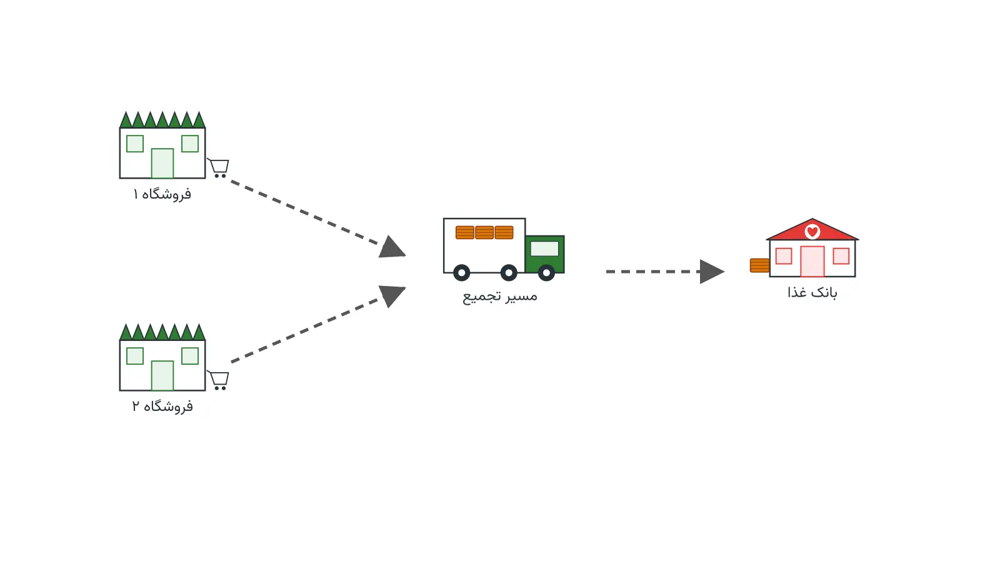

هر روز در فروشگاه‌های بزرگ، مقدار زیادی غذای سالم کنار گذاشته می‌شود. دلیلش نزدیک شدن به تاریخ انقضا است. این غذا هنوز قابل‌خوردن است. اما اگر دیر برسد، فاسد می‌شود. مسئله این است: کدام فروشگاه، به کدام بانک غذا، با کدام کامیون، و در چه ساعتی؟ این سؤال ساده، یک مسئله‌ی ترکیبیاتی واقعی در حمل‌ونقل و لجستیک بشردوستانه است. جواب درست آن می‌تواند هم زباله را کم کند، هم گرسنگی را.

نام رایج این مسئله در پژوهش‌های لجستیک «مسئله نجات غذا» است. این مسئله ترکیبی از دو مسئله‌ی شناخته‌شده است. یکی مسیریابی وسایل نقلیه با پنجره‌ی زمانی است. دیگری تخصیص عرضه به تقاضا زیر قید فسادپذیری است. فروشگاه‌ها و رستوران‌ها نقش «مبدأ عرضه» دارند. بانک‌های غذا و پناهگاه‌ها نقش «مقصد تقاضا» دارند. تفاوت اصلی با توزیع عادی کالا، فوریت زمانی شدید محصول است.

## اهمیت این موضوع

طبق برآورد سازمان خواربار جهانی، نزدیک به یک‌سوم غذای تولیدشده در جهان هرگز خورده نمی‌شود. بخش بزرگی از این دورریز، در سطح خرده‌فروشی و توزیع رخ می‌دهد. این اتفاق در مزرعه نمی‌افتد. هم‌زمان، میلیون‌ها نفر در همان شهرها به غذای کافی دسترسی ندارند. این دوگانگی، یک فرصت واضح برای بهینه‌سازی لجستیک است.

برخی کشورها این موضوع را به قانون تبدیل کرده‌اند. برای نمونه، فرانسه از سال ۲۰۱۶ فروشگاه‌های بزرگ را موظف کرده است. این فروشگاه‌ها نباید مازاد غذای سالم را دور بریزند. باید آن را به خیریه‌ها اهدا کنند. شرکتی مثل کارفور در فرانسه دقیقاً با چنین الزامی روبه‌رو است. باید هر روز مازاد صدها شعبه را جمع کند. سپس باید آن را به ده‌ها خیریه برساند، پیش از فاسد شدن. بدون یک برنامه‌ی مسیریابی هوشمند، بخش زیادی از این غذای اهدایی عملاً دیر می‌رسد.

از منظر زنجیره تأمین سبز هم این مسئله مهم است. کاهش دورریز غذا، به‌طور غیرمستقیم انتشار گازهای گلخانه‌ای را هم کم می‌کند. تولید غذای دورریخته‌شده، آب و انرژی و زمین مصرف کرده است. وقتی این غذا دور ریخته می‌شود، همه‌ی آن منابع هم هدر رفته‌اند. پس بهینه‌سازی این شبکه، هم یک مسئله‌ی اجتماعی است و هم یک مسئله‌ی زیست‌محیطی.

## فرمول‌بندی ریاضی

مسئله‌ی نجات غذا را می‌توان به‌صورت یک مسئله‌ی تخصیص-مسیریابی دوهدفه مدل کرد. فرض کنید $i$ نشان‌دهنده‌ی فروشگاه‌های اهداکننده باشد. $j$ هم نشان‌دهنده‌ی بانک‌های غذای گیرنده باشد. متغیر $x_{ijk}$ برابر یک است، اگر وسیله‌ی نقلیه‌ی $k$ از فروشگاه $i$ به بانک غذای $j$ برود. در غیر این صورت، مقدار آن صفر است. هر فروشگاه، یک پنجره‌ی زمانی برداشت دارد. هر بانک غذا هم یک پنجره‌ی زمانی تحویل دارد. تابع هدف، هزینه‌ی حمل و جریمه‌ی غذای نجات‌نیافته را با هم کمینه می‌کند.

$$\min \sum_{i,j,k} c_{ij} x_{ijk} + \lambda \sum_{i} w_i \left(1 - \sum_{j,k} x_{ijk}\right)$$

در این رابطه، $c_{ij}$ هزینه‌ی سفر بین فروشگاه و بانک غذا است. $w_i$ هم وزن یا اهمیت غذای برداشت‌نشده از فروشگاه $i$ است. جمله‌ی دوم، جریمه‌ی «غذای نجات‌نیافته» را نشان می‌دهد. قید زیر، رسیدن هر وسیله به مقصد را درون پنجره‌ی زمانی تضمین می‌کند.

$$a_j \le \sum_{i,k} t_{ij} \, x_{ijk} \le b_j \quad \forall j$$

در این قید، $t_{ij}$ زمان رسیدن از فروشگاه $i$ به بانک غذا $j$ است. $a_j$ و $b_j$ هم کران پایین و بالای پنجره‌ی زمانی مجازند. این ساختار، دقیقاً همان مسئله‌ی مسیریابی با پنجره‌ی زمانی است. تفاوت فقط در این است که «تقاضا» هم عمر محدود دارد.

## ظرفیت کار آکادمیک و پژوهشی

مسئله‌ی نجات غذا، نسبتاً جوان‌تر از مسئله‌ی کلاسیک مسیریابی است. این موضوع هنوز جای رشد پژوهشی زیادی دارد. چند مسیر پژوهشی باز در این حوزه وجود دارد. یکی، مدل‌سازی عدم‌قطعیت در حجم و زمان تولید مازاد غذا است. مازاد هر فروشگاه، هر روز با روز قبل فرق دارد.

مسیر دیگر، طراحی شبکه‌ی چندهدفه است. این شبکه باید هزینه، عدالت توزیع بین مناطق، و اثر کربن را هم‌زمان در نظر بگیرد. مسیر سوم، تلفیق تصمیم مسیریابی با تصمیم انبارش موقت است. گاهی یک انبار میانی سرد، نجات غذای بیشتری را ممکن می‌کند. این سه مسیر، گزینه‌های خوبی برای پایان‌نامه یا مقاله‌اند.

از نظر روش حل هم جای کار هست. بیشتر پژوهش‌های موجود از فراابتکاری‌ها استفاده می‌کنند. اما مدل‌های دقیق مبتنی بر برنامه‌ریزی محدودیت، کمتر بررسی شده‌اند. ترکیب یادگیری ماشین برای پیش‌بینی حجم مازاد با بهینه‌سازی مسیریابی، یک جهت پژوهشی تازه است. این ترکیب، پتانسیل خوبی برای انتشار مقاله دارد.

## پیاده‌سازی با پایتون

خبر خوب این است که این مسئله را می‌توان با ابزارهای متن‌باز و رایگان پایتون حل کرد. نیازی به نرم‌افزار یا سالور تجاری گران‌قیمت نیست. برای بخش مسیریابی با پنجره‌ی زمانی، ماژول CP-SAT از [OR-Tools](https://developers.google.com/optimization) گزینه‌ی مناسبی است. این ماژول برای مسائل برنامه‌ریزی محدودیت ترکیبیاتی طراحی شده است.

برای نمایش شبکه‌ی فروشگاه‌ها و بانک‌های غذا، کتابخانه‌ی [NetworkX](https://networkx.org/) مفید است. می‌توان فاصله و زمان سفر بین گره‌ها را روی یک گراف وزن‌دار نگه داشت. داده‌های ورودی را می‌توان از یک فایل اکسل یا CSV خواند. این فایل باید شامل ستون‌های مبدأ، مقصد، ظرفیت، و پنجره‌ی زمانی باشد.

مدل CP-SAT برای هر وسیله‌ی نقلیه، یک توالی از بازدیدها می‌سازد. سالور باید هم ترتیب بازدید را تعیین کند، هم تخصیص فروشگاه به کامیون را. محدودیت پنجره‌ی زمانی، به‌سادگی یک قید نامساوی خطی روی زمان ورود است. در مسائل بزرگ‌تر، سالورهای MILP مثل [HiGHS](https://highs.dev/) هم گزینه‌ی خوبی برای نسخه‌ی ساده‌شده‌ی تخصیص هستند. اجرای چندباره‌ی مدل با سناریوهای مختلف مازاد، دید خوبی از پایداری برنامه می‌دهد.

برای آشنایی بیشتر با مدل‌سازی این خانواده از مسائل، دوره‌ی [مسیریابی وسایل نقلیه با پایتون](/courses/vrp-python/) می‌تواند کمک کند. این دوره همین ابزارها را روی چند مسئله‌ی واقعی تمرین می‌دهد.

## سوالات متداول

<h3>آیا این مدل فقط برای فروشگاه‌های بزرگ کاربرد دارد؟</h3>

نه. همین مدل برای رستوران‌ها، نانوایی‌ها، و حتی تولیدکنندگان لبنیات هم کاربرد دارد. هر جا مازاد فسادپذیر و مقصد خیریه وجود داشته باشد، این چارچوب مسیریابی کار می‌کند.

<h3>چه دوره‌ای بیشترین کمک را برای یادگیری این مدل‌سازی می‌کند؟</h3>

دوره‌ی <a href="/courses/vrp-python/" style="color:#2563EB; font-weight:bold;">مسیریابی وسایل نقلیه با پایتون</a> دقیقاً پایه‌ی مدل‌سازی این خانواده از مسائل مسیریابی و پنجره‌ی زمانی را آموزش می‌دهد.

<h3>اگر داده‌های واقعی شهرمان با این مدل استاندارد فرق داشته باشد چه؟</h3>

هر شبکه‌ی توزیع واقعی، قیدهای خاص خودش را دارد. برای پیاده‌سازی اختصاصی روی داده‌های واقعی‌تان، گرفتن <a href="/consultation/" style="color:#2563EB; font-weight:bold;">مشاوره</a> مسیر سریع‌تری است.

