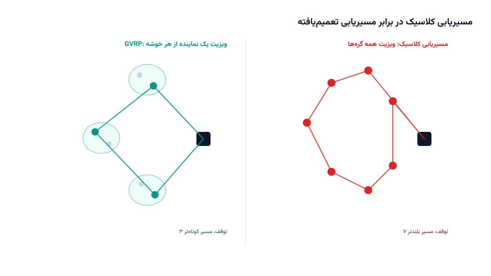

فرض کنید گره‌های یک شبکه، به‌جای اینکه هرکدام مستقل باشند، در گروه‌هایی کنار هم چیده شده‌اند. هر گروه را یک خوشه می‌نامیم. قانون بازی این است: کافی است از هر خوشه فقط یک گره را ویزیت کنید. باقی گره‌های همان خوشه را می‌توانید نادیده بگیرید. به این مسئله، مسیریابی تعمیم‌یافته وسایل نقلیه یا GVRP می‌گویند. این تعریف کاملاً کلی است و ربطی به یک صنعت خاص ندارد.

نکته کلیدی GVRP همین انتخاب است. در مسیریابی کلاسیک، همه مشتریان باید دیده شوند. در GVRP، مشتریان درون یک خوشه معادل هم فرض می‌شوند. رسیدن به هرکدام، نیاز کل خوشه را برطرف می‌کند. این فرض ساده، دنیایی از کاربردهای متفاوت را باز می‌کند.

## چه مسائلی می‌توانند GVRP باشند؟

فهرست کاربردهای GVRP شگفت‌انگیز است، چون هر جا «انتخاب از میان چند گزینه معادل» وجود دارد، این مدل مناسب است. در توزیع دارو و واکسن، یک منطقه درمانی از چند شهر تشکیل شده است. تحویل به یک شهر از آن منطقه، کل منطقه را پوشش می‌دهد. دوره [بهینه‌سازی سیستم‌های سلامت با پایتون](/courses/health-opt/) دقیقاً چنین مسائل توزیع و پوشش منطقه‌ای را در حوزه سلامت بررسی می‌کند.

در جمع‌آوری پسماند شهری، هر بلوک از شهر چند نقطه جمع‌آوری دارد. سرویس یک نقطه، معمولاً کل بلوک را پوشش می‌دهد. در تحویل بسته پستی هم مشابه است. مشتری چند مکان یا صندوق تحویل معرفی می‌کند. رساندن بسته به یکی از آن‌ها کافی است. شرکتی مثل آمازون که از صندوق‌های تحویل (Amazon Locker) در شهرهای مختلف استفاده می‌کند، دقیقاً با چنین انعطافی در مسیریابی مواجه است. کاربردهای دیگر شامل انتخاب یک ایستگاه اتوبوس مدرسه از میان چند نقطه ممکن هستند. حتی برنامه‌ریزی نظامی برای هدف قرار دادن یک نقطه از یک منطقه هدف هم در همین خانواده جا می‌گیرد.

## فرمول‌بندی ریاضی مسئله

گراف جهت‌دار $G=(N,A)$ را در نظر بگیرید که در آن $N$ شامل انبار (گره صفر) و مجموعه مشتریان است. مجموعه مشتریان به $m$ خوشه مجزا $V_1, \dots, V_m$ تقسیم می‌شود. هر خوشه $V_k$ یک تقاضای مشخص $d_k$ دارد که با ویزیت هر یک از گره‌های آن خوشه برآورده می‌شود. متغیر $x_{ij}$ برابر یک است اگر یال $(i,j)$ در مسیر انتخاب‌شده باشد. متغیر $y_i$ هم برابر یک است اگر گره $i$ به‌عنوان نماینده خوشه‌اش انتخاب و ویزیت شود.

هدف، کمینه‌کردن هزینه کل سفر است.

$$
\min \; \sum_{(i,j) \in A} c_{ij}\, x_{ij}
$$

از هر خوشه، دقیقاً یک گره باید انتخاب شود.

$$
\sum_{i \in V_k} y_i = 1 \quad \forall k = 1, \dots, m
$$

هر گره انتخاب‌شده، دقیقاً یک یال ورودی و یک یال خروجی دارد؛ گره انتخاب‌نشده هم هیچ یالی ندارد.

$$
\sum_{j:(i,j)\in A} x_{ij} = \sum_{j:(j,i)\in A} x_{ji} = y_i \quad \forall i \in N \setminus \{0\}
$$

مدل کامل GVRP به قیودی برای حذف زیرمسیرهای جدا از انبار هم نیاز دارد. رعایت ظرفیت خودرو هم باید اضافه شود، دقیقاً مشابه مسئله کلاسیک مسیریابی وسایل نقلیه با ظرفیت. تفاوت اصلی GVRP همان دو قید بالا است که انتخاب یک نماینده از هر خوشه را تضمین می‌کند.

## چرا این موضوع مهم است

هزینه واقعی مسیریابی اغلب در جزئیاتی نهفته است که مدل کلاسیک نادیده می‌گیرد. وقتی مشتری منعطف است و چند نقطه یا چند گزینه تحویل معرفی می‌کند، وضعیت فرق دارد. مجبورکردن مدل به ویزیت همه آن نقاط، هزینه اضافه و غیرضروری تحمیل می‌کند. GVRP دقیقاً همین انعطاف را در مدل ریاضی جای می‌دهد. نتیجه، مسیرهایی کوتاه‌تر و واقعی‌تر است.

جنبه دیگر اهمیت GVRP، ارتباط آن با مسائل دیگر بهینه‌سازی ترکیبیاتی است. مسئله فروشنده دوره‌گرد تعمیم‌یافته (GTSP) نسخه تک‌خودرویی همین ایده است. مسئله مسیریابی اتوبوس مدرسه هم می‌تواند به همین چارچوب تبدیل شود. یادگیری GVRP، دید کاربر را به کل خانواده مسائل مسیریابی و مکان‌یابی می‌گشاید. آشنایی با این خانواده در دوره [مسیریابی وسایل نقلیه با پایتون](/courses/vrp-python/) با جزئیات بیشتری پوشش داده می‌شود.

## ظرفیت پژوهشی و آکادمیک

GVRP یکی از حوزه‌های نسبتاً کم‌کاوش‌شده در ادبیات مسیریابی است، با وجود قدمت بیش از دو دهه‌اش. یک مسیر پژوهشی باز، تعریف نسخه‌های جدید این مسئله است. برای نمونه، ترکیب GVRP با مسیریابی چنددپو، محدودیت زمانی، یا خودروهای الکتریکی کمتر بررسی شده است. مسیر دیگر، طراحی توابع هدف واقع‌بینانه‌تر است. رضایت مشتری می‌تواند به این بستگی داشته باشد که کدام گره از خوشه‌اش انتخاب شده است. صرفاً پوشش‌دادن خوشه همیشه کافی نیست.

جهت سوم، مدل‌سازی عدم‌قطعیت است. تقاضای هر خوشه یا در دسترس‌بودن هر گره می‌تواند در لحظه تغییر کند. مقایسه سیستماتیک روش‌های دقیق، ابتکاری و فراابتکاری برای نسخه‌های بزرگ‌مقیاس GVRP هم هنوز جای کار دارد. این ترکیب از تئوری گراف، بهینه‌سازی ترکیبیاتی و کاربرد صنعتی گسترده، GVRP را گزینه‌ای جذاب برای پایان‌نامه یا مقاله می‌کند.

## پیاده‌سازی با پایتون

خبر خوب این است که ساختار خوشه‌ای GVRP، دقیقاً با یکی از قابلیت‌های آماده کتابخانه [OR-Tools](https://developers.google.com/optimization) گوگل هم‌خوانی دارد. ماژول مسیریابی این کتابخانه، امکان تعریف «انفصال» (Disjunction) بین چند گره را دارد. با این قابلیت، به سالور می‌گوییم حداکثر یکی از گره‌های یک گروه باید ویزیت شود، نه لزوماً همه آن‌ها. با تنظیم جریمه بالا برای نادیده‌گرفتن یک خوشه، سالور عملاً مجبور می‌شود از هر خوشه دقیقاً یک گره انتخاب کند.

در عمل، کافی است مختصات همه گره‌های ممکن را به مدل بدهیم. گره‌های هر خوشه هم در یک لیست جدا گروه‌بندی می‌شوند. سپس برای هر خوشه، یک قید انفصال با تابع آماده کتابخانه تعریف می‌شود. همین یک قید، دقیقاً همان انتخاب یک نماینده از هر خوشه را پیاده می‌کند که در فرمول‌بندی بالا دیدیم. بقیه مدل، شامل تابع هزینه فاصله و استراتژی جست‌وجو، مثل یک مسئله مسیریابی معمولی تعریف می‌شود. برای مسائل واقعی، همین ساختار با افزودن ظرفیت خودرو، چند خودرو، و قیود زمانی به‌سادگی قابل گسترش است.

## سوالات متداول

<h3>تفاوت GVRP با مسئله مسیریابی وسایل نقلیه با ظرفیت (CVRP) چیست؟</h3>

در CVRP، هر مشتری یک گره مجزا و اجباری است. در GVRP، مشتریان در خوشه‌هایی دسته‌بندی می‌شوند و فقط یک گره از هر خوشه باید ویزیت شود. این تفاوت، فضای جواب و ساختار مسیرهای بهینه را کاملاً تغییر می‌دهد. دوره <a href="/courses/vrp-python/" style="color:#2563EB; font-weight:bold;">مسیریابی وسایل نقلیه با پایتون</a> هر دو نسخه را از پایه آموزش می‌دهد.

<h3>آیا GVRP فقط برای مسائل حمل‌ونقل کاربرد دارد؟</h3>

خیر. همان‌طور که در بخش کاربردها دیدیم، GVRP در توزیع دارو و واکسن، جمع‌آوری پسماند شهری، تحویل بسته با چند مکان ممکن، و حتی مسیریابی اتوبوس مدرسه هم به کار می‌رود. هر جا انتخاب از میان چند گزینه معادل مطرح باشد، این مدل مناسب است.

<h3>برای پیاده‌سازی یک مدل GVRP اختصاصی برای کسب‌وکار خودمان چه کار کنیم؟</h3>

هر کسب‌وکار ساختار خوشه‌بندی و قیود ظرفیتی خاص خودش را دارد. برای طراحی و پیاده‌سازی دقیق چنین مدلی متناسب با شرایط واقعی شما، می‌توانید از طریق <a href="/consultation/" style="color:#2563EB; font-weight:bold;">مشاوره</a> جزئیات کار را مطرح کنید.

