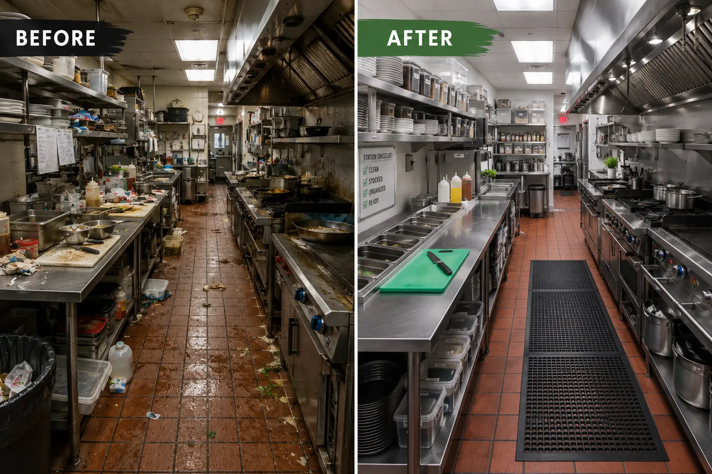

تصور کنید در آشپزخانه یک رستوران بزرگ و شلوغ ایستاده‌اید. برای این‌که یک غذا از سفارش تا روی میز مشتری برسد، باید پنج شش کار مشخص، پشت سر هم و با توالی درستی انجام شود: اول فیش سفارش از صندوق دریافت می‌شود، بعد آماده‌سازی روی فر انجام می‌گیرد، هم‌زمان یا بلافاصله بعد، سوشف آماده‌سازی برنج را انجام می‌دهد، سپس سرآشپز تاچ نهایی و چیدمان غذا را انجام می‌دهد، و در نهایت ویتر بشقاب را سر میز مشتری می‌برد.

حالا فکر کنید در یک شب شلوغ، ده‌ها سفارش هم‌زمان در حال پردازش‌اند و همه این کارها باید از منابع مشترکی مثل فر، ماهیتابه، یخچال، سرآشپز، سوشف، ویتر و صندوق‌دار عبور کنند. هر کدام از این منابع ظرفیت محدودی دارند؛ برخی مثل فر یا صندوق‌دار در هر لحظه فقط می‌توانند یک کار را انجام دهند، برخی دیگر شاید بتوانند هم‌زمان چند کار کوچک را پیش ببرند، اما به‌هرحال محدودند.

سرآشپز آشپزخانه باید تصمیم بگیرد که کدام سفارش زودتر از کدام منبع استفاده کند تا در نهایت، همه غذاها در کوتاه‌ترین زمان ممکن و بدون معطلی روی میز مشتری‌ها برسند. این دقیقاً همان چیزی است که در دنیای بهینه‌سازی به آن «زمان‌بندی تولید کارگاهی» یا Job Shop Scheduling می‌گویند؛ یکی از قدیمی‌ترین و در عین حال سرسخت‌ترین مسائل بهینه‌سازی ترکیبیاتی در حوزه زنجیره تأمین و تولید.

برخلاف [مسائل مسیریابی](/notes/time-dependent-vrp/) که در آن‌ها یک وسیله نقلیه باید بین چند نقطه جغرافیایی حرکت کند، در زمان‌بندی تولید کارگاهی چیزی که «حرکت» می‌کند، خودِ سفارش‌ها (در مثال آشپزخانه، همان سفارش‌های غذا) روی خط زمان هستند. هر سفارش (Job) از مجموعه‌ای عملیات (Operation) تشکیل شده که باید به ترتیب مشخصی روی منابع معین (در کارخانه: ماشین، در آشپزخانه: فر، سرآشپز، ویتر و مانند آن) انجام شوند، و هر عملیات مدت‌زمان مشخصی طول می‌کشد. چالش اصلی این‌جاست: چون همه سفارش‌ها برای استفاده از منابع مشترک با هم رقابت می‌کنند، هر تصمیمی که برای یک سفارش می‌گیریم روی زمان‌بندی بقیه سفارش‌ها هم اثر می‌گذارد؛ درست مثل وقتی که سرآشپز مشغول گارنیش کردن یک غذاست و باید یک سفارش دیگر منتظر بماند.

## فرمول‌بندی ریاضی مسئله

فرض کنید مجموعه‌ای از سفارش‌ها داریم که هر کدام دنباله‌ای از عملیات هستند و باید روی ماشین‌های مشخصی اجرا شوند. هدف معمول، کمینه کردن «مهلت اتمام کل» یا Makespan است؛ یعنی زمانی که آخرین عملیات آخرین سفارش تمام می‌شود. اگر برای هر عملیات $o$ متغیر شروع $s_o$ و مدت ثابت $p_o$ را تعریف کنیم، مسئله را می‌توان این‌گونه نوشت:

$$
\min \; C_{max}
$$

با محدودیت‌های زیر:

$$
s_{o'} \geq s_o + p_o \quad \forall (o, o') \in \text{Precedence}
$$

$$
s_o + p_o \leq C_{max} \quad \forall o
$$

$$
s_o + p_o \leq s_{o'} \; \vee \; s_{o'} + p_{o'} \leq s_o \quad \forall (o, o') \; \text{on same machine}
$$

محدودیت اول ترتیب توالی عملیات‌های یک سفارش را تضمین می‌کند، محدودیت دوم Makespan را به بزرگ‌ترین زمان پایان گره می‌زند، و محدودیت سوم که به آن «محدودیت عدم هم‌پوشانی» (No-Overlap) می‌گویند، تضمین می‌کند دو عملیاتی که روی یک ماشین قرار دارند هرگز هم‌زمان اجرا نشوند. همین محدودیت آخر، که ماهیتی «یا این، یا آن» (Disjunctive) دارد، است که مسئله را از یک برنامه‌ریزی خطی ساده به یک مسئله ترکیبیاتی سخت (NP-hard) تبدیل می‌کند؛ چرا که برای هر جفت عملیات روی یک ماشین باید تصمیم گرفت کدام یک زودتر شروع شود.



## چرا این موضوع مهم است

زمان‌بندی تولید کارگاهی صرفاً یک تمرین دانشگاهی نیست؛ قلب تپنده بسیاری از کارخانه‌ها، کارگاه‌های ماشین‌کاری، و حتی مراکز داده و بیمارستان‌هاست. در صنایع فلزی و قطعه‌سازی، هر روز ده‌ها سفارش با اولویت‌ها و مهلت‌های متفاوت باید بین ماشین‌های محدود توزیع شوند، و یک زمان‌بندی ضعیف می‌تواند به معنای ساعت‌ها بیکاری ماشین، تأخیر در تحویل به مشتری، و افزایش هزینه‌های نگهداری موجودی در جریان تولید باشد. در دنیای امروز که مشتریان انتظار تحویل سریع‌تر و سفارشی‌سازی بیشتر دارند، توانایی یک کارخانه در زمان‌بندی هوشمند منابعش مستقیماً روی رقابت‌پذیری آن اثر می‌گذارد.

جالب است بدانیم که همین مدل ریاضی، با کمی تغییر، در حوزه‌های به‌ظاهر بی‌ربط هم کاربرد دارد: زمان‌بندی پروژه‌های ساختمانی، تخصیص اتاق عمل در بیمارستان‌ها، زمان‌بندی پردازش وظایف روی سرورهای ابری، و حتی برنامه‌ریزی حرکت قطارها روی خطوط مشترک، همگی نسخه‌هایی از همین مسئله زمان‌بندی کارگاهی هستند. این تعمیم‌پذیری بالا، یکی از دلایلی است که این موضوع در ادبیات تحقیق در عملیات این‌قدر پرطرفدار مانده است.

## ظرفیت پژوهشی و آکادمیک

زمان‌بندی تولید کارگاهی یکی از حاصل‌خیزترین زمین‌های پژوهشی در بهینه‌سازی ترکیبیاتی است و هنوز هم مقالات زیادی هر سال درباره آن منتشر می‌شود. یکی از دلایل این ماندگاری، وجود نسخه‌های متعدد و واقعی‌تر مسئله است: زمان‌بندی کارگاهی انعطاف‌پذیر (Flexible Job Shop) که در آن هر عملیات می‌تواند روی چند ماشین جایگزین اجرا شود، زمان‌بندی با زمان‌های راه‌اندازی وابسته به توالی (Sequence-Dependent Setup Times)، و زمان‌بندی پویا که در آن سفارش‌های جدید در حین اجرا وارد سیستم می‌شوند، هر کدام موضوعی جدا برای پایان‌نامه یا مقاله علمی هستند.

از زاویه دیگر، ترکیب زمان‌بندی کارگاهی با عدم‌قطعیت (مثلاً خرابی غیرمنتظره ماشین یا نوسان زمان پردازش) و همچنین ترکیب آن با یادگیری ماشین برای پیش‌بینی و زمان‌بندی هم‌زمان (مثل استفاده از یادگیری تقویتی برای یافتن زمان‌بندی‌های خوب در مقیاس بزرگ)، از مسیرهای پژوهشی بسیار فعال امروز هستند. برای دانشجویانی که به دنبال موضوعی با پایه ریاضی قوی، کاربرد صنعتی روشن و امکان مقایسه با معیارهای استاندارد (Benchmark) شناخته‌شده مثل مجموعه داده‌های Taillard هستند، این حوزه گزینه بسیار مناسبی است.

## پیاده‌سازی با پایتون

خبر خوب این است که برای حل مسائل زمان‌بندی کارگاهی، نیازی به نرم‌افزار یا سالور تجاری گران‌قیمت نیست. کتابخانه متن‌باز [OR-Tools](https://developers.google.com/optimization) گوگل، به‌خصوص ماژول CP-SAT آن که بر پایه برنامه‌ریزی محدودیت (Constraint Programming) کار می‌کند، دقیقاً برای همین نوع مسائل با محدودیت‌های منطقی و ترکیبیاتی طراحی شده است. CP-SAT دارای نوع داده ویژه‌ای به نام `NewIntervalVar` است که مستقیماً بازه‌های زمانی هر عملیات را مدل می‌کند و محدودیت `AddNoOverlap` که دقیقاً همان محدودیت عدم هم‌پوشانی ماشین‌ها را بدون نیاز به نوشتن دستی متغیرهای دودویی پیاده‌سازی می‌کند.

یک رویکرد معمول این است که برای هر سفارش، دنباله بازه‌های زمانی متناظر با عملیات‌هایش را با

$$
s_{o'} \geq s_o + p_o
$$

به هم متصل کنیم، سپس تمام عملیات‌هایی که روی یک ماشین مشترک هستند را در یک محدودیت `AddNoOverlap` قرار دهیم، و در نهایت تابع هدف را کمینه کردن بیشینه زمان پایان (Makespan) تعریف کنیم. برای مسائل با ابعاد متوسط، CP-SAT معمولاً در عرض چند ثانیه تا چند دقیقه به جواب بهینه یا نزدیک به بهینه می‌رسد. اگر هنوز با مبانی برنامه‌ریزی محدودیت در OR-Tools آشنا نیستید، یادداشت [حل همه جواب‌ها با OR-Tools](/notes/cp-intro/) نقطه شروع خوبی است، و یادداشت [حل پازل Domino Fit](/notes/domino-fit-CP/) نمونه دیگری از همین سبک مدل‌سازی محدودیت را نشان می‌دهد.

اگر مسئله بزرگ‌تر و شبکه‌ای‌تر باشد (مثلاً وقتی توالی حمل مواد بین ایستگاه‌ها هم مهم است)، کتابخانه [NetworkX](https://networkx.org/) ابزار خوبی برای مدل‌سازی و تحلیل ساختار جریان کار بین ماشین‌ها است. این ترکیب از ابزارهای کاملاً رایگان و متن‌باز، امکان می‌دهد حتی کارگاه‌های کوچک و متوسط هم بدون هزینه‌های سنگین لایسنس، از بهینه‌سازی ریاضی واقعی بهره ببرند (برای درک اهمیت این مرحله پیش از کدنویسی، یادداشت [مدل‌سازی ریاضی و اهمیت آن](/notes/mathematical-modeling-art/) هم مفید است).

برای این‌که موضوع کاملاً ملموس شود، یک نسخه کوچک از همان مثال آشپزخانه را با داده واقعی می‌سازیم. فرض کنید سه سفارش A، B و C داریم که هر کدام باید طبق یک توالی ثابت از پنج ایستگاه عبور کنند: صندوق (cashier)، فر (oven)، سوشف (sous_chef)، سرآشپز (head_chef) و ویتر (waiter). جدول زیر همان چیزی است که در فایل نمونه `sample_data_job_shop.csv` آمده؛ ستون `sequence` ترتیب اجرای هر عملیات درون سفارش را مشخص می‌کند و مدت‌زمان‌ها بر حسب دقیقه هستند:

| job | sequence | resource | duration_min |
|---|---|---|---|
| A | 1 | cashier | 2 |
| A | 2 | oven | 8 |
| A | 3 | sous_chef | 5 |
| A | 4 | head_chef | 3 |
| A | 5 | waiter | 2 |
| B | 1 | cashier | 2 |
| B | 2 | oven | 6 |
| B | 3 | sous_chef | 4 |
| B | 4 | head_chef | 3 |
| B | 5 | waiter | 2 |
| C | 1 | cashier | 2 |
| C | 2 | oven | 10 |
| C | 3 | sous_chef | 6 |
| C | 4 | head_chef | 4 |
| C | 5 | waiter | 2 |

کد زیر با [OR-Tools](https://developers.google.com/optimization) و ماژول CP-SAT، دقیقاً همین فایل CSV را می‌خواند و مسئله را مدل‌سازی و حل می‌کند تا بهترین زمان‌بندی ممکن برای رسیدن هر سه سفارش به میز مشتری پیدا شود:

```python
import csv
from collections import defaultdict
from ortools.sat.python import cp_model

# خواندن داده از فایل CSV (ستون‌ها: job, sequence, resource, duration_min)
jobs = defaultdict(list)
with open("sample_data_job_shop.csv", newline="", encoding="utf-8") as f:
    for row in csv.DictReader(f):
        jobs[row["job"]].append((int(row["sequence"]), row["resource"], int(row["duration_min"])))

for job_name in jobs:
    jobs[job_name].sort(key=lambda op: op[0])  # مرتب‌سازی طبق ستون sequence

model = cp_model.CpModel()
horizon = sum(d for ops in jobs.values() for _, _, d in ops)

intervals_per_resource = defaultdict(list)
job_ends = []

for job_name, ops in jobs.items():
    prev_end = None
    for seq, resource, duration in ops:
        start = model.NewIntVar(0, horizon, f"start_{job_name}_{seq}")
        end = model.NewIntVar(0, horizon, f"end_{job_name}_{seq}")
        interval = model.NewIntervalVar(start, duration, end, f"interval_{job_name}_{seq}")

        if prev_end is not None:
            model.Add(start >= prev_end)  # رعایت توالی عملیات داخل هر سفارش
        prev_end = end

        intervals_per_resource[resource].append(interval)

    job_ends.append(prev_end)

# هر منبع (cashier، oven، sous_chef، head_chef، waiter) در هر لحظه فقط یک کار انجام می‌دهد
for resource, intervals in intervals_per_resource.items():
    model.AddNoOverlap(intervals)

makespan = model.NewIntVar(0, horizon, "makespan")
model.AddMaxEquality(makespan, job_ends)
model.Minimize(makespan)

solver = cp_model.CpSolver()
status = solver.Solve(model)

if status in (cp_model.OPTIMAL, cp_model.FEASIBLE):
    print("کوتاه‌ترین زمان تحویل کل سفارش‌ها:", solver.Value(makespan), "دقیقه")
```

با اجرای این کد روی داده نمونه بالا، CP-SAT در کسری از ثانیه بهترین ترتیب استفاده از منابع را پیدا می‌کند؛ همان کاری که یک مدیر آشپزخانه باتجربه با حدس و تجربه شخصی انجام می‌دهد، اما این‌جا با تضمین ریاضی برای بهینه بودن جواب.

## سوالات متداول

<h3>آیا زمان‌بندی تولید کارگاهی همان مسئله مسیریابی وسایل نقلیه است؟</h3>
<p>خیر. در مسیریابی وسایل نقلیه (VRP) تصمیم اصلی درباره ترتیب بازدید مکان‌های جغرافیایی توسط وسایل نقلیه است، اما در زمان‌بندی کارگاهی تصمیم اصلی درباره ترتیب انجام عملیات‌ها روی ماشین‌های ثابت در طول زمان است. با این حال، هر دو مسئله از نظر ساختار ریاضی (متغیرهای گسسته و محدودیت‌های منطقی) بسیار به هم شبیه‌اند و اغلب با ابزارهای مشابهی مثل برنامه‌ریزی محدودیت حل می‌شوند.</p>

<h3>برای یادگیری حل این نوع مسائل با پایتون از کجا شروع کنم؟</h3>
<p>اگر با مفاهیم پایه برنامه‌ریزی محدودیت و مدل‌سازی مسائل ترکیبیاتی در پایتون آشنا شوید، انتقال به زمان‌بندی تولید کارگاهی بسیار ساده خواهد بود. دوره <a href="/courses/vrp-python/" style="color:#2563EB; font-weight:bold;">مسیریابی و بهینه‌سازی با پایتون</a> پایه محکمی برای کار با OR-Tools و CP-SAT فراهم می‌کند که مستقیماً در این نوع مسائل زمان‌بندی هم کاربرد دارد.</p>

<h3>آیا این روش برای کارخانه‌های کوچک هم به‌صرفه است؟</h3>
<p>بله. چون ابزارهایی مثل OR-Tools کاملاً رایگان و متن‌باز هستند، حتی یک کارگاه کوچک با چند ماشین هم می‌تواند بدون هزینه لایسنس، از این مدل‌ها برای بهبود زمان‌بندی روزانه استفاده کند. اگر برای پیاده‌سازی مدل مخصوص خط تولید خودتان به راهنمایی نیاز دارید، می‌توانید از طریق صفحه <a href="/consultation/" style="color:#2563EB; font-weight:bold;">مشاوره</a> با ما در ارتباط باشید.</p>
