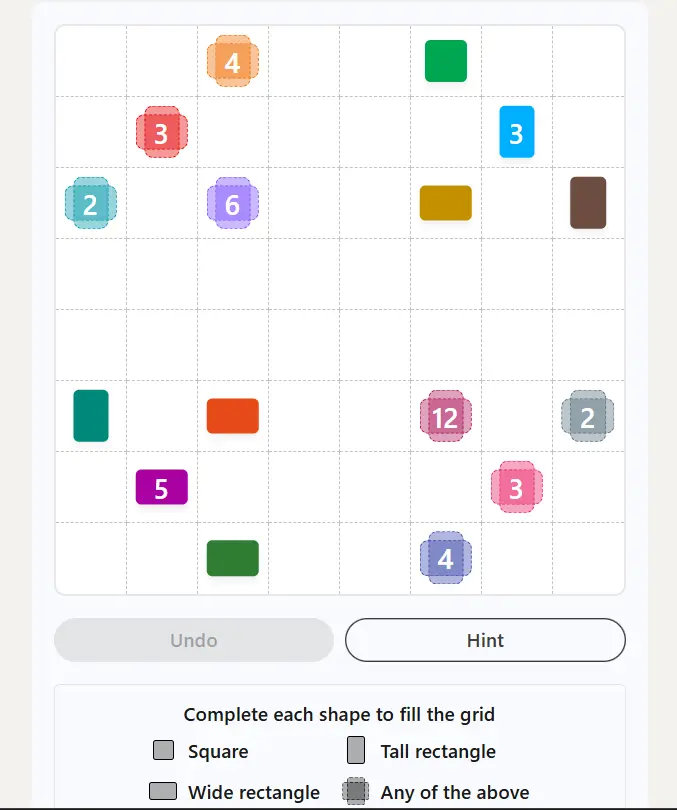
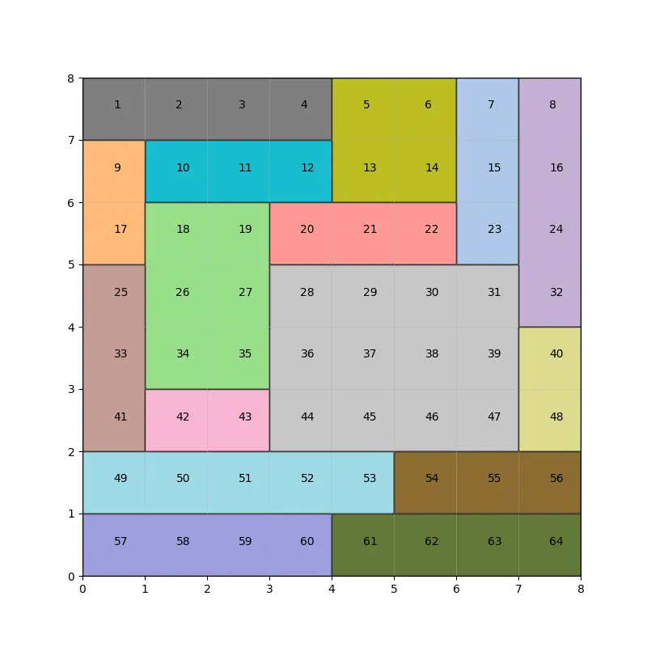

هر روز صبح، میلیون‌ها نفر قبل از باز کردن فید لینکدین، اول سراغ بخش «Games» می‌روند تا پازل روزانه‌شان را حل کنند. یکی از این بازی‌ها Patches نام دارد: یک شبکه‌ی مربعی که داخلش چند عدد راهنما و گاهی چند خانه‌ی از قبل رنگ‌شده وجود دارد.

کار شما این است که کل شبکه را به مستطیل‌های غیرهم‌پوشان تقسیم کنید. هر مستطیل باید دقیقاً یک عدد راهنما داشته باشد و مساحتش با آن عدد برابر باشد. اگر این قانون برایتان آشنا آمد، حق دارید. Patches در واقع نسخه‌ی لینکدینی یک پازل ژاپنی قدیمی و محبوب به نام Shikaku است، به‌معنای «چهارضلعی» یا «تقسیم با جعبه». ناشر Nikoli از دهه‌ی ۱۹۸۰ آن را منتشر می‌کند.

نکته‌ی جالب Patches نسبت به Shikaku کلاسیک این است که گاهی محدودیت‌های اضافه‌ای هم به بازی اضافه می‌شود. مثلاً برخی خانه‌ها از پیش با یک شکل خاص پر شده‌اند؛ مربع، مستطیل عمودی، یا مستطیل افقی. مستطیلی که آن خانه را در بر می‌گیرد باید دقیقاً همان تناسب ابعاد را داشته باشد. این یعنی حل‌کردن پازل دیگر فقط بازی با اعداد نیست. باید هم‌زمان به مساحت، هم به شکل هندسی مستطیل‌ها فکر کنید؛ دقیقاً همان نوع مسئله‌ای که Constraint Programming برایش ساخته شده است.



## مدل‌سازی پازل به زبان بهینه‌سازی

برای مدل‌سازی این پازل با CP، هر عدد راهنما یا خانه‌ی از پیش‌پرشده را نماینده‌ی یک «مستطیل» در نظر می‌گیریم. برای هر مستطیل $i$، دو متغیر بازه‌ای (Interval Variable) تعریف می‌کنیم: یکی برای محور افقی و یکی برای محور عمودی. هر متغیر بازه‌ای از سه بخش تشکیل شده: نقطه‌ی شروع، طول، و نقطه‌ی پایان. در [OR-Tools](https://developers.google.com/optimization) با NewIntervalVar به‌سادگی ساخته می‌شود.

فرض کنید $x^{start}_i, x^{size}_i$ و $y^{start}_i, y^{size}_i$ به‌ترتیب شروع و طول مستطیل $i$ روی محورهای افقی و عمودی باشند. قید اصلی پازل این است که هیچ دو مستطیلی نباید در فضای دوبعدی با هم هم‌پوشانی داشته باشند:

$$
\text{NoOverlap2D}\big(\{(x_i, y_i)\}_{i=1}^{n}\big)
$$

این قید در CP-SAT با تابع آماده‌ی `add_no_overlap_2d` پیاده می‌شود. این تابع دقیقاً همان کاری را انجام می‌دهد که در بسته‌بندی دوبعدی (2D Bin Packing) یا چیدمان قطعات هم می‌بینیم.

علاوه‌بر این، برای هر خانه‌ی شبکه یک متغیر باینری تعریف می‌کنیم. این متغیر نشان می‌دهد آن خانه متعلق به کدام مستطیل است. با قید `add_exactly_one` مطمئن می‌شویم هر خانه دقیقاً به یک مستطیل تعلق دارد؛ نه صفر مستطیل، نه بیشتر از یکی. مساحت هر مستطیل هم با جمع‌زدن خانه‌های متعلق به آن کنترل می‌شود؛ باید با عدد راهنما برابر باشد:

$$
\sum_{c \in \text{cells}} x_{c,i} = v_i \qquad \forall i
$$

برای قید شکل، کافی است طول و عرض مستطیل را با هم مقایسه کنیم. برای مستطیل عمودی می‌خواهیم $y^{size}_i > x^{size}_i$. برای مستطیل افقی برعکسش. برای مربع، برابری کامل $x^{size}_i = y^{size}_i$.

زیبایی این مدل این است که تمام قوانین بازی، از مساحت گرفته تا تناسب ابعاد، با چند خط قید ساده در قالب یک مدل واحد بیان می‌شوند. سالور CP-SAT خودش مسئولیت جست‌وجو در فضای راه‌حل و پیدا کردن پاسخ را برعهده می‌گیرد.


## تحلیل خط‌به‌خط مدل CP-SAT

بیایید فقط بخش هسته‌ای مدل — یعنی جایی که متغیرها و قیدها ساخته می‌شوند — را قدم‌به‌قدم مرور کنیم. اول مدل خالی و متغیرهای تصمیم ساخته می‌شوند:

```python
model = cp_model.CpModel()

u = {c: model.new_bool_var(f"u_{c}") for c in cells}
x = {(c, i): model.new_bool_var(f"x_{c}_{i}") for c in cells
     for i in rects}
```

اینجا برای هر خانه‌ی شبکه (`cells`) و هر مستطیل (`rects`) یک متغیر باینری `x[c, i]` تعریف می‌شود. وقتی برابر ۱ باشد یعنی «خانه‌ی $c$ متعلق به مستطیل $i$ است». این دقیقاً همان متغیرهای عضویتی هستند که در فرمول‌بندی بالا با نماد $x_{c,i}$ نوشتیم.

```python
x_st = {i: model.new_int_var(0, N-1, f"xst_{i}") for i in rects}
x_size = {i: model.new_int_var(1, N, f"xsize_{i}") for i in rects}
x_fn = {i: model.new_int_var(1, N, f"xfn_{i}") for i in rects}

y_st = {i: model.new_int_var(0, N-1, f"yst_{i}") for i in rects}
y_size = {i: model.new_int_var(1, N, f"ysize_{i}") for i in rects}
y_fn = {i: model.new_int_var(1, N, f"yfn_{i}") for i in rects}
```

برای هر مستطیل، سه متغیر عدد صحیح روی هر محور تعریف می‌شود: نقطه‌ی شروع (`_st`)، طول (`_size`) و نقطه‌ی پایان (`_fn`). این سه با هم متغیر بازه‌ای واقعی می‌سازند:

```python
xintervals = {i: model.new_interval_var(x_st[i], x_size[i], x_fn[i], f"xint_{i}")
              for i in rects}
yintervals = {i: model.new_interval_var(y_st[i], y_size[i], y_fn[i], f"yint_{i}")
              for i in rects}
```

`new_interval_var` یک نوع متغیر خاص در CP-SAT است. خودش تضمین می‌کند $x^{fn}_i = x^{start}_i + x^{size}_i$ برقرار بماند. لازم نیست این رابطه را دستی به‌عنوان قید اضافه کنیم. حالا نوبت قید عضویت هر خانه است:

```python
for c in cells:
    if cells[c] in grid:
        i = rects_by_rc[cells[c]]
        model.add(x[c, i] == 1)
    else:
        expr = [x[c, i] for i in rects]
        model.add_exactly_one(expr)
```

اگر خانه‌ی $c$ همان خانه‌ای باشد که یک عدد راهنما یا شکل از پیش‌تعیین‌شده در آن قرار دارد، مستقیماً متغیر عضویتش را برابر ۱ می‌گذاریم؛ چون می‌دانیم دقیقاً به کدام مستطیل تعلق دارد. در غیر این صورت، با `add_exactly_one` مجبورش می‌کنیم دقیقاً به یکی از مستطیل‌ها ملحق شود؛ نه کمتر، نه بیشتر. سپس برای هر مستطیل، قید مساحت و قید مکان هندسی اعمال می‌شود:

```python
for i in rects:
    (rr, cc, dic_data) = rects[i]
    if dic_data["value"]:
        expr = [x[c, i] for c in cells]
        model.add(sum(expr) == dic_data["value"])
    for c in cells:
        (rr, cc) = cells[c]
        xm, ym = cc, N - rr + 1
        model.add(ym <= y_fn[i]).only_enforce_if(x[c, i])
        model.add(ym - 1 >= y_st[i]).only_enforce_if(x[c, i])
        model.add(xm <= x_fn[i]).only_enforce_if(x[c, i])
        model.add(xm - 1 >= x_st[i]).only_enforce_if(x[c, i])
```

خط `sum(expr) == dic_data["value"]` همان قید مساحت است که پیش‌تر با $\sum_c x_{c,i} = v_i$ نوشتیم. چهار خط بعدی هم با کمک `only_enforce_if` یک شرط بیان می‌کنند: «اگر خانه‌ی $c$ به مستطیل $i$ تعلق دارد، آن‌گاه مختصات این خانه باید داخل بازه‌ی افقی و عمودی همان مستطیل بیفتد». این همان چیزی است که پیش‌تر به‌صورت شرطی توصیف کردیم؛ اینجا با قیدهای Reified (شرطی) در CP-SAT پیاده‌سازی شده است. در ادامه، قید تناسب ابعاد بر اساس شکل خانه اعمال می‌شود:

```python
    if dic_data["shape"] == "tall_rectangle":
        model.add(y_size[i] > x_size[i])
    elif dic_data["shape"] == "wide_rectangle":
        model.add(y_size[i] < x_size[i])
    elif dic_data["shape"] == "square":
        model.add(y_size[i] == x_size[i])
```

این همان سه حالتی است که در بخش قبل توضیح دادیم: مستطیل عمودی، مستطیل افقی، یا مربع کامل. در پایان، تنها یک خط باقی می‌ماند که کل قید عدم هم‌پوشانی دوبعدی را اعمال می‌کند:

```python
model.add_no_overlap_2d(xintervals_list, yintervals_list)
```

همین یک خط، معادل رابطه‌ی $\text{NoOverlap2D}$ در فرمول‌بندی ریاضی بالاست. تضمین می‌کند هیچ دو مستطیلی، حتی به‌اندازه‌ی یک خانه هم، روی هم نیفتند. نکته‌ی زیبای این مدل این است که با وجود ساده‌بودن خطوط کد، ترکیب متغیرهای بازه‌ای با قیدهای شرطی (Reified Constraints) و `add_no_overlap_2d` کل منطق پیچیده‌ی پازل را در چند خط پایتون خلاصه می‌کند. نیازی به نوشتن حتی یک الگوریتم جست‌وجوی دستی نیست.




## چرا حل پازل با بهینه‌سازی اهمیت دارد

ممکن است در نگاه اول به‌نظر برسد حل یک پازل روزانه سرگرمی صرف است و ارزش صنعتی ندارد. اما واقعیت این است که پازل‌هایی مثل Patches بهترین «آزمایشگاه یادگیری» برای مسائل واقعی‌تر صنعتی‌اند.

همان قید NoOverlap2D که اینجا برای چیدمان مستطیل‌های پازل استفاده شد، در دنیای واقعی هم کاربرد دارد. شرکتی مثل IKEA دقیقاً همین قید را برای برنامه‌ریزی چیدمان بسته‌های کالا در کامیون یا کانتینر نیاز دارد (Bin Packing سه‌بعدی). شرکت‌های تولید مبل و کاغذ هم برای کمینه‌کردن ضایعات هنگام برش صفحات بزرگ به قطعات کوچک‌تر از آن بهره می‌برند (Cutting Stock Problem).

به‌همین دلیل، خیلی از تیم‌های تحقیق در عملیات وقتی می‌خواهند مهارت مدل‌سازی محدودیت را به افراد جدید آموزش دهند، از دقیقاً همین نوع پازل‌های ساده و ملموس شروع می‌کنند. قوانین بازی برای همه قابل‌فهم است. اما مدل‌سازی درستش نیاز به همان تفکر ساختاریافته‌ای دارد که در مسائل واقعی صنعتی هم لازم است.

## ظرفیت پژوهشی و آکادمیک

پازل‌های تقسیم مستطیلی مثل Shikaku/Patches در ادبیات علوم کامپیوتر و تحقیق در عملیات جای خالی‌شان کاملاً حس نمی‌شود. اما هسته‌ی ریاضی آن‌ها دقیقاً همان مسئله‌ای است که در چند حوزه‌ی کاملاً واقعی و پرکاربرد هم خودش را نشان می‌دهد؛ یعنی تقسیم یک فضای محدود به قطعاتی با مساحت یا وزن مشخص و بدون هم‌پوشانی. همین موضوع آن را برای کار پژوهشی جذاب می‌کند.

در تقسیم اراضی کشاورزی، وقتی یک قطعه زمین بزرگ باید بین چند وارث یا چند بهره‌بردار تقسیم شود، هدف معمولاً روشن است. هر سهم باید مساحت مشخصی داشته باشد، شکلی قابل‌کشت و نه بیش‌ازحد کشیده بگیرد، و در عین حال به منبع آب یا جاده دسترسی داشته باشد. این دقیقاً همان ترکیب قید مساحت و قید تناسب ابعاد است که در مدل پازل دیدیم، به‌علاوه‌ی قیدهای همسایگی.

حوزه‌بندی انتخاباتی در ایالات متحده (Redistricting) هم نسخه‌ی سیاسی و بسیار حساس‌تر همین مسئله است. باید نقشه‌ی یک ایالت را به چند ناحیه تقسیم کرد که هرکدام تقریباً جمعیت برابر داشته باشند. این نواحی باید از نظر جغرافیایی پیوسته و فشرده باشند، نه کشیده و بی‌شکل. در عین حال باید به قوانین رعایت اقلیت‌ها هم پایبند بمانند. این مسئله سال‌هاست موضوع جدی مقالات علمی در تقاطع علوم سیاسی و بهینه‌سازی ترکیبی است.

در مقیاس کوچک‌تر و اضطراری‌تر، تصور کنید یک سوله یا سالن ورزشی بعد از زلزله یا سیل به مرکز امداد موقت تبدیل شده. فضای داخلی آن باید به بخش‌های تریاژ، بستری موقت، انبار دارو و استراحت پرسنل تقسیم شود. این هم دقیقاً همین ساختار را دارد: هر بخش باید مساحت کافی برای عملکردش داشته باشد، شکل مناسب بگیرد (نه راهروهای بیش‌ازحد باریک)، و در کنار بخش‌های مرتبط قرار گیرد.

پژوهش در هرکدام از این سه مسیر می‌تواند پایه‌ی یک پایان‌نامه یا مقاله‌ی مستقل باشد؛ از الگوریتم‌های دقیق و فراابتکاری برای نمونه‌های بزرگ‌مقیاس این مسئله‌ی NP-hard، تا نحوه‌ی بیان قیدهای همسایگی و فشردگی در یک مدل CP یا MILP.

از زاویه‌ای دیگر، طراحی پازل‌های جدید با تضمین «پاسخ یکتا» (Unique Solution Guarantee) خودش یک مسئله‌ی جالب است؛ یک مسئله‌ی بهینه‌سازی معکوس (Inverse Optimization). کمتر به آن پرداخته شده و می‌تواند موضوع مناسبی برای یک پروژه‌ی پژوهشی مستقل باشد.

## پیاده‌سازی با پایتون

خبر خوب این است که برای حل چنین پازل‌هایی، هیچ نیازی به نرم‌افزار یا سالور تجاری گران‌قیمت نیست. [OR-Tools](https://developers.google.com/optimization) گوگل، و به‌طور مشخص ماژول CP-SAT آن، دقیقاً برای این نوع مسائل ترکیبی طراحی شده و کاملاً رایگان و متن‌باز است. با تعریف متغیرهای بازه‌ای برای هر مستطیل، تعریف متغیرهای باینری برای عضویت هر خانه در یک مستطیل، و افزودن قیدهای `add_exactly_one`، `add_no_overlap_2d` و مقایسه‌ی ابعاد، مدل کامل پازل در کمتر از صد خط کد پایتون قابل نوشتن است.

یک نکته‌ی عملی مفید هم استفاده از قابلیت Solution Callback در CP-SAT است. این قابلیت به شما اجازه می‌دهد هر بار که سالور یک پاسخ پیدا کرد، بلافاصله آن را ذخیره کنید. توجه کنید این پاسخ لزوماً بهینه نیست، چون این مسئله بیشتر یک مسئله‌ی ارضای محدودیت است تا بهینه‌سازی.

می‌توانید این پاسخ را با [Matplotlib](https://matplotlib.org/) روی یک شبکه رسم کنید. همان‌طور که برای [پازل تقویم](/notes/puzzle-calendar-cp/)، [پازل Tiling](/notes/tiling-puzzle-cp/) و [پازل Domino Fit](/notes/domino-fit-cp/) قبلاً در سایت نشان داده‌ایم. این رویکرد گام‌به‌گام کمک می‌کند فرایند جست‌وجوی سالور را به‌صورت بصری دنبال کنید. همچنین شهود بهتری نسبت به نحوه‌ی کار CP-SAT پیدا می‌کنید.

<h3>آیا این مدل فقط برای پازل Patches لینکدین کار می‌کند؟</h3>
<p>خیر. همین مدل با تغییرات جزئی برای هر پازل تقسیم مستطیلی دیگری قابل استفاده است؛ از جمله نسخه‌ی کلاسیک Shikaku. حتی برای مسائل واقعی‌تر مثل چیدمان قطعات در برش صفحه یا بسته‌بندی دوبعدی هم کاربرد دارد.</p>

<h3>برای یادگیری Constraint Programming و OR-Tools از کجا شروع کنم؟</h3>
<p>دوره <a href="/courses/vrp-python/" style="color:#2563EB; font-weight:bold;">مسیریابی و زمان‌بندی با پایتون</a> پایه‌ی محکمی برای یادگیری CP-SAT می‌دهد. از متغیرهای بازه‌ای گرفته تا قیدهای عدم هم‌پوشانی، مدل‌سازی این‌جور مسائل ترکیبی را پوشش می‌دهد.</p>

<h3>اگر بخواهم مسئله‌ی بسته‌بندی یا برش واقعی کسب‌وکارم را با همین رویکرد مدل کنم چه کار کنم؟</h3>
<p>می‌توانید از طریق صفحه <a href="/consultation/" style="color:#2563EB; font-weight:bold;">مشاوره</a> جزئیات مسئله‌تان را در میان بگذارید. مدل CP یا MILP متناسب با محدودیت‌های واقعی آن طراحی می‌شود.</p>
