## چرا میکرودرس؟

هر میکرودرس یک مسئله‌ی کاملاً مستقل است؛ نه به درس قبلی نیاز دارد، نه به درس بعدی. می‌توانید فقط یکی، دوتا یا سه‌تا از آن‌ها را بردارید، دقیقاً همان‌هایی که به کارتان می‌آیند. برای شروع لازم نیست کل مجموعه را بخرید یا منتظر یک دوره‌ی بلند بمانید. اگر تازه با مدل‌سازی ریاضی آشنا می‌شوید، یادداشت [آشنایی با برنامه‌ریزی محدودیت](/notes/cp-intro/) نقطه‌ی شروع خوبی است.

## میکرودرس ۱ — حداکثر جریان در شبکه

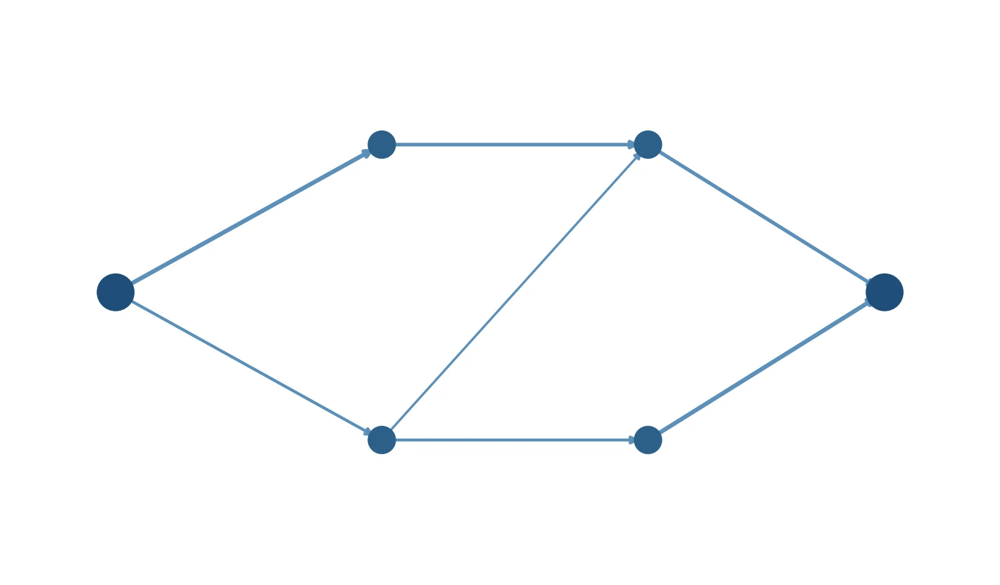

فرض کنید یک شبکه‌ی جهت‌دار دارید، مثل خطوط لوله، جاده یا کابل، که هر مسیرش یک سقف ظرفیت دارد. سؤال این است: چه‌قدر می‌توان از یک نقطه‌ی شروع به یک نقطه‌ی پایان، در واحد زمان، جریان فرستاد بدون این‌که ظرفیت هیچ مسیری نقض شود؟ در این درس یاد می‌گیرید چطور این مسئله را با پایتون و یک سالور قدرتمند مدل و حل کنید و نتیجه را روی نقشه‌ی شبکه ببینید. همراه این میکرودرس، کد کامل پایتون و ویدیوی آموزشی گام‌به‌گام را دریافت می‌کنید.

## میکرودرس ۲ — تخصیص بهینه‌ی افراد به وظایف

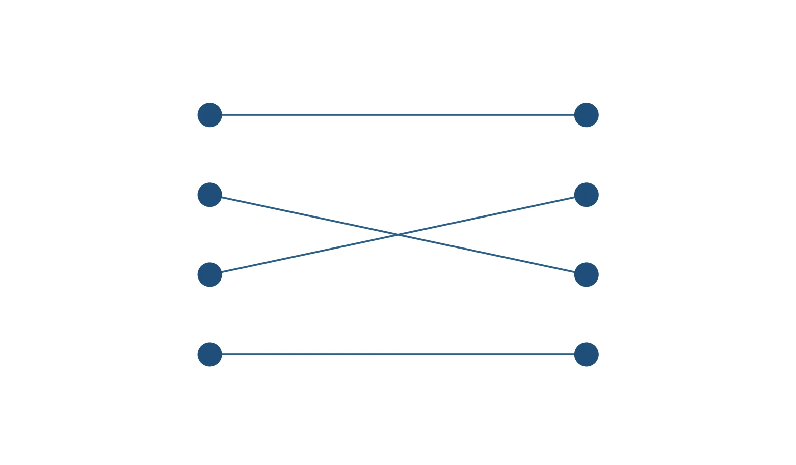

چند نفر دارید و چند وظیفه، و هزینه‌ی انجام هر وظیفه توسط هر نفر فرق می‌کند. چطور افراد را به وظایف بدهید که هزینه‌ی کل کمینه شود، بدون این‌که کسی بیش از یک وظیفه بگیرد یا وظیفه‌ای بی‌صاحب بماند؟ این درس یکی از پرکاربردترین الگوهای تصمیم‌گیری دنیای واقعی را با یک مثال ساده و کد کامل آموزش می‌دهد. همراه این میکرودرس، کد کامل پایتون و ویدیوی آموزشی گام‌به‌گام را دریافت می‌کنید.

## میکرودرس ۳ — کوله‌پشتی و بسته‌بندی چندسطلی

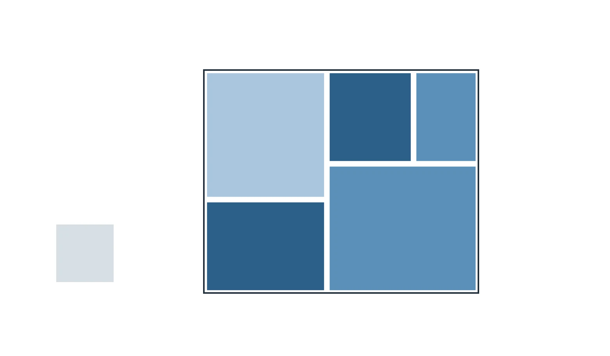

از میان مجموعه‌ای از اقلام، هرکدام با ارزش و وزن مشخص، باید زیرمجموعه‌ای انتخاب کنید که بیشترین ارزش را بدهد بدون عبور از ظرفیت وزنی. سپس مسئله را به حالت واقعی‌تری می‌بریم: چند «سطل» ظرفیت‌دار داریم و باید اقلام را بین آن‌ها پخش کنیم. این درس پایه‌ی هر مسئله‌ی تخصیص منابع محدود است، از انبارداری تا بودجه‌بندی. همراه این میکرودرس، کد کامل پایتون و ویدیوی آموزشی گام‌به‌گام را دریافت می‌کنید.

## میکرودرس ۴ — بیشینه‌سازی صمیمیت در چیدمان گروهی

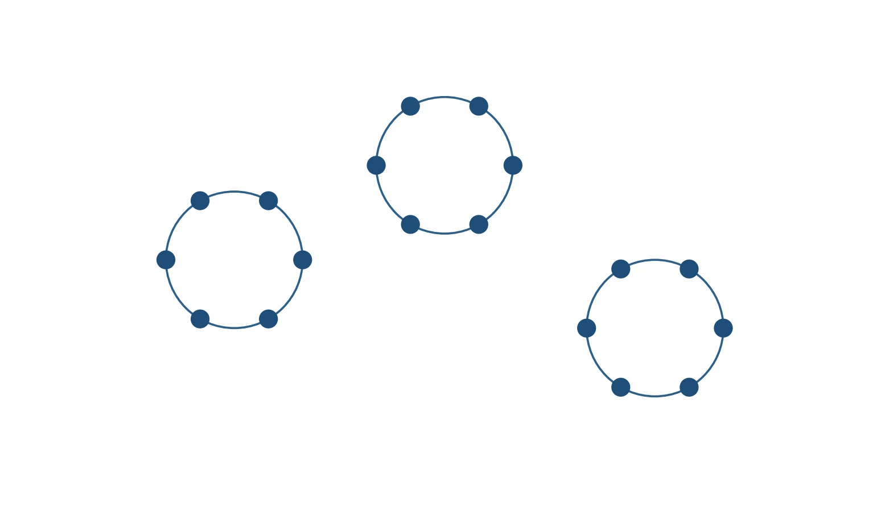

می‌خواهید عده‌ای را دور چند میز بنشانید طوری که میزان «صمیمیت» یا تناسب افراد هم‌میز بیشینه شود، با رعایت ظرفیت هر میز. چالش اصلی این است که رابطه‌ی «دو نفر هم‌میزند»، که از ترکیب دو تصمیم ساخته می‌شود، به زبان ریاضی خطی تبدیل شود. این درس یک تکنیک مدل‌سازی کلیدی را روی یک مثال ملموس و سرگرم‌کننده آموزش می‌دهد. همراه این میکرودرس، کد کامل پایتون و ویدیوی آموزشی گام‌به‌گام را دریافت می‌کنید.

## میکرودرس ۵ — زمان‌بندی کارها بدون تداخل منابع

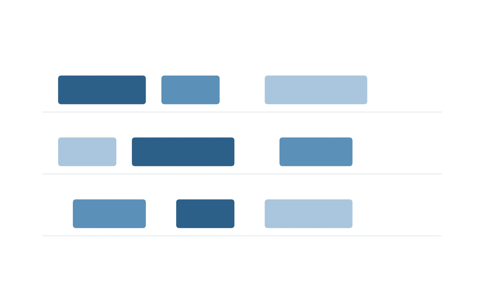

چند کار دارید که هرکدام باید روی چند ماشین، به ترتیب مشخص و در زمان معین انجام شود، و هیچ دو کاری نباید هم‌زمان از یک ماشین استفاده کنند. هدف، کمینه‌کردن زمان اتمام کل کارهاست. این درس ابزار استاندارد صنعت برای زمان‌بندی تولید را معرفی می‌کند و خروجی را به‌صورت نمودار گانت نشان می‌دهد. اگر می‌خواهید عمیق‌تر وارد این حوزه شوید، یادداشت [زمان‌بندی جاب‌شاپ با CP-SAT](/notes/job-shop-scheduling-cp-sat/) را هم ببینید. همراه این میکرودرس، کد کامل پایتون و ویدیوی آموزشی گام‌به‌گام را دریافت می‌کنید.

## میکرودرس ۶ — حل جدول با قیود منطقی محض

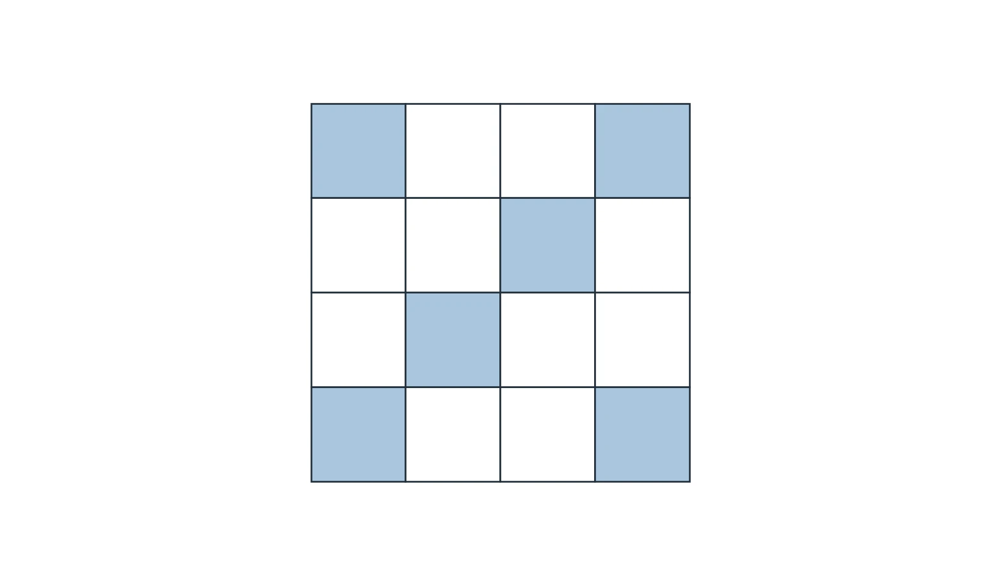

در یک جدول n×n باید عددها را طوری بچینید که مجموع هر سطر، ستون و قطر برابر باشد؛ بدون این‌که هیچ «هدفی» برای بیشینه یا کمینه کردن داشته باشید، فقط یک چیدمان شدنی پیدا کنید. این درس نشان می‌دهد ابزارهای بهینه‌سازی چطور حتی بدون تابع هدف هم می‌توانند مسائل منطقی پیچیده را به‌سرعت حل کنند. همراه این میکرودرس، کد کامل پایتون و ویدیوی آموزشی گام‌به‌گام را دریافت می‌کنید.

## میکرودرس ۷ — بزرگ‌ترین گروه کاملاً مرتبط در یک شبکه

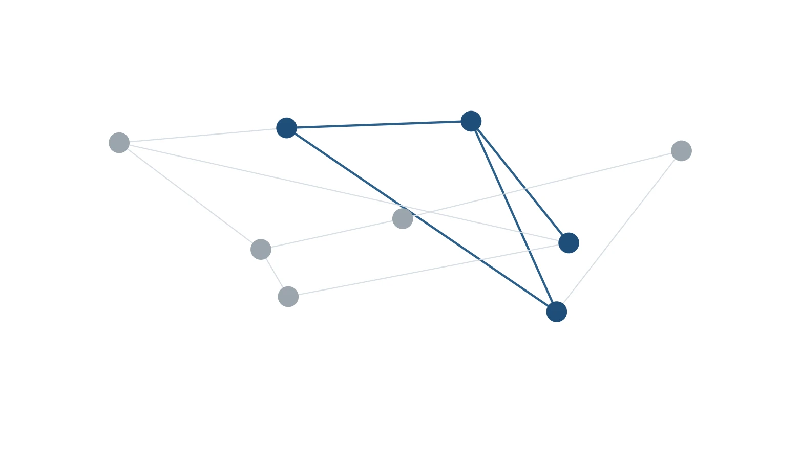

در یک گراف از ارتباطات، مثلاً آشنایی افراد یا اتصال گره‌ها، می‌خواهید بزرگ‌ترین زیرمجموعه‌ای را پیدا کنید که همه‌ی اعضایش دوبه‌دو با هم مرتبط‌اند. این درس تحلیل گراف را با یک کتابخانه‌ی تخصصی پایتون معرفی می‌کند و یک الگوی مدل‌سازی مهم را که در بسیاری مسائل دیگر هم تکرار می‌شود، آموزش می‌دهد. همراه این میکرودرس، کد کامل پایتون و ویدیوی آموزشی گام‌به‌گام را دریافت می‌کنید.

## میکرودرس ۸ — چیدمان متوازن یک برنامه‌ی زمانی با پیش‌نیاز

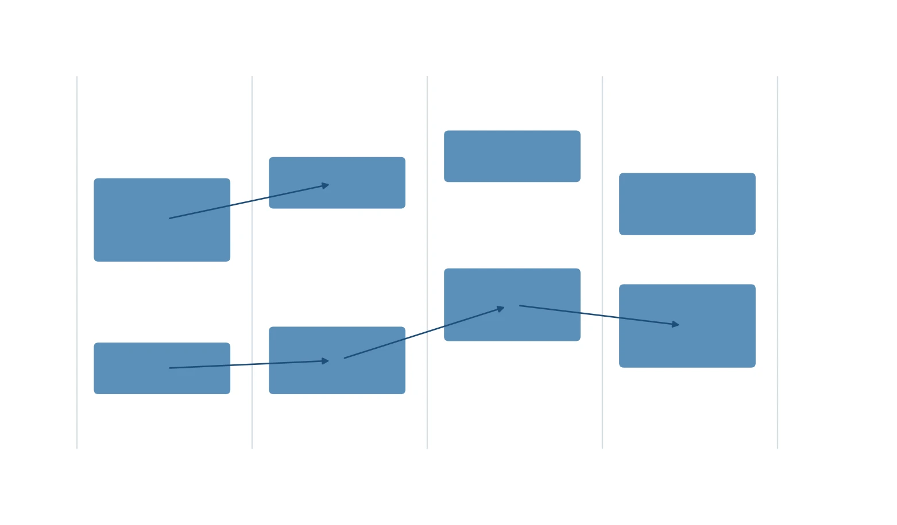

باید فعالیت‌ها یا درس‌هایی را در چند دوره‌ی زمانی بچینید، در حالی که هر فعالیت پیش‌نیازهایی دارد که باید زودتر انجام شده باشند، و بار کاری هر دوره هم نباید خیلی نامتوازن باشد. این درس نشان می‌دهد چطور قیود پیش‌نیازی و هدف توازن بار را هم‌زمان در یک مدل بگنجانید. همراه این میکرودرس، کد کامل پایتون و ویدیوی آموزشی گام‌به‌گام را دریافت می‌کنید.

## میکرودرس ۹ — پخش حداکثری نقاط در یک فضا

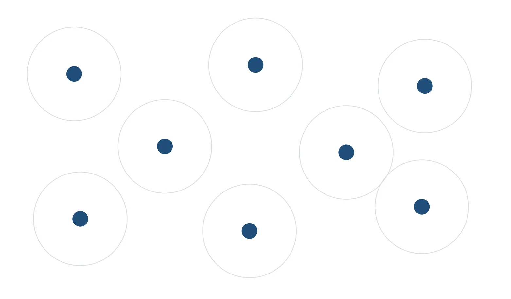

N نقطه، مثلاً ربات، آنتن یا تجهیزات، را در یک صفحه طوری جانمایی کنید که کمترین فاصله‌ی بین هر دو نقطه، تا حد ممکن بزرگ شود؛ یعنی نقاط تا جای ممکن از هم دور بیفتند. این درس با یک رابطه‌ی غیرخطی، یعنی فاصله‌ی اقلیدسی، سروکار دارد و یاد می‌گیرید چنین روابطی را در یک مدل بهینه‌سازی عدد صحیح بگنجانید. همراه این میکرودرس، کد کامل پایتون و ویدیوی آموزشی گام‌به‌گام را دریافت می‌کنید.

## میکرودرس ۱۰ — کوتاه‌ترین مسیر بازدید از همه‌ی نقاط

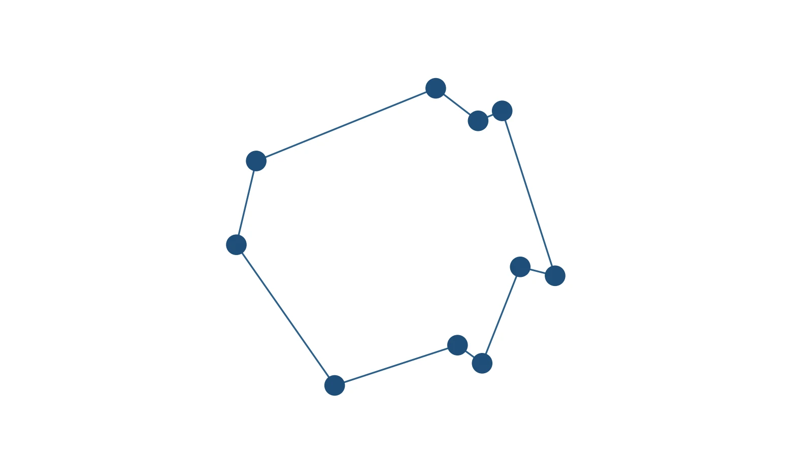

فرض کنید باید از صد نقطه‌ی پراکنده عبور کنید و به نقطه‌ی شروع برگردید؛ کدام ترتیب، کل مسافت پیموده‌شده را کمینه می‌کند؟ این یکی از مشهورترین مسائل بهینه‌سازی دنیاست و این درس نشان می‌دهد چطور با یک ابزار مدل‌سازی مدرن، آن را در چند خط کد حل کنید، بدون نیاز به الگوریتم‌های پیچیده‌ی دست‌ساز. همراه این میکرودرس، کد کامل پایتون و ویدیوی آموزشی گام‌به‌گام را دریافت می‌کنید.

## میکرودرس ۱۱ — مسیر بازدید با ترتیب اجباری و توقف‌های اختیاری

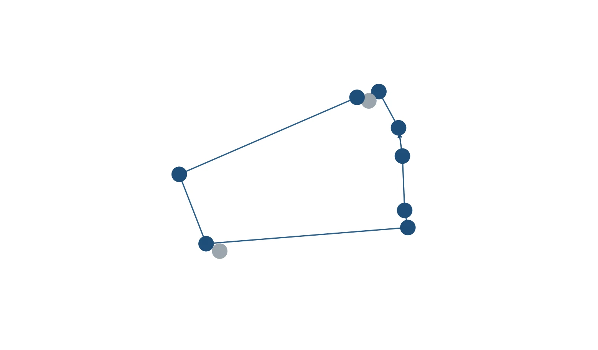

گاهی لازم نیست همه‌ی نقاط را ببینید، و گاهی باید حتماً نقطه‌ای را قبل از نقطه‌ی دیگر ببینید. این درس دو حالت واقعی‌تر از مسئله‌ی مسیریابی را آموزش می‌دهد: مسیری که فقط زیرمجموعه‌ای از نقاط را پوشش می‌دهد تا در هزینه صرفه‌جویی شود، و مسیری که باید ترتیب خاصی از بازدیدها را رعایت کند. همراه این میکرودرس، کد کامل پایتون و ویدیوی آموزشی گام‌به‌گام را دریافت می‌کنید.

## میکرودرس ۱۲ — مسیریابی با بازه‌ی زمانی مجاز برای هر توقف

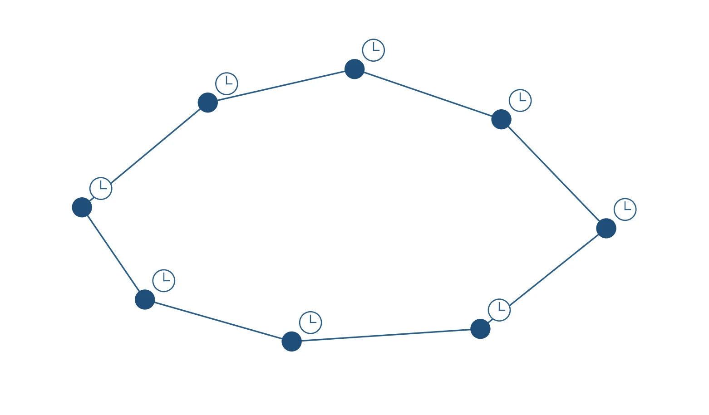

هر نقطه‌ای که باید بازدید کنید، یک بازه‌ی زمانی مجاز دارد؛ نه زودتر، نه دیرتر. باید هم ترتیب بازدید و هم زمان دقیق رسیدن به هر نقطه را هم‌زمان تعیین کنید. این درس نشان می‌دهد چطور زمان را به‌عنوان یک متغیر در طول مسیر منتشر کنید و قیود زمانی واقعی را مدل کنید؛ دقیقاً چیزی که در لجستیک واقعی هر روز اتفاق می‌افتد. همراه این میکرودرس، کد کامل پایتون و ویدیوی آموزشی گام‌به‌گام را دریافت می‌کنید.

## میکرودرس ۱۳ — مسیریابی چندوسیله با مبدأ مشترک

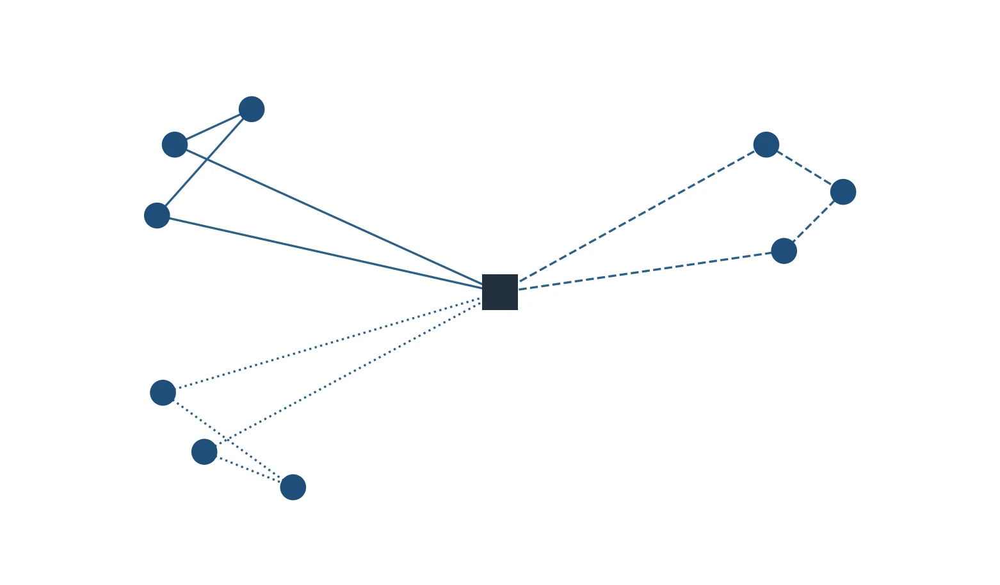

به‌جای یک مسیر، چند وسیله از یک نقطه‌ی مرکزی حرکت می‌کنند تا با کمترین تعداد وسیله و کمترین مسافت، همه‌ی مقصدها را پوشش دهند. این درس گام اول ورود به مسیریابی واقعی چندوسیله‌ای است و نشان می‌دهد چطور تصمیم «کدام وسیله کدام مسیر را برود» به‌طور هم‌زمان گرفته می‌شود. برای دیدن حالت‌های عمومی‌تر این خانواده از مسائل، یادداشت [مسئله‌ی مسیریابی تعمیم‌یافته‌ی وسایل نقلیه](/notes/generalized-vehicle-routing-problem/) را هم ببینید. همراه این میکرودرس، کد کامل پایتون و ویدیوی آموزشی گام‌به‌گام را دریافت می‌کنید.

## میکرودرس ۱۴ — مسیریابی با محدودیت ظرفیت حمل

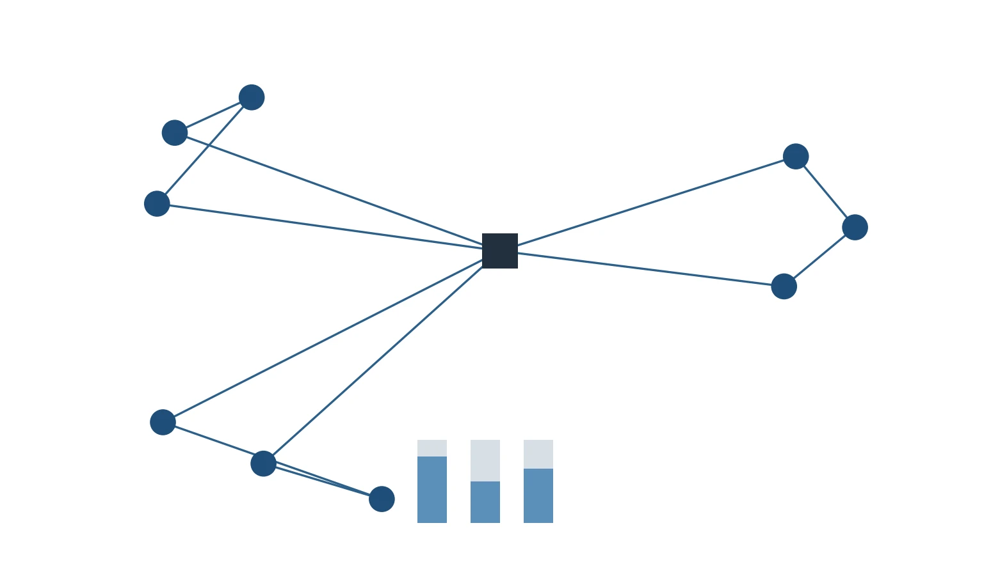

هر وسیله ظرفیت حمل محدودی دارد و هر مقصد تقاضای مشخصی. باید مسیرها را طوری بچینید که جمع تقاضای هر مسیر از ظرفیت وسیله‌ی مربوطه بیشتر نشود، و در عین حال کل مسافت کمینه بماند. این درس مرز بین مسیریابی ساده و مسیریابی واقعیِ صنعتی را نشان می‌دهد. همراه این میکرودرس، کد کامل پایتون و ویدیوی آموزشی گام‌به‌گام را دریافت می‌کنید.

## میکرودرس ۱۵ — مسیریابی با چند نقطه‌ی شروع هم‌زمان

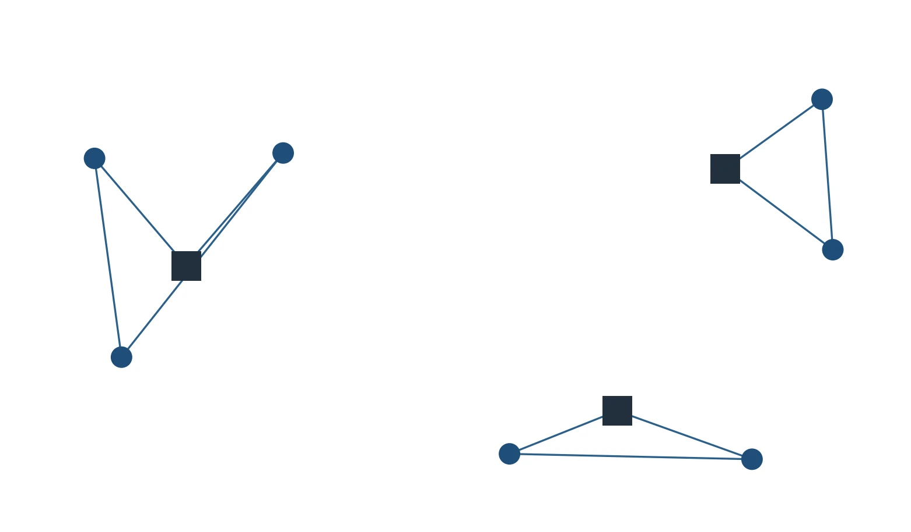

به‌جای یک انبار مرکزی، چند نقطه‌ی شروع دارید و باید هم‌زمان تصمیم بگیرید هر وسیله از کدام نقطه حرکت کند و کدام مقصدها را پوشش دهد. این درس حالت واقعی شبکه‌های توزیع بزرگ با چند مرکز پخش را مدل می‌کند. همراه این میکرودرس، کد کامل پایتون و ویدیوی آموزشی گام‌به‌گام را دریافت می‌کنید.

## میکرودرس ۱۶ — تحویل تقسیم‌شده بین چند وسیله

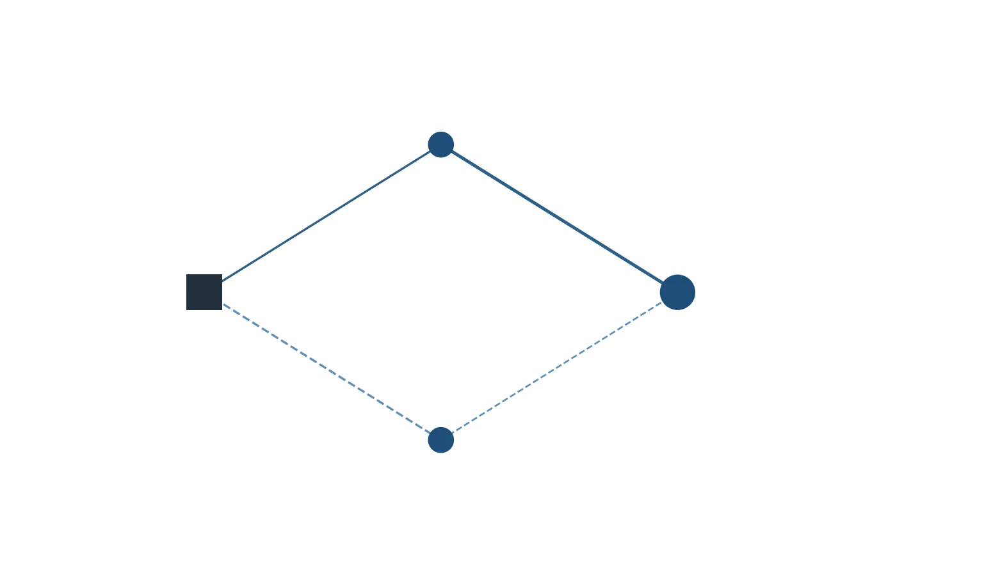

گاهی تقاضای یک مقصد آن‌قدر بزرگ است که یک وسیله به‌تنهایی نمی‌تواند آن را پوشش دهد. این درس نشان می‌دهد چطور فرض «هر مقصد فقط یک‌بار سرویس می‌گیرد» را کنار بگذارید و اجازه دهید تقاضا بین چند وسیله تقسیم شود؛ رویکردی که در لجستیک حجیم، مثل سوخت یا مواد فله، ضروری است. همراه این میکرودرس، کد کامل پایتون و ویدیوی آموزشی گام‌به‌گام را دریافت می‌کنید.

## میکرودرس ۱۷ — مسیریابی با محدودیت برد باتری

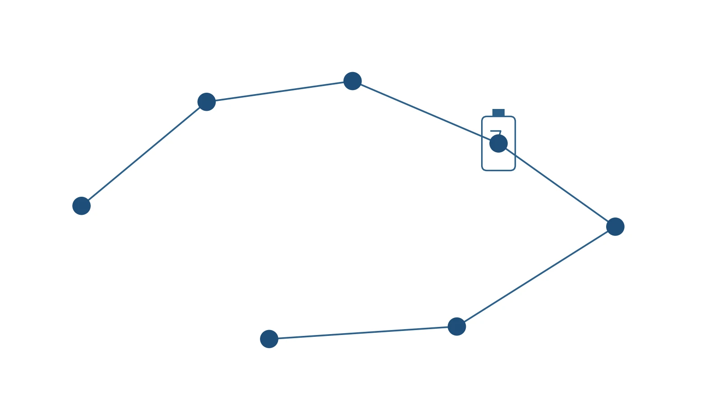

وسیله‌ای دارید که برد محدودی دارد و با طی هر مسیر، شارژش کم می‌شود. باید مسیر را طوری طراحی کنید که وسط راه شارژ تمام نکند؛ و در نسخه‌ی واقعی‌تر، از ایستگاه‌های شارژ میان‌راهی هم استفاده کنید. این درس یکی از داغ‌ترین مسائل روز حمل‌ونقل سبز را آموزش می‌دهد. همراه این میکرودرس، کد کامل پایتون و ویدیوی آموزشی گام‌به‌گام را دریافت می‌کنید.

## میکرودرس ۱۸ — پوشش غیرمستقیم نقاط دورافتاده

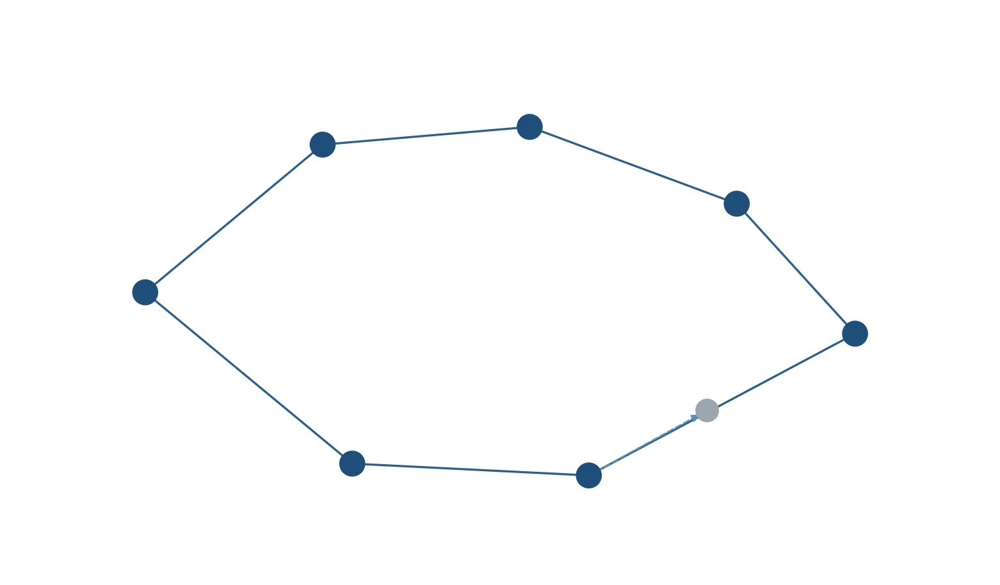

بعضی مقصدها آن‌قدر از مسیر اصلی دورند که بازدید مستقیم از آن‌ها به‌صرفه نیست. این درس نشان می‌دهد چطور تقاضای چنین مقصدهایی را از طریق نزدیک‌ترین نقطه‌ی روی مسیر پوشش دهید؛ جایگزینی اقتصادی برای کشاندن مسیر اصلی تا هر نقطه‌ی دورافتاده. همراه این میکرودرس، کد کامل پایتون و ویدیوی آموزشی گام‌به‌گام را دریافت می‌کنید.

## میکرودرس ۱۹ — مسیریابی و مدیریت موجودی هم‌زمان

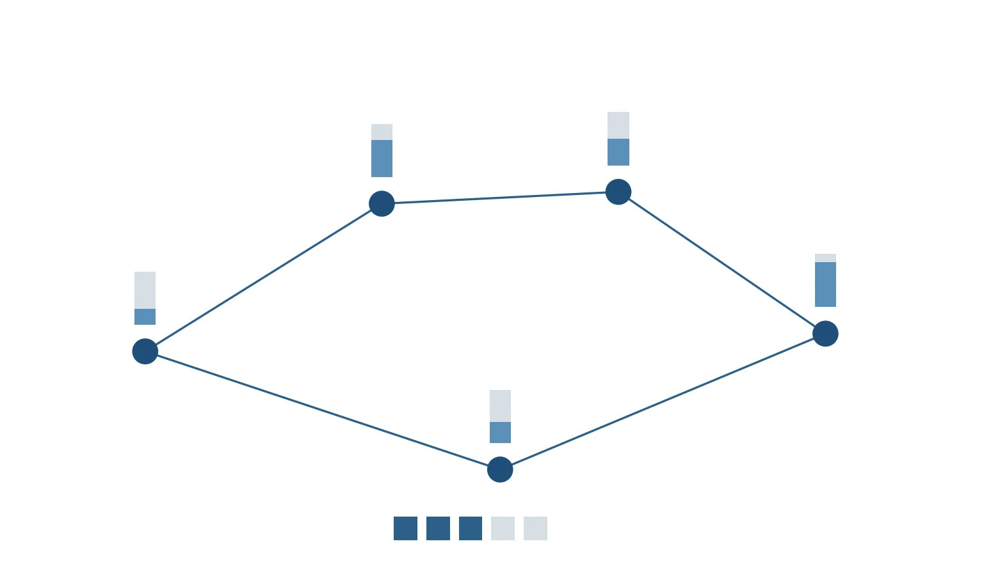

در یک افق چندروزه، باید هم تصمیم بگیرید هر مقصد چه روزی بازدید شود و چه مقدار برایش تحویل داده شود، طوری که نه موجودی‌اش هیچ‌وقت کم بیاورد، نه مسافت کل زیاد شود. این درس ترکیب دو دنیا، یعنی مسیریابی و زنجیره‌ی تأمین، را در یک مدل واحد نشان می‌دهد. همراه این میکرودرس، کد کامل پایتون و ویدیوی آموزشی گام‌به‌گام را دریافت می‌کنید.

## میکرودرس ۲۰ — مسیر شبکه‌ای با ترتیب (پازل خانه‌ها)

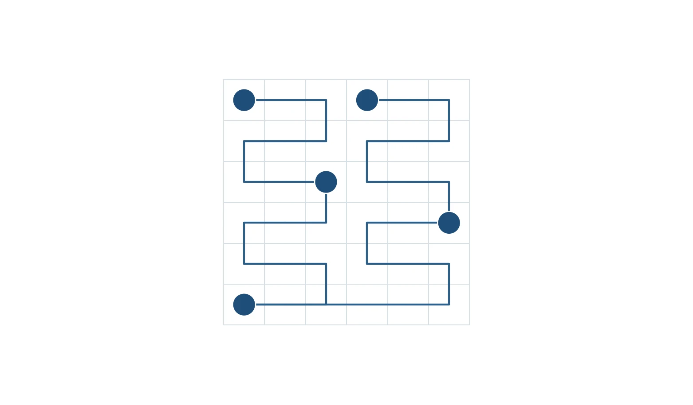

در یک جدول چندخانه‌ای فقط حرکت به خانه‌های هم‌مرز مجاز است و باید یک مسیر پیوسته طراحی کنید که همه‌ی خانه‌ها را دقیقاً یک‌بار بپوشاند و از چند نقطه‌ی شماره‌گذاری‌شده هم به ترتیب عبور کند. این درس یک پازل سرگرم‌کننده و در عین حال آموزنده است و نشان می‌دهد چطور قیود همسایگی و ترتیب را در یک مدل واحد کنار هم بگذارید. همراه این میکرودرس، کد کامل پایتون و ویدیوی آموزشی گام‌به‌گام را دریافت می‌کنید.
