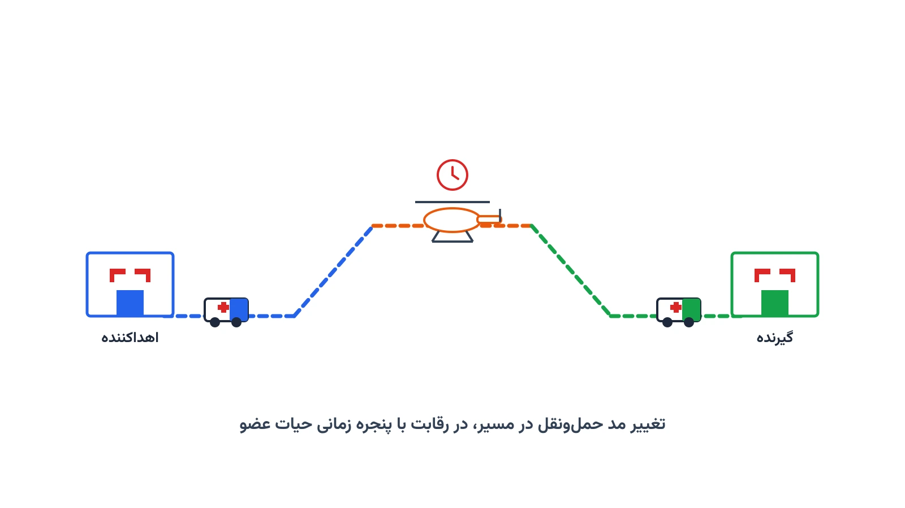

وقتی عضوی برای پیوند آماده می‌شود، یک ساعت نامرئی شروع به شمارش معکوس می‌کند. قلب انسانی تنها حدود چهار تا شش ساعت بیرون از بدن زنده می‌ماند. کبد این بازه را تا دوازده ساعت افزایش می‌دهد. کلیه حتی تا بیست‌وچهار تا سی‌وشش ساعت هم دوام می‌آورد. در همین بازه، عضو باید از بیمارستان اهداکننده به اتاق عمل گیرنده برسد. این یعنی یک مسئله لجستیکی با بالاترین سطح فوریت ممکن.

این مسئله شبیه اعزام آمبولانس معمولی نیست. در اعزام آمبولانس، معمولاً یک وسیله و یک مسیر ساده کافی است. اما انتقال عضو پیوندی اغلب چند وسیله نقلیه را پشت‌سرهم ترکیب می‌کند. ممکن است یک آمبولانس، عضو را به فرودگاه برساند. سپس یک پرواز چارتر یا تجاری آن را به شهر دیگری منتقل کند. در پایان، آمبولانس دومی آن را به بیمارستان گیرنده برساند. هر انتقال بین دو وسیله، خودش منبع تأخیر و ریسک است.

### چرا مسیریابی معمولی کافی نیست

در مسیریابی معمولی، هدف اغلب کمینه‌کردن فاصله یا هزینه سفر است. اینجا هدف اصلی، تضمین رسیدن زیر یک سقف زمانی سخت است. پزشکان این سقف را بر اساس نوع عضو تعیین می‌کنند. تأخیر کوچک می‌تواند به معنای از دست رفتن کامل عضو باشد. به همین دلیل، مسئله شبیه مسیریابی با پنجره زمانی سخت است. تفاوت اینجاست که این پنجره، از لحظه برداشت عضو شروع می‌شود، نه از یک افق از پیش مشخص.

علاوه‌بر این، زمان سفر زمینی به ترافیک و ساعت روز وابسته است. این دقیقاً همان چالشی است که در یادداشت [مسئله مسیریابی وابسته به زمان](/notes/time-dependent-vrp/) بررسی شده است. وقتی عضو شب‌هنگام منتقل می‌شود، ترافیک معمولاً کم است. در ساعت اوج ترافیک شهری، همان مسیر می‌تواند دو برابر طول بکشد. مدل تصمیم‌گیری باید این نوسان را از ابتدا در نظر بگیرد.

### فرمول‌بندی ریاضی یک مدل ساده

می‌توان مسئله را به‌صورت یک شبکه چندوجهی زمان-گسترده مدل کرد. هر گره این شبکه، یک موقعیت در یک لحظه خاص است. هر یال، یک حرکت با یک وسیله نقلیه مشخص را نشان می‌دهد. برای نمونه، حرکت زمینی، پروازی، یا انتقال بین دو وسیله. هدف، یافتن کوتاه‌ترین مسیر زمانی از مبدأ تا مقصد است.

$$ \min \sum_{(i,j) \in A} t_{ij} x_{ij} $$

$$ \text{s.t.} \quad \sum_{j} x_{ij} - \sum_{j} x_{ji} = b_i \quad \forall i \in V $$

$$ \sum_{(i,j) \in A} t_{ij} x_{ij} \leq T_{\max} $$

$$ x_{ij} \in \{0,1\} $$

در این فرمول‌بندی، $t_{ij}$ زمان طی هر یال شبکه است. $x_{ij}$ متغیر باینری انتخاب آن یال در مسیر نهایی است. $b_i$ موازنه جریان هر گره را مشخص می‌کند؛ مبدأ، مقصد، یا گره میانی. محدودیت سوم، کل زمان مسیر را به سقف حیات عضو $T_{\max}$ محدود می‌کند. اگر هیچ مسیر شدنی‌ای این سقف را رعایت نکند، مدل جواب ناموجه می‌دهد. در عمل، این یعنی باید گزینه گران‌تری مثل پرواز اختصاصی در نظر گرفت.

در دنیای واقعی، پروازهای تجاری یا چارتر زمان حرکت ثابتی دارند. آمبولانس باید دقیقاً پیش از آن زمان به فرودگاه برسد. این نوع قیدهای زمان‌بندی و هماهنگی، مدل را از یک کوتاه‌ترین مسیر ساده فراتر می‌برد. اینجا، برنامه‌ریزی محدودیت با ماژول CP-SAT در [OR-Tools](https://developers.google.com/optimization) ابزار مناسب‌تری است.

### اهمیت این موضوع در دنیای واقعی

این مسئله صرفاً یک تمرین دانشگاهی نیست. شرکتی مثل FedEx Custom Critical در آمریکا، به‌طور تخصصی در حمل‌ونقل زمان‌بحرانی فعالیت می‌کند. بخشی از این فعالیت، انتقال عضو و بافت پیوندی بین بیمارستان‌هاست. چنین شرکت‌هایی باید شبکه‌ای از وسایل نقلیه زمینی و هوایی را هماهنگ کنند. آن‌ها همزمان باید با برنامه پروازی فرودگاه‌ها و برنامه عمل بیمارستان‌ها هماهنگ شوند. هر دقیقه تأخیر، هزینه‌ای انسانی دارد که با هیچ هزینه مالی قابل‌مقایسه نیست.

در آمریکا، سازمان ملی هماهنگی پیوند، تطبیق اهداکننده و گیرنده را انجام می‌دهد. اما مسئولیت لجستیک فیزیکی اغلب بر عهده بیمارستان‌ها و شرکت‌های حمل‌ونقل تخصصی است. در کشورهایی با جغرافیای وسیع یا زیرساخت جاده‌ای ضعیف‌تر، فاصله جغرافیایی به‌تنهایی می‌تواند چالش اصلی باشد. بهینه‌سازی این مسیرها، نرخ موفقیت پیوند عضو را مستقیماً تحت تأثیر قرار می‌دهد.

### ظرفیت کار آکادمیک و پژوهشی

این حوزه تلفیقی از چند زیرشاخه پژوهشی تحقیق در عملیات است. یک مسیر، کوتاه‌ترین مسیر چندوجهی با پنجره زمانی سخت است. مسیر دیگر، هماهنگی زمان‌بندی بین وسایل نقلیه مختلف است. مسیر پژوهشی جذاب دیگر، مدل‌سازی عدم‌قطعیت در زمان سفر زمینی و تأخیر پرواز است.

در این حالت، به‌جای یک زمان قطعی، می‌توان از سناریوهای چندگانه یا توزیع احتمال استفاده کرد. این رویکرد می‌تواند با مبانی [مدل‌سازی عدم‌قطعیت](/courses/uncertainty-modeling/) هم ترکیب شود. مسئله مکان‌یابی بهینه پایگاه‌های هلیکوپتر اورژانس برای کاهش میانگین زمان انتقال نیز هنوز باز است. بسیاری از ایده‌های مطرح‌شده در یادداشت [مکان‌یابی ایستگاه آمبولانس با پایتون](/notes/ambulance-location-mclp/)، با کمی تعدیل، در این زمینه هم کاربرد دارند.

### پیاده‌سازی با پایتون

خبر خوب این است که هسته این مدل‌ها نیاز به نرم‌افزار گران‌قیمت ندارد. می‌توان شبکه چندوجهی مسیرها را با کتابخانه [NetworkX](https://networkx.org/) ساخت. هر گره شبکه، یک موقعیت-زمان است. هر یال، یک حرکت با وسیله مشخص و زمان معین است. سپس می‌توان کوتاه‌ترین مسیر شدنی را با الگوریتم‌های استاندارد این کتابخانه محاسبه کرد.

وقتی قیدهای منطقی بیشتری مثل هماهنگی دقیق با ساعت پرواز وارد می‌شود، کار پیچیده‌تر می‌شود. آنجا [OR-Tools](https://developers.google.com/optimization) گوگل و ماژول CP-SAT آن گزینه قدرتمندتری است. این ماژول برای برنامه‌ریزی محدودیت طراحی شده است. می‌تواند قیدهای زمان‌بندی و توالی پیچیده را به‌خوبی مدل کند.

داده‌های ورودی مسئله را می‌توان از یک فایل اکسل یا CSV خواند. این فایل می‌تواند فهرست بیمارستان‌ها، فرودگاه‌های نزدیک، و زمان تقریبی هر قطعه از مسیر را در بر بگیرد. همچنین می‌تواند ساعت پروازهای موجود در آن مسیر را هم شامل شود. برای بخش‌های برنامه‌ریزی خطی این مسئله، سالورهای متن‌باز مثل [CBC](https://github.com/coin-or/Cbc) یا [HiGHS](https://highs.dev/) به‌خوبی عمل می‌کنند. این یعنی حتی یک تیم کوچک در یک بیمارستان منطقه‌ای هم می‌تواند چنین ابزاری را برای تصمیم‌گیری سریع پیاده‌سازی کند.

### سوالات متداول

<h3>چرا این مسئله را نمی‌توان با یک مسیریاب معمولی مثل نقشه‌های آنلاین حل کرد؟</h3>

نقشه‌های آنلاین فقط یک وسیله نقلیه و یک مد حمل‌ونقل را در نظر می‌گیرند. مسئله انتقال عضو، ترکیب چند وسیله، هماهنگی زمانی دقیق، و یک سقف زمانی سخت زیستی را همزمان مدیریت می‌کند. این سطح از پیچیدگی به یک مدل بهینه‌سازی اختصاصی نیاز دارد.

<h3>آیا این مدل‌ها فقط برای کشورهای با سیستم سلامت پیشرفته کاربرد دارند؟</h3>

خیر. هر کشوری که برنامه پیوند عضو دارد، با همین چالش مسیریابی و زمان روبه‌روست. حتی با منابع محدودتر، بهینه‌سازی ساده مسیرها می‌تواند نرخ موفقیت پیوند را بهبود دهد. می‌خواهید مبانی این مدل‌سازی را با OR-Tools و CP-SAT یاد بگیرید؟ دوره <a href="/courses/health-opt/" style="color:#2563EB; font-weight:bold;">بهینه‌سازی سیستم‌های سلامت با پایتون</a> دقیقاً برای همین منظور طراحی شده است.

<h3>اگر بیمارستان یا سازمان ما بخواهد چنین سیستمی را پیاده‌سازی کند، از کجا شروع کنیم؟</h3>

هر بیمارستان و هر منطقه جغرافیایی، شبکه حمل‌ونقل و محدودیت‌های خاص خودش را دارد. مدل‌های عمومی باید متناسب با داده‌های واقعی شما تنظیم شوند. برای چنین پیاده‌سازی اختصاصی و متناسب با شرایط واقعی سازمان شما، می‌توانید از خدمات <a href="/consultation/" style="color:#2563EB; font-weight:bold;">مشاوره</a> استفاده کنید.

