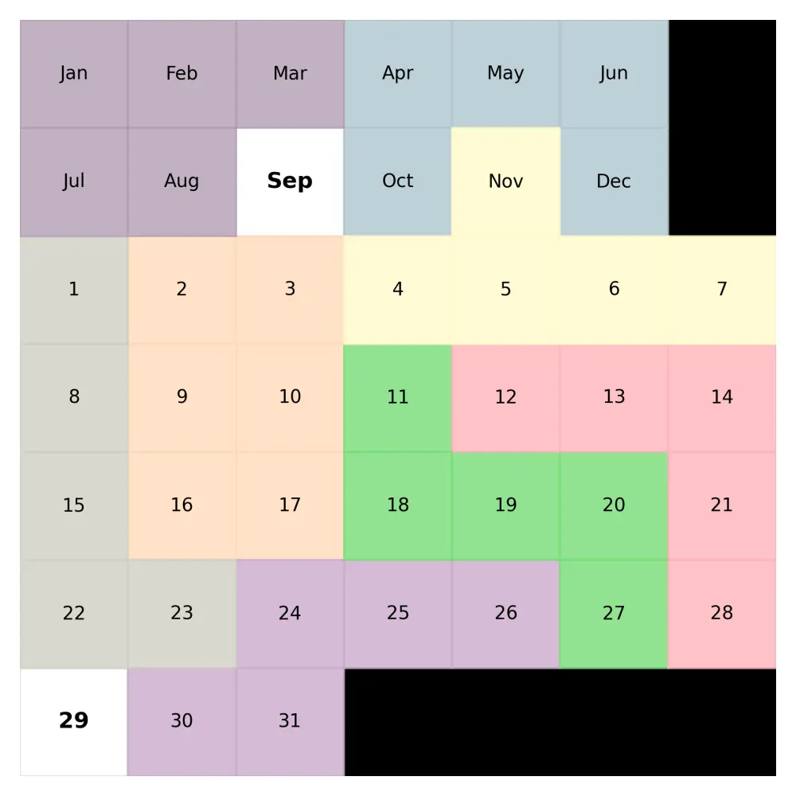
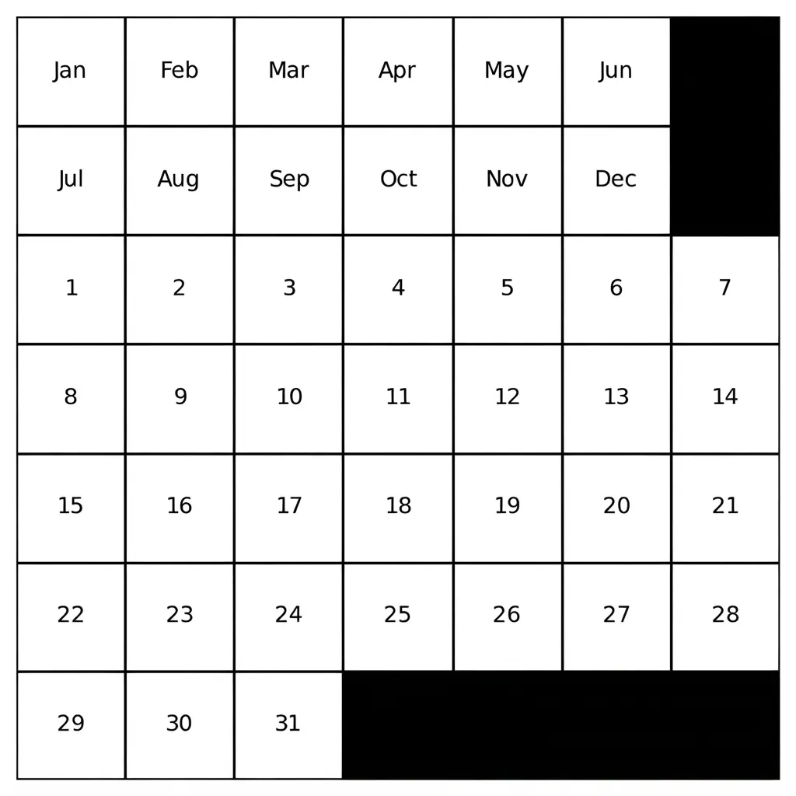
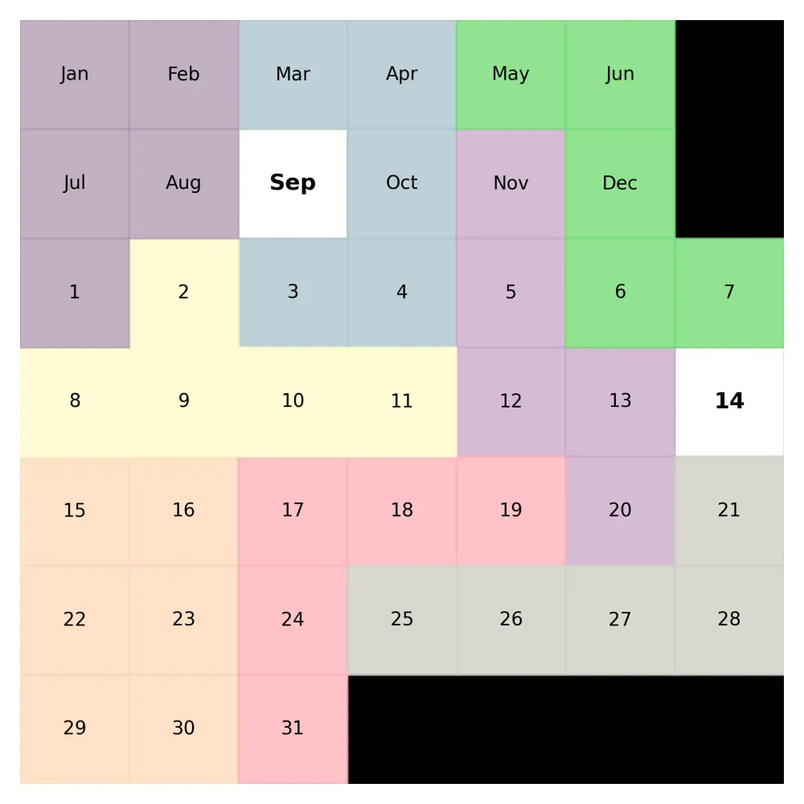

معمولاً وقتی به تقویم نگاه می‌کنید، فقط می‌خواهید تاریخ یک روز مشخص، مثلاً امروز، را بدانید. اما وقتی یکی از دوستانتان نظرتان را درباره یک پازل مرتبط با تقویم می‌پرسد، ماجرا کمی فرق می‌کند.

شما تاریخ را می‌دانید و باید هشت قطعه چوبی مختلف را روی صفحه بچینید، طوری که همه خانه‌ها پوشیده شوند، به‌جز دو خانه مربوط به ماه و روز مورد نظر. اجازه دارید همه قطعات را بچرخانید، برعکس کنید و به‌صورت افقی یا عمودی جابه‌جا کنید تا برای هر روز، چیدمان درست را پیدا کنید. این یک اسباب‌بازی محبوب در بین علاقه‌مندان به ریاضی است.

من سعی کردم این مسئله را با برنامه‌ریزی محدودیتی حل کنم (اگر با مفهوم مدل‌سازی ریاضی پیش از کدنویسی آشنا نیستید، یادداشت [مدل‌سازی ریاضی و اهمیت آن](/notes/mathematical-modeling-art/) مقدمه خوبی است).
اول از همه باید قطعات را بشناسید. این‌ها همان قطعات هستند:

```python
shapes = [
    np.array([
        [1,0,1],
        [1,1,1]
    ]),
    np.array([
        [1,1,1],
        [1,1,1]
    ]),
    np.array([
        [1,1,1,0],
        [0,0,1,1]
    ]),
    np.array([
        [1,1,0],
        [0,1,0],
        [0,1,1]
    ]),
    np.array([
        [1,0,0],
        [1,0,0],
        [1,1,1]
    ]),
    np.array([
        [0,1,0,0],
        [1,1,1,1]
    ]),
    np.array([
        [0,0,0,1],
        [1,1,1,1]
    ]),
    np.array([
        [1,1,1],
        [0,1,1]
    ])
]
```

یکی از راه‌های چیدن آن‌ها این است:



با استفاده از کتابخانه numpy می‌توانیم به‌راحتی هر قطعه را بچرخانیم و برعکس کنیم تا ببینیم آیا شکل جدیدی ساخته می‌شود یا نه. بعد از این مرحله، هر شکل اصلی ممکن است چند نسخه (variant) داشته باشد.

* برای هر شکل اصلی: دقیقاً یکی از نسخه‌های آن باید روی صفحه قرار بگیرد.
* هر خانه از صفحه باید دقیقاً با یک قطعه پوشیده شود (به‌جز خانه‌های تاریخ که باید نمایان بمانند).
* هنگام چیدن قطعات روی صفحه، نباید از صفحه بیرون بزنند یا روی خانه‌های مشکی (بلاک‌شده) قرار بگیرند.
* البته باید مختصات و مقدار نوشته‌شده روی هر خانه از صفحه را هم بدانید.





## مجموعه‌ها (Sets)

* $\Omega = \{0,1,\dots,7\}$: مجموعه ۸ شکل اصلی (`shapes`)
* $\mathcal{V}_\omega$: مجموعه تمام حالت‌های هندسی متمایز (چرخش ۰°/۹۰°/۱۸۰°/۲۷۰° و قرینه افقی/عمودی) شکل اصلی $\omega$ (`comprehensive_shapes[i]`)
* $\mathcal{S} = \bigcup_{\omega \in \Omega} \mathcal{V}_\omega$: مجموعه کل حالت‌های هندسی یکتا در بین همه شکل‌ها (`shapes_all`)
* $\mathcal{N}$: مجموعه خانه‌های معتبر صفحه، یعنی خانه‌هایی که یک برچسب ماه یا روز دارند (`candidates`)
* $\mathcal{D} \subset \mathcal{N}$: دقیقاً دو خانه متناظر با ماه و روز جاری که باید نمایان (پوشیده‌نشده) بمانند (`actual_date`)

## پارامترها (Parameters)

* $C_s$: مجموعه مختصات نسبی خانه‌هایی که شکل $s$ اشغال می‌کند، نسبت به خانه مرجع آن (`all_shapes[s]`)
* $\text{valid}(s,n) \in \{0,1\}$: برابر ۱ اگر بتوان شکل $s$ را طوری روی صفحه گذاشت که خانه مرجعش روی $n$ باشد، بدون بیرون‌زدگی از صفحه، برخورد با خانه‌های ممنوعه، یا پوشاندن خانه‌های $\mathcal{D}$ (تابع `check(s, n)`)
* $\text{cov}(s,m,n) \in \{0,1\}$: برابر ۱ اگر گذاشتن شکل $s$ با خانه مرجع $m$ باعث پوشاندن خانه $n$ شود (تابع `covers(m, n, s)`)

## متغیرهای تصمیم (Variables)

* $U_s \in \{0,1\}$ برای هر $s \in \mathcal{S}$: آیا این حالت هندسی خاص به‌عنوان نماینده شکل اصلی‌اش انتخاب شده است (`U[s]`)
* $\text{Place}_{s,n} \in \{0,1\}$ برای هر جفت معتبر $(s,n)$: آیا شکل $s$ با خانه مرجع $n$ روی صفحه گذاشته شده است (`place[s,n]`)
* $\text{Cov}_n \in \{0,1\}$ برای هر $n \in \mathcal{N}$: آیا خانه $n$ در نهایت پوشیده شده است (`covered[n]`)

## تابع هدف

$$
\text{find any feasible } (U, \text{Place}, \text{Cov})
$$

**توضیح:** برخلاف یک مدل بهینه‌سازی معمول، این مدل هیچ `Minimize`/`Maximize`ای ندارد. کل مسئله یک مسئله ارضای محدودیت است: فقط باید یک چیدمان شدنی از ۸ قطعه پیدا شود که همه محدودیت‌های زیر را برآورده کند. سالور CP-SAT به‌محض یافتن اولین جواب شدنی، وضعیت را «OPTIMAL» گزارش می‌کند چون هدفی برای بهبود وجود ندارد.

## محدودیت‌ها

### دقیقاً یک حالت هندسی از هر شکل اصلی

$$
\sum_{s \in \mathcal{V}_\omega} U_s = 1 \qquad \forall \omega \in \Omega
\tag{1}
$$

**توضیح:** چون هر شکل اصلی می‌تواند در چند حالت چرخیده/قرینه‌شده ظاهر شود، این محدودیت تضمین می‌کند که از بین همه آن حالت‌ها، دقیقاً یکی برای قرار گرفتن روی صفحه انتخاب شود؛ در کد با `model.AddExactlyOne(expr)` پیاده‌سازی شده است.

### قرارگیری هر شکل انتخاب‌شده، دقیقاً یک‌بار

$$
\sum_{\substack{n \in \mathcal{N} \\ \text{valid}(s,n)=1}} \text{Place}_{s,n} = U_s \qquad \forall s \in \mathcal{S}
\tag{2}
$$

**توضیح:** اگر حالت هندسی $s$ انتخاب شده باشد ($U_s=1$)، باید دقیقاً یک‌بار روی صفحه جای بگیرد؛ اگر انتخاب نشده باشد ($U_s=0$)، هیچ‌کجا نباید قرار بگیرد. مجموع‌گیری فقط روی خانه‌های $n$ ای انجام می‌شود که قرارگیری شکل $s$ در آن‌ها از نظر هندسی مجاز است.

### خالی ماندن خانه‌های تاریخ جاری

$$
\text{Cov}_n = 0 \qquad \forall n \in \mathcal{D}
\tag{3}
$$

**توضیح:** دو خانه‌ای که ماه و روز جاری را نشان می‌دهند باید همیشه نمایان بمانند. در کد این هم به‌صورت مستقیم اعمال شده (`model.Add(covered[open_c] == 0)`) و هم به‌طور غیرمستقیم، چون تابع `valid(s,n)` از ابتدا اجازه نمی‌دهد هیچ شکلی این دو خانه را بپوشاند.

### پیوند بین قرارگیری قطعات و پوشش خانه‌ها

$$
\text{Cov}_n \;\ge\; \sum_{s \in \mathcal{S}} \sum_{\substack{m \in \mathcal{N} \\ \text{valid}(s,m)=1 \\ \text{cov}(s,m,n)=1}} \text{Place}_{s,m} \qquad \forall n \in \mathcal{N}
\tag{4}
$$

**توضیح:** این رابطه متغیر بولی $\text{Cov}_n$ را به تصمیم‌های قرارگیری قطعات وصل می‌کند: اگر هر قطعه‌ای، در هر جایی که گذاشته شده، خانه $n$ را بپوشاند، آنگاه $\text{Cov}_n$ باید حداقل ۱ شود. توجه کنید که این یک نامعادله (≥) است، نه تساوی؛ به همین دلیل به‌تنهایی از هم‌پوشانی دو قطعه روی یک خانه جلوگیری نمی‌کند و پوشش کامل صفحه را هم مستقیماً اجبار نمی‌کند.

آنچه در عمل یک کاشی‌کاری کامل و بدون هم‌پوشانی را تضمین می‌کند، این واقعیت هندسی است که مجموع مساحت ۸ قطعه (۴۱ خانه) دقیقاً برابر تعداد خانه‌های آزاد صفحه (۴۳ خانه معتبر منهای ۲ خانه تاریخ) است. یعنی محدودیت (۲) به همراه تابع `valid` عملاً فضای جواب را آن‌قدر تنگ می‌کند که غالباً به یک چیدمان درست منتهی می‌شود، هرچند مدل به‌صورت صریح محدودیت «بدون هم‌پوشانی» یا «پوشش دقیقاً کامل» ندارد.

بگذارید برویم سراغ قسمت جذاب ماجرا (کدنویسی).

## توضیح قیدهای مدل در پایتون

### قید اول

```python
for open_c in actual_date:
    model.Add(covered[open_c] == 0)
```

**توضیح:** برای هر خانه‌ای که ماه یا روز جاری را نشان می‌دهد (`actual_date`)، متغیر `covered` آن خانه برابر صفر ثابت می‌شود. یعنی این قید صریحاً می‌گوید هیچ قطعه‌ای حق ندارد این دو خانه را بپوشاند؛ باید همیشه نمایان بمانند.

### قید دوم

```python
for org_shape, ll in comprehensive_shapes.items():
    expr = [U[s] for s in ll]
    model.AddExactlyOne(expr)
```

**توضیح:** برای هر شکل اصلی (`org_shape`)، از بین تمام حالت‌های چرخیده/قرینه‌شده‌ی آن (`ll`)، دقیقاً یکی باید انتخاب شود، یعنی دقیقاً یکی از متغیرهای `U[s]` در آن گروه برابر ۱ می‌شود. این تضمین می‌کند هر ۸ قطعه اصلی دقیقاً یک‌بار، در یکی از جهت‌گیری‌های ممکنش، در جواب نهایی حاضر باشد؛ نه بیشتر، نه کمتر.

### قید سوم

```python
for s in shapes_all:
    model.Add(sum(place[s, n] for n in candidates if (s, n) in place) == U[s])
```

**توضیح:** برای هر حالت هندسی `s`، مجموع همه متغیرهای مکان‌یابی `place[s, n]` (روی همه خانه‌های معتبر `n`) باید برابر `U[s]` باشد. یعنی اگر آن حالت انتخاب شده باشد (`U[s] = 1`)، باید دقیقاً یک‌بار روی صفحه گذاشته شود؛ اگر انتخاب نشده باشد (`U[s] = 0`)، نباید هیچ‌جا گذاشته شود. این قید متغیرهای انتخاب شکل (`U`) را به متغیرهای مکان قرارگیری (`place`) وصل می‌کند.

### قید چهارم

```python
for n in candidates:
    expr1 = [
        place[s, m]
        for s in shapes_all
        for m in candidates
        if (s, m) in place and covers(m, n, s)
    ]
    model.Add(covered[n] >= sum(expr1))
```

**توضیح:** برای هر خانه `n`، متغیر `covered[n]` باید حداقل به اندازه تعداد قطعاتی باشد که آن خانه را می‌پوشانند (طبق تابع `covers`). چون `covered` یک متغیر بولی است، این عملاً به معنای «اگر حداقل یک قطعه این خانه را بپوشاند، `covered[n]` باید ۱ شود» است. توجه کنید این یک نامساوی (`>=`) است نه تساوی، پس به‌تنهایی جلوی هم‌پوشانی دو قطعه روی یک خانه را نمی‌گیرد؛ آنچه در عمل کاشی‌کاری صحیح را تضمین می‌کند، برابری مساحت کل ۸ قطعه با تعداد خانه‌های آزاد صفحه است.

## کاربردهای علمی و صنعتی

این نوع مدل (پوشش/چیدمان قطعات بدون هم‌پوشانی با برنامه‌ریزی محدودیتی) پایه چندین کاربرد واقعی صنعتی و علمی است:

* **برش صنعتی (Cutting Stock):** برش بهینه پارچه، شیشه، ورق فلزی یا چوب از یک صفحه بزرگ، طوری که ضایعات کمینه شود.

* **بسته‌بندی و چیدمان انبار (Bin/Pallet Packing):** چیدن کارتن‌ها یا بسته‌ها در پالت، کانتینر یا انبار برای استفاده حداکثری از فضا.

* **بارگیری کامیون و کانتینر:** تعیین بهینه ترتیب و جهت بارها در فضای محدود وسیله حمل.

* **طراحی مدار مجتمع و برد الکترونیکی (VLSI/PCB Floorplanning):** جانمایی قطعات یا بلوک‌های مدار روی سطح تراشه بدون تداخل فیزیکی.

* **نستینگ در تولید افزایشی و برش لیزری (Nesting):** چیدمان قطعات دوبعدی روی صفحه چاپگر سه‌بعدی یا میز برش با حداقل فضای هدررفته.

* **زمان‌بندی منابع و پروژه:** تخصیص کارها به ماشین‌آلات یا بازه‌های زمانی با محدودیت عدم تداخل، مشابه ساختار «دقیقاً یک‌بار قرارگیری».

* **مکان‌یابی تسهیلات و پوشش سرویس (Facility Location / Covering):** انتخاب مکان بهینه آنتن‌ها، حسگرها یا ایستگاه‌ها برای پوشش کامل یک منطقه با کمترین تعداد تسهیلات.

* **تخصیص فرکانس و کانال در مخابرات:** انتساب فرکانس به گیرنده‌ها بدون تداخل، با ساختار مشابه قید پوشش.

* **طراحی چیدمان کارخانه (Facility Layout):** جانمایی ایستگاه‌های کاری در یک سالن تولید برای کمینه‌کردن مسیر جابه‌جایی.

* **تحقیقات الگوریتمی و آموزش:** استفاده از پازل‌هایی مثل این به‌عنوان بستر آزمایش کارایی سالورهای CP-SAT و مقایسه روش‌های مدل‌سازی محدودیت.

از کد خواستم چند چیدمان برای روزهای ماه سپتامبر پیدا کند.




کد کامل پایتون هم در صورت نیاز در دسترس است.

همین ساختار را می‌توان از یک پازل ریاضی تا مسائل واقعی جانمایی، بارگیری، انبارداری و زمان‌بندی توسعه داد.

اگر می‌خواهید مدل‌سازی و حل کامل را در Python با OR-Tools قدم‌به‌قدم یاد بگیرید، این موضوع در <a href="/courses/vrp-python/" class="content-link">دوره بهینه‌سازی حمل و نقل</a> به‌صورت پروژه‌محور پوشش داده شده است. اگر می‌خواهید بدون نصب چیزی کد بالا را اجرا کنید، راهنمای [Google Colab](/notes/google-colab/) کمک می‌کند؛ و برای مسائل بهینه‌سازی (نه فقط ارضای محدودیت)، یادداشت [سه روش عملی استفاده از سالورها در Pyomo](/notes/pyomo-solvers/) را هم ببینید.
